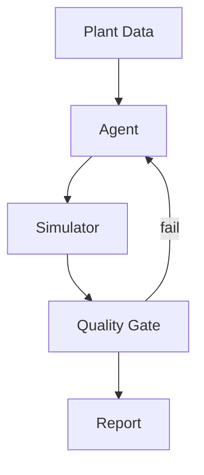

# Skill: Generate Publication-Quality Figures

## Purpose

Create matplotlib figures that meet journal submission standards: correct fonts,
compact sizes, consistent styling, readable labels, and high DPI. Based on
lessons learned from the CPA and TPflash papers (Fluid Phase Equilibria 2026).

## SI Units (MANDATORY)

**All figure axis labels MUST use SI units.** See PAPER_WRITING_GUIDELINES.md
"SI Units (MANDATORY)" for the full reference.

| Axis label examples (GOOD) | NEVER use |
|---|---|
| `Temperature (K)` or `$T$ (K)` | `Temperature (°F)` |
| `Pressure (kPa)` or `$P$ (MPa)` | `Pressure (psi)` or `Pressure (atm)` |
| `Density (kg/m³)` or `$\rho$ (kg/m$^3$)` | `Density (lb/ft³)` |
| `Viscosity (mPa·s)` | `Viscosity (cP)` — numerically equal but use SI name |
| `Flow rate (kg/s)` | `Flow rate (lb/h)` |
| `Energy (kJ/mol)` | `Energy (BTU/lbmol)` |

"bar" is acceptable for pressure axes in engineering contexts (1 bar = 100 kPa).

## When to Use

- Creating figures for any scientific paper in the paperlab
- Regenerating figures after data or style revisions
- Setting up a new `02_generate_figures.py` for a paper project

## Core Setup (Copy-Paste Starter)

Every figure script should start with this rc configuration:

```python
import matplotlib
matplotlib.use("Agg")
import matplotlib.pyplot as plt
import matplotlib.ticker as ticker
import numpy as np
import json
from pathlib import Path

# ── Publication-quality defaults ──────────────────────────────────
plt.rcParams.update({
    "font.family": "serif",
    "font.serif": ["Times New Roman", "DejaVu Serif"],
    "font.size": 9,
    "axes.titlesize": 10,
    "axes.labelsize": 9,
    "xtick.labelsize": 8,
    "ytick.labelsize": 8,
    "legend.fontsize": 8,
    "figure.dpi": 300,
    "savefig.dpi": 300,
    "savefig.bbox_inches": "tight",
    "axes.linewidth": 0.6,
    "xtick.direction": "in",
    "ytick.direction": "in",
    "xtick.major.size": 3,
    "ytick.major.size": 3,
    "xtick.minor.size": 1.5,
    "ytick.minor.size": 1.5,
    "grid.linewidth": 0.3,
    "grid.alpha": 0.4,
    "lines.linewidth": 1.0,
    "lines.markersize": 4,
})

# Consistent color palette
BLUE = "#2171b5"
ORANGE = "#e6550d"
GREEN = "#31a354"
GREY = "#636363"
PALETTE = [BLUE, ORANGE, GREEN, "#756bb1", "#e7298a", "#66a61e"]

# Output directory
FIGURES_DIR = Path(__file__).parent.parent / "figures"
FIGURES_DIR.mkdir(exist_ok=True)
```

## Journal Column Widths

Size figures for the target journal's column width:

| Journal | Single column | Double column | Aspect ratio |
|---------|--------------|---------------|-------------|
| Elsevier (FPE, CACE, CES) | 3.5 in (88 mm) | 7.0 in (178 mm) | 0.75–1.0 |
| ACS (IECR) | 3.25 in | 7.0 in | 0.75–1.0 |
| Wiley (AIChE J.) | 3.4 in | 7.0 in | 0.75–1.0 |

```python
# Figure size templates
FIG_SINGLE = (3.5, 2.8)    # Single-column: width, height
FIG_SINGLE_TALL = (3.5, 3.5)
FIG_DOUBLE = (7.0, 3.5)    # Double-column
FIG_DOUBLE_TALL = (7.0, 5.0)
```

## Common Figure Patterns

### Pattern 1: Bar Chart (Comparison Across Categories)

```python
fig, ax = plt.subplots(figsize=FIG_DOUBLE)
x = np.arange(len(categories))
w = 0.35
bars1 = ax.bar(x - w/2, values_a, w, color=BLUE, edgecolor="white", lw=0.3, label="Method A")
bars2 = ax.bar(x + w/2, values_b, w, color=ORANGE, edgecolor="white", lw=0.3, label="Method B")

ax.set_xticks(x)
ax.set_xticklabels(short_labels, rotation=0)  # NEVER rotate > 30°
ax.set_ylabel("Metric (unit)")
ax.legend(frameon=False, ncol=2)
ax.grid(axis="y", ls="--")
ax.set_axisbelow(True)
fig.savefig(FIGURES_DIR / "fig1_comparison.png")
plt.close()
```

**Key rule:** If category names are long, use short IDs (A1, A2, B1...) with a
legend mapping below the figure or in the caption.

### Pattern 2: Heatmap / Contour (2D Parameter Space)

```python
fig, (ax1, ax2) = plt.subplots(1, 2, figsize=FIG_DOUBLE)

# Use pcolormesh for discrete data, contourf for smooth
im1 = ax1.pcolormesh(T_grid, P_grid, metric_grid_a, cmap="RdYlGn", shading="auto")
im2 = ax2.pcolormesh(T_grid, P_grid, metric_grid_b, cmap="RdYlGn", shading="auto")

for ax, title in zip([ax1, ax2], ["Method A", "Method B"]):
    ax.set_xlabel("$T$ (K)")
    ax.set_ylabel("$P$ (kPa)")
    ax.set_title(title, fontsize=9)

# Shared colorbar
fig.colorbar(im2, ax=[ax1, ax2], label="Iteration count", shrink=0.8, pad=0.02)
fig.savefig(FIGURES_DIR / "fig2_heatmap.png")
plt.close()
```

**Key rule:** NEVER use contour lines on noisy gridded data — they create
ugly loops. Use `pcolormesh` instead. If overlaying contours, use very few
levels (3–5) and ensure the data is smooth.

### Pattern 3: Scatter with Per-Point Labels (Scaling)

When points cluster at the same x-value, labels will overlap. Use these
techniques:

```python
fig, ax = plt.subplots(figsize=FIG_SINGLE_TALL)

# 1. Define manual offsets per data point to prevent overlap
#    Format: {system_id: (dx, dy)} in data coordinates or points
offsets = {
    "A1": (5, -8), "A2": (5, 5), "B1": (-40, 5),
    "B2": (5, 3), "C1": (5, -8), "C2": (5, 5),
}

# 2. Jitter x-coordinates to separate clustered points
np.random.seed(42)
x_jitter = x_values + np.random.uniform(-0.15, 0.15, len(x_values))

ax.scatter(x_jitter, y_values, s=30, color=BLUE, zorder=5)

for i, (sid, xj, yv) in enumerate(zip(system_ids, x_jitter, y_values)):
    dx, dy = offsets.get(sid, (5, 3))
    ax.annotate(sid, (xj, yv), textcoords="offset points",
                xytext=(dx, dy), fontsize=7, color=GREY,
                arrowprops=dict(arrowstyle="-", color=GREY, lw=0.3) if abs(dx) > 10 else None)

ax.set_xlabel("Component count $N_c$")
ax.set_ylabel("Speedup factor")
ax.grid(True, ls="--")
fig.savefig(FIGURES_DIR / "fig4_scaling.png")
plt.close()
```

**Key rules:**
- ALWAYS check for label overlap visually — automated layouts (adjust_text) often fail
- For ≤15 points, define manual `offsets` dict during review
- Use short system IDs (A1, B3) not full names — put the legend in the caption

### Pattern 4: Box Plot with Extreme Outliers

When data has a wide range (e.g., 1× to 30×), standard box plots compress
the majority of the data. Solution: **log scale**.

```python
fig, ax = plt.subplots(figsize=FIG_DOUBLE)

bp = ax.boxplot(data_by_group, labels=short_labels,
                patch_artist=True, showfliers=True, widths=0.5,
                medianprops=dict(color=ORANGE, lw=1.2),
                flierprops=dict(marker="o", ms=3, mfc="none", mec=GREY))

for patch in bp["boxes"]:
    patch.set_facecolor(BLUE)
    patch.set_alpha(0.35)

ax.set_yscale("log")  # Critical for wide-range data
ax.yaxis.set_major_formatter(ticker.FuncFormatter(lambda v, _: f"{v:.1f}" if v < 10 else f"{v:.0f}"))
ax.set_ylabel("Speedup factor")
ax.axhline(y=1.0, color="grey", ls="--", lw=0.6, label="Parity")
ax.grid(True, axis="y", ls="--")
ax.legend(frameon=False)
fig.savefig(FIGURES_DIR / "fig5_boxplot.png")
plt.close()
```

**Key rule:** Use log scale whenever `max/min > 10`. The linear scale will
squash all boxes into a thin band at the bottom.

### Pattern 5: Line Plot with Confidence Bands

```python
fig, ax = plt.subplots(figsize=FIG_SINGLE)

ax.plot(x, y_mean, color=BLUE, lw=1.2, label="Mean")
ax.fill_between(x, y_low, y_high, color=BLUE, alpha=0.15, label="95% CI")
ax.plot(x_ref, y_ref, "o", color=ORANGE, ms=4, label="Reference data")

ax.set_xlabel("Temperature (K)")
ax.set_ylabel("Density (kg/m$^3$)")
ax.legend(frameon=False)
ax.grid(True, ls="--")
fig.savefig(FIGURES_DIR / "fig3_profile.png")
plt.close()
```

### Pattern 6: Parity Plot (Calculated vs Reference)

```python
fig, ax = plt.subplots(figsize=FIG_SINGLE)

ax.scatter(ref_values, calc_values, s=15, c=BLUE, alpha=0.6, edgecolors="none")

# Parity line
lims = [min(min(ref_values), min(calc_values)), max(max(ref_values), max(calc_values))]
ax.plot(lims, lims, "k--", lw=0.6, label="Parity")
# ±10% bands
ax.plot(lims, [l * 1.1 for l in lims], color=GREY, ls=":", lw=0.4)
ax.plot(lims, [l * 0.9 for l in lims], color=GREY, ls=":", lw=0.4)

ax.set_xlabel("Reference value")
ax.set_ylabel("Calculated value")
ax.set_aspect("equal")
ax.legend(frameon=False)
ax.grid(True, ls="--")
fig.savefig(FIGURES_DIR / "fig_parity.png")
plt.close()
```

## Short System ID Convention

For papers with multiple test systems, use short IDs in figures and map them
in a table in the paper:

| ID | System | N_c |
|----|--------|-----|
| A1 | Methane/Ethane | 2 |
| A2 | Methane/Propane/CO₂ | 3 |
| B1 | Lean gas (5-comp) | 5 |
| B2 | Rich gas (8-comp) | 8 |
| C1 | Gas condensate (10-comp) | 10 |
| C2 | Oil (15-comp) | 15 |

Place the full table in the paper (usually Section 4: Benchmark Design) and
reference it from figure captions: "System IDs are defined in Table 1."

## Dual Output (PNG + PDF)

Always save both raster (PNG) and vector (PDF) versions. Journals prefer
vector for line art but PNG is needed for Word embedding:

```python
fig.savefig(FIGURES_DIR / "fig1_comparison.png")
fig.savefig(FIGURES_DIR / "fig1_comparison.pdf")
```

## Figure Quality Checklist

Before finalizing any figure:

- [ ] **Readable at print size**: Text ≥ 7pt when printed at journal column width
- [ ] **No label overlap**: Check scatter plots, bar charts, annotations
- [ ] **Log scale if range > 10×**: Box plots, timing, any wide-range data
- [ ] **Consistent colors**: Same color = same method/category across all figures
- [ ] **Axes labeled with SI units**: Every axis has label + SI unit in parentheses (K, Pa, kg/m³, etc.)
- [ ] **Grid lines**: Dashed, alpha < 0.5, behind data
- [ ] **No excessive whitespace**: Use `bbox_inches="tight"` and compact figsize
- [ ] **Legend readable**: `frameon=False`, placed to minimize overlap with data
- [ ] **300 DPI minimum**: Set in both rcParams and savefig
- [ ] **Serif font**: Times New Roman for Elsevier and most journals
- [ ] **Inward tick marks**: Cleaner look, standard for Elsevier
- [ ] **Short IDs for many points**: Use A1/B1/C1 with caption legend

### Automated Validation

After generating all figures, run the figure validator:

```bash
python paperflow.py validate-figures papers/<paper_slug>/ --journal <journal_name>
```

This checks DPI, file format, minimum dimensions, and color mode against
the journal profile. Fix all `[!!]` items before submission.

### Alternative: Use `figure_style.py` Helper

Instead of manual rcParams setup, you can use the `tools/figure_style.py`
module which wraps SciencePlots with journal presets:

```python
from tools.figure_style import apply_style, save_fig, PALETTE, FIG_SINGLE

apply_style("elsevier")                    # or "ieee", "nature", "acs"
fig, ax = plt.subplots(figsize=FIG_SINGLE) # 3.5 × 2.8 inches
ax.plot(x, y, color=PALETTE[0])
save_fig(fig, "figures/fig01_results.png", dpi=300)
```

## Common Mistakes Caught from CPA Paper

1. **Rotated bar labels**: Never rotate > 30°. Use short IDs instead.
2. **Contour lines on noisy data**: Creates ugly loops. Use pcolormesh.
3. **Linear scale box plots with outliers**: One 30× outlier squashes all
   other boxes to a 1-pixel line. Always use log scale for wide ranges.
4. **Full system names as point labels**: "Methane/Ethane/Propane/n-Butane"
   overlaps with neighbors. Use "B1" and define in table.
5. **Large figure sizes**: 10×8 inch figures waste journal space. Use
   3.5×2.8 (single) or 7.0×3.5 (double column).
6. **Inconsistent annotation offsets**: When 4 points cluster at the same
   x-value, automated label placement fails. Use manual offsets dict.
7. **Missing parity/reference lines**: Always add y=1 line on speedup plots,
   parity line on comparison plots.

---

## Conceptual / Architectural Diagrams

For framework papers, method papers, and system architecture descriptions,
you need **conceptual diagrams** (layered architectures, workflow arrows,
feedback loops) — not data plots. Use `matplotlib.patches` and
`matplotlib.text` for full control over layout, styling, and publication
quality.

### Why matplotlib for conceptual diagrams?

- **300 DPI + PDF vector output** — meets all journal requirements
- **Exact font control** — matches paper body (Times New Roman, 9pt)
- **Reproducible** — script regenerates identical figure after revisions
- **No external tools** — no Visio/PowerPoint/draw.io screenshots
- **Consistent palette** — same colors as data plots in the same paper

### Pattern 7: Layered Architecture Diagram (Stacked Boxes)

Use for showing system layers, software stacks, or hierarchical structures.

```python
import matplotlib.pyplot as plt
import matplotlib.patches as mpatches
from tools.figure_style import apply_style, save_fig, PALETTE, FIG_DOUBLE

apply_style("elsevier")

fig, ax = plt.subplots(figsize=FIG_DOUBLE)
ax.set_xlim(0, 10)
ax.set_ylim(0, 8)
ax.axis("off")

# Define layers bottom-to-top: (y_center, height, label, color)
layers = [
    (0.5, 0.8, "Layer 1: Foundation", PALETTE[0]),
    (1.5, 0.8, "Layer 2: Core", PALETTE[1]),
    (2.5, 0.8, "Layer 3: Services", PALETTE[2]),
    (3.5, 0.8, "Layer 4: Application", PALETTE[3]),
]

for y, h, label, color in layers:
    rect = mpatches.FancyBboxPatch(
        (1.0, y), 8.0, h,
        boxstyle="round,pad=0.1",
        facecolor=color, edgecolor="black", linewidth=0.6, alpha=0.25
    )
    ax.add_patch(rect)
    ax.text(5.0, y + h / 2, label, ha="center", va="center",
            fontsize=9, fontweight="bold")

# Add upward arrows between layers
for i in range(len(layers) - 1):
    y_from = layers[i][0] + layers[i][1]
    y_to = layers[i + 1][0]
    ax.annotate("", xy=(5.0, y_to), xytext=(5.0, y_from),
                arrowprops=dict(arrowstyle="->", color="black", lw=0.8))

save_fig(fig, "fig_architecture.png", dpi=300, formats=["pdf"])
```

**Key rules for architecture diagrams:**
- Use `FancyBboxPatch` with `boxstyle="round,pad=0.1"` for rounded corners
- Keep alpha=0.2–0.3 so text overlaid on boxes remains readable
- Use consistent left/right margin (x=1.0 to x=9.0 in a 0–10 coordinate space)
- Add `description` text in smaller font (7pt) below the layer label
- Arrows connect layers with `annotate()` using `arrowstyle="->"`

### Pattern 8: Workflow / Pipeline Diagram (Horizontal Boxes + Arrows)

Use for showing sequential steps, pipelines, or phase progressions.

```python
fig, ax = plt.subplots(figsize=FIG_DOUBLE)
ax.set_xlim(0, 14)
ax.set_ylim(0, 3)
ax.axis("off")

phases = ["Scope", "Research", "Analysis", "Validation", "Reporting"]
colors = [PALETTE[i] for i in range(len(phases))]
box_w, box_h = 2.0, 1.6
gap = 0.4
x_start = 0.5

for i, (phase, color) in enumerate(zip(phases, colors)):
    x = x_start + i * (box_w + gap)
    y = 0.7
    rect = mpatches.FancyBboxPatch(
        (x, y), box_w, box_h,
        boxstyle="round,pad=0.15",
        facecolor=color, edgecolor="black", linewidth=0.6, alpha=0.25
    )
    ax.add_patch(rect)
    ax.text(x + box_w / 2, y + box_h / 2 + 0.15, f"Phase {i+1}",
            ha="center", va="center", fontsize=7, color="grey")
    ax.text(x + box_w / 2, y + box_h / 2 - 0.15, phase,
            ha="center", va="center", fontsize=9, fontweight="bold")

    # Arrow to next box
    if i < len(phases) - 1:
        ax.annotate("", xy=(x + box_w + gap * 0.1, y + box_h / 2),
                    xytext=(x + box_w - 0.05, y + box_h / 2),
                    arrowprops=dict(arrowstyle="->", color="black", lw=0.8))

save_fig(fig, "fig_workflow.png", dpi=300, formats=["pdf"])
```

### Pattern 9: Feedback Loop / Cycle Diagram

Use for digital twin loops, control loops, or iterative processes.

```python
import numpy as np

fig, ax = plt.subplots(figsize=FIG_DOUBLE)
ax.set_xlim(-4, 4)
ax.set_ylim(-3, 3)
ax.set_aspect("equal")
ax.axis("off")

# Place nodes in a circle
labels = ["Plant", "Historian", "Agent", "Simulator", "Optimizer"]
n = len(labels)
radius = 2.2
angles = np.linspace(np.pi / 2, np.pi / 2 + 2 * np.pi, n, endpoint=False)

positions = [(radius * np.cos(a), radius * np.sin(a)) for a in angles]

for (x, y), label, color in zip(positions, labels, PALETTE):
    rect = mpatches.FancyBboxPatch(
        (x - 0.7, y - 0.35), 1.4, 0.7,
        boxstyle="round,pad=0.1",
        facecolor=color, alpha=0.25, edgecolor="black", linewidth=0.6
    )
    ax.add_patch(rect)
    ax.text(x, y, label, ha="center", va="center", fontsize=8, fontweight="bold")

# Draw curved arrows between consecutive nodes
for i in range(n):
    j = (i + 1) % n
    x1, y1 = positions[i]
    x2, y2 = positions[j]
    ax.annotate("", xy=(x2, y2), xytext=(x1, y1),
                arrowprops=dict(arrowstyle="->", color="black", lw=0.8,
                                connectionstyle="arc3,rad=0.15"))

save_fig(fig, "fig_loop.png", dpi=300, formats=["pdf"])
```

### Pattern 10: Combined Mermaid + matplotlib

For rapid prototyping, use Mermaid for the initial layout concept, then
implement the final version in matplotlib for publication quality.

**Step 1 — Mermaid prototype** (use `renderMermaidDiagram` tool in VS Code):


**Step 2 — Implement in matplotlib** using Pattern 7/8/9 above.
- Mermaid rendered PNG is NOT suitable for journal submission
  (wrong fonts, cannot control DPI reliably, no serif fonts)
- Use it only as a visual guide for the matplotlib implementation

### Checklist for Conceptual Diagrams

- [ ] **Same font as paper body** — serif (Times New Roman) via `apply_style`
- [ ] **Color matches data figures** — use same PALETTE throughout paper
- [ ] **Low alpha on boxes** (0.2–0.3) — text must be readable over fill
- [ ] **Black thin borders** — `edgecolor="black", linewidth=0.6`
- [ ] **Rounded corners** — `boxstyle="round,pad=0.1"` more professional
- [ ] **Compact layout** — use `FIG_DOUBLE` (7.0 × 3.5) max
- [ ] **Short labels in diagram** — long descriptions go in caption or paper text
- [ ] **Arrows meaningful** — every arrow represents a clear data flow or dependency
- [ ] **Both PNG + PDF** — `save_fig(fig, name, formats=["pdf"])`
