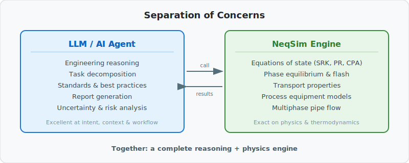
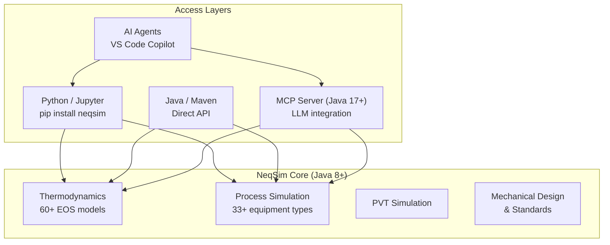

<h1>
  &nbsp;NeqSim
</h1>

<p align="center">
  <strong>Open-source process engineering toolkit — thermodynamics, process simulation, and AI-assisted design in one library.</strong>
</p>

<p align="center">
  <a href="https://github.com/equinor/neqsim/actions/workflows/verify_build.yml?query=branch%3Amaster"></a>
  <a href="https://search.maven.org/search?q=g:%22com.equinor.neqsim%22%20AND%20a:%22neqsim%22"></a>
  <a href="https://codecov.io/gh/equinor/neqsim"></a>
  <a href="https://github.com/equinor/neqsim/security/code-scanning"></a>
  <a href="LICENSE"></a>
</p>

<p align="center">
  <a href="#-quick-start">Quick Start</a> · <a href="#-what-can-you-do-with-neqsim">Use Cases</a> · <a href="#-use-neqsim-in-java">Java</a> · <a href="#-use-neqsim-in-python">Python</a> · <a href="#-agentic-engineering--mcp-server">AI / MCP</a> · <a href="https://equinor.github.io/neqsim/">Docs</a> · <a href="https://github.com/equinor/neqsim/discussions">Community</a>
</p>

---

## What is NeqSim?

**NeqSim** (Non-Equilibrium Simulator) is a comprehensive Java library for fluid property estimation, process simulation, and engineering design. It covers the full process engineering workflow — from thermodynamic modeling and PVT analysis through equipment sizing, pipeline flow, safety studies, and field development economics.

Developed at [NTNU](https://www.ntnu.edu/employees/even.solbraa) and maintained by [Equinor](https://www.equinor.com/), NeqSim is used for real-world oil & gas, carbon capture, hydrogen, and energy applications.

Use it from **Java**, **Python**, **Jupyter notebooks**, **.NET**, **MATLAB**, or let an **AI agent** drive it via natural language.

### Key capabilities

| Domain | What NeqSim provides |
|--------|---------------------|
| **Thermodynamics** | 60+ equation-of-state models (SRK, PR, CPA, GERG-2008, …), flash calculations (TP, PH, PS, dew, bubble), phase envelopes |
| **Physical properties** | Density, viscosity, thermal conductivity, surface tension, diffusion coefficients |
| **Process simulation** | 33+ equipment types — separators, compressors, heat exchangers, valves, distillation columns, pumps, reactors |
| **Pipeline & flow** | Steady-state and transient multiphase pipe flow (Beggs & Brill, two-fluid model), pipe networks |
| **PVT simulation** | CME, CVD, differential liberation, separator tests, swelling tests, saturation pressure |
| **Safety** | Depressurization/blowdown, PSV sizing (API 520/521), source term generation, safety envelopes |
| **Standards** | ISO 6976 (gas quality), NORSOK, DNV, API, ASME compliance checks |
| **Mechanical design** | Wall thickness, weight estimation, cost analysis for pipelines, vessels, wells (SURF) |
| **Field development** | Production forecasting, concept screening, NPV/IRR economics, Monte Carlo uncertainty |

See the [NeqSim Java Wiki](https://github.com/equinor/neqsim/wiki) for how to use the NeqSim API.
Additional pages are available in the [local wiki](docs/wiki/index.md), including the [distillation column solver guide](docs/wiki/distillation_column.md) with six algorithms, mathematical formulations, and usage examples.
NeqSim can be built using the Maven build system (https://maven.apache.org/). All NeqSim build dependencies are given in the pom.xml file. Learn and ask questions in [Discussions for use and development of NeqSim](https://github.com/equinor/neqsim/discussions).

## 🚀 Quick Start

### Python — try it now

```bash
pip install neqsim
```

```python
from neqsim import jneqsim

# Create a natural gas fluid
fluid = jneqsim.thermo.system.SystemSrkEos(273.15 + 25.0, 60.0)  # 25°C, 60 bara
fluid.addComponent("methane", 0.85)
fluid.addComponent("ethane", 0.10)
fluid.addComponent("propane", 0.05)
fluid.setMixingRule("classic")

# Run a flash calculation
ops = jneqsim.thermodynamicoperations.ThermodynamicOperations(fluid)
ops.TPflash()
fluid.initProperties()

print(f"Gas density:    {fluid.getPhase('gas').getDensity('kg/m3'):.2f} kg/m³")
print(f"Gas viscosity:  {fluid.getPhase('gas').getViscosity('kg/msec'):.6f} kg/(m·s)")
print(f"Z-factor:       {fluid.getPhase('gas').getZ():.4f}")
```

### Java — add to your project

**Maven Central** (simplest — no authentication needed):

```xml
<dependency>
  <groupId>com.equinor.neqsim</groupId>
  <artifactId>neqsim</artifactId>
  <version>3.6.1</version>
</dependency>
```

```java
import neqsim.thermo.system.SystemSrkEos;
import neqsim.thermodynamicoperations.ThermodynamicOperations;

SystemSrkEos fluid = new SystemSrkEos(273.15 + 25.0, 60.0);
fluid.addComponent("methane", 0.85);
fluid.addComponent("ethane", 0.10);
fluid.addComponent("propane", 0.05);
fluid.setMixingRule("classic");

ThermodynamicOperations ops = new ThermodynamicOperations(fluid);
ops.TPflash();
fluid.initProperties();

System.out.println("Density: " + fluid.getDensity("kg/m3") + " kg/m³");
```

### AI agent — describe your problem in plain English

```
@solve.task hydrate formation temperature for wet gas at 100 bara
```

The agent scopes the task, builds a NeqSim simulation, validates results, and generates a Word + HTML report — no coding required.

---

## ✨ Hero Demos

### Demo 1 — Natural-language dew point via MCP

> **You:** "What is the dew point temperature of 85% methane, 10% ethane, 5% propane at 50 bara?"

The LLM calls NeqSim's `runFlash` tool and responds with a rigorous answer:

> **LLM:** "The dew point temperature is **-42.3°C** at 50 bara (SRK equation of state,
> converged in 12 iterations). Below this temperature, liquid will begin to condense."

No coding. No GUI. Just a question and a physics-backed answer with provenance.

### Demo 2 — JSON flowsheet → results with provenance

Send a 10-line JSON process definition to the `runProcess` MCP tool:

```json
{
  "fluid": { "model": "SRK", "temperature": 303.15, "pressure": 80.0,
             "mixingRule": "classic",
             "components": { "methane": 0.80, "ethane": 0.12, "propane": 0.05, "n-butane": 0.03 } },
  "process": [
    { "type": "Stream", "name": "feed", "properties": { "flowRate": [50000.0, "kg/hr"] } },
    { "type": "Separator", "name": "HP Sep", "inlet": "feed" },
    { "type": "Compressor", "name": "Comp", "inlet": "HP Sep.gasOut",
      "properties": { "outletPressure": [150.0, "bara"] } }
  ]
}
```

Get back compressor power, outlet temperature, phase compositions — plus EOS model,
convergence status, and warnings.

### Demo 3 — Engineering study → professional report

```
@solve.task TEG dehydration sizing for 50 MMSCFD wet gas
```

The agent creates a task folder, runs NeqSim simulations, generates matplotlib
figures, validates against standards, and produces a Word + HTML report — complete
with uncertainty analysis and risk evaluation.

---

## 🔧 What can you do with NeqSim?

<details>
<summary><strong>Calculate fluid properties</strong></summary>

```python
from neqsim import jneqsim

fluid = jneqsim.thermo.system.SystemSrkEos(273.15 + 15.0, 100.0)
fluid.addComponent("methane", 0.90)
fluid.addComponent("CO2", 0.05)
fluid.addComponent("nitrogen", 0.05)
fluid.setMixingRule("classic")

ops = jneqsim.thermodynamicoperations.ThermodynamicOperations(fluid)
ops.TPflash()
fluid.initProperties()

print(f"Density:      {fluid.getDensity('kg/m3'):.2f} kg/m³")
print(f"Molar mass:   {fluid.getMolarMass('kg/mol'):.4f} kg/mol")
print(f"Phases:       {fluid.getNumberOfPhases()}")
```
</details>

<details>
<summary><strong>Simulate a process flowsheet</strong></summary>

```python
from neqsim import jneqsim

fluid = jneqsim.thermo.system.SystemSrkEos(273.15 + 30.0, 80.0)
fluid.addComponent("methane", 0.80)
fluid.addComponent("ethane", 0.12)
fluid.addComponent("propane", 0.05)
fluid.addComponent("n-butane", 0.03)
fluid.setMixingRule("classic")

Stream = jneqsim.process.equipment.stream.Stream
Separator = jneqsim.process.equipment.separator.Separator
Compressor = jneqsim.process.equipment.compressor.Compressor
ProcessSystem = jneqsim.process.processmodel.ProcessSystem

feed = Stream("Feed", fluid)
feed.setFlowRate(50000.0, "kg/hr")

separator = Separator("HP Separator", feed)
compressor = Compressor("Export Compressor", separator.getGasOutStream())
compressor.setOutletPressure(150.0, "bara")

process = ProcessSystem()
process.add(feed)
process.add(separator)
process.add(compressor)
process.run()

print(f"Compressor power: {compressor.getPower('kW'):.0f} kW")
print(f"Gas out temp:     {compressor.getOutletStream().getTemperature() - 273.15:.1f} °C")
```
</details>

<details>
<summary><strong>Predict hydrate formation temperature</strong></summary>

```python
from neqsim import jneqsim

fluid = jneqsim.thermo.system.SystemSrkEos(273.15 + 5.0, 80.0)
fluid.addComponent("methane", 0.90)
fluid.addComponent("ethane", 0.06)
fluid.addComponent("propane", 0.03)
fluid.addComponent("water", 0.01)
fluid.setMixingRule("classic")
fluid.setMultiPhaseCheck(True)

ops = jneqsim.thermodynamicoperations.ThermodynamicOperations(fluid)
ops.hydrateFormationTemperature()

print(f"Hydrate T: {fluid.getTemperature() - 273.15:.2f} °C")
```
</details>

<details>
<summary><strong>Run pipeline pressure-drop calculations</strong></summary>

```python
from neqsim import jneqsim

fluid = jneqsim.thermo.system.SystemSrkEos(273.15 + 40.0, 120.0)
fluid.addComponent("methane", 0.95)
fluid.addComponent("ethane", 0.05)
fluid.setMixingRule("classic")

Stream = jneqsim.process.equipment.stream.Stream
PipeBeggsAndBrills = jneqsim.process.equipment.pipeline.PipeBeggsAndBrills

feed = Stream("Inlet", fluid)
feed.setFlowRate(200000.0, "kg/hr")

pipe = PipeBeggsAndBrills("Export Pipeline", feed)
pipe.setPipeWallRoughness(5e-5)
pipe.setLength(50000.0)       # 50 km
pipe.setDiameter(0.508)        # 20 inch
pipe.setNumberOfIncrements(20)
pipe.run()

outlet = pipe.getOutletStream()
print(f"Outlet pressure: {outlet.getPressure():.1f} bara")
print(f"Outlet temp:     {outlet.getTemperature() - 273.15:.1f} °C")
```
</details>

<details>
<summary><strong>More examples</strong></summary>

Explore **30+ Jupyter notebooks** in [`examples/notebooks/`](examples/notebooks/):

- Phase envelope calculation
- TEG dehydration process
- Vessel depressurization / blowdown
- Heat exchanger thermal-hydraulic design
- Production bottleneck analysis
- Risk simulation and visualization
- Data reconciliation and parameter estimation
- Reservoir-to-export integrated workflows
- Multiphase transient pipe flow

</details>

---

## 🤖 Agentic Engineering & MCP Server

LLMs are excellent at engineering reasoning but hallucinate physics. NeqSim is exact on thermodynamics but needs context. **Together, they form a complete engineering system.**



### How NeqSim compares for engineering workflows

| Aspect | Manual Coding | Commercial Simulators | Agentic NeqSim |
|--------|--------------|----------------------|----------------|
| **Learning curve** | Steep (learn API) | Moderate (learn GUI) | **Low (natural language)** |
| **Standards compliance** | Manual lookup | Some built-in | **Agent loads applicable standards** |
| **Reproducibility** | Good (code) | Poor (GUI state lost) | **Excellent (notebook + task folder)** |
| **Report generation** | Manual | Manual export | **Automated Word + HTML** |
| **Physics rigor** | Full control | Vendor-validated | **Full (same NeqSim engine)** |

### MCP Server — give any LLM access to rigorous thermodynamics

The [NeqSim MCP Server](neqsim-mcp-server/) lets **any MCP-compatible client** (VS Code Copilot, Claude Desktop, Cursor, etc.) run real calculations:

**Install in seconds** — pick jar or Docker:

```bash
# Jar (requires Java 17+) — replace VERSION with the latest release, e.g. 3.7.0
curl -fLO "https://github.com/equinor/neqsim/releases/download/v${VERSION}/neqsim-mcp-server-${VERSION}-runner.jar"

# Docker (no Java needed)
docker pull ghcr.io/equinor/neqsim-mcp-server:latest
```

Then point your LLM client at `java -jar neqsim-mcp-server-*.jar` or `docker run -i --rm ghcr.io/equinor/neqsim-mcp-server:latest`. See [full setup guide](neqsim-mcp-server/#install-from-github-release-3-steps).

| Ask the LLM | What happens | MCP Tool |
|---|---|---|
| *"Dew point of 85% methane, 10% ethane, 5% propane at 50 bara?"* | Flash calculation via NeqSim | `runFlash` |
| *"How does density change from 0 to 50 °C at 80 bara?"* | Multi-point sensitivity sweep | `runBatch` |
| *"Get density, viscosity, and Cp from 10 to 100 bara"* | Property table across a range | `getPropertyTable` |
| *"Phase envelope for this natural gas"* | Bubble/dew point curve | `getPhaseEnvelope` |
| *"Simulate gas through a separator then compressor to 120 bara"* | Full process simulation | `runProcess` |
| *"What can NeqSim calculate?"* | Capabilities discovery | `getCapabilities` |

**Quick path (no flowsheet needed):** For single properties, sensitivity studies, and
phase boundaries, use `runFlash`, `runBatch`, `getPropertyTable`, or `getPhaseEnvelope`.
These return results directly with provenance metadata (EOS model, assumptions, limitations).

**Full simulation path:** For multi-equipment flowsheets, use `runProcess` with a JSON
process definition. See the [MCP Server docs](neqsim-mcp-server/) or the
[getting-started tutorial](docs/integration/mcp_getting_started.md).

### Why trust this answer? — every result includes provenance

Unlike generic LLM guesses, every NeqSim MCP response tells you *why* you should trust it:

```json
{
  "status": "success",
  "provenance": {
    "model": "SRK",
    "flashType": "TP",
    "convergence": { "converged": true, "iterations": 8 },
    "assumptions": ["Classic van der Waals mixing rule"],
    "limitations": ["SRK may underpredict liquid density by 5-15%"],
    "recommendedCrossChecks": ["Compare with GERG-2008 for high-pressure gas"]
  },
  "fluid": {
    "properties": {
      "gas": {
        "density": { "value": 62.3, "unit": "kg/m3" },
        "compressibilityFactor": { "value": 0.88 }
      }
    }
  }
}
```

**The LLM reasons. NeqSim computes. Provenance proves it.**

### AI task-solving workflow

**With VS Code + GitHub Copilot Chat:**

```
@solve.task hydrate formation temperature for wet gas at 100 bara
```

**Without Copilot (script-based):**

```bash
pip install -e devtools/
python devtools/new_task.py "hydrate formation temperature" --type A
```

The workflow creates a task folder, researches the topic, builds and runs simulations, validates results, and generates a professional report. See the [step-by-step tutorial](docs/tutorials/solve-engineering-task.md) or the [full workflow reference](docs/development/TASK_SOLVING_GUIDE.md).

---

## ☕ Use NeqSim in Java

### Add as a Maven dependency

**From Maven Central** (simplest):

```xml
<dependency>
  <groupId>com.equinor.neqsim</groupId>
  <artifactId>neqsim</artifactId>
  <version>3.6.1</version>
</dependency>
```

**From GitHub Packages** (latest snapshots):

<details>
<summary>Show GitHub Packages setup</summary>

1. Configure authentication in your Maven `settings.xml`:

```xml
<servers>
  <server>
    <id>github</id>
    <username>YOUR_GITHUB_USERNAME</username>
    <password>${env.GITHUB_TOKEN}</password>
  </server>
</servers>
```

2. Add to your `pom.xml`:

```xml
<repositories>
  <repository>
    <id>github</id>
    <url>https://maven.pkg.github.com/equinor/neqsim</url>
  </repository>
</repositories>
```
</details>

### Java code example — process simulation

```java
import neqsim.thermo.system.SystemSrkEos;
import neqsim.process.equipment.stream.Stream;
import neqsim.process.equipment.separator.Separator;
import neqsim.process.equipment.compressor.Compressor;
import neqsim.process.processmodel.ProcessSystem;

// Define fluid
SystemSrkEos fluid = new SystemSrkEos(273.15 + 30.0, 80.0);
fluid.addComponent("methane", 0.80);
fluid.addComponent("ethane", 0.12);
fluid.addComponent("propane", 0.05);
fluid.addComponent("n-butane", 0.03);
fluid.setMixingRule("classic");

// Build flowsheet
Stream feed = new Stream("Feed", fluid);
feed.setFlowRate(50000.0, "kg/hr");

Separator separator = new Separator("HP Sep", feed);
Compressor compressor = new Compressor("Comp", separator.getGasOutStream());
compressor.setOutletPressure(150.0);

ProcessSystem process = new ProcessSystem();
process.add(feed);
process.add(separator);
process.add(compressor);
process.run();

System.out.println("Power: " + compressor.getPower("kW") + " kW");
```

### Learn more

- **[Complete Java Getting Started Guide](docs/java-getting-started.md)** — Prerequisites, IDE setup, EOS selection, flash types, project structure, and contributor conventions
- [NeqSim JavaDoc](https://equinor.github.io/neqsimhome/javadoc/site/apidocs/index.html) — Full API reference
- [Java Wiki & examples](https://github.com/equinor/neqsim/wiki) — Usage patterns and guides
- [NeqSim Colab demo (Java)](https://colab.research.google.com/drive/1XkQ_CrVj2gLTtJvXhFQMWALzXii522CL) — Try interactively

---

## 🐍 Use NeqSim in Python

```bash
pip install neqsim
```

NeqSim Python gives you direct access to the full Java API via the `jneqsim` gateway. All Java classes are available — thermodynamics, process equipment, PVT, standards, everything.

```python
from neqsim import jneqsim

# All Java classes accessible through jneqsim
SystemSrkEos = jneqsim.thermo.system.SystemSrkEos
ProcessSystem = jneqsim.process.processmodel.ProcessSystem
Stream = jneqsim.process.equipment.stream.Stream
# ... 200+ classes available
```

Explore **30+ ready-to-run Jupyter notebooks** in [`examples/notebooks/`](examples/notebooks/).

### Other language bindings

| Language | Repository |
|----------|-----------|
| Python | [`pip install neqsim`](https://github.com/equinor/neqsimpython) |
| MATLAB | [equinor/neqsimmatlab](https://github.com/equinor/neqsimmatlab) |
| .NET (C#) | [equinor/neqsimcapeopen](https://github.com/equinor/neqsimcapeopen) |

---

## 🏗️ Develop & Contribute

### Clone and build

```bash
git clone https://github.com/equinor/neqsim.git
cd neqsim
./mvnw install        # Linux/macOS
mvnw.cmd install      # Windows
```

### Run tests

```bash
./mvnw test                                    # all tests
./mvnw test -Dtest=SeparatorTest               # single class
./mvnw test -Dtest=SeparatorTest#testTwoPhase  # single method
./mvnw checkstyle:check spotbugs:check pmd:check  # static analysis
```

### Open in VS Code

The repository includes a ready-to-use [dev container](.devcontainer/) — just open the repo in VS Code with container support:

```bash
git clone https://github.com/equinor/neqsim.git
cd neqsim
code .
```

### Architecture



#### Which entry point should I use?

| I want to… | Use | Requires |
|---|---|---|
| Quick property lookup via LLM | [MCP Server](neqsim-mcp-server/) + any LLM client | Java 17+ (or Docker) |
| Python scripting / Jupyter notebooks | `pip install neqsim` | Python 3.8+, JVM |
| Embed in a Java application | Maven dependency | Java 8+ |
| Full engineering study with reports | `@solve.task` agent in VS Code | VS Code + GitHub Copilot |
| .NET / MATLAB integration | [Language bindings](#other-language-bindings) | See linked repos |

#### Java version matrix

| Component | Java Version | Notes |
|---|---|---|
| **NeqSim core library** | 8+ | All thermodynamics, process equipment, PVT |
| **MCP server** | 17+ | Quarkus-based; thin wrapper around core |
| **Python users** | No Java coding | JVM bundled via jpype |
| **Running prebuilt MCP jar** | 17+ | Download from [releases](https://github.com/equinor/neqsim/releases) |

#### Core modules

| Module | Package | Purpose |
|--------|---------|---------|
| **Thermodynamics** | `thermo/` | 60+ EOS implementations, flash calculations, phase equilibria |
| **Physical properties** | `physicalproperties/` | Density, viscosity, thermal conductivity, surface tension |
| **Fluid mechanics** | `fluidmechanics/` | Single- and multiphase pipe flow, pipeline networks |
| **Process equipment** | `process/equipment/` | 33+ unit operations (separators, compressors, HX, valves, ...) |
| **Chemical reactions** | `chemicalreactions/` | Equilibrium and kinetic reaction models |
| **Parameter fitting** | `statistics/` | Regression, parameter estimation, Monte Carlo |
| **Process simulation** | `process/` | Flowsheet assembly, dynamic simulation, recycle/adjuster coordination |

For details see [docs/modules.md](docs/modules.md).

### Contributing

We welcome contributions of all kinds — bug fixes, new models, examples, documentation, and notebook recipes.

- [CONTRIBUTING.md](CONTRIBUTING.md) — Code of conduct and PR process
- [Developer setup guide](docs/DEVELOPER_SETUP.md) — Build, test, and project structure
- [Contributing structure](docs/contributing-structure.md) — Where to place code, tests, and resources
- [Interactive Colab demo](https://colab.research.google.com/drive/1JiszeCxfpcJZT2vejVWuNWGmd9SJdNC7) — Getting started as a developer

#### Where to start

| # | First Contribution | Difficulty | What to do |
|---|---|---|---|
| 1 | Add a NIST validation benchmark | Easy | Compare NeqSim flash results to NIST data in `docs/benchmarks/` |
| 2 | Create a Jupyter notebook example | Medium | Add a worked example to `examples/notebooks/` |
| 3 | Add an MCP example to the catalog | Easy | Add a new entry in `ExampleCatalog.java` |
| 4 | Fix a broken doc link | Easy | Search `docs/**/*.md` for dead links and fix them |
| 5 | Add a unit test for existing equipment | Medium | Add tests under `src/test/java/neqsim/` |

All tests and `./mvnw checkstyle:check` must pass before a PR is merged.

---

## 📚 Documentation & Resources

| Resource | Link |
|----------|------|
| **User documentation** | [equinor.github.io/neqsim](https://equinor.github.io/neqsim/) |
| **Benchmark gallery** | [docs/benchmarks/](docs/benchmarks/index.md) — validation against NIST, published data |
| **Reference manual index** | [REFERENCE_MANUAL_INDEX.md](docs/REFERENCE_MANUAL_INDEX.md) (350+ pages) |
| **MCP tool contract** | [MCP_CONTRACT.md](neqsim-mcp-server/MCP_CONTRACT.md) — stable API for agent builders |
| **JavaDoc API** | [JavaDoc](https://equinor.github.io/neqsimhome/javadoc/site/apidocs/index.html) |
| **Jupyter notebooks** | [examples/notebooks/](examples/notebooks/) (30+ examples) |
| **Discussion forum** | [GitHub Discussions](https://github.com/equinor/neqsim/discussions) |
| **Releases** | [GitHub Releases](https://github.com/equinor/neqsim/releases) |
| **NeqSim homepage** | [equinor.github.io/neqsimhome](https://equinor.github.io/neqsimhome/) |

---

## Authors

Even Solbraa (esolbraa@gmail.com), Marlene Louise Lund

NeqSim development was initiated at [NTNU](https://www.ntnu.edu/employees/even.solbraa). A number of master and PhD students have contributed to its development — we greatly acknowledge their contributions.

## License

[Apache-2.0](LICENSE)
