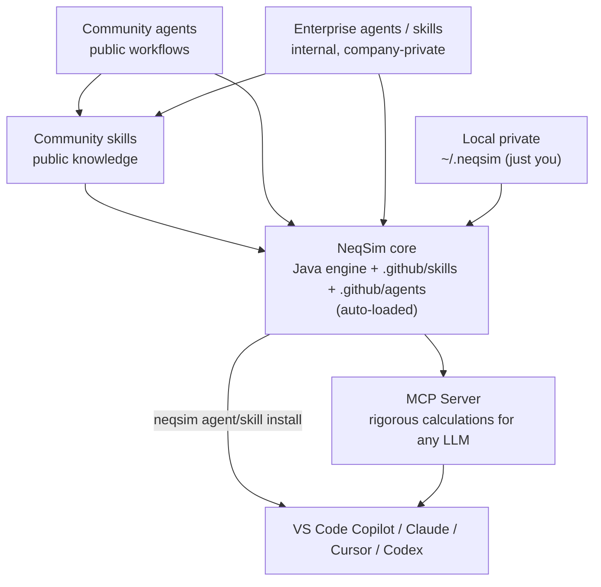

<h1>
  &nbsp;NeqSim
</h1>

<p align="center">
  <strong>From Simulation Models to AI-Assisted Industrial Workflows</strong>
</p>

<p align="center">
  <a href="https://github.com/equinor/neqsim/actions/workflows/verify_build.yml?query=branch%3Amaster"></a>
  <a href="https://search.maven.org/search?q=g:%22com.equinor.neqsim%22%20AND%20a:%22neqsim%22"></a>
  <a href="https://codecov.io/gh/equinor/neqsim"></a>
  <a href="https://github.com/equinor/neqsim/security/code-scanning"></a>
  <a href="LICENSE"></a>
</p>

<p align="center">
  <a href="https://github.com/codespaces/new?hide_repo_select=true&ref=master&repo=equinor/neqsim"></a>
  <a href="https://colab.research.google.com/drive/1XkQ_CrVj2gLTtJvXhFQMWALzXii522CL"></a>
</p>

<p align="center">
  <a href="#quick-start">Quick Start</a> | <a href="#what-can-you-do-with-neqsim">Use Cases</a> | <a href="#agentic-engineering--mcp-server">AI / MCP</a> | <a href="#use-neqsim-in-java">Java</a> | <a href="#use-neqsim-in-python">Python</a> | <a href="#develop--contribute">Contribute</a> | <a href="https://equinor.github.io/neqsim/">Docs</a>
</p>

---

## What is NeqSim?

**NeqSim** (Non-Equilibrium Simulator) is a comprehensive Java library for fluid property estimation, process simulation, and engineering design. It covers the full process engineering workflow, from thermodynamic modeling and PVT analysis through equipment sizing, pipeline flow, safety studies, and field development economics.

Developed at [NTNU](https://www.ntnu.edu/employees/even.solbraa) and maintained by [Equinor](https://www.equinor.com/), NeqSim is used for real-world oil & gas, carbon capture, hydrogen, and energy applications.

Use it from **Java**, **Python**, **Jupyter notebooks**, **.NET**, **MATLAB**, or let an **AI agent** drive it via natural language.

### Key capabilities

| Domain | What NeqSim provides |
|--------|---------------------|
| **Thermodynamics** | 60+ equation-of-state models (SRK, PR, CPA, GERG-2008, and more), flash calculations (TP, PH, PS, dew, bubble), phase envelopes |
| **Physical properties** | Density, viscosity, thermal conductivity, surface tension, diffusion coefficients |
| **Process simulation** | 33+ equipment types: separators, compressors, heat exchangers, valves, distillation columns, pumps, reactors |
| **Pipeline & flow** | Steady-state and transient multiphase pipe flow (Beggs & Brill, two-fluid model), pipe networks |
| **PVT simulation** | CME, CVD, differential liberation, separator tests, swelling tests, saturation pressure |
| **Safety** | Depressurization/blowdown, PSV sizing (API 520/521), source term generation, safety envelopes |
| **Standards** | ISO 6976 (gas quality), NORSOK, DNV, API, ASME compliance checks |
| **Mechanical design** | Wall thickness, weight estimation, cost analysis for pipelines, vessels, wells (SURF) |
| **Field development** | Production forecasting, concept screening, NPV/IRR economics, Monte Carlo uncertainty |

See the [full documentation](https://equinor.github.io/neqsim/), [Java Wiki](https://github.com/equinor/neqsim/wiki), or ask questions in [Discussions](https://github.com/equinor/neqsim/discussions).

## Quick Start

### Python - try it in 30 seconds

A Python wrapper is available on pip. Install using `pip install neqsim`.

See [neqsim-python](https://github.com/equinor/neqsim-python) for more details.

### Java - add to your project

**Maven Central** (simplest - no authentication needed):

```xml
<dependency>
  <groupId>com.equinor.neqsim</groupId>
  <artifactId>neqsim</artifactId>
  <version>3.15.0</version>
</dependency>
```

```java
import neqsim.thermo.system.SystemSrkEos;
import neqsim.thermodynamicoperations.ThermodynamicOperations;

SystemSrkEos fluid = new SystemSrkEos(273.15 + 25.0, 60.0);
fluid.addComponent("methane", 0.85);
fluid.addComponent("ethane", 0.10);
fluid.addComponent("propane", 0.05);
fluid.setMixingRule("classic");

ThermodynamicOperations ops = new ThermodynamicOperations(fluid);
ops.TPflash();
fluid.initProperties();

System.out.println("Density: " + fluid.getDensity("kg/m3") + " kg/m3");
```

### AI agent - describe your problem in plain English

```
@solve.task hydrate formation temperature for wet gas at 100 bara
```

The agent scopes the task, builds a NeqSim simulation, validates results, and generates a Word + HTML report with no coding required.

---

## What can you do with NeqSim?

<details>
<summary><strong>Calculate fluid properties</strong></summary>

```python
from neqsim import jneqsim

fluid = jneqsim.thermo.system.SystemSrkEos(273.15 + 15.0, 100.0)
fluid.addComponent("methane", 0.90)
fluid.addComponent("CO2", 0.05)
fluid.addComponent("nitrogen", 0.05)
fluid.setMixingRule("classic")

ops = jneqsim.thermodynamicoperations.ThermodynamicOperations(fluid)
ops.TPflash()
fluid.initProperties()

print(f"Density:      {fluid.getDensity('kg/m3'):.2f} kg/m3")
print(f"Molar mass:   {fluid.getMolarMass('kg/mol'):.4f} kg/mol")
print(f"Phases:       {fluid.getNumberOfPhases()}")
```
</details>

<details>
<summary><strong>Simulate a process flowsheet</strong></summary>

```python
from neqsim import jneqsim

fluid = jneqsim.thermo.system.SystemSrkEos(273.15 + 30.0, 80.0)
fluid.addComponent("methane", 0.80)
fluid.addComponent("ethane", 0.12)
fluid.addComponent("propane", 0.05)
fluid.addComponent("n-butane", 0.03)
fluid.setMixingRule("classic")

Stream = jneqsim.process.equipment.stream.Stream
Separator = jneqsim.process.equipment.separator.Separator
Compressor = jneqsim.process.equipment.compressor.Compressor
ProcessSystem = jneqsim.process.processmodel.ProcessSystem

feed = Stream("Feed", fluid)
feed.setFlowRate(50000.0, "kg/hr")

separator = Separator("HP Separator", feed)
compressor = Compressor("Export Compressor", separator.getGasOutStream())
compressor.setOutletPressure(150.0, "bara")

process = ProcessSystem()
process.add(feed)
process.add(separator)
process.add(compressor)
process.run()

print(f"Compressor power: {compressor.getPower('kW'):.0f} kW")
print(f"Gas out temp:     {compressor.getOutletStream().getTemperature() - 273.15:.1f} C")
```
</details>

<details>
<summary><strong>Predict hydrate formation temperature</strong></summary>

```python
from neqsim import jneqsim

fluid = jneqsim.thermo.system.SystemSrkEos(273.15 + 5.0, 80.0)
fluid.addComponent("methane", 0.90)
fluid.addComponent("ethane", 0.06)
fluid.addComponent("propane", 0.03)
fluid.addComponent("water", 0.01)
fluid.setMixingRule("classic")
fluid.setMultiPhaseCheck(True)

ops = jneqsim.thermodynamicoperations.ThermodynamicOperations(fluid)
ops.hydrateFormationTemperature()

print(f"Hydrate T: {fluid.getTemperature() - 273.15:.2f} C")
```
</details>

<details>
<summary><strong>Run pipeline pressure-drop calculations</strong></summary>

```python
from neqsim import jneqsim

fluid = jneqsim.thermo.system.SystemSrkEos(273.15 + 40.0, 120.0)
fluid.addComponent("methane", 0.95)
fluid.addComponent("ethane", 0.05)
fluid.setMixingRule("classic")

Stream = jneqsim.process.equipment.stream.Stream
PipeBeggsAndBrills = jneqsim.process.equipment.pipeline.PipeBeggsAndBrills

feed = Stream("Inlet", fluid)
feed.setFlowRate(200000.0, "kg/hr")

pipe = PipeBeggsAndBrills("Export Pipeline", feed)
pipe.setPipeWallRoughness(5e-5)
pipe.setLength(50000.0)       # 50 km
pipe.setDiameter(0.508)        # 20 inch
pipe.setNumberOfIncrements(20)
pipe.run()

outlet = pipe.getOutletStream()
print(f"Outlet pressure: {outlet.getPressure():.1f} bara")
print(f"Outlet temp:     {outlet.getTemperature() - 273.15:.1f} C")
```
</details>

<details>
<summary><strong>More examples</strong></summary>

Explore **30+ Jupyter notebooks** in [`examples/notebooks/`](examples/notebooks/):

- Phase envelope calculation
- TEG dehydration process
- Vessel depressurization / blowdown
- Heat exchanger thermal-hydraulic design
- Production bottleneck analysis
- Risk simulation and visualization
- Data reconciliation and parameter estimation
- Reservoir-to-export integrated workflows
- Multiphase transient pipe flow

</details>

---

## Agentic Engineering & MCP Server

LLMs reason well but hallucinate physics. NeqSim is exact on thermodynamics but needs context. **Together, they form a complete engineering system.** The LLM reasons. NeqSim computes. Provenance proves it.

### MCP Server - give any LLM access to rigorous thermodynamics

The [NeqSim MCP Server](neqsim-mcp-server/) lets any MCP-compatible client (VS Code Copilot, Claude Desktop, Cursor, etc.) run real calculations. Install in seconds:

```bash
# Docker (no Java needed)
docker pull ghcr.io/equinor/neqsim-mcp-server:latest
```

| Ask the LLM | MCP Tool |
|---|---|
| *"Dew point of 85% methane, 10% ethane, 5% propane at 50 bara?"* | `runFlash` |
| *"How does density change from 0 to 50 C at 80 bara?"* | `runBatch` |
| *"Phase envelope for this natural gas"* | `getPhaseEnvelope` |
| *"Simulate gas through a separator then compressor to 120 bara"* | `runProcess` |

Every response includes provenance metadata (EOS model, convergence, assumptions, limitations). See the [MCP Server docs](neqsim-mcp-server/) and [setup guide](neqsim-mcp-server/#install-from-github-release-3-steps).

### AI task-solving workflow

```
@solve.task TEG dehydration sizing for 50 MMSCFD wet gas
```

The agent creates a task folder, runs NeqSim simulations, validates results, and generates a Word + HTML report with no coding required. See the [tutorial](docs/tutorials/solve-engineering-task.md) or [workflow reference](docs/development/TASK_SOLVING_GUIDE.md).

### Agents & skills — the extension ecosystem

Agentic NeqSim is built from two layers you can mix and extend:

- **Skills = the knowledge layer.** Structured markdown that encodes domain expertise (API patterns, decision rules, reference data). Agents *read* skills to know how to do something correctly.
- **Agents = the workflow layer.** A role + objective + the skills it loads. Agents *drive* NeqSim to complete a job (e.g. `@solve.task`, `@field.development`).

Content comes from four tiers — **core** (shipped in this repo under `.github/skills` and `.github/agents`, auto-loaded), **community** (public, installable), **enterprise** (company-private/internal), and **local private** (just you):

| Catalog | What it holds | Where |
|---------|---------------|-------|
| **Community agents** | Public AI agents for thermodynamics, process, flow assurance, energy & field development | [equinor/neqsim-community-agents](https://github.com/equinor/neqsim-community-agents) |
| **Community skills** | Public reusable engineering skills for agentic workflows | [equinor/neqsim-community-skills](https://github.com/equinor/neqsim-community-skills) |
| **Enterprise agents / skills** | **Internal, company-private** agents & skills governed in private repos (`enterprise-agents.yaml` / `enterprise-skills.yaml`) — kept separate from public content | Private company repos (see the enterprise guide) |

**Ecosystem at a glance** — how the pieces relate:



Install and use them with the `neqsim` CLI (all user-scope, no admin — see the [no-admin runbook](devtools/README.md#recommended-no-admin-runbook-for-the-user)):

```bash
neqsim agent list                 # browse the community catalog
neqsim agent search hydrate       # find an agent by keyword
neqsim agent install --all --vscode   # install into the VS Code prompts folder
neqsim skill install --all        # install community skills

neqsim agent private-init         # scaffold a private/enterprise catalog
# ...or register a private repo AND sign in with browser SSO in one step:
neqsim agent private-init --repo my-org/neqsim-enterprise-agents --login
neqsim skill private-init --repo my-org/neqsim-enterprise-skills --login
```

- **How internal (enterprise) content works:** a company publishes private `enterprise-agents.yaml` / `enterprise-skills.yaml` in governed internal repos. These are **never committed to the public NeqSim repos**; they are discovered per-user (via `~/.neqsim/private-*.yaml` and gh-CLI / Git Credential Manager auth). `private-init` writes and then prints the path to those per-user files (`~/.neqsim/private-agents.yaml` / `private-skills.yaml`) so you can edit them afterwards. See [Enterprise Agent & Skill Repositories](docs/integration/enterprise_agent_skill_repos.md).
- **Full details:** the [Skills & Agents Guide](docs/integration/skills_guide.md) explains the four tiers, packaging, canonical installs vs tool exports, and how to author your own.

### Where does a new skill or agent go? (recommendation for how to work)

Decide by **coupling and confidentiality**, not by "coding vs using":

| If it… | It belongs in | Why |
|--------|---------------|-----|
| Extends the engine, or is tied to specific NeqSim Java classes/signatures and must ship in the same PR as the code | **this repo** (`.github/skills`, `.github/agents`) | versions in lockstep with the API; testable against real classes |
| Solves tasks with NeqSim but is engine-agnostic, screening-level, or just orchestrates existing capabilities (releases on its own cadence) | **community** ([skills](https://github.com/equinor/neqsim-community-skills) / [agents](https://github.com/equinor/neqsim-community-agents)) | public, reusable, no NeqSim internals |
| Uses internal knowledge, internal tools, company policy, or confidential thresholds | **enterprise** (private repos) | never committed to public repos |

One-line test: **validated & API-coupled → this repo · educational screening → community · company policy or confidential → enterprise/private.**
See [VISION_AGENTS.md](VISION_AGENTS.md) and the [Where Does This Go? guide](https://github.com/equinor/neqsim-community-skills/blob/main/docs/where-does-this-go.md) for the full decision tree.

---

## Use NeqSim in Java

```xml
<dependency>
  <groupId>com.equinor.neqsim</groupId>
  <artifactId>neqsim</artifactId>
  <version>3.15.0</version>
</dependency>
```

The Quick Start above shows the core pattern (create a fluid, run a flash, and read properties). For process simulation, add equipment to a `ProcessSystem` and call `run()`; see the [Java Getting Started Guide](docs/java-getting-started.md) for full examples.

**Learn more:** [Java Getting Started Guide](docs/java-getting-started.md) | [JavaDoc](https://equinor.github.io/neqsimhome/javadoc/site/apidocs/index.html) | [Wiki](https://github.com/equinor/neqsim/wiki) | [Colab demo](https://colab.research.google.com/drive/1XkQ_CrVj2gLTtJvXhFQMWALzXii522CL)

---

## Use NeqSim in Python

```bash
pip install neqsim
```

NeqSim Python gives you direct access to the full Java API via the `jneqsim` gateway. All Java classes are available, including thermodynamics, process equipment, PVT, standards, and more.

```python
from neqsim import jneqsim

# All Java classes accessible through jneqsim
SystemSrkEos = jneqsim.thermo.system.SystemSrkEos
ProcessSystem = jneqsim.process.processmodel.ProcessSystem
Stream = jneqsim.process.equipment.stream.Stream
# ... 200+ classes available
```

Explore **30+ ready-to-run Jupyter notebooks** in [`examples/notebooks/`](examples/notebooks/).

### Other language bindings

| Language | Repository |
|----------|-----------|
| Python | [`pip install neqsim`](https://github.com/equinor/neqsimpython) |
| MATLAB | [equinor/neqsimmatlab](https://github.com/equinor/neqsimmatlab) |
| .NET (C#) | [equinor/neqsimcapeopen](https://github.com/equinor/neqsimcapeopen) |

---

## Develop & Contribute

### Clone and build

```bash
git clone https://github.com/equinor/neqsim.git
cd neqsim
./mvnw install        # Linux/macOS
mvnw.cmd install      # Windows
```

> **Windows: enable long paths before cloning.** Maven's `target/` directory can
> produce paths longer than the legacy 260-character limit, causing checkout or
> build errors. Enable long-path support once (user-scope, **no admin required**):
>
> ```powershell
> git config --global core.longpaths true
> ```
>
> Also prefer cloning **inside your user profile** (e.g.
> `C:\Users\<id>\Documents\GitHub\neqsim`) rather than a short drive root, and
> avoid `C:\Program Files` (which needs elevated rights to write).

### Restricted / corporate PC (no admin rights)

Everything below installs into your **user profile** and needs **no
administrator rights** — the common situation on locked-down corporate PCs.
Prerequisites (Git, Python, a JDK, VS Code) must already be provisioned per-user
(e.g. via your software portal or `winget --scope user`).

```powershell
# 0. One-time Git setting (user-scope, no admin)
git config --global core.longpaths true

# 1. Clone into your user profile
cd $HOME\Documents\GitHub
git clone https://github.com/equinor/neqsim.git
cd neqsim

# 2. Python devtools in a venv (keeps the 'neqsim' command on PATH)
py -3 -m venv .venv
Set-ExecutionPolicy -Scope Process -ExecutionPolicy RemoteSigned   # per-process, no admin
.\.venv\Scripts\Activate.ps1
.\install.ps1
neqsim doctor          # verifies Python, Java/JDK, Maven wrapper, agents

# 3. Java build — needs a JDK. No admin? Let the installer fetch a PORTABLE JDK:
.\install.ps1 -InstallJdk       # downloads Temurin into ~/.neqsim\jdk, sets user env vars
# (or install a JDK manually and set JAVA_HOME yourself), then in a NEW terminal:
.\mvnw.cmd install -DskipTests

# 4. Install AI agents into the VS Code USER prompts folder (no admin)
neqsim agent install --all --vscode
neqsim skill install --all
```

### Run tests

```bash
./mvnw test                                    # all tests
./mvnw test -Dtest=SeparatorTest               # single class
./mvnw test -Dtest=SeparatorTest#testTwoPhase  # single method
./mvnw checkstyle:check spotbugs:check pmd:check  # static analysis
```

### Code formatting (Spotless)

Java formatting is enforced by Spotless. CI runs a **check-only** gate (it never edits or pushes
your code), so format locally before pushing:

```bash
./mvnw spotless:apply     # auto-format all Java files
./mvnw spotless:check      # verify formatting — must exit 0 before pushing
```

Optionally, install local pre-commit hooks to format on commit and verify on push (requires a
local JDK + Maven):

```bash
pip install pre-commit
pre-commit install --hook-type pre-commit --hook-type pre-push
pre-commit run --all-files   # run hooks manually across the repo
```

See [CONTRIBUTING.md](CONTRIBUTING.md#code-formatting-spotless) for details.

### Open in VS Code

The repository includes a ready-to-use [dev container](.devcontainer/); just open the repo in VS Code with container support:

```bash
git clone https://github.com/equinor/neqsim.git
cd neqsim
code .
```

### Architecture


#### Which entry point should I use?

| I want to... | Use | Requires |
|---|---|---|
| Quick property lookup via LLM | [MCP Server](neqsim-mcp-server/) + any LLM client | Java 21+ (or Docker) |
| Python scripting / Jupyter notebooks | `pip install neqsim` | Python 3.9+, JVM |
| Embed in a Java application | Maven dependency | Java 17+ (default) or Java 8+ (use the `-Java8` artifact) |
| Full engineering study with reports | `@solve.task` agent in VS Code | VS Code + GitHub Copilot |
| .NET / MATLAB integration | [Language bindings](#other-language-bindings) | See linked repos |

#### Java version matrix

| Component | Java Version | Notes |
|---|---|---|
| **NeqSim core library** | 17+ (default) | Default `neqsim` artifact targets Java 17 bytecode |
| **NeqSim core library (`-Java8`)** | 8+ | Java 8 compatible artifact built from `pomJava8.xml` |
| **MCP server** | 21+ | Quarkus-based; thin wrapper around core |
| **Python users** | No Java coding | JVM bundled via jpype |
| **Running prebuilt MCP jar** | 21+ | Download from [releases](https://github.com/equinor/neqsim/releases) |

#### Core modules

| Module | Package | Purpose |
|--------|---------|---------|
| **Thermodynamics** | `thermo/` | 60+ EOS implementations, flash calculations, phase equilibria |
| **Physical properties** | `physicalproperties/` | Density, viscosity, thermal conductivity, surface tension |
| **Fluid mechanics** | `fluidmechanics/` | Single- and multiphase pipe flow, pipeline networks |
| **Process equipment** | `process/equipment/` | 33+ unit operations (separators, compressors, HX, valves, ...) |
| **Chemical reactions** | `chemicalreactions/` | Equilibrium and kinetic reaction models |
| **Parameter fitting** | `statistics/` | Regression, parameter estimation, Monte Carlo |
| **Process simulation** | `process/` | Flowsheet assembly, dynamic simulation, recycle/adjuster coordination |

For details see [docs/modules.md](docs/modules.md).

### Contributing

We welcome contributions of all kinds: bug fixes, new models, examples, documentation, and notebook recipes.
**AI-assisted PRs are first-class contributions**; see [CONTRIBUTING.md](CONTRIBUTING.md).

**New here?** Get started (Windows, PowerShell):

```powershell
git clone https://github.com/equinor/neqsim.git
cd neqsim
py -3 -m venv .venv
.\.venv\Scripts\Activate.ps1   # activate the venv FIRST so 'neqsim' lands on PATH
.\install.cmd                  # or .\install.ps1  (append 'uv' for the fast installer)
neqsim onboard                 # interactive setup (Java, Maven, build, Python, agents)
```

macOS/Linux:

```bash
git clone https://github.com/equinor/neqsim.git && cd neqsim
python3 -m venv .venv && source .venv/bin/activate
./install.sh
neqsim onboard
```

> **Activate the venv before running `install`.** The installer does not create
> or activate a venv — it only detects an already-active one. Activating first
> means the package and the `neqsim` command install into the venv and stay on
> PATH; skip it and you may hit "`neqsim` is not recognized".
>
> The `install` script finds a working Python for you and runs `python -m pip`
> under the hood, so it works even when `pip`/`python` are not on PATH. To
> install manually, use `python -m pip install -e devtools/` (not bare `pip`).
>
> **Windows: "install.ps1 is not digitally signed" error?** This is PowerShell's
> execution policy, not a problem with the file. Run the pure-batch installer
> `.\install.cmd` (calls Python/pip directly, works even when the policy is
> locked by Group Policy), or just run `py -m pip install -e devtools/`.

> **Tip:** Using a virtual environment (`python -m venv .venv` then activate it) avoids
> PATH issues on all platforms. See [devtools/README.md](devtools/README.md#troubleshooting-neqsim-not-found)
> if `neqsim` is not found, or use `python -m neqsim_cli` as a fallback.

Or skip local setup entirely: **[Open in GitHub Codespaces](https://github.com/codespaces/new?hide_repo_select=true&ref=master&repo=equinor/neqsim)**, with everything pre-installed in the browser.

Then explore and contribute:

```bash
neqsim try                 # interactive playground - experiment with NeqSim instantly
neqsim contribute          # guided wizard - picks the right path for you
neqsim doctor              # quick diagnostic if something isn't working
```

- [CONTRIBUTING.md](CONTRIBUTING.md) - Code of conduct, PR process, AI-assisted contributions
- [VISION_AGENTS.md](VISION_AGENTS.md) - What belongs in the agentic system (core vs. community)
- [Developer setup guide](docs/DEVELOPER_SETUP.md) - Build, test, and project structure
- [Contributing structure](docs/contributing-structure.md) - Where to place code, tests, and resources

#### Where to start

**Skills** are markdown files containing engineering knowledge (code patterns, design rules, troubleshooting tips) that AI agents load automatically when solving related tasks. Contributing a skill is the easiest way to make the agentic system smarter, with no Java required.

> Public, reusable skills and agents live in their own community repos — [equinor/neqsim-community-skills](https://github.com/equinor/neqsim-community-skills) and [equinor/neqsim-community-agents](https://github.com/equinor/neqsim-community-agents) — while company-private ones go in internal enterprise repos (see below).

| # | First Contribution | Difficulty | What to do |
|---|---|---|---|
| 1 | **Contribute a skill** | Easy | Write a SKILL.md with domain knowledge - `neqsim new-skill "name"` ([guide](.github/skills/README.md#how-to-contribute-a-skill), [example skill](.github/skills/neqsim-input-validation/SKILL.md)) |
| 2 | Add a NIST validation benchmark | Easy | Compare NeqSim flash results to NIST data in `docs/benchmarks/` |
| 3 | Create a Jupyter notebook example | Medium | Add a worked example to `examples/notebooks/` |
| 4 | Add an MCP example to the catalog | Easy | Add a new entry in `ExampleCatalog.java` |
| 5 | Fix a broken doc link | Easy | Search `docs/**/*.md` for dead links and fix them |
| 6 | Add a unit test for existing equipment | Medium | Add tests under `src/test/java/neqsim/` |

#### Community Skill and Agent Catalogs

Browse and install community-contributed skills, or publish your own:

```bash
neqsim skill list                    # browse the catalog and discovered repositories
neqsim skill install <name>          # install a skill
neqsim skill install <name> --target vscode   # also export to your VS Code user prompts folder
neqsim skill doctor                  # check private-catalog authentication readiness
neqsim skill doctor --target vscode  # verify VS Code skill exports
neqsim skill publish user/repo-name  # publish yours (creates a draft PR)
```

Browse and install community-contributed agents separately from skills:

```bash
neqsim agent list                    # browse installable agent workflows
neqsim agent search hydrate          # search by name, tag, description, or required skill
neqsim agent install <name>          # install an agent definition
neqsim agent install <name> --target vscode   # also export the agent and required skills for VS Code
neqsim agent install --all           # install every agent in the catalog
neqsim agent doctor --target vscode  # verify VS Code exports and required skill visibility
neqsim agent validate <name-or-path> # validate an installed or local agent package
neqsim agent schema                  # show the supported agent.yaml fields
```

Both `neqsim agent doctor --target ...` and `neqsim skill doctor --target ...`
accept `--profile path/to/export-profile.json` to check a declared export set.
Without a profile, missing exports are warnings; with a profile, expected-but-missing
exports are errors and extra exports are warnings.

By default, installed community and private content is kept out of the Git-tracked
workspace: skills install to `~/.neqsim/skills/`, agents install to
`~/.neqsim/agents/`, and `--target vscode` writes generated copies to the user's
VS Code prompts folders. Use `--vscode-scope workspace` only when a maintainer
intentionally wants a generated `.github/skills` or `.github/agents` copy.

The catalog can list individual skills directly and can also point to public
multi-skill GitHub repositories. When a repository is listed under
`repositories:` in `community-skills.yaml`, `neqsim skill list` reads the online
repo catalog first and falls back to scanning matching `SKILL.md` files, so new
skills can appear without adding one entry per skill to the NeqSim repo.

Agents follow the same discovery model through `community-agents.yaml`, but they
are kept as a separate install type. Skills are reusable engineering knowledge;
agents are role/workflow definitions that can declare `required_skills` and are
installed to `~/.neqsim/agents/`. Agent packages can include an `agent.yaml`
manifest with supported domains, inputs, outputs, MCP tool requirements, human
review policy, and trust level. Installing an agent downloads and validates the
definition only; execution is an explicit action in the AI tool that uses it.

The shared public home for reusable community skills is
[equinor/neqsim-community-skills](https://github.com/equinor/neqsim-community-skills).
The shared public home for reusable community agents is
[equinor/neqsim-community-agents](https://github.com/equinor/neqsim-community-agents).
Put skills there when they are public, reproducible, useful beyond one project,
and do not need to live in NeqSim core. Good candidates include educational
screening workflows, public validation helpers, open engineering checklists,
agent guidance around existing NeqSim workflows, and examples with synthetic or
public data. Keep proprietary methods, plant data, private tag names, internal
URLs, company standards, and project-specific design bases out of the public
community repos; use private enterprise skill and agent repositories for those.

See the [Skills Guide](docs/integration/skills_guide.md) for the full walkthrough,
[Enterprise Agent and Skill Repositories](docs/integration/enterprise_agent_skill_repos.md)
for company-private repository setup,
[community-skills.yaml](community-skills.yaml) and
[community-agents.yaml](community-agents.yaml) for the catalogs, and
[.github/skills/README.md](.github/skills/README.md) for the quick contribution guide.

All tests and `./mvnw checkstyle:check` must pass before a PR is merged.

---

## Documentation & Resources

| Resource | Link |
|----------|------|
| **User documentation** | [equinor.github.io/neqsim](https://equinor.github.io/neqsim/) |
| **Benchmark gallery** | [docs/benchmarks/](docs/benchmarks/index.md) - validation against NIST, published data |
| **Reference manual index** | [REFERENCE_MANUAL_INDEX.md](docs/REFERENCE_MANUAL_INDEX.md) (350+ pages) |
| **MCP tool contract** | [MCP_CONTRACT.md](neqsim-mcp-server/MCP_CONTRACT.md) - stable API for agent builders |
| **JavaDoc API** | [JavaDoc](https://equinor.github.io/neqsimhome/javadoc/site/apidocs/index.html) |
| **Jupyter notebooks** | [examples/notebooks/](examples/notebooks/) (30+ examples) |
| **Discussion forum** | [GitHub Discussions](https://github.com/equinor/neqsim/discussions) |
| **Releases** | [GitHub Releases](https://github.com/equinor/neqsim/releases) |
| **NeqSim homepage** | [equinor.github.io/neqsimhome](https://equinor.github.io/neqsimhome/) |

---

## Authors

Even Solbraa (esolbraa@gmail.com), Marlene Louise Lund

NeqSim development was initiated at [NTNU](https://www.ntnu.edu/employees/even.solbraa). A number of master and PhD students have contributed to its development, and we greatly acknowledge their contributions.

## License

[Apache-2.0](LICENSE)
