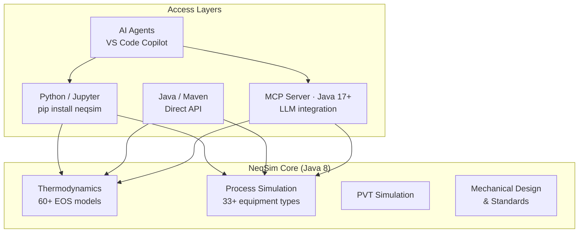

# NeqSim Productization Roadmap

> **Thesis:** NeqSim no longer needs more AI ideas. It needs productization of
> the very good AI/engineering ideas it already has.

This document translates the maintainer review into **15 concrete GitHub issues**
organized in three phases: Adoption, Trust, and Contributor Scale.

---

## Phase 1: Adoption (Do First)

These four issues directly reduce friction for new users and maximize the chance
of quick stars and real usage.

---

### Issue #1 — Publish prebuilt MCP server releases

**Labels:** `enhancement`, `mcp-server`, `adoption`, `Phase-1`

**Problem:**
The MCP server currently requires users to: (1) clone the repo, (2) install
NeqSim to local Maven, (3) build the MCP server, (4) run the jar. This is
workable for contributors but too much friction for curious users, students,
and AI-tool experimenters. The README sells a low-friction natural-language
workflow, but setup starts like a developer install.

**Acceptance criteria:**

- [ ] GitHub Actions workflow builds the MCP uber-jar on every tagged release
- [ ] The jar is attached as a release asset named `neqsim-mcp-server-{version}.jar`
- [ ] Release notes include SHA-256 checksum
- [ ] The MCP README links to the latest release download
- [ ] A user can go from zero to running MCP server in under 5 minutes
      (download jar → `java -jar` → working)

**Implementation sketch:**

Add to `.github/workflows/release_with_jars.yml`:

```yaml
build_mcp_server:
  name: Build MCP Server
  needs: [compile_java_8]  # or the JDK 17 compile step
  runs-on: ubuntu-latest
  steps:
    - uses: actions/checkout@v6
    - uses: actions/setup-java@v5
      with:
        distribution: 'temurin'
        java-version: '17'
        cache: 'maven'
    - name: Install neqsim core to local repo
      run: mvn -B install -DskipTests -Dmaven.javadoc.skip=true
    - name: Build MCP server uber-jar
      run: cd neqsim-mcp-server && mvn -B package -DskipTests -Dmaven.javadoc.skip=true
    - name: Upload MCP server jar
      uses: actions/upload-artifact@v4
      with:
        name: neqsim-mcp-server
        path: neqsim-mcp-server/target/neqsim-mcp-server-*-runner.jar
```

Then attach the artifact to the GitHub Release in the existing release step.

---

### Issue #2 — Add 5-minute quickstart to MCP README

**Labels:** `documentation`, `mcp-server`, `adoption`, `Phase-1`

**Problem:**
The MCP README jumps straight into "Install NeqSim to Local Maven Repo."
A curious user who just wants to try it bounces. Need a "fastest path"
section at the very top.

**Acceptance criteria:**

- [ ] New "Fastest Path (5 minutes)" section at top of MCP README
- [ ] Copy-paste blocks for macOS, Linux, and Windows
- [ ] Section shows: install Java → download jar → configure client → run example
- [ ] One complete example conversation included (ask → tool call → answer)
- [ ] "Developer build" section moved below the quick start

**Proposed content:**

```markdown
## Fastest Path (5 minutes)

### 1. Install Java 17+
# macOS
brew install openjdk@17

# Ubuntu/Debian
sudo apt install openjdk-17-jdk

# Windows — download from https://adoptium.net/

### 2. Download the server
Download `neqsim-mcp-server-{version}.jar` from the
[latest release](https://github.com/equinor/neqsim/releases).

### 3. Verify it works
java -jar neqsim-mcp-server-{version}.jar  # Ctrl+C to stop

### 4. Connect to your LLM client
{client-specific JSON configs for Claude Desktop, VS Code, Cursor}

### 5. Ask a question
"What is the density of 90% methane, 10% ethane at 80 bara and 35°C?"
```

---

### Issue #3 — Add Docker support for MCP server

**Labels:** `enhancement`, `mcp-server`, `adoption`, `Phase-1`

**Problem:**
Users who don't have Java installed face a barrier. A Docker image eliminates
all local dependency management.

**Acceptance criteria:**

- [ ] `neqsim-mcp-server/Dockerfile` produces a working image
- [ ] Image size < 150 MB (JRE + uber-jar, no full JDK)
- [ ] `docker run` instruction in MCP README
- [ ] CI builds and pushes image to GitHub Container Registry on tagged releases
- [ ] Works with Claude Desktop via STDIO docker wrapper

**Implementation sketch:**

```dockerfile
FROM eclipse-temurin:17-jre-alpine
COPY target/neqsim-mcp-server-*-runner.jar /app/server.jar
ENTRYPOINT ["java", "-jar", "/app/server.jar"]
```

For Claude Desktop / STDIO clients:
```json
{
  "mcpServers": {
    "neqsim": {
      "command": "docker",
      "args": ["run", "-i", "--rm", "ghcr.io/equinor/neqsim-mcp-server:latest"]
    }
  }
}
```

---

### Issue #4 — Add architecture diagram and entry-point table to README

**Labels:** `documentation`, `adoption`, `Phase-1`

**Problem:**
The repo is now large enough that clarity itself becomes a growth feature.
External users need to instantly understand: what is the core engine, what
is the Python layer, what is the MCP layer, and what is the task workflow.
CONTEXT.md is for insiders; the README needs a visual for outsiders.

**Acceptance criteria:**

- [ ] Mermaid architecture diagram in README showing 5 layers
- [ ] "Which entry point should I use?" table
- [ ] Java version requirements visible in the diagram or adjacent table
- [ ] Placed between Quick Start and Use Cases sections

**Proposed content:**

```markdown
### Architecture



### Which entry point should I use?

| I want to… | Use | Requires |
|---|---|---|
| Quick property lookup | MCP Server + any LLM | Java 17+ |
| Python scripting / notebooks | `pip install neqsim` | Python 3.8+, JVM |
| Java application embedding | Maven dependency | Java 8+ |
| Full engineering study with reports | `@solve.task` agent | VS Code + Copilot |
| .NET / MATLAB integration | Language bindings | See repos |
```

---

### Issue #5 — Add 3 hero demos near top of README

**Labels:** `documentation`, `adoption`, `Phase-1`

**Problem:**
The README is comprehensive but breadth dilutes excitement. For stars, a few
standout demos beat a long capability list. Newcomers ask: "What is THE killer
thing this does?"

**Acceptance criteria:**

- [ ] 3 demo blocks placed right after Quick Start, before the expandable use cases
- [ ] Each demo is reproducible in under 5 minutes
- [ ] Each targets a different persona (LLM user, API user, engineer)
- [ ] Include example output (not just code)

**Proposed hero demos:**

1. **Natural-language phase envelope via MCP** (persona: AI user)
   > "Plot the phase envelope for 85% methane, 10% ethane, 5% propane"
   > → Show the MCP call + returned PT curve data

2. **JSON flowsheet → results with provenance** (persona: developer)
   > POST a 5-line JSON process definition → get separator + compressor results
   > with EOS model, convergence status, and warnings

3. **Engineering study → Word report** (persona: process engineer)
   > `@solve.task hydrate formation temperature for wet gas` → show the
   > generated report screenshot (task folder, notebook, figures, docx)

---

## Phase 2: Trust (Build Credibility)

These issues make the trust story visible. The machinery already exists
internally; these expose it publicly.

---

### Issue #6 — Declare MCP v1 core tool contract

**Labels:** `enhancement`, `mcp-server`, `api-stability`, `Phase-2`

**Problem:**
Agent builders and app developers will only build on NeqSim if they trust the
tool contract not to drift. The current MCP surface is good but has no explicit
stability promise.

**Acceptance criteria:**

- [ ] `neqsim-mcp-server/MCP_CONTRACT.md` declares v1 stable tools
- [ ] Core v1 tools: `runFlash`, `runBatch`, `getPropertyTable`, `getPhaseEnvelope`,
      `runProcess`, `validateInput`
- [ ] Each tool lists stable required fields and stable response keys
- [ ] Experimental tools clearly marked (e.g., `getAutomation`)
- [ ] Every MCP response includes `"apiVersion": "1.0"` field
- [ ] CHANGELOG_AGENT_NOTES.md references the contract
- [ ] Backward compatibility promise: "Required fields and major response keys
      will not change within v1. New optional fields may be added."

**Proposed contract structure:**

```markdown
# MCP Tool Contract v1

## Stability Promise
- Required input fields will not be removed or renamed within v1
- Required response fields will not be removed within v1
- New optional fields may be added at any time
- Experimental tools are prefixed or listed separately

## Core Tools (Stable)
| Tool | Status | Since |
|------|--------|-------|
| runFlash | Stable | v1.0 |
| runBatch | Stable | v1.0 |
| getPropertyTable | Stable | v1.0 |
| getPhaseEnvelope | Stable | v1.0 |
| runProcess | Stable | v1.0 |
| validateInput | Stable | v1.0 |
| searchComponents | Stable | v1.0 |

## Discovery Tools (Stable)
| Tool | Status | Since |
|------|--------|-------|
| getCapabilities | Stable | v1.0 |
| getExample | Stable | v1.0 |
| getSchema | Stable | v1.0 |

## Experimental Tools
| Tool | Status | Notes |
|------|--------|-------|
| getAutomation | Experimental | Variable addressing API; schema may change |
```

---

### Issue #7 — Show provenance-rich examples in README and MCP docs

**Labels:** `documentation`, `trust`, `Phase-2`

**Problem:**
MCP responses already include provenance (EOS, assumptions, convergence), but
this isn't visible in the README. Provenance is the mechanism that makes
"LLMs reason, NeqSim computes" believable.

**Acceptance criteria:**

- [ ] README MCP section shows at least one full response with provenance
- [ ] MCP README includes a "Why trust this answer?" subsection
- [ ] Example responses visibly include: model choice, convergence status,
      assumptions, limitations, and recommended cross-checks
- [ ] Standard warning taxonomy documented: `MODEL_LIMITATION`,
      `EXTRAPOLATION`, `MISSING_REFERENCE_DATA`, `TWO_PHASE_UNCERTAINTY`,
      `NEAR_CRITICAL`, `CONVERGENCE_WARNING`

**Proposed README addition:**

```markdown
### Every answer includes provenance

Unlike generic LLM responses, every NeqSim MCP result tells you *why* you
should trust it:

```json
{
  "status": "success",
  "provenance": {
    "model": "SRK",
    "flashType": "TP",
    "convergence": { "converged": true, "iterations": 8 },
    "assumptions": [
      "Classic van der Waals mixing rule",
      "No association (polar) corrections"
    ],
    "limitations": [
      "SRK may underpredict liquid density by 5-15%",
      "Not recommended near critical point"
    ],
    "recommendedCrossChecks": [
      "Compare with PR or GERG-2008 for high-pressure gas",
      "Validate against NIST data for pure components"
    ]
  },
  "fluid": { ... }
}
```

**This is how NeqSim differentiates from generic AI demos:
the LLM reasons, NeqSim computes, and provenance proves it.**
```

---

### Issue #8 — Create public benchmark gallery

**Labels:** `documentation`, `trust`, `validation`, `Phase-2`

**Problem:**
The task-solving guide has strong internal validation machinery (benchmark
notebooks, quality gates), but this rigor isn't exposed publicly. Serious
users star engineering repos when they see the numbers are real.

**Acceptance criteria:**

- [ ] `docs/benchmarks/index.md` with benchmark gallery
- [ ] At least 5 benchmark cases covering:
  - [ ] Flash calculation vs NIST data
  - [ ] Hydrate formation temperature vs published data
  - [ ] Phase envelope vs reference EOS
  - [ ] Compressor power vs known examples
  - [ ] Pipeline pressure drop vs Beggs & Brill reference
- [ ] Each benchmark shows: reference source, NeqSim result, deviation,
      EOS/model, and caveats
- [ ] Summary "trust dashboard" table linked from README
- [ ] Every MCP example links to at least one validation reference

**Proposed benchmark table format:**

```markdown
| Test Case | Reference | NeqSim | Deviation | EOS | Notes |
|-----------|-----------|--------|-----------|-----|-------|
| Methane density at 200 bar, 300K | NIST 43.21 kg/m³ | 43.09 | -0.28% | SRK | Within typical SRK accuracy |
| Hydrate T, 90% CH4 at 100 bar | Sloan (2008) 17.2°C | 17.4°C | +0.2°C | SRK+hydrate | Good agreement |
| Natural gas phase envelope | GERG-2008 ref | Match | <0.5% | SRK vs GERG | Cricondenbar within 1 bar |
```

---

## Phase 3: Contributor Scale

These issues improve the experience for contributors and clarify the
project's internal architecture.

---

### Issue #9 — Clarify Java 8 vs Java 17 in README and MCP README

**Labels:** `documentation`, `contributor-experience`, `Phase-3`

**Problem:**
The core must compile with Java 8 while the MCP server requires JDK 17+.
This is a common source of confusion. Current docs mention it but don't
make it impossible to miss.

**Acceptance criteria:**

- [ ] Prominent version matrix in main README (in Architecture section)
- [ ] Version matrix in MCP README prerequisites
- [ ] Troubleshooting section for common version mistakes
- [ ] CI badges or workflow names make the split visible

**Proposed matrix:**

```markdown
| Component | Java Version | Build Command |
|-----------|-------------|---------------|
| NeqSim core library | 8+ | `./mvnw install` |
| MCP server | 17+ | `cd neqsim-mcp-server && mvn package` |
| Python users | No Java coding needed | `pip install neqsim` (JVM bundled) |
| Running the MCP jar | 17+ | `java -jar neqsim-mcp-server.jar` |
```

---

### Issue #10 — Add contributor ladder and starter issues

**Labels:** `community`, `contributor-experience`, `Phase-3`

**Problem:**
The repo is broad enough that new contributors don't know where to start.
There are notebooks, docs, tests, task logs, examples, and workflow structure —
but no guided progression.

**Acceptance criteria:**

- [ ] `CONTRIBUTING.md` updated with contribution ladder section
- [ ] At least 5 GitHub issues tagged `good first contribution`
- [ ] Issue templates for: `good-first-benchmark`, `good-first-notebook`,
      `good-first-mcp-enhancement`, `good-first-doc-fix`
- [ ] 5 starter recipes with exact file paths and expected output
- [ ] Labels created: `good first benchmark`, `good first notebook`,
      `good first MCP enhancement`

**Proposed starter recipes:**

| # | Task | Difficulty | Files to Edit |
|---|------|-----------|---------------|
| 1 | Add NIST validation for CO2 density | Easy | `docs/benchmarks/`, test file |
| 2 | Create Jupyter notebook for TEG dehydration | Medium | `examples/notebooks/` |
| 3 | Add `hydrateTP` example to MCP catalog | Easy | `ExampleCatalog.java` |
| 4 | Fix a broken link in docs | Easy | `docs/**/*.md` |
| 5 | Add unit test for pipeline pressure drop | Medium | `src/test/java/` |

---

### Issue #11 — Separate QuickCalc from EngineeringStudy modes explicitly

**Labels:** `documentation`, `workflow`, `Phase-3`

**Problem:**
AGENTS.md pushes a mandatory task-folder workflow that's excellent for serious
studies but too heavy as the default mental model. Users and agents doing quick
property lookups shouldn't feel like they need a task_spec.md, notes.md,
results.json, and figures/ directory.

**Acceptance criteria:**

- [ ] AGENTS.md and CONTEXT.md define two named modes: **QuickCalc** and **EngineeringStudy**
- [ ] QuickCalc: direct answer, no task folder, used for MCP queries and simple lookups
- [ ] EngineeringStudy: full task_solve/ workflow with research, notebooks, reports
- [ ] Clear examples of what should NOT become a task folder
- [ ] Router agent (`router.agent.md`) classifies requests into the right mode
- [ ] MCP-driven calculations default to QuickCalc mode

**Proposed addition to AGENTS.md:**

```markdown
### Two Modes

**QuickCalc** (default for most requests)
- Single property lookups, flash calculations, quick sensitivity studies
- No task folder needed
- Answer directly with result + units + provenance
- Examples: "density of methane at 80 bar", "dew point at 50 bara",
  "compare SRK vs PR for this gas"

**EngineeringStudy** (for scoped work)
- Multi-step analysis, design studies, optimization, reporting
- Creates task_solve/ folder with full workflow
- Produces notebook + figures + Word/HTML report
- Examples: "field development concept selection", "TEG dehydration sizing",
  "pipeline corrosion assessment per NORSOK"

**Rule of thumb:** If the answer fits in a chat message, it's QuickCalc.
If it needs a notebook, figures, or a report, it's EngineeringStudy.
```

---

### Issue #12 — Add standard warning taxonomy to MCP responses

**Labels:** `enhancement`, `mcp-server`, `trust`, `Phase-2`

**Problem:**
Provenance metadata is the mechanism that differentiates NeqSim from generic
LLM demos. But warning types are currently ad-hoc strings. A standard taxonomy
makes warnings machine-parseable and consistent.

**Acceptance criteria:**

- [ ] `ResultProvenance.java` uses enum-based warning codes
- [ ] Warning taxonomy documented in MCP_CONTRACT.md
- [ ] Warnings include severity (`INFO`, `WARNING`, `CAUTION`)
- [ ] Each warning type has a human-readable template
- [ ] MCP responses use the taxonomy consistently

**Proposed taxonomy:**

| Code | Severity | Example Message |
|------|----------|-----------------|
| `MODEL_LIMITATION` | INFO | "SRK may underpredict liquid density by 5-15%" |
| `EXTRAPOLATION` | WARNING | "Temperature exceeds EOS validation range" |
| `MISSING_REFERENCE_DATA` | WARNING | "No experimental data for this binary pair" |
| `TWO_PHASE_UNCERTAINTY` | CAUTION | "Near phase boundary — small input changes may shift phase count" |
| `NEAR_CRITICAL` | CAUTION | "Operating within 10% of critical point" |
| `CONVERGENCE_WARNING` | WARNING | "Flash converged but residual > 1e-6" |
| `COMPOSITION_NORMALIZED` | INFO | "Composition summed to 1.05 — normalized" |
| `HYDRATE_APPROXIMATE` | INFO | "Hydrate model is correlative, not rigorous" |

---

### Issue #13 — Add MCP compatibility page

**Labels:** `documentation`, `mcp-server`, `Phase-2`

**Problem:**
Agent builders need to know what may change across releases vs. what will stay
stable. This is separate from the contract (Issue #6) — it's a living document
tracking actual compatibility.

**Acceptance criteria:**

- [ ] `neqsim-mcp-server/COMPATIBILITY.md` or `docs/integration/mcp_compatibility.md`
- [ ] Documents: version history, breaking changes, deprecation timeline
- [ ] Sections: "What will stay stable", "What may change", "Migration guide"
- [ ] Updated on every MCP server release

---

### Issue #14 — Create MCP server integration test in CI

**Labels:** `testing`, `mcp-server`, `ci`, `Phase-2`

**Problem:**
The 111-check `test_mcp_server.py` exists but isn't run in CI. The MCP
contract (Issue #6) needs automated enforcement.

**Acceptance criteria:**

- [ ] CI workflow builds MCP server and runs `test_mcp_server.py`
- [ ] Runs on every PR that touches `neqsim-mcp-server/` or `src/main/java/neqsim/mcp/`
- [ ] Test failure blocks merge
- [ ] Test report uploaded as artifact

---

### Issue #15 — Publish MCP server Docker image to GHCR

**Labels:** `enhancement`, `mcp-server`, `infrastructure`, `Phase-1`

**Problem:**
Complements Issue #3. The Docker image should be built and pushed automatically
so users always have a working latest image.

**Acceptance criteria:**

- [ ] GitHub Actions workflow builds Docker image on tagged releases
- [ ] Image pushed to `ghcr.io/equinor/neqsim-mcp-server:{version}` and `:latest`
- [ ] Image size < 150 MB
- [ ] README documents `docker pull` and `docker run` commands

---

## Execution Order

```
Phase 1: Adoption (weeks 1-3)
  #1  Prebuilt MCP releases ← highest impact
  #2  5-minute quickstart
  #3  Docker support
  #15 GHCR publishing (complement to #3)
  #4  Architecture diagram
  #5  Hero demos

Phase 2: Trust (weeks 3-6)
  #6  MCP v1 contract
  #12 Warning taxonomy
  #7  Provenance examples in README
  #8  Benchmark gallery
  #13 Compatibility page
  #14 MCP CI integration tests

Phase 3: Contributor Scale (weeks 6-8)
  #9  Java 8 vs 17 clarity
  #10 Contributor ladder
  #11 QuickCalc vs EngineeringStudy
```

---

## Summary

| Phase | Issues | Theme | Expected Impact |
|-------|--------|-------|-----------------|
| **1** | #1-5, #15 | Remove friction | ↑ Stars, ↑ first-time users |
| **2** | #6-8, #12-14 | Build visible trust | ↑ Serious adoption, ↑ agent builders |
| **3** | #9-11 | Scale contributors | ↑ PRs, ↑ examples, ↑ community |

**Total: 15 issues, 3 phases, ~8 weeks of focused work.**

The raw ingredients are already in the repo. The gain comes from
packaging and focus, not from adding more capabilities.
