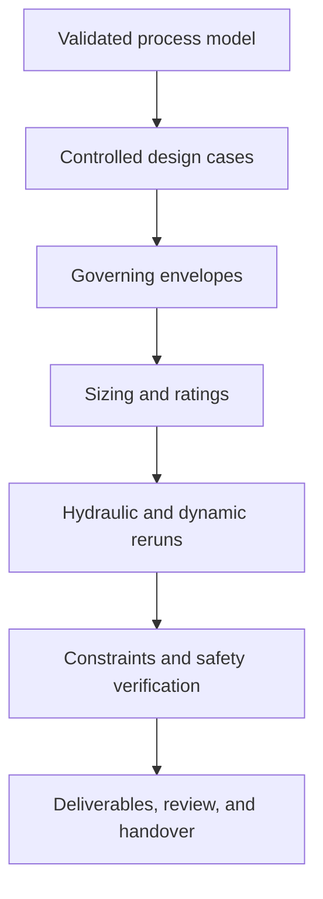

# Engineering with NeqSim

Engineering is a distinct NeqSim topic. Process simulation predicts how a modeled facility behaves. Engineering uses
those results to establish governing cases, select dimensions and ratings, verify constraints, document assumptions,
and prepare controlled deliverables for review and handover.

NeqSim supports this progression while preserving an important boundary: calculated outputs are preliminary and
review-required unless the required project, vendor, independent-validation, safety-lifecycle, and authority evidence
has been supplied and approved.

## Start here

| Resource | Use it for |
| --- | --- |
| [Engineering Guide](guide) | A practical, gated path from a validated process model to a review-ready package |
| [Design Cases and Governing Envelopes](design-cases-and-envelopes) | Controlled case definitions, metrics, isolated execution, limits, and governing-value selection |
| [DEXPI Engineering Guide](dexpi-guide) | Selecting, generating, validating, and qualifying DEXPI Plant, Process, Proteus, and pyDEXPI exchanges |
| [Engineering Deliverables and Handover](deliverables-and-handover) | Coordinated packages, registers, DEXPI, CFIHOS, approvals, manifests, and revisions |
| [Engineering Simulator Foundations](../integration/engineering-simulator-foundations) | Core concepts: isolated cases, provenance, readiness, uncertainty, and verification |
| [Process-to-Engineering Simulator](../integration/process-to-engineering-simulator) | Closed-loop case execution, sizing, application of selected dimensions, reruns, and convergence |
| [Complete Offshore Engineering Study](../integration/complete-offshore-process-engineering-study) | A full-facility executed example with discipline calculations and handover artifacts |

## Engineering workflow

The process model remains the physics source. Engineering calculations operate on isolated copies so selected design
variables can be applied and evaluated without mutating the original model. The resulting package retains its input
basis, governing case, method identity, units, warnings, uncertainty, constraints, and approval state.

## Core API map

| Purpose | Primary API |
| --- | --- |
| Governed project and design basis | `EngineeringProject`, `NorsokOffshoreEngineeringBuilder` |
| Executable cases and envelopes | `EngineeringDesignCase`, `EngineeringCaseRunner`, `EngineeringDesignEnvelope` |
| Closed process/design loop | `ProcessToEngineeringSimulator`, `ProcessToEngineeringDesignBuilder`, `EngineeringDesignModule` |
| Typed discipline calculations | `EngineeringCalculationModule` and the calculation classes under `neqsim.process.engineering` |
| Canonical model and deliverables | `EngineeringGraph`, `EngineeringDeliverableCompiler` |
| Multi-area execution | `ProcessModelEngineeringSimulator` |
| Revision impact | `GeneralizedImpactAnalyzer` and the engineering change-event API |

## Documentation by engineering activity

### Basis, cases, and convergence

| Topic | Documentation |
| --- | --- |
| Controlled case definitions and governing metrics | [Design Cases and Governing Envelopes](design-cases-and-envelopes) |
| Process design workflow | [Process Design Guide](../process/process_design_guide) |
| Explicit design framework and constraints | [Design Framework](../process/DESIGN_FRAMEWORK) |
| Isolated deterministic case execution | [Engineering Simulator Foundations](../integration/engineering-simulator-foundations) |
| Iterative sizing and process/design convergence | [Process-to-Engineering Simulator](../integration/process-to-engineering-simulator) |
| Numerical health and engineering closure | [Numerical Health and Engineering Closure](../integration/numerical-health-and-engineering-closure) |

### Equipment and discipline engineering

| Discipline | Documentation |
| --- | --- |
| Equipment and mechanical | [Mechanical Design](../process/mechanical_design), [Design Standards](../process/mechanical_design_standards), [Equipment Datasheets](../process/equipment_datasheets) |
| Piping and pipelines | [Topside Piping Design](../process/topside_piping_design), [Pipeline Mechanical Design](../process/pipeline_mechanical_design), [Piping Route Builder](../process/piping_route_builder) |
| Valves and instruments | [Valve Mechanical Design](../process/ValveMechanicalDesign), [Instrument Design](../process/instrument-design) |
| Electrical and drivers | [Electrical Design](../process/electrical-design), [Motor Mechanical Design](../process/motor-mechanical-design) |
| Wells and subsea | [Well Mechanical Design](../process/well_mechanical_design), [SURF and Subsea Equipment](../process/SURF_SUBSEA_EQUIPMENT) |
| Utilities and energy | [Engineering Utilities](../process/engineering_utilities_v2), [Exergy Analysis](../process/exergy-analysis) |

### Safety and operability

Engineering cases and dimensions must be checked together with the facility's control and safeguarding response.
NeqSim provides calculation and evidence structures for relief, blowdown, flare, ESD, HIPPS, SIS, dynamic safe-state
verification, consequence analysis, and reliability. Scenario credibility, safeguards, SIL targets, and acceptance
remain controlled engineering decisions.

| Topic | Documentation |
| --- | --- |
| Safety systems | [Safety Documentation](../safety/) |
| Risk, reliability, and SIS integration | [Risk and Reliability](../risk/) |
| Governed scenario and design-loop integration | [Process-to-Engineering Simulator](../integration/process-to-engineering-simulator#safety-and-scenario-integration) |
| P&ID control and safeguarding synthesis | [P&ID Design Synthesis](../pid-design-synthesis) |

### Deliverables, exchange, and handover

| Topic | Documentation |
| --- | --- |
| DEXPI workflow selection and qualification | [DEXPI Engineering Guide](dexpi-guide) |
| Package layers, issue workflow, and consumer checks | [Engineering Deliverables and Handover](deliverables-and-handover) |
| Canonical engineering graph and DEXPI | [DEXPI Engineering Generation](../integration/dexpi-engineering-generation) |
| End-to-end artifact and approval workflow | [Process Model to Engineering Workflow](../integration/process-to-engineering-workflow) |
| Controlled engineering data handover | [CFIHOS 2.0 Engineering Handover](../integration/cfihos-20-engineering-handover) |
| Evidence and production readiness | [Operational Evidence Package](../process/operational_evidence_package), [Industrial Method Qualification](../integration/industrial-method-qualification) |

### Change management

A design is not complete when the first package is generated. NeqSim can retain revision identity, represent a model
change as an event, traverse engineering dependencies, and identify calculations, documents, validations, and
approvals that have become stale.

| Topic | Documentation |
| --- | --- |
| Controlled change events | [Model Change Events](../process/model-change-events) |
| Dependency-derived impact scope | [Model Impact Analysis](../process/model-impact-analysis) |
| Revision-aware package generation | [Process Model to Engineering Workflow](../integration/process-to-engineering-workflow) |

## Executable learning path

1. Read the [Engineering Guide](guide) to choose the appropriate workflow and gates.
2. Run the focused [`process_to_engineering_simulator.ipynb`](https://github.com/equinor/neqsim/blob/master/examples/notebooks/process_to_engineering_simulator.ipynb)
   example for the closed design loop.
3. Run the
   [`complete_offshore_process_engineering_study.ipynb`](https://github.com/equinor/neqsim/blob/master/examples/notebooks/complete_offshore_process_engineering_study.ipynb)
   example to see a multi-discipline facility package.
4. Use the [Process Model to Engineering Workflow](../integration/process-to-engineering-workflow) when moving from a
   single `ProcessSystem` to governed multi-area delivery.

## Engineering status boundary

NeqSim can calculate, organize, trace, and validate engineering evidence. It does not grant approval, make a HAZOP or
LOPA decision, replace vendor guarantees, perform independent verification, or declare a design fit for construction.
Production-readiness and handover contracts therefore fail closed when required evidence or accountable review is
missing.
