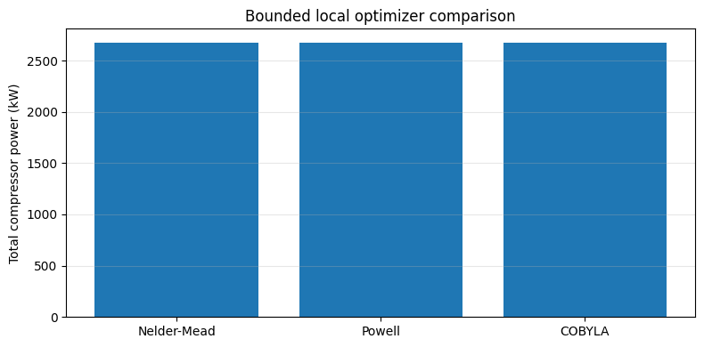
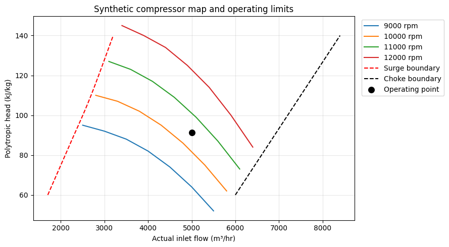
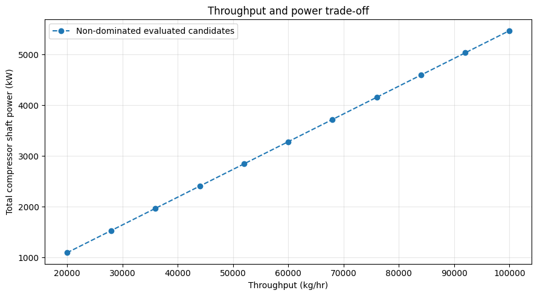

> **Note:** This is an auto-generated Markdown version of the Jupyter notebook
> [`NeqSim_Python_Optimization.ipynb`](https://github.com/equinor/neqsim/blob/master/docs/examples/NeqSim_Python_Optimization.ipynb).
> You can also [view it on nbviewer](https://nbviewer.org/github/equinor/neqsim/blob/master/docs/examples/NeqSim_Python_Optimization.ipynb)
> or [open in Google Colab](https://colab.research.google.com/github/equinor/neqsim/blob/master/docs/examples/NeqSim_Python_Optimization.ipynb).

---

This notebook demonstrates how to use **Python optimization libraries** (SciPy, etc.) with **NeqSim process simulations**. This approach gives you the flexibility of Python's optimization ecosystem while leveraging NeqSim's rigorous thermodynamics and equipment models.

## Table of Contents

1. [Introduction](#1-introduction)
2. [Setup and Imports](#2-setup-and-imports)
3. [Creating a Process Model](#3-creating-a-process-model)
4. [Defining the Optimization Problem](#4-defining-the-optimization-problem)
5. [Using SciPy Optimizers](#5-using-scipy-optimizers)
6. [Equipment Constraints](#6-equipment-constraints)
   - 6.2 [Compressor Curves and Surge/Choke Constraints](#62-compressor-curves-and-surgechoke-constraints)
   - 6.2.1 [Optimization with Compressor Curve Constraints](#621-optimization-with-compressor-curve-constraints)
   - 6.2.2 [Using CompressorChartGenerator](#622-using-compressorchartgenerator-automatic-curves)
   - 6.2.3 [Multi-Map MW Interpolation](#623-multi-map-mw-interpolation-for-varying-gas-composition)
7. [Multi-Objective with Pareto](#7-multi-objective-with-pareto)
8. [Global Optimization](#8-global-optimization)
9. [Gradient-Based Optimization](#9-gradient-based-optimization)
10. [Best Practices](#10-best-practices)

## 1. Introduction

### Why Use Python Optimizers with NeqSim?

| Approach | Advantages | Best For |
|----------|------------|----------|
| **NeqSim Built-in** (ProductionOptimizer) | Integrated, equipment-aware | Standard throughput optimization |
| **Python + NeqSim** | Flexible, any algorithm, custom objectives | Research, complex constraints, ML integration |

### Architecture

SciPy proposes a bounded vector of operating conditions. A Python wrapper applies
those conditions, runs a NeqSim process, and evaluates objectives and constraints
from the same process state. The flowsheet is a feed, first compressor, intercooler,
second compressor and aftercooler. Compressor curves are demonstrated separately.


## 2. Setup and Imports
Run cells in order in a fresh runtime. The setup installs missing dependencies
with the active Python interpreter. A compiled checkout loads `target/classes`
through `neqsim_dev_setup`; a standalone Colab notebook uses the published package.
Restart the kernel after upgrading the package or changing Java classes.


**Execution source:** Run all cells in a fresh Python kernel with Git and JDK 17+. An existing compiled NeqSim checkout is used first. Otherwise setup fetches and builds the documentation source at `refs/pull/3597/head`, which contains fixes exercised here. Set `NEQSIM_GIT_REF` before running to validate another commit or ref. The public Python package supplies the bridge and helpers; its bundled Java library alone is not the validated source for this notebook. The first source build can take several minutes.


```python
import importlib.util
import os
import subprocess
import sys
import tempfile
from pathlib import Path

# Install Python packages with this notebook kernel. Java runs from the
# validated documentation source below, ahead of the package's bundled JAR.
required = {"neqsim": "neqsim>=3.20.0,<4", "numpy": "numpy",
            "scipy": "scipy>=1.14,<2", "matplotlib": "matplotlib", "pandas": "pandas"}
missing = [package for module, package in required.items()
           if importlib.util.find_spec(module) is None]
if missing:
    subprocess.check_call([sys.executable, "-m", "pip", "install", *missing])

candidate = Path(os.environ.get("NEQSIM_PROJECT_ROOT", Path.cwd())).resolve()
PROJECT_ROOT = next((p for p in [candidate, *candidate.parents]
                     if (p / "pom.xml").is_file()
                     and (p / "devtools/neqsim_dev_setup.py").is_file()), None)
if PROJECT_ROOT is None:
    # The public package alone predates fixes exercised by these examples.
    # Use the validated documentation PR's source; override with another fixed
    # commit or ref through NEQSIM_GIT_REF when validating a newer revision.
    source_ref = os.environ.get("NEQSIM_GIT_REF", "refs/pull/3597/head")
    PROJECT_ROOT = Path(tempfile.mkdtemp(prefix="neqsim-optimization-"))
    subprocess.check_call(["git", "init", "-q", str(PROJECT_ROOT)])
    subprocess.check_call(["git", "-C", str(PROJECT_ROOT), "remote", "add", "origin",
                           "https://github.com/equinor/neqsim.git"])
    subprocess.check_call(["git", "-C", str(PROJECT_ROOT), "fetch", "--depth", "1",
                           "origin", source_ref])
    subprocess.check_call(["git", "-C", str(PROJECT_ROOT), "checkout", "--quiet",
                           "--detach", "FETCH_HEAD"])
    print(f"Fetched NeqSim documentation source: {source_ref}")

if not (PROJECT_ROOT / "target/classes/neqsim/thermo/system/SystemSrkEos.class").is_file():
    # Requires Git and JDK 17+ before the first source build.
    # The Maven wrapper downloads its own Maven distribution and dependencies.
    wrapper = "mvnw.cmd" if os.name == "nt" else "mvnw"
    build = subprocess.run(
        [str(PROJECT_ROOT / wrapper), "-q", "-DskipTests", "compile",
         "dependency:build-classpath", "-DincludeScope=runtime",
         "-Dmdep.outputFile=target/neqsim-dev-classpath.txt",
         f"-Dmdep.pathSeparator={os.pathsep}"],
        cwd=PROJECT_ROOT, text=True, stdout=subprocess.PIPE, stderr=subprocess.STDOUT,
    )
    if build.returncode:
        raise RuntimeError("NeqSim source build failed:\n" + build.stdout[-12000:])

os.environ["NEQSIM_PROJECT_ROOT"] = str(PROJECT_ROOT)
sys.path.insert(0, str(PROJECT_ROOT / "devtools"))
from neqsim_dev_setup import neqsim_init, neqsim_classes
ns = neqsim_classes(neqsim_init(project_root=PROJECT_ROOT,
                              recompile=False, verbose=False))
NEQSIM_MODE = "workspace target/classes"
from neqsim import jneqsim
import numpy as np
import matplotlib.pyplot as plt

FIGURES_DIR = Path("figures")
FIGURES_DIR.mkdir(exist_ok=True)

def save_figure(filename):
    plt.savefig(FIGURES_DIR / filename, dpi=150, bbox_inches="tight")
    plt.show()

print(f"NeqSim source: {NEQSIM_MODE}")

```

<details>
<summary>Output</summary>

```
All NeqSim classes imported OK
NeqSim source: workspace target/classes
```

</details>

```python
# Python imports
import numpy as np
from scipy import optimize
import matplotlib.pyplot as plt

# NeqSim imports via JPype
from neqsim import jneqsim
import scipy

# Process equipment
ProcessSystem = jneqsim.process.processmodel.ProcessSystem
Stream = jneqsim.process.equipment.stream.Stream
Compressor = jneqsim.process.equipment.compressor.Compressor
Cooler = jneqsim.process.equipment.heatexchanger.Cooler
Heater = jneqsim.process.equipment.heatexchanger.Heater
Separator = jneqsim.process.equipment.separator.Separator
ThrottlingValve = jneqsim.process.equipment.valve.ThrottlingValve
Mixer = jneqsim.process.equipment.mixer.Mixer
Splitter = jneqsim.process.equipment.splitter.Splitter

# Thermodynamic systems
SystemSrkEos = jneqsim.thermo.system.SystemSrkEos
SystemPrEos = jneqsim.thermo.system.SystemPrEos

print("NeqSim and SciPy loaded successfully!")
print(f"SciPy version: {scipy.__version__}")
```

<details>
<summary>Output</summary>

```
NeqSim and SciPy loaded successfully!
SciPy version: 1.17.0
```

</details>

## 3. Creating a Process Model

Let's create a gas compression and cooling process that we'll optimize.

```python
def create_gas_process(inlet_pressure=30.0, outlet_pressure=100.0):
    """
    Create a two-stage gas compression process with intercooling.
    
    Parameters:
    - inlet_pressure: Feed pressure (bara)
    - outlet_pressure: Target outlet pressure (bara)
    
    Returns:
    - ProcessSystem object
    """
    # Create natural gas fluid
    gas = SystemSrkEos(288.15, inlet_pressure)  # 15°C
    gas.addComponent("nitrogen", 0.02)
    gas.addComponent("CO2", 0.01)
    gas.addComponent("methane", 0.85)
    gas.addComponent("ethane", 0.07)
    gas.addComponent("propane", 0.03)
    gas.addComponent("i-butane", 0.01)
    gas.addComponent("n-butane", 0.01)
    gas.setMixingRule("classic")
    
    # Create process system
    process = ProcessSystem()
    
    # Feed stream
    feed = Stream("feed", gas)
    feed.setFlowRate(50000.0, "kg/hr")
    feed.setPressure(inlet_pressure, "bara")
    feed.setTemperature(288.15, "K")
    process.add(feed)
    
    # Calculate intermediate pressure (geometric mean for equal compression ratios)
    intermediate_pressure = np.sqrt(inlet_pressure * outlet_pressure)
    
    # Stage 1 compressor
    stage1 = Compressor("stage1", feed)
    stage1.setOutletPressure(intermediate_pressure)
    stage1.setUsePolytropicCalc(True)
    stage1.setPolytropicEfficiency(0.78)
    process.add(stage1)
    
    # Intercooler (cool back to near inlet temperature)
    intercooler = Cooler("intercooler", stage1.getOutletStream())
    intercooler.setOutTemperature(303.15)  # 30°C
    process.add(intercooler)
    
    # Stage 2 compressor
    stage2 = Compressor("stage2", intercooler.getOutletStream())
    stage2.setOutletPressure(outlet_pressure)
    stage2.setUsePolytropicCalc(True)
    stage2.setPolytropicEfficiency(0.76)
    process.add(stage2)
    
    # Aftercooler
    aftercooler = Cooler("aftercooler", stage2.getOutletStream())
    aftercooler.setOutTemperature(313.15)  # 40°C
    process.add(aftercooler)
    
    # Run initial simulation
    process.run()
    
    return process

# Create and test the process
process = create_gas_process()

print("Process created successfully!")
print(f"\nInitial conditions:")
print(f"  Feed flow rate: {process.getUnit('feed').getFlowRate('kg/hr'):.0f} kg/hr")
print(f"  Stage 1 power: {process.getUnit('stage1').getPower('kW'):.1f} kW")
print(f"  Stage 2 power: {process.getUnit('stage2').getPower('kW'):.1f} kW")
print(f"  Total power: {process.getUnit('stage1').getPower('kW') + process.getUnit('stage2').getPower('kW'):.1f} kW")
```

<details>
<summary>Output</summary>

```
Process created successfully!

Initial conditions:
  Feed flow rate: 50000 kg/hr
  Stage 1 power: 1343.1 kW
  Stage 2 power: 1411.9 kW
  Total power: 2755.1 kW
```

</details>

## 4. Defining the Optimization Problem

The key is creating a **Python callable** that:
1. Takes decision variables as input
2. Sets them on the NeqSim process
3. Runs the simulation
4. Returns the objective value

```python
class NeqSimOptimizationProblem:
    """Keep the objective, constraints and returned process at the requested x."""

    def __init__(self, process_factory, variable_specs, objective_func):
        self.process_factory = process_factory
        self.variable_specs = variable_specs
        self.objective_func = objective_func
        self.process = None
        self.last_x = None
        self.eval_count = 0
        self.history = []

    def get_bounds(self):
        return [(v["min"], v["max"]) for v in self.variable_specs]

    def get_x0(self):
        return np.mean(self.get_bounds(), axis=1)

    def simulate(self, x):
        x = np.asarray(x, dtype=float)
        if x.shape != (len(self.variable_specs),) or not np.all(np.isfinite(x)):
            raise ValueError("Decision vector has the wrong shape or non-finite values")
        # Exact comparison: rounding here corrupts finite-difference gradients.
        if self.last_x is None or not np.array_equal(x, self.last_x):
            process = self.process_factory()
            for spec, value in zip(self.variable_specs, x):
                spec["setter"](process, float(value))
            process.run()
            feed_rate = process.getUnit("feed").getFlowRate("kg/hr")
            outlet_rate = process.getUnit("aftercooler").getOutletStream().getFlowRate("kg/hr")
            if not np.isfinite(outlet_rate) or not np.isclose(feed_rate, outlet_rate, rtol=1e-7):
                raise RuntimeError("Simulation failed its mass-balance check")
            self.process, self.last_x = process, x.copy()
            self.eval_count += 1
        return self.process

    def evaluate(self, x):
        process = self.simulate(x)
        value = float(self.objective_func(process))
        if not np.isfinite(value):
            raise RuntimeError("Objective is not finite")
        self.history.append({"x": np.asarray(x, dtype=float).copy(), "obj": value})
        return value

    def __call__(self, x):
        return self.evaluate(x)

print("NeqSimOptimizationProblem defined; unexpected simulation errors propagate.")
```

<details>
<summary>Output</summary>

```
NeqSimOptimizationProblem defined; unexpected simulation errors propagate.
```

</details>

```python
# Define the optimization problem: Minimize total compressor power

# Decision variables
variable_specs = [
    {
        'name': 'intermediate_pressure',
        'min': 40.0,
        'max': 80.0,
        'setter': lambda proc, val: proc.getUnit('stage1').setOutletPressure(val)
    },
    {
        'name': 'intercooler_temp',
        'min': 293.15,  # 20°C
        'max': 323.15,  # 50°C
        'setter': lambda proc, val: proc.getUnit('intercooler').setOutTemperature(val)
    }
]

# Objective: Minimize total power
def total_power_objective(process):
    """Return total compressor power in kW (to minimize)."""
    power1 = process.getUnit('stage1').getPower('kW')
    power2 = process.getUnit('stage2').getPower('kW')
    return power1 + power2

# Create optimization problem
problem = NeqSimOptimizationProblem(
    process_factory=create_gas_process,
    variable_specs=variable_specs,
    objective_func=total_power_objective
)

print("Optimization problem defined:")
print(f"  Variables: {[v['name'] for v in variable_specs]}")
print(f"  Bounds: {problem.get_bounds()}")
print(f"  Initial point: {problem.get_x0()}")
```

<details>
<summary>Output</summary>

```
Optimization problem defined:
  Variables: ['intermediate_pressure', 'intercooler_temp']
  Bounds: [(40.0, 80.0), (293.15, 323.15)]
  Initial point: [ 60.   308.15]
```

</details>

## 5. Using SciPy Optimizers

### 5.1 Nelder-Mead (Derivative-Free)

```python
# Optimize using Nelder-Mead (simplex method)
problem.eval_count = 0
problem.history = []

result_nm = optimize.minimize(
    problem,
    x0=problem.get_x0(),
    method='Nelder-Mead',
    bounds=problem.get_bounds(),
    options={
        'maxiter': 100,
        'xatol': 0.1,
        'fatol': 1.0,
        'disp': True
    }
)

print("\n=== Nelder-Mead Results ===")
print(f"Success: {result_nm.success}")
print(f"Message: {result_nm.message}")
print(f"Function evaluations: {problem.eval_count}")
print(f"\nOptimal values:")
for i, var in enumerate(variable_specs):
    print(f"  {var['name']}: {result_nm.x[i]:.2f}")
print(f"\nMinimum total power: {result_nm.fun:.1f} kW")

assert result_nm.success
assert all(lb <= value <= ub for value, (lb, ub) in zip(result_nm.x, problem.get_bounds()))
```

<details>
<summary>Output</summary>

```
Optimization terminated successfully.
         Current function value: 2676.023232
         Iterations: 17
         Function evaluations: 30

=== Nelder-Mead Results ===
Success: True
Message: Optimization terminated successfully.
Function evaluations: 30

Optimal values:
  intermediate_pressure: 60.05
  intercooler_temp: 293.15

Minimum total power: 2676.0 kW
```

</details>

### 5.2 Powell Method

```python
# Optimize using Powell method
problem.eval_count = 0

result_powell = optimize.minimize(
    problem,
    x0=problem.get_x0(),
    method='Powell',
    bounds=problem.get_bounds(),
    options={
        'maxiter': 100,
        'ftol': 1e-6,
        'disp': True
    }
)

print("\n=== Powell Results ===")
print(f"Function evaluations: {problem.eval_count}")
print(f"Optimal intermediate pressure: {result_powell.x[0]:.2f} bara")
print(f"Optimal intercooler temp: {result_powell.x[1] - 273.15:.1f} °C")
print(f"Minimum total power: {result_powell.fun:.1f} kW")

assert result_powell.success
```

<details>
<summary>Output</summary>

```
Optimization terminated successfully.
         Current function value: 2676.023229
         Iterations: 3
         Function evaluations: 209

=== Powell Results ===
Function evaluations: 209
Optimal intermediate pressure: 60.06 bara
Optimal intercooler temp: 20.0 °C
Minimum total power: 2676.0 kW
```

</details>

### 5.3 Compare Algorithms

```python
# Run each optimizer with the same bounds and physical objective.
algorithms = ["Nelder-Mead", "Powell", "COBYLA"]
algorithm_results = {}
for algorithm in algorithms:
    problem.eval_count = 0
    options = {"maxiter": 250}
    if algorithm == "COBYLA":
        options.update({"rhobeg": 5.0, "tol": 1e-3})
    elif algorithm == "Powell":
        options.update({"ftol": 1e-6})
    outcome = optimize.minimize(problem, problem.get_x0(), method=algorithm,
                                bounds=problem.get_bounds(), options=options)
    problem.evaluate(outcome.x)
    assert outcome.success, f"{algorithm}: {outcome.message}"
    algorithm_results[algorithm] = {"x": outcome.x, "fun": outcome.fun,
                                    "nfev": problem.eval_count, "success": outcome.success}

print(f"{'Algorithm':<15} {'P_inter (bara)':<15} {'T_inter (C)':<15} {'Power (kW)':<12} {'Runs'}")
for name, res in algorithm_results.items():
    print(f"{name:<15} {res['x'][0]:<15.2f} {res['x'][1]-273.15:<15.2f} {res['fun']:<12.2f} {res['nfev']}")

plt.figure(figsize=(8, 4))
plt.bar(algorithm_results.keys(), [r["fun"] for r in algorithm_results.values()])
plt.ylabel("Total compressor power (kW)")
plt.title("Bounded local optimizer comparison")
plt.grid(axis="y", alpha=0.3)
plt.tight_layout()
save_figure("python-optimization-algorithms.png")
```

<details>
<summary>Output</summary>

```
Algorithm       P_inter (bara)  T_inter (C)     Power (kW)   Runs
Nelder-Mead     60.06           20.00           2676.02      58
Powell          60.06           20.00           2676.02      210
COBYLA          60.06           20.00           2676.02      39
```

</details>



All three local methods reach approximately 2,676 kW at 60.06 bara intermediate
pressure and 20 °C intercooler temperature within the same operating bounds. The optimum approaches the lower allowed intercooler
temperature because colder gas requires less second-stage compression work.
Cooling duty and utility cost are not included in this power-only objective;
include them before choosing a plant operating temperature.


## 6. Equipment Constraints

Real processes have equipment limitations. Let's add constraints for:
- Maximum compressor discharge temperature
- Maximum compressor power
- Minimum/maximum pressure ratios


```python
class ConstrainedOptimizationProblem(NeqSimOptimizationProblem):
    """Evaluate each constraint at exactly the x requested by SciPy."""

    def __init__(self, process_factory, variable_specs, objective_func, constraint_specs):
        super().__init__(process_factory, variable_specs, objective_func)
        self.constraint_specs = constraint_specs

    def evaluate_constraints(self, x):
        process = self.simulate(x)
        values = []
        for spec in self.constraint_specs:
            actual = float(spec["evaluator"](process))
            if not np.isfinite(actual):
                raise RuntimeError(f"Non-finite constraint {spec['name']}")
            margin = spec["limit"] - actual if spec["type"] == "max" else actual - spec["limit"]
            values.append(margin)
        return np.asarray(values)

    def get_scipy_constraints(self):
        return [{"type": "ineq", "fun": self.evaluate_constraints}]

print("Constraint margins use the current decision vector, regardless of call order.")
```

<details>
<summary>Output</summary>

```
Constraint margins use the current decision vector, regardless of call order.
```

</details>

```python
# Define equipment constraints
constraint_specs = [
    {
        'name': 'max_stage1_discharge_temp',
        'type': 'max',
        'limit': 423.15,  # 150°C
        'evaluator': lambda proc: proc.getUnit('stage1').getOutletStream().getTemperature('K')
    },
    {
        'name': 'max_stage2_discharge_temp',
        'type': 'max',
        'limit': 423.15,  # 150°C
        'evaluator': lambda proc: proc.getUnit('stage2').getOutletStream().getTemperature('K')
    },
    {
        'name': 'max_stage1_power',
        'type': 'max',
        'limit': 2500.0,  # kW
        'evaluator': lambda proc: proc.getUnit('stage1').getPower('kW')
    },
    {
        'name': 'max_stage2_power',
        'type': 'max',
        'limit': 2500.0,  # kW
        'evaluator': lambda proc: proc.getUnit('stage2').getPower('kW')
    },
    {
        'name': 'min_pressure_ratio_stage1',
        'type': 'min',
        'limit': 1.5,  # Minimum compression ratio
        'evaluator': lambda proc: (
            proc.getUnit('stage1').getOutletStream().getPressure('bara') /
            proc.getUnit('stage1').getInletStream().getPressure('bara')
        )
    }
]

# Create constrained problem
constrained_problem = ConstrainedOptimizationProblem(
    process_factory=create_gas_process,
    variable_specs=variable_specs,
    objective_func=total_power_objective,
    constraint_specs=constraint_specs
)

print(f"Defined {len(constraint_specs)} constraints:")
for spec in constraint_specs:
    print(f"  - {spec['name']}: {spec['type']} {spec['limit']}")
# A constraint callback may be the first request, or follow an unrelated trial.
constrained_problem.evaluate_constraints([50.0, 303.15])
constrained_problem.evaluate([75.0, 313.15])
constrained_problem.evaluate_constraints([50.0, 303.15])
assert np.isclose(constrained_problem.process.getUnit("stage1").getOutletStream().getPressure("bara"), 50.0)
```

<details>
<summary>Output</summary>

```
Defined 5 constraints:
  - max_stage1_discharge_temp: max 423.15
  - max_stage2_discharge_temp: max 423.15
  - max_stage1_power: max 2500.0
  - max_stage2_power: max 2500.0
  - min_pressure_ratio_stage1: min 1.5
```

</details>

## 6.2 Compressor Curves and Surge/Choke Constraints

Compressor maps specify head and efficiency as functions of actual inlet volume
flow and rotational speed. The synthetic demonstration data below are not vendor
data. Enforce the surge boundary, choke boundary, speed range, power rating and
minimum delivery pressure together. A specified speed with an active map determines
discharge pressure; `setOutletPressure` alone does not enforce an export requirement.

Surge margin is `(flow - surge_flow) / surge_flow`; multiplying by 100 gives percent.


```python
# Import compressor curve classes
from jpype import JArray, JDouble

CompressorChart = jneqsim.process.equipment.compressor.CompressorChart
CompressorChartGenerator = jneqsim.process.equipment.compressor.CompressorChartGenerator

def create_process_with_compressor_curves():
    """
    Create a gas compression process with compressor performance curves.
    """
    # Create natural gas fluid
    gas = SystemSrkEos(288.15, 30.0)  # 15°C, 30 bara
    gas.addComponent("nitrogen", 0.02)
    gas.addComponent("methane", 0.85)
    gas.addComponent("ethane", 0.08)
    gas.addComponent("propane", 0.05)
    gas.setMixingRule("classic")
    
    # Create process system
    process = ProcessSystem()
    
    # Feed stream
    feed = Stream("feed", gas)
    feed.setFlowRate(5000.0, "Am3/hr")  # Actual m³/hr
    feed.setPressure(30.0, "bara")
    feed.setTemperature(288.15, "K")
    process.add(feed)
    
    # Create compressor
    compressor = Compressor("compressor", feed)
    compressor.setOutletPressure(80.0)  # bara
    compressor.setUsePolytropicCalc(True)
    compressor.setPolytropicEfficiency(0.78)
    process.add(compressor)
    
    # ========================================
    # SET UP COMPRESSOR PERFORMANCE CURVES
    # ========================================
    
    # Get or create compressor chart
    chart = compressor.getCompressorChart()
    
    # Chart conditions: [temperature (°C), pressure (bara), density (kg/m³), MW (g/mol)]
    chart_conditions = JArray(JDouble)([25.0, 30.0, 25.0, 18.0])
    
    # Define speed curves (RPM)
    speeds = JArray(JDouble)([9000, 10000, 11000, 12000])
    
    # Flow values for each speed (Am3/hr)
    # Using Python lists, then converting to Java arrays
    flow_data = [
        [2500, 3000, 3500, 4000, 4500, 5000, 5500],  # 9000 RPM
        [2800, 3300, 3800, 4300, 4800, 5300, 5800],  # 10000 RPM
        [3100, 3600, 4100, 4600, 5100, 5600, 6100],  # 11000 RPM
        [3400, 3900, 4400, 4900, 5400, 5900, 6400]   # 12000 RPM
    ]
    
    # Head values for each speed (kJ/kg)
    head_data = [
        [95, 92, 88, 82, 74, 64, 52],   # 9000 RPM
        [110, 107, 102, 95, 86, 75, 62], # 10000 RPM
        [127, 123, 117, 109, 99, 87, 73], # 11000 RPM
        [145, 140, 134, 125, 114, 100, 84] # 12000 RPM
    ]
    
    # Polytropic efficiency for each speed (%)
    eff_data = [
        [74, 77, 79, 80, 79, 76, 71],   # 9000 RPM
        [75, 78, 80, 81, 80, 77, 72],   # 10000 RPM
        [74, 77, 79, 80, 79, 76, 71],   # 11000 RPM
        [73, 76, 78, 79, 78, 75, 70]    # 12000 RPM
    ]
    
    # Convert to Java 2D arrays
    n_speeds = len(speeds)
    n_points = len(flow_data[0])
    
    flow_array = JArray(JArray(JDouble))(n_speeds)
    head_array = JArray(JArray(JDouble))(n_speeds)
    eff_array = JArray(JArray(JDouble))(n_speeds)
    
    for i in range(n_speeds):
        flow_array[i] = JArray(JDouble)(flow_data[i])
        head_array[i] = JArray(JDouble)(head_data[i])
        eff_array[i] = JArray(JDouble)(eff_data[i])
    
    # Set the curves on the chart
    chart.setCurves(chart_conditions, speeds, flow_array, head_array, flow_array, eff_array)
    chart.setHeadUnit("kJ/kg")
    chart.setUseCompressorChart(True)
    
    # ========================================
    # SET SURGE CURVE
    # ========================================
    surge_flow = JArray(JDouble)([2300, 2600, 2900, 3200])  # Am3/hr at surge
    surge_head = JArray(JDouble)([90, 105, 122, 140])        # kJ/kg at surge
    chart.getSurgeCurve().setCurve(chart_conditions, surge_flow, surge_head)
    
    # ========================================
    # SET STONE WALL (CHOKE) CURVE
    # ========================================
    stonewall_flow = JArray(JDouble)([5700, 6000, 6300, 6600])  # Am3/hr at choke
    stonewall_head = JArray(JDouble)([50, 60, 70, 80])           # kJ/kg at choke
    chart.getStoneWallCurve().setCurve(chart_conditions, stonewall_flow, stonewall_head)
    
    # Set compressor speed
    compressor.setSpeed(10500)  # RPM
    compressor.setUsePolytropicCalc(True)
    
    # Aftercooler
    aftercooler = Cooler("aftercooler", compressor.getOutletStream())
    aftercooler.setOutTemperature(313.15)  # 40°C
    process.add(aftercooler)
    
    process.run()
    return process

# Create the process
process_curves = create_process_with_compressor_curves()

# Get compressor info
comp = process_curves.getUnit("compressor")
print("=== Compressor with Performance Curves ===")
print(f"Flow rate: {comp.getInletStream().getFlowRate('Am3/hr'):.0f} Am3/hr")
print(f"Speed: {comp.getSpeed():.0f} RPM")
print(f"Polytropic head: {comp.getPolytropicHead('kJ/kg'):.1f} kJ/kg")
print(f"Polytropic efficiency: {comp.getPolytropicEfficiency()*100:.1f} %")
print(f"Power: {comp.getPower('kW'):.1f} kW")
```

<details>
<summary>Output</summary>

```
=== Compressor with Performance Curves ===
Flow rate: 5000 Am3/hr
Speed: 10500 RPM
Polytropic head: 91.4 kJ/kg
Polytropic efficiency: 78.2 %
Power: 4160.5 kW
```

</details>

```python
# Check surge and choke margins
chart = comp.getCompressorChart()

# Get current operating point
flow = comp.getInletStream().getFlowRate("Am3/hr")
head = comp.getPolytropicHead("kJ/kg")

# Check distance to operating limits
surge_curve = chart.getSurgeCurve()
stonewall_curve = chart.getStoneWallCurve()

# Check if in surge or choked
is_surge = surge_curve.isSurge(head, flow)
is_stonewall = stonewall_curve.isStoneWall(head, flow)

print("\n=== Operating Limit Analysis ===")
print(f"Operating point: {flow:.0f} Am3/hr, {head:.1f} kJ/kg")
print(f"In surge: {is_surge}")
print(f"Is choked (stone wall): {is_stonewall}")

# Get surge and stonewall flows at current head
surge_flow = surge_curve.getSurgeFlow(head)
stonewall_flow = stonewall_curve.getStoneWallFlow(head)

print(f"\nAt head = {head:.1f} kJ/kg:")
print(f"  Surge flow: {surge_flow:.0f} Am3/hr")
print(f"  Stone wall flow: {stonewall_flow:.0f} Am3/hr")
print(f"  Current flow: {flow:.0f} Am3/hr")

# Calculate margins
surge_margin = (flow - surge_flow) / surge_flow * 100
stonewall_margin = (stonewall_flow - flow) / stonewall_flow * 100

print(f"\n  Surge margin: {surge_margin:.1f}%")
print(f"  Stone wall margin: {stonewall_margin:.1f}%")
assert not is_surge and not is_stonewall
assert 0.0 < comp.getPolytropicEfficiency() < 1.0
plt.figure(figsize=(9, 5))
for speed, flows, heads in zip(chart.getSpeeds(), chart.getFlows(), chart.getHeads()):
    plt.plot(flows, heads, label=f"{speed:.0f} rpm")
head_values = np.linspace(60.0, 140.0, 100)
plt.plot([surge_curve.getSurgeFlow(h) for h in head_values], head_values,
         "r--", label="Surge boundary")
plt.plot([stonewall_curve.getStoneWallFlow(h) for h in head_values], head_values,
         "k--", label="Choke boundary")
plt.scatter([flow], [head], color="black", s=70, zorder=5, label="Operating point")
plt.xlabel("Actual inlet flow (m³/hr)")
plt.ylabel("Polytropic head (kJ/kg)")
plt.title("Synthetic compressor map and operating limits")
plt.grid(alpha=0.3)
plt.legend(loc="upper left", bbox_to_anchor=(1.01, 1.0))
plt.tight_layout()
save_figure("python-optimization-compressor-map.png")
```

<details>
<summary>Output</summary>

```

=== Operating Limit Analysis ===
Operating point: 5000 Am3/hr, 91.4 kJ/kg
In surge: False
Is choked (stone wall): False

At head = 91.4 kJ/kg:
  Surge flow: 2329 Am3/hr
  Stone wall flow: 6943 Am3/hr
  Current flow: 5000 Am3/hr

  Surge margin: 114.7%
  Stone wall margin: 28.0%
```

</details>



The initial operating point (5,000 actual m³/hr and approximately 91 kJ/kg)
lies between the synthetic surge and choke boundaries.
Head rises with speed and drops with increasing flow along each speed curve.
The reported margins quantify distance to these boundaries, but a valid delivery
pressure and driver duty must also be checked. Replace these illustrative curves
with qualified vendor data for equipment decisions.


### 6.2.1 Optimization with Compressor Curve Constraints

Now let's optimize while respecting the compressor curve limits (surge and choke).


```python
class CompressorCurveOptimization:
    """Reuse one exact x across objective and independently called constraints."""

    def __init__(self):
        self.process = None
        self.last_x = None
        self.eval_count = 0
        self.history = []

    def simulate(self, x):
        x = np.asarray(x, dtype=float)
        if self.last_x is None or not np.array_equal(x, self.last_x):
            process = create_process_with_compressor_curves()
            process.getUnit("feed").setFlowRate(float(x[0]), "Am3/hr")
            process.getUnit("compressor").setSpeed(float(x[1]))
            process.run()
            self.process, self.last_x = process, x.copy()
            self.eval_count += 1
        return self.process.getUnit("compressor")

    def objective(self, x):
        comp = self.simulate(x)
        value = comp.getPower("kW") / (comp.getInletStream().getFlowRate("Am3/hr") / 1000.0)
        if not np.isfinite(value):
            raise RuntimeError("Non-finite mapped compressor objective")
        self.history.append({"x": np.asarray(x).copy(), "obj": value})
        return value

    def margins(self, x, minimum_surge_margin=0.10, maximum_power=5000.0,
                minimum_pressure=80.0):
        comp = self.simulate(x)
        chart = comp.getCompressorChart()
        flow = comp.getInletStream().getFlowRate("Am3/hr")
        head = comp.getPolytropicHead("kJ/kg")
        surge_flow = chart.getSurgeCurve().getSurgeFlow(head)
        choke_flow = chart.getStoneWallCurve().getStoneWallFlow(head)
        return np.array([
            (flow - surge_flow) / surge_flow - minimum_surge_margin,
            (choke_flow - flow) / choke_flow,
            (maximum_power - comp.getPower("kW")) / maximum_power,
            (comp.getOutletStream().getPressure("bara") - minimum_pressure) / minimum_pressure,
        ])

curve_problem = CompressorCurveOptimization()
print("Variables: actual inlet flow (m3/hr), speed (rpm)")
print("Minimize specific power with surge margin >= 10%, no choke,")
print("shaft power <= 5000 kW, and delivery pressure >= 80 bara.")
```

<details>
<summary>Output</summary>

```
Variables: actual inlet flow (m3/hr), speed (rpm)
Minimize specific power with surge margin >= 10%, no choke,
shaft power <= 5000 kW, and delivery pressure >= 80 bara.
```

</details>

```python
# Normalize the different variable scales before SLSQP finite differences.
curve_lower = np.array([3000.0, 9000.0])
curve_upper = np.array([6000.0, 12000.0])
def physical_curve_variables(u):
    return curve_lower + np.asarray(u) * (curve_upper - curve_lower)

curve_result_scaled = optimize.minimize(
    lambda u: curve_problem.objective(physical_curve_variables(u)) / 1000.0,
    x0=np.array([0.5, 0.5]), method="SLSQP", bounds=[(0.0, 1.0)] * 2,
    constraints=[{"type": "ineq", "fun": lambda u: curve_problem.margins(physical_curve_variables(u))}],
    options={"maxiter": 100, "ftol": 1e-8, "eps": 1e-5},
)
curve_optimum = physical_curve_variables(curve_result_scaled.x)
comp_opt = curve_problem.simulate(curve_optimum)
curve_margins = curve_problem.margins(curve_optimum)
assert curve_result_scaled.success, curve_result_scaled.message
assert np.min(curve_margins) >= -1e-6
assert np.isclose(comp_opt.getInletStream().getFlowRate("Am3/hr"), curve_optimum[0], rtol=1e-7)
print(f"Flow: {curve_optimum[0]:.1f} actual m3/hr; speed: {curve_optimum[1]:.1f} rpm")
print(f"Specific power: {curve_problem.objective(curve_optimum):.2f} kW per 1000 actual m3/hr")
print(f"Power: {comp_opt.getPower('kW'):.2f} kW")
print(f"Delivery pressure: {comp_opt.getOutletStream().getPressure('bara'):.3f} bara")
print("Constraint margins [surge, choke, power, delivery pressure]:", curve_margins)
```

<details>
<summary>Output</summary>

```
Flow: 4252.0 actual m3/hr; speed: 11470.2 rpm
Specific power: 1175.93 kW per 1000 actual m3/hr
Power: 5000.00 kW
Delivery pressure: 80.000 bara
Constraint margins [surge, choke, power, delivery pressure]: [ 3.02306815e-01  4.74845846e-01 -1.70985004e-14 -1.66977543e-14]
```

</details>

### 6.2.2 Using CompressorChartGenerator (Automatic Curves)

NeqSim can automatically generate compressor curves from templates. This is useful when you don't have detailed vendor data.
Generate a template only after running a positive-flow design point, so its head
and efficiency are initialized. A generated map is a preliminary estimate, not
validated vendor performance.


```python
# Automatic curve generation using templates

def create_process_with_generated_curves():
    """
    Create process with automatically generated compressor curves.
    """
    gas = SystemSrkEos(288.15, 30.0)
    gas.addComponent("nitrogen", 0.02)
    gas.addComponent("methane", 0.85)
    gas.addComponent("ethane", 0.08)
    gas.addComponent("propane", 0.05)
    gas.setMixingRule("classic")
    
    process = ProcessSystem()
    
    feed = Stream("feed", gas)
    feed.setFlowRate(5000.0, "Am3/hr")
    feed.setPressure(30.0, "bara")
    feed.setTemperature(288.15, "K")
    process.add(feed)
    
    compressor = Compressor("compressor", feed)
    compressor.setOutletPressure(80.0)
    compressor.setUsePolytropicCalc(True)
    compressor.setPolytropicEfficiency(0.78)
    compressor.setSpeed(10000.0)
    process.add(compressor)
    process.run()  # Establish the design head before scaling the template.
    
    # ========================================
    # AUTOMATIC CURVE GENERATION
    # ========================================
    
    # Create chart generator
    generator = CompressorChartGenerator(compressor)
    
    # Available templates:
    # - "BASIC_CENTRIFUGAL": General purpose
    # - "PIPELINE": High efficiency for pipeline compression
    # - "PROCESS": Process gas compression
    # - "HIGH_RATIO": High pressure ratio applications
    # - "LOW_FLOW": Low flow applications
    # - "HIGH_SPEED": High speed (>15000 RPM)
    # - "OIL_GAS": Offshore/oil & gas applications
    
    # Generate chart from template
    # Parameters: (template_name, number_of_speed_curves)
    chart = generator.generateFromTemplate("PIPELINE", 5)
    
    # Set the generated chart on the compressor
    compressor.setCompressorChart(chart)
    chart.setUseCompressorChart(True)
    
    # Set operating speed (within the generated range)
    compressor.setSpeed(10000)  # RPM
    compressor.setUsePolytropicCalc(True)
    
    aftercooler = Cooler("aftercooler", compressor.getOutletStream())
    aftercooler.setOutTemperature(313.15)
    process.add(aftercooler)
    
    process.run()
    return process

# Create process with auto-generated curves
process_auto = create_process_with_generated_curves()

comp_auto = process_auto.getUnit("compressor")
chart_auto = comp_auto.getCompressorChart()

print("=== Process with Auto-Generated Compressor Curves ===")
print(f"Flow rate: {comp_auto.getInletStream().getFlowRate('Am3/hr'):.0f} Am3/hr")
print(f"Speed: {comp_auto.getSpeed():.0f} RPM")
print(f"Polytropic head: {comp_auto.getPolytropicHead('kJ/kg'):.1f} kJ/kg")
print(f"Polytropic efficiency: {comp_auto.getPolytropicEfficiency()*100:.1f} %")
print(f"Power: {comp_auto.getPower('kW'):.1f} kW")

# Check operating limits with generated curves
flow_auto = comp_auto.getInletStream().getFlowRate("Am3/hr")
head_auto = comp_auto.getPolytropicHead("kJ/kg")

print(f"\nOperating limits:")
print(f"  In surge: {chart_auto.getSurgeCurve().isSurge(head_auto, flow_auto)}")
print(f"  Is choked: {chart_auto.getStoneWallCurve().isStoneWall(head_auto, flow_auto)}")

assert comp_auto.getPolytropicHead("kJ/kg") > 0.0
assert 0.0 < comp_auto.getPolytropicEfficiency() < 1.0
```

<details>
<summary>Output</summary>

```
=== Process with Auto-Generated Compressor Curves ===
Flow rate: 5000 Am3/hr
Speed: 10000 RPM
Polytropic head: 133.9 kJ/kg
Polytropic efficiency: 84.0 %
Power: 5675.3 kW

Operating limits:
  In surge: False
  Is choked: False
```

</details>

### 6.2.3 Multi-Map MW Interpolation for Varying Gas Composition

When gas composition varies, use `CompressorChartMWInterpolation` to interpolate between maps measured at different molecular weights.

```python
# Using MW interpolation charts for varying gas composition

CompressorChartMWInterpolation = jneqsim.process.equipment.compressor.CompressorChartMWInterpolation

def create_process_with_mw_chart():
    """
    Create process with multi-MW interpolation chart.
    """
    # Create gas with specific composition
    gas = SystemSrkEos(288.15, 30.0)
    gas.addComponent("nitrogen", 0.02)
    gas.addComponent("methane", 0.82)  # MW will be ~18 g/mol
    gas.addComponent("ethane", 0.10)
    gas.addComponent("propane", 0.06)
    gas.setMixingRule("classic")
    
    process = ProcessSystem()
    
    feed = Stream("feed", gas)
    feed.setFlowRate(4500.0, "Am3/hr")
    feed.setPressure(30.0, "bara")
    feed.setTemperature(288.15, "K")
    process.add(feed)
    
    compressor = Compressor("compressor", feed)
    compressor.setOutletPressure(80.0)
    process.add(compressor)
    
    # ========================================
    # MULTI-MW INTERPOLATION CHART
    # ========================================
    
    chart = CompressorChartMWInterpolation()
    chart.setHeadUnit("kJ/kg")
    chart.setAutoGenerateSurgeCurves(True)
    chart.setAutoGenerateStoneWallCurves(True)
    
    # Define speeds (common for all MW maps)
    speeds = JArray(JDouble)([9000, 10000, 11000, 12000])
    
    # Chart conditions
    chart_conditions = JArray(JDouble)([25.0, 30.0, 25.0, 18.0])
    
    # === MAP AT MW = 16 g/mol (lighter gas, e.g., high methane) ===
    flow_16 = [
        JArray(JDouble)([3200, 3700, 4200, 4700, 5200]),
        JArray(JDouble)([3500, 4000, 4500, 5000, 5500]),
        JArray(JDouble)([3800, 4300, 4800, 5300, 5800]),
        JArray(JDouble)([4100, 4600, 5100, 5600, 6100])
    ]
    head_16 = [
        JArray(JDouble)([100, 96, 90, 82, 72]),
        JArray(JDouble)([115, 111, 104, 95, 84]),
        JArray(JDouble)([132, 127, 119, 109, 96]),
        JArray(JDouble)([151, 145, 136, 125, 110])
    ]
    eff_16 = [
        JArray(JDouble)([76, 79, 81, 79, 75]),
        JArray(JDouble)([77, 80, 82, 80, 76]),
        JArray(JDouble)([76, 79, 81, 79, 75]),
        JArray(JDouble)([75, 78, 80, 78, 74])
    ]
    
    flow_16_arr = JArray(JArray(JDouble))(flow_16)
    head_16_arr = JArray(JArray(JDouble))(head_16)
    eff_16_arr = JArray(JArray(JDouble))(eff_16)
    
    chart.addMapAtMW(16.0, chart_conditions, speeds, flow_16_arr, head_16_arr, eff_16_arr)
    
    # === MAP AT MW = 20 g/mol (heavier gas, more C2/C3) ===
    flow_20 = [
        JArray(JDouble)([2900, 3400, 3900, 4400, 4900]),
        JArray(JDouble)([3200, 3700, 4200, 4700, 5200]),
        JArray(JDouble)([3500, 4000, 4500, 5000, 5500]),
        JArray(JDouble)([3800, 4300, 4800, 5300, 5800])
    ]
    head_20 = [
        JArray(JDouble)([88, 85, 80, 73, 64]),
        JArray(JDouble)([102, 98, 92, 84, 74]),
        JArray(JDouble)([117, 113, 106, 97, 85]),
        JArray(JDouble)([134, 129, 121, 111, 98])
    ]
    eff_20 = [
        JArray(JDouble)([74, 77, 79, 77, 73]),
        JArray(JDouble)([75, 78, 80, 78, 74]),
        JArray(JDouble)([74, 77, 79, 77, 73]),
        JArray(JDouble)([73, 76, 78, 76, 72])
    ]
    
    flow_20_arr = JArray(JArray(JDouble))(flow_20)
    head_20_arr = JArray(JArray(JDouble))(head_20)
    eff_20_arr = JArray(JArray(JDouble))(eff_20)
    
    chart.addMapAtMW(20.0, chart_conditions, speeds, flow_20_arr, head_20_arr, eff_20_arr)
    
    # Apply chart to compressor
    compressor.setCompressorChart(chart)
    chart.setUseCompressorChart(True)
    chart.setInletStream(feed)
    chart.setUseActualMW(True)
    compressor.setSpeed(10500)
    compressor.setUsePolytropicCalc(True)
    
    aftercooler = Cooler("aftercooler", compressor.getOutletStream())
    aftercooler.setOutTemperature(313.15)
    process.add(aftercooler)
    
    process.run()
    return process

# Create process with MW interpolation
process_mw = create_process_with_mw_chart()

comp_mw = process_mw.getUnit("compressor")
chart_mw = comp_mw.getCompressorChart()

# Get actual MW from the fluid
fluid = comp_mw.getInletStream().getFluid()
actual_mw = fluid.getMolarMass() * 1000  # Convert to g/mol

print("=== Multi-MW Interpolation Chart ===")
print(f"Actual gas MW: {actual_mw:.1f} g/mol")
print(f"(Chart interpolates between MW=16 and MW=20 maps)")
print(f"\nOperating point:")
print(f"  Flow rate: {comp_mw.getInletStream().getFlowRate('Am3/hr'):.0f} Am3/hr")
print(f"  Speed: {comp_mw.getSpeed():.0f} RPM")
print(f"  Polytropic head: {comp_mw.getPolytropicHead('kJ/kg'):.1f} kJ/kg")
print(f"  Polytropic efficiency: {comp_mw.getPolytropicEfficiency()*100:.1f} %")
print(f"  Power: {comp_mw.getPower('kW'):.1f} kW")

assert 16.0 < actual_mw < 20.0
assert np.isclose(chart_mw.getOperatingMW(), actual_mw)
assert chart_mw.getNumberOfMaps() == 2
assert comp_mw.getPolytropicHead("kJ/kg") > 0.0
```

<details>
<summary>Output</summary>

```
=== Multi-MW Interpolation Chart ===
Actual gas MW: 19.4 g/mol
(Chart interpolates between MW=16 and MW=20 maps)

Operating point:
  Flow rate: 4500 Am3/hr
  Speed: 10500 RPM
  Polytropic head: 98.4 kJ/kg
  Polytropic efficiency: 78.2 %
  Power: 4183.1 kW
```

</details>

### Summary: Compressor Curve Constraints

| Constraint Type | Method | Description |
|----------------|--------|-------------|
| **Surge limit** | `getSurgeCurve().isSurge(head, flow)` | Returns True if in surge region |
| **Stone wall (choke)** | `getStoneWallCurve().isStoneWall(head, flow)` | Returns True if choked |
| **Surge flow** | `getSurgeCurve().getSurgeFlow(head)` | Minimum flow at given head |
| **Stone wall flow** | `getStoneWallCurve().getStoneWallFlow(head)` | Maximum flow at given head |
| **Surge margin** | `(flow - surge_flow) / surge_flow` | Fraction above surge line; multiply by 100 for percent |

### Key Classes

| Class | Use Case |
|-------|----------|
| `CompressorChart` | Standard multi-speed performance maps |
| `CompressorChartGenerator` | Auto-generate curves from templates |
| `CompressorChartMWInterpolation` | Multiple maps at different MWs |
| `CompressorChartKhader2015` | Automatic MW correction using sound speed scaling |


```python
# Optimize with constraints using SLSQP
constrained_problem.eval_count = 0

result_slsqp = optimize.minimize(
    constrained_problem,
    x0=constrained_problem.get_x0(),
    method='SLSQP',
    bounds=constrained_problem.get_bounds(),
    constraints=constrained_problem.get_scipy_constraints(),
    options={'maxiter': 100, 'disp': True, 'eps': 0.01, 'ftol': 1e-7}
)

print("\n=== Constrained Optimization Results (SLSQP) ===")
print(f"Success: {result_slsqp.success}")
print(f"Function evaluations: {constrained_problem.eval_count}")
print(f"\nOptimal values:")
print(f"  Intermediate pressure: {result_slsqp.x[0]:.2f} bara")
print(f"  Intercooler temperature: {result_slsqp.x[1] - 273.15:.1f} °C")
print(f"\nMinimum total power: {result_slsqp.fun:.1f} kW")

# Check constraints at optimum
print("\nConstraint values at optimum (positive = satisfied):")
constraint_values = constrained_problem.evaluate_constraints(result_slsqp.x)
for i, spec in enumerate(constraint_specs):
    status = "✓" if constraint_values[i] >= 0 else "✗"
    print(f"  {status} {spec['name']}: {constraint_values[i]:.2f}")

assert result_slsqp.success, result_slsqp.message
assert min(constraint_values) >= -1e-5
```

<details>
<summary>Output</summary>

```
Optimization terminated successfully    (Exit mode 0)
            Current function value: 2676.0232355933213
            Iterations: 7
            Function evaluations: 21
            Gradient evaluations: 7

=== Constrained Optimization Results (SLSQP) ===
Success: True
Function evaluations: 43

Optimal values:
  Intermediate pressure: 60.05 bara
  Intercooler temperature: 20.0 °C

Minimum total power: 2676.0 kW

Constraint values at optimum (positive = satisfied):
  ✓ max_stage1_discharge_temp: 74.57
  ✓ max_stage2_discharge_temp: 85.01
  ✓ max_stage1_power: 929.10
  ✓ max_stage2_power: 1394.88
  ✓ min_pressure_ratio_stage1: 0.50
```

</details>

## 7. Multi-Objective with Pareto

We minimize **total shaft power** and maximize throughput. Specific power is
approximately independent of flow in this fixed-efficiency model, so it is not a
conflicting objective with throughput. Normalize total power and throughput with
explicit reference values before applying dimensionless weights.

Weighted sums produce candidate operating points. We filter dominated points and
also use a throughput-constrained sweep to resolve the nearly linear trade-off.


```python
# Define two objectives: minimize power, maximize throughput

def power_per_kg(process):
    """Power consumption per unit throughput (kW per 1000 kg/hr)."""
    total_power = (process.getUnit('stage1').getPower('kW') +
                   process.getUnit('stage2').getPower('kW'))
    flow = process.getUnit('feed').getFlowRate('kg/hr')
    return total_power / (flow / 1000.0)

def negative_throughput(process):
    """Negative throughput (for minimization)."""
    return -process.getUnit('aftercooler').getOutletStream().getFlowRate('kg/hr')

# Variables: flow rate and intermediate pressure
pareto_variables = [
    {
        'name': 'flow_rate',
        'min': 20000.0,
        'max': 100000.0,
        'setter': lambda proc, val: proc.getUnit('feed').setFlowRate(val, 'kg/hr')
    },
    {
        'name': 'intermediate_pressure',
        'min': 40.0,
        'max': 80.0,
        'setter': lambda proc, val: proc.getUnit('stage1').setOutletPressure(val)
    }
]

print("Multi-objective problem defined:")
print("  Objective 1: Minimize total shaft power (kW)")
print("  Objective 2: Maximize throughput (kg/hr)")
```

<details>
<summary>Output</summary>

```
Multi-objective problem defined:
  Objective 1: Minimize total shaft power (kW)
  Objective 2: Maximize throughput (kg/hr)
```

</details>

```python
def weighted_objective(weights, objectives):
    """Combine normalized objectives with dimensionless weights."""
    return lambda proc: sum(w * objective(proc) for w, objective in zip(weights, objectives))

n_points = 11
weight_sets = [(w, 1.0 - w) for w in np.linspace(0, 1, n_points)]
pareto_candidates = []
for weights in weight_sets:
    objective = weighted_objective(weights, [lambda p: total_power_objective(p) / 4000.0,
                                             lambda p: negative_throughput(p) / 100000.0])
    problem_pareto = NeqSimOptimizationProblem(create_gas_process, pareto_variables, objective)
    outcome = optimize.minimize(problem_pareto, problem_pareto.get_x0(), method="Powell",
                                bounds=problem_pareto.get_bounds(), options={"maxiter": 60, "ftol": 1e-6})
    assert outcome.success
    plant = problem_pareto.simulate(outcome.x)
    pareto_candidates.append({"power": total_power_objective(plant),
                              "throughput": -negative_throughput(plant), "method": "weighted sum"})

# Epsilon-constraint method: fix a minimum delivery rate and minimize its power.
# In this fixed-efficiency model the minimum is at the selected delivery rate.
for delivery_rate in np.linspace(20000.0, 100000.0, n_points):
    def fixed_flow_factory(rate=float(delivery_rate)):
        plant = create_gas_process()
        plant.getUnit("feed").setFlowRate(rate, "kg/hr")
        return plant
    tradeoff = NeqSimOptimizationProblem(fixed_flow_factory, [pareto_variables[1]], total_power_objective)
    outcome = optimize.minimize_scalar(lambda p: tradeoff([p]), bounds=(40.0, 80.0),
                                       method="bounded", options={"xatol": 0.01})
    assert outcome.success
    plant = tradeoff.simulate([outcome.x])
    pareto_candidates.append({"power": total_power_objective(plant),
                              "throughput": -negative_throughput(plant), "method": "delivery sweep"})

def dominates(a, b):
    return (a["power"] <= b["power"] and a["throughput"] >= b["throughput"]
            and (a["power"] < b["power"] or a["throughput"] > b["throughput"]))

pareto_points = sorted([p for p in pareto_candidates
                        if not any(dominates(q, p) for q in pareto_candidates)], key=lambda p: p["throughput"])
# Merge numerical duplicates within 1 kg/hr and 0.01 kW for readable reporting.
unique_points = {}
for point in pareto_points:
    key = (round(point["throughput"]), round(point["power"], 2))
    unique_points.setdefault(key, point)
pareto_points = list(unique_points.values())
print(f"{'Throughput (kg/hr)':>20} {'Total power (kW)':>20}  Method")
for point in pareto_points:
    print(f"{point['throughput']:20.0f} {point['power']:20.2f}  {point['method']}")
assert len(pareto_points) >= 3
```

<details>
<summary>Output</summary>

```
  Throughput (kg/hr)     Total power (kW)  Method
               20000              1093.69  weighted sum
               28000              1531.16  delivery sweep
               36000              1968.64  delivery sweep
               44000              2406.11  delivery sweep
               52000              2843.59  delivery sweep
               60000              3281.06  delivery sweep
               68000              3718.54  delivery sweep
               76000              4156.01  delivery sweep
               84000              4593.49  delivery sweep
               92000              5030.96  delivery sweep
              100000              5468.44  weighted sum
```

</details>

```python
throughputs = [p["throughput"] for p in pareto_points]
powers = [p["power"] for p in pareto_points]
plt.figure(figsize=(9, 5))
plt.plot(throughputs, powers, "o--", label="Non-dominated evaluated candidates")
plt.xlabel("Throughput (kg/hr)")
plt.ylabel("Total compressor shaft power (kW)")
plt.title("Throughput and power trade-off")
plt.grid(alpha=0.3)
plt.legend()
plt.tight_layout()
save_figure("python-optimization-pareto.png")
assert all(np.isfinite(powers))
```



The evaluated trade-off grows from approximately 1,094 kW at 20,000 kg/hr
to 5,468 kW at 100,000 kg/hr. It increases approximately linearly: every additional unit
of flow needs compression work at the specified inlet and outlet pressures.
Weighting alone often finds only endpoints of a linear front; the delivery-rate
sweep reveals intermediate choices. Select a rate using both available power
and delivery demand, then evaluate equipment constraints at that rate.


## 8. Global Optimization

For problems with multiple local optima, use global optimizers like `differential_evolution`.
The following example intentionally minimizes total power while allowing flow to
vary, so its solution approaches the 30,000 kg/hr minimum bound. Maximizing
production would require a throughput objective or minimum delivery constraint.


```python
# Global optimization with Differential Evolution

# Create a more complex problem with 3 variables
global_variables = [
    {
        'name': 'flow_rate',
        'min': 30000.0,
        'max': 80000.0,
        'setter': lambda proc, val: proc.getUnit('feed').setFlowRate(val, 'kg/hr')
    },
    {
        'name': 'intermediate_pressure',
        'min': 40.0,
        'max': 85.0,
        'setter': lambda proc, val: proc.getUnit('stage1').setOutletPressure(val)
    },
    {
        'name': 'intercooler_temp',
        'min': 293.15,
        'max': 323.15,
        'setter': lambda proc, val: proc.getUnit('intercooler').setOutTemperature(val)
    }
]

global_problem = NeqSimOptimizationProblem(
    process_factory=create_gas_process,
    variable_specs=global_variables,
    objective_func=total_power_objective
)

print("Running Differential Evolution (global optimizer)...")
print("This may take a minute...\n")

result_de = optimize.differential_evolution(
    global_problem,
    bounds=global_problem.get_bounds(),
    maxiter=60,
    tol=0.02,
    popsize=5,  # Small population for faster demo
    mutation=(0.5, 1.0),
    recombination=0.7,
    seed=42,
    disp=True,
    polish=True  # Use local optimization at the end
)

print("\n=== Differential Evolution Results ===")
print(f"Success: {result_de.success}")
print(f"Function evaluations: {result_de.nfev}")
print(f"\nOptimal values:")
for i, var in enumerate(global_variables):
    if 'temp' in var['name'].lower():
        print(f"  {var['name']}: {result_de.x[i] - 273.15:.1f} °C")
    else:
        print(f"  {var['name']}: {result_de.x[i]:.1f}")
print(f"\nMinimum total power: {result_de.fun:.1f} kW")

assert result_de.success, result_de.message
global_problem.simulate(result_de.x)
assert np.isfinite(result_de.fun)
```

<details>
<summary>Output</summary>

```
Running Differential Evolution (global optimizer)...
This may take a minute...

differential_evolution step 1: f(x)= 1757.0432113447007
differential_evolution step 2: f(x)= 1757.0432113447007
differential_evolution step 3: f(x)= 1757.0432113447007
differential_evolution step 4: f(x)= 1689.6699097062756
differential_evolution step 5: f(x)= 1644.3367854612077
differential_evolution step 6: f(x)= 1644.3367854612077
differential_evolution step 7: f(x)= 1625.2569627541707
differential_evolution step 8: f(x)= 1625.2569627541707
differential_evolution step 9: f(x)= 1625.2569627541707
differential_evolution step 10: f(x)= 1619.2445901463025
differential_evolution step 11: f(x)= 1613.6685766345904
differential_evolution step 12: f(x)= 1612.2245813631134
differential_evolution step 13: f(x)= 1611.2775292568967
differential_evolution step 14: f(x)= 1607.3776420749996
Polishing solution with 'L-BFGS-B'

=== Differential Evolution Results ===
Success: True
Function evaluations: 245

Optimal values:
  flow_rate: 30000.0
  intermediate_pressure: 60.1
  intercooler_temp: 20.0 °C

Minimum total power: 1605.6 kW
```

</details>

## 9. Gradient-Based Optimization

For smooth problems, gradient-based methods can be more efficient. We can estimate gradients numerically.

```python
# Gradient-based optimization with L-BFGS-B

problem.eval_count = 0

result_lbfgs = optimize.minimize(
    problem,
    x0=problem.get_x0(),
    method='L-BFGS-B',
    bounds=problem.get_bounds(),
    options={
        'maxiter': 100,
        'eps': 0.1  # Step size for numerical gradient
    }
)

print("\n=== L-BFGS-B Results ===")
print(f"Success: {result_lbfgs.success}")
print(f"Function evaluations: {problem.eval_count}")
print(f"Optimal intermediate pressure: {result_lbfgs.x[0]:.2f} bara")
print(f"Optimal intercooler temp: {result_lbfgs.x[1] - 273.15:.1f} °C")
print(f"Minimum total power: {result_lbfgs.fun:.1f} kW")

assert result_lbfgs.success, result_lbfgs.message
```

<details>
<summary>Output</summary>

```

=== L-BFGS-B Results ===
Success: True
Function evaluations: 60
Optimal intermediate pressure: 60.03 bara
Optimal intercooler temp: 20.0 °C
Minimum total power: 2676.0 kW
```

</details>

```python
# Custom gradient estimation with central differences

def estimate_gradient(problem, x, eps=0.1):
    """
    Estimate gradient using central differences.
    
    Parameters:
    - problem: Optimization problem
    - x: Point at which to evaluate gradient
    - eps: Step size
    
    Returns:
    - Gradient vector
    """
    n = len(x)
    grad = np.zeros(n)
    
    for i in range(n):
        x_plus = x.copy()
        x_minus = x.copy()
        x_plus[i] += eps
        x_minus[i] -= eps
        
        f_plus = problem(x_plus)
        f_minus = problem(x_minus)
        
        grad[i] = (f_plus - f_minus) / (2 * eps)
    
    return grad

# Estimate gradient at initial point
x0 = problem.get_x0()
grad = estimate_gradient(problem, x0, eps=1.0)

print(f"Gradient at initial point {x0}:")
print(f"  d(Power)/d(P_inter) = {grad[0]:.2f} kW/bara")
print(f"  d(Power)/d(T_inter) = {grad[1]:.2f} kW/K")
print(f"\nInterpretation:")
print(f"  {'Increase' if grad[0] < 0 else 'Decrease'} P_inter to reduce power")
print(f"  {'Increase' if grad[1] < 0 else 'Decrease'} T_inter to reduce power")
```

<details>
<summary>Output</summary>

```
Gradient at initial point [ 60.   308.15]:
  d(Power)/d(P_inter) = -2.66 kW/bara
  d(Power)/d(T_inter) = 5.89 kW/K

Interpretation:
  Increase P_inter to reduce power
  Decrease T_inter to reduce power
```

</details>

## 10. Best Practices

### Algorithm Selection Guide

| Problem Type | Recommended Algorithm | SciPy Function |
|--------------|----------------------|----------------|
| Smooth, unconstrained | L-BFGS-B | `minimize(..., method='L-BFGS-B')` |
| Smooth, constrained | SLSQP, trust-constr | `minimize(..., method='SLSQP')` |
| Non-smooth, low dimension | Nelder-Mead, Powell | `minimize(..., method='Nelder-Mead')` |
| Many local optima | Differential Evolution | `differential_evolution(...)` |
| Black-box, noisy | COBYLA, Nelder-Mead | `minimize(..., method='COBYLA')` |
| Multi-objective | Weighted sum, pymoo | Custom or pymoo.optimize |

### Tips for Success

```python
# Best practice: Complete optimization workflow

def optimize_neqsim_process(
    process_factory,
    variables,
    objective,
    constraints=None,
    method='Powell',
    maxiter=100
):
    """
    Complete workflow for optimizing a NeqSim process.
    
    Parameters:
    - process_factory: Callable that creates a ProcessSystem
    - variables: List of variable specifications
    - objective: Callable(process) -> float to minimize
    - constraints: Optional list of constraint specifications
    - method: Optimization algorithm
    - maxiter: Maximum iterations
    
    Returns:
    - Dictionary with results
    """
    if constraints and method not in ("SLSQP", "COBYLA", "trust-constr"):
        raise ValueError("Use a method that supports the supplied constraints")
    # Create problem
    if constraints:
        problem = ConstrainedOptimizationProblem(
            process_factory, variables, objective, constraints
        )
        scipy_constraints = problem.get_scipy_constraints()
    else:
        problem = NeqSimOptimizationProblem(
            process_factory, variables, objective
        )
        scipy_constraints = ()
    
    # Run optimization
    result = optimize.minimize(
        problem,
        x0=problem.get_x0(),
        method=method,
        bounds=problem.get_bounds(),
        constraints=scipy_constraints,
        options={'maxiter': maxiter, 'disp': False}
    )
    
    # Restore and independently evaluate the selected result, which need not
    # equal the optimizer's final trial evaluation.
    verified_objective = problem.evaluate(result.x)
    margins = problem.evaluate_constraints(result.x) if constraints else np.array([])
    feasible = bool(np.all(margins >= -1e-5))
    # Package results
    return {
        'success': bool(result.success and feasible),
        'message': str(result.message),
        'constraint_margins': margins,
        'optimal_values': dict(zip([v['name'] for v in variables], result.x)),
        'objective': verified_objective,
        'evaluations': problem.eval_count,
        'process': problem.process
    }

# Example usage
results = optimize_neqsim_process(
    process_factory=create_gas_process,
    variables=variable_specs,
    objective=total_power_objective,
    method='Powell'
)

print("=== Optimization Results ===")
print(f"Success: {results['success']}")
print(f"Evaluations: {results['evaluations']}")
print(f"\nOptimal values:")
for name, value in results['optimal_values'].items():
    print(f"  {name}: {value:.2f}")
print(f"\nObjective: {results['objective']:.1f} kW")

assert results["success"], results["message"]
assert np.isclose(total_power_objective(results["process"]), results["objective"], rtol=1e-8)
assert np.isclose(results["process"].getUnit("stage1").getOutletStream().getPressure("bara"),
                  results["optimal_values"]["intermediate_pressure"])
```

<details>
<summary>Output</summary>

```
=== Optimization Results ===
Success: True
Evaluations: 210

Optimal values:
  intermediate_pressure: 60.06
  intercooler_temp: 293.15

Objective: 2676.0 kW
```

</details>

### Common Pitfalls and Solutions

| Problem | Solution |
|---------|----------|
| Simulation fails for some x | Surface unexpected API or numerical errors; reject known invalid states explicitly |
| Process state carries over | Create fresh process each evaluation |
| Slow convergence | Normalize variables to similar scales |
| Local optima | Use global optimizer first, then polish |
| Constraint violations | Use penalty method or constrained optimizer |

### Key Takeaways

1. **Wrap NeqSim in a callable** that SciPy can optimize
2. **Create fresh process** each evaluation to avoid state issues
3. **Reject invalid simulations** and do not hide programming errors as feasible results
4. **Choose algorithm** based on problem characteristics
5. **Validate results** by checking constraints and physical feasibility


## Summary

This notebook demonstrated:

- **Creating a wrapper class** for NeqSim process optimization
- **Using SciPy optimizers** (Nelder-Mead, Powell, SLSQP, L-BFGS-B)
- **Handling equipment constraints** with constraint functions
- **Multi-objective optimization** with weighted sums and a delivery-rate sweep
- **Global optimization** with differential evolution
- **Gradient estimation** for gradient-based methods

### Related Documentation

- [ProductionOptimizer Tutorial](https://github.com/equinor/neqsim/blob/master/docs/examples/ProductionOptimizer_Tutorial.ipynb) - NeqSim's built-in optimizer
- [External Optimizer Integration](../integration/EXTERNAL_OPTIMIZER_INTEGRATION.md) - ProcessSimulationEvaluator API
- [Optimization Overview](../process/optimization/OPTIMIZATION_OVERVIEW.md) - All optimization options
