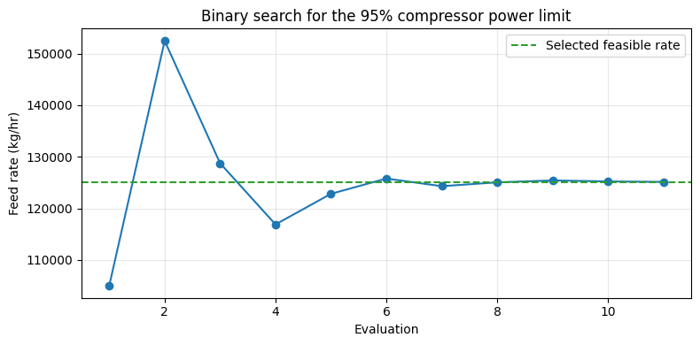
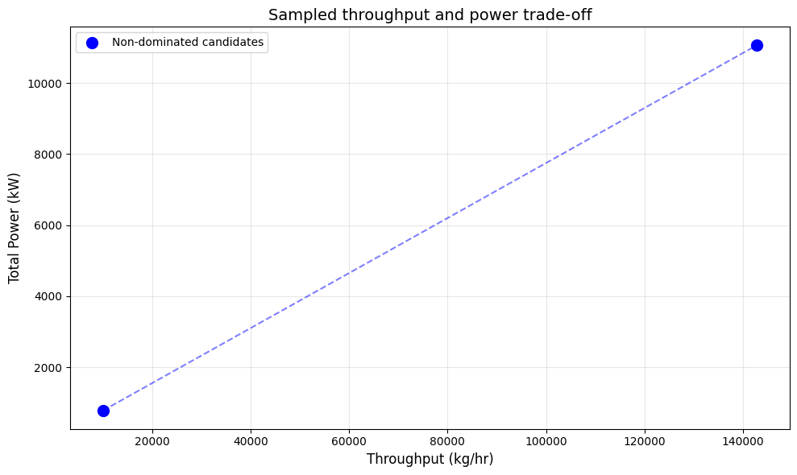
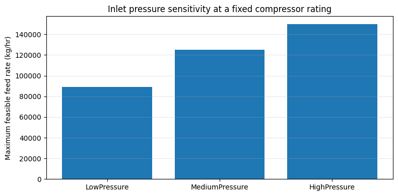

> **Note:** This is an auto-generated Markdown version of the Jupyter notebook
> [`ProductionOptimizer_Tutorial.ipynb`](https://github.com/equinor/neqsim/blob/master/docs/examples/ProductionOptimizer_Tutorial.ipynb).
> You can also [view it on nbviewer](https://nbviewer.org/github/equinor/neqsim/blob/master/docs/examples/ProductionOptimizer_Tutorial.ipynb)
> or [open in Google Colab](https://colab.research.google.com/github/equinor/neqsim/blob/master/docs/examples/ProductionOptimizer_Tutorial.ipynb).

---

This notebook provides a complete guide to using the `ProductionOptimizer` class from NeqSim for process optimization.

## Table of Contents

1. [Introduction](#1-introduction)
2. [Setup and Imports](#2-setup-and-imports)
3. [Search Algorithms](#3-search-algorithms)
4. [Single-Variable Optimization](#4-single-variable-optimization)
5. [Multi-Variable Optimization](#5-multi-variable-optimization)
6. [Objectives and Constraints](#6-objectives-and-constraints)
7. [Pareto Multi-Objective Optimization](#7-pareto-multi-objective-optimization)
8. [Configuration Options](#8-configuration-options)
9. [Advanced Usage](#9-advanced-usage)
10. [Best Practices](#10-best-practices)

## 1. Introduction

The `ProductionOptimizer` is a general-purpose optimization utility for NeqSim process models. It supports:

| Feature | Description |
|---------|-------------|
| **Single-variable optimization** | Optimize flow rate with a single feed stream |
| **Multi-variable optimization** | Optimize multiple decision variables simultaneously |
| **Multiple search algorithms** | Binary, Golden-Section, Nelder-Mead, Particle Swarm, Gradient Descent |
| **Custom objectives** | Maximize throughput, minimize power, or any custom metric |
| **Hard and soft constraints** | Equipment limits with penalty functions |
| **Pareto optimization** | Multi-objective trade-off analysis |
| **Parallel evaluation** | Evaluate independent process scenarios in parallel |

### When to Use ProductionOptimizer vs ProcessOptimizationEngine

| Scenario | Use |
|----------|-----|
| Find max throughput at fixed pressures | `ProcessOptimizationEngine` |
| Custom objective function | `ProductionOptimizer` |
| Multiple decision variables | `ProductionOptimizer` |
| Pareto multi-objective | `ProductionOptimizer` |
| Equipment bottleneck detection | Either (both support it) |


## 2. Setup and Imports
Run cells in order. In a compiled NeqSim checkout, the setup uses `target/classes`;
in Colab it installs NeqSim 3.20.0 or later if missing. Restart the kernel after
changing Java classes or upgrading NeqSim. All examples use illustrative equipment
ratings, absolute pressure, and mass flow in kg/hr.


**Execution source:** Run all cells in a fresh Python kernel with Git and JDK 17+. An existing compiled NeqSim checkout is used first. Otherwise setup fetches and builds the documentation source at `refs/pull/3597/head`, which contains fixes exercised here. Set `NEQSIM_GIT_REF` before running to validate another commit or ref. The public Python package supplies the bridge and helpers; its bundled Java library alone is not the validated source for this notebook. The first source build can take several minutes.


```python
import importlib.util
import os
import subprocess
import sys
import tempfile
from pathlib import Path

# Install Python packages with this notebook kernel. Java runs from the
# validated documentation source below, ahead of the package's bundled JAR.
required = {"neqsim": "neqsim>=3.20.0,<4", "numpy": "numpy",
            "scipy": "scipy>=1.14,<2", "matplotlib": "matplotlib", "pandas": "pandas"}
missing = [package for module, package in required.items()
           if importlib.util.find_spec(module) is None]
if missing:
    subprocess.check_call([sys.executable, "-m", "pip", "install", *missing])

candidate = Path(os.environ.get("NEQSIM_PROJECT_ROOT", Path.cwd())).resolve()
PROJECT_ROOT = next((p for p in [candidate, *candidate.parents]
                     if (p / "pom.xml").is_file()
                     and (p / "devtools/neqsim_dev_setup.py").is_file()), None)
if PROJECT_ROOT is None:
    # The public package alone predates fixes exercised by these examples.
    # Use the validated documentation PR's source; override with another fixed
    # commit or ref through NEQSIM_GIT_REF when validating a newer revision.
    source_ref = os.environ.get("NEQSIM_GIT_REF", "refs/pull/3597/head")
    PROJECT_ROOT = Path(tempfile.mkdtemp(prefix="neqsim-optimization-"))
    subprocess.check_call(["git", "init", "-q", str(PROJECT_ROOT)])
    subprocess.check_call(["git", "-C", str(PROJECT_ROOT), "remote", "add", "origin",
                           "https://github.com/equinor/neqsim.git"])
    subprocess.check_call(["git", "-C", str(PROJECT_ROOT), "fetch", "--depth", "1",
                           "origin", source_ref])
    subprocess.check_call(["git", "-C", str(PROJECT_ROOT), "checkout", "--quiet",
                           "--detach", "FETCH_HEAD"])
    print(f"Fetched NeqSim documentation source: {source_ref}")

if not (PROJECT_ROOT / "target/classes/neqsim/thermo/system/SystemSrkEos.class").is_file():
    # Requires Git and JDK 17+ before the first source build.
    # The Maven wrapper downloads its own Maven distribution and dependencies.
    wrapper = "mvnw.cmd" if os.name == "nt" else "mvnw"
    build = subprocess.run(
        [str(PROJECT_ROOT / wrapper), "-q", "-DskipTests", "compile",
         "dependency:build-classpath", "-DincludeScope=runtime",
         "-Dmdep.outputFile=target/neqsim-dev-classpath.txt",
         f"-Dmdep.pathSeparator={os.pathsep}"],
        cwd=PROJECT_ROOT, text=True, stdout=subprocess.PIPE, stderr=subprocess.STDOUT,
    )
    if build.returncode:
        raise RuntimeError("NeqSim source build failed:\n" + build.stdout[-12000:])

os.environ["NEQSIM_PROJECT_ROOT"] = str(PROJECT_ROOT)
sys.path.insert(0, str(PROJECT_ROOT / "devtools"))
from neqsim_dev_setup import neqsim_init, neqsim_classes
ns = neqsim_classes(neqsim_init(project_root=PROJECT_ROOT,
                              recompile=False, verbose=False))
NEQSIM_MODE = "workspace target/classes"
from neqsim import jneqsim
import numpy as np
import matplotlib.pyplot as plt

FIGURES_DIR = Path("figures")
FIGURES_DIR.mkdir(exist_ok=True)

def save_figure(filename):
    plt.savefig(FIGURES_DIR / filename, dpi=150, bbox_inches="tight")
    plt.show()

print(f"NeqSim source: {NEQSIM_MODE}")


from jpype import JImplements, JOverride, JArray, JDouble
import jpype

# Import Java classes
ProductionOptimizer = jneqsim.process.util.optimizer.ProductionOptimizer
OptimizationConfig = ProductionOptimizer.OptimizationConfig
OptimizationObjective = ProductionOptimizer.OptimizationObjective
OptimizationConstraint = ProductionOptimizer.OptimizationConstraint
ManipulatedVariable = ProductionOptimizer.ManipulatedVariable
SearchMode = ProductionOptimizer.SearchMode
ObjectiveType = ProductionOptimizer.ObjectiveType
ConstraintDirection = ProductionOptimizer.ConstraintDirection
ConstraintSeverity = ProductionOptimizer.ConstraintSeverity

# Process equipment imports
ProcessSystem = jneqsim.process.processmodel.ProcessSystem
Stream = jneqsim.process.equipment.stream.Stream
Compressor = jneqsim.process.equipment.compressor.Compressor
Separator = jneqsim.process.equipment.separator.Separator
Cooler = jneqsim.process.equipment.heatexchanger.Cooler
ThrottlingValve = jneqsim.process.equipment.valve.ThrottlingValve

# Thermo imports
SystemSrkEos = jneqsim.thermo.system.SystemSrkEos

print("NeqSim ProductionOptimizer loaded successfully!")
print(f"Available search modes: {[str(m) for m in SearchMode.values()]}")
```

<details>
<summary>Output</summary>

```
All NeqSim classes imported OK
NeqSim source: workspace target/classes
NeqSim ProductionOptimizer loaded successfully!
Available search modes: ['BINARY_FEASIBILITY', 'GOLDEN_SECTION_SCORE', 'NELDER_MEAD_SCORE', 'PARTICLE_SWARM_SCORE', 'GRADIENT_DESCENT_SCORE']
```

</details>

## 3. Search Algorithms

ProductionOptimizer supports five search algorithms:

### 3.1 BINARY_FEASIBILITY
- **Best for**: Single-variable problems where feasibility is monotonic
- **How it works**: Binary search on flow rate, checking feasibility at each point
- **Convergence**: O(log n) - very fast
- **Limitations**: Assumes higher flow → more likely to violate constraints

### 3.2 GOLDEN_SECTION_SCORE
- **Best for**: Single-variable problems with a unimodal composite score
- **How it works**: Golden-section search on composite score (feasibility + objective)
- **Convergence**: O(log n) iterations
- **Limitations**: Single variable; a multimodal score requires a global search or a prior sweep

### 3.3 NELDER_MEAD_SCORE
- **Best for**: Multi-variable optimization (2-10 variables)
- **How it works**: Simplex-based derivative-free optimization
- **Convergence**: Good for smooth objective landscapes
- **Limitations**: May get stuck in local optima

### 3.4 PARTICLE_SWARM_SCORE
- **Best for**: Global optimization with many local optima
- **How it works**: Swarm intelligence with particles exploring the search space
- **Convergence**: Slower but more global
- **Parameters**: swarmSize, inertiaWeight, cognitiveWeight, socialWeight

### 3.5 GRADIENT_DESCENT_SCORE
- **Best for**: Smooth objectives after variables and objective scales have been checked.
- **How it works**: Numerical finite-difference gradients with a bounded step search.
- **Limitations**: Derivatives can be noisy across phase or constraint transitions; no global guarantee.

Score-based modes require explicit objectives. Use binary feasibility for monotonic
maximum-throughput searches when no separate objective is provided.


```python
# Display all search modes and their use cases
search_modes = {
    "BINARY_FEASIBILITY": {
        "variables": "1",
        "speed": "Fastest",
        "use_case": "Monotonic feasibility problems"
    },
    "GOLDEN_SECTION_SCORE": {
        "variables": "1",
        "speed": "Fast",
        "use_case": "Unimodal single-variable score"
    },
    "NELDER_MEAD_SCORE": {
        "variables": "2-10",
        "speed": "Medium",
        "use_case": "Multi-variable, smooth landscape"
    },
    "PARTICLE_SWARM_SCORE": {
        "variables": "Any",
        "speed": "Slow",
        "use_case": "Global search, many local optima"
    }
}

search_modes["GRADIENT_DESCENT_SCORE"] = {
    "variables": "Multiple", "speed": "Variable", "use_case": "Smooth, suitably scaled scores"}

print("Search Algorithm Comparison:")
print("-" * 70)
print(f"{'Algorithm':<25} {'Variables':<10} {'Speed':<10} {'Use Case'}")
print("-" * 70)
for name, info in search_modes.items():
    print(f"{name:<25} {info['variables']:<10} {info['speed']:<10} {info['use_case']}")
```

<details>
<summary>Output</summary>

```
Search Algorithm Comparison:
----------------------------------------------------------------------
Algorithm                 Variables  Speed      Use Case
----------------------------------------------------------------------
BINARY_FEASIBILITY        1          Fastest    Monotonic feasibility problems
GOLDEN_SECTION_SCORE      1          Fast       Unimodal single-variable score
NELDER_MEAD_SCORE         2-10       Medium     Multi-variable, smooth landscape
PARTICLE_SWARM_SCORE      Any        Slow       Global search, many local optima
GRADIENT_DESCENT_SCORE    Multiple   Variable   Smooth, suitably scaled scores
```

</details>

## 4. Single-Variable Optimization

The simplest case: optimize flow rate of a single feed stream.

```python
# Create a simple gas compression process
def create_compression_process():
    """Create a simple gas compression system for optimization."""
    # Create gas fluid
    gas = SystemSrkEos(288.15, 50.0)  # 15°C, 50 bara
    gas.addComponent("methane", 0.85)
    gas.addComponent("ethane", 0.10)
    gas.addComponent("propane", 0.05)
    gas.setMixingRule("classic")
    
    # Create process
    process = ProcessSystem()
    
    # Feed stream
    feed = Stream("feed", gas)
    feed.setFlowRate(50000.0, "kg/hr")
    feed.setPressure(50.0, "bara")
    feed.setTemperature(288.15, "K")
    process.add(feed)
    
    # Compressor
    compressor = Compressor("compressor", feed)
    compressor.setOutletPressure(100.0)  # bara
    compressor.setUsePolytropicCalc(True)
    compressor.setPolytropicEfficiency(0.78)
    # Fixed 4 MW shaft rating. Only power is constrained: there is no map.
    compressor.updatePowerConstraint(4000.0)
    power_constraint = compressor.getCapacityConstraints().get("power")
    power_constraint.setMaxValue(100.0)
    compressor.clearCapacityConstraints()
    compressor.addCapacityConstraint(power_constraint)
    process.add(compressor)
    
    # Aftercooler
    cooler = Cooler("cooler", compressor.getOutletStream())
    cooler.setOutTemperature(313.15)  # 40°C
    process.add(cooler)
    
    process.run()
    return process, feed

# Create the process
process, feed = create_compression_process()
print(f"Initial flow rate: {feed.getFlowRate('kg/hr'):.0f} kg/hr")
print(f"Compressor power: {process.getUnit('compressor').getPower('kW'):.1f} kW")
```

<details>
<summary>Output</summary>

```
Initial flow rate: 50000 kg/hr
Compressor power: 1518.3 kW
```

</details>

```python
# Single-variable optimization: maximize flow rate

# Configure optimization
config = OptimizationConfig(10000.0, 200000.0).enableCaching(False)  # Flow bounds: 10,000 - 200,000 kg/hr
config = config.tolerance(100.0)                 # Convergence tolerance
config = config.maxIterations(30)                # Max iterations
config = config.searchMode(SearchMode.BINARY_FEASIBILITY)
config = config.defaultUtilizationLimit(0.95)    # 95% max equipment utilization

# Create optimizer and run
optimizer = ProductionOptimizer()
result = optimizer.optimize(process, feed, config, None, None)

# Display results
print("\n=== Single-Variable Optimization Results ===")
print(f"Optimal flow rate: {result.getOptimalRate():.0f} kg/hr")
print(f"Feasible: {result.isFeasible()}")
print(f"Iterations: {result.getIterations()}")
if result.getBottleneck():
    print(f"Bottleneck: {result.getBottleneck().getName()}")

assert result.isFeasible()
assert abs(feed.getFlowRate("kg/hr") - result.getOptimalRate()) < 1e-6
assert process.getUnit("compressor").getPower("kW") <= 0.95 * 4000.0 + 1e-6
history = list(result.getIterationHistory())
plt.figure(figsize=(8, 4))
plt.plot(range(1, len(history) + 1), [h.getRate() for h in history], "o-")
plt.axhline(result.getOptimalRate(), color="tab:green", linestyle="--", label="Selected feasible rate")
plt.xlabel("Evaluation")
plt.ylabel("Feed rate (kg/hr)")
plt.title("Binary search for the 95% compressor power limit")
plt.grid(alpha=0.3)
plt.legend()
plt.tight_layout()
save_figure("production-optimizer-search.png")
```

<details>
<summary>Output</summary>

```

=== Single-Variable Optimization Results ===
Optimal flow rate: 125132 kg/hr
Feasible: True
Iterations: 10
Bottleneck: compressor
```

</details>



## 5. Multi-Variable Optimization

The search approaches the flow at which compressor power reaches 3,800 kW
(95% of the illustrative 4,000 kW rating). Fixed pressure ratio and efficiency
make power approximately proportional to mass flow. The selected point is
re-applied to the live process and checked against that power limit.


For complex processes, you often need to optimize multiple variables simultaneously. Use `ManipulatedVariable` to define each decision variable.


```python
# Create a more complex two-stage compression process
def create_two_stage_process():
    """Create a two-stage compression system with intercooling."""
    gas = SystemSrkEos(288.15, 30.0)
    gas.addComponent("methane", 0.85)
    gas.addComponent("ethane", 0.10)
    gas.addComponent("propane", 0.05)
    gas.setMixingRule("classic")
    
    process = ProcessSystem()
    
    # Feed
    feed = Stream("feed", gas)
    feed.setFlowRate(50000.0, "kg/hr")
    feed.setPressure(30.0, "bara")
    feed.setTemperature(288.15, "K")
    process.add(feed)
    
    # Stage 1 compressor
    stage1 = Compressor("stage1", feed)
    stage1.setOutletPressure(70.0)
    stage1.setUsePolytropicCalc(True)
    stage1.setPolytropicEfficiency(0.78)
    stage1.updatePowerConstraint(6000.0)
    rating = stage1.getCapacityConstraints().get("power")
    rating.setMaxValue(100.0)
    stage1.clearCapacityConstraints()
    stage1.addCapacityConstraint(rating)
    process.add(stage1)
    
    # Intercooler
    intercooler = Cooler("intercooler", stage1.getOutletStream())
    intercooler.setOutTemperature(308.15)  # 35°C
    process.add(intercooler)
    
    # Stage 2 compressor
    stage2 = Compressor("stage2", intercooler.getOutletStream())
    stage2.setOutletPressure(150.0)
    stage2.setUsePolytropicCalc(True)
    stage2.setPolytropicEfficiency(0.76)
    stage2.updatePowerConstraint(6000.0)
    rating = stage2.getCapacityConstraints().get("power")
    rating.setMaxValue(100.0)
    stage2.clearCapacityConstraints()
    stage2.addCapacityConstraint(rating)
    process.add(stage2)
    
    # Aftercooler
    aftercooler = Cooler("aftercooler", stage2.getOutletStream())
    aftercooler.setOutTemperature(313.15)  # 40°C
    process.add(aftercooler)
    
    process.run()
    return process

process2 = create_two_stage_process()
print("Two-stage process created")
print(f"Stage 1 power: {process2.getUnit('stage1').getPower('kW'):.1f} kW")
print(f"Stage 2 power: {process2.getUnit('stage2').getPower('kW'):.1f} kW")
```

<details>
<summary>Output</summary>

```
Two-stage process created
Stage 1 power: 1995.2 kW
Stage 2 power: 1878.2 kW
```

</details>

```python
# Define setter classes for ManipulatedVariable (JPype interface implementation)

@JImplements("java.util.function.BiConsumer")
class FlowRateSetter:
    """Sets the feed flow rate."""
    @JOverride
    def accept(self, proc, value):
        proc.getUnit("feed").setFlowRate(float(value), "kg/hr")

@JImplements("java.util.function.BiConsumer")
class Stage1PressureSetter:
    """Sets stage 1 outlet pressure."""
    @JOverride
    def accept(self, proc, value):
        proc.getUnit("stage1").setOutletPressure(float(value))

@JImplements("java.util.function.BiConsumer")
class IntercoolerTempSetter:
    """Sets intercooler outlet temperature."""
    @JOverride
    def accept(self, proc, value):
        proc.getUnit("intercooler").setOutTemperature(float(value) + 273.15)  # °C to K

print("Setter classes defined for multi-variable optimization")

@JImplements("java.util.function.ToDoubleFunction")
class FeedThroughputEvaluator:
    @JOverride
    def applyAsDouble(self, proc):
        return proc.getUnit("feed").getFlowRate("kg/hr")
```

<details>
<summary>Output</summary>

```
Setter classes defined for multi-variable optimization
```

</details>

```python
# Create ManipulatedVariable list
ArrayList = jpype.JClass("java.util.ArrayList")

variables = ArrayList()

# Variable 1: Flow rate (10,000 - 150,000 kg/hr)
var_flow = ManipulatedVariable("flowRate", 10000.0, 150000.0, "kg/hr", FlowRateSetter())
variables.add(var_flow)

# Variable 2: Stage 1 outlet pressure (50 - 90 bara)
var_p1 = ManipulatedVariable("stage1Pressure", 50.0, 90.0, "bara", Stage1PressureSetter())
variables.add(var_p1)

# Variable 3: Intercooler temperature (25 - 45 °C)
var_temp = ManipulatedVariable("intercoolerTemp", 25.0, 45.0, "C", IntercoolerTempSetter())
variables.add(var_temp)

print(f"Defined {variables.size()} manipulated variables:")
for i in range(variables.size()):
    v = variables.get(i)
    print(f"  {i+1}. {v.getName()}: [{v.getLowerBound()}, {v.getUpperBound()}] {v.getUnit()}")

# A score search needs an objective; None would give every candidate score zero.
throughput_objectives = ArrayList()
throughput_objectives.add(OptimizationObjective("feedThroughput", FeedThroughputEvaluator(),
                                                1.0, ObjectiveType.MAXIMIZE))
```

<details>
<summary>Output</summary>

```
Defined 3 manipulated variables:
  1. flowRate: [10000.0, 150000.0] kg/hr
  2. stage1Pressure: [50.0, 90.0] bara
  3. intercoolerTemp: [25.0, 45.0] C
Out[7]: True
```

</details>

```python
# Multi-variable optimization with Nelder-Mead

# Configure for multi-variable
config_multi = OptimizationConfig(10000.0, 150000.0)
config_multi = config_multi.searchMode(SearchMode.NELDER_MEAD_SCORE)  # Best for multi-variable
config_multi = config_multi.maxIterations(100)
config_multi = config_multi.tolerance(0.01).enableCaching(False)
config_multi = config_multi.defaultUtilizationLimit(0.95)

# Run optimization
optimizer2 = ProductionOptimizer()
result_multi = optimizer2.optimize(process2, variables, config_multi, throughput_objectives, None)

print("\n=== Multi-Variable Optimization Results ===")
print(f"Optimal flow rate: {result_multi.getOptimalRate():.0f} kg/hr")
print(f"Feasible: {result_multi.isFeasible()}")
print(f"Iterations: {result_multi.getIterations()}")

# Get optimal variable values
opt_vars = result_multi.getDecisionVariables()
if opt_vars:
    print("\nOptimal variable values:")
    for name in opt_vars.keySet():
        print(f"  {name}: {opt_vars.get(name):.2f}")

assert result_multi.isFeasible(), str(result_multi.getInfeasibilityDiagnosis())
```

<details>
<summary>Output</summary>

```

=== Multi-Variable Optimization Results ===
Optimal flow rate: 147577 kg/hr
Feasible: True
Iterations: 100

Optimal variable values:
  flowRate: 147577.09
  intercoolerTemp: 33.04
  stage1Pressure: 68.34
```

</details>

## 6. Objectives and Constraints

### 6.1 Optimization Objectives

Objectives define what to optimize. You can:
- **MAXIMIZE**: throughput, production, revenue
- **MINIMIZE**: power, cost, emissions

### 6.2 Optimization Constraints

Constraints define limits that must be respected:
- **HARD constraints**: Must be satisfied (infeasible if violated)
- **SOFT constraints**: Penalized if violated (allows trade-offs)

```python
# Define objective evaluators

@JImplements("java.util.function.ToDoubleFunction")
class ThroughputEvaluator:
    """Evaluates throughput (outlet flow rate)."""
    @JOverride
    def applyAsDouble(self, proc):
        return proc.getUnit("aftercooler").getOutletStream().getFlowRate("kg/hr")

@JImplements("java.util.function.ToDoubleFunction")
class TotalPowerEvaluator:
    """Evaluates total compressor power."""
    @JOverride
    def applyAsDouble(self, proc):
        power1 = proc.getUnit("stage1").getPower("kW")
        power2 = proc.getUnit("stage2").getPower("kW")
        return power1 + power2

@JImplements("java.util.function.ToDoubleFunction")
class Stage1PowerEvaluator:
    """Evaluates stage 1 power for constraint."""
    @JOverride
    def applyAsDouble(self, proc):
        return proc.getUnit("stage1").getPower("kW")

@JImplements("java.util.function.ToDoubleFunction")
class OutletTempEvaluator:
    """Evaluates outlet temperature for constraint."""
    @JOverride
    def applyAsDouble(self, proc):
        return proc.getUnit("aftercooler").getOutletStream().getTemperature("C")

print("Objective and constraint evaluators defined")
```

<details>
<summary>Output</summary>

```
Objective and constraint evaluators defined
```

</details>

```python
# Create objectives list
objectives = ArrayList()

# Objective 1: Maximize throughput (weight = 1.0)
obj_throughput = OptimizationObjective(
    "throughput",           # Name
    ThroughputEvaluator(),  # Evaluator function
    1.0,                    # Weight
    ObjectiveType.MAXIMIZE  # Direction
)
objectives.add(obj_throughput)

print(f"Defined {objectives.size()} objective(s):")
for i in range(objectives.size()):
    obj = objectives.get(i)
    print(f"  {i+1}. {obj.getName()} ({obj.getType()})")
```

<details>
<summary>Output</summary>

```
Defined 1 objective(s):
  1. throughput (MAXIMIZE)
```

</details>

```python
# Create constraints list
constraints = ArrayList()

# Constraint 1: Stage 1 power < 3000 kW (HARD)
con_power = OptimizationConstraint(
    "maxStage1Power",           # Name
    Stage1PowerEvaluator(),     # Evaluator
    3000.0,                     # Limit
    ConstraintDirection.LESS_THAN,
    ConstraintSeverity.HARD,
    0.0,                        # Penalty weight (for SOFT)
    "Stage 1 compressor power limit"
)
constraints.add(con_power)

# Constraint 2: Outlet temperature < 45°C (SOFT with penalty)
con_temp = OptimizationConstraint(
    "maxOutletTemp",
    OutletTempEvaluator(),
    45.0,
    ConstraintDirection.LESS_THAN,
    ConstraintSeverity.SOFT,
    100.0,                      # Penalty weight
    "Outlet temperature specification"
)
constraints.add(con_temp)

print(f"Defined {constraints.size()} constraint(s):")
for i in range(constraints.size()):
    con = constraints.get(i)
    print(f"  {i+1}. {con.getName()}: {con.getDirection()} {con.getLimit()} ({con.getSeverity()})")
```

<details>
<summary>Output</summary>

```
Defined 2 constraint(s):
  1. maxStage1Power: LESS_THAN 3000.0 (HARD)
  2. maxOutletTemp: LESS_THAN 45.0 (SOFT)
```

</details>

```python
# Optimization with objectives and constraints

config_constrained = OptimizationConfig(10000.0, 150000.0)
config_constrained = config_constrained.searchMode(SearchMode.NELDER_MEAD_SCORE)
config_constrained = config_constrained.maxIterations(100)
config_constrained = config_constrained.tolerance(0.01).enableCaching(False)

# Recreate process (reset state)
process3 = create_two_stage_process()

# Run with objectives and constraints
result_constrained = optimizer2.optimize(process3, variables, config_constrained, objectives, constraints)

print("\n=== Constrained Optimization Results ===")
print(f"Optimal flow rate: {result_constrained.getOptimalRate():.0f} kg/hr")
print(f"Feasible: {result_constrained.isFeasible()}")

# Check constraint violations
violations = [status for status in result_constrained.getConstraintStatuses() if status.violated()]
if violations:
    print("\nConstraint violations:")
    for status in violations:
        print(f"  - {status.getName()}: margin={status.getMargin():.3f}")
else:
    print("\nAll constraints satisfied!")

assert result_constrained.isFeasible()
assert not any(s.violated() and s.getSeverity() == ConstraintSeverity.HARD
               for s in result_constrained.getConstraintStatuses())
assert process3.getUnit("stage1").getPower("kW") <= 3000.0 + 1e-5
```

<details>
<summary>Output</summary>

```

=== Constrained Optimization Results ===
Optimal flow rate: 107406 kg/hr
Feasible: True

All constraints satisfied!
```

</details>

## 7. Pareto Multi-Objective Optimization

When objectives conflict, the optimizer samples weighted sums and returns a
non-dominated subset of the candidates. This is an approximation to a Pareto
front. Weight sweeps need not recover every intermediate operating point,
particularly when power is nearly linear in throughput. Use consistent process
equipment in every evaluator and compare engineering units explicitly.


```python
# Define competing objectives for Pareto optimization
pareto_objectives = ArrayList()

# Objective 1: Maximize throughput
obj1 = OptimizationObjective(
    "throughput",
    ThroughputEvaluator(),
    1.0 / 150000.0,  # Normalize throughput by its reference scale (kg/hr)
    ObjectiveType.MAXIMIZE
)
pareto_objectives.add(obj1)

# Objective 2: Minimize total power
obj2 = OptimizationObjective(
    "totalPower",
    TotalPowerEvaluator(),
    1.0 / 12000.0,  # Normalize power by its reference scale (kW)
    ObjectiveType.MINIMIZE
)
pareto_objectives.add(obj2)

print("Pareto objectives defined:")
print("  1. Maximize throughput")
print("  2. Minimize total power")
print("\nThese objectives conflict: higher throughput requires more power.")
```

<details>
<summary>Output</summary>

```
Pareto objectives defined:
  1. Maximize throughput
  2. Minimize total power

These objectives conflict: higher throughput requires more power.
```

</details>

```python
# Configure Pareto optimization
config_pareto = OptimizationConfig(10000.0, 150000.0).enableCaching(False)
config_pareto = config_pareto.searchMode(SearchMode.GOLDEN_SECTION_SCORE)
config_pareto = config_pareto.paretoGridSize(15)  # Number of weight combinations
config_pareto = config_pareto.maxIterations(30)
config_pareto = config_pareto.tolerance(100.0)

# The evaluators above reference the two-stage process equipment.
process_pareto = create_two_stage_process()
feed_pareto = process_pareto.getUnit("feed")

# Run Pareto optimization
pareto_result = optimizer.optimizePareto(process_pareto, feed_pareto, config_pareto, pareto_objectives, None)

print("\n=== Pareto Optimization Results ===")
points = pareto_result.getParetoFront()
print(f"Found {points.size()} non-dominated feasible candidates")

# Equal operating points can recur for several weights; plot distinct candidates.
unique_points = {}
for point in points:
    values = point.getObjectiveValues()
    key = (round(values.get("throughput")), round(values.get("totalPower"), 1))
    unique_points.setdefault(key, point)
points = list(unique_points.values())
print(f"Distinct non-dominated operating points: {len(points)}")
```

<details>
<summary>Output</summary>

```

=== Pareto Optimization Results ===
Found 13 non-dominated feasible candidates
Distinct non-dominated operating points: 2
```

</details>

```python
# Extract and display Pareto front
import matplotlib.pyplot as plt

throughputs = []
powers = []

print("\nPareto Front Points:")
print("-" * 50)
print(f"{'Flow (kg/hr)':<15} {'Throughput (kg/hr)':<20} {'Power (kW)'}")
print("-" * 50)

for point in points:
    obj_values = point.getObjectiveValues()
    flow = point.getFullResult().getOptimalRate()
    throughput = obj_values.get("throughput")
    power = obj_values.get("totalPower")
    
    throughputs.append(throughput)
    powers.append(power)
    print(f"{flow:<15.0f} {throughput:<20.0f} {power:.1f}")

# Plot Pareto front
plt.figure(figsize=(10, 6))
plt.scatter(throughputs, powers, c='blue', s=100, label='Non-dominated candidates')
order = np.argsort(throughputs)
plt.plot(np.array(throughputs)[order], np.array(powers)[order], 'b--', alpha=0.5)
plt.xlabel('Throughput (kg/hr)', fontsize=12)
plt.ylabel('Total Power (kW)', fontsize=12)
plt.title('Sampled throughput and power trade-off', fontsize=14)
plt.grid(True, alpha=0.3)
plt.legend()
plt.tight_layout()
save_figure("production-optimizer-pareto.png")
assert len(points) >= 2
assert all(point.isFeasible() for point in points)
```

<details>
<summary>Output</summary>

```

Pareto Front Points:
--------------------------------------------------
Flow (kg/hr)    Throughput (kg/hr)   Power (kW)
--------------------------------------------------
142838          142838               11065.4
10024           10024                776.6
```

</details>



The sampled trade-off has greater total shaft power at greater throughput.
Both objectives are extensive here: doubling mass flow at fixed inlet state,
pressure split and efficiency approximately doubles power. Interpolate operating
conditions only after re-running and checking capacity; the dashed line is a
visual guide, not an independently validated operating envelope.


## 8. Configuration Options

The `OptimizationConfig` class provides many configuration options:


```python
# Selected OptimizationConfig options
config_options = {
    "Basic Options": {
        "tolerance(double)": "Convergence tolerance (default: 1e-3)",
        "maxIterations(int)": "Maximum iterations (default: 30)",
        "searchMode(SearchMode)": "Search algorithm to use",
        "rateUnit(String)": "Unit for flow rate (default: 'kg/hr')",
    },
    "Equipment Constraints": {
        "defaultUtilizationLimit(double)": "Default max utilization for all equipment (0-1)",
        "utilizationLimitForType(Class, double)": "Utilization limit for specific equipment type",
        "utilizationMarginFraction(double)": "Safety margin on equipment limits",
    },
    "Uncertainty & Robustness": {
        "capacityUncertaintyFraction(double)": "Uncertainty in capacity estimates",
        "capacityPercentile(double)": "Percentile for capacity (0.5 = P50)",
    },
    "Pareto Options": {
        "paretoGridSize(int)": "Number of weight combinations for Pareto (default: 11)",
    },
    "Parallel Execution": {
        "parallelEvaluations(boolean)": "Enable parallel scenario evaluation",
        "parallelThreads(int)": "Number of threads for parallel execution",
    },
    "PSO Parameters": {
        "swarmSize(int)": "Number of particles (default: 8)",
        "inertiaWeight(double)": "Inertia weight (default: 0.6)",
        "cognitiveWeight(double)": "Cognitive (personal best) weight (default: 1.2)",
        "socialWeight(double)": "Social (global best) weight (default: 1.2)",
    },
    "Caching": {
        "enableCaching(boolean)": "Cache candidate evaluations (default: true)",
    },
    "Special Equipment": {
        "columnFsFactorLimit(double)": "Fs factor limit for distillation columns",
    }
}

print("OptimizationConfig Options:")
print("=" * 70)
for category, options in config_options.items():
    print(f"\n{category}:")
    print("-" * 70)
    for method, description in options.items():
        print(f"  .{method}")
        print(f"      {description}")
```

<details>
<summary>Output</summary>

```
OptimizationConfig Options:
======================================================================

Basic Options:
----------------------------------------------------------------------
  .tolerance(double)
      Convergence tolerance (default: 1e-3)
  .maxIterations(int)
      Maximum iterations (default: 30)
  .searchMode(SearchMode)
      Search algorithm to use
  .rateUnit(String)
      Unit for flow rate (default: 'kg/hr')

Equipment Constraints:
----------------------------------------------------------------------
  .defaultUtilizationLimit(double)
      Default max utilization for all equipment (0-1)
  .utilizationLimitForType(Class, double)
      Utilization limit for specific equipment type
  .utilizationMarginFraction(double)
      Safety margin on equipment limits

Uncertainty & Robustness:
----------------------------------------------------------------------
  .capacityUncertaintyFraction(double)
      Uncertainty in capacity estimates
  .capacityPercentile(double)
      Percentile for capacity (0.5 = P50)

Pareto Options:
----------------------------------------------------------------------
  .paretoGridSize(int)
      Number of weight combinations for Pareto (default: 11)

Parallel Execution:
----------------------------------------------------------------------
  .parallelEvaluations(boolean)
      Enable parallel scenario evaluation
  .parallelThreads(int)
      Number of threads for parallel execution

PSO Parameters:
----------------------------------------------------------------------
  .swarmSize(int)
      Number of particles (default: 8)
  .inertiaWeight(double)
      Inertia weight (default: 0.6)
  .cognitiveWeight(double)
      Cognitive (personal best) weight (default: 1.2)
  .socialWeight(double)
      Social (global best) weight (default: 1.2)

Caching:
----------------------------------------------------------------------
  .enableCaching(boolean)
      Cache candidate evaluations (default: true)

Special Equipment:
----------------------------------------------------------------------
  .columnFsFactorLimit(double)
      Fs factor limit for distillation columns
```

</details>

```python
# Example: Comprehensive configuration

comprehensive_config = OptimizationConfig(10000.0, 200000.0) \
    .rateUnit("kg/hr") \
    .tolerance(0.01) \
    .maxIterations(50) \
    .searchMode(SearchMode.NELDER_MEAD_SCORE) \
    .defaultUtilizationLimit(0.95) \
    .utilizationMarginFraction(0.05) \
    .capacityUncertaintyFraction(0.10) \
    .capacityPercentile(0.5) \
    .enableCaching(False) \
    .paretoGridSize(20)

print("Comprehensive configuration created")
print(f"  Bounds: [{comprehensive_config.getLowerBound()}, {comprehensive_config.getUpperBound()}]")
print(f"  Search mode: {comprehensive_config.getSearchMode()}")
print(f"  Max iterations: {comprehensive_config.getMaxIterations()}")
```

<details>
<summary>Output</summary>

```
Comprehensive configuration created
  Bounds: [10000.0, 200000.0]
  Search mode: NELDER_MEAD_SCORE
  Max iterations: 50
```

</details>

## 9. Advanced Usage

### 9.1 Scenario Evaluation

Evaluate multiple scenarios with different conditions:

```python
# Create multiple scenarios with different inlet pressures
ScenarioRequest = ProductionOptimizer.ScenarioRequest

scenarios = ArrayList()

# Base config
base_config = OptimizationConfig(10000.0, 150000.0).enableCaching(False) \
    .searchMode(SearchMode.BINARY_FEASIBILITY) \
    .maxIterations(20)

# Scenario 1: Low pressure
process_low, feed_low = create_compression_process()
feed_low.setPressure(40.0, "bara")
scenarios.add(ScenarioRequest("LowPressure", process_low, feed_low, base_config, None, None))

# Scenario 2: Medium pressure
process_med, feed_med = create_compression_process()
feed_med.setPressure(50.0, "bara")
scenarios.add(ScenarioRequest("MediumPressure", process_med, feed_med, base_config, None, None))

# Scenario 3: High pressure
process_high, feed_high = create_compression_process()
feed_high.setPressure(60.0, "bara")
scenarios.add(ScenarioRequest("HighPressure", process_high, feed_high, base_config, None, None))

print(f"Created {scenarios.size()} scenarios for evaluation")
```

<details>
<summary>Output</summary>

```
Created 3 scenarios for evaluation
```

</details>

```python
# Run all scenarios
results = optimizer.optimizeScenarios(scenarios)

print("\n=== Scenario Comparison ===")
print("-" * 60)
print(f"{'Scenario':<20} {'Optimal Flow (kg/hr)':<25} {'Feasible'}")
print("-" * 60)

for i in range(results.size()):
    scenario_result = results.get(i)
    scenario_result_value = scenario_result.getResult()
    print(f"{str(scenario_result.getName()):<20} {scenario_result_value.getOptimalRate():<25.0f} {scenario_result_value.isFeasible()}")
assert all(r.getResult().isFeasible() for r in results)
plt.figure(figsize=(8, 4))
plt.bar([str(r.getName()) for r in results], [r.getResult().getOptimalRate() for r in results])
plt.ylabel("Maximum feasible feed rate (kg/hr)")
plt.title("Inlet pressure sensitivity at a fixed compressor rating")
plt.grid(axis="y", alpha=0.3)
plt.tight_layout()
save_figure("production-optimizer-scenarios.png")

scenario_rates = [r.getResult().getOptimalRate() for r in results]
assert scenario_rates[0] < scenario_rates[1] < scenario_rates[2]
```

<details>
<summary>Output</summary>

```

=== Scenario Comparison ===
------------------------------------------------------------
Scenario             Optimal Flow (kg/hr)      Feasible
------------------------------------------------------------
LowPressure          88964                     True
MediumPressure       125137                    True
HighPressure         150000                    True
```

</details>



Higher inlet pressure reduces compression ratio at the same 100 bara discharge
pressure. A fixed shaft-power rating therefore permits a higher feed rate.
At 40, 50 and 60 bara inlet pressure the selected rates are approximately
88,960, 125,140 and 150,000 kg/hr. The last reaches the specified upper search
bound, so it does not establish the equipment capacity. All three scenarios
use separate process objects; recompute the feasible rate
when inlet conditions change.


### 9.2 Parallel Scenario Evaluation

For large numbers of scenarios, enable parallel execution:


```python
# Configure for parallel execution
parallel_config = OptimizationConfig(10000.0, 150000.0).enableCaching(False) \
    .searchMode(SearchMode.BINARY_FEASIBILITY) \
    .parallelEvaluations(True) \
    .parallelThreads(4)  # Use 4 threads

print("Parallel configuration:")
print(f"  Parallel enabled: {parallel_config.isParallelEvaluations()}")
print(f"  Threads: {parallel_config.getParallelThreads()}")
print("\nNote: Parallel execution is most beneficial for many scenarios (10+)")
# The configuration must be attached to the requests passed to optimizeScenarios.
parallel_requests = ArrayList()
for pressure in (40.0, 50.0, 60.0):
    parallel_process, parallel_feed = create_compression_process()
    parallel_feed.setPressure(pressure, "bara")
    parallel_requests.add(ScenarioRequest(f"Inlet{pressure:.0f}bara", parallel_process,
                                         parallel_feed, parallel_config, None, None))
parallel_results = optimizer.optimizeScenarios(parallel_requests)
assert len(parallel_results) == 3
assert all(item.getResult().isFeasible() for item in parallel_results)
print("Completed independent parallel scenarios:", len(parallel_results))
```

<details>
<summary>Output</summary>

```
Parallel configuration:
  Parallel enabled: True
  Threads: 4

Note: Parallel execution is most beneficial for many scenarios (10+)
Completed independent parallel scenarios: 3
```

</details>

### 9.3 JSON Export

Export results to JSON for further analysis:

```python
# Get JSON representation of results
import json

# Run a simple optimization
process_json, feed_json = create_compression_process()
simple_config = OptimizationConfig(10000.0, 150000.0).enableCaching(False).searchMode(SearchMode.BINARY_FEASIBILITY)
simple_result = optimizer.optimize(process_json, feed_json, simple_config, None, None)

# OptimizationResult exposes typed getters and an iteration-history JSON export.
result_dict = {
    "optimal_rate": simple_result.getOptimalRate(),
    "rate_unit": str(simple_result.getRateUnit()),
    "feasible": bool(simple_result.isFeasible()),
    "decision_variables": {str(k): float(v) for k, v in simple_result.getDecisionVariables().items()},
    "iterations": simple_result.getIterations(),
}
history_json = json.loads(str(simple_result.exportIterationHistoryAsJson()))
print("Iteration history JSON is available separately.")

print("Optimization Result (JSON):")
print(json.dumps(result_dict, indent=2))

assert abs(simple_result.getOptimalRate() - simple_result.getDecisionVariables().get("feed")) < 1e-7
```

<details>
<summary>Output</summary>

```
Iteration history JSON is available separately.
Optimization Result (JSON):
{
  "optimal_rate": 125137.54792511463,
  "rate_unit": "kg/hr",
  "feasible": true,
  "decision_variables": {
    "feed": 125137.54792511463
  },
  "iterations": 27
}
```

</details>

## 10. Best Practices

### Algorithm Selection

| Variables | Problem Type | Recommended Algorithm |
|-----------|--------------|----------------------|
| 1 | Monotonic feasibility | `BINARY_FEASIBILITY` |
| 1 | Unimodal score | `GOLDEN_SECTION_SCORE` |
| 2-10 | Smooth landscape | `NELDER_MEAD_SCORE` |
| Any | Many local optima | `PARTICLE_SWARM_SCORE` |

### Configuration Tips

1. **Start with coarse tolerance**, then refine
2. **Use `defaultUtilizationLimit(0.95)`** to leave 5% safety margin
3. **Keep objective and constraint inputs fixed during a cached run**; the cache identifies candidates by their exact decision-variable coordinates
4. **For Pareto**, use `paretoGridSize(15-25)` for good resolution

### Constraint Design

1. **Use HARD constraints** for safety-critical limits
2. **Use SOFT constraints** for operational preferences
3. **Set appropriate penalty weights** for soft constraints

### Debugging

1. Check `result.isFeasible()` first
2. Examine `result.getConstraintStatuses()` and each status `violated()` flag
3. Inspect iteration history and re-evaluate the selected point; an iteration count alone does not establish convergence
4. Enable verbose logging in Java if needed


```python
# Summary: Complete optimization workflow

def run_production_optimization(process, feed, objectives=None, constraints=None, 
                                 search_mode=SearchMode.BINARY_FEASIBILITY,
                                 min_flow=10000, max_flow=200000):
    """
    Complete production optimization workflow.
    
    Parameters:
    - process: ProcessSystem to optimize
    - feed: Feed stream (or list of ManipulatedVariable for multi-var)
    - objectives: List of OptimizationObjective (optional)
    - constraints: List of OptimizationConstraint (optional)
    - search_mode: SearchMode enum
    - min_flow, max_flow: Flow rate bounds
    
    Returns:
    - OptimizationResult
    """
    # Configure
    config = OptimizationConfig(float(min_flow), float(max_flow)) \
        .searchMode(search_mode) \
        .tolerance(100.0) \
        .maxIterations(50) \
        .defaultUtilizationLimit(0.95) \
        .enableCaching(False)
    
    # Optimize
    optimizer = ProductionOptimizer()
    result = optimizer.optimize(process, feed, config, objectives, constraints)
    
    # Report
    print(f"Optimal flow: {result.getOptimalRate():.0f} kg/hr")
    print(f"Feasible: {result.isFeasible()}")
    print(f"Iterations: {result.getIterations()}")
    
    if result.getBottleneck():
        print(f"Bottleneck: {result.getBottleneck().getName()}")
    
    return result

# Example usage
print("=== Final Example ===")
final_process, final_feed = create_compression_process()
final_result = run_production_optimization(final_process, final_feed)
```

<details>
<summary>Output</summary>

```
=== Final Example ===
Optimal flow: 125132 kg/hr
Feasible: True
Iterations: 10
Bottleneck: compressor
```

</details>

## Summary

The `ProductionOptimizer` provides:

- **Five search algorithms** for different problem types
- **Single and multi-variable** optimization
- **Custom objectives** (maximize/minimize anything)
- **Hard and soft constraints** with penalties
- **Pareto multi-objective** optimization
- **Parallel scenario** evaluation
- **Equipment utilization** tracking
- **JSON export** for analysis

For more details, see:
- [OPTIMIZATION_OVERVIEW.md](../process/optimization/OPTIMIZATION_OVERVIEW.md)
- [PRODUCTION_OPTIMIZATION_GUIDE.md](PRODUCTION_OPTIMIZATION_GUIDE.md)
- [multi-objective-optimization.md](../process/optimization/multi-objective-optimization.md)
