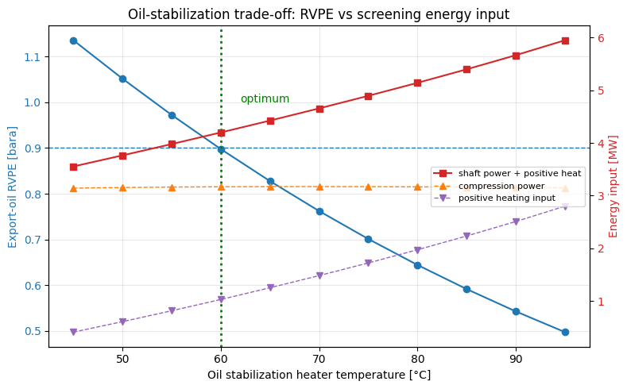
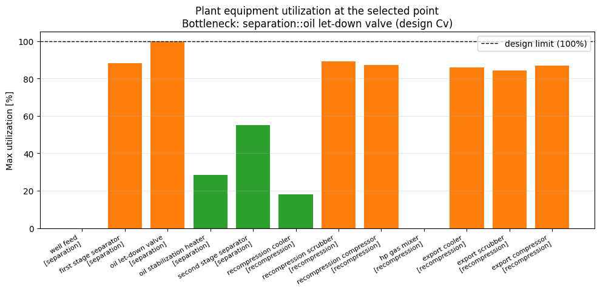

> **Note:** This is an auto-generated Markdown version of the Jupyter notebook
> [`processmodel_plant_optimization.ipynb`](https://github.com/equinor/neqsim/blob/master/docs/examples/processmodel_plant_optimization.ipynb).
> You can also [view it on nbviewer](https://nbviewer.org/github/equinor/neqsim/blob/master/docs/examples/processmodel_plant_optimization.ipynb)
> or [open in Google Colab](https://colab.research.google.com/github/equinor/neqsim/blob/master/docs/examples/processmodel_plant_optimization.ipynb).

---

This notebook demonstrates the **agentic optimization workflow** on a large multi-area
NeqSim `ProcessModel` — the same pattern used to optimize real offshore plants such as the
**Oseberg Sture low-pressure operation** model (a ~13-area `ProcessModel` with separation,
recompression, export and injection trains).

The Oseberg production model cannot be executed here because it depends on external,
site-specific data files. Instead we build a **self-contained, representative two-area**
`ProcessModel` (separation + recompression/export) that exercises the **identical Java APIs**,
so the workflow transfers one-to-one to the full plant.

## What this notebook shows

| Step | API | Purpose |
|------|-----|---------|
| Build | `ProcessModel.add(name, system)` | compose named process areas |
| Observe (empty) | `getUtilizationSnapshotJson()` | utilization is **zero** until capacity limits exist |
| Size | `autoSizeEquipment(safety)` | size every unit in every area in one call |
| **Activate** | **`applyMechanicalDesignCapacityConstraints()`** | **NEW: one call activates utilization across the whole plant** |
| Observe (live) | `getUtilizationSnapshotJson()` | bottleneck + per-unit utilization |
| Discover | `getAdjustableParametersJson()` | bounded decision space |
| Optimize | `getAutomation().evaluate(setpoints, unit, readbacks)` | convergence-gated optimizer step |
| Spec | `Standard_ASTM_D6377` (RVP) | export-oil quality constraint via penalty |

The heavy lifting (sizing, constraint construction, convergence, feasibility gating) happens
**inside Java NeqSim** — Python only *builds the plant*, *drives setpoints*, and *reads results*.

**Runtime:** Use Git and JDK 17 or newer. The setup uses compiled repository classes when present; otherwise it fetches and builds the corrected documentation source from `refs/pull/3597/head`. Set `NEQSIM_GIT_REF` to validate another fixed revision. The public Python package alone does not contain all Java fixes exercised here. Run all cells from a fresh kernel.


```python
import importlib.util
import os
import subprocess
import sys
import tempfile
from pathlib import Path

# Install Python packages with this notebook kernel. Java runs from the
# validated documentation source below, ahead of the package's bundled JAR.
required = {"neqsim": "neqsim>=3.20.0,<4", "numpy": "numpy",
            "scipy": "scipy>=1.14,<2", "matplotlib": "matplotlib", "pandas": "pandas"}
missing = [package for module, package in required.items()
           if importlib.util.find_spec(module) is None]
if missing:
    subprocess.check_call([sys.executable, "-m", "pip", "install", *missing])

candidate = Path(os.environ.get("NEQSIM_PROJECT_ROOT", Path.cwd())).resolve()
PROJECT_ROOT = next((p for p in [candidate, *candidate.parents]
                     if (p / "pom.xml").is_file()
                     and (p / "devtools/neqsim_dev_setup.py").is_file()), None)
if PROJECT_ROOT is None:
    # The public package alone predates fixes exercised by these examples.
    # Use the validated documentation PR's source; override with another fixed
    # commit or ref through NEQSIM_GIT_REF when validating a newer revision.
    source_ref = os.environ.get("NEQSIM_GIT_REF", "refs/pull/3597/head")
    PROJECT_ROOT = Path(tempfile.mkdtemp(prefix="neqsim-optimization-"))
    subprocess.check_call(["git", "init", "-q", str(PROJECT_ROOT)])
    subprocess.check_call(["git", "-C", str(PROJECT_ROOT), "remote", "add", "origin",
                           "https://github.com/equinor/neqsim.git"])
    subprocess.check_call(["git", "-C", str(PROJECT_ROOT), "fetch", "--depth", "1",
                           "origin", source_ref])
    subprocess.check_call(["git", "-C", str(PROJECT_ROOT), "checkout", "--quiet",
                           "--detach", "FETCH_HEAD"])
    print(f"Fetched NeqSim documentation source: {source_ref}")

if not (PROJECT_ROOT / "target/classes/neqsim/thermo/system/SystemSrkEos.class").is_file():
    # Requires Git and JDK 17+ before the first source build.
    # The Maven wrapper downloads its own Maven distribution and dependencies.
    wrapper = "mvnw.cmd" if os.name == "nt" else "mvnw"
    build = subprocess.run(
        [str(PROJECT_ROOT / wrapper), "-q", "-DskipTests", "compile",
         "dependency:build-classpath", "-DincludeScope=runtime",
         "-Dmdep.outputFile=target/neqsim-dev-classpath.txt",
         f"-Dmdep.pathSeparator={os.pathsep}"],
        cwd=PROJECT_ROOT, text=True, stdout=subprocess.PIPE, stderr=subprocess.STDOUT,
    )
    if build.returncode:
        raise RuntimeError("NeqSim source build failed:\n" + build.stdout[-12000:])

os.environ["NEQSIM_PROJECT_ROOT"] = str(PROJECT_ROOT)
sys.path.insert(0, str(PROJECT_ROOT / "devtools"))
from neqsim_dev_setup import neqsim_init, neqsim_classes
ns = neqsim_classes(neqsim_init(project_root=PROJECT_ROOT,
                              recompile=False, verbose=False))
NEQSIM_MODE = "workspace target/classes"
from neqsim import jneqsim
import numpy as np
import matplotlib.pyplot as plt

FIGURES_DIR = Path("figures")
FIGURES_DIR.mkdir(exist_ok=True)

def save_figure(filename):
    plt.savefig(FIGURES_DIR / filename, dpi=150, bbox_inches="tight")
    plt.show()

print(f"NeqSim source: {NEQSIM_MODE}")
```

<details>
<summary>Output</summary>

```
All NeqSim classes imported OK
NeqSim source: workspace target/classes
```

</details>

```python
import json
import numpy as np
import jpype

SystemSrkEos = ns.SystemSrkEos
ProcessSystem = ns.ProcessSystem
ProcessModel = ns.ProcessModel
Stream = ns.Stream
Separator = ns.JClass("neqsim.process.equipment.separator.ThreePhaseSeparator")
Compressor = ns.Compressor
Cooler = ns.Cooler
Heater = ns.Heater
Mixer = ns.Mixer
ThrottlingValve = ns.ThrottlingValve
Standard_ASTM_D6377 = ns.JClass("neqsim.standards.oilquality.Standard_ASTM_D6377")

HashMap = ns.JClass("java.util.HashMap")
ArrayList = ns.JClass("java.util.ArrayList")
JDouble = ns.JClass("java.lang.Double")


def j(obj):
    """Parse a NeqSim JSON return value (java.lang.String) into a Python object."""
    return json.loads(str(obj))


print("Classes imported")
```

<details>
<summary>Output</summary>

```
Classes imported
```

</details>

## 1. Build the multi-area plant

Two process areas, composed into a single `ProcessModel`:

- **`separation`** — well feed → 1st-stage separator (62 bara) → oil let-down valve →
  oil-stabilization heater → 2nd-stage separator (3 bara). Produces stabilized export oil,
  HP gas (`gas1`) and LP gas (`gas2`).
- **`recompression`** — LP gas (`gas2`) is cooled and **recompressed** to 62 bara, mixed with
  HP gas (`gas1`), cooled, and **export-compressed** to 150 bara.

Cross-area streams (`gas1`, `gas2`) are shared **by object reference** — exactly the Oseberg
pattern where each area is a `ProcessSystem` and `ProcessModel.run()` iterates to convergence.

Both oil separators distinguish hydrocarbon liquid and water. The RVPE sample is
the second separator's **oil outlet**. Knockout scrubbers after gas cooling
prevent condensed liquid being sent into either compressor. Their liquid outlets
leave the example as drain products. The LP recompressor is a lumped thermodynamic
unit for this API example; detailed design requires appropriate compression stages,
intercooling, discharge-temperature limits and vendor qualification.


```python
def make_feed(rate_kghr=100000.0):
    fluid = SystemSrkEos(273.15 + 60.0, 62.0)
    for comp, x in [
        ("methane", 0.70),
        ("ethane", 0.08),
        ("propane", 0.05),
        ("n-butane", 0.04),
        ("n-pentane", 0.03),
        ("n-hexane", 0.03),
        ("n-octane", 0.04),
        ("water", 0.03),
    ]:
        fluid.addComponent(comp, x)
    fluid.setMixingRule("classic")
    fluid.setMultiPhaseCheck(True)
    feed = Stream("well feed", fluid)
    feed.setFlowRate(rate_kghr, "kg/hr")
    feed.setTemperature(60.0, "C")
    feed.setPressure(62.0, "bara")
    return feed


def build_plant(oil_heater_temp_C=65.0, export_pressure_bara=150.0):
    feed = make_feed()

    # ---- Area A: separation ----
    sep1 = Separator("first stage separator", feed)
    oil_valve = ThrottlingValve("oil let-down valve", sep1.getOilOutStream())
    oil_valve.setOutletPressure(3.0)
    oil_heater = Heater("oil stabilization heater", oil_valve.getOutletStream())
    oil_heater.setOutTemperature(oil_heater_temp_C, "C")
    sep2 = Separator("second stage separator", oil_heater.getOutletStream())

    gas1 = sep1.getGasOutStream()
    gas2 = sep2.getGasOutStream()

    separation = ProcessSystem()
    separation.setName("separation")
    for u in [feed, sep1, oil_valve, oil_heater, sep2]:
        separation.add(u)

    # ---- Area B: recompression + export ----
    recomp_cooler = Cooler("recompression cooler", gas2)
    recomp_cooler.setOutTemperature(30.0, "C")
    recomp_scrubber = Separator("recompression scrubber", recomp_cooler.getOutletStream())
    recomp = Compressor("recompression compressor", recomp_scrubber.getGasOutStream())
    recomp.setOutletPressure(62.0)
    recomp.setPolytropicEfficiency(0.78)
    recomp.setUsePolytropicCalc(True)

    mixer = Mixer("hp gas mixer")
    mixer.addStream(gas1)
    mixer.addStream(recomp.getOutletStream())

    export_cooler = Cooler("export cooler", mixer.getOutletStream())
    export_cooler.setOutTemperature(30.0, "C")
    export_scrubber = Separator("export scrubber", export_cooler.getOutletStream())
    export_comp = Compressor("export compressor", export_scrubber.getGasOutStream())
    export_comp.setOutletPressure(export_pressure_bara)
    export_comp.setPolytropicEfficiency(0.78)
    export_comp.setUsePolytropicCalc(True)

    recompression = ProcessSystem()
    recompression.setName("recompression")
    for u in [
        recomp_cooler,
        recomp_scrubber,
        recomp,
        mixer,
        export_cooler,
        export_scrubber,
        export_comp,
    ]:
        recompression.add(u)

    plant = ProcessModel()
    plant.add("separation", separation)
    plant.add("recompression", recompression)

    handles = {
        "plant": plant,
        "feed": feed,
        "sep1": sep1,
        "sep2": sep2,
        "oil_heater": oil_heater,
        "export_oil": sep2.getOilOutStream(),
        "recomp": recomp,
        "export_comp": export_comp,
    }
    return handles


P = build_plant()
plant = P["plant"]
plant.run()
print(
    "Plant converged. Areas:",
    (
        [str(a) for a in plant.getAllProcessNames()]
        if hasattr(plant, "getAllProcessNames")
        else "separation, recompression"
    ),
)
print("Export compressor power (MW):", round(float(P["export_comp"].getPower()) / 1e6, 3))
print("Recompression power (MW):    ", round(float(P["recomp"].getPower()) / 1e6, 3))
```

<details>
<summary>Output</summary>

```
Plant converged. Areas: separation, recompression
Export compressor power (MW): 2.287
Recompression power (MW):     0.885
```

</details>

## 2. Utilization is **empty** before capacity limits exist

A freshly-built plant has **no design capacity limits**, so the side-effect-free
`getUtilizationSnapshotJson()` reports zero utilization everywhere. This is the expected
out-of-the-box state — you must *give* the equipment design limits before utilization means
anything.

```python
snap_before = j(plant.getUtilizationSnapshotJson())
print("schemaVersion:", snap_before.get("schemaVersion"))
print("bottleneck:   ", snap_before.get("bottleneck"))
print("anyOverloaded:", snap_before.get("anyOverloaded"))
print("\nPer-unit maxUtilization (before sizing):")
for u in snap_before.get("units", []):
    print(
        f"  [{u.get('area','-'):>14}] {u.get('name'):<28} "
        f"{u.get('maxUtilizationPercent', 0):6.1f} %"
    )
```

<details>
<summary>Output</summary>

```
schemaVersion: 1.0
bottleneck:    None
anyOverloaded: False

Per-unit maxUtilization (before sizing):
  [    separation] well feed                       0.0 %
  [    separation] first stage separator           0.0 %
  [    separation] oil let-down valve              0.0 %
  [    separation] oil stabilization heater        0.0 %
  [    separation] second stage separator          0.0 %
  [ recompression] recompression cooler            0.0 %
  [ recompression] recompression scrubber          0.0 %
  [ recompression] recompression compressor        0.0 %
  [ recompression] hp gas mixer                    0.0 %
  [ recompression] export cooler                   0.0 %
  [ recompression] export scrubber                 0.0 %
  [ recompression] export compressor               0.0 %
```

</details>

## 3. Size the whole plant, then **activate utilization in one call**

1. `autoSizeEquipment(safety)` runs every area's mechanical-design sizing to `safety` × the
   current duty.
2. **`applyMechanicalDesignCapacityConstraints()`** — the **new bulk helper** — walks every
   area and every unit, converts each unit's mechanical-design limits into live
   `CapacityConstraint`s, and returns how many were registered. One call lights up utilization
   across the entire plant. It is **idempotent** (stable constraint names), so it is safe to
   call after every re-size.

```python
# Size every unit for the worst-case (hottest) operating point in the sweep so the design
# ratings cover the whole optimization range, then restore the baseline setpoint.
P["oil_heater"].setOutTemperature(95.0, "C")
plant.run()
n_sized = plant.autoSizeEquipment(1.20)  # size to 120% of the worst-case duty
P["oil_heater"].setOutTemperature(65.0, "C")

# autoSizeEquipment generates a performance chart for each compressor and switches it into
# chart-based speed-solving mode (setSolveSpeed(true)). We model these machines as chartless
# (fixed outlet pressure + polytropic efficiency), so we turn the chart and speed-solving back
# off and rebuild each compressor's constraints as power-driven. We keep the mechanical-design
# power rating that autoSize assigned.
for comp in [P["recomp"], P["export_comp"]]:
    try:
        chart = comp.getCompressorChart()
        if chart is not None:
            chart.setUseCompressorChart(False)
    except Exception:
        pass
    comp.setSolveSpeed(False)
    comp.powerSet = False  # recompute duty from pressure and efficiency
    comp.setUsePolytropicCalc(True)
    comp.reinitializeCapacityConstraints()

plant.run()
n_constraints = plant.applyMechanicalDesignCapacityConstraints()
print(f"autoSizeEquipment sized {n_sized} units")
print(
    f"applyMechanicalDesignCapacityConstraints registered {n_constraints} constraints plant-wide"
)

snap = j(plant.getUtilizationSnapshotJson())
print("\nbottleneck:", snap.get("bottleneck"))
print("Per-unit maxUtilization (after sizing + activation):")
for u in snap.get("units", []):
    print(
        f"  [{u.get('area','-'):>14}] {u.get('name'):<28} "
        f"{u.get('maxUtilizationPercent', 0):6.1f} %  limit={u.get('limitingConstraint')}"
    )
```

<details>
<summary>Output</summary>

```
autoSizeEquipment sized 10 units
applyMechanicalDesignCapacityConstraints registered 12 constraints plant-wide

bottleneck: {'name': 'oil let-down valve', 'area': 'separation', 'qualifiedName': 'separation::oil let-down valve', 'utilization': 1.0, 'utilizationPercent': 100.0, 'limitingConstraint': 'design Cv'}
Per-unit maxUtilization (after sizing + activation):
  [    separation] well feed                       0.0 %  limit=None
  [    separation] first stage separator          88.0 %  limit=design volume flow
  [    separation] oil let-down valve            100.0 %  limit=design Cv
  [    separation] oil stabilization heater       34.4 %  limit=duty
  [    separation] second stage separator         58.4 %  limit=design volume flow
  [ recompression] recompression cooler           24.2 %  limit=duty
  [ recompression] recompression scrubber         89.8 %  limit=gasLoadFactor
  [ recompression] recompression compressor       87.4 %  limit=design volume flow
  [ recompression] hp gas mixer                    0.0 %  limit=None
  [ recompression] export cooler                  86.3 %  limit=duty
  [ recompression] export scrubber                84.4 %  limit=design volume flow
  [ recompression] export compressor              83.2 %  limit=design volume flow
```

</details>

## 4. Tighten a real machine limit to create a clear bottleneck

Chartless compressors (defined only by an outlet pressure + efficiency) have no surge/stonewall
curve, so their utilization is driven by **shaft power**. We give the export compressor an
explicit design-power rating, then re-activate constraints. The plant now has a meaningful
power-based bottleneck — exactly the situation an optimizer must respect.

```python
# Rate the export compressor driver at a value close to its current load to expose a bottleneck.
export_power_kW = float(P["export_comp"].getPower()) / 1000.0
rated_kW = export_power_kW * 1.15
P["export_comp"].getMechanicalDesign().setMaxDesignPower(rated_kW)
P["recomp"].getMechanicalDesign().setMaxDesignPower(
    float(P["recomp"].getPower()) / 1000.0 * 1.4
)

plant.applyMechanicalDesignCapacityConstraints()  # idempotent re-activation
snap = j(plant.getUtilizationSnapshotJson())
print(f"Export compressor rated at {rated_kW:.0f} kW (current load {export_power_kW:.0f} kW)")
print("bottleneck:", snap.get("bottleneck"))
for u in snap.get("units", []):
    if u.get("maxUtilizationPercent", 0) > 1.0:
        print(
            f"  [{u.get('area','-'):>14}] {u.get('name'):<28} "
            f"{u.get('maxUtilizationPercent', 0):6.1f} %  "
            f"({u.get('limitingConstraint')})"
        )
```

<details>
<summary>Output</summary>

```
Export compressor rated at 2630 kW (current load 2287 kW)
bottleneck: {'name': 'oil let-down valve', 'area': 'separation', 'qualifiedName': 'separation::oil let-down valve', 'utilization': 1.0, 'utilizationPercent': 100.0, 'limitingConstraint': 'design Cv'}
  [    separation] first stage separator          88.0 %  (design volume flow)
  [    separation] oil let-down valve            100.0 %  (design Cv)
  [    separation] oil stabilization heater       34.4 %  (duty)
  [    separation] second stage separator         58.4 %  (design volume flow)
  [ recompression] recompression cooler           24.2 %  (duty)
  [ recompression] recompression scrubber         89.8 %  (gasLoadFactor)
  [ recompression] recompression compressor       87.4 %  (design volume flow)
  [ recompression] export cooler                  86.3 %  (duty)
  [ recompression] export scrubber                84.4 %  (design volume flow)
  [ recompression] export compressor              87.0 %  (power)
```

</details>

## 6. Closed-loop optimization with `evaluate()`

`getAutomation().evaluate(setpoints, unit, readbacks)` applies the temperature
setpoint and checks model convergence. Each trial also checks the live capacity
snapshot and an export-oil quality calculation.

The quality metric is the ASTM D6377 **RVP-equivalent estimate (RVPE)** at 37.8 °C.
We explicitly select `RVP_ASTM_D6377`; the class default is `VPCR4`, a different
vapor-pressure metric. The illustrative RVPE limit is 0.90 bara.

Heating strips light ends from the oil. The optimization compares compression
shaft power with **positive heating input**; negative heater duty is reported as
cooling duty and never credited as generated power. Adding MW shaft and MW thermal
is an illustrative energy-input score, not fuel consumption, exergy or electricity
cost. Cooling-utility power and heater/driver efficiencies are outside this score.

We choose the best **feasible sampled** temperature over 45–95 °C in 5 °C steps;
the result does not establish an exact continuous or global optimum.


```python
params = j(plant.getAutomation().getAdjustableParametersJson())
print("adjustable parameter count:", params.get("count"))

# Find the heater-temperature address dynamically (robust to naming).
heater_addr = None
for p in params.get("parameters", []):
    tgt = (p.get("targetUnitName") or "").lower()
    prop = (p.get("targetProperty") or p.get("name") or "").lower()
    if "stabilization heater" in tgt and "temp" in prop:
        heater_addr = p.get("address")
        print(
            "decision variable:",
            p.get("address"),
            "| unit:",
            p.get("unit"),
            "| bounds:",
            p.get("lowerBound"),
            "->",
            p.get("upperBound"),
        )
        break

if heater_addr is None:
    # Fallback to the documented area-qualified address format.
    heater_addr = "separation::oil stabilization heater.temperature"
    print("using fallback address:", heater_addr)
```

<details>
<summary>Output</summary>

```
adjustable parameter count: 17
decision variable: separation::oil stabilization heater.outletTemperature | unit: C | bounds: 1.0 -> 2000.0
```

</details>

### Apply the process, capacity and quality gates

A candidate must converge, accept the requested setpoint, satisfy all registered
capacity limits and meet the explicitly selected RVPE specification. Failed trials
are retained in the table but excluded when selecting the best operating point.


```python
RVP_LIMIT_BARA = 0.90


def export_oil_rvp_bara():
    """ASTM D6377 RVP-equivalent estimate at 37.8 C, in bara."""
    fluid = P["export_oil"].getFluid().clone()
    std = Standard_ASTM_D6377(fluid)
    std.setReferenceTemperature(37.8, "C")
    std.setMethodRVP("RVP_ASTM_D6377")
    std.calculate()
    return float(std.getValue("RVP", "bara"))


def evaluate_trial(heater_T_C):
    """One optimizer step: set heater T, run plant, gate feasibility, read objectives."""
    sp = HashMap()
    sp.put(heater_addr, JDouble(float(heater_T_C)))
    readbacks = ArrayList()
    result = j(plant.getAutomation().evaluate(sp, "C", readbacks))

    feasible = bool(result.get("feasible"))
    rejected = result.get("setpointsRejected", {})
    # Objectives are read straight off the Java equipment after the gated run.
    p_export = float(P["export_comp"].getPower()) / 1e6
    p_recomp = float(P["recomp"].getPower()) / 1e6
    total_power = p_export + p_recomp
    heater_duty = float(P["oil_heater"].getDuty()) / 1e6  # MW (thermal)
    heating_input = max(heater_duty, 0.0)
    cooling_duty = max(-heater_duty, 0.0)
    total_energy = total_power + heating_input
    rvp = export_oil_rvp_bara()
    assert all(np.isfinite(value) for value in [total_power, heater_duty, rvp])
    snap = j(plant.getUtilizationSnapshotJson())
    overloaded = bool(snap.get("anyOverloaded"))

    return {
        "heater_T_C": heater_T_C,
        "feasible": feasible and not rejected,
        "rejected": dict(rejected) if rejected else {},
        "power_export_MW": p_export,
        "power_recomp_MW": p_recomp,
        "total_power_MW": total_power,
        "heater_duty_MW": heater_duty,
        "heating_input_MW": heating_input,
        "cooling_duty_MW": cooling_duty,
        "total_energy_MW": total_energy,
        "rvp_bara": rvp,
        "rvp_ok": rvp <= RVP_LIMIT_BARA,
        "overloaded": overloaded,
        "bottleneck": snap.get("bottleneck"),
    }


# Sweep the heater temperature across its operating band.
trials = []
for T in range(45, 96, 5):
    trials.append(evaluate_trial(float(T)))

print(
    f"{'T_C':>5} {'feas':>5} {'RVP':>6} {'ok':>4} {'P_comp':>7} {'Q_htr':>7} "
    f"{'E_tot':>7} {'overld':>7}"
)
for t in trials:
    print(
        f"{t['heater_T_C']:5.0f} {str(t['feasible']):>5} {t['rvp_bara']:6.3f} "
        f"{str(t['rvp_ok']):>4} {t['total_power_MW']:7.3f} {t['heater_duty_MW']:7.3f} "
        f"{t['total_energy_MW']:7.3f} {str(t['overloaded']):>7}"
    )
```

<details>
<summary>Output</summary>

```
  T_C  feas    RVP   ok  P_comp   Q_htr   E_tot  overld
   45  True  1.136 False   3.143   0.411   3.554   False
   50  True  1.052 False   3.154   0.610   3.764   False
   55  True  0.972 False   3.163   0.816   3.979   False
   60  True  0.898 True   3.169   1.030   4.199   False
   65  True  0.828 True   3.172   1.253   4.425   False
   70  True  0.762 True   3.172   1.484   4.656   False
   75  True  0.701 True   3.171   1.724   4.895   False
   80  True  0.644 True   3.167   1.974   5.141   False
   85  True  0.592 True   3.162   2.235   5.397   False
   90  True  0.543 True   3.156   2.510   5.665   False
   95  True  0.498 True   3.148   2.801   5.949   False
```

</details>

```python
# Select only valid candidates; a penalty does not make an infeasible point feasible.
feasible_trials = [
    trial
    for trial in trials
    if trial["feasible"] and trial["rvp_ok"] and not trial["overloaded"]
]
assert feasible_trials, "No feasible stabilization temperature in the tested range"
best = min(feasible_trials, key=lambda trial: trial["total_energy_MW"])
assert best["total_energy_MW"] >= best["total_power_MW"]
print("Best feasible sampled temperature (compression plus positive heating input):")
print(f"  oil heater temperature : {best['heater_T_C']:.0f} C")
print(f"  export-oil RVPE        : {best['rvp_bara']:.3f} bara (limit {RVP_LIMIT_BARA} bara)")
print(f"  compression power     : {best['total_power_MW']:.3f} MW")
print(f"  heating input         : {best['heating_input_MW']:.3f} MW thermal")
print(f"  cooling duty          : {best['cooling_duty_MW']:.3f} MW thermal")
print(f"  screening energy sum  : {best['total_energy_MW']:.3f} MW")
print(f"  bottleneck            : {best['bottleneck']}")
```

<details>
<summary>Output</summary>

```
Best feasible sampled temperature (compression plus positive heating input):
  oil heater temperature : 60 C
  export-oil RVPE        : 0.898 bara (limit 0.9 bara)
  compression power     : 3.169 MW
  heating input         : 1.030 MW thermal
  cooling duty          : 0.000 MW thermal
  screening energy sum  : 4.199 MW
  bottleneck            : {'name': 'oil let-down valve', 'area': 'separation', 'qualifiedName': 'separation::oil let-down valve', 'utilization': 1.0, 'utilizationPercent': 100.0, 'limitingConstraint': 'design Cv'}
```

</details>

## 7. Results figures

```python
import matplotlib.pyplot as plt

Ts = [t["heater_T_C"] for t in trials]
rvps = [t["rvp_bara"] for t in trials]
energy = [t["total_energy_MW"] for t in trials]
comp_p = [t["total_power_MW"] for t in trials]
htr_q = [t["heating_input_MW"] for t in trials]

fig, ax1 = plt.subplots(figsize=(8, 5))
ax1.set_title("Oil-stabilization trade-off: RVPE vs screening energy input")
ax1.set_xlabel("Oil stabilization heater temperature [\u00b0C]")
ax1.set_ylabel("Export-oil RVPE [bara]", color="tab:blue")
ax1.plot(Ts, rvps, "o-", color="tab:blue", label="RVP")
ax1.axhline(
    RVP_LIMIT_BARA, color="tab:blue", ls="--", lw=1, label=f"RVPE limit {RVP_LIMIT_BARA} bara"
)
ax1.tick_params(axis="y", labelcolor="tab:blue")
ax1.grid(True, alpha=0.3)

ax2 = ax1.twinx()
ax2.set_ylabel("Energy input [MW]", color="tab:red")
ax2.plot(Ts, energy, "s-", color="tab:red", label="shaft power + positive heat")
ax2.plot(Ts, comp_p, "^--", color="tab:orange", lw=1, label="compression power")
ax2.plot(Ts, htr_q, "v--", color="tab:purple", lw=1, label="positive heating input")
ax2.tick_params(axis="y", labelcolor="tab:red")
ax2.legend(loc="center right", fontsize=8)

ax1.axvline(best["heater_T_C"], color="green", ls=":", lw=2)
ax1.annotate(
    "optimum",
    xy=(best["heater_T_C"], RVP_LIMIT_BARA),
    xytext=(best["heater_T_C"] + 2, RVP_LIMIT_BARA + 0.1),
    color="green",
)
fig.tight_layout()
plt.savefig("plant_optimization_tradeoff.png", dpi=120, bbox_inches="tight")
plt.show()
```



```python
# Utilization bar chart at the optimum operating point.
evaluate_trial(best["heater_T_C"])  # restore the optimum state
snap = j(plant.getUtilizationSnapshotJson())
names = [f"{u.get('name')}\n[{u.get('area','-')}]" for u in snap.get("units", [])]
utils = [u.get("maxUtilizationPercent", 0) for u in snap.get("units", [])]
colors = ["tab:red" if v > 100 else ("tab:orange" if v > 80 else "tab:green") for v in utils]

fig, ax = plt.subplots(figsize=(10, 5))
ax.bar(range(len(names)), utils, color=colors)
ax.axhline(100, color="k", ls="--", lw=1, label="design limit (100%)")
ax.set_xticks(range(len(names)))
ax.set_xticklabels(names, rotation=30, ha="right", fontsize=8)
ax.set_ylabel("Max utilization [%]")
bottleneck = snap.get("bottleneck") or {}
ax.set_title(
    "Plant equipment utilization at the selected point\n"
    f"Bottleneck: {bottleneck.get('qualifiedName', 'none')} "
    f"({bottleneck.get('limitingConstraint', 'n/a')})"
)
ax.legend()
ax.grid(True, axis="y", alpha=0.3)
fig.tight_layout()
plt.savefig("plant_optimization_utilization.png", dpi=120, bbox_inches="tight")
plt.show()
```



```python
# Persist a machine-readable result summary.
results = {
    "model": "self-contained 2-area ProcessModel (separation + recompression)",
    "reference_pattern": "Oseberg Sture low-pressure operation (multi-area ProcessModel)",
    "decision_variable": {"address": heater_addr, "unit": "C", "range_C": [45, 95]},
    "rvp_limit_bara": RVP_LIMIT_BARA,
    "objective": (
        "minimise shaft power plus positive heating input "
        "subject to ASTM D6377 RVPE and capacity limits"
    ),
    "optimum": {
        "oil_heater_temperature_C": best["heater_T_C"],
        "export_oil_rvp_bara": round(best["rvp_bara"], 4),
        "total_compression_power_MW": round(best["total_power_MW"], 4),
        "heater_duty_MW": round(best["heater_duty_MW"], 4),
        "total_energy_MW": round(best["total_energy_MW"], 4),
        "bottleneck": best["bottleneck"],
    },
    "trials": trials,
    "constraints_registered": int(n_constraints),
}
with open("plant_optimization_results.json", "w", encoding="utf-8") as fh:
    json.dump(results, fh, indent=2)
print("Saved plant_optimization_results.json")
print(json.dumps(results["optimum"], indent=2))
```

<details>
<summary>Output</summary>

```
Saved plant_optimization_results.json
{
  "oil_heater_temperature_C": 60.0,
  "export_oil_rvp_bara": 0.8977,
  "total_compression_power_MW": 3.1688,
  "heater_duty_MW": 1.0305,
  "total_energy_MW": 4.1993,
  "bottleneck": {
    "name": "oil let-down valve",
    "area": "separation",
    "qualifiedName": "separation::oil let-down valve",
    "utilization": 1.0,
    "utilizationPercent": 100.0,
    "limitingConstraint": "design Cv"
  }
}
```

</details>

## Summary

This notebook demonstrated the **complete plant-wide optimization workflow** on a multi-area
`ProcessModel`:

1. **Build** named process areas and compose them with `ProcessModel.add()`.
2. **Observe** that utilization is zero until design limits exist (`getUtilizationSnapshotJson()`).
3. **Size** the whole plant with `autoSizeEquipment(safety)`.
4. **Activate** utilization across the entire plant with a single call to the new
   **`applyMechanicalDesignCapacityConstraints()`** helper (idempotent, safe to re-call).
5. **Discover** the bounded decision space with `getAdjustableParametersJson()`.
6. **Optimize** with the convergence-gated `evaluate()` step, gating on the `feasible` flag
   and handling the off-model RVP spec (`Standard_ASTM_D6377`) as a penalty.

For the real **Oseberg** model the only differences are scale (≈13 areas instead of 2) and the
decision vector (export/injection compressor pressures, stage pressures, heater temperatures,
compressor speeds) — every API call shown here transfers unchanged.
