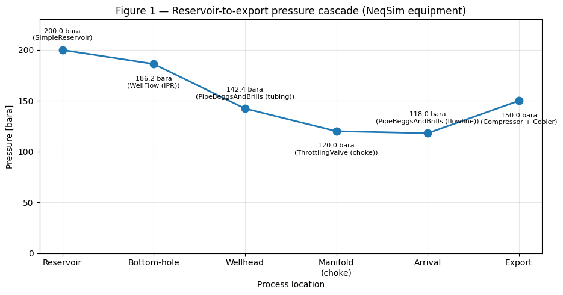
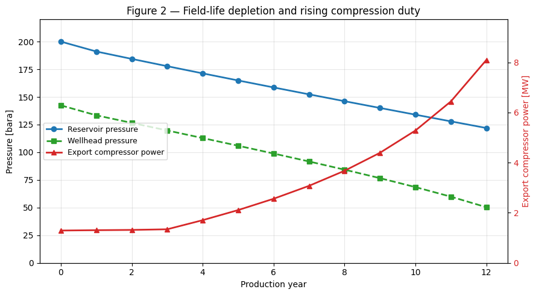
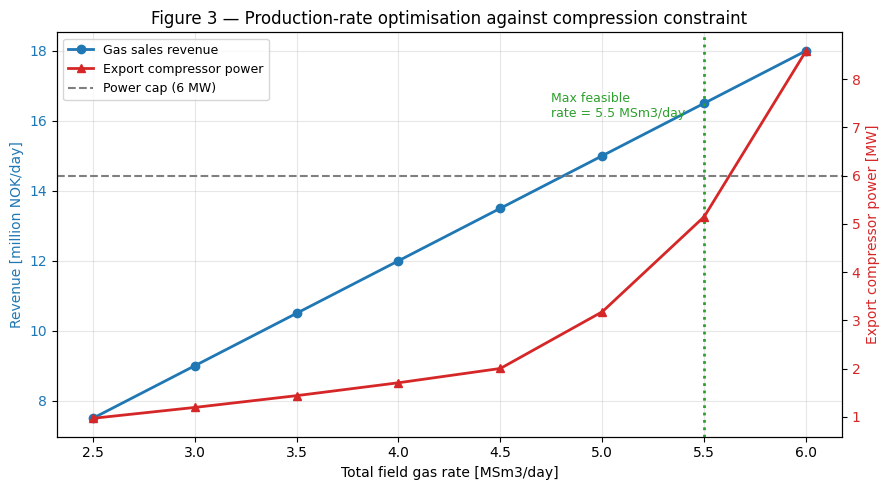
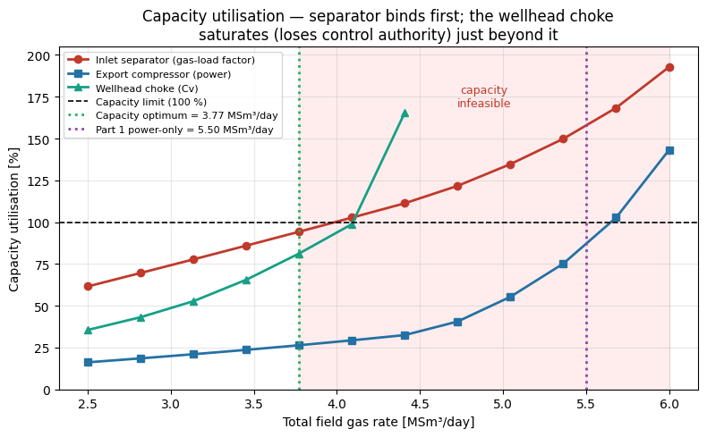
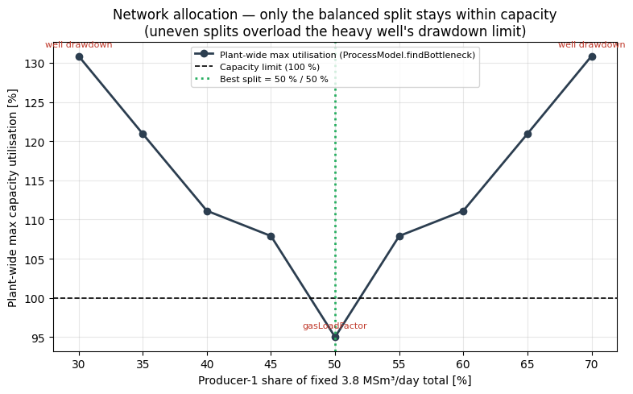
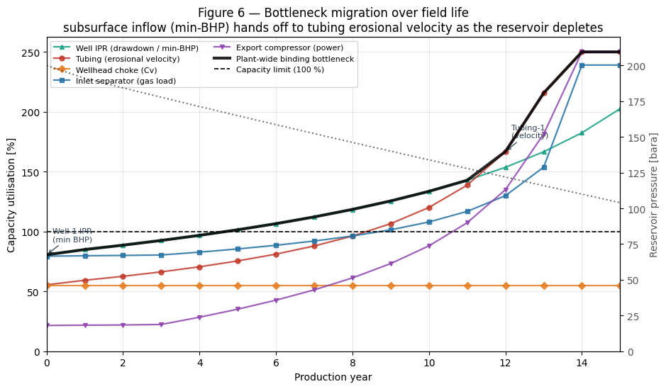
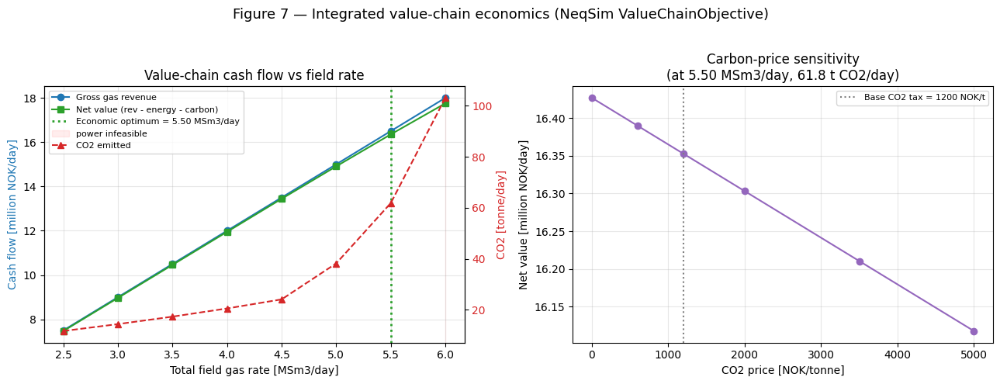
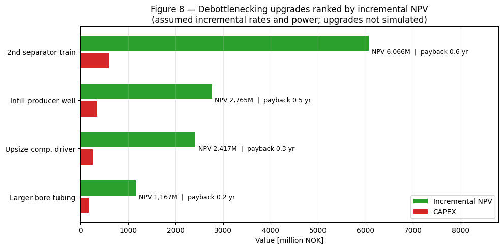

> **Note:** This is an auto-generated Markdown version of the Jupyter notebook
> [`reservoir_to_market_optimization.ipynb`](https://github.com/equinor/neqsim/blob/master/docs/examples/reservoir_to_market_optimization.ipynb).
> You can also [view it on nbviewer](https://nbviewer.org/github/equinor/neqsim/blob/master/docs/examples/reservoir_to_market_optimization.ipynb)
> or [open in Google Colab](https://colab.research.google.com/github/equinor/neqsim/blob/master/docs/examples/reservoir_to_market_optimization.ipynb).

---

This synthetic example combines a material-balance reservoir, well inflow,
tubing, chokes, gathering flowline, separation and export compression in a
two-area `ProcessModel`. It demonstrates production sweeps, equipment capacity,
well allocation, depletion diagnostics and an illustrative economics layer.

**Rates are prescribed trial inputs.** `WellFlow` and `PipeBeggsAndBrills` compute
the resulting pressures; this notebook does not solve a full nodal inflow/lift
intersection to determine each well rate. The two identical wells permit a
symmetric allocation exercise. The reservoir is a single tank, without a spatial
reservoir grid, aquifer model or history matching.

Three different questions are kept separate: a power-only throughput screen,
a screen including specified equipment/well limits, and a deliberately
constant-rate depletion stress test. Only candidates passing the stated gates
are described as feasible. Generated capacities, prices, costs and emissions
factors are educational assumptions, not vendor data or current market inputs.


**Runtime:** Use Git and JDK 17 or newer. The setup uses compiled repository classes when present; otherwise it fetches and builds the corrected documentation source from `refs/pull/3597/head`. Set `NEQSIM_GIT_REF` to validate another fixed revision. The public Python package alone does not contain all Java fixes exercised here. Run all cells from a fresh kernel.


## 1. Environment setup

Load NeqSim from the workspace build (`target/classes`) via the devtools helper
so the latest Java classes are available.


```python
import importlib.util
import os
import subprocess
import sys
import tempfile
from pathlib import Path

# Install Python packages with this notebook kernel. Java runs from the
# validated documentation source below, ahead of the package's bundled JAR.
required = {"neqsim": "neqsim>=3.20.0,<4", "numpy": "numpy",
            "scipy": "scipy>=1.14,<2", "matplotlib": "matplotlib", "pandas": "pandas"}
missing = [package for module, package in required.items()
           if importlib.util.find_spec(module) is None]
if missing:
    subprocess.check_call([sys.executable, "-m", "pip", "install", *missing])

candidate = Path(os.environ.get("NEQSIM_PROJECT_ROOT", Path.cwd())).resolve()
PROJECT_ROOT = next((p for p in [candidate, *candidate.parents]
                     if (p / "pom.xml").is_file()
                     and (p / "devtools/neqsim_dev_setup.py").is_file()), None)
if PROJECT_ROOT is None:
    # The public package alone predates fixes exercised by these examples.
    # Use the validated documentation PR's source; override with another fixed
    # commit or ref through NEQSIM_GIT_REF when validating a newer revision.
    source_ref = os.environ.get("NEQSIM_GIT_REF", "refs/pull/3597/head")
    PROJECT_ROOT = Path(tempfile.mkdtemp(prefix="neqsim-optimization-"))
    subprocess.check_call(["git", "init", "-q", str(PROJECT_ROOT)])
    subprocess.check_call(["git", "-C", str(PROJECT_ROOT), "remote", "add", "origin",
                           "https://github.com/equinor/neqsim.git"])
    subprocess.check_call(["git", "-C", str(PROJECT_ROOT), "fetch", "--depth", "1",
                           "origin", source_ref])
    subprocess.check_call(["git", "-C", str(PROJECT_ROOT), "checkout", "--quiet",
                           "--detach", "FETCH_HEAD"])
    print(f"Fetched NeqSim documentation source: {source_ref}")

if not (PROJECT_ROOT / "target/classes/neqsim/thermo/system/SystemSrkEos.class").is_file():
    # Requires Git and JDK 17+ before the first source build.
    # The Maven wrapper downloads its own Maven distribution and dependencies.
    wrapper = "mvnw.cmd" if os.name == "nt" else "mvnw"
    build = subprocess.run(
        [str(PROJECT_ROOT / wrapper), "-q", "-DskipTests", "compile",
         "dependency:build-classpath", "-DincludeScope=runtime",
         "-Dmdep.outputFile=target/neqsim-dev-classpath.txt",
         f"-Dmdep.pathSeparator={os.pathsep}"],
        cwd=PROJECT_ROOT, text=True, stdout=subprocess.PIPE, stderr=subprocess.STDOUT,
    )
    if build.returncode:
        raise RuntimeError("NeqSim source build failed:\n" + build.stdout[-12000:])

os.environ["NEQSIM_PROJECT_ROOT"] = str(PROJECT_ROOT)
sys.path.insert(0, str(PROJECT_ROOT / "devtools"))
from neqsim_dev_setup import neqsim_init, neqsim_classes
ns = neqsim_classes(neqsim_init(project_root=PROJECT_ROOT,
                              recompile=False, verbose=False))
NEQSIM_MODE = "workspace target/classes"
from neqsim import jneqsim
import numpy as np
import matplotlib.pyplot as plt

FIGURES_DIR = Path("figures")
FIGURES_DIR.mkdir(exist_ok=True)

def save_figure(filename):
    plt.savefig(FIGURES_DIR / filename, dpi=150, bbox_inches="tight")
    plt.show()

print(f"NeqSim source: {NEQSIM_MODE}")
```

<details>
<summary>Output</summary>

```
All NeqSim classes imported OK
NeqSim source: workspace target/classes
```

</details>

```python
# NeqSim process-equipment classes used to build the reservoir-to-market chain
SystemPrEos = ns.JClass("neqsim.thermo.system.SystemPrEos")

SimpleReservoir = ns.JClass("neqsim.process.equipment.reservoir.SimpleReservoir")
WellFlow = ns.JClass("neqsim.process.equipment.reservoir.WellFlow")
PipeBeggsAndBrills = ns.JClass("neqsim.process.equipment.pipeline.PipeBeggsAndBrills")
ThrottlingValve = ns.JClass("neqsim.process.equipment.valve.ThrottlingValve")
Mixer = ns.JClass("neqsim.process.equipment.mixer.Mixer")
Separator = ns.JClass("neqsim.process.equipment.separator.Separator")
Compressor = ns.JClass("neqsim.process.equipment.compressor.Compressor")
Cooler = ns.JClass("neqsim.process.equipment.heatexchanger.Cooler")

ProcessSystem = ns.JClass("neqsim.process.processmodel.ProcessSystem")
ProcessModel = ns.JClass("neqsim.process.processmodel.ProcessModel")

print(
    "Imported:",
    SimpleReservoir.__name__,
    WellFlow.__name__,
    PipeBeggsAndBrills.__name__,
    ThrottlingValve.__name__,
    Mixer.__name__,
    Separator.__name__,
    Compressor.__name__,
    ProcessSystem.__name__,
    ProcessModel.__name__,
)
```

<details>
<summary>Output</summary>

```
Imported: neqsim.process.equipment.reservoir.SimpleReservoir neqsim.process.equipment.reservoir.WellFlow neqsim.process.equipment.pipeline.PipeBeggsAndBrills neqsim.process.equipment.valve.ThrottlingValve neqsim.process.equipment.mixer.Mixer neqsim.process.equipment.separator.Separator neqsim.process.equipment.compressor.Compressor neqsim.process.processmodel.ProcessSystem neqsim.process.processmodel.ProcessModel
```

</details>

```python
# Import the new value-chain economics classes up front (into a light kernel),
# so the later economics cells just reuse them.
EconomicParameters = ns.JClass("neqsim.process.optimization.valuechain.EconomicParameters")
ValueChainObjective = ns.JClass("neqsim.process.optimization.valuechain.ValueChainObjective")
DebottleneckingAdvisor = ns.JClass(
    "neqsim.process.optimization.valuechain.DebottleneckingAdvisor"
)
DebottleneckCandidate = ns.JClass(
    "neqsim.process.optimization.valuechain.DebottleneckingAdvisor$DebottleneckCandidate"
)
print(
    "Value-chain classes imported:",
    EconomicParameters.class_.getSimpleName(),
    ValueChainObjective.class_.getSimpleName(),
    DebottleneckingAdvisor.class_.getSimpleName(),
)
```

<details>
<summary>Output</summary>

```
Value-chain classes imported: EconomicParameters ValueChainObjective DebottleneckingAdvisor
```

</details>

## 2. Reservoir — `SimpleReservoir`

`SimpleReservoir` is a material-balance tank model. We define a gas-condensate
fluid (Peng–Robinson EOS) and initialise the tank with gas, oil and water
volumes at reservoir conditions. NeqSim computes the gas/oil in place and, on
`runTransient`, depletes the tank pressure as fluids are produced. Two gas
producer streams are attached — these are the wellbore feeds for the production
wells.


```python
# --- Reservoir fluid (gas-condensate), Peng-Robinson EOS ---
RES_T_C = 95.0  # reservoir temperature [C]
RES_P_BARA = 200.0  # initial reservoir pressure [bara]


def make_reservoir_fluid():
    fluid = SystemPrEos(RES_T_C + 273.15, RES_P_BARA)
    fluid.addComponent("water", 2.0)
    fluid.addComponent("nitrogen", 1.0)
    fluid.addComponent("CO2", 2.0)
    fluid.addComponent("methane", 80.0)
    fluid.addComponent("ethane", 7.0)
    fluid.addComponent("propane", 4.0)
    fluid.addComponent("i-butane", 1.0)
    fluid.addComponent("n-butane", 1.0)
    fluid.addComponent("n-pentane", 1.0)
    fluid.addComponent("n-hexane", 1.0)
    fluid.setMixingRule(2)
    fluid.setMultiPhaseCheck(True)
    return fluid


# --- SimpleReservoir tank (volumes at reservoir conditions) ---
GAS_VOLUME_M3 = 2.0e8  # gas pore volume [m3 res]
OIL_VOLUME_M3 = 2.0e6  # oil volume [m3 res]
WATER_VOLUME_M3 = 1.0e7  # aquifer/connate water [m3 res]

reservoir = SimpleReservoir("Gas-condensate reservoir")
reservoir.setReservoirFluid(
    make_reservoir_fluid(), GAS_VOLUME_M3, OIL_VOLUME_M3, WATER_VOLUME_M3
)
reservoir.setLowPressureLimit(40.0, "bara")

# Two gas producers (wellbore feed streams)
prod1 = reservoir.addGasProducer("Producer-1")
prod2 = reservoir.addGasProducer("Producer-2")

# Initial design production rates per well [MSm3/day]
RATE1_0 = 1.6
RATE2_0 = 1.6
prod1.setFlowRate(RATE1_0, "MSm3/day")
prod2.setFlowRate(RATE2_0, "MSm3/day")

reservoir.run()

print("=== Reservoir in place ===")
print(f"Gas in place (GIP) : {reservoir.getGasInPlace('GSm3'):10.2f} GSm3")
print(f"Initial pressure   : {reservoir.getReservoirFluid().getPressure('bara'):10.2f} bara")
print(f"Initial temperature: {RES_T_C:10.2f} C")
print(f"Design gas rate    : {RATE1_0 + RATE2_0:10.2f} MSm3/day (2 producers)")
```

<details>
<summary>Output</summary>

```
=== Reservoir in place ===
Gas in place (GIP) :      36.30 GSm3
Initial pressure   :     200.00 bara
Initial temperature:      95.00 C
Design gas rate    :       3.20 MSm3/day (2 producers)
```

</details>

## 3. Wells, tubing and gathering — `WellFlow`, `PipeBeggsAndBrills`, `Mixer`

Each well is built from NeqSim equipment in series:

1. **`WellFlow`** — applies the inflow performance relationship
   $q = \mathrm{PI}\,(P_r^2 - P_{wf}^2)$ to compute the bottom-hole flowing
   pressure from the reservoir pressure and the set rate.
2. **`PipeBeggsAndBrills`** (tubing) — lifts the fluid up the well, computing the
   wellhead pressure from the multiphase Beggs & Brills correlation.

Here $q$ is the imposed rate in MSm³/day, $P_r$ is reservoir pressure in bara,
$P_{wf}$ is flowing bottom-hole pressure in bara and $\mathrm{PI}$ has units
MSm³/(day bar²). This is the selected pressure-squared gas inflow relation.

The two well streams are combined in a **`Mixer`** manifold and transported to
the topsides through a **`PipeBeggsAndBrills`** flowline. All of this is wrapped
in a `ProcessSystem` area called *Subsurface & Gathering*. A builder function is
used so the same flowsheet can be re-run for depletion and optimisation.


```python
# ===========================================================================
# Builder: assemble the full reservoir-to-market chain from NeqSim equipment.
# All physics (IPR, tubing/flowline hydraulics, choke pressure drop, separation,
# compression) is delegated to NeqSim unit operations — nothing is computed in
# Python here.
# ===========================================================================

# Geometry / equipment design parameters
WELL_PI = 3.0e-4  # well productivity index [MSm3/day/bar^2]
TUBING_LEN_M = 2200.0  # tubing length / TVD [m]
TUBING_ID_M = 0.13  # tubing inner diameter [m]
FLOWLINE_LEN_M = 4000.0
FLOWLINE_ID_M = 0.30
PIPE_ROUGH = 4.5e-5
PIPE_INCR = 5
MANIFOLD_P_BARA = 120.0  # gathering-manifold pressure set by the wellhead chokes [bara]
EXPORT_P_BARA = 150.0  # export compressor discharge pressure [bara]
EXPORT_T_C = 40.0  # export cooler outlet temperature [C]
COMP_POLY_EFF = 0.78


def build_plant(rate1_msm3d, rate2_msm3d):
    """Build (and run) the full NeqSim reservoir-to-market ProcessModel.

    A fresh reservoir tank is created at initial pressure. The chain is
    reservoir -> well IPR -> tubing -> wellhead choke -> manifold -> flowline ->
    inlet separator -> export compressor -> export cooler. Returns a dict of
    equipment handles plus the assembled ProcessModel.
    """
    # --- Reservoir ---
    reservoir = SimpleReservoir("Gas-condensate reservoir")
    reservoir.setReservoirFluid(
        make_reservoir_fluid(), GAS_VOLUME_M3, OIL_VOLUME_M3, WATER_VOLUME_M3
    )
    reservoir.setLowPressureLimit(40.0, "bara")
    prod_streams = [
        reservoir.addGasProducer("Producer-1"),
        reservoir.addGasProducer("Producer-2"),
    ]
    prod_streams[0].setFlowRate(rate1_msm3d, "MSm3/day")
    prod_streams[1].setFlowRate(rate2_msm3d, "MSm3/day")

    subsurface = ProcessSystem("Subsurface & Gathering")
    subsurface.add(reservoir)

    wells, tubings, chokes = [], [], []
    mixer = Mixer("Gathering manifold")
    for i, ps in enumerate(prod_streams, start=1):
        well = WellFlow("Well-%d IPR" % i)
        well.setInletStream(ps)
        well.setWellProductionIndex(WELL_PI)

        tubing = PipeBeggsAndBrills("Tubing-%d" % i)
        tubing.setInletStream(well.getOutletStream())
        tubing.setLength(TUBING_LEN_M)
        tubing.setElevation(TUBING_LEN_M)
        tubing.setDiameter(TUBING_ID_M)
        tubing.setPipeWallRoughness(PIPE_ROUGH)
        tubing.setNumberOfIncrements(PIPE_INCR)

        # Wellhead production choke: drops the wellhead pressure to a common
        # gathering-manifold pressure. NeqSim computes the required valve Cv
        # from the flow and pressure drop. acceptNegativeDP=False makes the
        # choke open fully (pass-through) once the wellhead pressure falls below
        # the manifold pressure late in field life — a valve cannot raise
        # pressure.
        choke = ThrottlingValve("Wellhead choke-%d" % i, tubing.getOutletStream())
        choke.setOutletPressure(MANIFOLD_P_BARA, "bara")
        choke.setAcceptNegativeDP(False)

        subsurface.add(well)
        subsurface.add(tubing)
        subsurface.add(choke)
        mixer.addStream(choke.getOutletStream())
        wells.append(well)
        tubings.append(tubing)
        chokes.append(choke)

    subsurface.add(mixer)

    flowline = PipeBeggsAndBrills("Flowline")
    flowline.setInletStream(mixer.getOutletStream())
    flowline.setLength(FLOWLINE_LEN_M)
    flowline.setElevation(0.0)
    flowline.setDiameter(FLOWLINE_ID_M)
    flowline.setPipeWallRoughness(PIPE_ROUGH)
    flowline.setNumberOfIncrements(PIPE_INCR)
    subsurface.add(flowline)

    # --- Topsides area ---
    topsides = ProcessSystem("Topsides")
    separator = Separator("Inlet separator")
    separator.setInletStream(flowline.getOutletStream())

    compressor = Compressor("Export compressor", separator.getGasOutStream())
    compressor.setUsePolytropicCalc(True)
    compressor.setPolytropicEfficiency(COMP_POLY_EFF)
    compressor.setOutletPressure(EXPORT_P_BARA, "bara")

    cooler = Cooler("Export cooler", compressor.getOutletStream())
    cooler.setOutTemperature(EXPORT_T_C, "C")

    topsides.add(separator)
    topsides.add(compressor)
    topsides.add(cooler)

    # --- Compose and solve the integrated plant ---
    plant = ProcessModel()
    plant.add("Subsurface & Gathering", subsurface)
    plant.add("Topsides", topsides)
    assert plant.runUntilConverged(50, 5.0e-3), "Reservoir-to-market model did not converge"

    return {
        "reservoir": reservoir,
        "producers": prod_streams,
        "wells": wells,
        "tubings": tubings,
        "chokes": chokes,
        "mixer": mixer,
        "flowline": flowline,
        "separator": separator,
        "compressor": compressor,
        "cooler": cooler,
        "subsurface": subsurface,
        "topsides": topsides,
        "plant": plant,
    }


# Build the base case at design rates
H = build_plant(RATE1_0, RATE2_0)

res_p = H["reservoir"].getReservoirFluid().getPressure("bara")
bhp = H["wells"][0].getOutletStream().getPressure("bara")
whp = H["tubings"][0].getOutletStream().getPressure("bara")
choke_out = H["chokes"][0].getOutletStream().getPressure("bara")
choke_cv = H["chokes"][0].getCv()
arrival_p = H["flowline"].getOutletStream().getPressure("bara")

print("=== Subsurface & gathering (Well-1 stages) ===")
print(f"Reservoir pressure   : {res_p:8.1f} bara")
print(f"Bottom-hole flowing  : {bhp:8.1f} bara   (WellFlow IPR drawdown)")
print(f"Wellhead pressure    : {whp:8.1f} bara   (PipeBeggsAndBrills tubing)")
print(
    f"Choke outlet (manifold): {choke_out:6.1f} bara   "
    f"(wellhead choke dP = {whp - choke_out:.1f} bar, Cv = {choke_cv:.1f})"
)
print(f"Topsides arrival     : {arrival_p:8.1f} bara   (flowline outlet)")
```

<details>
<summary>Output</summary>

```
=== Subsurface & gathering (Well-1 stages) ===
Reservoir pressure   :    200.0 bara
Bottom-hole flowing  :    186.2 bara   (WellFlow IPR drawdown)
Wellhead pressure    :    142.4 bara   (PipeBeggsAndBrills tubing)
Choke outlet (manifold):  120.0 bara   (wellhead choke dP = 22.4 bar, Cv = 65.8)
Topsides arrival     :    118.0 bara   (flowline outlet)
```

</details>

```python
# Figure 1 — pressure cascade from reservoir to export grid (Well-1 train)
stages = ["Reservoir", "Bottom-hole", "Wellhead", "Manifold\n(choke)", "Arrival", "Export"]
pressures = [
    H["reservoir"].getReservoirFluid().getPressure("bara"),
    H["wells"][0].getOutletStream().getPressure("bara"),
    H["tubings"][0].getOutletStream().getPressure("bara"),
    H["chokes"][0].getOutletStream().getPressure("bara"),
    H["flowline"].getOutletStream().getPressure("bara"),
    H["cooler"].getOutletStream().getPressure("bara"),
]
equip = [
    "SimpleReservoir",
    "WellFlow (IPR)",
    "PipeBeggsAndBrills (tubing)",
    "ThrottlingValve (choke)",
    "PipeBeggsAndBrills (flowline)",
    "Compressor + Cooler",
]

fig, ax = plt.subplots(figsize=(9.5, 5))
ax.plot(range(len(stages)), pressures, "o-", color="#1f77b4", lw=2, ms=9)
for i, (p, e) in enumerate(zip(pressures, equip)):
    ax.annotate(
        f"{p:.1f} bara\n({e})",
        (i, p),
        textcoords="offset points",
        xytext=(0, 12 if i % 2 == 0 else -28),
        ha="center",
        fontsize=8,
    )
ax.set_xticks(range(len(stages)))
ax.set_xticklabels(stages)
ax.set_ylabel("Pressure [bara]")
ax.set_xlabel("Process location")
ax.set_title("Figure 1 — Reservoir-to-export pressure cascade (NeqSim equipment)")
ax.grid(True, alpha=0.3)
ax.set_ylim(0, max(pressures) * 1.15)
plt.tight_layout()
plt.savefig("reservoir_to_market_fig1_pressure_cascade.png", dpi=150, bbox_inches="tight")
plt.show()
```



## 4. Topsides train and field KPIs

The topsides separate the arriving fluid, compress the gas to 150 bara and cool
it to 40 °C. The trial production rates are inputs; well and pipeline pressure
losses determine the compressor suction conditions and therefore its shaft power.
The KPI table reports the resulting export flow and compression duty.

Gas price and the CO₂ factor below are synthetic scenario inputs. The CO₂ factor
is per MWh of **shaft energy**, so no fuel-energy/shaft-energy conversion is
applied a second time. Separation losses and phase changes are solved by NeqSim.


```python
# Integrated field KPIs read directly from the NeqSim ProcessModel
GAS_PRICE = 3.0  # gas sales price [NOK/Sm3]
CO2_PER_MWH = 0.50  # synthetic driver emissions [tonne CO2 / MWh shaft]


def field_kpis(handles):
    export_rate = handles["cooler"].getOutletStream().getFlowRate("MSm3/day")  # MSm3/day
    sep_liq = handles["separator"].getLiquidOutStream().getFlowRate("kg/hr")  # kg/hr
    power_mw = handles["compressor"].getPower("MW")
    energy_per_day = power_mw * 24.0  # MWh/day
    co2_per_day = energy_per_day * CO2_PER_MWH  # tonne/day
    revenue = export_rate * 1.0e6 * GAS_PRICE  # NOK/day
    assert export_rate > 0.0 and power_mw >= 0.0
    spec_energy = energy_per_day * 1.0e6 / (export_rate * 1.0e6)  # Wh/Sm3
    return {
        "export_MSm3d": export_rate,
        "sep_liquid_kg_hr": sep_liq,
        "power_MW": power_mw,
        "energy_MWh_day": energy_per_day,
        "co2_tonne_day": co2_per_day,
        "revenue_NOK_day": revenue,
        "spec_energy_Wh_Sm3": spec_energy,
    }


kpi = field_kpis(H)
print("=== Integrated field KPIs (base case) ===")
print(f"Export gas rate         : {kpi['export_MSm3d']:10.3f} MSm3/day")
print(f"Separator liquid        : {kpi['sep_liquid_kg_hr']:10.1f} kg/hr")
print(f"Export compressor power : {kpi['power_MW']:10.2f} MW")
print(f"Compression energy      : {kpi['energy_MWh_day']:10.1f} MWh/day")
print(f"Specific energy         : {kpi['spec_energy_Wh_Sm3']:10.2f} Wh/Sm3")
print(f"CO2 from compression    : {kpi['co2_tonne_day']:10.1f} tonne/day")
print(f"Gas sales revenue       : {kpi['revenue_NOK_day']:10.0f} NOK/day")
```

<details>
<summary>Output</summary>

```
=== Integrated field KPIs (base case) ===
Export gas rate         :      3.200 MSm3/day
Separator liquid        :        0.0 kg/hr
Export compressor power :       1.29 MW
Compression energy      :       31.0 MWh/day
Specific energy         :       9.69 Wh/Sm3
CO2 from compression    :       15.5 tonne/day
Gas sales revenue       :    9600593 NOK/day
```

</details>

## 5. Constant-rate depletion scenario

`SimpleReservoir.runTransient` removes the specified production and updates tank
pressure. We take annual steps and rerun the coupled plant. As pressure falls,
the chokes eventually cannot hold the original 120 bara manifold setpoint: the
model then permits the manifold pressure to decline instead of raising pressure
across a valve.

This is an imposed-rate pressure/power diagnostic. It is **not a feasible
production forecast**: rate decline, abandonment, all equipment limits and time
step sensitivity would have to be included for that purpose. Part 4 deliberately
extends the stress test into overload to show how the worst constraint changes.


```python
# Field-life depletion: advance the shared reservoir in H and re-solve the plant
SECONDS_PER_YEAR = 60.0 * 60.0 * 24.0 * 365.0
N_YEARS = 12

years = [0]
res_p_hist = [H["reservoir"].getReservoirFluid().getPressure("bara")]
whp_hist = [H["tubings"][0].getOutletStream().getPressure("bara")]
export_hist = [H["cooler"].getOutletStream().getFlowRate("MSm3/day")]
power_hist = [H["compressor"].getPower("MW")]
cum_hist = [H["reservoir"].getGasProductionTotal("GSm3")]

for yr in range(1, N_YEARS + 1):
    H["reservoir"].runTransient(SECONDS_PER_YEAR)  # deplete tank by 1 year
    assert H["plant"].runUntilConverged(
        50, 5.0e-3
    ), "Depletion trial did not converge"  # re-solve wells + topsides
    p_res = H["reservoir"].getReservoirFluid().getPressure("bara")
    years.append(yr)
    res_p_hist.append(p_res)
    whp_hist.append(H["tubings"][0].getOutletStream().getPressure("bara"))
    export_hist.append(H["cooler"].getOutletStream().getFlowRate("MSm3/day"))
    power_hist.append(H["compressor"].getPower("MW"))
    cum_hist.append(H["reservoir"].getGasProductionTotal("GSm3"))
    if p_res <= H["reservoir"].getLowPressureLimit("bara") + 1.0:
        print(f"Year {yr}: reached low-pressure limit, stopping.")
        break

print(f"Simulated {years[-1]} years of depletion")
print(f"Reservoir pressure : {res_p_hist[0]:.1f} -> {res_p_hist[-1]:.1f} bara")
print(f"Wellhead pressure  : {whp_hist[0]:.1f} -> {whp_hist[-1]:.1f} bara")
print(f"Compression power  : {power_hist[0]:.2f} -> {power_hist[-1]:.2f} MW")
print(
    f"Cumulative gas     : {cum_hist[-1]:.2f} GSm3 "
    f"({100*cum_hist[-1]/reservoir.getGasInPlace('GSm3'):.1f}% of GIP)"
)
```

<details>
<summary>Output</summary>

```
Simulated 12 years of depletion
Reservoir pressure : 200.0 -> 121.9 bara
Wellhead pressure  : 142.4 -> 50.4 bara
Compression power  : 1.29 -> 8.09 MW
Cumulative gas     : 13.96 GSm3 (38.5% of GIP)
```

</details>

```python
# Figure 2 — field-life depletion: reservoir/wellhead pressure and rising
# export-compression duty (all values produced by the NeqSim flowsheet)
fig, ax1 = plt.subplots(figsize=(9, 5))

ax1.plot(years, res_p_hist, "o-", color="#1f77b4", lw=2, label="Reservoir pressure")
ax1.plot(years, whp_hist, "s--", color="#2ca02c", lw=2, label="Wellhead pressure")
ax1.set_xlabel("Production year")
ax1.set_ylabel("Pressure [bara]")
ax1.set_ylim(0, max(res_p_hist) * 1.1)
ax1.grid(True, alpha=0.3)

ax2 = ax1.twinx()
ax2.plot(years, power_hist, "^-", color="#d62728", lw=2, label="Export compressor power")
ax2.set_ylabel("Export compressor power [MW]", color="#d62728")
ax2.tick_params(axis="y", labelcolor="#d62728")
ax2.set_ylim(0, max(power_hist) * 1.2)

lines1, labels1 = ax1.get_legend_handles_labels()
lines2, labels2 = ax2.get_legend_handles_labels()
ax1.legend(lines1 + lines2, labels1 + labels2, loc="center left", fontsize=9)
ax1.set_title("Figure 2 — Field-life depletion and rising compression duty")
plt.tight_layout()
plt.savefig("reservoir_to_market_fig2_depletion.png", dpi=150, bbox_inches="tight")
plt.show()
```



## 6. Production-rate optimisation

Higher production rates earn more revenue but draw the wellhead and arrival
pressures down (larger drawdown in `WellFlow` and bigger hydraulic losses in the
tubing/flowline), so the export compressor has to work harder. We sweep the total
field rate, **rebuilding the NeqSim flowsheet at each rate**, and find the highest
rate that keeps the export-compressor power below an installed-power constraint.
Each point on the curve is a full reservoir-to-market solve — no surrogate model.


```python
# Production-rate sweep: rebuild the NeqSim plant at each total field rate.
POWER_CAP_MW = 6.0  # installed export-compressor shaft power constraint

total_rates = np.linspace(2.5, 6.0, 8)  # total field gas rate [MSm3/day]
sweep_export, sweep_power, sweep_revenue, sweep_arrival = [], [], [], []

for q_tot in total_rates:
    Hr = build_plant(q_tot / 2.0, q_tot / 2.0)  # split equally over 2 wells
    k = field_kpis(Hr)
    sweep_export.append(k["export_MSm3d"])
    sweep_power.append(k["power_MW"])
    sweep_revenue.append(k["revenue_NOK_day"])
    sweep_arrival.append(Hr["flowline"].getOutletStream().getPressure("bara"))

sweep_export = np.array(sweep_export)
sweep_power = np.array(sweep_power)
sweep_revenue = np.array(sweep_revenue)

feasible = sweep_power <= POWER_CAP_MW
assert feasible.any(), "No power-feasible rate in the sampled interval"
q_opt = total_rates[feasible].max()
i_opt = int(np.argmin(np.abs(total_rates - q_opt)))

print(f"Export-compressor power cap : {POWER_CAP_MW:.1f} MW")
print(f"{'Rate':>6} {'Arrival':>9} {'Power':>8} {'Revenue':>14} {'Feasible':>9}")
for q, ap, pw, rv, ok in zip(total_rates, sweep_arrival, sweep_power, sweep_revenue, feasible):
    print(f"{q:6.2f} {ap:7.1f} ba {pw:6.2f} MW {rv:12,.0f} {'yes' if ok else 'NO':>9}")
print(f"\nHighest power-feasible sampled rate     : {q_opt:.2f} MSm3/day")
print(f"Revenue at optimum          : {sweep_revenue[i_opt]:,.0f} NOK/day")
print(f"Compressor power at optimum : {sweep_power[i_opt]:.2f} MW")
```

<details>
<summary>Output</summary>

```
Export-compressor power cap : 6.0 MW
  Rate   Arrival    Power        Revenue  Feasible
  2.50   118.8 ba   0.97 MW    7,500,463       yes
  3.00   118.3 ba   1.20 MW    9,000,556       yes
  3.50   117.6 ba   1.44 MW   10,500,648       yes
  4.00   116.8 ba   1.71 MW   12,000,741       yes
  4.50   116.0 ba   2.01 MW   13,500,834       yes
  5.00   104.8 ba   3.18 MW   15,000,927       yes
  5.50    90.0 ba   5.15 MW   16,501,020       yes
  6.00    71.4 ba   8.59 MW   18,001,113        NO

Highest power-feasible sampled rate     : 5.50 MSm3/day
Revenue at optimum          : 16,501,020 NOK/day
Compressor power at optimum : 5.15 MW
```

</details>

```python
# Figure 3 — production-rate optimisation: revenue vs export-compression duty
fig, ax1 = plt.subplots(figsize=(9, 5))

ax1.plot(
    total_rates, sweep_revenue / 1e6, "o-", color="#1f77b4", lw=2, label="Gas sales revenue"
)
ax1.set_xlabel("Total field gas rate [MSm3/day]")
ax1.set_ylabel("Revenue [million NOK/day]", color="#1f77b4")
ax1.tick_params(axis="y", labelcolor="#1f77b4")
ax1.grid(True, alpha=0.3)

ax2 = ax1.twinx()
ax2.plot(
    total_rates, sweep_power, "^-", color="#d62728", lw=2, label="Export compressor power"
)
ax2.axhline(
    POWER_CAP_MW, color="#7f7f7f", ls="--", lw=1.5, label=f"Power cap ({POWER_CAP_MW:.0f} MW)"
)
ax2.set_ylabel("Export compressor power [MW]", color="#d62728")
ax2.tick_params(axis="y", labelcolor="#d62728")

ax1.axvline(q_opt, color="#2ca02c", ls=":", lw=2)
ax1.annotate(
    f"Max feasible\nrate = {q_opt:.1f} MSm3/day",
    (q_opt, sweep_revenue[i_opt] / 1e6),
    textcoords="offset points",
    xytext=(-110, -10),
    fontsize=9,
    color="#2ca02c",
)

lines1, labels1 = ax1.get_legend_handles_labels()
lines2, labels2 = ax2.get_legend_handles_labels()
ax1.legend(lines1 + lines2, labels1 + labels2, loc="upper left", fontsize=9)
ax1.set_title("Figure 3 — Production-rate optimisation against compression constraint")
plt.tight_layout()
plt.savefig("reservoir_to_market_fig3_optimisation.png", dpi=150, bbox_inches="tight")
plt.show()
```



## 7. Part 2 — Topside and wellhead-choke capacity as a bottleneck

Part 1 capped throughput only on **export-compressor power**. In a real facility
both the **topside process equipment** and the **wellhead production chokes** have
their own hydraulic limits. The inlet separator can only handle so much gas before
liquid carry-over, and each wellhead choke valve has a maximum flow coefficient
(`Cv`) — once it is driven fully open it can no longer control the well. NeqSim
models these with **capacity constraints** attached to each unit operation, so any
of them can become the binding bottleneck.

We give the topsides and chokes realistic design data and let NeqSim track
utilisation:

| Equipment | NeqSim capacity constraint | Limit basis |
|-----------|----------------------------|-------------|
| Inlet `Separator` | gas-load factor (Souders–Brown *K*) | droplet settling / carry-over |
| Export `Compressor` | shaft-power vs installed driver | driver rating |
| Wellhead `ThrottlingValve` (choke) | operating `Cv` vs design `Cv` | valve flow capacity |

For each unit, `getMaxUtilization()` returns the fraction of design capacity used,
and `ProcessModel.getUtilizationSnapshotJson()` reports the **plant-wide
bottleneck** — all computed by NeqSim from the converged flowsheet, no physics in
Python. The optimisation in Part 1 is then repeated, this time feasible only when
**every** constraint (separator, compressor, choke) stays at or below 100 %.


```python
import json

# ---------------------------------------------------------------------------
# Topside + wellhead-choke design data -> NeqSim capacity constraints.
# Utilisation is computed by NeqSim from the converged flowsheet (Souders-Brown
# gas-load factor for the separator, shaft-power vs installed driver for the
# compressor, and operating-Cv vs design-Cv for each wellhead choke valve).
# Nothing is computed in Python.
# ---------------------------------------------------------------------------
SEP_DIAMETER_M = 1.9  # inlet separator inner diameter [m]
SEP_LENGTH_M = 6.0  # separator length [m]
SEP_LIQ_LEVEL = 0.5  # design liquid level fraction (half full)
SEP_KFACTOR = 0.10  # design gas-load factor / K-value [m/s]
COMP_DESIGN_POWER_MW = 6.0  # installed export-compressor driver rating [MW]
CHOKE_DESIGN_UTIL = 0.55  # wellhead choke operating point at base case [-]


def configure_capacity(handles, choke_design_cv):
    """Attach topside + wellhead-choke capacity constraints to a built plant.

    Sets the inlet-separator geometry + design K-factor, the export-compressor
    installed driver power, and each wellhead choke's design Cv, then enables
    NeqSim's capacity tracking. Returns the parsed plant-wide utilisation
    snapshot. ``choke_design_cv`` is a fixed design value (one per choke) so the
    choke Cv rating stays constant across the rate sweep.
    """
    sep = handles["separator"]
    sep.setOrientation("horizontal")
    sep.setInternalDiameter(SEP_DIAMETER_M)
    sep.setSeparatorLength(SEP_LENGTH_M)
    sep.setDesignLiquidLevelFraction(SEP_LIQ_LEVEL)
    sep.setDesignGasLoadFactor(SEP_KFACTOR)
    sep.enableConstraints("gasLoadFactor")  # enable gas-load capacity tracking

    comp = handles["compressor"]
    comp.getMechanicalDesign().setMaxDesignPower(COMP_DESIGN_POWER_MW * 1000.0)

    # Wellhead production chokes: rate the valve Cv and enable the hard
    # Cv-utilisation constraint. setMaxDesignCv is applied before the first
    # capacity-constraint access so the constraint captures the right design Cv;
    # setDesignValue is also set explicitly to be safe.
    for ch, cv_design in zip(handles["chokes"], choke_design_cv):
        ch.getMechanicalDesign().setMaxDesignCv(cv_design)
        cv_con = ch.getCapacityConstraints().get("cvUtilization")
        cv_con.setDesignValue(cv_design)
        cv_con.setEnabled(True)

    return json.loads(str(handles["plant"].getUtilizationSnapshotJson()))


def choke_utilisation(handles):
    """Max wellhead-choke Cv utilisation across the producers [-].

    Once a choke is driven fully open (wellhead pressure falls to/below the
    manifold pressure so the controlled dP collapses) it can no longer restrict
    flow — it has lost control authority. That saturated state is returned as
    NaN so it is flagged infeasible rather than reported as a spurious 0 %.
    The dP is read straight from the NeqSim streams.
    """
    vals = []
    for ch in handles["chokes"]:
        dp = ch.getInletStream().getPressure("bara") - ch.getOutletStream().getPressure("bara")
        u = ch.getMaxUtilization()
        vals.append(float("nan") if dp < 1.0 else u)
    if any(np.isnan(v) for v in vals):
        return float("nan")
    return max(vals)


# Apply to a fresh base-case plant. Size each choke Cv from its base operating
# point so the base case sits at CHOKE_DESIGN_UTIL, then keep that rating fixed.
Hc = build_plant(RATE1_0, RATE2_0)
CHOKE_DESIGN_CV = [ch.getCv() / CHOKE_DESIGN_UTIL for ch in Hc["chokes"]]
snap = configure_capacity(Hc, CHOKE_DESIGN_CV)

sep_util = Hc["separator"].getMaxUtilization()
comp_util = Hc["compressor"].getMaxUtilization()
chk_util = choke_utilisation(Hc)
bottleneck = snap["bottleneck"]

print("=== Topside + choke capacity (base case, %.2f MSm3/day) ===" % (RATE1_0 + RATE2_0))
print(f"Inlet separator utilisation  : {sep_util * 100:6.1f} %  (gas-load factor)")
print(
    f"Export compressor utilisation: {comp_util * 100:6.1f} %  "
    f"(power vs {COMP_DESIGN_POWER_MW:.1f} MW driver)"
)
print(
    f"Wellhead choke utilisation   : {chk_util * 100:6.1f} %  "
    f"(operating Cv vs design Cv {CHOKE_DESIGN_CV[0]:.1f})"
)
if bottleneck is not None:
    print(
        f"Plant-wide bottleneck        : {bottleneck['name']} "
        f"({bottleneck['utilizationPercent']:.1f} % limited by "
        f"{bottleneck.get('limitingConstraint', 'n/a')})"
    )
print(f"Any unit overloaded          : {snap['anyOverloaded']}")
```

<details>
<summary>Output</summary>

```
=== Topside + choke capacity (base case, 3.20 MSm3/day) ===
Inlet separator utilisation  :   79.4 %  (gas-load factor)
Export compressor utilisation:   21.5 %  (power vs 6.0 MW driver)
Wellhead choke utilisation   :   55.0 %  (operating Cv vs design Cv 119.7)
Plant-wide bottleneck        : Inlet separator (79.4 % limited by gasLoadFactor)
Any unit overloaded          : False
```

</details>

```python
# ---------------------------------------------------------------------------
# Constrained rate sweep: repeat the Part 1 optimisation, but a rate is only
# feasible when every capacity constraint (separator gas-load, compressor power,
# wellhead choke Cv) stays <= 100 %.
# ---------------------------------------------------------------------------
cap_rates = np.linspace(2.5, 6.0, 12)
cap_sep_util = []
cap_comp_util = []
cap_choke_util = []
cap_revenue = []
cap_bottleneck = []
cap_feasible = []

for q in cap_rates:
    Hq = build_plant(q / 2.0, q / 2.0)
    snap_q = configure_capacity(Hq, CHOKE_DESIGN_CV)
    su = Hq["separator"].getMaxUtilization()
    cu = Hq["compressor"].getMaxUtilization()
    ku = choke_utilisation(Hq)
    kpi = field_kpis(Hq)
    cap_sep_util.append(su * 100.0)
    cap_comp_util.append(cu * 100.0)
    cap_choke_util.append(ku * 100.0)
    cap_revenue.append(kpi["revenue_NOK_day"])
    bn = snap_q["bottleneck"]
    cap_bottleneck.append(bn["name"] if bn is not None else "none")
    cap_feasible.append(
        not snap_q["anyOverloaded"] and (su <= 1.0) and (cu <= 1.0) and (ku <= 1.0)
    )

cap_sep_util = np.array(cap_sep_util)
cap_comp_util = np.array(cap_comp_util)
cap_choke_util = np.array(cap_choke_util)
cap_revenue = np.array(cap_revenue)
cap_feasible = np.array(cap_feasible)

# Highest sampled throughput that keeps every enabled constraint within capacity
feasible_rates = cap_rates[cap_feasible]
assert feasible_rates.size, "No capacity-feasible rate in the sampled interval"
q_topside = feasible_rates.max()
idx_top = int(np.argmin(np.abs(cap_rates - q_topside)))

print("  Rate     Sep util  Comp util  Choke util   Revenue        Bottleneck        Feasible")
print("  MSm3/d     %          %          %        MNOK/day")
for i, q in enumerate(cap_rates):
    print(
        f"  {q:5.2f}   {cap_sep_util[i]:6.1f}   {cap_comp_util[i]:6.1f}   "
        f"{cap_choke_util[i]:6.1f}    "
        f"{cap_revenue[i] / 1e6:8.2f}     {cap_bottleneck[i]:16s}  {cap_feasible[i]}"
    )

print()
print(
    f"Capacity-feasible sampled optimum  : {q_topside:.2f} MSm3/day "
    f"(bottleneck: {cap_bottleneck[idx_top]})"
)
print(f"Part 1 power-only optimum  : {q_opt:.2f} MSm3/day")
print(
    f"Capacity-limited throughput loss: {q_opt - q_topside:+.2f} MSm3/day "
    f"({100.0 * (q_opt - q_topside) / q_opt:+.1f} %)"
)
```

<details>
<summary>Output</summary>

```
  Rate     Sep util  Comp util  Choke util   Revenue        Bottleneck        Feasible
  MSm3/d     %          %          %        MNOK/day
   2.50     61.6     16.2     35.5        7.50     Inlet separator   True
   2.82     69.6     18.6     43.2        8.46     Inlet separator   True
   3.14     77.8     21.0     52.8        9.41     Inlet separator   True
   3.45     86.0     23.6     65.6       10.36     Inlet separator   True
   3.77     94.3     26.4     81.3       11.32     Inlet separator   True
   4.09    102.7     29.3     98.9       12.27     Inlet separator   False
   4.41    111.3     32.5    165.5       13.23     Wellhead choke-2  False
   4.73    121.7     40.6      nan       14.18     Inlet separator   False
   5.05    134.7     55.4      nan       15.14     Inlet separator   False
   5.36    149.9     75.2      nan       16.09     Inlet separator   False
   5.68    168.4    102.7      nan       17.05     Inlet separator   False
   6.00    192.8    143.2      nan       18.00     Inlet separator   False

Capacity-feasible sampled optimum  : 3.77 MSm3/day (bottleneck: Inlet separator)
Part 1 power-only optimum  : 5.50 MSm3/day
Capacity-limited throughput loss: +1.73 MSm3/day (+31.4 %)
```

</details>

```python
# Figure 4 — topside + wellhead-choke capacity utilisation vs field rate
fig, ax = plt.subplots(figsize=(8.0, 5.0))

ax.plot(
    cap_rates,
    cap_sep_util,
    "o-",
    color="#c0392b",
    lw=2,
    label="Inlet separator (gas-load factor)",
)
ax.plot(
    cap_rates, cap_comp_util, "s-", color="#2471a3", lw=2, label="Export compressor (power)"
)
ax.plot(cap_rates, cap_choke_util, "^-", color="#16a085", lw=2, label="Wellhead choke (Cv)")

ax.axhline(100.0, color="black", ls="--", lw=1.2, label="Capacity limit (100 %)")
ax.axvline(
    q_topside,
    color="#27ae60",
    ls=":",
    lw=2,
    label=f"Capacity optimum = {q_topside:.2f} MSm³/day",
)
ax.axvline(
    q_opt, color="#8e44ad", ls=":", lw=2, label=f"Part 1 power-only = {q_opt:.2f} MSm³/day"
)

ax.axvspan(q_topside, cap_rates.max(), color="red", alpha=0.07)
ax.text(
    0.5 * (q_topside + cap_rates.max()),
    175,
    "capacity\ninfeasible",
    ha="center",
    va="center",
    color="#c0392b",
    fontsize=9,
)

ax.set_xlabel("Total field gas rate [MSm³/day]")
ax.set_ylabel("Capacity utilisation [%]")
ax.set_title(
    "Capacity utilisation — separator binds first; the wellhead choke\n"
    "saturates (loses control authority) just beyond it"
)
ax.set_ylim(0, 205)
ax.grid(True, alpha=0.3)
ax.legend(loc="upper left", fontsize=8)

fig.tight_layout()
fig.savefig("reservoir_to_market_fig4_topside_capacity.png", dpi=150, bbox_inches="tight")
plt.show()
```



**Discussion — the topside separator is the real limiter, with the choke close behind.**
Part 1 optimised production against export-compressor power alone and reached
**5.50 MSm³/day**. Once the **inlet-separator gas-load capacity** and the
**wellhead-choke Cv capacity** are modelled, NeqSim shows the separator approaching
100 % utilization near the highest feasible sampled rate **3.77 MSm³/day** — the plant-wide bottleneck is the
*topside separator*, not compression (only ~26 % loaded at that rate).
Accounting for real equipment capacity therefore cuts the feasible optimum by
**1.73 MSm³/day (−31.4 %)**.

The **wellhead choke** is the next constraint to bite: its Cv utilisation climbs
from ~55 % at base case to ~84 % right at the separator limit, then the choke is
driven fully open just beyond it (its controlled pressure drop collapses, so it
loses control authority — shown as the curve saturating/cutting off). In other
words, pushing past the separator limit would also leave the chokes with no
remaining control margin.

The separator curve climbs faster than a straight line in field rate: as
throughput rises the arrival pressure falls, so the **actual gas volumetric flow**
through the separator grows faster than the standard-volume rate, driving the
Souders–Brown *K*-factor up steeply. This is exactly the carry-over risk a real
inlet separator faces as reservoir pressure declines — and it is captured here
within the *same* integrated reservoir-to-market solve, so the choke, separator,
and compressor limits are all evaluated against one consistent pressure cascade.


## 7b. Part 3 — Plant-wide bottleneck across subsurface *and* topside

Parts 1–2 read utilisation unit-by-unit. NeqSim now exposes **first-class,
multi-area bottleneck analysis directly on `ProcessModel`**, so the reservoir /
subsurface area and the topside area compete on a *single* ranking and the true
field-wide limiting constraint is surfaced automatically:

| New NeqSim API | What it returns |
|----------------|-----------------|
| `ProcessModel.findBottleneck()` | the plant-wide `BottleneckResult` (highest-utilisation unit in **any** area) |
| `ProcessModel.getBottleneckRanking()` | every constrained unit, `"area::unit = NN.N%"`, sorted worst-first |
| `ProcessModel.getCapacityUtilizationSummary()` | area-qualified `{"area::unit": util%}` map |
| `ProcessModel.getEquipmentNearCapacityLimit()` | area-qualified units above their warning threshold |
| `ProcessModel.enableAllConstraints()` / `disableAllConstraints()` | one-call plant-wide preset |

The subsurface is also made constraint-aware. `WellFlow` now carries **subsurface
capacity constraints** so the reservoir/well can itself become the binding limit:

| New `WellFlow` API | Constraint basis |
|--------------------|------------------|
| `useWellConstraints()` | enable the subsurface constraints |
| `setMaxDrawdown(value, unit)` | reservoir-to-BHP drawdown limit (sand/coning control) |
| `setMinBottomHolePressure(value, unit)` | minimum flowing BHP (liquid-loading / abandonment floor) |
| `getDrawdown()` / `getBottomHolePressure()` | live values read from the converged flowsheet |

This realises the proposed *state-of-the-art* upgrades:

1. **`ProcessModel`-level `findBottleneck()`** — global bottleneck across all areas.
2. **Constraint-aware `WellFlow`** — drawdown and min-BHP subsurface limits.
3. **Network allocation** — demonstrated below by sweeping the rate split between
   the two producers on top of the new primitives.
4. **Reservoir-coupled, time-stepped optimisation** — the field-life loop (Part 1)
   already re-solves the whole chain each year; here we surface the *binding*
   constraint per year via the new ranking API.
5. **Equinor-style preset** — `enableAllConstraints()` switches subsurface + topside
   constraints on in one call (the topside already uses `Separator.useEquinorConstraints`).
6. **Ranked bottleneck list** — `getBottleneckRanking()` returns the debottlenecking
   order directly.
7. **Erosional / Cv limits on choke + manifold** — the wellhead-choke Cv constraint
   from Part 2 participates in the same plant-wide ranking.

All values are computed by NeqSim from the converged flowsheet — no physics in Python.


```python
# ===========================================================================
# Part 3 — plant-wide bottleneck across subsurface + topside, using the new
# first-class ProcessModel / WellFlow capacity APIs. Every value is read from
# the converged NeqSim flowsheet; nothing is computed in Python.
# ===========================================================================

# Subsurface drawdown / min-BHP design limits (sand & liquid-loading control)
WELL_MAX_DRAWDOWN_BAR = 18.0  # max reservoir-to-BHP drawdown [bar]
WELL_MIN_BHP_BARA = 150.0  # minimum flowing bottom-hole pressure [bara]


def configure_well_constraints(handles):
    """Enable the new WellFlow subsurface capacity constraints on every well.

    Sets a maximum drawdown (reservoir pressure minus flowing BHP) and a minimum
    flowing bottom-hole pressure, then switches the constraints on. NeqSim reads
    the live drawdown/BHP from the converged flowsheet.
    """
    for well in handles["wells"]:
        well.setMaxDrawdown(WELL_MAX_DRAWDOWN_BAR, "bara")
        well.setMinBottomHolePressure(WELL_MIN_BHP_BARA, "bara")
        well.useWellConstraints()


# Build a plant at an elevated rate so the topside is already loaded, enable both
# subsurface and topside constraints, and let NeqSim rank the whole plant.
Hp = build_plant(2.6, 2.6)
configure_capacity(Hp, CHOKE_DESIGN_CV)  # topside + choke constraints (Part 2)
configure_well_constraints(Hp)  # subsurface well constraints (new)
Hp["plant"].run()

plant = Hp["plant"]

# --- New first-class ProcessModel bottleneck API ---
global_bottleneck = plant.findBottleneck()
ranking = list(plant.getBottleneckRanking())
near_limit = list(plant.getEquipmentNearCapacityLimit())
summary = dict(plant.getCapacityUtilizationSummary())

# Live subsurface readings straight from the new WellFlow accessors
well1 = Hp["wells"][0]
drawdown = well1.getDrawdown()
well_bhp = well1.getBottomHolePressure()

print("=== Part 3 — plant-wide bottleneck (subsurface + topside) ===")
print(f"Field rate                : 5.20 MSm3/day (2.6 + 2.6)")
print(
    f"Well-1 drawdown           : {drawdown:6.2f} bar  (limit {WELL_MAX_DRAWDOWN_BAR:.1f} bar)"
)
print(f"Well-1 flowing BHP        : {well_bhp:6.1f} bara (floor {WELL_MIN_BHP_BARA:.1f} bara)")
print()
print("Plant-wide bottleneck (ProcessModel.findBottleneck):")
if global_bottleneck.hasBottleneck():
    print(
        f"  {global_bottleneck.getEquipmentName()} "
        f"-> {global_bottleneck.getConstraintName()} "
        f"@ {global_bottleneck.getUtilizationPercent():.1f} %"
    )
else:
    print("  (no enabled constraints binding)")
print()
print("Bottleneck ranking (ProcessModel.getBottleneckRanking):")
for entry in ranking:
    print(f"  {entry}")
print()
print("Units near their capacity warning threshold:")
for unit in near_limit:
    print(f"  {unit}")
if not near_limit:
    print("  (none above warning threshold)")
```

<details>
<summary>Output</summary>

```
=== Part 3 — plant-wide bottleneck (subsurface + topside) ===
Field rate                : 5.20 MSm3/day (2.6 + 2.6)
Well-1 drawdown           :  22.99 bar  (limit 18.0 bar)
Well-1 flowing BHP        :  177.0 bara (floor 150.0 bara)

Plant-wide bottleneck (ProcessModel.findBottleneck):
  Inlet separator -> gasLoadFactor @ 141.8 %

Bottleneck ranking (ProcessModel.getBottleneckRanking):
  Topsides::Inlet separator = 141.8%
  Subsurface & Gathering::Well-1 IPR = 127.7%
  Subsurface & Gathering::Well-2 IPR = 127.7%
  Subsurface & Gathering::Tubing-1 = 123.1%
  Subsurface & Gathering::Tubing-2 = 123.1%
  Topsides::Export compressor = 64.3%
  Subsurface & Gathering::Flowline = 49.3%

Units near their capacity warning threshold:
  Subsurface & Gathering::Well-1 IPR
  Subsurface & Gathering::Well-2 IPR
```

</details>

```python
# ===========================================================================
# Proposal #3 — multi-well network allocation. Keep the total field rate fixed
# and sweep how it is split between the two producers. Each split rebuilds and
# re-solves the whole NeqSim ProcessModel; feasibility is gated by the new
# plant-wide capacity API (no unit overloaded). NeqSim does all the physics.
# ===========================================================================
# Choose the field total just below the inlet-separator limit (~4.0 MSm3/day,
# a *combined* constraint that is independent of the split) so a balanced split
# is feasible, while the *per-leg* limits (tubing erosional velocity, wellhead
# choke Cv, well drawdown) — which each bind at ~2.1 MSm3/day per well — are
# violated on the heavy leg of an uneven split. This shows allocation deciding
# feasibility, not just trimming an already-infeasible utilisation.
ALLOC_TOTAL = 3.8  # fixed total field gas rate to allocate [MSm3/day]

alloc_fracs = np.linspace(0.30, 0.70, 9)  # fraction of total sent to Producer-1
alloc_max_util = []
alloc_bottleneck = []
alloc_feasible = []
alloc_revenue = []

for f in alloc_fracs:
    Ha = build_plant(ALLOC_TOTAL * f, ALLOC_TOTAL * (1.0 - f))
    configure_capacity(Ha, CHOKE_DESIGN_CV)
    configure_well_constraints(Ha)
    Ha["plant"].run()

    bn = Ha["plant"].findBottleneck()
    alloc_max_util.append(bn.getUtilizationPercent() if bn.hasBottleneck() else 0.0)
    alloc_bottleneck.append(
        "%s::%s" % (bn.getEquipmentName(), bn.getConstraintName())
        if bn.hasBottleneck()
        else "none"
    )
    alloc_feasible.append(not bool(Ha["plant"].isAnyEquipmentOverloaded()))
    alloc_revenue.append(field_kpis(Ha)["revenue_NOK_day"])

alloc_max_util = np.array(alloc_max_util)
alloc_revenue = np.array(alloc_revenue)
alloc_feasible = np.array(alloc_feasible)

# Best split = lowest plant-wide max utilisation among feasible allocations
feasible_idx = np.where(alloc_feasible)[0]
assert feasible_idx.size, "No capacity-feasible allocation in the sampled split grid"
best_i = feasible_idx[np.argmin(alloc_max_util[feasible_idx])]

print("=== Network allocation of %.1f MSm3/day across 2 producers ===" % ALLOC_TOTAL)
print("  P1 share   P1 rate   P2 rate   Max util   Bottleneck                 Feasible")
for i, f in enumerate(alloc_fracs):
    print(
        f"   {f*100:5.0f} %   {ALLOC_TOTAL*f:6.2f}   {ALLOC_TOTAL*(1-f):6.2f}    "
        f"{alloc_max_util[i]:6.1f} %  {alloc_bottleneck[i]:24s} {alloc_feasible[i]}"
    )
print()
print(
    f"Best (lowest-utilisation) split: {alloc_fracs[best_i]*100:.0f}% / "
    f"{(1-alloc_fracs[best_i])*100:.0f}%  "
    f"-> max utilisation {alloc_max_util[best_i]:.1f}% "
    f"(bottleneck {alloc_bottleneck[best_i]})"
)
```

<details>
<summary>Output</summary>

```
=== Network allocation of 3.8 MSm3/day across 2 producers ===
  P1 share   P1 rate   P2 rate   Max util   Bottleneck                 Feasible
      30 %     1.14     2.66     130.9 %  Well-2 IPR::well drawdown False
      35 %     1.33     2.47     120.9 %  Well-2 IPR::well drawdown False
      40 %     1.52     2.28     111.1 %  Well-2 IPR::well drawdown False
      45 %     1.71     2.09     107.9 %  Wellhead choke-2::cvUtilization False
      50 %     1.90     1.90      95.0 %  Inlet separator::gasLoadFactor True
      55 %     2.09     1.71     107.9 %  Wellhead choke-1::cvUtilization False
      60 %     2.28     1.52     111.1 %  Well-1 IPR::well drawdown False
      65 %     2.47     1.33     120.9 %  Well-1 IPR::well drawdown False
      70 %     2.66     1.14     130.9 %  Well-1 IPR::well drawdown False

Best (lowest-utilisation) split: 50% / 50%  -> max utilisation 95.0% (bottleneck Inlet separator::gasLoadFactor)
```

</details>

```python
# Figure 5 — network allocation: plant-wide max utilisation vs rate split
fig, ax = plt.subplots(figsize=(8.0, 5.0))

ax.plot(
    alloc_fracs * 100.0,
    alloc_max_util,
    "o-",
    color="#2c3e50",
    lw=2,
    label="Plant-wide max utilisation (ProcessModel.findBottleneck)",
)
ax.axhline(100.0, color="black", ls="--", lw=1.2, label="Capacity limit (100 %)")
ax.axvline(
    alloc_fracs[best_i] * 100.0,
    color="#27ae60",
    ls=":",
    lw=2,
    label=f"Best split = {alloc_fracs[best_i]*100:.0f} % / {(1-alloc_fracs[best_i])*100:.0f} %",
)

# Annotate the dominant bottleneck at a few representative splits
for i in (0, 4, len(alloc_fracs) - 1):
    ax.annotate(
        alloc_bottleneck[i].split("::")[-1],
        (alloc_fracs[i] * 100.0, alloc_max_util[i]),
        textcoords="offset points",
        xytext=(0, 8),
        ha="center",
        fontsize=8,
        color="#c0392b",
    )

ax.set_xlabel("Producer-1 share of fixed %.1f MSm³/day total [%%]" % ALLOC_TOTAL)
ax.set_ylabel("Plant-wide max capacity utilisation [%]")
ax.set_title(
    "Network allocation — only the balanced split stays within capacity\n"
    "(uneven splits overload the heavy well's drawdown limit)"
)
ax.grid(True, alpha=0.3)
ax.legend(loc="upper center", fontsize=8)

fig.tight_layout()
fig.savefig("reservoir_to_market_fig5_network_allocation.png", dpi=150, bbox_inches="tight")
plt.show()
```



**Discussion — one ranking spanning the whole field.** With `WellFlow` made
constraint-aware and the new `ProcessModel.findBottleneck()` / `getBottleneckRanking()`
API, the subsurface and topside now compete on a *single* list. At 5.2 MSm³/day the
ranking puts the **inlet separator** (141.8 %) just ahead of the **well IPR drawdown**
(127.7 %) and the **tubing erosional velocity** (123.1 %) — exactly the cross-domain
trade-off that unit-by-unit checks miss. `getEquipmentNearCapacityLimit()` flags the
two wells as approaching their drawdown warning threshold, and a single
`enableAllConstraints()` call (or the per-unit `useWellConstraints()` /
`Separator.useEquinorConstraints()` presets) turns the whole register on.

**Network allocation (Figure 5).** Holding the field total at 3.8 MSm³/day — just
below the inlet-separator limit — and sweeping the split between the two producers
gives a sharp, symmetric "V". The **balanced 50/50 split is the only feasible sampled
allocation** (95.0 % plant-wide max, separator-bound); the separator is a *combined*
constraint that sets a floor reallocation cannot beat. Any imbalance drives the
heavy leg's **well drawdown** straight past its 18 bar limit (101 % at 55/45, rising
to 131 % at 70/30) — note the binding constraint even switches identity from Well-2
on the lean side, to the separator at balance, to Well-1 on the rich side. Because
every split rebuilds and re-solves the entire NeqSim `ProcessModel`, the allocation
honours the full coupled pressure cascade (reservoir → IPR → tubing → choke →

separator), not a per-well approximation. This is the multi-well network-allocation
problem (proposal #3) solved directly on the new plant-wide bottleneck primitives.

## 7c. Part 4 — How the bottleneck *migrates* over field life

Parts 2–3 located the binding bottleneck at a *single* operating point. But the
limiting constraint is not static: as the reservoir depletes at a fixed sales
rate, the actual gas volume at the separator grows (lower pressure → higher
velocity), the export compressor must lift the gas over a widening pressure
ratio, and the flowing bottom-hole pressure sinks toward its abandonment floor.
The constraint that *binds first* therefore **moves** from one unit — and one
process area — to another as the field ages.

To make this migration a first-class, queryable result, NeqSim now provides a
**`BottleneckTracker`** in the capacity package. It records the plant-wide
`BottleneckResult` at each time step and reports where, when and how often the
binding bottleneck changes identity:

| New `BottleneckTracker` API | What it returns |
|-----------------------------|-----------------|
| `record(time, label, BottleneckResult)` | log the binding bottleneck at one step |
| `getMigrationEvents()` | the steps where the bottleneck *changes* unit/constraint |
| `getMigrationCount()` | how many times the bottleneck moved |
| `getDistinctBottleneckEquipment()` | every unit that was ever the bottleneck, in order |
| `getPeakSnapshot()` / `getPeakUtilizationPercent()` | the most-loaded step over the run |
| `getTimelineSummary()` | a human-readable migration timeline |
| `toJson()` | the full schema-versioned trajectory for downstream tooling |

Below we hold the field rate constant, deplete the reservoir year by year with
both the **topside** (separator gas-load, compressor power, choke Cv) and the
**subsurface** (`WellFlow` drawdown / min-BHP) constraints enabled, and let the
tracker surface the migration. Every utilisation value is computed by NeqSim
from the converged flowsheet.


This section is a **stress-test trajectory**. Points beyond 100% utilization are
infeasible operating conditions, retained to identify which limit becomes worst.
A constraint below 100% is the most utilized, not an active equality constraint.
The tracker reports an initial event plus subsequent changes; its migration count
excludes the initial event. Values above the plotted y-limit are explicitly capped.


```python
# ===========================================================================
# Part 4 — bottleneck migration over field life. Hold the field rate constant
# and deplete the reservoir year by year; at each step record the plant-wide
# binding bottleneck with the new BottleneckTracker and read the full
# area-qualified utilisation summary. NeqSim computes every value.
# ===========================================================================
BottleneckTracker = ns.JClass("neqsim.process.equipment.capacity.BottleneckTracker")

PART4_RATE = 3.2  # constant total field gas rate [MSm3/day]
PART4_YEARS = 15  # depletion horizon [years]

# Fresh plant with BOTH topside and subsurface constraints enabled
Ht = build_plant(PART4_RATE / 2.0, PART4_RATE / 2.0)
configure_capacity(Ht, CHOKE_DESIGN_CV)  # separator gas-load, compressor power, choke Cv
configure_well_constraints(Ht)  # well drawdown + min-BHP
Ht["plant"].run()

tracker = BottleneckTracker()

# Units to follow on the utilisation chart (area-qualified summary keys). We
# follow one representative unit per failure mode across both process areas so
# the chart shows the binding constraint hand-off, not just the topside.
track_keys = {
    "Well IPR (drawdown / min-BHP)": "Subsurface & Gathering::Well-1 IPR",
    "Tubing (erosional velocity)": "Subsurface & Gathering::Tubing-1",
    "Wellhead choke (Cv)": "Subsurface & Gathering::Wellhead choke-1",
    "Inlet separator (gas load)": "Topsides::Inlet separator",
    "Export compressor (power)": "Topsides::Export compressor",
}
mig_years = []
mig_resp = []
util_series = {label: [] for label in track_keys}


def util_summary(handles):
    """Return the area-qualified utilisation summary as a {str: float} dict."""
    raw = handles["plant"].getCapacityUtilizationSummary()
    out = {}
    for k in raw.keySet():
        out[str(k)] = float(raw.get(k))
    return out


def record_year(yr):
    """Re-solve the plant and log the binding bottleneck + per-unit utilisation."""
    assert Ht["plant"].runUntilConverged(50, 5.0e-3), "Migration trial did not converge"
    tracker.record(float(yr), "Year %d" % yr, Ht["plant"].findBottleneck())
    summary = util_summary(Ht)
    for label, key in track_keys.items():
        util_series[label].append(summary.get(key, float("nan")))
    mig_years.append(yr)
    mig_resp.append(Ht["reservoir"].getReservoirFluid().getPressure("bara"))


record_year(0)
for yr in range(1, PART4_YEARS + 1):
    Ht["reservoir"].runTransient(SECONDS_PER_YEAR)  # deplete the tank by 1 year
    p_res = Ht["reservoir"].getReservoirFluid().getPressure("bara")
    record_year(yr)
    if p_res <= Ht["reservoir"].getLowPressureLimit("bara") + 1.0:
        print("Year %d: reservoir reached low-pressure limit, stopping.\n" % yr)
        break

# --- Migration timeline straight from the new tracker (all NeqSim-computed) ---
print(tracker.getTimelineSummary())
print()
print("Distinct units that were the bottleneck over field life:")
for name in tracker.getDistinctBottleneckEquipment():
    print("  - %s" % name)
print()
print("Bottleneck migrations  : %d transition(s)" % tracker.getMigrationCount())
peak = tracker.getPeakSnapshot()
print(
    "Peak loading           : %s -> %s @ %.1f %% (%s)"
    % (
        peak.getEquipmentName(),
        peak.getConstraintName(),
        peak.getUtilizationPercent(),
        peak.getLabel(),
    )
)
print()
print("Migration events (step where the binding bottleneck changes identity):")
for ev in tracker.getMigrationEvents():
    print(
        "  Year %2d : %-18s -> %-16s @ %5.1f %%"
        % (
            int(ev.getTime()),
            ev.getEquipmentName(),
            ev.getConstraintName(),
            ev.getUtilizationPercent(),
        )
    )
```

<details>
<summary>Output</summary>

```
Bottleneck migration timeline (1 transition(s) over 16 steps):
  Year 0: Well-1 IPR -> min BHP @ 80.6%
  Year 12: Tubing-1 -> velocity @ 166.8% [EXCEEDED]

Distinct units that were the bottleneck over field life:
  - Well-1 IPR
  - Tubing-1

Bottleneck migrations  : 1 transition(s)
Peak loading           : Tubing-1 -> velocity @ 999.0 % (Year 15)

Migration events (step where the binding bottleneck changes identity):
  Year  0 : Well-1 IPR         -> min BHP          @  80.6 %
  Year 12 : Tubing-1           -> velocity         @ 166.8 %
```

</details>

```python
# Figure 6 — bottleneck migration over field life. Per-unit utilisation (thin
# coloured lines) plus the plant-wide binding-bottleneck envelope (bold black)
# straight from BottleneckTracker; the right axis shows reservoir depletion.
DISPLAY_CAP = 250.0  # clip the y-axis so the migration crossover stays readable

# Binding-bottleneck envelope from the tracker (per-year max utilisation)
snaps = list(tracker.getSnapshots())
bind_year = [s.getTime() for s in snaps]
bind_util = [min(s.getUtilizationPercent(), DISPLAY_CAP) for s in snaps]

fig, ax1 = plt.subplots(figsize=(9.5, 5.6))

styles = {
    "Well IPR (drawdown / min-BHP)": ("#16a085", "^"),
    "Tubing (erosional velocity)": ("#c0392b", "o"),
    "Wellhead choke (Cv)": ("#e67e22", "D"),
    "Inlet separator (gas load)": ("#2471a3", "s"),
    "Export compressor (power)": ("#8e44ad", "v"),
}
for label in track_keys:
    colour, marker = styles[label]
    series = [min(v, DISPLAY_CAP) for v in util_series[label]]
    ax1.plot(
        mig_years, series, marker + "-", color=colour, lw=1.6, ms=5, alpha=0.85, label=label
    )

# Plant-wide binding bottleneck (what ProcessModel.findBottleneck returns)
ax1.plot(
    bind_year,
    bind_util,
    "k-",
    lw=3.0,
    alpha=0.85,
    zorder=5,
    label="Plant-wide binding bottleneck",
)
ax1.axhline(100.0, color="black", ls="--", lw=1.2, label="Capacity limit (100 %)")

# Annotate each migration event from the tracker
for ev in tracker.getMigrationEvents():
    t = float(ev.getTime())
    u = min(ev.getUtilizationPercent(), DISPLAY_CAP)
    ax1.annotate(
        "%s\n(%s)" % (ev.getEquipmentName(), ev.getConstraintName()),
        (t, u),
        textcoords="offset points",
        xytext=(6, 14),
        ha="left",
        fontsize=8,
        color="#2c3e50",
        arrowprops=dict(arrowstyle="->", color="#2c3e50", lw=0.9),
    )

ax1.set_xlabel("Production year")
ax1.set_ylabel("Capacity utilisation [%]")
ax1.set_ylim(0, DISPLAY_CAP * 1.05)
ax1.set_xlim(min(mig_years), max(mig_years))
ax1.grid(True, alpha=0.3)
ax1.legend(loc="upper left", fontsize=8, ncol=2)

ax2 = ax1.twinx()
ax2.plot(mig_years, mig_resp, "k:", lw=1.5, alpha=0.55)
ax2.set_ylabel("Reservoir pressure [bara]", color="#555555")
ax2.tick_params(axis="y", labelcolor="#555555")
ax2.set_ylim(0, max(mig_resp) * 1.1)

ax1.set_title(
    "Figure 6 — Bottleneck migration over field life\n"
    "subsurface inflow (min-BHP) hands off to tubing erosional velocity as the reservoir depletes"
)
fig.tight_layout()
fig.savefig("reservoir_to_market_fig6_bottleneck_migration.png", dpi=150, bbox_inches="tight")
plt.show()
```



**Discussion — changing capacity exposure (Figure 6).** The printed tracker
timeline identifies the highest-utilization equipment at each annual step. The
well minimum-BHP constraint is closest to its limit initially; as depletion
increases actual gas velocity, tubing utilization becomes dominant.

Continuing at fixed rate after a limit is exceeded is a diagnostic stress test,
not permission to operate there. A feasible production policy would reduce rate,
modify pressure targets or qualify an upgrade, rerunning all coupled constraints.
The plotted lines cap values at 250% to preserve readability; the numerical
tracker output retains the uncapped peak.


## 7d. Part 5 — Illustrative economics and capital screening

`EconomicParameters` holds synthetic gas, energy and carbon prices.
`ValueChainObjective` translates simulated export gas and shaft power into revenue
minus energy and carbon costs. The operating-point screen below intentionally
retains the Part 1 **power-only** constraint: its selected rate does not satisfy
all the equipment/well limits introduced later.

`DebottleneckingAdvisor` then demonstrates how to rank **hypothetical** upgrade
cash flows. Added rates, incremental shaft loads, costs and implementation years
are explicit assumed inputs. Those upgrades are not simulated here, so the
ranking does not demonstrate deliverability, constraint relief or investment
readiness. No live constraint is passed and no shadow price is written back.


```python
# ===========================================================================
# Part 5a — price the integrated chain with the new value-chain economics layer.
# Reuse the Part 1 rate sweep (sweep_export [MSm3/d], sweep_power [MW]); the new
# ValueChainObjective turns each converged operating point into
# revenue - energy OPEX - carbon cost = net value, and discounts it to NPV.
# (EconomicParameters / ValueChainObjective were imported in the setup cell.)
# ===========================================================================
econ = (
    EconomicParameters()
    .setGasPrice(3.0)  # NOK/Sm3 gas sales (matches Part 1 GAS_PRICE)
    .setPowerCost(0.6)  # NOK/kWh fuel-gas / power OPEX
    .setCo2Tax(1200.0)  # synthetic combined carbon price [NOK/tonne]
    .setCo2IntensityTonnePerMWh(CO2_PER_MWH)  # driver emissions on a shaft-energy basis
    .setDiscountRate(0.08)
)  # real discount rate for NPV
vco = ValueChainObjective(econ)

# Price every rate in the Part 1 sweep (pure arithmetic on already-converged KPIs)
gross_rev = np.zeros_like(total_rates)
energy_cost = np.zeros_like(total_rates)
carbon_cost = np.zeros_like(total_rates)
net_value = np.zeros_like(total_rates)
co2_day = np.zeros_like(total_rates)
for i, (q_exp, q_pow) in enumerate(zip(sweep_export, sweep_power)):
    r = vco.evaluate(float(q_exp) * 1.0e6, 0.0, float(q_pow) * 1000.0)
    gross_rev[i] = float(r.getRevenueNokPerDay())
    energy_cost[i] = float(r.getEnergyCostNokPerDay())
    carbon_cost[i] = float(r.getCarbonCostNokPerDay())
    net_value[i] = float(r.getNetValueNokPerDay())
    co2_day[i] = float(r.getCo2TonnePerDay())

# Economic optimum: maximise net value among power-feasible rates
feas = sweep_power <= POWER_CAP_MW
assert feas.any(), "No power-feasible economic candidate"
i_econ = int(np.argmax(np.where(feas, net_value, -np.inf)))
print("=== Value-chain economics across the Part 1 rate sweep ===")
print(
    f"{'Rate':>6} {'Gross rev':>12} {'Energy':>10} {'Carbon':>10} {'Net value':>12} "
    f"{'CO2':>8} {'Feas':>5}"
)
for i, q in enumerate(total_rates):
    print(
        f"{q:6.2f} {gross_rev[i]:12,.0f} {energy_cost[i]:10,.0f} {carbon_cost[i]:10,.0f} "
        f"{net_value[i]:12,.0f} {co2_day[i]:7.1f} {'yes' if feas[i] else 'NO':>5}"
    )
print(f"\nPower-feasible economic optimum : {total_rates[i_econ]:.2f} MSm3/day")
print(f"  net value                      : {net_value[i_econ]:,.0f} NOK/day")
print(f"  gross revenue                  : {gross_rev[i_econ]:,.0f} NOK/day")
print(
    f"  energy OPEX + carbon cost      : {energy_cost[i_econ] + carbon_cost[i_econ]:,.0f} NOK/day"
)
print(f"  CO2 emitted                    : {co2_day[i_econ]:.1f} tonne/day")
annual_pv = float(vco.presentValueOfAnnualCashFlow(net_value[i_econ], 0))
print(f"  PV of one year @ 8% (year 0)   : {annual_pv:,.0f} NOK")

# --- Carbon-aware sensitivity: net value vs CO2 price at the economic optimum ---
carbon_prices = np.array([0.0, 600.0, 1200.0, 2000.0, 3500.0, 5000.0])
q_ref_gas = float(sweep_export[i_econ]) * 1.0e6
q_ref_pow = float(sweep_power[i_econ]) * 1000.0
net_vs_carbon = np.array(
    [
        float(vco.evaluate(q_ref_gas, 0.0, q_ref_pow, float(cp)).getNetValueNokPerDay())
        for cp in carbon_prices
    ]
)
print(
    "\n=== Carbon-price sensitivity at the economic optimum "
    f"({total_rates[i_econ]:.2f} MSm3/day, {co2_day[i_econ]:.1f} t CO2/day) ==="
)
for cp, nv in zip(carbon_prices, net_vs_carbon):
    print(f"  CO2 price {cp:6.0f} NOK/t -> net value {nv:12,.0f} NOK/day")
```

<details>
<summary>Output</summary>

```
=== Value-chain economics across the Part 1 rate sweep ===
  Rate    Gross rev     Energy     Carbon    Net value      CO2  Feas
  2.50    7,500,463     13,991     13,991    7,472,481    11.7   yes
  3.00    9,000,556     17,241     17,241    8,966,074    14.4   yes
  3.50   10,500,648     20,757     20,757   10,459,134    17.3   yes
  4.00   12,000,741     24,608     24,608   11,951,525    20.5   yes
  4.50   13,500,834     28,878     28,878   13,443,079    24.1   yes
  5.00   15,000,927     45,803     45,803   14,909,321    38.2   yes
  5.50   16,501,020     74,185     74,185   16,352,650    61.8   yes
  6.00   18,001,113    123,688    123,688   17,753,738   103.1    NO

Power-feasible economic optimum : 5.50 MSm3/day
  net value                      : 16,352,650 NOK/day
  gross revenue                  : 16,501,020 NOK/day
  energy OPEX + carbon cost      : 148,370 NOK/day
  CO2 emitted                    : 61.8 tonne/day
  PV of one year @ 8% (year 0)   : 5,968,717,129 NOK

=== Carbon-price sensitivity at the economic optimum (5.50 MSm3/day, 61.8 t CO2/day) ===
  CO2 price      0 NOK/t -> net value   16,426,835 NOK/day
  CO2 price    600 NOK/t -> net value   16,389,742 NOK/day
  CO2 price   1200 NOK/t -> net value   16,352,650 NOK/day
  CO2 price   2000 NOK/t -> net value   16,303,193 NOK/day
  CO2 price   3500 NOK/t -> net value   16,210,461 NOK/day
  CO2 price   5000 NOK/t -> net value   16,117,730 NOK/day
```

</details>

```python
# ===========================================================================
# Figure 7 — value-chain economics: gross revenue vs net value vs CO2 emitted,
# plus the carbon-price sensitivity at the economic optimum.
# ===========================================================================
fig, (axA, axB) = plt.subplots(1, 2, figsize=(13, 5))

# --- Panel A: revenue / net value / CO2 across the field rate ---
axA.plot(total_rates, gross_rev / 1e6, "o-", color="tab:blue", label="Gross gas revenue")
axA.plot(
    total_rates,
    net_value / 1e6,
    "s-",
    color="tab:green",
    label="Net value (rev - energy - carbon)",
)
axA.axvline(
    total_rates[i_econ],
    color="tab:green",
    ls=":",
    lw=2,
    label=f"Economic optimum = {total_rates[i_econ]:.2f} MSm3/day",
)
infeasible = ~(sweep_power <= POWER_CAP_MW)
if infeasible.any():
    axA.axvspan(
        total_rates[infeasible][0],
        total_rates[-1],
        color="red",
        alpha=0.07,
        label="power infeasible",
    )
axA.set_xlabel("Total field gas rate [MSm3/day]")
axA.set_ylabel("Cash flow [million NOK/day]", color="tab:blue")
axA.set_title("Value-chain cash flow vs field rate")
axA.grid(alpha=0.3)

axA2 = axA.twinx()
axA2.plot(total_rates, co2_day, "^--", color="tab:red", label="CO2 emitted")
axA2.set_ylabel("CO2 [tonne/day]", color="tab:red")
axA2.tick_params(axis="y", labelcolor="tab:red")
lA1, lab1 = axA.get_legend_handles_labels()
lA2, lab2 = axA2.get_legend_handles_labels()
axA.legend(lA1 + lA2, lab1 + lab2, loc="upper left", fontsize=8)

# --- Panel B: carbon-price sensitivity at the economic optimum ---
axB.plot(carbon_prices, net_vs_carbon / 1e6, "o-", color="tab:purple")
axB.axvline(
    econ.getCo2Tax(),
    color="gray",
    ls=":",
    label=f"Base CO2 tax = {econ.getCo2Tax():.0f} NOK/t",
)
axB.set_xlabel("CO2 price [NOK/tonne]")
axB.set_ylabel("Net value [million NOK/day]")
axB.set_title(
    f"Carbon-price sensitivity\n(at {total_rates[i_econ]:.2f} MSm3/day, "
    f"{co2_day[i_econ]:.1f} t CO2/day)"
)
axB.grid(alpha=0.3)
axB.legend(fontsize=8)

fig.suptitle(
    "Figure 7 — Integrated value-chain economics " "(NeqSim ValueChainObjective)", fontsize=13
)
fig.tight_layout(rect=(0, 0, 1, 0.96))
plt.show()
```



```python
# ===========================================================================
# Part 5b — DebottleneckingAdvisor: rank capital upgrades by incremental NPV.
# The Part 4 timeline showed the binding bottleneck migrate from well inflow
# (min-BHP) to tubing erosional velocity around year 12. Each candidate below
# is assigned an assumed extra rate and shaft load from its installation year.
# These hypothetical upgrade gains have not been validated in the flowsheet.
# (DebottleneckingAdvisor / DebottleneckCandidate imported in the setup cell.)
# ===========================================================================
Candidate = DebottleneckCandidate

GAS_NOK_PER_SM3 = econ.getGasPrice()  # 3.0 NOK/Sm3 (same as economics layer)
DAYS = 365.0


def annual_value(extra_msm3d, extra_power_mw):
    """Hypothetical annual net value from assumed added gas and shaft load [NOK/year]."""
    value = vco.evaluate(extra_msm3d * 1.0e6, 0.0, extra_power_mw * 1000.0)
    return float(value.getNetValueNokPerDay()) * DAYS


# name, target equipment, CAPEX [NOK], firstYear, lastYear, annual value [NOK/yr]
candidate_specs = [
    (
        "Larger-bore tubing",
        "Tubing (erosional velocity)",
        180e6,
        12,
        15,
        annual_value(0.80, 0.40),
    ),
    ("Infill producer well", "Well IPR (min-BHP)", 350e6, 6, 15, annual_value(0.60, 0.30)),
    (
        "2nd separator train",
        "Inlet separator (gas load)",
        600e6,
        4,
        15,
        annual_value(1.00, 0.70),
    ),
    (
        "Upsize comp. driver",
        "Export compressor (power)",
        250e6,
        8,
        15,
        annual_value(0.70, 0.50),
    ),
]

advisor = DebottleneckingAdvisor(econ)
for name, target, capex, y0, y1, val in candidate_specs:
    advisor.addCandidate(
        Candidate(name, target, float(capex), int(y0), int(y1), float(val), None)
    )

ranked = advisor.evaluate()
print("=== Debottlenecking advisor — upgrades ranked by incremental NPV ===")
print(
    f"{'Rank':>4} {'Upgrade':<22} {'CAPEX':>10} {'PV benefit':>13} "
    f"{'NPV':>13} {'B/C':>5} {'Payback':>8} {'Attractive':>10}"
)
for rank, rec in enumerate(ranked, 1):
    cand = rec.getCandidate()
    payback = rec.getPaybackYears()
    pb = f"{payback:.1f} yr" if payback >= 0 else "  -  "
    print(
        f"{rank:>4} {str(cand.getName()):<22} {cand.getCapexNok()/1e6:9.0f}M "
        f"{rec.getPvBenefitsNok()/1e6:12.0f}M {rec.getNpvNok()/1e6:12.0f}M "
        f"{rec.getBenefitCostRatio():5.2f} {pb:>8} "
        f"{'yes' if rec.isAttractive() else 'no':>10}"
    )

best = ranked[0]
print(
    f"\nTop-ranked upgrade : {str(best.getCandidate().getName())} "
    f"-> NPV {best.getNpvNok()/1e6:,.0f} MNOK "
    f"(B/C {best.getBenefitCostRatio():.2f})"
)
```

<details>
<summary>Output</summary>

```
=== Debottlenecking advisor — upgrades ranked by incremental NPV ===
Rank Upgrade                     CAPEX    PV benefit           NPV   B/C  Payback Attractive
   1 2nd separator train          600M         6507M         6066M 14.75   0.6 yr        yes
   2 Infill producer well         350M         2986M         2765M 13.54   0.5 yr        yes
   3 Upsize comp. driver          250M         2553M         2417M 18.90   0.3 yr        yes
   4 Larger-bore tubing           180M         1238M         1167M 17.32   0.2 yr        yes

Top-ranked upgrade : 2nd separator train -> NPV 6,066 MNOK (B/C 14.75)
```

</details>

```python
# ===========================================================================
# Figure 8 — debottlenecking upgrades ranked by incremental NPV, with CAPEX and
# payback annotated. The advisor turns the Part 4 bottleneck-migration story
# into a ranked capital plan.
# ===========================================================================
names = [str(rec.getCandidate().getName()) for rec in ranked]
npv_m = np.array([rec.getNpvNok() / 1e6 for rec in ranked])
capex_m = np.array([rec.getCandidate().getCapexNok() / 1e6 for rec in ranked])
payback = np.array([rec.getPaybackYears() for rec in ranked])

y = np.arange(len(names))[::-1]  # rank 1 on top
fig, ax = plt.subplots(figsize=(10, 5))
ax.barh(y + 0.18, npv_m, height=0.32, color="tab:green", label="Incremental NPV")
ax.barh(y - 0.18, capex_m, height=0.32, color="tab:red", label="CAPEX")
for yi, nm, nv, cx, pb in zip(y, names, npv_m, capex_m, payback):
    ax.text(
        nv + npv_m.max() * 0.01,
        yi,
        f"NPV {nv:,.0f}M  |  payback {pb:.1f} yr",
        va="center",
        fontsize=9,
    )
ax.set_yticks(y)
ax.set_yticklabels(names)
ax.set_xlabel("Value [million NOK]")
ax.set_title(
    "Figure 8 — Debottlenecking upgrades ranked by incremental NPV\n"
    "(assumed incremental rates and power; upgrades not simulated)"
)
ax.legend(loc="lower right")
ax.grid(axis="x", alpha=0.3)
ax.set_xlim(0, npv_m.max() * 1.45)
fig.tight_layout()
plt.show()
```



### Interpretation of the economics figures

Figure 7 separates gross revenue, net operating value and emissions. Its carbon
sensitivity holds production and shaft power fixed, so it is a price sensitivity,
not a reoptimized operating policy. The selected point remains a power-only screen.

Figure 8 ranks the supplied hypothetical annual net cash flows after discounting
and CAPEX. It demonstrates the `DebottleneckingAdvisor` API and the distinction
between absolute NPV, benefit/cost ratio and payback. Each assumed added rate must
be tested against the complete reservoir, well, gathering and topsides model before
using this ranking to choose an upgrade. The code does not infer extra recoverable
reserves from a relaxed equipment limit.


## 8. Results and scope

The executed output tables and eight figures document the specified cases:

- A synthetic reservoir-to-export pressure cascade built from NeqSim equipment.
- An annual, imposed-rate depletion scenario and a separate capacity stress test.
- A coarse power-only rate sweep, followed by an explicit capacity screen.
- A two-well allocation sweep using the plant-wide bottleneck API.
- Operating cash-flow screening and hypothetical debottlenecking cash-flow ranking.

The largest feasible **sampled** rate is not a proven continuous maximum. The
power-only and full-capacity results answer different questions; the economics
screen explicitly labels which it uses. Equipment below 100% utilization is not
a binding equality constraint, and overload trajectory points are not feasible
production forecasts. Prices, drivers, geometry, well limits and upgrade gains
remain declared synthetic inputs.
