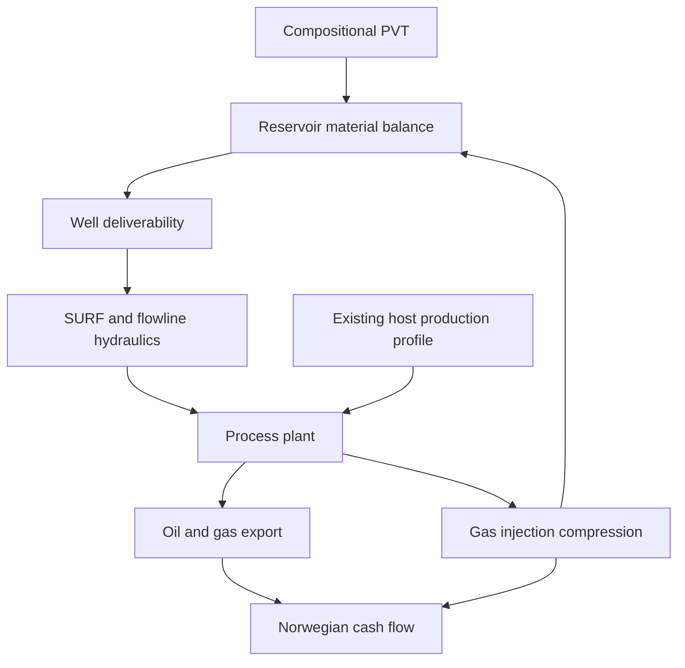

# Integrated Field Lifecycle Simulation

The `neqsim.process.fielddevelopment.lifecycle` package connects NeqSim's detailed engineering models on one time
axis. It is intended for comparing field-development concepts consistently, rather than estimating production and
economics in disconnected spreadsheets.



## What is solved at each time step

1. Well deliverability is calculated from producer count, productivity index, reservoir pressure and minimum BHP.
2. A normal NeqSim `ProcessSystem` solves the new-field wells and SURF hydraulics at the live PVT state. A hydraulic
   pressure failure terminates the producing life as an explicit wells/SURF limit.
3. `FacilityCapacityAllocator` applies oil, gas, water and total-liquid nameplate limits. Brownfield allocation delegates
   to the canonical `tieback.capacity` API and its `CapacityAllocationPolicy`.
4. Existing-host and admitted new-field streams are mixed in the detailed shared process. Mechanical-design equipment
   constraints, facility power, and the annual primary bottleneck are evaluated after every solve.
5. Produced gas is split between sale and injection, subject to compressor and injection-well capacity.
6. `SimpleReservoir.runTransient` removes only admitted new-field oil/water, adds injected gas and performs a
   constant-volume flash. Held-back production therefore remains in the reservoir for later years.
7. Power, emissions, utilization, host load, holdback, deferred production and annual product volumes are accumulated.
8. `CashFlowEngine("NO")` calculates Norwegian after-tax NPV, IRR, payback and break-even oil/gas price.

Construction CAPEX can precede first oil without incorrectly charging production OPEX: the lifecycle integration uses
`CashFlowEngine.setFixedOpexStartYear` to start fixed OPEX in the first production year.

The framework accepts any user-built `ProcessSystem`. The supplied `NorwegianOilFieldCase` is therefore a reference
assembly, not a fixed process template. Real well models, flowlines, risers, separators, compressor maps, water
treatment, export equipment, mechanical constraints and host feeds can be connected through `FieldLifecycleModel`.
Set a `FieldProductionPotentialProvider` on the model to replace the reference linear PI/water-cut potential with a
detailed well/network solve, an imported reservoir-simulator schedule, or a calibrated surrogate. The resulting rate
still passes through the live detailed SURF and facility process before reservoir material balance and economics are
advanced.

## Greenfield facility sizing

Attach a `FacilityLifecycleStrategy.greenfield(...)` to the lifecycle configuration. The simulator runs the detailed
process at the design case, calls `ProcessSystem.autoSizeEquipment(designMargin)`, registers
mechanical-design-derived constraints, and records:

- component nameplate capacities for oil, gas, water and total liquid;
- design power and power capacity;
- number of auto-sized equipment items and derived constraints;
- the design bottleneck and its single-train utilization;
- the equivalent capacity multiplier and parallel-train indication required where one train cannot pass the design
  case.

Component maxima do not need to occur simultaneously. Use explicit `nameplateCapacity(...)` for separate peak-oil,
peak-gas and peak-water design cases. The rates passed to `greenfield(...)` represent the physically simultaneous
process design case.

```java
FacilityLifecycleStrategy greenfield = FacilityLifecycleStrategy
    .greenfield("New FPSO", new FacilityProductionRate(23000.0, 4.5e6, 1000.0))
    .nameplateCapacity(new FacilityCapacity(26450.0, 5.5e6, 32000.0, 52000.0, 0.0))
    .designMargin(1.15)
    .autoSizeDetailedProcess(true)
    .build();
```

`FacilityDesignResult` is retained in the lifecycle result so the economic comparison is traceable to the installed
processing design.

## Brownfield host and tieback studies

Brownfield concepts reuse `HostFacility`, `ProductionProfileSeries`, `CapacityAllocationPolicy` and `HoldbackPolicy`
from `neqsim.process.fielddevelopment.tieback.capacity`. `FieldLifecycleModel` additionally exposes optional host oil,
gas and water feed streams. These streams must be connected to the actual shared host flowsheet upstream of the
constrained equipment.

This lifecycle layer reuses and complements the existing
[host tie-in capacity workflow](HOST_TIE_IN_CAPACITY.md); it adds the coupled reservoir, detailed process and economic
time march rather than defining a second allocation model.

```java
ProductionProfileSeries hostProfile = new ProductionProfileSeries("host")
    .addPeriod(2029, 3.2, 100636.0, 14000.0, 0.0)
    .addPeriod(2039, 1.4, 47173.0, 22000.0, 0.0);

FacilityLifecycleStrategy tieback = FacilityLifecycleStrategy
    .tieback("Existing host", hostFacility, hostProfile)
    .allocationPolicy(CapacityAllocationPolicy.BASE_FIRST)
    .holdbackPolicy(HoldbackPolicy.DEFER_TO_LATER_YEARS)
    .holdback(0.0, 0.10)
    .build();
```

Host points are linearly interpolated by calendar year. The configured allocation policy controls shared capacity:

| Policy | Lifecycle behavior |
|---|---|
| `BASE_FIRST` | Preserve existing-host production and allocate remaining capacity to the new field |
| `SATELLITE_FIRST` | Accelerate the new field before existing-host production |
| `PRO_RATA` | Scale host and new-field requests by a common capacity factor |
| `VALUE_WEIGHTED` | Use the canonical tie-in planner's value-priority behavior |

Planned host and satellite holdback fractions are applied before capacity allocation. `DEFER_TO_LATER_YEARS` is
physically represented by not removing constrained new-field fluids from the reservoir; the retained reserves can be
produced when the host declines and ullage opens. `capacityFromYear(...)` can represent a debottleneck project or a
later host-capacity change, with the associated CAPEX entered in `FieldLifecycleConfiguration`.

For an existing real facility, set `autoSizeDetailedProcess(false)` and supply the equipment's actual design limits or
capacity constraints. For a new facility, enable auto-sizing. Do not auto-size a brownfield host unless the study is
explicitly designing replacement or parallel equipment.

## Run the representative Norwegian case

```java
import org.apache.logging.log4j.LogManager;
import org.apache.logging.log4j.Logger;
import neqsim.process.fielddevelopment.lifecycle.FieldLifecycleConcept;
import neqsim.process.fielddevelopment.lifecycle.FieldLifecycleEvaluator;
import neqsim.process.fielddevelopment.lifecycle.FieldLifecycleResult;
import neqsim.process.fielddevelopment.lifecycle.NorwegianOilFieldCase;

Logger logger = LogManager.getLogger("field-lifecycle-example");

FieldLifecycleConcept gasInjection = NorwegianOilFieldCase.createGasInjectionCase();
FieldLifecycleResult result = new FieldLifecycleEvaluator().evaluate(gasInjection);

logger.info("After-tax NPV: {} MUSD", result.getNpvMusd());
logger.info("Break-even oil price: {} USD/bbl", result.getBreakevenOilPriceUsdPerBbl());
logger.info("Cumulative oil: {} MSm3", result.getCumulativeOilSm3() / 1.0e6);
logger.info("Gas injected: {} GSm3", result.getCumulativeGasInjectedSm3() / 1.0e9);
```

The synthetic reference case represents six subsea producers and three gas injectors tied to an FPSO in 300 m water
depth. It uses PR-EOS with defined heavy fractions, a gas-cap/oil/water tank, aggregate multiphase tubing and flowline,
HP/LP separation, oil export pumping, gas export and two-stage gas-injection compression. Well and SURF costs use
`WellCostEstimator` and `SURFCostEstimator`; topsides and project costs are Class-4 parametric allowances.

## Compare concepts

Every alternative must own an independent mutable reservoir/process model. The factory methods create independent
instances:

```java
import java.util.Arrays;
import java.util.List;
import neqsim.process.fielddevelopment.lifecycle.FieldLifecycleEvaluator;
import neqsim.process.fielddevelopment.lifecycle.FieldLifecycleResult;
import neqsim.process.fielddevelopment.lifecycle.NorwegianOilFieldCase;

FieldLifecycleEvaluator evaluator = new FieldLifecycleEvaluator();
List<FieldLifecycleResult> ranked = evaluator.evaluateAll(Arrays.asList(
    NorwegianOilFieldCase.createGasInjectionCase(),
    NorwegianOilFieldCase.createNaturalDepletionCase(),
    NorwegianOilFieldCase.createHostPriorityTiebackCase(),
    NorwegianOilFieldCase.createManagedTiebackCase()));

String comparison = evaluator.toMarkdownTable(ranked);
```

The reference portfolio gives the following reproducible screening result at the documented assumptions:

| Concept | NPV (MUSD) | IRR (%) | Oil break-even (USD/bbl) | Oil (MSm3) | Deferred oil (MSm3) | Peak utilization (%) |
|---|---:|---:|---:|---:|---:|---:|
| New FPSO with gas injection | -388 | 5.6 | 88.7 | 25.0 | 2.5 | 97.9 |
| New FPSO, natural depletion | -959 | 1.2 | 108.4 | 16.6 | 1.2 | 94.7 |
| Tieback, host priority | 247 | 11.9 | 58.9 | 16.3 | 13.6 | 100.0 |
| Tieback, managed allocation | 335 | 14.0 | 53.0 | 16.6 | 6.6 | 100.0 |

These are synthetic concept-screening results, not data for a named field. Their purpose is to show how facility
design and host-allocation choices change production timing and project economics on a consistent basis.

Use `NorwegianOilFieldCase.createDevelopmentPortfolio()` for the same four concepts or
`createCase(name, recycleFraction, maximumInjectionRate)` for recycling/compression sensitivities. For larger
changes—well count, flowline size, separation pressure, host process or tie-in location—assemble a new
`FieldLifecycleModel` with the relevant NeqSim equipment and retain a common economic basis.

Each annual result exposes potential and requested new-field oil rate, admitted host oil/gas/water, deliberate
holdback, capacity-deferred oil, maximum utilization and primary bottleneck. The top-level result exposes cumulative
deferred oil and peak facility utilization. These fields allow reviewers to distinguish subsurface decline, planned
rate shaping, host ullage, and a physical equipment limit.

## Engineering methods and fidelity

| Area | Reference implementation | Method and intended fidelity |
|---|---|---|
| PVT | `SystemPrEos` | Compositional cubic EOS with defined C7-C21+ fractions |
| Reservoir | `SimpleReservoir` | Constant-volume tank material balance with compositional injection; screening/concept |
| Wells | `FieldLifecycleConfiguration` and `InjectionWellModel` | Linear oil PI/drawdown; radial Darcy injectivity and fracture-pressure limit |
| Tubing/flowlines | `PipeBeggsAndBrills` | Steady-state multiphase Beggs-Brill hydraulics |
| Process plant | `ProcessSystem` equipment | Rigorous flashes, three-phase separators, pumps, compressors and coolers |
| Greenfield sizing | `autoSizeEquipment`, mechanical design constraints | Equipment sizing at a simultaneous design case plus component nameplate envelopes |
| Brownfield allocation | `tieback.capacity` and `HostFacility` | Calendar-year host profile, canonical allocation/holdback policies and shared ullage |
| Bottlenecking | `ProcessSystem.getBottleneck()` | Annual nameplate, power and detailed equipment utilization after the combined process solve |
| SURF/well CAPEX | `SURFCostEstimator`, `WellCostEstimator` | NCS benchmark correlations, Class-4 concept estimate |
| Economics | `CashFlowEngine("NO")` | Norwegian corporate/petroleum tax, depreciation, uplift, NPV/IRR and break-even |

The reference reservoir has no spatial grid. Sweep efficiency, coning, compositional fronts, well interference and
history matching require a reservoir simulator or calibrated surrogate. At FEED fidelity, replace the tank rate/pressure
state with imported reservoir schedules while retaining the same surface process, constraint and economics interfaces.

## Main API

| Class | Purpose |
|---|---|
| `FieldLifecycleConfiguration` | Shared production, capacity, injection, emissions and economic assumptions |
| `FacilityLifecycleStrategy` | Greenfield sizing or brownfield host/profile/allocation/holdback strategy |
| `FacilityCapacity` | Oil, gas, water, liquid and power nameplate envelope, including scheduled upgrades |
| `FacilityCapacityAllocator` | Lifecycle adapter to canonical tie-in capacity allocation |
| `FacilityDesignResult` | Installed sizing basis, detailed constraints, power and parallel-train indication |
| `FieldProductionPotentialProvider` | Pluggable detailed wells/network, reservoir schedule or surrogate potential |
| `FieldLifecycleModel` | Explicit connection points between reservoir, process, export and injection streams |
| `FieldLifecycleConcept` | Links the existing `FieldConcept` design basis to an executable model |
| `FieldLifecycleSimulator` | Time-marches process and reservoir state and creates annual profiles |
| `FieldLifecycleResult` | Annual profiles plus NPV, IRR, payback, break-even, energy and CO2 |
| `FieldLifecycleEvaluator` | Runs and ranks alternative concepts by NPV |
| `NorwegianOilFieldCase` | Repeatable synthetic NCS oil/gas-injection reference case |

## Recommended concept workflow

Start with `ConceptEvaluator` for rapid multi-concept screening. Promote the promising options to
`FieldLifecycleConcept` models, run the physically coupled lifetime comparison, and then replace uncertain screening
assumptions with PVT studies, well tests, reservoir schedules and equipment design results as the project matures.
