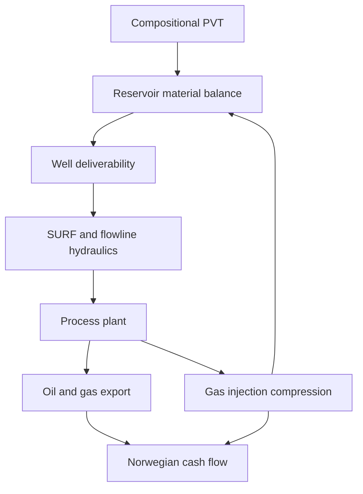

# Integrated Field Lifecycle Simulation

The `neqsim.process.fielddevelopment.lifecycle` package connects NeqSim's detailed engineering models on one time
axis. It is intended for comparing field-development concepts consistently, rather than estimating production and
economics in disconnected spreadsheets.



## What is solved at each time step

1. Well deliverability is calculated from producer count, productivity index, reservoir pressure and minimum BHP.
2. Oil rate is constrained by plateau, total-liquid, gas-compression and produced-water capacities.
3. A normal NeqSim `ProcessSystem` solves well/SURF hydraulics, separation, compression and export at the live PVT
   state.
4. Produced gas is split between sale and injection, subject to compressor and injection-well capacity.
5. `SimpleReservoir.runTransient` removes produced oil/water, adds injected gas and performs a constant-volume flash.
6. Power, emissions and annual product volumes are accumulated.
7. `CashFlowEngine("NO")` calculates Norwegian after-tax NPV, IRR, payback and break-even oil/gas price.

Construction CAPEX can precede first oil without incorrectly charging production OPEX: the lifecycle integration uses
`CashFlowEngine.setFixedOpexStartYear` to start fixed OPEX in the first production year.

The framework accepts any user-built `ProcessSystem`. The supplied `NorwegianOilFieldCase` is therefore a reference
assembly, not a fixed process template.

## Run the representative Norwegian case

```java
import org.apache.logging.log4j.LogManager;
import org.apache.logging.log4j.Logger;
import neqsim.process.fielddevelopment.lifecycle.FieldLifecycleConcept;
import neqsim.process.fielddevelopment.lifecycle.FieldLifecycleEvaluator;
import neqsim.process.fielddevelopment.lifecycle.FieldLifecycleResult;
import neqsim.process.fielddevelopment.lifecycle.NorwegianOilFieldCase;

Logger logger = LogManager.getLogger("field-lifecycle-example");

FieldLifecycleConcept gasInjection = NorwegianOilFieldCase.createGasInjectionCase();
FieldLifecycleResult result = new FieldLifecycleEvaluator().evaluate(gasInjection);

logger.info("After-tax NPV: {} MUSD", result.getNpvMusd());
logger.info("Break-even oil price: {} USD/bbl", result.getBreakevenOilPriceUsdPerBbl());
logger.info("Cumulative oil: {} MSm3", result.getCumulativeOilSm3() / 1.0e6);
logger.info("Gas injected: {} GSm3", result.getCumulativeGasInjectedSm3() / 1.0e9);
```

The synthetic reference case represents six subsea producers and three gas injectors tied to an FPSO in 300 m water
depth. It uses PR-EOS with defined heavy fractions, a gas-cap/oil/water tank, aggregate multiphase tubing and flowline,
HP/LP separation, oil export pumping, gas export and two-stage gas-injection compression. Well and SURF costs use
`WellCostEstimator` and `SURFCostEstimator`; topsides and project costs are Class-4 parametric allowances.

## Compare concepts

Every alternative must own an independent mutable reservoir/process model. The factory methods create independent
instances:

```java
import java.util.Arrays;
import java.util.List;
import neqsim.process.fielddevelopment.lifecycle.FieldLifecycleEvaluator;
import neqsim.process.fielddevelopment.lifecycle.FieldLifecycleResult;
import neqsim.process.fielddevelopment.lifecycle.NorwegianOilFieldCase;

FieldLifecycleEvaluator evaluator = new FieldLifecycleEvaluator();
List<FieldLifecycleResult> ranked = evaluator.evaluateAll(Arrays.asList(
    NorwegianOilFieldCase.createGasInjectionCase(),
    NorwegianOilFieldCase.createNaturalDepletionCase()));

String comparison = evaluator.toMarkdownTable(ranked);
```

Use `NorwegianOilFieldCase.createCase(name, recycleFraction, maximumInjectionRate)` for recycling/compression
sensitivities. For larger changes—well count, flowline size, separation pressure or host concept—assemble a new
`FieldLifecycleModel` with the relevant NeqSim equipment and retain a common `FieldLifecycleConfiguration` basis.

## Engineering methods and fidelity

| Area | Reference implementation | Method and intended fidelity |
|---|---|---|
| PVT | `SystemPrEos` | Compositional cubic EOS with defined C7-C21+ fractions |
| Reservoir | `SimpleReservoir` | Constant-volume tank material balance with compositional injection; screening/concept |
| Wells | `FieldLifecycleConfiguration` and `InjectionWellModel` | Linear oil PI/drawdown; radial Darcy injectivity and fracture-pressure limit |
| Tubing/flowlines | `PipeBeggsAndBrills` | Steady-state multiphase Beggs-Brill hydraulics |
| Process plant | `ProcessSystem` equipment | Rigorous flashes, three-phase separators, pumps, compressors and coolers |
| SURF/well CAPEX | `SURFCostEstimator`, `WellCostEstimator` | NCS benchmark correlations, Class-4 concept estimate |
| Economics | `CashFlowEngine("NO")` | Norwegian corporate/petroleum tax, depreciation, uplift, NPV/IRR and break-even |

The reference reservoir has no spatial grid. Sweep efficiency, coning, compositional fronts, well interference and
history matching require a reservoir simulator or calibrated surrogate. At FEED fidelity, replace the tank rate/pressure
state with imported reservoir schedules while retaining the same surface process, constraint and economics interfaces.

## Main API

| Class | Purpose |
|---|---|
| `FieldLifecycleConfiguration` | Shared production, capacity, injection, emissions and economic assumptions |
| `FieldLifecycleModel` | Explicit connection points between reservoir, process, export and injection streams |
| `FieldLifecycleConcept` | Links the existing `FieldConcept` design basis to an executable model |
| `FieldLifecycleSimulator` | Time-marches process and reservoir state and creates annual profiles |
| `FieldLifecycleResult` | Annual profiles plus NPV, IRR, payback, break-even, energy and CO2 |
| `FieldLifecycleEvaluator` | Runs and ranks alternative concepts by NPV |
| `NorwegianOilFieldCase` | Repeatable synthetic NCS oil/gas-injection reference case |

## Recommended concept workflow

Start with `ConceptEvaluator` for rapid multi-concept screening. Promote the promising options to
`FieldLifecycleConcept` models, run the physically coupled lifetime comparison, and then replace uncertain screening
assumptions with PVT studies, well tests, reservoir schedules and equipment design results as the project matures.
