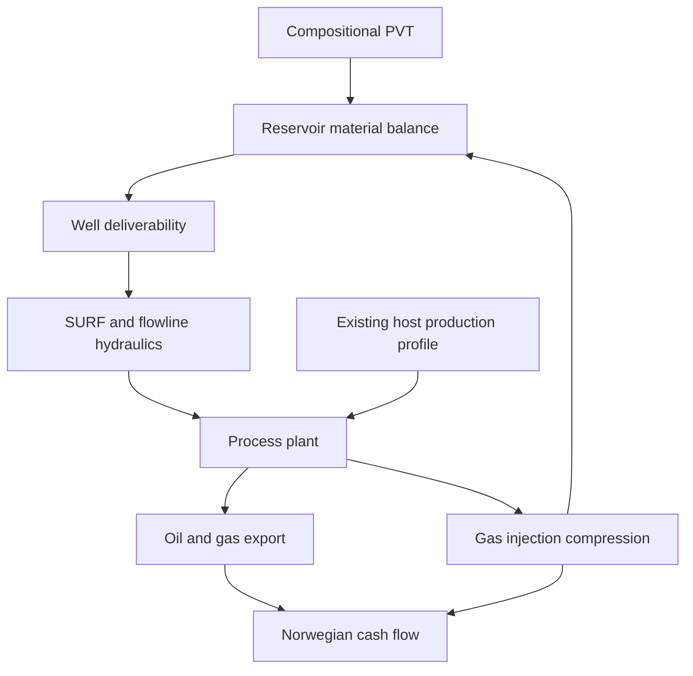

# Integrated Field Lifecycle Simulation

The `neqsim.process.fielddevelopment.lifecycle` package connects NeqSim's detailed engineering models on one time
axis. It is intended for comparing field-development concepts consistently, rather than estimating production and
economics in disconnected spreadsheets.



## What is solved at each time step

1. Well deliverability is calculated from producer count, productivity index, reservoir pressure and minimum BHP.
2. A NeqSim `ProcessSystem` or complete multi-area `ProcessModel` solves the new-field wells, shared SURF and host
   hydraulics at the live PVT state. A hydraulic pressure failure terminates the producing life as an explicit
   wells/SURF limit.
3. `FacilityCapacityAllocator` applies oil, gas, water and total-liquid nameplate limits. Brownfield allocation delegates
   to the canonical `tieback.capacity` API and its `CapacityAllocationPolicy`.
4. Existing-host and admitted new-field streams are mixed in the detailed shared process. Mechanical-design equipment
   constraints, facility power, and the annual primary bottleneck are evaluated after every solve.
5. Produced gas is split between sale and injection, subject to compressor and injection-well capacity.
6. `SimpleReservoir.runTransient` removes only admitted new-field oil/water, adds injected gas and performs a
   constant-volume flash. Held-back production therefore remains in the reservoir for later years.
7. Export gas, stabilized oil and treated-water discharge are checked against their configured specifications.
8. Power, emissions, utilization, host load, holdback, deferred production and annual product volumes are accumulated.
9. `CashFlowEngine("NO")` calculates Norwegian after-tax NPV, IRR, payback and break-even oil/gas price.

Construction CAPEX can precede first oil without incorrectly charging production OPEX: the lifecycle integration uses
`CashFlowEngine.setFixedOpexStartYear` to start fixed OPEX in the first production year.

The framework accepts any user-built `ProcessSystem` or multi-area `ProcessModel`. The supplied
`NorwegianOilFieldCase` is therefore a reference assembly, not a fixed process template. Real well models, flowlines,
risers, separators, compressor maps, water treatment, export equipment, mechanical constraints and host feeds can be
connected through `FieldLifecycleModel`.
Set a `FieldProductionPotentialProvider` on the model to replace the reference linear PI/water-cut potential with a
detailed well/network solve, an imported reservoir-simulator schedule, or a calibrated surrogate. The resulting rate
still passes through the live detailed SURF and facility process before reservoir material balance and economics are
advanced.

### Use an existing process plant or shared SURF model

For a brownfield study, map lifecycle roles to the actual streams in the user's flowsheet. A single host process can be
supplied directly:

```java
FieldLifecycleModel hostModel = FieldLifecycleModel
    .existingFacility("Host A tie-in", reservoir, existingHostProcessSystem)
    .reservoirStreams(newFieldOil, newFieldWater, injectionWellFeed)
    .gasHandling(recoveredGas, exportInjectionSplitter, compressedInjectionGas)
    .exportStreams(stabilizedOil, salesGas)
    .hostFeeds(existingOilFeed, existingGasFeed, existingWaterFeed)
    .treatedWaterDischarge(treatedWater)
    .build();
```

Large real models can remain divided into areas. Supplying a `ProcessModel` causes the lifecycle engine to execute the
complete model and aggregate power, automatic sizing, mechanical constraints and bottlenecks across every area:

```java
ProcessModel infrastructure = new ProcessModel();
infrastructure.add("shared SURF", existingSurfProcess);
infrastructure.add("host topsides", existingFacilityProcess);

FieldLifecycleModel hostAndSurf = FieldLifecycleModel
    .existingSurfAndFacility("Shared SURF route", reservoir, infrastructure,
        "shared SURF", "host topsides")
    .reservoirStreams(newFieldOil, newFieldWater, injectionWellFeed)
    .gasHandling(recoveredGas, exportInjectionSplitter, compressedInjectionGas)
    .exportStreams(stabilizedOil, salesGas)
    .hostFeeds(existingOilFeed, existingGasFeed, existingWaterFeed)
    .treatedWaterDischarge(treatedWater)
    .build();
```

The process areas must already be connected by shared NeqSim streams. Place the new-field producer streams and the
existing-asset feeds at the intended subsea tie-in nodes. Their actual position determines whether a shared flowline,
pipeline, riser or topsides unit sees each load. Model-wide bottlenecks are reported as `area::equipment`, so a shared
SURF restriction remains distinguishable from a facility restriction. The overload accepting separate existing SURF
and facility `ProcessSystem` objects assembles the same two-area `ProcessModel` automatically.

## Greenfield facility sizing

Attach a `FacilityLifecycleStrategy.greenfield(...)` to the lifecycle configuration. The simulator runs the detailed
process at the design case, calls `autoSizeEquipment(designMargin)` on the supplied `ProcessSystem` or complete
`ProcessModel`, registers
mechanical-design-derived constraints, and records:

- component nameplate capacities for oil, gas, water and total liquid;
- design power and power capacity;
- number of auto-sized equipment items and derived constraints;
- the design bottleneck and its single-train utilization;
- the equivalent capacity multiplier and parallel-train indication required where one train cannot pass the design
  case.

Component maxima do not need to occur simultaneously. Use explicit `nameplateCapacity(...)` for separate peak-oil,
peak-gas and peak-water design cases. The rates passed to `greenfield(...)` represent the physically simultaneous
process design case.

```java
FacilityLifecycleStrategy greenfield = FacilityLifecycleStrategy
    .greenfield("New FPSO", new FacilityProductionRate(23000.0, 4.5e6, 1000.0))
    .nameplateCapacity(new FacilityCapacity(26450.0, 5.5e6, 32000.0, 52000.0, 0.0))
    .designMargin(1.15)
    .autoSizeDetailedProcess(true)
    .build();
```

`FacilityDesignResult` is retained in the lifecycle result so the economic comparison is traceable to the installed
processing design.

## Brownfield host and tieback studies

Brownfield concepts reuse `HostFacility`, `ProductionProfileSeries`, `CapacityAllocationPolicy` and `HoldbackPolicy`
from `neqsim.process.fielddevelopment.tieback.capacity`. `FieldLifecycleModel` additionally exposes optional host oil,
gas and water feed streams. These streams must be connected to the actual shared host flowsheet upstream of the
constrained equipment.

This lifecycle layer reuses and complements the existing
[host tie-in capacity workflow](HOST_TIE_IN_CAPACITY.md); it adds the coupled reservoir, detailed process and economic
time march rather than defining a second allocation model.

```java
ProductionProfileSeries hostProfile = new ProductionProfileSeries("host")
    .addPeriod(2029, 3.2, 100636.0, 14000.0, 0.0)
    .addPeriod(2039, 1.4, 47173.0, 22000.0, 0.0);

FacilityLifecycleStrategy tieback = FacilityLifecycleStrategy
    .tieback("Existing host", hostFacility, hostProfile)
    .allocationPolicy(CapacityAllocationPolicy.BASE_FIRST)
    .holdbackPolicy(HoldbackPolicy.DEFER_TO_LATER_YEARS)
    .holdback(0.0, 0.10)
    .build();
```

Host points are linearly interpolated by calendar year. The configured allocation policy controls shared capacity:

| Policy | Lifecycle behavior |
|---|---|
| `BASE_FIRST` | Preserve existing-host production and allocate remaining capacity to the new field |
| `SATELLITE_FIRST` | Accelerate the new field before existing-host production |
| `PRO_RATA` | Scale host and new-field requests by a common capacity factor |
| `VALUE_WEIGHTED` | Use the canonical tie-in planner's value-priority behavior |

Planned host and satellite holdback fractions are applied before capacity allocation. `DEFER_TO_LATER_YEARS` is
physically represented by not removing constrained new-field fluids from the reservoir; the retained reserves can be
produced when the host declines and ullage opens. `capacityFromYear(...)` can represent a debottleneck project or a
later host-capacity change, with the associated CAPEX entered in `FieldLifecycleConfiguration`.

For an existing real facility or SURF route, set `autoSizeDetailedProcess(false)` and supply the equipment's actual
design limits or capacity constraints. For a new facility, enable auto-sizing. Do not auto-size brownfield equipment
unless the study is explicitly designing its replacement, rerating or a parallel train.

### Bottlenecks and modification plans

Each annual result retains both admitted operating utilization and requested utilization before nameplate or
detailed-equipment rate reduction. This avoids hiding a severe constraint behind a 100% capped operating point.
`FacilityModificationPlanner` groups the evidence by first required year and bottleneck, relates it to deferred oil,
and suggests a screening scope:

```java
FieldLifecycleResult result = new FieldLifecycleEvaluator().evaluate(tiebackConcept);
FacilityModificationPlan plan = new FacilityModificationPlanner().analyse(result, 0.90);
String modificationTable = plan.toMarkdownTable();
```

Suggestions cover shared SURF rerating/looping/alternate routes, additional separation or water-treatment trains,
compression, export and power modifications. The calculated capacity multiplier is a screening target. Implement and
cost each candidate in a cloned detailed `ProcessSystem` or `ProcessModel`, rerun its complete lifecycle, and compare
that executable modified concept with the unmodified and greenfield alternatives.

## Product and discharge specifications

`FieldProductSpecifications` makes quality part of the executable concept rather than a post-processing note. The
default evaluator uses live NeqSim streams and established functionality:

- gas CO2 and H2S are read from the export-gas phase composition;
- gas oxygen is read from composition, while gross calorific value, superior Wobbe index and relative density use
  `Standard_ISO6976_2016` at 15 C volume and 25 C combustion reference conditions;
- water and hydrocarbon dew points use `WaterDewPointAnalyser` and `HydrocarbonDewPointAnalyser` at the contractual
  reference pressure;
- stabilized-oil RVP uses the stream ASTM D6377 calculation and BS&W uses `Standard_BSW`;
- oil in discharged water is measured from the treated-water stream or supplied by a detailed
  `ProducedWaterTreatmentTrain`/analyser through `FieldProductQualityProvider`.

```java
FieldProductSpecifications specifications = FieldProductSpecifications.builder()
    .gasComposition(2.5, 3.3)              // mol% CO2, ppm H2S
    .gasOxygen(0.0002)                     // mol% O2 (2 ppm)
    .gasDewPoints(70.0, -10.0, 0.0)        // bara, water-dew C, HC-dew C
    .gasEnergyContent(38.1, 43.7, 48.3, 52.8, 0.70) // GCV/Wobbe MJ/Sm3, relative density
    .oilExport(1.0, 0.5)                    // RVP bara, BS&W vol%
    .producedWater(30.0)                    // oil in water, mg/L
    .violationAction(FieldProductSpecifications.ViolationAction.REJECT_OPTION)
    .build();
```

The worst measurement and every violation are retained in each annual result. `REPORT_ONLY` keeps an option visible
for diagnostic studies; `REJECT_OPTION` makes it ineligible for an area-development recommendation. A custom provider
can read real online analysers, a produced-water compliance monitor, or another process-specific quality model.

Gas specifications are contract- and entry/exit-point-specific. The example is an illustrative teaching envelope, not
a universal Gassled specification. The current Gassled terms include point-specific pressure, temperature, dew point,
CO2, oxygen, sulphur, GCV, Wobbe-index and relative-density requirements. Some limits use mg/Nm3 and combine H2S with
COS; convert those to the configured unit basis or supply a contract-specific `FieldProductQualityProvider`. Always
verify values against the applicable [Gassco transport agreement](https://gassco.eu/en/shippers/transport-agreements/).

### Gas transport booking and tariffs

Physical gas-processing/export capacity and commercially booked transport capacity are separate constraints. Gassco's
current framework distinguishes booked entry, exit, processing and quality-service capacity, including firm and
interruptible bookings. For a concept study:

1. set the facility gas envelope to the tightest physical or firm-booked capacity;
2. use `capacityFromYear(...)` for a booking start, expiry or later capacity increase;
3. model interruptible capacity as a separate sensitivity rather than guaranteed base capacity;
4. enter the applicable throughput tariff with `FieldLifecycleConfiguration.Builder.tariffs(...)`; and
5. keep booking/capacity-fee commitments as explicit annual project OPEX assumptions.

This lets the annual allocator defer production when gas export is the binding constraint. It also prevents available
pipeline diameter from being mistaken for an awarded transport right. The official
[Gassco capacity-booking overview](https://gassco.eu/en/shippers/capacity-booking-and-reporting/) describes primary,
secondary and interruptible capacity processes.

## Area development across several assets

`AreaDevelopmentPortfolio` evaluates a discovery against any number of independently assembled host routes and
greenfield alternatives. Each host option owns its actual host production profile, nameplate envelope, detailed
flowsheet, tie-in/SURF route, modification CAPEX, tariffs and product specifications.

```java
AreaDevelopmentPortfolio portfolio = new AreaDevelopmentPortfolio("Northern area")
    .addOption(AreaDevelopmentOption.greenfield(
        "Standalone FPSO", "New area FPSO", greenfieldConcept))
    .addOption(AreaDevelopmentOption.tieback(
        "Tieback to Alpha", "Alpha platform", alphaHostConcept))
    .addOption(AreaDevelopmentOption.tieback(
        "Tieback to Bravo", "Bravo FPSO", bravoHostConcept));

AreaDevelopmentResult areaResult = new AreaDevelopmentEvaluator().evaluate(portfolio);
AreaDevelopmentResult.OptionResult recommended = areaResult.getRecommendedOption();
String areaComparison = areaResult.toMarkdownTable();
```

Options are ranked first by eligibility under the quality policy and then by after-tax NPV. The comparison preserves
route and receiving-asset identity alongside oil recovery, deferment, operating and requested capacity utilization,
break-even and off-spec years. Models cannot be shared between alternatives because reservoir and process state are
mutable.

## Run the representative Norwegian case

```java
import org.apache.logging.log4j.LogManager;
import org.apache.logging.log4j.Logger;
import neqsim.process.fielddevelopment.lifecycle.FieldLifecycleConcept;
import neqsim.process.fielddevelopment.lifecycle.FieldLifecycleEvaluator;
import neqsim.process.fielddevelopment.lifecycle.FieldLifecycleResult;
import neqsim.process.fielddevelopment.lifecycle.NorwegianOilFieldCase;

Logger logger = LogManager.getLogger("field-lifecycle-example");

FieldLifecycleConcept gasInjection = NorwegianOilFieldCase.createGasInjectionCase();
FieldLifecycleResult result = new FieldLifecycleEvaluator().evaluate(gasInjection);

logger.info("After-tax NPV: {} MUSD", result.getNpvMusd());
logger.info("Break-even oil price: {} USD/bbl", result.getBreakevenOilPriceUsdPerBbl());
logger.info("Cumulative oil: {} MSm3", result.getCumulativeOilSm3() / 1.0e6);
logger.info("Gas injected: {} GSm3", result.getCumulativeGasInjectedSm3() / 1.0e9);
```

The synthetic reference case represents six subsea producers and three gas injectors tied to an FPSO in 300 m water
depth. It uses PR-EOS with defined heavy fractions, a gas-cap/oil/water tank, aggregate multiphase tubing and flowline,
HP/LP separation, oil export pumping, gas export and two-stage gas-injection compression. Well and SURF costs use
`WellCostEstimator` and `SURFCostEstimator`; topsides and project costs are Class-4 parametric allowances.

## Compare concepts

Every alternative must own an independent mutable reservoir/process model. The factory methods create independent
instances:

```java
import java.util.Arrays;
import java.util.List;
import neqsim.process.fielddevelopment.lifecycle.FieldLifecycleEvaluator;
import neqsim.process.fielddevelopment.lifecycle.FieldLifecycleResult;
import neqsim.process.fielddevelopment.lifecycle.NorwegianOilFieldCase;

FieldLifecycleEvaluator evaluator = new FieldLifecycleEvaluator();
List<FieldLifecycleResult> ranked = evaluator.evaluateAll(Arrays.asList(
    NorwegianOilFieldCase.createGasInjectionCase(),
    NorwegianOilFieldCase.createNaturalDepletionCase(),
    NorwegianOilFieldCase.createHostPriorityTiebackCase(),
    NorwegianOilFieldCase.createManagedTiebackCase()));

String comparison = evaluator.toMarkdownTable(ranked);
```

The reference portfolio gives the following reproducible screening result at the documented assumptions:

| Concept | NPV (MUSD) | IRR (%) | Oil break-even (USD/bbl) | Oil (MSm3) | Deferred oil (MSm3) | Peak utilization (%) |
|---|---:|---:|---:|---:|---:|---:|
| New FPSO with gas injection | -281 | 6.2 | 85.3 | 25.1 | 0.2 | 97.2 |
| New FPSO, natural depletion | -959 | 1.2 | 108.4 | 16.6 | 1.2 | 94.7 |
| Tieback, host priority | 247 | 11.9 | 58.9 | 16.3 | 13.6 | 100.0 |
| Tieback, managed allocation | 335 | 14.0 | 53.0 | 16.6 | 6.6 | 100.0 |
| Tieback, remote host B | 193 | 10.8 | 62.7 | 16.5 | 7.1 | 100.0 |

These are synthetic concept-screening results, not data for a named field. Their purpose is to show how facility
design and host-allocation choices change production timing and project economics on a consistent basis.

Use `NorwegianOilFieldCase.createDevelopmentPortfolio()` for the same four concepts or
`createCase(name, recycleFraction, maximumInjectionRate)` for recycling/compression sensitivities. For larger
changes—well count, flowline size, separation pressure, host process or tie-in location—assemble a new
`FieldLifecycleModel` with the relevant NeqSim equipment and retain a common economic basis.

Each annual result exposes potential and requested new-field oil rate, admitted host oil/gas/water, deliberate
holdback, capacity-deferred oil, admitted utilization, requested utilization and both associated bottlenecks. The
top-level result exposes cumulative deferred oil, peak operating utilization and peak requested utilization. These
fields allow reviewers to distinguish subsurface decline, planned rate shaping, host ullage, shared SURF constraints,
and physical equipment limits.

Use `NorwegianOilFieldCase.createAreaDevelopmentPortfolio()` for a standalone facility, two distinct producing hosts,
and a managed-allocation variant assembled on the same synthetic basis.

## Engineering methods and fidelity

| Area | Reference implementation | Method and intended fidelity |
|---|---|---|
| PVT | `SystemPrEos` | Compositional cubic EOS with defined C7-C21+ fractions |
| Reservoir | `SimpleReservoir` | Constant-volume tank material balance with compositional injection; screening/concept |
| Wells | `FieldLifecycleConfiguration` and `InjectionWellModel` | Linear oil PI/drawdown; radial Darcy injectivity and fracture-pressure limit |
| Tubing/flowlines | `PipeBeggsAndBrills` | Steady-state multiphase Beggs-Brill hydraulics |
| Process plant | `ProcessSystem` / `ProcessModel` equipment | Rigorous flashes, three-phase separators, pumps, compressors and coolers in one or several process areas |
| Greenfield sizing | `autoSizeEquipment`, mechanical design constraints | Equipment sizing at a simultaneous design case plus component nameplate envelopes |
| Brownfield allocation | `tieback.capacity` and `HostFacility` | Calendar-year host profile, canonical allocation/holdback policies and shared ullage |
| Bottlenecking | `ProcessSystem` / `ProcessModel` bottleneck APIs | Annual nameplate, power, shared SURF and detailed equipment utilization after the combined process solve |
| Product quality | NeqSim dew-point analysers, ISO 6976, ASTM D6377 RVP, `Standard_BSW` | Annual gas/oil export and treated-water compliance |
| Area routing | `AreaDevelopmentPortfolio` | Independent multi-host and greenfield lifecycle alternatives ranked by eligibility and NPV |
| SURF/well CAPEX | `SURFCostEstimator`, `WellCostEstimator` | NCS benchmark correlations, Class-4 concept estimate |
| Economics | `CashFlowEngine("NO")` | Norwegian corporate/petroleum tax, depreciation, uplift, NPV/IRR and break-even |

The reference reservoir has no spatial grid. Sweep efficiency, coning, compositional fronts, well interference and
history matching require a reservoir simulator or calibrated surrogate. At FEED fidelity, replace the tank rate/pressure
state with imported reservoir schedules while retaining the same surface process, constraint and economics interfaces.

## Main API

| Class | Purpose |
|---|---|
| `FieldLifecycleConfiguration` | Shared production, capacity, injection, emissions and economic assumptions |
| `FacilityLifecycleStrategy` | Greenfield sizing or brownfield host/profile/allocation/holdback strategy |
| `FacilityCapacity` | Oil, gas, water, liquid and power nameplate envelope, including scheduled upgrades |
| `FacilityCapacityAllocator` | Lifecycle adapter to canonical tie-in capacity allocation |
| `FacilityDesignResult` | Installed sizing basis, detailed constraints, power and parallel-train indication |
| `FacilityModificationPlanner` / `FacilityModificationPlan` | Traceable annual debottleneck candidates and screening capacity targets |
| `FieldProductionPotentialProvider` | Pluggable detailed wells/network, reservoir schedule or surrogate potential |
| `FieldProductSpecifications` | Contractual gas/oil export and produced-water discharge limits |
| `ProductSpecificationEvaluator` | Live stream quality measurements and annual compliance result |
| `FieldProductQualityProvider` | Adapter for real process analysers and water-treatment models |
| `FieldLifecycleModel` | Explicit connection points between reservoir, process, export and injection streams |
| `FieldLifecycleConcept` | Links the existing `FieldConcept` design basis to an executable model |
| `FieldLifecycleSimulator` | Time-marches process and reservoir state and creates annual profiles |
| `FieldLifecycleResult` | Annual profiles plus NPV, IRR, payback, break-even, energy and CO2 |
| `FieldLifecycleEvaluator` | Runs and ranks alternative concepts by NPV |
| `AreaDevelopmentOption` / `AreaDevelopmentPortfolio` | Greenfield and multi-host route definitions |
| `AreaDevelopmentEvaluator` / `AreaDevelopmentResult` | Eligible area ranking and comparison table |
| `NorwegianOilFieldCase` | Repeatable synthetic NCS oil/gas-injection reference case |

## Recommended concept workflow

Start with `ConceptEvaluator` for rapid multi-concept screening. Promote the promising options to
`FieldLifecycleConcept` models, run the physically coupled lifetime comparison, and then replace uncertain screening
assumptions with PVT studies, well tests, reservoir schedules and equipment design results as the project matures.

The implementation follows the traceable building-block and computational workflow in *Field Development and
Operations: A Computational Approach with NeqSim - TPG4230 NTNU* (Solbraa et al., 1st ed., 2026), particularly the
separation of reservoir, wells, SURF, facility, export, schedule and economic evidence. The synthetic reference results
remain independent teaching assumptions and do not reproduce a named asset or confidential study.
