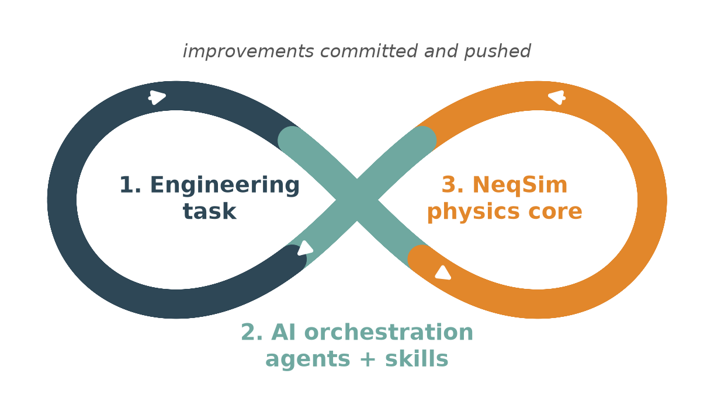

# Setting up NeqSim Agents and Skills

This is the canonical **start-here** page for using NeqSim agentic AI: install the
`neqsim` CLI, install the public **community agents and skills** into VS Code with
GitHub Copilot, and — for organizations — set up your own **private enterprise
agent and skill pages**.

Human review is always required for engineering conclusions. Agents help you
screen, organize, calculate, and draft — they do not replace engineering judgement.

---

## 1. How agents and skills fit together

```text
NeqSim core → core skills → community skills → (enterprise skills) → agents
```

- **Skills** are markdown files of reusable engineering methods (code patterns,
  design rules, correlations). They contain the engineering knowledge.
- **Agents** are role/workflow definitions that orchestrate skills. They declare
  the skills they need (`required_skills`) and are invoked from Copilot Chat.

| Layer | Repository | Access |
|-------|------------|--------|
| Library + CLI | [equinor/neqsim](https://github.com/equinor/neqsim) | Public |
| Community agents | [equinor/neqsim-community-agents](https://github.com/equinor/neqsim-community-agents) | Public |
| Community skills | [equinor/neqsim-community-skills](https://github.com/equinor/neqsim-community-skills) | Public |
| Enterprise agents/skills | your company's private repos | Private |

---

## 2. Prerequisites

- **GitHub account** and a **GitHub Copilot** subscription.
- **[Visual Studio Code](https://code.visualstudio.com/)** with the **GitHub Copilot**
  and **GitHub Copilot Chat** extensions (or use **GitHub Codespaces** in the browser).
- Local development also needs **[Git](https://git-scm.com/downloads)**,
  **[Python 3.8+](https://www.python.org/downloads/)** (add to PATH),
  and **[Java (JDK)](https://adoptium.net/)**. You do not need to install Maven
  separately because the repository includes the Maven Wrapper.

> **Tip:** activate a Python virtual environment before installing so the `neqsim`
> command lands on PATH.

---

## 3. Install the `neqsim` CLI

Windows (PowerShell):

```powershell
git clone https://github.com/equinor/neqsim.git
cd neqsim
py -3 -m venv .venv
.\.venv\Scripts\Activate.ps1   # activate FIRST so 'neqsim' lands on PATH
.\install.ps1                  # run from PowerShell so the command works in THIS window
```

macOS / Linux:

```bash
git clone https://github.com/equinor/neqsim.git && cd neqsim
python3 -m venv .venv && source .venv/bin/activate
./install.sh
```

Keep the virtual environment active and verify in the same terminal
(`--skip-jar` because the Java library is not built yet — without it the doctor
also requires a built JAR and fails on a fresh clone):

```powershell
neqsim --help
neqsim doctor --skip-jar
```

Optionally choose where the agents save solved tasks (otherwise they use
`<repo>/task_solve`):

```powershell
neqsim --set-task-root "D:\Engineering Tasks"   # or: cwd, to follow the terminal folder
neqsim --show-task-root
```

The setting lives in `~/.neqsim/task_defaults.json` and applies to every NeqSim
clone, so task folders can be kept outside the repository. `neqsim --reset-task-root`
removes it; existing tasks stay where they are.

Optionally point the report generator at your organisation's Word template so every
generated Word report carries the right styles, fonts, headers, and footers:

```powershell
neqsim --set-report-template "C:\Users\you\Documents\company report template.docx"
neqsim --show-report-template
```

It is stored in the same settings file and applies to every task from then on;
`neqsim --reset-report-template` returns to the built-in styling.

If `neqsim` is not found, use `python -m neqsim_cli --help` and see
[devtools/README.md](../../devtools/README.md#troubleshooting-neqsim-not-found).
If you installed outside a virtual environment, fully quit and reopen VS Code so
its captured PATH is refreshed.

> **Without administrator rights the console script often does not land on PATH.**
> That is not a failed install — replace `neqsim` with `python -m neqsim_cli`
> (`python3 -m neqsim_cli` on macOS/Linux) in **every** command on this page; the
> arguments are identical. Run it from the same environment you installed into,
> so each skill's Python package is installed for that interpreter.

---

## 4. Install the community agents into VS Code

The public community catalog requires no login. Select it explicitly so any
previously registered private catalogs cannot affect the public installation.

```powershell
neqsim agent install --all --source community --vscode --force
neqsim agent doctor --target vscode --source community
```

- `--all --source community` installs all public community agents; `--vscode`
  exports them into GitHub Copilot Chat; `--force` overwrites stale exports
  (safe to re-run after updates).
- Installing an agent **automatically installs the skills** it declares in
  `required_skills`.
- Installation is successful when both commands exit with code `0` and doctor
  reports `Result: PASS`. Do not verify against a fixed agent count because the
  catalog changes over time.

Browse or install individually:

```powershell
neqsim agent list                    # list community agents
neqsim skill list                    # list community skills
neqsim agent search hydrate          # search by name/tag/skill
neqsim agent install <name> --vscode # install one agent
neqsim skill install <name> --vscode # install one skill (standalone)
neqsim agent doctor --target vscode --source community # verify community exports
```

---

## 5. Use the agents

Open **Copilot Chat** in VS Code, type `@` to see installed agents, and describe
your task in plain language. Globally exported community examples include
`@pvt-agent`, `@process-engineer-agent`, `@flow-assurance-engineer-agent`, and
`@process-safety-agent`.

For agentic task-solving (task folders, notebooks, reports) see
[AGENTS.md](../../AGENTS.md) and
[docs/development/TASK_SOLVING_GUIDE.md](../development/TASK_SOLVING_GUIDE.md).
Workspace-local core agents such as `@solve-task` are available when this NeqSim
workspace is open; they are distinct from globally exported community agents.

### 5.1 Keep every repo and your task folder in one VS Code workspace

Agents are exported per user and work in any window, but the work is much easier
when NeqSim, the agent/skill repos, and your task folder are open together — then
Copilot Chat can read a skill, the agent definition, the NeqSim source, and the
task you are solving in one conversation, and you can commit an improvement back
to the right repo without leaving the window.

Clone the repos into one parent folder, open the first with **File → Open
Folder...**, add the others with **File → Add Folder to Workspace...**, then
**File → Save Workspace As...** → `neqsim-and-related-repos.code-workspace`.


Or write the workspace file yourself and open it:

```json
{
  "folders": [
    { "path": "neqsim" },
    { "path": "neqsim-community-agents" },
    { "path": "neqsim-community-skills" },
    { "name": "neqsim-task-solve", "path": "C:\\Users\\<user>\\neqsim-task-solve" }
  ],
  "settings": {}
}
```

**The task folder is deliberately not a clone** — task output (evidence,
notebooks, results, reports) must never be written into a code repository.
Register it once so every agent and every clone uses it, then add that same folder
to the workspace:

```powershell
neqsim --set-task-root "C:\Users\<user>\neqsim-task-solve"
neqsim --show-task-root
```

Relative paths in the workspace file resolve from the folder that holds it; the
task folder uses an absolute path because it lives outside the code folder. On
macOS use `/Users/<user>/...`. Only add folders you actually work in — unrelated
folders make agent answers noisier.

### 5.2 Push back what the task taught you

Every task is also a test of NeqSim, the agents, and the skills:



When a task needed a workaround or repeated trial and error that a class, agent,
or skill should have handled, fix it and **push it** — a fix that never leaves your
machine is lost. Java and tests go to `equinor/neqsim`; API recipes and gotchas go
to the skill's `SKILL.md`; routing and hand-off problems go to the `*.agent.md`.
Commit in the repo that owns the fix, then refresh with
`neqsim agent install --all --vscode --force`. Never push task output or
company-specific data into a code repo. Full workflow:
[TASK_SOLVING_GUIDE.md § Phase 6](../development/TASK_SOLVING_GUIDE.md#phase-6-push-the-improvements).

---

## 6. Set up your own private enterprise agents and skills

Companies keep proprietary methods, plant data, private tag names, internal URLs,
and project-specific design bases out of the public repos by building their own
**private enterprise agent and skill pages** on top of the public community
content. Engineers then register those private catalogs with the `neqsim` CLI
(browser SSO) and install community + enterprise together:

```powershell
neqsim agent private-init --repo <company>/<company>-neqsim-enterprise-agents --catalog-path enterprise-agents.yaml --login
neqsim skill private-init --repo <company>/<company>-neqsim-enterprise-skills --catalog-path enterprise-skills.yaml
neqsim agent install --all --vscode --force   # community + enterprise
```

> **If `neqsim` is not recognized** (common on locked-down machines without
> elevated privileges, where the console script does not land on PATH), replace
> `neqsim` with `python -m neqsim_cli` in every command — the arguments are
> identical:
>
> ```powershell
> python -m neqsim_cli agent private-init --repo <company>/<company>-neqsim-enterprise-agents --catalog-path enterprise-agents.yaml --login
> python -m neqsim_cli skill private-init --repo <company>/<company>-neqsim-enterprise-skills --catalog-path enterprise-skills.yaml
> python -m neqsim_cli agent install --all --vscode --force
> ```

A later refresh only re-installs what changed: a skill's Python package is
pip-installed again only when its `pyproject.toml` changed. Use
`--no-pip` to skip package installs completely and run
`neqsim skill sync-packages` (all at once) or `neqsim skill ensure <name>`
(on first use) afterwards.

Full company setup, catalog format, discovery, and governance:
**[Enterprise Agent and Skill Repositories](enterprise_agent_skill_repos.md)**.

---

## 7. Learn more

- [Skills Guide](skills_guide.md) — full skill authoring and install walkthrough
- [Enterprise Agent and Skill Repositories](enterprise_agent_skill_repos.md) — private company setup
- [VISION_AGENTS.md](../../VISION_AGENTS.md) — what belongs in core vs. community
- [.github/skills/README.md](../../.github/skills/README.md) — quick contribution guide
- [community-agents.yaml](../../community-agents.yaml) / [community-skills.yaml](../../community-skills.yaml) — the catalogs
