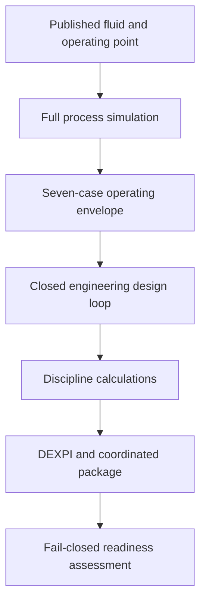

# Complete offshore process engineering study

The executable
[`complete_offshore_process_engineering_study.ipynb`](../../examples/notebooks/complete_offshore_process_engineering_study.ipynb)
applies NeqSim's process-to-engineering workflow to the complete process in the
[`comparesimulations.ipynb`](https://colab.research.google.com/github/EvenSol/NeqSim-Colab/blob/master/notebooks/process/comparesimulations.ipynb)
Colab example. This is intentionally a full facility study, not the smaller separator/compressor reference slice.

The study keeps the published PR-EOS fluid characterization and models:

- three-stage oil separation at 31.5, 8.0 and 1.5 barg;
- LP and MP gas recovery with scrubbers, liquid return and a recycle pump;
- first-stage export compression to 90 barg;
- interstage cooling and scrubbing;
- fuel-gas takeoff;
- gas/gas heat recovery, refrigeration and low-temperature liquid recovery;
- final export compression to 188.6 barg;
- stabilized-oil cooling and export pumping to 60 barg; and
- explicit 6 m recycle-pump and 15 m oil-export-pump static suction heads;
- explicit gas and oil export lines for hydraulic design.

All calculated outputs are preliminary and review-required. The notebook never converts synthetic assumptions into
HAZOP decisions, vendor guarantees, code design, or construction approval.

## What the study answers

| Engineering question | Notebook result |
| --- | --- |
| Does the reconstructed process match the source example? | A result-by-result benchmark for product rates, molecular weights, RVP/TVP, GCV, Wobbe index and total rotating power. |
| What are the normal heat and power loads? | Unit-tagged heater/cooler duties, compressor powers, pump power and compressor discharge temperatures. |
| Which process case governs each design? | Seven isolated steady cases and a governing-case reference on every closed-loop design variable. |
| Are the design selections internally converged? | Iteration history for applied updates, physical-variable change, process-value change and constraints. |
| What preliminary equipment is required? | Separator/scrubber geometry and inventory, compressor and pump ratings/margins, and exchanger duties/areas. |
| What piping, valves and instruments are indicated? | Export-line schedule candidates, velocities/pressure-drop constraints, Cv/opening and phenomena screens, calibrated ranges, uncertainty and response margins. |
| What abnormal cases must be handled? | Blocked outlet, cooling failure, compressor trip/settle-out, fire, oil-export blockage and simultaneous blowdown screens with API-orifice and common-load results. |
| What materials and mechanical work is indicated? | Degradation/material class screening and preliminary pressure-vessel thickness, mass, nozzle and footprint values. |
| What is delivered? | A coordinated graph, case matrix/envelope, registers, datasheets, calculation DAG, DEXPI 2.0 files, validation report and unresolved-action register. |
| What happens when the model changes? | Revision A and B packages, an idempotent and replayable change event, and a graph-derived impact register identify every deliverable that must be regenerated, recalculated, revalidated or reapproved. |
| Can an independent open-source consumer read the drawing? | PyDEXPI imports `plant-pydexpi.xml`, renders the full P&ID and records `IMPORT_AND_RENDER_PASSED`; the full SVG, four readable area-panel SVG/PNG pairs and import report are integrity-protected revision B artifacts. |
| Is the result approved for construction? | No. Readiness fails closed on missing independent, vendor, safety-lifecycle, detailed mechanical and authority evidence; `fitnessForConstruction=false`. |

## Published normal-case benchmark

These values are the source notebook outputs captured for regression comparison. The executable notebook computes the
same quantities with the current workspace classes and reports percentage deviation; it stops for review if any value
deviates by more than 10%.

| Result | Published value |
| --- | ---: |
| Gas export rate | 5,111.624 kmol/h |
| Oil export rate | 2,753.353 kmol/h |
| Export-gas molecular weight | 21.055 g/mol |
| Export-oil molecular weight | 202.298 g/mol |
| Export-oil RVP at 37.8 °C | 10.255 psia |
| Export-oil TVP | 1.726 bara |
| Export-gas GCV at 15/15 °C | 45.678 MJ/Sm3 |
| Export-gas Wobbe index at 15/15 °C | 53.491 MJ/Sm3 |
| Compressor plus oil-export-pump power | 10,376.1 kW |

The source normal case also gives the following equipment loads.

| Equipment | Result |
| --- | ---: |
| 20-HA-01 feed heating | +4,297.4 kW |
| 21-HA-01 oil export cooling | -5,343.3 kW |
| 23-HA-01 recompression cooling | -3,318.8 kW |
| 24-HA-01 export interstage cooling | -8,535.0 kW |
| 25-HA-01 gas/gas heat recovery | +1,885.2 kW |
| 23-KA-03 LP recompressor | 254.9 kW |
| 23-KA-02 MP recompressor | 750.0 kW |
| 23-KA-01 first export compressor | 5,335.9 kW |
| 27-KA-01 final export compressor | 2,947.4 kW |
| 21-PA-01 oil export pump | 1,088.0 kW |

The benchmark is not a replacement for validation against the original paper, laboratory characterization, or a
controlled commercial-simulator model. Its purpose is to make model drift visible.

## Study workflow



### 1. Process benchmark

The notebook reconstructs every unit and connection from the source example. It corrects the final gas-cooler pressure
basis to the gas-export pressure, then adds short terminal line objects without changing the product definition. It
also represents the missing vessel-to-pump elevation basis with 6 m and 15 m downhill suction segments. Those explicit
layout assumptions are required for the recycle- and oil-export-pump NPSH constraints; without static head, the
screening margins are -2.00 m and -7.99 m, respectively. The base calculation produces:

- a mass/product-quality table;
- a source-versus-current regression table;
- every major heater/cooler duty;
- rotating-equipment power and discharge temperature; and
- a visual utility and power-load balance.

### 2. Executable design cases

The closed design loop runs these steady process cases on isolated copies:

| Case | Rate | Feed temperature | HP-separator pressure | Principal purpose |
| --- | ---: | ---: | ---: | --- |
| Minimum turndown | 60% | 50 °C | 31.5 barg | Minimum-flow equipment and operability screen |
| Normal | 100% | 60 °C | 31.5 barg | Published benchmark |
| Maximum production | 120% | 60 °C | 31.5 barg | Capacity, driver and hydraulic screen |
| Cold feed | 100% | 40 °C | 31.5 barg | Heating-duty and low-temperature screen |
| Hot feed | 100% | 75 °C | 31.5 barg | Cooling-duty and temperature screen |
| High inlet pressure | 100% | 60 °C | 35.0 barg | HP mechanical and separator envelope |
| Low inlet pressure | 100% | 60 °C | 28.0 barg | Recompression-power envelope |

Startup, shutdown, compressor trip, settle-out, blocked outlet, fire and blowdown cannot be represented faithfully by
renaming a steady state. The notebook therefore keeps them in a separate accidental-case matrix and evaluates the
screening loads with `SafetyScenarioEngineCalculation`. A project implementation must add controlled dynamic scenarios
and coupled relief/blowdown/flare calculations for the selected events.

### 3. Closed engineering loop

The example explicitly configures, rather than hides, the calculation basis:

- Souders-Brown coefficient, retention time and liquid density;
- export-line velocity and pressure-gradient limits;
- compressor/pump driver candidates and margin;
- exchanger U-value, corrected LMTD, margin and area candidates;
- inventory working time and usable-volume fraction;
- valve Cv candidates; and
- instrument range and response inputs.

The loop sizes or rates every process family represented in the flowsheet. The result table retains the source module,
unit and governing case for each physical variable. The original process remains unchanged; the designed process is an
isolated result.

### 4. Discipline-wide results

The typed calculation section deliberately exposes screening assumptions that a vendor or accountable engineer must
replace:

- all eight separators/scrubbers: gas/liquid loads, density basis, diameter, length and retention;
- all four compressors: operating flow, provisional surge/choke boundaries, shaft power and driver screen;
- the continuously operating oil-export pump: closed-envelope power, driver and NPSH checks;
- the intermittent LP recycle pump: a separate flow/head/power/NPSH screen with visible 8 m NPSHA and 4 m NPSHR
  assumptions, because steady cases with negligible scrubber liquid are not a valid continuous NPSH basis;
- all eleven heaters/coolers/exchangers: governing duty and preliminary area;
- both export lines: NORSOK P-002 rule pack, schedule candidates and hydraulic constraints;
- both let-down valves: Cv, predicted opening, choked/flashing/cavitation/noise and actuator screens;
- six representative instruments: range coverage, uncertainty and total safety-response margin;
- six accidental scenarios: selected API orifice, inlet/backpressure checks, minimum temperature and concurrent flare load;
- every separator/scrubber: materials/degradation screen and preliminary mechanical design.

The scenario credibility reference is named `SCREENING-CREDIBILITY-ASSUMPTION-NOT-HAZOP-APPROVED` so it cannot be
mistaken for a real HAZOP record.

### 5. Coordinated package and readiness

`EngineeringDeliverableCompiler` produces the same controlled model in multiple discipline views, including:

- `engineering-model.json`, connectivity and calculation DAG;
- design-case matrix and governing envelope;
- equipment, line, instrument, valve, I/O, alarm/trip and PSV registers;
- utility, materials and unresolved-action reports;
- native DEXPI 2.0 plus internal semantic round-trip evidence; and
- structural, reference, unit and cross-artifact validation.

### 6. Revisioned model lifecycle and DEXPI impact

The notebook extends the same full process—not a second toy flowsheet—through a controlled A-to-B lifecycle:

1. compile revision A and verify its `NeqSimModelPackage` v1 identity and SHA-256 inventory;
2. add a review-required 125% debottleneck design case with source reference
   `DEBOTTLENECK-CHANGE-REQUEST-001`;
3. compile revision B against A's canonical graph and retain `engineering-revision-diff.json`;
4. convert that graph difference into a deterministic `ModelChangeEvent`;
5. publish it once, reject an idempotent duplicate, append it to a JSON-lines journal, reload and replay it;
6. run `GeneralizedImpactAnalyzer` and retain `impact-analysis.json`; and
7. refresh and validate revision B's outer package after adding event, impact and rendering evidence.

The generalized impact rules follow relationships in the existing engineering graph. For this change, the project node
is modified and every compiler document has a `GENERATED_FROM` relationship to it. Consequently
`plant.dexpi.xml`, `plant-proteus.xml`, `plant-pydexpi.xml` and
`engineering-dexpi-roundtrip-report.json` all receive both `REGENERATE` and `REVALIDATE` actions with an explicit
propagation path. The same mechanism reaches calculations, registers and approval records without embedding a fixed
list of DEXPI files in the analyzer.

### 7. Required PyDEXPI import and P&ID illustrations

Revision B's `plant-pydexpi.xml` is loaded directly with PyDEXPI's `ProteusSerializer`. The notebook requires a real
model diagram, renders it with `DrawDiagram`, retains the resulting genuine-symbol SVG and writes
`pydexpi-render-report.json` with status `IMPORT_AND_RENDER_PASSED`. Because the complete offshore train is much wider
than a notebook page, the same PyDEXPI SVG is also presented through four viewBox-only review panels: separation/oil
stabilization, LP/MP gas recovery, export compression/cooling, and LTS/fuel gas/export. The panel files do not redraw or
modify content; they retain every PyDEXPI symbol, tag, line and topology object and change only the visible viewport.
The SVG panels remain the governed vector evidence; CairoSVG 2.9.0 creates high-resolution PNG previews solely to keep
the committed notebook readable and substantially smaller than embedding five copies of the full SVG markup.

The workflow uses PyDEXPI 1.2.0 and CairoSVG 2.9.0 on Python 3.12 and fails CI if import, rendering, or any expected revision-B artifact is
missing. It uploads both complete model-package directories as workflow artifacts. The PyDEXPI report, rendered SVG,
four SVG/PNG panel pairs, change event, journal and impact register are written before `NeqSimModelPackage.write(...)` refreshes
the manifest. `ModelPackageValidator` therefore verifies their sizes and hashes together with the DEXPI XML and
engineering registers.

These are deliberately separate gates:

- native DEXPI 2.0 structure and NeqSim's internal semantic round trip;
- Proteus and namespace-free PyDEXPI exchange representations;
- independent PyDEXPI import and rendering; and
- named commercial-CAE import/round-trip evidence, which remains a project qualification action.

Rendering proves that a third-party consumer resolved the exported graphical model. It does not establish engineering
correctness, target-CAE fidelity, approval, or fitness for construction.

`EngineeringProductionReadinessAssessment` is then run without fabricated external evidence. A converged loop may reach
the `EXPERIMENTAL` maturity level, while the following remain failed gates until real evidence is supplied:

- independent method/version benchmarks and project qualification;
- a named target-CAE DEXPI round trip;
- accountable engineering approvals and immutable controlled documents;
- vendor guarantees;
- approved HAZOP, LOPA and SRS records;
- distributed transient piping evidence;
- compressor protection, startup/rundown and machinery evidence;
- final valve/instrument installation and response evidence;
- detailed mechanical-integrity evidence;
- flare radiation, dispersion, noise and tip-velocity evidence; and
- construction-authority evidence for the governing jurisdiction.

## How to run

From a NeqSim checkout, build the workspace classes and execute the notebook with the repository notebook tooling:

```bash
./mvnw -DskipTests package
python devtools/verify_notebooks.py examples/notebooks/complete_offshore_process_engineering_study.ipynb
```

The first code cell locates `NEQSIM_PROJECT_ROOT` and loads `target/classes` through
`devtools/neqsim_dev_setup.py`; it does not silently use an older installed JAR. The complete seven-case design loop is
computationally heavier than the original normal-case notebook and may take several minutes.

## Project adaptation checklist

Before using the study on a real project:

1. replace the fluid and TBP characterization with the controlled PVT basis and uncertainty;
2. replace screening operating ranges with the approved process design basis;
3. add water chemistry, H2S, chlorides, contaminants and hydrate/wax/scale constraints;
4. install controlled compressor and pump maps and vendor operating limits;
5. replace assumed exchanger U/LMTD values with utility and vendor thermal design;
6. connect the complete piping route, elevations, fittings, specification breaks and stress interfaces;
7. complete HAZOP/LOPA/SRS and approve scenario credibility, valve failure action and shutdown sequence;
8. run project-qualified two-phase relief, blowdown, flare-network and consequence methods;
9. complete materials/corrosion, pressure design, external loads, fatigue, buckling, nozzles, NDE and fabrication review;
10. qualify DEXPI exchange in the named CAE tool and attach immutable approval evidence.

Even after all receipts are structurally valid, NeqSim records them; it does not issue final engineering or construction
approval. `fitnessForConstruction` and `finalEngineeringApprovalGranted` remain false.
