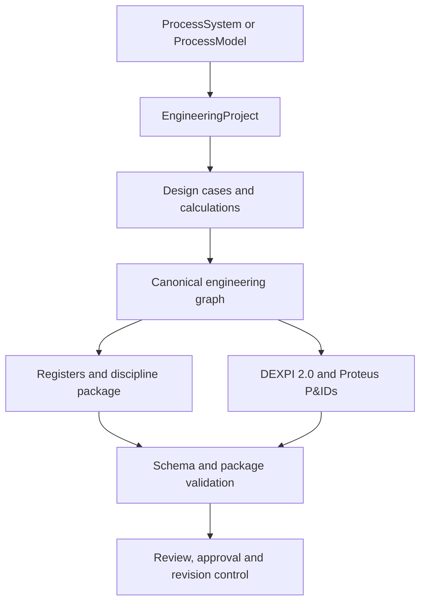
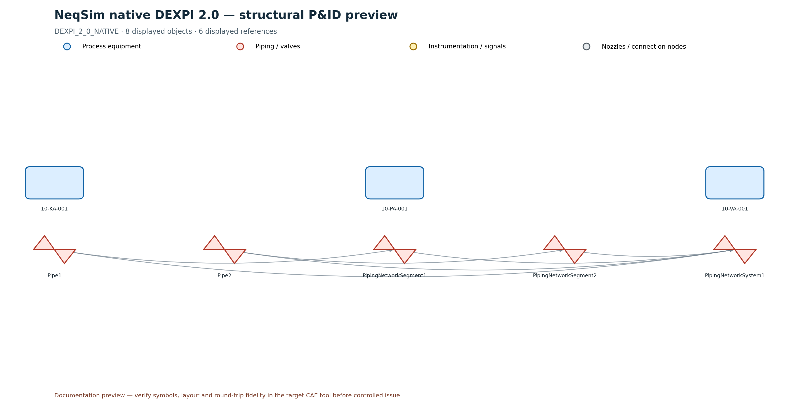

# Process model to governed engineering package

This guide explains the complete workflow from a converged NeqSim process simulation to a coordinated, validated
engineering package. The workflow is intended for concept selection, feasibility studies, pre-FEED and controlled
engineering automation. It is not a substitute for accountable discipline approval, vendor design or construction
issue. Generated artifacts remain explicitly not fit for construction until the project's controlled review and
approval process is complete.

The main entry point is `EngineeringDeliverableCompiler`. It combines the simulation, controlled engineering inputs,
design cases and standards references into one canonical graph and a set of mutually consistent deliverables.



## What is automated

NeqSim can automate the following work from simulation and controlled project inputs:

- stable equipment, stream, line, instrument, port, nozzle, boundary and document identities;
- physical, process-flow, signal-flow and dependency topology;
- operating points and multi-case governing design envelopes;
- standards-referenced calculation records and calculation dependencies;
- equipment, line and instrument registers;
- process, mechanical, piping, instrumentation/automation and process-safety handoffs;
- native DEXPI 2.0, Proteus 4.1.1 and pyDEXPI-compatible P&ID representations;
- internal DEXPI export/reimport identity and reference qualification;
- revision impact, accountable approval history and revalidation flags;
- bounded automation-study definitions with objectives, constraints and safe execution boundaries;
- JSON Schema, manifest inventory and cross-artifact validation.

The compiler intentionally does not invent HAZOP/LOPA conclusions, vendor limits, final SIL architecture, piping stress
acceptance, materials selection or construction approval. Missing controlled information remains visible as a finding,
readiness gap or `REVIEW_REQUIRED` state.

## 1. Build and converge the process model

Create a normal NeqSim `ProcessSystem`. Use stable engineering tags as unit names because these become external keys in
the canonical graph and exchange documents.

```java
SystemInterface fluid = new SystemSrkEos(303.15, 55.0);
fluid.addComponent("methane", 0.90);
fluid.addComponent("ethane", 0.07);
fluid.addComponent("propane", 0.03);
fluid.setMixingRule("classic");

Stream feed = new Stream("20-FEED-001", fluid);
feed.setFlowRate(0.50, "MSm3/day");
Separator separator = new Separator("20-VG-001", feed);
Compressor compressor = new Compressor("20-KA-001", separator.getGasOutStream());
compressor.setOutletPressure(100.0, "bara");

ProcessSystem process = new ProcessSystem("Gas compression and export");
process.add(feed);
process.add(separator);
process.add(compressor);
process.connect("20-FEED-001", "outlet", "20-VG-001", "inlet",
    ProcessConnection.ConnectionType.MATERIAL);
process.run();
```

Use explicit `ProcessConnection` records where possible. They give the engineering graph and P&ID exporter named
ports, material/signal/energy semantics and stronger topology validation than topology inferred only from stream object
references.

## 2. Create the governed engineering project

The NORSOK offshore builder adds a design basis, applicable standards and deterministic control/safeguarding proposals.
Set a persistent project ID and controlled revision.

```java
EngineeringProject project = NorsokOffshoreEngineeringBuilder
    .from("Gas compression engineering", process)
    .projectId("PROJECT-GAS-20")
    .registerProposedInstruments(true)
    .build()
    .setRevision("A");
```

The builder is a proposal engine. Generated requirements remain review-gated. Project-specific line-list rows, design
conditions, relief scenarios, materials data, trip bases and evidence references should be added before package issue.

## 3. Add executable design cases

Each design case runs on an isolated `ProcessSystem.copy()`. Cases can be required or optional, grouped, prioritized and
disabled without deleting their controlled definition.

```java
project.addDesignCase(new EngineeringDesignCase(
    "CASE-MAXIMUM", "Maximum production", EngineeringDesignCase.Type.MAXIMUM_PRODUCTION,
    candidate -> {
      Stream candidateFeed = (Stream) candidate.getUnit("20-FEED-001");
      candidateFeed.setPressure(75.0, "bara");
    })
    .setCaseGroup("OPERATING-ENVELOPE")
    .setPriority(20)
    .addEvidenceReference("PROCESS-DESIGN-BASIS-REV-A"));

project.addEngineeringMetric(
    EngineeringMetric.equipmentPressure("20-VG-001")
        .setAcceptanceRange(null, 70.0));
project.addEngineeringMetric(
    EngineeringMetric.equipmentInletMassFlow("20-VG-001"));
```

The design-case matrix distinguishes solver failures, isolated metric failures, skipped optional cases and acceptance
limit violations. A metric failure does not discard the other successfully evaluated metrics from that case.

## 4. Register standards-aware engineering calculations

Calculations form a directed acyclic graph. Explicit dependencies prevent a downstream review from being shown as
ready when an upstream basis is missing, blocked or failed.

```java
String separatorNode = EngineeringIds.nodeId(EngineeringNode.Kind.EQUIPMENT, "20-VG-001");

EngineeringCalculation reliefBasis = new EngineeringCalculation(
    "20-VG-001-RELIEF-BASIS", separatorNode, "Maximum credible relief pressure basis")
    .setStatus(EngineeringCalculation.Status.CALCULATED)
    .setResult(75.0, "bara")
    .setStandardsRequired(true)
    .addStandardReference(new EngineeringCalculation.StandardReference(
        "API 521", "2020", "4.4", "Credible overpressure scenario"))
    .addEvidenceReference("PROCESS-DESIGN-BASIS-REV-A");

EngineeringCalculation reliefReview = new EngineeringCalculation(
    "20-VG-001-RELIEF-REVIEW", separatorNode, "Relief protection review")
    .dependsOnCalculation("20-VG-001-RELIEF-BASIS")
    .setStandardsRequired(true)
    .addStandardReference(new EngineeringCalculation.StandardReference(
        "API 520 Part I", "2020", "5", "Device sizing and selection"));

project.addCalculation(reliefBasis).addCalculation(reliefReview);
```

Readiness includes `READY`, dependency-blocked, standards-blocked, explicitly blocked, failed and complete states.
Standards-required completed calculations without a controlled standards basis are package-validation errors.

## 5. Add accountable approvals

Approval records bind a discipline decision to a stable graph object. Approved or rejected decisions require the
reviewer, controlled review reference and effective date.

```java
project.addApprovalRecord(new EngineeringApprovalRecord(
    "APPROVAL-20-VG-001-PROCESS",
    separatorNode,
    "PROCESS",
    EngineeringApprovalRecord.Status.APPROVED,
    "Accountable Process Engineer",
    "PROCESS-DESIGN-REVIEW-001",
    "2026-07-16"));
```

A later record may call `.supersedes(previousRecordId)`. When a baseline graph is supplied, any effective approval whose
subject is revision-impacted becomes `REVALIDATION_REQUIRED`. The history is retained; no previous decision is silently
overwritten.

## 6. Define governed automation studies

Automation studies connect bounded variables to canonical graph nodes and process-model addresses. Objectives and
constraints reference design-case metrics.

```java
String feedNode = EngineeringIds.nodeId(EngineeringNode.Kind.LINE, "20-FEED-001");

project.addAutomationStudy(new EngineeringAutomationStudy(
    "STUDY-PRODUCTION-ENVELOPE", "Bounded production-envelope screening")
    .addDecisionVariable(new EngineeringAutomationStudy.DecisionVariable(
        "FEED-PRESSURE", feedNode, "20-FEED-001.pressure",
        45.0, 75.0, 55.0, "bara").setScreeningLevels(7))
    .addObjective(new EngineeringAutomationStudy.Objective(
        "MAXIMIZE-INLET-FLOW", "20-VG-001.inletMassFlow",
        EngineeringAutomationStudy.ObjectiveSense.MAXIMIZE, 1.0))
    .addConstraint(new EngineeringAutomationStudy.Constraint(
        "SEPARATOR-PRESSURE-LIMIT", "20-VG-001.pressure",
        null, 70.0, "bara",
        EngineeringAutomationStudy.ConstraintSeverity.HARD,
        "PROCESS-DESIGN-BASIS-REV-A")));
```

The output plan lists compatible NeqSim optimization/sensitivity engines and evaluates baseline constraint status. Its
execution boundary requires isolated process copies, forbids automatic plant change and requires review before a result
is adopted into the design.

## 7. Compile and validate the complete package

```java
Path output = Paths.get("build/engineering-package");
EngineeringDeliverableCompiler.CompilationResult compiled =
    EngineeringDeliverableCompiler.compile(project, output);

if (!compiled.getValidationReport().isValid()) {
  throw new IllegalStateException(compiled.getValidationReport().toJson());
}
```

To compare revisions, retain the previous canonical graph and pass it as the third argument:

```java
EngineeringGraph baseline = EngineeringGraph.read(
    Paths.get("controlled/revision-a/engineering-model.json"));
project.setRevision("B");
EngineeringDeliverableCompiler.compile(
    project, Paths.get("build/revision-b"), baseline);
```

## Deliverable inventory

| Artifact | Engineering purpose |
|---|---|
| `engineering-model.json` | Canonical typed graph, provenance and stable fingerprint |
| `engineering-connectivity.json` | Physical/process/signal/energy topology view |
| `engineering-calculation-dag.json` | Calculation order, dependencies, standards and readiness |
| `engineering-design-case-matrix.json` | Case/metric coverage, failures, limits and governing values |
| `design-case-envelope.json` | Compact governing-value handoff |
| `engineering-discipline-package.json` | Process, mechanical, piping, automation and safety review index |
| `equipment-register.json` | Simulation and governing equipment data |
| `line-register.json` | Controlled line-list data and hydraulic references |
| `instrument-register.json` | Instruments and generated engineering requirements |
| `engineering-approval-ledger.json` | Approval history, effective state and revision revalidation |
| `engineering-automation-plan.json` | Variables, objectives, constraints and safe execution boundary |
| `engineering-revision-diff.json` | Added, removed, modified and downstream-impacted graph objects |
| `plant.dexpi.xml` | Native schema/semantic-validated DEXPI 2.0 model |
| `plant-proteus.xml` | Graphical Proteus 4.1.1 P&ID handoff |
| `plant-pydexpi.xml` | Namespace-free Proteus representation for pyDEXPI |
| `engineering-dexpi-roundtrip-report.json` | Internal identity/reference export-reimport qualification |
| `interoperability-report.json` | Native, pyDEXPI and commercial-CAE qualification status |
| `engineering-manifest.json` | Design basis, requirements, standards and exchange inventory |
| `engineering-calculations.json` | Mechanical, PSV, blowdown/flare, SIL, materials and other studies |
| `cause-and-effect.json` | Proposed safeguarding cause/effect handoff |
| `engineering-schema-catalog.json` and `schemas/` | Versioned machine-readable contracts |
| `engineering-compiler-manifest.json` | Coordinated artifact inventory and graph fingerprint |
| `engineering-validation-report.json` | Structural, referential, unit and cross-artifact findings |

## DEXPI P&ID visualization

The preferred graphical path is `plant-pydexpi.xml` through pyDEXPI. NeqSim also includes a dependency-light renderer
for CI and documentation previews:

```bash
python examples/neqsim/render_engineering_pid.py \
  build/engineering-package/plant.dexpi.xml \
  --png build/engineering-package/pid-preview.png \
  --svg build/engineering-package/pid-preview.svg
```



The preview contracts hidden nozzle/connection nodes and visualizes resolved DEXPI references. It is useful for
topology review and automated documentation, but it is not evidence of symbol or layout fidelity in a commercial CAE
system. The package therefore keeps commercial qualification at `QUALIFICATION_REQUIRED` until named product/version,
import, vendor export and accountable difference-review evidence are attached.

## `ProcessModel` and area documents

A `ProcessModel` should normally create one engineering project and DEXPI document per process area:

```java
List<EngineeringProject> areas = NorsokOffshoreEngineeringBuilder
    .fromProcessModel("Integrated facility", processModel, true);

for (EngineeringProject area : areas) {
  Path areaOutput = Paths.get("build/engineering-package")
      .resolve(area.getProcessSystem().getName());
  EngineeringDeliverableCompiler.compile(area, areaOutput);
}
```

This retains DEXPI document boundaries while preserving shared stream tags for plant-level reconciliation. Area/package
fingerprints make it possible to detect changes without regenerating unrelated areas.

## Notebook learning path

1. [`dexpi_engineering_full_processsystem.ipynb`](https://nbviewer.org/github/equinor/neqsim/blob/master/examples/notebooks/dexpi_engineering_full_processsystem.ipynb)
   builds a simulation-backed package with equipment design, relief, SIL/voting, shutdown, blowdown/flare, materials,
   compressor maps and readiness plots.
2. [`dexpi_engineering_processmodel.ipynb`](https://nbviewer.org/github/equinor/neqsim/blob/master/examples/notebooks/dexpi_engineering_processmodel.ipynb)
   demonstrates multi-area engineering packages and discipline/readiness comparisons.
3. [`dexpi_pid_visualization.ipynb`](https://nbviewer.org/github/equinor/neqsim/blob/master/examples/notebooks/dexpi_pid_visualization.ipynb)
   reads native DEXPI or Proteus XML, inspects identities/references and produces PNG/SVG P&ID previews.

## Verification checklist

Before requesting engineering review:

- run the process and all required design cases successfully;
- inspect every required-case failure and metric limit violation;
- confirm calculation DAG readiness and standards editions/clauses;
- resolve blocking graph, schema, reference and unit findings;
- review discipline data gaps rather than treating generated rows as approved datasheets;
- confirm DEXPI native semantic validation and internal round-trip status;
- perform the target CAE import/export qualification for controlled exchange;
- compare against the previous graph revision and revalidate impacted approvals;
- retain `REVIEW_REQUIRED` until accountable engineering decisions are recorded.

## Automated tests

The core workflow is covered by `EngineeringCompilerFoundationTest`, including design cases, calculation cycles,
topology, schemas, registers, approval invalidation, DEXPI round-trip qualification and automation plans. The
dependency-light renderer is covered by `devtools/test_render_engineering_pid.py` using the controlled native DEXPI 2.0
golden fixture and a Proteus connection fixture. Documentation completeness and executed-notebook state are covered by
`devtools/test_engineering_documentation.py`. Run the focused checks with:

```bash
./mvnw -Dtest=EngineeringCompilerFoundationTest test
python -m unittest devtools.test_render_engineering_pid devtools.test_engineering_documentation -v
python devtools/verify_notebooks.py examples/notebooks/dexpi_pid_visualization.ipynb
```

For package release, also run the repository pre-commit hooks and the complete Maven test/Javadoc matrix.
