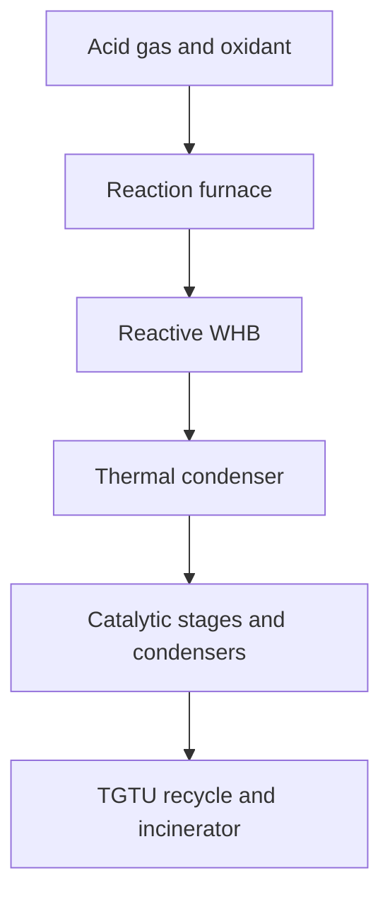

# Rigorous sulfur-recovery process simulation

NeqSim's sulfur-recovery package provides a complete steady-state Claus flowsheet plus the
stateful core needed for sub-dew-point bed cycling. Public thermochemistry and correlations provide
the base model; vendor catalyst data or plant measurements should be used to fit the explicit
calibration factors before equipment rating or guarantee work.

## Six implementation layers

1. Audited S8 and COS identity and formation properties; ideal-gas S2-S8 equilibrium, sulfur vapor
   pressure, and dew point.
2. Opt-in fully coupled thermodynamic residual evaluation and catalyst-pellet effectiveness in
   `PlugFlowReactor`; its historical frozen-property and activity-only defaults are preserved.
3. A finite-rate Claus reaction furnace and cell-discretized reactive waste-heat boiler.
4. Mixed-allotrope condensers and finite-rate alumina, titania, or mixed catalytic beds, including
   COS and CS2 hydrolysis.
5. An integrated SRU with combustion-air control, sulfur products, material-balance closure, KPIs,
   and a fluent builder.
6. Tail-gas hydrogenation/absorption/recycle, incineration, oxygen enrichment, split flow, and a
   stateful sub-dew-point bed.

The primary package is `neqsim.process.equipment.reactor.sulfurrecovery`.

## Process topology and convergence



Every catalytic converter is followed by a sulfur condenser. The air controller converges the
final Claus tail gas to the configured H2S/SO2 ratio, normally 2.0. When tail-gas treatment is
enabled, absorbed H2S is relaxed to a fixed-point recycle and air demand is recalculated on the
combined fresh and recycle feed.

## Thermodynamic basis

`SulfurThermodynamics` treats sulfur vapor as an ideal reacting mixture of S2 through S8. For each
species `i`,

$$
y_i P = P^\circ \exp\left(\frac{n_i\lambda-G_i^\circ(T)}{RT}\right),
$$

where `n_i` is its sulfur-atom count and `lambda` is the sulfur atomic chemical potential. A scalar
root solve enforces total sulfur vapor pressure. This gives allotrope fractions and mean sulfur
atoms per vapor molecule without treating all sulfur vapor as S8.

Sulfur vapor pressure is interpolated in `ln(P)` versus `1/T` over 312.15-1308.15 K. Calls outside
the reviewed range fail explicitly. The process EOS continues to carry elemental sulfur as an S8
equivalent for compatibility; sulfur equipment converts between that atom inventory and the S2-S8
vapor distribution.

## Reaction models

The reduced furnace mechanism balances H2S oxidation, the thermal Claus reaction, ammonia and
methane destruction, H2S dissociation, and COS/CS2 formation. Elemental Gibbs minimization is also
available through `ClausReactionFurnace.ModelMode`. The reduced mechanism is the default because
residence time, contaminants, and calibration factors remain explicit.

The reactive waste-heat boiler advances thermal Claus recombination and COS/CS2 hydrolysis through
finite cells at local temperature. Catalytic converters use Arrhenius kinetics, GHSV contact time,
catalyst activity, pellet effectiveness, an equilibrium approach, and catalyst-specific hydrolysis
activity.

## Basic use

```java
SystemInterface fluid = new SystemSrkEos(313.15, 2.0);
fluid.addComponent("H2S", 10.0);
fluid.addComponent("CO2", 2.0);
fluid.addComponent("methane", 0.05);
fluid.addComponent("water", 1.0);
fluid.setMixingRule("classic");

Stream acidGas = new Stream("acid gas", fluid);
acidGas.run();

SulfurRecoveryUnit sru = new SulfurRecoveryProcessBuilder("SRU", acidGas)
    .configuration(SulfurRecoveryUnit.Configuration.STRAIGHT_THROUGH)
    .catalyticStages(2)
    .tailGasTreatment(true)
    .incinerator(true)
    .build();
sru.run();

SulfurRecoveryPerformance result = sru.getPerformance();
double recovery = result.getOverallSulfurRecoveryPercent();
double sulfurKgPerHour = result.getRecoveredSulfurKgPerHour();
double stackSO2KgPerHour = result.getStackSO2KgPerHour();
```

The builder supports `STRAIGHT_THROUGH`, `SPLIT_FLOW`, `OXYGEN_ENRICHED`, and `SUB_DEW_POINT`.
The built unit exposes temperatures, catalyst types, oxidant composition, split fraction, control
tolerance, recycle settings, all equipment, sulfur products, tail gas, and recycle streams.

For higher-fidelity generic PFR calculations, enable the new modes explicitly:

```java
pfr.setThermodynamicCoupling(PlugFlowReactor.ThermodynamicCoupling.FULLY_COUPLED);
pfr.setCatalystMolecularDiffusivity(1.0e-5);
pfr.setCatalystEffectivenessEnabled(true);
```

## Compatibility

The sulfur-recovery API is additive: no existing public class, constructor, method, or enum value
is removed. `PlugFlowReactor` retains its historical frozen-property thermodynamic coupling and
activity-only catalyst behavior unless the new options are enabled explicitly.

Calculations that already use `S8`, `sulfur(S8)`, or `COS` can produce different reaction or energy
results because their incorrect CAS identities and gas-phase formation properties have been
corrected. This is an intentional data-quality correction, not numerical result compatibility.

## Results and validation

`SulfurRecoveryPerformance` reports fresh-feed and recovered sulfur, Claus and overall recovery,
sulfur-atom closure, tail H2S/SO2, oxygen demand, furnace temperature, stack SO2, and air/recycle
iteration counts and convergence flags.

Validate in dependency order:

1. Component identity and reference thermochemistry.
2. Sulfur vapor pressure, normal boiling point, dew point, and S2-S8 distribution.
3. Reaction stoichiometry and element closure for every unit.
4. Furnace temperature and NH3/CH4 destruction against a measured or published case.
5. WHB outlet COS/CS2 and steam production.
6. Per-bed Claus conversion, hydrolysis, temperature rise, and sulfur condensation.
7. Final ratio control, total recovery, TGTU conversion/removal, and stack SO2.

Recommended acceptance criteria for a calibrated steady-state case are sulfur closure below
`1e-5` relative and controlled H2S/SO2 within 0.02. Assign tolerances to each measured temperature
and composition from its source uncertainty. Do not fit all kinetic multipliers to total recovery
alone because that produces a non-identifiable model.

## Current limits

- S2-S8 equilibrium is ideal-gas based and is not yet seven native EOS components.
- Kinetic defaults are public reduced mechanisms, not proprietary simulator or catalyst-vendor
  databanks.
- The TGTU absorber uses H2S-removal and CO2-coabsorption efficiencies. A rigorous electrolyte,
  rate-based absorber can later replace this kernel without changing the integrated SRU API.
- Detailed furnace CFD, burner hydraulics, WHB tube mechanics, sulfur-pit degassing, and distributed
  catalyst aging are outside the current process model.

This offers commercial-style topology, convergence, balances, and calibration hooks. Commercial
rating parity still requires appropriate licensed or plant-specific kinetic and equipment data.

## Public references

- M. W. Chase, [*NIST-JANAF Thermochemical Tables*, fourth
  edition](https://webbook.nist.gov/cgi/cbook.cgi?ID=C10544500&Mask=1), 1998.
- NIST Computational Chemistry Comparison and Benchmark Database,
  [experimental S8 reference data](https://cccbdb.nist.gov/exp2x.asp?casno=10544500).
- B. Meyer, [“Elemental sulfur”](https://doi.org/10.1021/cr60301a003), *Chemical Reviews* 76
  (1976), 367-388.
- A. J. Jackson et al., [“A universal chemical potential for sulfur
  vapours”](https://doi.org/10.1039/C5SC03088A), *Chemical Science* 7 (2016), 1082-1092.
- U.S. EPA, [AP-42 Section 8.13, Sulfur
  Recovery](https://www.epa.gov/sites/default/files/2020-09/documents/8.13_sulfur_recovery.pdf).
