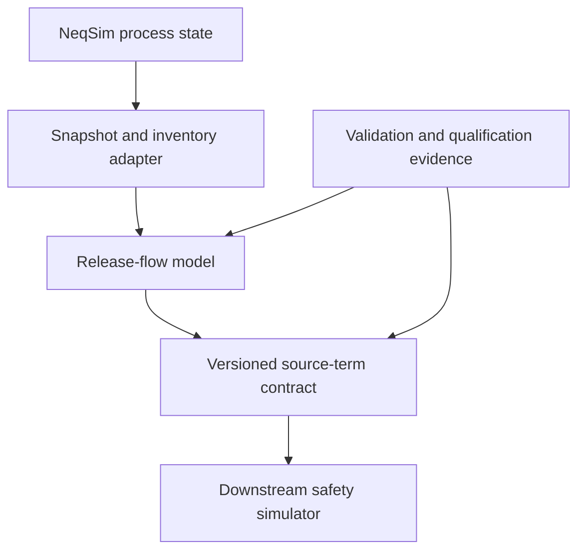

# NRC-3860: Source-term platform for live safety-simulator input

- Status: PROPOSED
- Owners: @EvenSol (safety, thermodynamics, and process subsystems); independent domain reviewer required
- Created: 2026-09-20
- Target release: UNPLANNED, after acceptance and staged implementation review
- Tracking issue: [#3860](https://github.com/equinor/neqsim/issues/3860)

## Context and problem

NeqSim can generate screening-level release scenarios from process streams and trapped
inventories. The present release utilities are useful for early studies, but they do not yet
form a stable boundary for a downstream safety simulator:

- release equations, thermodynamic assumptions, and fallback behavior are not represented by
  an explicit model identity;
- upstream, critical/throat, orifice-exit, and ambient-expanded states are not all available;
- some property or flash failures are replaced by plausible constants, so a numerical value can
  hide reduced calculation quality;
- the existing time series does not carry time-varying composition, calculation provenance,
  model applicability, or structured diagnostics;
- steady-state and dynamic process calculations do not share one source-term session contract;
  and
- existing export paths are format-specific rather than a versioned, neutral safety-data
  contract.

The desired capability is a first-class NeqSim source-term platform. It shall obtain process
state and inventory directly from `ProcessSystem` or `ProcessModel`, calculate a declared
release model, and publish deterministic steady or live frames without requiring external
safety software. Downstream tools remain responsible for dispersion, fire, explosion, toxic
effects, and risk calculations.

This NRC defines architecture and governance. It does not approve a release model for a
specific facility, fluid, operating range, or engineering decision.

## Decision

Adopt a layered source-term architecture with four independently testable boundaries:

The layers shall not depend on a particular downstream simulator. A process calculation may
run without serialization, a release model may run without a process flowsheet, and contract
validation may run without executing thermodynamics.

### 1. Release-flow model boundary

Introduce a small public model interface whose inputs and outputs are immutable or defensively
copied:

| Contract | Responsibility |
|---|---|
| `ReleaseFlowModel` | Calculate one instantaneous release from a declared request. |
| `ReleaseFlowRequest` | Upstream thermodynamic state, back pressure, geometry, discharge coefficient, and validation policy. |
| `ReleaseGeometry` | Opening dimensions, effective area, orientation, and coefficient provenance. |
| `ReleaseFlowResult` | Mass rate, regime, stations, balance diagnostics, model identity, status, and evidence level. |
| `ReleaseState` | Thermodynamic and flow state at one named station. |

The model interface shall be open to additional implementations without changing process
coupling or the exchange schema. Model selection is always explicit. NeqSim shall not silently
switch to a different release model when a requested model fails.

The first implementation PR shall include two paths:

1. `LegacyOrificeReleaseModel`, preserving the current `LeakModel` screening behavior where
   compatibility permits. Every fallback is reported and the result is `SCREENING_ONLY`.
2. `HomogeneousEquilibriumReleaseModel`, using equilibrium, isentropic depressurization from
   an upstream stagnation state and maximization of mass flux between upstream and back
   pressure.

For the homogeneous-equilibrium model, a trial pressure state satisfies

$$
s(p,T,z)=s_0,
\qquad
u(p)=\sqrt{2\max(h_0-h(p,s_0,z),0)},
\qquad
G(p)=\rho(p,s_0,z)u(p).
$$

The critical state is the checked maximum of $G(p)$ on
$p_b \le p < p_0$. The release rate is

$$
\dot m=C_d A G(p_*).
$$

An interior maximum is a choked result; a maximum at the back-pressure boundary is an
unchoked result. The calculation shall use a bracketed search with explicit convergence and
boundary diagnostics. It shall not infer choking from a hard-coded heat-capacity ratio.

The equilibrium sound speed at the accepted throat state is a separate consistency diagnostic.
The result records the equilibrium Mach number and acoustic-calculation status. It does not
replace mass-flux maximization or turn a failed acoustic derivative into an accepted result.

Homogeneous equilibrium assumes zero slip and instantaneous interphase mass, momentum, and
thermal equilibrium. It is not a non-equilibrium flashing, delayed-nucleation, long-pipe, or
full-bore decompression model. Those regimes require separate implementations behind the same
interface.

### 2. Explicit stations and phase accounting

Each result represents the following station semantics:

| Station | Meaning | Required behavior |
|---|---|---|
| `UPSTREAM_STAGNATION` | Solved source state before acceleration. | Always present for a valid request. |
| `THROAT_CRITICAL` | Maximum-mass-flux state, or the back-pressure state for unchoked flow. | Always present for a successful flow calculation. |
| `ORIFICE_EXIT` | State at the physical opening used for momentum and pressure thrust. | Present when the model resolves or explicitly aliases it. |
| `AMBIENT_EXPANDED` | Isentropically expanded state at receiving pressure. | Present when expansion is physically and numerically supported. |

Aliasing two stations is explicit in the result; it is not represented by copying values
without explanation. An unavailable station carries a reason code rather than fabricated
properties.

Each available state records, in SI units:

- absolute pressure, temperature, total density, specific enthalpy, and specific entropy;
- velocity, mass flux, effective flow area, and equilibrium sound speed when available;
- overall component mole and mass fractions;
- gas, hydrocarbon-liquid, aqueous, and solid-like mass fractions; and
- native phase types and phase mass fractions for lossless NeqSim reconstruction.

Phase mass fractions are calculated from phase mass, never from molar phase fraction. Hydrate,
wax, solid, solid-complex, and precipitated-asphaltene phases are classified as solid-like for
the four-category summary and retained by native phase type in the detailed list. Fractions
must be finite, non-negative within tolerance, and sum to unity. A solid-like phase outside a
model's applicability produces `UNSUPPORTED`, not an assumed gas or liquid result.

### 3. Calculation status and qualification are separate

A single quality flag cannot distinguish numerical success from engineering evidence. Every
result and live frame therefore carries both axes:

**Calculation status**

| Status | Meaning |
|---|---|
| `VALID` | Required numerical, physical, and closure checks passed. |
| `VALID_WITH_WARNINGS` | The requested calculation completed, with non-fatal diagnostics. |
| `INVALID` | Input, flash, optimization, balance, or property checks failed. |
| `UNSUPPORTED` | The requested model does not represent the encountered regime. |
| `STALE` | A frame does not correspond to the current successful process calculation. |

**Evidence level**

| Level | Meaning |
|---|---|
| `UNQUALIFIED` | Implemented, with no claimed regression evidence. |
| `REGRESSION_TESTED` | Software and invariant tests pass. |
| `BENCHMARKED` | Compared against declared independent analytical, numerical, or experimental references over a recorded range. |
| `INDEPENDENTLY_VALIDATED` | Evidence and applicability were reviewed independently under repository governance. |
| `SCREENING_ONLY` | Intentionally simplified behavior retained for early assessment or compatibility. |

Evidence level belongs to a model/range/evidence record, not to the software package as a
whole. A result cannot elevate its model's registered evidence level. Extrapolation outside a
benchmarked envelope reduces the frame evidence to `UNQUALIFIED` or `SCREENING_ONLY` and emits
a range diagnostic.

Diagnostics are structured records with stable code, severity, station, field, message, and
optional observed/limit quantities. Human-readable messages are not the machine contract.

### 4. Strict and screening policies

`STRICT` is the default for the new neutral contract and live process coupling. Under this
policy:

- a failed thermodynamic operation, invalid density, unavailable required property, or
  unconverged mass-flux search produces `INVALID` or `UNSUPPORTED`;
- no default molecular weight, heat-capacity ratio, density, phase fraction, or sonic speed is
  substituted;
- the last valid frame is never emitted as though it were current; and
- serialization rejects non-finite numbers and missing required provenance.

`SCREENING` permits only model-declared approximations. Each approximation has a diagnostic
code and the output evidence level is no better than `SCREENING_ONLY`.

APIs may provide `calculateOrThrow` for interactive use, but live sessions return an invalid
frame so that sequence continuity and failure evidence are preserved.

### 5. Versioned neutral exchange contract

Create a source-term contract under
`src/main/resources/neqsim/process/safety/release/schema/` using JSON Schema Draft 2020-12.
Version 1 declares:

- `schemaVersion = neqsim_safety_source_term.v1`;
- `schemaUri = urn:neqsim:schema:safety-source-term:v1`;
- scenario, release-source, process-object, and frame identities;
- UTC generation time, simulation time in seconds, monotonically increasing sequence number,
  and calculation UUID;
- process snapshot and inventory provenance;
- release geometry and coefficient provenance;
- model identifier, semantic model version, assumptions, applicability, calculation status,
  evidence level, and diagnostics;
- station states, overall composition, phase mass fractions, flow rate, momentum, and energy
  quantities;
- isolation and blowdown state when coupled to safeguards; and
- uncertainty case identity, input sample, weight, and ensemble summary where present.

Quantities use a numeric value plus a declared unit token. Version 1 writes canonical SI units;
the unit field prevents positional or naming assumptions and allows later compatible readers.
Pressure is absolute unless a field explicitly declares otherwise. Standard-condition volume
rates additionally carry the reference temperature, pressure, and standard-state definition.

Object properties have deterministic ordering for canonical output. Composition entries have
stable component identities and deterministic ordering. A content fingerprint is calculated
over the canonical payload excluding the fingerprint field itself.

The supported representations are:

- one JSON object for a snapshot or complete finite scenario;
- newline-delimited JSON with exactly one self-contained frame per line for live use; and
- tabular CSV for selected time-series quantities, accompanied by a JSON manifest containing
  schema identity, units, provenance, and diagnostics.

CSV alone is not a lossless contract. Network transport, authentication, message brokers, and
remote procedure protocols are adapters outside schema version 1.

Version 1 follows `docs/development/api-lifecycle.md`: additive optional fields are compatible;
required-field changes or changed meanings require a new major version and an accepted NRC.

### 6. Process-system and process-model coupling

Add a `SourceTermSession` that owns sequencing and delegates process access through adapters.
It supports both `ProcessSystem` and `ProcessModel` without adding release logic to individual
equipment classes.

The session provides three operations:

1. **Capture solved state**: read an already solved process and emit a steady snapshot.
2. **Run and capture**: run the process with a supplied calculation UUID, then emit a snapshot
   only if the solve succeeds.
3. **Step and capture**: call the real `runTransient(dt, UUID)` path and emit the resulting
   frame with updated simulation time and sequence number.

The wrapper approach makes ordering explicit and avoids assuming that a generic process event
means all dynamic equipment and controllers have completed a coherent time step. Event-bus or
streaming adapters may consume completed frames, but are not the source of truth for step
completion.

Every configured release source has a stable path within its process container and declares
whether its upstream state comes from a stream, equipment outlet, or trapped inventory segment.
The captured process provenance includes container type, source path, calculation UUID,
simulation time, solve mode, and a state fingerprint.

Dynamic frames include current composition and phase split. Isolation, emergency shutdown,
depressurization, and inventory depletion are represented as time-dependent process inputs or
states; they are not baked into the orifice model. A full-bore line rupture with wave propagation
and distributed inventory is a dedicated model, not an oversized vessel leak.

Consumers implement a small callback interface. One slow or failed consumer cannot change the
thermodynamic calculation. Back-pressure, buffering, retry, and persistence policy belong to
the adapter, and dropped frames are visible through sequence gaps and diagnostics.

### 7. Uncertainty and ensembles

Uncertainty is represented as reproducible sampled cases, not by attaching unsupported
confidence labels to a deterministic value. Each case records:

- ensemble and case identifiers;
- random seed and sampling method;
- sampled geometry, discharge coefficient, process state, and model parameters;
- case weight;
- model identity and evidence level; and
- calculation status and diagnostics.

Ensemble summaries report sample count, failed/unsupported counts, and declared quantiles for
each quantity. Quantiles are only emitted when the valid sample count meets a documented
minimum. Correlated inputs require an explicit correlation model. The system does not invent
default probability distributions for engineering inputs.

### 8. Model registry and applicability

Each model declares machine-readable applicability constraints, including supported phase
assemblages, pressure and temperature ranges, opening geometry, length-to-diameter assumptions,
composition constraints, and whether solids, slip, heat transfer, friction, or finite-rate phase
change are represented.

The planned model families are:

| Family | Intended use | Initial status |
|---|---|---|
| Legacy orifice screening | Compatibility and early ranking. | First physics PR. |
| Ideal-gas isentropic nozzle | Analytical gas checks and dilute-gas screening. | First or second physics PR. |
| Homogeneous equilibrium | Short-opening equilibrium flashing and two-phase source state. | First physics PR. |
| Homogeneous relaxation | Delayed phase change where independently supported parameters and evidence exist. | Later qualification PR. |
| Frozen/non-equilibrium multiphase | Slip or frozen-composition sensitivity. | Later, evidence-gated. |
| Distributed pipe decompression | Full-bore rupture and line-pack wave propagation. | Separate later model. |

Automatic recommendations may compare applicability, but calculation never changes the selected
model without recording a new case identity.

## Public contracts affected

The proposal is additive:

- new Java types in `neqsim.process.safety.release` and a process-coupling subpackage;
- a new JSON Schema major version and canonical serialization rules;
- additive builder methods on `LeakModel` to select a release model and policy; and
- a new `LeakModel.calculateReleaseFlow(...)` result path.

Existing `LeakModel` scalar methods and `SourceTermResult` remain available and retain their
legacy default behavior during the compatibility period. Their documentation shall identify
them as screening paths and direct new integrations to the model-explicit API. Existing
format-specific exporters are not part of the new contract and are not used by the new examples.

No existing JSON contract is reinterpreted as version 1. Readers reject an unknown major
version. New code does not claim that a successful parse or calculation is engineering
qualification.

## Engineering and safety boundary

The source-term platform calculates the state and rate at a release boundary. It does not by
itself calculate or approve:

- atmospheric dispersion or indoor accumulation;
- flammable or toxic effect distances;
- ignition, fire radiation, explosion overpressure, or escalation;
- structural response, personnel risk, emergency response, or safe separation distance;
- relief-device certification or final opening geometry;
- safety-integrity performance; or
- facility design acceptance.

The initial homogeneous-equilibrium implementation excludes wall heat transfer, pipe friction,
slip, metastability, delayed nucleation, finite-rate phase transfer, chemical reaction, particle
transport, and dry-ice deposition. Ambient-expanded states are boundary conditions for a
downstream near-field model, not a substitute for that model.

Dense-fluid decompression can form solid material and can couple pipeline outflow, near-field
expansion, and far-field dispersion. Published multi-scale work and large-scale release
experiments demonstrate why these stages need separate validation. A dense-fluid result is
therefore `UNSUPPORTED` whenever the requested model cannot represent the phase assemblage or
the relevant transient inventory physics.

Project use requires an accountable engineer to select models, ranges, input uncertainty, and
acceptance criteria. Repository review establishes software and documented evidence quality;
it does not transfer engineering authority to the library.

## Compatibility and migration

Migration is opt-in and staged:

1. Existing code continues to call `LeakModel` and receives current screening behavior.
2. New calculations select a `ReleaseFlowModel` explicitly and inspect status, evidence,
   diagnostics, and stations.
3. New integrations serialize only the versioned neutral source-term contract.
4. Process integrations adopt `SourceTermSession` for coherent steady or transient frames.

The legacy API may be deprecated only in a later reviewed change with a replacement example and
the support period required by the API lifecycle policy. No implementation PR removes an
existing exporter or changes the legacy default model.

Rollback is layer-specific. A release model, serializer, or process adapter can be disabled
without changing the other contracts. A defective model version remains identifiable in saved
provenance. Corrected numerical behavior increments the model version and supplies regression
and migration notes; it does not silently rewrite prior evidence.

## Validation and qualification evidence

Implementation PRs shall provide evidence proportional to their scope.

### Software and invariant tests

- Java 8 compilation, formatting, static checks, and package tests;
- immutable/defensively copied request and result data;
- input thermodynamic state unchanged after success and failure;
- deterministic repeated calculations and serialization;
- clone and Java serialization behavior where supported;
- finite/non-negative quantities and normalized compositions;
- phase mass fractions summing to unity;
- mass, energy, entropy, and pressure-bound closure diagnostics;
- no accepted value after a failed required flash or property evaluation;
- monotonic and limiting behavior as area, coefficient, upstream pressure, and back pressure
  change; and
- schema positive, negative, unknown-major-version, and canonical-fingerprint tests.

### Physics tests

- analytical ideal-gas choked and unchoked limits;
- equality with the documented legacy equation in compatibility mode;
- single-phase gas, single-phase liquid, equilibrium flashing, and multicomponent cases;
- near-critical-pressure-ratio continuity;
- high-backpressure/no-flow behavior;
- aqueous and solid-like phase classification;
- mass-flux-search convergence and boundary-optimum cases;
- equilibrium acoustic status and Mach consistency at a critical state; and
- cross-equation-of-state sensitivity without treating agreement as validation.

### Process and live tests

- one steady snapshot from both `ProcessSystem` and `ProcessModel`;
- real dynamic execution with `setCalculateSteadyState(false)` where required and
  `runTransient(dt, UUID)`;
- time-varying pressure, temperature, composition, phase split, and inventory;
- calculation UUID, sequence, simulation-time, staleness, and source-path traceability;
- isolation timing and zero-flow behavior after inventory disconnection;
- invalid-frame propagation without replaying the previous value; and
- deterministic frame ordering with multiple process areas and release sources.

### Benchmark evidence

Each benchmark record identifies source, fluid definition, equation of state, geometry,
instrument uncertainty, initial/boundary conditions, measured observable, data exclusions, error
metric, and pass criterion. Calibration data and held-out validation data are separated. A
benchmark matrix reports coverage rather than one aggregate error.

The initial homogeneous-equilibrium model shall not claim more than
`REGRESSION_TESTED` until independent benchmark cases and ranges are reviewed. Dense-fluid,
solid-forming, relaxation, or distributed rupture claims remain unavailable until their
dedicated evidence PRs merge.

## Implementation sequence

The work is deliberately split so reviews remain focused:

1. **NRC PR** — this proposal only; no production code.
2. **Physics PR** — release-flow interface, legacy screening adapter, homogeneous-equilibrium
   model, stations, statuses, diagnostics, tests, and equations/applicability documentation.
3. **Contract PR** — immutable source-term package, Draft 2020-12 schema, canonical JSON,
   newline-delimited frames, CSV manifest, fingerprints, and compatibility tests.
4. **Process/live PR** — `ProcessSystem` and `ProcessModel` adapters, steady capture, true dynamic
   stepping, inventory/isolation inputs, frame consumers, and live-path tests.
5. **Qualification PRs** — uncertainty ensembles, benchmark registry and data, advanced release
   regimes, and documented evidence-level changes. Large regimes remain separate PRs.
6. **Demonstration PR** — a NeqSim-Colab notebook using released APIs for steady and dynamic
   source-term generation and schema validation.

Implementation PRs link to issue #3860 and the accepted NRC. The contract and process PRs may be
developed as stacked branches for review, but merge only after their dependency is accepted.

## Alternatives considered

### Extend `SourceTermResult` into one all-purpose object

Rejected. It would couple legacy blowdown arrays, thermodynamic-model output, process identity,
live transport, and downstream serialization. Separate domain and DTO boundaries make model and
schema evolution reviewable.

### Add more equations directly to `LeakModel`

Rejected. A growing conditional calculation would hide model selection and make applicability,
versioning, and independent validation ambiguous. `LeakModel` remains a compatibility facade.

### Select a model automatically from phase count

Rejected. Phase count alone does not establish equilibrium, metastability, slip, pipe-length,
solid-formation, or transient-inventory assumptions. Recommendations can be advisory, while
selection remains explicit.

### Publish process events and let consumers infer completed steps

Rejected as the primary coherence mechanism. Equipment and controller events may occur inside a
step. A session owning `run` or `runTransient` can assign one calculation UUID and publish only
after successful completion.

### Depend on an external safety application for schema or physics

Rejected. It would make NeqSim calculations unavailable or ambiguous without that software and
would couple the public API to a supplier-specific lifecycle. Adapters may be built outside the
core against the neutral versioned contract.

### Deliver all capabilities in one pull request

Rejected. Physics, public schema, process lifecycle, and qualification require different review
evidence and rollback boundaries.

## Rollback strategy

Before NRC acceptance, no production implementation merges. If the NRC is rejected, this
proposal is marked `REJECTED` and issue #3860 records the alternative direction.

After acceptance, each implementation layer is additive and can be reverted independently.
Legacy behavior remains the default compatibility path. A schema defect is corrected with a
compatible patch or a new major version according to the lifecycle policy. A physics defect
marks the affected model version and range as unavailable, emits a fail-closed diagnostic, and
ships a new model version with reproducible regression evidence.

Persisted source-term packages retain model and schema identities so downstream users can find
affected results. No rollback replaces invalid output with a plausible constant or silently
relabels old calculations.

## References

- JSON Schema, [Draft 2020-12 specification](https://json-schema.org/draft/2020-12/).
- R. M. Woolley et al., “CO2PipeHaz: Quantitative hazard assessment for next generation CO2
  pipelines,” *Energy Procedia* 63 (2014), 2510–2529,
  [doi:10.1016/j.egypro.2014.11.274](https://doi.org/10.1016/j.egypro.2014.11.274).
- K. Li et al., “An experimental investigation of supercritical CO2 accidental release from a
  pressurized pipeline,” *The Journal of Supercritical Fluids* (2016),
  [doi:10.1016/j.supflu.2015.09.024](https://doi.org/10.1016/j.supflu.2015.09.024).

References establish architectural and validation needs. They are not transcribed correlations
and do not by themselves qualify an implementation.

## Decision record

- 2026-09-20: PROPOSED in response to issue #3860.
- Acceptance requires the safety/process subsystem owner, one independent domain reviewer, and
  agreement on schema identity, status/evidence semantics, model boundaries, and the staged PR
  sequence.
- Production implementation remains blocked until this NRC is accepted.
