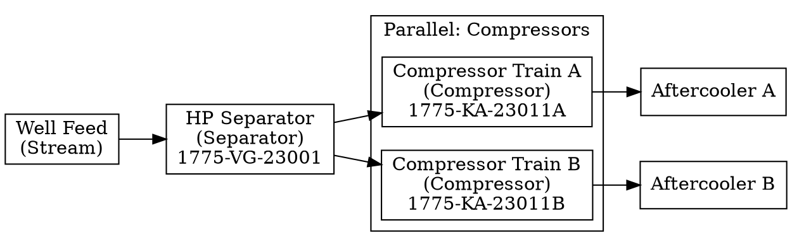

# Process Topology Analysis

Process topology analysis extracts the graph structure from a NeqSim ProcessSystem, enabling understanding of equipment relationships, dependencies, and parallel configurations.

---

## Overview

A process plant is a directed graph where:
- **Nodes** = Equipment units (separators, compressors, pumps, etc.)
- **Edges** = Stream connections between equipment

Topology analysis provides:
- Functional sequence (what comes before/after)
- Parallel equipment identification (redundancy)
- Critical path determination
- Dependency mapping

---

## Graph Representation

### Example Process

```
                    ┌─────────────┐
                    │  HP         │
     Well Feed ────►│  Separator  │
                    └──────┬──────┘
                           │
              ┌────────────┼────────────┐
              ▼            │            ▼
       ┌────────────┐      │     ┌────────────┐
       │ Compressor │      │     │ Condensate │
       │ Train A    │      │     │ Pump       │
       └─────┬──────┘      │     └─────┬──────┘
             │             │           │
             ▼             │           ▼
       ┌────────────┐      │     ┌────────────┐
       │ Aftercooler│      │     │ Storage    │
       │ A          │      │     │ Tank       │
       └─────┬──────┘      │     └────────────┘
             │             │
             ▼             │
       ┌────────────┐      │
       │ Export     │◄─────┘
       │ Gas        │
       └────────────┘
```

### Graph Data Structure

```java
// Nodes represent equipment
class EquipmentNode {
    String name;
    String equipmentType;
    FunctionalLocation stidTag;
    List<String> upstreamEquipment;
    List<String> downstreamEquipment;
    List<String> parallelEquipment;
    int topologicalOrder;
    double criticality;
}

// Edges represent stream connections
class ProcessEdge {
    String fromEquipment;
    String toEquipment;
    String streamName;
    String streamType;  // gas, liquid, mixed
}
```

---

## Using ProcessTopologyAnalyzer

### Building the Topology

```java
// Create analyzer from ProcessSystem
ProcessTopologyAnalyzer topology = new ProcessTopologyAnalyzer(processSystem);

// Build the graph
topology.buildTopology();

// Get basic statistics
System.out.println("Nodes: " + topology.getNodes().size());
System.out.println("Edges: " + topology.getEdges().size());
```

### Accessing Nodes and Edges

```java
// Get all nodes
Map<String, EquipmentNode> nodes = topology.getNodes();

for (EquipmentNode node : nodes.values()) {
    System.out.printf("%s (%s)%n", node.getName(), node.getEquipmentType());
    System.out.println("  Upstream: " + node.getUpstreamEquipment());
    System.out.println("  Downstream: " + node.getDownstreamEquipment());
}

// Get specific node
EquipmentNode compressor = topology.getNode("HP Compressor");

// Get all edges
List<ProcessEdge> edges = topology.getEdges();
```

---

## Topological Ordering

Topological order assigns a sequence number to each equipment based on flow direction:

```java
// Get topological order
Map<String, Integer> order = topology.getTopologicalOrder();

// Sort by order
List<Map.Entry<String, Integer>> sorted = new ArrayList<>(order.entrySet());
sorted.sort(Map.Entry.comparingByValue());

System.out.println("Functional Sequence:");
for (Map.Entry<String, Integer> entry : sorted) {
    System.out.printf("  %d. %s%n", entry.getValue(), entry.getKey());
}
```

Output:
```
Functional Sequence:
  1. Well Feed
  2. HP Separator
  3. Compressor Train A
  4. Compressor Train B
  5. Aftercooler A
  6. Aftercooler B
  7. Condensate Pump
  8. Export Gas
  9. Storage Tank
```

### Finding Upstream/Downstream Equipment

```java
// Get all equipment upstream of Export Gas
Set<String> upstream = topology.getAllUpstreamEquipment("Export Gas");
// Returns: [Well Feed, HP Separator, Compressor Train A, Aftercooler A, ...]

// Get all equipment downstream of HP Separator
Set<String> downstream = topology.getAllDownstreamEquipment("HP Separator");
// Returns: [Compressor Train A, Compressor Train B, Aftercooler A, ...]
```

---

## Parallel Equipment Detection

### Automatic Detection

The analyzer automatically identifies parallel equipment based on:
1. Same equipment type
2. Same inlet source
3. Same outlet destination
4. STID tags with matching base (different suffix)

```java
// Get parallel groups
List<Set<String>> parallelGroups = topology.getParallelGroups();

System.out.println("Parallel Equipment Groups:");
for (int i = 0; i < parallelGroups.size(); i++) {
    System.out.printf("  Group %d: %s%n", i + 1, parallelGroups.get(i));
}
```

Output:
```
Parallel Equipment Groups:
  Group 1: [Compressor Train A, Compressor Train B]
  Group 2: [Aftercooler A, Aftercooler B]
```

### STID-Based Parallel Detection

```java
// Check if two equipment are parallel based on STID
FunctionalLocation tagA = new FunctionalLocation("1775-KA-23011A");
FunctionalLocation tagB = new FunctionalLocation("1775-KA-23011B");

boolean isParallel = tagA.isParallelTo(tagB);  // true

// Get parallel equipment for a node
EquipmentNode node = topology.getNode("Compressor Train A");
List<String> parallel = node.getParallelEquipment();
// Returns: [Compressor Train B]
```

---

## Criticality Analysis

Criticality measures how important equipment is for production:

$$\text{Criticality} = \frac{\text{Flow through equipment}}{\text{Total plant throughput}}$$

```java
// Calculate criticality for all equipment
topology.calculateCriticality();

// Get critical equipment (criticality > 0.8)
List<String> criticalEquipment = topology.getCriticalEquipment(0.8);

System.out.println("Critical Equipment:");
for (String equipment : criticalEquipment) {
    double criticality = topology.getNode(equipment).getCriticality();
    System.out.printf("  %s: %.2f%n", equipment, criticality);
}
```

Output:
```
Critical Equipment:
  HP Separator: 1.00
  Well Feed: 1.00
  Export Gas: 0.85
```

---

## Critical Path Analysis

The critical path is the longest path through the process that determines plant output:

```java
// Find critical path
List<String> criticalPath = topology.getCriticalPath();

System.out.println("Critical Path:");
System.out.println("  " + String.join(" → ", criticalPath));
```

Output:
```
Critical Path:
  Well Feed → HP Separator → Compressor Train A → Aftercooler A → Export Gas
```

---

## STID Functional Location Tagging

### Assigning STID Tags

```java
// Assign STID tags to equipment
topology.setFunctionalLocation("HP Separator", "1775-VG-23001");
topology.setFunctionalLocation("Compressor Train A", "1775-KA-23011A");
topology.setFunctionalLocation("Compressor Train B", "1775-KA-23011B");
topology.setFunctionalLocation("Aftercooler A", "1775-WC-23021A");
topology.setFunctionalLocation("Aftercooler B", "1775-WC-23021B");
topology.setFunctionalLocation("Condensate Pump", "1775-PA-24001");
```

### Querying by STID

```java
// Find equipment by installation
List<String> gullfaksEquipment = topology.getEquipmentByInstallation("1775");

// Find equipment by type
List<String> compressors = topology.getEquipmentByType("KA");

// Find equipment by system (first 2 digits of sequential number)
List<String> system23 = topology.getEquipmentBySystem("23");
```

---

## Export Formats

### DOT Graph Format (Graphviz)

```java
String dotGraph = topology.toDotGraph();
System.out.println(dotGraph);
```

Output:


Render with Graphviz:
```bash
dot -Tpng process.dot -o process.png
```

### JSON Export

```java
String json = topology.toJson();
```

```json
{
  "nodes": [
    {
      "name": "HP Separator",
      "type": "Separator",
      "stidTag": "1775-VG-23001",
      "installation": "Gullfaks C",
      "topologicalOrder": 2,
      "criticality": 1.0,
      "upstream": ["Well Feed"],
      "downstream": ["Compressor Train A", "Compressor Train B", "Condensate Pump"],
      "parallel": []
    }
  ],
  "edges": [
    {
      "from": "HP Separator",
      "to": "Compressor Train A",
      "stream": "HP Gas",
      "type": "gas"
    }
  ],
  "parallelGroups": [
    ["Compressor Train A", "Compressor Train B"],
    ["Aftercooler A", "Aftercooler B"]
  ],
  "criticalPath": ["Well Feed", "HP Separator", "Compressor Train A", "Aftercooler A", "Export Gas"]
}
```

---

## Integration Examples

### With Dependency Analysis

```java
// Use topology for dependency analysis
DependencyAnalyzer deps = new DependencyAnalyzer(process, topology);

// Analyze what happens if HP Separator fails
DependencyResult result = deps.analyzeFailure("HP Separator");

// All downstream equipment is affected
System.out.println("Directly affected: " + result.getDirectlyAffected());
```

### With Production Impact

```java
// Topology helps identify cascade effects
ProductionImpactAnalyzer impact = new ProductionImpactAnalyzer(process);

// Use topology to find all affected equipment
Set<String> affected = topology.getAllDownstreamEquipment("HP Separator");

// Calculate total production impact including cascade
double totalImpact = 0;
for (String eq : affected) {
    EquipmentFailureMode failure = EquipmentFailureMode.trip(eq);
    ProductionImpactResult result = impact.analyzeFailureImpact(failure);
    totalImpact += result.getPercentLoss();
}
```

---

## Best Practices

1. **Build topology after process setup** - All equipment must be added first
2. **Assign STID tags consistently** - Use standard codes
3. **Verify parallel detection** - Check that groups make sense
4. **Update after changes** - Rebuild if process modified
5. **Export for visualization** - Use DOT format for diagrams
6. **Consider stream types** - Gas/liquid paths may differ

---

## See Also

- [STID & Functional Location](stid-tagging.md)
- [Dependency Analysis](dependency-analysis.md)
- [API Reference](api-reference.md#processtopologyanalyzer)
