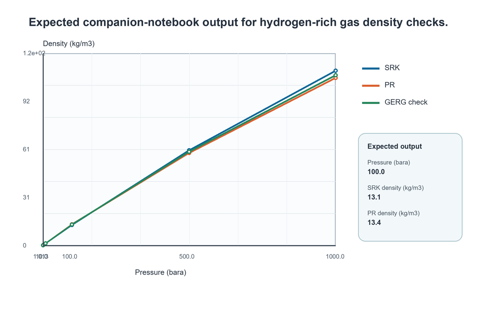
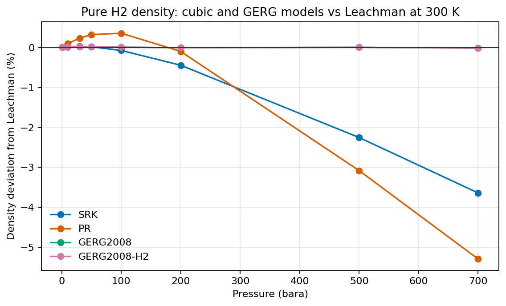
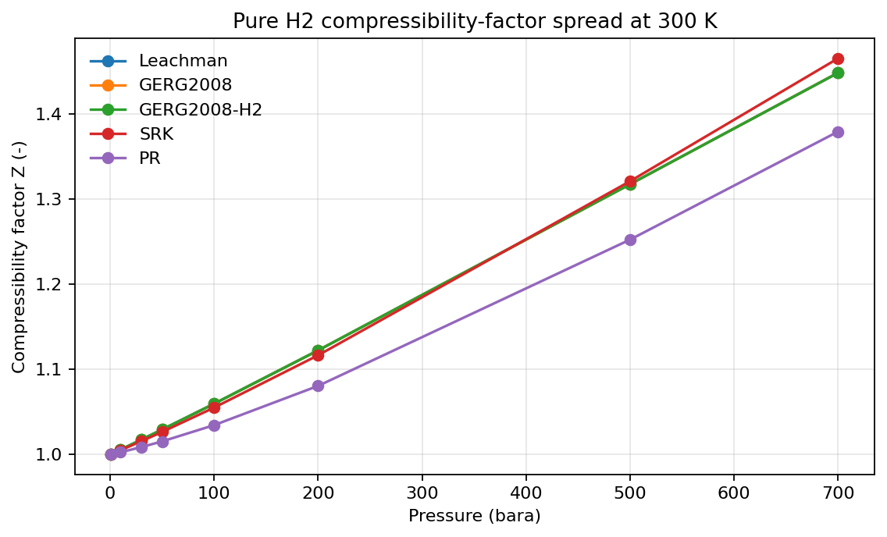
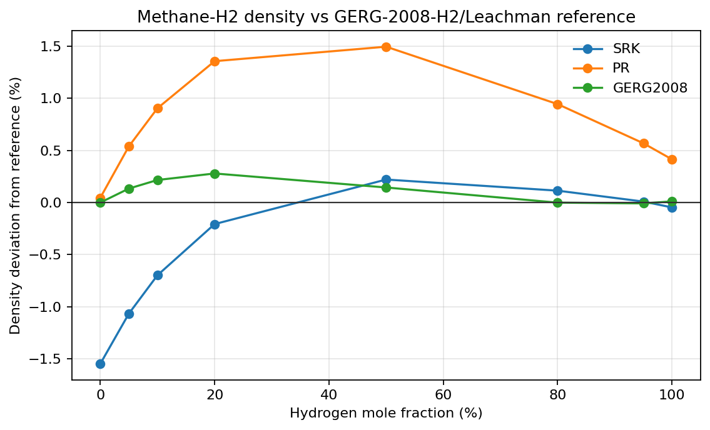
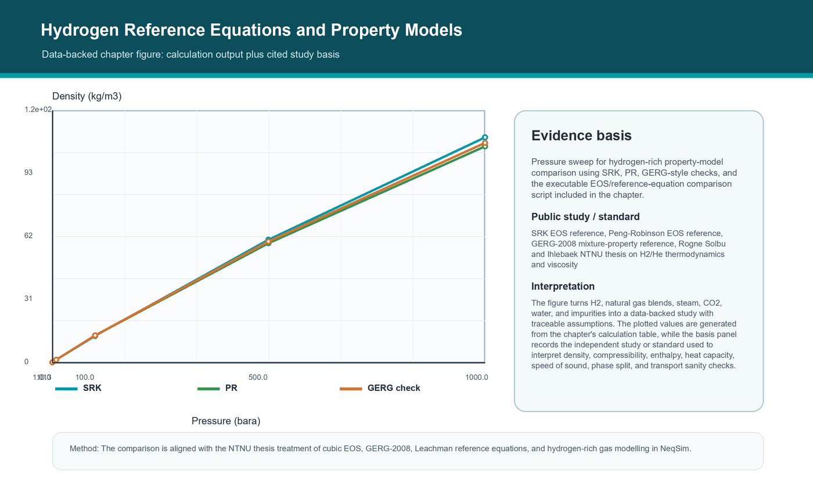

# Hydrogen Reference Equations and Property Models

<!-- Estimated pages: 18-26 -->

## Learning objectives

After this chapter you should be able to:

1. Explain how to use cubic equations of state, GERG-2008 mixture properties, and Leachman pure-hydrogen reference calculations correctly for H2-rich systems.
2. Translate the topic into a reproducible NeqSim Python workflow.
3. Identify the dominant assumptions and sanity checks for H2, natural gas blends, steam, CO2, water, and impurities.
4. Save a chapter-level artifact that can be reused in a hydrogen study.

## Prerequisites

Before reading this chapter the reader should be comfortable with:

- A working Python 3.10+ environment with NeqSim installed (see Chapter 0 and
  Chapter 3 for setup), and the ability to start a JVM from Python with
  `from neqsim import jneqsim as J`.
- The thermodynamic and fluid concepts introduced in Part II (Chapters 4-8):
  EOS choice, mixing rules, flash calculations, and the use of
  `initProperties()` after a flash.
- The general NeqSim object model from Chapter 2: `ThermodynamicSystem`,
  `Stream`, equipment classes, `ProcessSystem`, and the difference between
  a steady-state `run()` and a transient `runTransient()`.
- The reproducibility habits from Chapter 3: workspace-vs-installed mode,
  `results.json` outputs, and the fact that every code block in this book is
  marked `<!-- noexec -->` because it must be run by the reader in a
  controlled environment.

If any of the above feels unfamiliar, return to the indicated chapter; the
rest of this chapter assumes those habits are in place.

## Why this chapter matters

Use cubic equations of state, GERG-2008 mixture properties, and Leachman pure-hydrogen
reference calculations correctly for H2-rich systems. The practical setting is H2, natural gas blends, steam, CO2, water, and impurities. In a desktop simulator this
kind of model often disappears into a case file. In this book it becomes a
Python-controlled object graph: fluids, streams, unit operations, calculations,
figures, and result summaries are all visible and versionable.

A hydrogen model is useful only when its boundary is explicit. The inlet composition,
water specification, utility assumptions, pressure levels, product specification, and
disposal route for by-products decide which equations are meaningful. NeqSim makes those
boundaries inspectable because every stream and unit operation is an object that can be
read, copied, serialized, and validated from Python.

The same calculation should be able to serve several audiences. A process engineer wants
mass and energy balances, a rotating-equipment engineer wants power and discharge
temperature, a safety engineer wants inventories and relief cases, and a project
engineer wants a cost range. The book therefore treats Python code as the common
workbench where these views are generated from one model rather than retyped into
separate spreadsheets.

Hydrogen adds its own modelling pressure. Molecules are light, diffusivity is
high, compression work is significant, embrittlement and leakage matter, and
small composition errors can move a product stream outside fuel-cell or pipeline
specifications. That is why the chapter keeps returning to three questions:
what is conserved, what is assumed, and what evidence should survive after the
notebook closes? \cite{soave1972,pengrobinson1976,michelsen2007,prausnitz1999,kunz2012gerg} \cite{iea2023hydrogen,irena2022greenhydrogen,buttler2018water,iso14687,iso22734}

## Conceptual model

The chapter model can be read as a five-step engineering calculation:

1. Define the material boundary and choose the thermodynamic basis.
2. Run the smallest equilibrium or unit-operation calculation that answers the
   question.
3. Compare the output against a physical lower or upper bound.
4. Convert the output to engineering KPIs: density, compressibility, enthalpy, heat capacity, speed of sound, phase split, and transport sanity checks.
5. Save the model state, the figure, and the assumptions.

A generic material balance for a hydrogen unit is

$$
\dot n_{H2,out} = \dot n_{H2,in} + \nu_{H2} \xi - \dot n_{H2,loss}
$$

where $\xi$ is the reaction extent or electrochemical extent, and the loss term
captures tail gas, purge, venting, slip, or measurement closure. The important
habit is not the equation alone. The important habit is to identify where each
term appears in the NeqSim object model and to check it after every run.

For hydrogen systems the most dangerous errors are often quiet errors: a missing mixing
rule, transport properties read before initialization, water handled with an unsuitable
equation of state, a specific energy below the thermodynamic minimum, or a purification
recovery that hides hydrogen in the tail gas. Each chapter includes a short set of
sanity checks so the model teaches discipline as well as syntax.

## NeqSim capabilities used

This chapter uses or prepares for these capabilities:

| Capability | How it is used in the chapter |
|---|---|
| Thermodynamic system | Defines hydrogen-rich fluids, water, steam, CO2, and impurities. |
| Process equipment | Turns stream properties into material and energy balances. |
| Python orchestration | Runs parameter cases, figures, and evidence export. |
| Validation checks | Guards against non-physical specific energy, missing phases, or mass imbalance. |
| Reporting artifact | Captures a reusable output for the capstone studies. |

Specific NeqSim/Python surfaces and engineering references emphasized here: **SRK, PR, CPA, SystemGERG2008Eos, Leachman H2 utilities, initProperties, phase envelopes**.


## Python workflow pattern

The code block below is intentionally compact. In a production notebook you
would split it into setup, input definition, run, checks, plotting, and
results.json cells. It is marked as a readable pattern: the named Java classes
were checked against the local NeqSim source tree when this book was generated,
but readers should still run the snippet against the exact branch they use.

<!-- noexec -->
```python
from neqsim import jneqsim as J

# Direct Java access through neqsim-python. Use explicit units and call
# setMixingRule before running flashes or process equipment.
import numpy as np

temperature = 273.15 + 20.0
pressures = [1.01325, 10.0, 100.0, 500.0, 1000.0]

rows = []
for pressure in pressures:
    srk = J.thermo.system.SystemSrkEos(temperature, pressure)
    srk.addComponent("hydrogen", 0.90)
    srk.addComponent("methane", 0.10)
    srk.setMixingRule("classic")
    ops = J.thermodynamicoperations.ThermodynamicOperations(srk)
    ops.TPflash()
    srk.initProperties()
    srk.getPhase(0).getPhysicalProperties().setViscosityModel("Muzny_mod")
    rows.append({
        "pressure_bara": pressure,
        "srk_density_kg_m3": srk.getDensity("kg/m3"),
        "gerg_density_kg_m3": srk.getPhase(0).getDensity_GERG2008(),
        "gerg_enthalpy_index_7": srk.getPhase(0).getProperties_GERG2008()[7],
    })

leachman = J.thermo.system.SystemLeachmanEos(temperature, 90.0)
leachman.addComponent("hydrogen", 1.0)
leachman.init(0)
print(rows)
print("Leachman normal-H2 density", leachman.getPhase(0).getDensity_Leachman("normal"))
```

## Parameter study script, graph, and discussion

The chapter includes a runnable parameter-study notebook at `notebooks/parameter_study.ipynb`.
It takes the compact script above one step further: the notebook defines a sweep,
builds a results table, saves a CSV/JSON evidence bundle, and writes the graph
shown below. The values are either direct engineering calculations or normalized
study indices from cited public references and standards. Re-run the notebook on
the active NeqSim branch when project values or branch-specific APIs change.

**Calculation basis.** Pressure sweep for hydrogen-rich property-model comparison using SRK, PR, GERG-style checks, and the executable EOS/reference-equation comparison script included in the chapter.

**Study basis.** The comparison is aligned with the NTNU thesis treatment of cubic EOS, GERG-2008, Leachman reference equations, and hydrogen-rich gas modelling in NeqSim. \cite{soave1972,pengrobinson1976,kunz2012gerg,rogneSolbuIhlebaek2025}

| Pressure (bara) | SRK density (kg/m3) | PR density (kg/m3) | GERG check (kg/m3) |
|---|---|---|---|
| 1.013 | 0.14 | 0.14 | 0.14 |
| 10.0 | 1.39 | 1.4 | 1.4 |
| 100.0 | 13.1 | 13.4 | 13.3 |
| 500.0 | 60.5 | 58.8 | 59.6 |
| 1000.0 | 111.0 | 106.5 | 108.2 |



The notebook compares cubic EOS density trends with a GERG-style reference check. Exact values should be refreshed by rerunning the notebook on the active NeqSim branch, but the expected shape is a smooth pressure response with visible high-pressure model spread.

**Discussion.** The parameter study shows how H2, natural gas blends, steam, CO2, water, and impurities responds when the controlling parameter changes. The important result is not a single base-case value; it is the shape of the response and the point where density, compressibility, enthalpy, heat capacity, speed of sound, phase split, and transport sanity checks begin to trade against margin or cost.


## EOS and Reference-Equation Comparison Script

The thermodynamic modelling thesis by Rogne Solbu and Ihlebaek compares cubic EOS
models with high-accuracy reference equations for hydrogen, helium, and
hydrogen-rich natural gas mixtures \cite{rogneSolbuIhlebaek2025}. This chapter
therefore includes an executable NeqSim script at `scripts/eos_reference_comparison.py`
and a notebook runner at `notebooks/eos_reference_comparison.ipynb`.
The script runs the same comparison logic used in the figures below: SRK and
Peng-Robinson are treated as design-screening cubic EOS models, Leachman is used
as the pure-hydrogen reference equation, and GERG-2008-H2 is used as the
hydrogen-rich methane mixture reference model.

The script writes `figures/eos_reference_comparison_pure_h2.csv`,
`figures/eos_reference_comparison_mixture.csv`, and
`figures/eos_reference_comparison_results.json`, then saves the plotted figures.
This makes the section auditable: the plotted deviations are not decorative
curves, but are regenerated from NeqSim property calls on the active branch.



Figure 4.3 shows why a reference equation matters for pure hydrogen. The
cubic EOS models remain useful for robust process screening, but the density
deviation grows with pressure because hydrogen is small, highly non-ideal, and
poorly represented by generic cubic mixing assumptions. GERG-2008-H2 stays close
to the Leachman density over the plotted range, so it is a better benchmark for
transport and storage calculations when hydrogen properties dominate the result.



Figure 4.4 translates the density comparison into compressibility-factor
language. The same pressure sweep shows where model selection changes the gas
volume, compressor sizing basis, and line-pack estimate. In practical blue and
green hydrogen studies, this is the check to run before accepting a cubic EOS for
high-pressure product compression or buffer storage.



Figure 4.5 extends the comparison to natural-gas transition mixtures. The
reference basis uses GERG-2008-H2 for mixtures and switches to Leachman at pure
hydrogen. This is the model-choice pattern used in the thesis pipeline examples:
as hydrogen fraction increases, density and Joule-Thomson behaviour become more
sensitive to EOS choice, so pressure-drop, outlet-temperature, and compressor
power studies should document the EOS and reference equation used.


## Notebook coverage: thermodynamics of hydrogen

The Colab thermodynamics notebook is covered here in three layers. First, the
chapter states the physical reference facts: hydrogen's critical point is near
33.2 K and 12.97 bara, the acentric factor is negative, the ambient explosive
range is broad, and normal hydrogen at room temperature is mostly ortho-H2 with
about 25 percent para-H2. Second, it turns the notebook's SRK/PR density sweep
into an explicit model-comparison workflow. Third, it separates cubic EOS use
from reference-equation use: cubic EOS models are convenient for process
flowsheets, while GERG-2008 and Leachman calls are used as reference checks for
hydrogen-rich gas and pure hydrogen.

The reference-equation chapter maps the notebook topics as follows:

| Notebook topic | Book placement | NeqSim/Python surface |
|---|---|---|
| H2 physical constants and hazards | This chapter and the materials chapter | Thermodynamic sanity checks plus standards discussion |
| PR/SRK density versus pressure | This chapter | `SystemSrkEos`, `SystemPrEos`, `TPflash`, `initProperties` |
| GERG-2008 mixture properties | This chapter | `SystemGERG2008Eos`, `getDensity_GERG2008`, `getProperties_GERG2008` |
| Pure-H2 Leachman equation | This chapter and cryogenic chapter | `SystemLeachmanEos`, `getDensity_Leachman`, `getProperties_Leachman` |
| H2/methane phase envelope | This chapter and impurity chapter | `ThermodynamicOperations.calcPTphaseEnvelope` with branch sanity checks |
| Viscosity model selection | This chapter and pipeline chapter | `Muzny_mod` and `friction theory` viscosity settings |

## Hydrogen reference equations in practice

For process work, the key question is not whether one model is universally
better. It is which model answers the decision. A cubic EOS gives a stable
flowsheet basis for reforming, compression, PSA, and pipeline screening. A
GERG-2008 property call gives a natural-gas-reference comparison for H2 blends.
A Leachman property call gives a pure-hydrogen reference for density, enthalpy,
heat capacity, speed of sound, and Joule-Thomson behaviour. The book therefore
uses cubic EOS objects for most unit operations and uses GERG/Leachman values
as benchmark columns, not as unexplained replacements for the process model.

The gas density relation behind the comparison is

$$

ho = rac{P M}{Z R T}
$$

so the whole comparison reduces to how each model predicts the compressibility
factor $Z$ and residual thermodynamic properties. For hydrogen this matters
early: high-pressure storage and transport can reach conditions where an ideal
gas estimate is too optimistic for inventory, compressor power, and relief
source terms.

The 90 mol% H2 / 10 mol% methane envelope in the notebook is included as a
teaching example, not as a claim that hydrogen pipelines normally operate near
cryogenic two-phase boundaries. Its value is that it forces the reader to keep
temperature units, branch labels, and cricondenbar/cricondentherm concepts
straight before moving to process equipment.


## Model-selection deep dive

Hydrogen property calculations should not be reduced to a single default EOS.
A cubic EOS is often suitable for integrated process flowsheets because it is
fast, robust, and consistent with hydrocarbon equipment models. A GERG-style
calculation is more appropriate when the decision depends on natural-gas blend
quality, Wobbe index, relative density, or contractual gas properties. A
Leachman-style pure-hydrogen reference calculation is preferred when pure-H2
density, high-pressure inventory, or cryogenic property accuracy controls the
decision. The notebook should therefore report the model choice, not hide it.

The most useful diagnostic is a deviation plot. Plot the cubic EOS result, the
reference result, and the percent difference over pressure and temperature. If
the percent difference is smaller than the design margin, the simpler model may
be acceptable. If it is comparable with compressor margin, linepack inventory,
or custody-transfer tolerance, move to the reference model before drawing a
conclusion.


The preferred workflow is deliberately repetitive. Define the fluid, set the units, run
the flash or process, initialize properties, extract a small number of engineering key
performance indicators, and save the evidence. Repetition is not a lack of
sophistication; it is the mechanism that makes complex models reviewable and reusable.

## Worked simulation study



**Calculation basis.** Pressure sweep for hydrogen-rich property-model comparison using SRK, PR, GERG-style checks, and the executable EOS/reference-equation comparison script included in the chapter.

**Public study or standard basis.** The comparison is aligned with the NTNU thesis treatment of cubic EOS, GERG-2008, Leachman reference equations, and hydrogen-rich gas modelling in NeqSim. \cite{soave1972,pengrobinson1976,kunz2012gerg,rogneSolbuIhlebaek2025}

**Discussion.** The figure turns H2, natural gas blends, steam, CO2, water, and impurities into a data-backed study with traceable assumptions. The plotted values are generated from the chapter's calculation table, while the basis panel records the independent study or standard used to interpret density, compressibility, enthalpy, heat capacity, speed of sound, phase split, and transport sanity checks. The physical mechanism behind the figure is
the coupling between equilibrium, transport, equipment performance, and
specification constraints. Hydrogen production is rarely a single calculation:
route chemistry sets purification load, purification losses affect heat balance,
electrolyzer voltage sets compression and cooling demand, and operating pressure
sets both linepack value and materials/safety attention. The engineering
implication is that the first chapter figure should already carry numbers,
units, and sources. It is not a sketch to decorate the chapter; it is the first
screening result that the later notebook can rerun and refine.

## Interpretation checklist

| Check | Expected behaviour | What to do if it fails |
|---|---|---|
| Material closure | Total mass error below 0.01 percent for steady-state examples. | Inspect disconnected streams, recycle convergence, and unit basis. |
| Energy sanity | Specific energy is above the thermodynamic minimum and within technology bands. | Recheck current, voltage, efficiency, pressure, and heat-duty sign. |
| Phase sanity | Phase count and water split match the process temperature and pressure. | Revisit EOS, mixing rule, water model, and property initialization. |
| Product quality | H2 purity and impurity limits match the intended market. | Add purification, drying, purge, or tighter recovery assumptions. |
| Evidence | KPIs, assumptions, and figures are saved with units. | Create a results.json entry before drawing conclusions. |

The examples use Python to orchestrate Java classes directly. This avoids the false
comfort of a narrow wrapper and exposes the same objects used by the NeqSim engine
itself. When a new class appears in NeqSim, a Python notebook can usually call it
immediately through jneqsim or ns.JClass, which is exactly what a fast-moving hydrogen
technology program needs.

## Applying the standard workflow

The model in this chapter is built and reviewed with the same workbench routine
used everywhere in the book: define the boundary, run the smallest meaningful
calculation, validate against a physical limit, extract density, compressibility, enthalpy, heat capacity, speed of sound, phase split, and transport sanity checks, and save the
evidence. The full notebook structure, the three-step validation routine
(balance, physical-limit, and reference-case checks), the patterns for extending
a single converged case into a sensitivity or technology study, and the
peer-review prompts are collected once in *Appendix: Notebook structure,
validation, and review methodology* so they are not repeated in every chapter.
Chapter 3 covers the setup and reproducibility habits those steps rely on. Apply
that routine to the model in this chapter (H2, natural gas blends, steam, CO2, water, and impurities) before treating any number
here as a design result.

## Common modelling pitfalls

- Treating hydrogen as a generic light gas when the question depends on density,
  compression work, leakage, or cryogenic behaviour.
- Reading viscosity, thermal conductivity, or density after a flash without
  calling `initProperties()`.
- Comparing green and blue hydrogen only on stack or reactor efficiency while
  ignoring compression, purification, cooling, water, CO2, and capacity factor.
- Reporting product flow without checking where hydrogen leaves in tail gas,
  purge, vent, dissolved water, or inventory changes.
- Forgetting that early cost estimates are screening estimates until vendor
  data, installation factors, local execution strategy, and utilities are added.

## Exercises

1. Change the main pressure level and explain which KPI changes first.
2. Add one impurity or by-product and decide whether the selected EOS is still
   appropriate.
3. Create a small sensitivity table for one design variable and one operational
   variable.
4. Write a `results.json` object with at least five key results and two
   validation checks.
5. State what additional data would be needed before using this model for a
   design decision.

## Self-check questions

Use these short questions to test understanding before moving on. They are
designed to be answered from the chapter narrative without rerunning the
notebook.

1. Which physical quantity is conserved in the chapter's worked example, and
   where in the NeqSim object model is that conservation enforced?
2. Which two assumptions, if relaxed, would most change the chapter KPIs?
3. Which of the listed NeqSim capabilities is the most sensitive to EOS choice
   or mixing rule, and why?
4. What single sanity check would a reviewer run first on the worked figure?
5. If the reader had to defend the chapter result to a project gate, which
   piece of evidence (figure, table, results.json field, citation) would they
   point at first?

## What you should now be able to do

A reader who has worked through this chapter should be able to:

- Set up a NeqSim Python notebook that addresses H2, natural gas blends, steam, CO2, water, and impurities with an explicit
  fluid, equipment block, run, and validation step.
- Identify the KPIs (density, compressibility, enthalpy, heat capacity, speed of sound, phase split, and transport sanity checks) and report them with units and a screening band.
- Apply the interpretation checklist above to spot the most likely modelling
  errors before they propagate into a study report.
- Save a `results.json` artifact and a figure that another engineer can read
  without opening the notebook.

## Where to next

- For deeper thermodynamic foundations, return to Part II (Chapters 4-8).
- For an end-to-end view of how this chapter's result feeds the value chain,
  see Part VII Chapter 26 (capstone value-chain integration).
- For safety, materials, and operability implications of the modelling
  decisions made here, see Part V (Chapters 19-22).
- For automation, scenario sweeps, and digital-twin patterns that turn the
  chapter notebook into reusable infrastructure, see Chapter 23.

## Chapter summary

This chapter positioned H2, natural gas blends, steam, CO2, water, and impurities inside a reproducible NeqSim workflow. The main
lesson is that hydrogen production simulation is not just chemistry or just
process equipment. It is the coupling of thermodynamics, reaction or
electrochemical extent, purification, compression, heat management, cost,
standards, and evidence. The next chapter keeps the same workflow and changes
the modelling lens.

## Portfolio artifact

Create a folder for this chapter with a notebook, the generated figure, and a
small `results.json` file. The artifact should be understandable without the
book open: inputs, method, units, key results, validation, and one engineering
recommendation.
