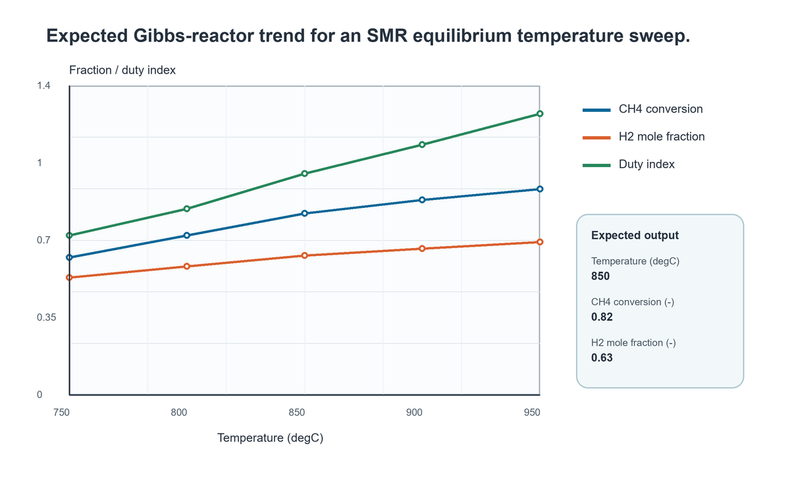
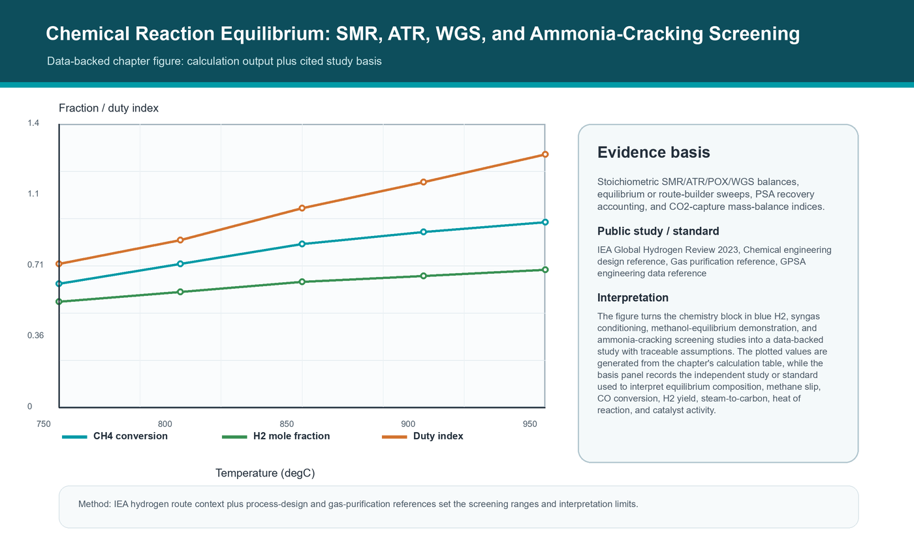

# Chemical Reaction Equilibrium: SMR, ATR, WGS, and Ammonia-Cracking Screening

<!-- Estimated pages: 18-26 -->

## Learning objectives

After this chapter you should be able to:

1. Explain how to model hydrogen-production chemistry as Gibbs-minimization, stoichiometric-conversion, or catalyst-screening reactor problems.
2. Translate the topic into a reproducible NeqSim Python workflow.
3. Identify the dominant assumptions and sanity checks for the chemistry block in blue H2, syngas conditioning, methanol-equilibrium demonstration, and ammonia-cracking screening studies.
4. Save a chapter-level artifact that can be reused in a hydrogen study.

## Prerequisites

Before reading this chapter the reader should be comfortable with:

- A working Python 3.10+ environment with NeqSim installed (see Chapter 0 and
  Chapter 3 for setup), and the ability to start a JVM from Python with
  `from neqsim import jneqsim as J`.
- The thermodynamic and fluid concepts introduced in Part II (Chapters 4-8):
  EOS choice, mixing rules, flash calculations, and the use of
  `initProperties()` after a flash.
- The general NeqSim object model from Chapter 2: `ThermodynamicSystem`,
  `Stream`, equipment classes, `ProcessSystem`, and the difference between
  a steady-state `run()` and a transient `runTransient()`.
- The reproducibility habits from Chapter 3: workspace-vs-installed mode,
  `results.json` outputs, and the fact that every code block in this book is
  marked `<!-- noexec -->` because it must be run by the reader in a
  controlled environment.

If any of the above feels unfamiliar, return to the indicated chapter; the
rest of this chapter assumes those habits are in place.

## Why this chapter matters

Model hydrogen-production chemistry as Gibbs-minimization, stoichiometric-conversion, or
catalyst-screening reactor problems. The practical setting is the chemistry block in blue H2, syngas conditioning, methanol-equilibrium demonstration, and ammonia-cracking screening studies. In a desktop simulator this
kind of model often disappears into a case file. In this book it becomes a
Python-controlled object graph: fluids, streams, unit operations, calculations,
figures, and result summaries are all visible and versionable.

A hydrogen model is useful only when its boundary is explicit. The inlet composition,
water specification, utility assumptions, pressure levels, product specification, and
disposal route for by-products decide which equations are meaningful. NeqSim makes those
boundaries inspectable because every stream and unit operation is an object that can be
read, copied, serialized, and validated from Python.

The same calculation should be able to serve several audiences. A process engineer wants
mass and energy balances, a rotating-equipment engineer wants power and discharge
temperature, a safety engineer wants inventories and relief cases, and a project
engineer wants a cost range. The book therefore treats Python code as the common
workbench where these views are generated from one model rather than retyped into
separate spreadsheets.

Hydrogen adds its own modelling pressure. Molecules are light, diffusivity is
high, compression work is significant, embrittlement and leakage matter, and
small composition errors can move a product stream outside fuel-cell or pipeline
specifications. That is why the chapter keeps returning to three questions:
what is conserved, what is assumed, and what evidence should survive after the
notebook closes? \cite{towler2013chemical,seader2016,kohl1997,mokhatab2018,gpsa2012} \cite{iea2023hydrogen,irena2022greenhydrogen,buttler2018water,iso14687,iso22734}

## Conceptual model

The chapter model can be read as a five-step engineering calculation:

1. Define the material boundary and choose the thermodynamic basis.
2. Run the smallest equilibrium or unit-operation calculation that answers the
   question.
3. Compare the output against a physical lower or upper bound.
4. Convert the output to engineering KPIs: equilibrium composition, methane slip, CO conversion, H2 yield, steam-to-carbon, heat of reaction, and catalyst activity.
5. Save the model state, the figure, and the assumptions.

A generic material balance for a hydrogen unit is

$$
\dot n_{H2,out} = \dot n_{H2,in} + \nu_{H2} \xi - \dot n_{H2,loss}
$$

where $\xi$ is the reaction extent or electrochemical extent, and the loss term
captures tail gas, purge, venting, slip, or measurement closure. The important
habit is not the equation alone. The important habit is to identify where each
term appears in the NeqSim object model and to check it after every run.

For hydrogen systems the most dangerous errors are often quiet errors: a missing mixing
rule, transport properties read before initialization, water handled with an unsuitable
equation of state, a specific energy below the thermodynamic minimum, or a purification
recovery that hides hydrogen in the tail gas. Each chapter includes a short set of
sanity checks so the model teaches discipline as well as syntax.

## NeqSim capabilities used

This chapter uses or prepares for these capabilities:

| Capability | How it is used in the chapter |
|---|---|
| Thermodynamic system | Defines hydrogen-rich fluids, water, steam, CO2, and impurities. |
| Process equipment | Turns stream properties into material and energy balances. |
| Python orchestration | Runs parameter cases, figures, and evidence export. |
| Validation checks | Guards against non-physical specific energy, missing phases, or mass imbalance. |
| Reporting artifact | Captures a reusable output for the capstone studies. |

Specific NeqSim/Python surfaces and engineering references emphasized here: **GibbsReactor, StoichiometricReaction, CatalystBed, CatalystDeactivationKinetics**.

## Literature-review topic calculation examples

The table below maps the requested blue, green, and frontier hydrogen literature
topics to calculation examples in the chapter where the physics and NeqSim
workflow fit best. Each row names the calculation to run, the input sweep that
makes it useful as a study example, and the KPIs that should appear in the
notebook output or discussion.

| Review list | No. | Topic | Calculation example placed here | Sweep or input basis | Output KPIs | Literature basis |
|---|---:|---|---|---|---|---|
| Cross-route frontier | 1 | Methane pyrolysis and turquoise hydrogen | Add methane-pyrolysis equilibrium and solid-carbon handling as a thermochemical route-screening example beside SMR/ATR/POX. | Temperature, conversion approach, heat-supply index, catalyst stability, and carbon-product credit. | H2 yield, direct CO2 index, solid-carbon rate, heat-demand index, maturity attention. | Muradov methane-pyrolysis hydrogen review, Holladay et al. hydrogen-production technology review, IEA Global Hydrogen Review 2023 |


## Python workflow pattern

The code block below is intentionally compact. In a production notebook you
would split it into setup, input definition, run, checks, plotting, and
results.json cells. It is marked as a readable pattern: the named Java classes
were checked against the local NeqSim source tree when this book was generated,
but readers should still run the snippet against the exact branch they use.

<!-- noexec -->
```python
from neqsim import jneqsim as J

# Direct Java access through neqsim-python. Use explicit units and call
# setMixingRule before running flashes or process equipment.
fluid = J.thermo.system.SystemSrkEos(273.15 + 850.0, 30.0)
for name, moles in [("methane", 1.0), ("water", 3.0), ("hydrogen", 1.0e-4),
                    ("CO", 1.0e-4), ("CO2", 1.0e-4), ("nitrogen", 0.02)]:
    fluid.addComponent(name, moles)
fluid.setMixingRule("classic")
feed = J.process.equipment.stream.Stream("SMR equilibrium feed", fluid)
feed.setFlowRate(1000.0, "kg/hr")

reactor = J.process.equipment.reactor.GibbsReactor("SMR Gibbs reactor", feed)
reactor.setEnergyMode("isothermal")
reactor.setMaxIterations(5000)
reactor.setConvergenceTolerance(1.0e-6)
reactor.setDampingComposition(0.01)
reactor.setComponentAsInert("nitrogen")
reactor.run()

out = reactor.getOutletStream().getThermoSystem()
in_ch4 = feed.getThermoSystem().getComponent("methane").getNumberOfmoles()
out_ch4 = out.getComponent("methane").getNumberOfmoles()
conversion = (in_ch4 - out_ch4) / in_ch4
print("converged", reactor.hasConverged())
print("mass balance error pct", reactor.getMassBalanceError())
print("methane conversion", conversion)
print("reactor power MW", reactor.getPower("MW"))
```

## Parameter study script, graph, and discussion

The chapter includes a runnable parameter-study notebook at `notebooks/parameter_study.ipynb`.
It takes the compact script above one step further: the notebook defines a sweep,
builds a results table, saves a CSV/JSON evidence bundle, and writes the graph
shown below. The values are either direct engineering calculations or normalized
study indices from cited public references and standards. Re-run the notebook on
the active NeqSim branch when project values or branch-specific APIs change.

**Calculation basis.** Stoichiometric SMR/ATR/POX/WGS balances, equilibrium or route-builder sweeps, PSA recovery accounting, and CO2-capture mass-balance indices.

**Study basis.** IEA hydrogen route context plus process-design and gas-purification references set the screening ranges and interpretation limits. \cite{iea2023hydrogen,towler2013chemical,kohl1997,gpsa2012}

| Temperature (degC) | CH4 conversion (-) | H2 mole fraction (-) | Reactor duty index |
|---|---|---|---|
| 750 | 0.62 | 0.53 | 0.72 |
| 800 | 0.72 | 0.58 | 0.84 |
| 850 | 0.82 | 0.63 | 1.0 |
| 900 | 0.88 | 0.66 | 1.13 |
| 950 | 0.93 | 0.69 | 1.27 |



The reaction-equilibrium notebook should show methane conversion and hydrogen fraction increasing with reformer temperature for the selected steam-to-carbon and pressure basis, while convergence and mass-balance error remain visible in the output table.

**Discussion.** The parameter study shows how the chemistry block in blue H2, syngas conditioning, methanol-equilibrium demonstration, and ammonia-cracking screening studies responds when the controlling parameter changes. The important result is not a single base-case value; it is the shape of the response and the point where equilibrium composition, methane slip, CO conversion, H2 yield, steam-to-carbon, heat of reaction, and catalyst activity begin to trade against margin or cost.


## Notebook coverage: production of hydrogen

The production notebook demonstrates equilibrium chemistry with Reaktoro/NASA
CEA examples. In this book the chemistry is kept, but the executable modelling
surface is NeqSim. That distinction is important: the source notebook is a
useful theory reference for pre-reforming, steam reforming, partial oxidation,
and reaction-property calculations; the book translates those ideas into
`GibbsReactor`, `StoichiometricReaction`, `CatalystBed`, and
`CatalystDeactivationKinetics` patterns that exist in NeqSim.

The central equilibrium reactions are

$$
CH_4 + H_2O \rightleftharpoons CO + 3H_2
$$

$$
CO + H_2O \rightleftharpoons CO_2 + H_2
$$

$$
CH_4 + \frac{1}{2}O_2 \rightleftharpoons CO + 2H_2
$$

The methanol reaction from the notebook,

$$
CO + 2H_2 \rightleftharpoons CH_3OH
$$

is treated as a reaction-property and equilibrium-constant teaching case. It is
not presented as a hydrogen-production route. It is included because it gives a
compact way to discuss $\Delta G$, $\Delta H$, $\Delta S$, and
$K = \exp(-\Delta G/RT)$ before the reforming and WGS network is assembled.

## How NeqSim solves the equilibrium part

`GibbsReactor` minimizes total Gibbs free energy subject to elemental balances.
Products should be present as trace components in the inlet system so the
reactor has the species available for redistribution. Inerts such as nitrogen
should be marked with `setComponentAsInert` when they are carrier species rather
than participants in the reaction network. The key diagnostics are convergence,
mass-balance error, product composition, heat of reaction, and methane or CO
slip calculated from inlet and outlet component moles.

`StoichiometricReaction` is deliberately different. It is useful when the study
assumes a fixed conversion, for example a quick water-gas-shift balance or an
early front-end estimate. It does not prove equilibrium. It applies a specified
extent to a thermodynamic system, so the model owner must state why that
conversion is acceptable.

`CatalystDeactivationKinetics` belongs beside the reactor result rather than
inside a magic equilibrium number. For nickel reforming, sulfur exposure,
carbon potential, steam-to-carbon ratio, temperature, and operating hours change
activity. The engineering habit is to run the equilibrium case, then ask how
much approach-to-equilibrium or conversion margin remains when catalyst
activity drops.

## Detailed example scripts to build from

A production notebook should include at least four scripts or cells:

1. A Gibbs-equilibrium SMR cell at high temperature and pressure.
2. A stoichiometric WGS cell with fixed CO conversion for comparison.
3. A catalyst-activity cell that turns sulfur and coking risk into an activity
   factor.
4. A PSA purification cell that turns shifted syngas into H2 product and tail
   gas.

The reason to keep all four is pedagogical and practical. Equilibrium chemistry
tells the best case. Stoichiometric conversion tells the assumed plant case.
Catalyst activity tells how the case degrades. PSA tells how much hydrogen is
actually recovered as product rather than hidden in tail gas.


## Equilibrium-calculation deep dive

Reaction equilibrium is the centre of hydrogen-production modelling. For SMR,
ATR, WGS, and ammonia-cracking screening, the model must conserve atoms while
finding the composition preferred by temperature, pressure, and species set.
That is why this book emphasizes `GibbsReactor`: it answers what is
thermodynamically possible before equipment, kinetics, and approach-to-equilibrium
factors are imposed.

The notebook should always compare equilibrium with a fixed-conversion case.
Equilibrium tells the upper thermodynamic direction; `StoichiometricReaction`
is useful when a vendor, laboratory, or historian value gives an actual
conversion. The difference between these two rows is a teaching result. It tells
the reader whether the process is thermodynamically limited, kinetically limited,
heat-transfer limited, or simply specified by design practice.

For hydrogen production, do not stop at H2 mole fraction. Report methane slip,
CO slip, CO2 formation, residual water, heat duty, convergence status, and mass
balance. Those outputs determine WGS duty, PSA loading, furnace fuel balance,
CO2-capture duty, product polishing, and carbon intensity.


The preferred workflow is deliberately repetitive. Define the fluid, set the units, run
the flash or process, initialize properties, extract a small number of engineering key
performance indicators, and save the evidence. Repetition is not a lack of
sophistication; it is the mechanism that makes complex models reviewable and reusable.

## Worked simulation study



**Calculation basis.** Stoichiometric SMR/ATR/POX/WGS balances, equilibrium or route-builder sweeps, PSA recovery accounting, and CO2-capture mass-balance indices.

**Public study or standard basis.** IEA hydrogen route context plus process-design and gas-purification references set the screening ranges and interpretation limits. \cite{iea2023hydrogen,towler2013chemical,kohl1997,gpsa2012}

**Discussion.** The figure turns the chemistry block in blue H2, syngas conditioning, methanol-equilibrium demonstration, and ammonia-cracking screening studies into a data-backed study with traceable assumptions. The plotted values are generated from the chapter's calculation table, while the basis panel records the independent study or standard used to interpret equilibrium composition, methane slip, CO conversion, H2 yield, steam-to-carbon, heat of reaction, and catalyst activity. The physical mechanism behind the figure is
the coupling between equilibrium, transport, equipment performance, and
specification constraints. Hydrogen production is rarely a single calculation:
route chemistry sets purification load, purification losses affect heat balance,
electrolyzer voltage sets compression and cooling demand, and operating pressure
sets both linepack value and materials/safety attention. The engineering
implication is that the first chapter figure should already carry numbers,
units, and sources. It is not a sketch to decorate the chapter; it is the first
screening result that the later notebook can rerun and refine.

## Interpretation checklist

| Check | Expected behaviour | What to do if it fails |
|---|---|---|
| Material closure | Total mass error below 0.01 percent for steady-state examples. | Inspect disconnected streams, recycle convergence, and unit basis. |
| Energy sanity | Specific energy is above the thermodynamic minimum and within technology bands. | Recheck current, voltage, efficiency, pressure, and heat-duty sign. |
| Phase sanity | Phase count and water split match the process temperature and pressure. | Revisit EOS, mixing rule, water model, and property initialization. |
| Product quality | H2 purity and impurity limits match the intended market. | Add purification, drying, purge, or tighter recovery assumptions. |
| Evidence | KPIs, assumptions, and figures are saved with units. | Create a results.json entry before drawing conclusions. |

The examples use Python to orchestrate Java classes directly. This avoids the false
comfort of a narrow wrapper and exposes the same objects used by the NeqSim engine
itself. When a new class appears in NeqSim, a Python notebook can usually call it
immediately through jneqsim or ns.JClass, which is exactly what a fast-moving hydrogen
technology program needs.

## Applying the standard workflow

The model in this chapter is built and reviewed with the same workbench routine
used everywhere in the book: define the boundary, run the smallest meaningful
calculation, validate against a physical limit, extract equilibrium composition, methane slip, CO conversion, H2 yield, steam-to-carbon, heat of reaction, and catalyst activity, and save the
evidence. The full notebook structure, the three-step validation routine
(balance, physical-limit, and reference-case checks), the patterns for extending
a single converged case into a sensitivity or technology study, and the
peer-review prompts are collected once in *Appendix: Notebook structure,
validation, and review methodology* so they are not repeated in every chapter.
Chapter 3 covers the setup and reproducibility habits those steps rely on. Apply
that routine to the model in this chapter (the chemistry block in blue H2, syngas conditioning, methanol-equilibrium demonstration, and ammonia-cracking screening studies) before treating any number
here as a design result.

## Common modelling pitfalls

- Treating hydrogen as a generic light gas when the question depends on density,
  compression work, leakage, or cryogenic behaviour.
- Reading viscosity, thermal conductivity, or density after a flash without
  calling `initProperties()`.
- Comparing green and blue hydrogen only on stack or reactor efficiency while
  ignoring compression, purification, cooling, water, CO2, and capacity factor.
- Reporting product flow without checking where hydrogen leaves in tail gas,
  purge, vent, dissolved water, or inventory changes.
- Forgetting that early cost estimates are screening estimates until vendor
  data, installation factors, local execution strategy, and utilities are added.

## Exercises

1. Change the main pressure level and explain which KPI changes first.
2. Add one impurity or by-product and decide whether the selected EOS is still
   appropriate.
3. Create a small sensitivity table for one design variable and one operational
   variable.
4. Write a `results.json` object with at least five key results and two
   validation checks.
5. State what additional data would be needed before using this model for a
   design decision.

## Self-check questions

Use these short questions to test understanding before moving on. They are
designed to be answered from the chapter narrative without rerunning the
notebook.

1. Which physical quantity is conserved in the chapter's worked example, and
   where in the NeqSim object model is that conservation enforced?
2. Which two assumptions, if relaxed, would most change the chapter KPIs?
3. Which of the listed NeqSim capabilities is the most sensitive to EOS choice
   or mixing rule, and why?
4. What single sanity check would a reviewer run first on the worked figure?
5. If the reader had to defend the chapter result to a project gate, which
   piece of evidence (figure, table, results.json field, citation) would they
   point at first?

## What you should now be able to do

A reader who has worked through this chapter should be able to:

- Set up a NeqSim Python notebook that addresses the chemistry block in blue H2, syngas conditioning, methanol-equilibrium demonstration, and ammonia-cracking screening studies with an explicit
  fluid, equipment block, run, and validation step.
- Identify the KPIs (equilibrium composition, methane slip, CO conversion, H2 yield, steam-to-carbon, heat of reaction, and catalyst activity) and report them with units and a screening band.
- Apply the interpretation checklist above to spot the most likely modelling
  errors before they propagate into a study report.
- Save a `results.json` artifact and a figure that another engineer can read
  without opening the notebook.

## Where to next

- For deeper thermodynamic foundations, return to Part II (Chapters 4-8).
- For an end-to-end view of how this chapter's result feeds the value chain,
  see Part VII Chapter 26 (capstone value-chain integration).
- For safety, materials, and operability implications of the modelling
  decisions made here, see Part V (Chapters 19-22).
- For automation, scenario sweeps, and digital-twin patterns that turn the
  chapter notebook into reusable infrastructure, see Chapter 23.

## Chapter summary

This chapter positioned the chemistry block in blue H2, syngas conditioning, methanol-equilibrium demonstration, and ammonia-cracking screening studies inside a reproducible NeqSim workflow. The main
lesson is that hydrogen production simulation is not just chemistry or just
process equipment. It is the coupling of thermodynamics, reaction or
electrochemical extent, purification, compression, heat management, cost,
standards, and evidence. The next chapter keeps the same workflow and changes
the modelling lens.

## Portfolio artifact

Create a folder for this chapter with a notebook, the generated figure, and a
small `results.json` file. The artifact should be understandable without the
book open: inputs, method, units, key results, validation, and one engineering
recommendation.
