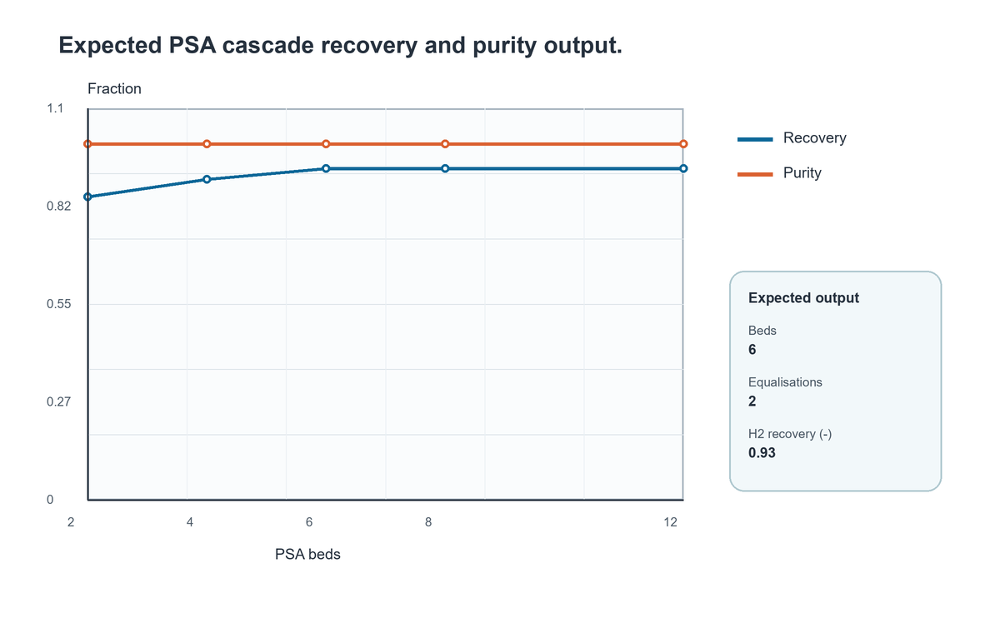
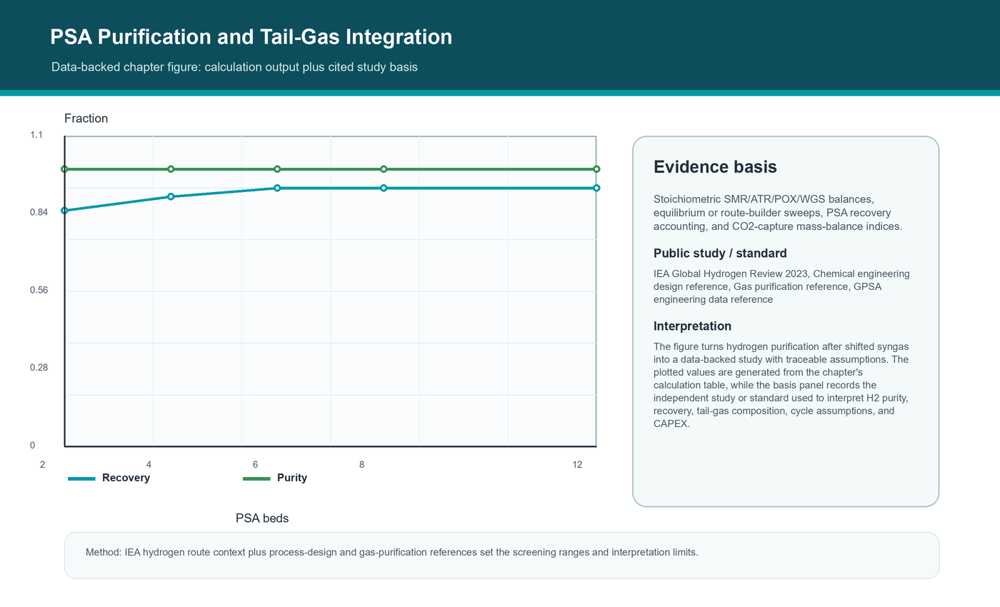

# PSA Purification and Tail-Gas Integration

<!-- Estimated pages: 18-26 -->

## Learning objectives

After this chapter you should be able to:

1. Explain how to use single-bed and cascade PSA models to purify H2 and return tail gas to the furnace.
2. Translate the topic into a reproducible NeqSim Python workflow.
3. Identify the dominant assumptions and sanity checks for hydrogen purification after shifted syngas.
4. Save a chapter-level artifact that can be reused in a hydrogen study.

## Prerequisites

Before reading this chapter the reader should be comfortable with:

- A working Python 3.10+ environment with NeqSim installed (see Chapter 0 and
  Chapter 3 for setup), and the ability to start a JVM from Python with
  `from neqsim import jneqsim as J`.
- The thermodynamic and fluid concepts introduced in Part II (Chapters 4-8):
  EOS choice, mixing rules, flash calculations, and the use of
  `initProperties()` after a flash.
- The general NeqSim object model from Chapter 2: `ThermodynamicSystem`,
  `Stream`, equipment classes, `ProcessSystem`, and the difference between
  a steady-state `run()` and a transient `runTransient()`.
- The reproducibility habits from Chapter 3: workspace-vs-installed mode,
  `results.json` outputs, and the fact that every code block in this book is
  marked `<!-- noexec -->` because it must be run by the reader in a
  controlled environment.

If any of the above feels unfamiliar, return to the indicated chapter; the
rest of this chapter assumes those habits are in place.

## Why this chapter matters

Use single-bed and cascade PSA models to purify H2 and return tail gas to the furnace. The practical setting is hydrogen purification after shifted syngas. In a desktop simulator this
kind of model often disappears into a case file. In this book it becomes a
Python-controlled object graph: fluids, streams, unit operations, calculations,
figures, and result summaries are all visible and versionable.

A hydrogen model is useful only when its boundary is explicit. The inlet composition,
water specification, utility assumptions, pressure levels, product specification, and
disposal route for by-products decide which equations are meaningful. NeqSim makes those
boundaries inspectable because every stream and unit operation is an object that can be
read, copied, serialized, and validated from Python.

The same calculation should be able to serve several audiences. A process engineer wants
mass and energy balances, a rotating-equipment engineer wants power and discharge
temperature, a safety engineer wants inventories and relief cases, and a project
engineer wants a cost range. The book therefore treats Python code as the common
workbench where these views are generated from one model rather than retyped into
separate spreadsheets.

Hydrogen adds its own modelling pressure. Molecules are light, diffusivity is
high, compression work is significant, embrittlement and leakage matter, and
small composition errors can move a product stream outside fuel-cell or pipeline
specifications. That is why the chapter keeps returning to three questions:
what is conserved, what is assumed, and what evidence should survive after the
notebook closes? \cite{towler2013chemical,seader2016,kohl1997,mokhatab2018,gpsa2012} \cite{iea2023hydrogen,irena2022greenhydrogen,buttler2018water,iso14687,iso22734}

## Conceptual model

The chapter model can be read as a five-step engineering calculation:

1. Define the material boundary and choose the thermodynamic basis.
2. Run the smallest equilibrium or unit-operation calculation that answers the
   question.
3. Compare the output against a physical lower or upper bound.
4. Convert the output to engineering KPIs: H2 purity, recovery, tail-gas composition, cycle assumptions, and CAPEX.
5. Save the model state, the figure, and the assumptions.

A generic material balance for a hydrogen unit is

$$
\dot n_{H2,out} = \dot n_{H2,in} + \nu_{H2} \xi - \dot n_{H2,loss}
$$

where $\xi$ is the reaction extent or electrochemical extent, and the loss term
captures tail gas, purge, venting, slip, or measurement closure. The important
habit is not the equation alone. The important habit is to identify where each
term appears in the NeqSim object model and to check it after every run.

For hydrogen systems the most dangerous errors are often quiet errors: a missing mixing
rule, transport properties read before initialization, water handled with an unsuitable
equation of state, a specific energy below the thermodynamic minimum, or a purification
recovery that hides hydrogen in the tail gas. Each chapter includes a short set of
sanity checks so the model teaches discipline as well as syntax.

## NeqSim capabilities used

This chapter uses or prepares for these capabilities:

| Capability | How it is used in the chapter |
|---|---|
| Thermodynamic system | Defines hydrogen-rich fluids, water, steam, CO2, and impurities. |
| Process equipment | Turns stream properties into material and energy balances. |
| Python orchestration | Runs parameter cases, figures, and evidence export. |
| Validation checks | Guards against non-physical specific energy, missing phases, or mass imbalance. |
| Reporting artifact | Captures a reusable output for the capstone studies. |

Specific NeqSim/Python surfaces and engineering references emphasized here: **PressureSwingAdsorptionBed, PSACascade, PSACostEstimate**.

## Literature-review topic calculation examples

The table below maps the requested blue, green, and frontier hydrogen literature
topics to calculation examples in the chapter where the physics and NeqSim
workflow fit best. Each row names the calculation to run, the input sweep that
makes it useful as a study example, and the KPIs that should appear in the
notebook output or discussion.

| Review list | No. | Topic | Calculation example placed here | Sweep or input basis | Output KPIs | Literature basis |
|---|---:|---|---|---|---|---|
| Blue hydrogen | 8 | Hydrogen purification and PSA optimization | Run a PSACascade bed-count and equalisation sweep on shifted syngas. | Number of beds, equalisation steps, recovery target, and tail-gas return assumption. | H2 purity, H2 recovery, tail-gas heating value index, PSA CAPEX index. | \cite{kohl1997,seader2016,gpsa2012} |


## Python workflow pattern

The code block below is intentionally compact. In a production notebook you
would split it into setup, input definition, run, checks, plotting, and
results.json cells. It is marked as a readable pattern: the named Java classes
were checked against the local NeqSim source tree when this book was generated,
but readers should still run the snippet against the exact branch they use.

<!-- noexec -->
```python
from neqsim import jneqsim as J

# Direct Java access through neqsim-python. Use explicit units and call
# setMixingRule before running flashes or process equipment.
syngas = J.thermo.system.SystemSrkEos(313.15, 28.0)
for name, moles in [("hydrogen", 0.72), ("CO2", 0.14), ("methane", 0.04), ("CO", 0.02), ("water", 0.08)]:
    syngas.addComponent(name, moles)
syngas.setMixingRule("classic")
feed = J.process.equipment.stream.Stream("shifted syngas", syngas)
feed.setFlowRate(10000.0, "kg/hr")

psa = J.process.equipment.adsorber.PSACascade("H2 PSA", feed)
psa.setConfiguration(J.process.equipment.adsorber.PSACascade.CascadeConfiguration.BEDS_8)
psa.setSorbent(J.process.equipment.adsorber.PressureSwingAdsorptionBed.SorbentType.ACTIVATED_CARBON)
psa.setPerBedRecoveryTarget(0.85)
psa.run()
print(psa.getH2Purity(), psa.getH2Recovery())
```

## Parameter study script, graph, and discussion

The chapter includes a runnable parameter-study notebook at `notebooks/parameter_study.ipynb`.
It takes the compact script above one step further: the notebook defines a sweep,
builds a results table, saves a CSV/JSON evidence bundle, and writes the graph
shown below. The values are either direct engineering calculations or normalized
study indices from cited public references and standards. Re-run the notebook on
the active NeqSim branch when project values or branch-specific APIs change.

**Calculation basis.** Stoichiometric SMR/ATR/POX/WGS balances, equilibrium or route-builder sweeps, PSA recovery accounting, and CO2-capture mass-balance indices.

**Study basis.** IEA hydrogen route context plus process-design and gas-purification references set the screening ranges and interpretation limits. \cite{iea2023hydrogen,towler2013chemical,kohl1997,gpsa2012}

| Beds | Equalisations | H2 recovery (-) | H2 purity (-) |
|---|---|---|---|
| 2 | 0 | 0.85 | 0.999 |
| 4 | 1 | 0.9 | 0.999 |
| 6 | 2 | 0.93 | 0.999 |
| 8 | 3 | 0.93 | 0.999 |
| 12 | 5 | 0.93 | 0.999 |



The PSA cells should show cascade recovery improving with bed count while purity remains high. Tail-gas flow is intentionally retained as a fuel-balance output rather than hidden in a single recovery number.

**Discussion.** The parameter study shows how hydrogen purification after shifted syngas responds when the controlling parameter changes. The important result is not a single base-case value; it is the shape of the response and the point where H2 purity, recovery, tail-gas composition, cycle assumptions, and CAPEX begin to trade against margin or cost.


## Notebook coverage: PSA purification

The purification notebook turns shifted syngas into a high-purity hydrogen
product and a tail-gas stream that is usually returned to the reformer furnace
as fuel. In this book the modelling surface is `PressureSwingAdsorptionBed` and
`PSACascade`, with `PSACostEstimate` for screening CAPEX.

The single most important number is hydrogen recovery. With molar hydrogen rates
in the feed and product, recovery is

$$
R_{H2} = \frac{\dot n_{H2,\,product}}{\dot n_{H2,\,feed}}
$$

and the hydrogen that is not recovered leaves in the tail gas:

$$
\dot n_{H2,\,tail} = \dot n_{H2,\,feed} - \dot n_{H2,\,product}
$$

Industrial PSA recovery typically falls in the 80-90 percent range while product
purity reaches 99.9 percent or better. The two targets trade against each other:
pushing purity higher usually lowers recovery, so the notebook should report
both, plus the tail-gas composition and heating value, because that tail gas
sets part of the furnace fuel balance and therefore the plant carbon intensity.

The physical-limit checks are simple but effective. Recovery must be between
zero and one, the product hydrogen rate cannot exceed the feed hydrogen rate,
and a component balance must close across product and tail gas. A model that
reports purity without recovery, or recovery above the feed hydrogen, is hiding
hydrogen and should not be used for a fuel or carbon balance.


## Extended notebook laboratory

The short code pattern above is the smallest working fragment. A serious
chapter notebook should be longer and more explicit. For hydrogen purification after shifted syngas, build the
notebook around the single/cascade PSA case, a recovery sensitivity case, and a tail-gas heating-value case. Keep the cells small enough that a reviewer can run
one section, inspect the state, and decide whether the next section is credible.
The objective is not to make the notebook decorative; it is to make the model
auditable.

| Notebook section | Purpose | Evidence to save |
|---|---|---|
| Input cell | Define composition, pressure, temperature, flow, technology, and standards basis. | A printed assumptions table with units. |
| Model cell | Create the NeqSim system, stream, unit operation, or process model. | The class names and setter values used. |
| Run cell | Execute the flash, unit operation, or `ProcessSystem`. | Convergence status and warning messages. |
| KPI cell | Extract H2 purity, recovery, tail-gas composition, cycle assumptions, and CAPEX. | A table with units and engineering labels. |
| Plot cell | Show the operating range, not just the base point. | PNG figure with axis labels and caption. |
| Check cell | Compare against bounds, standards, or reference equations. | Pass/warn/fail status with comments. |
| Export cell | Write the result into a dictionary or `results.json`. | A machine-readable artifact for reports. |

When expanding the notebook, start by turning the example into a function. The
function should take a small set of physical inputs and return a dictionary of
outputs. That one change makes the chapter useful for sensitivity studies,
optimization, uncertainty analysis, and automated reports. A good signature is
usually something like `run_case(feed, pressure, temperature, option)` rather
than a function with twenty unlabelled arguments. Put units in argument names or
docstrings, and return units in the result keys.

The first validation step is a balance check. For reacting and electrochemical
systems, the notebook should show where atoms or moles move. For compression
and pipeline systems, it should show mass-flow consistency. For purification,
it should show where hydrogen leaves the product boundary. For property-model
chapters, it should compare the calculated density or enthalpy to a reference
model or published data point. A model that has a plausible final number but no
traceable balance is not ready for reuse.

The second validation step is a physical-limit check. Examples include a
specific energy above the thermodynamic minimum for electrolysis, a compressor
discharge temperature below the material or seal limit, a PSA recovery inside
industrial ranges, a pipeline pressure above delivery pressure plus margin, or
a reaction result that moves in the correct direction when temperature,
pressure, or steam-to-carbon changes. This check is often more valuable than an
extra decimal place because it catches the wrong model before the final report
does.

The third validation step is a reference-case check. Use a simple published
benchmark, a notebook from a previous study, a known industrial range, or a
reference equation where available. In the hydrogen thermodynamics chapter this
means GERG-2008 and Leachman-style checks. In the reaction chapter it means
reaction extents, equilibrium direction, and heat-of-reaction signs. In the
transport chapter it means pressure drop and temperature profiles that respond
sensibly to diameter, roughness, ambient temperature, and flow rate. In the
materials chapter it means that the simulation outputs match the data fields a
material engineer actually needs.

A useful notebook also preserves negative results. If a flash fails, a reactor
does not converge, a compressor discharge temperature exceeds a limit, or a
pipeline case misses delivery pressure, write that down in the result table.
Failed cases are often more informative than successful ones because they mark
the edge of the operating envelope. The correct response is not to hide them;
the correct response is to make the failure reproducible and then decide
whether the model, input data, or process concept must change.

For PSA Purification and Tail-Gas Integration, a strong final cell should contain a compact executive table. It
should have one row for the base case, one row for the most conservative
technical case, and one row for the most favourable case. The table should
include H2 purity, recovery, tail-gas composition, cycle assumptions, and CAPEX, plus a note about the thermodynamic model, the process
configuration, and the quality of the input data. That table is the bridge from
the teaching notebook to an engineering decision.


The preferred workflow is deliberately repetitive. Define the fluid, set the units, run
the flash or process, initialize properties, extract a small number of engineering key
performance indicators, and save the evidence. Repetition is not a lack of
sophistication; it is the mechanism that makes complex models reviewable and reusable.

## Worked simulation study



**Calculation basis.** Stoichiometric SMR/ATR/POX/WGS balances, equilibrium or route-builder sweeps, PSA recovery accounting, and CO2-capture mass-balance indices.

**Public study or standard basis.** IEA hydrogen route context plus process-design and gas-purification references set the screening ranges and interpretation limits. \cite{iea2023hydrogen,towler2013chemical,kohl1997,gpsa2012}

**Discussion.** The figure turns hydrogen purification after shifted syngas into a data-backed study with traceable assumptions. The plotted values are generated from the chapter's calculation table, while the basis panel records the independent study or standard used to interpret H2 purity, recovery, tail-gas composition, cycle assumptions, and CAPEX. The physical mechanism behind the figure is
the coupling between equilibrium, transport, equipment performance, and
specification constraints. Hydrogen production is rarely a single calculation:
route chemistry sets purification load, purification losses affect heat balance,
electrolyzer voltage sets compression and cooling demand, and operating pressure
sets both linepack value and materials/safety attention. The engineering
implication is that the first chapter figure should already carry numbers,
units, and sources. It is not a sketch to decorate the chapter; it is the first
screening result that the later notebook can rerun and refine.

## Interpretation checklist

| Check | Expected behaviour | What to do if it fails |
|---|---|---|
| Material closure | Total mass error below 0.01 percent for steady-state examples. | Inspect disconnected streams, recycle convergence, and unit basis. |
| Energy sanity | Specific energy is above the thermodynamic minimum and within technology bands. | Recheck current, voltage, efficiency, pressure, and heat-duty sign. |
| Phase sanity | Phase count and water split match the process temperature and pressure. | Revisit EOS, mixing rule, water model, and property initialization. |
| Product quality | H2 purity and impurity limits match the intended market. | Add purification, drying, purge, or tighter recovery assumptions. |
| Evidence | KPIs, assumptions, and figures are saved with units. | Create a results.json entry before drawing conclusions. |

The examples use Python to orchestrate Java classes directly. This avoids the false
comfort of a narrow wrapper and exposes the same objects used by the NeqSim engine
itself. When a new class appears in NeqSim, a Python notebook can usually call it
immediately through jneqsim or ns.JClass, which is exactly what a fast-moving hydrogen
technology program needs.

## Advanced modelling notes

The next level of detail is to decide which simplifications are allowed to
remain in the model. For hydrogen purification after shifted syngas, a simple equilibrium or equipment block is
often enough to rank alternatives, but it is rarely enough to freeze a design.
The modelling lead should write down which variables are design variables,
which variables are operating variables, and which variables are uncertain
parameters. A pressure level, for example, may be a design variable in a concept
study, an operating variable in a dispatch model, and an uncertain parameter in
an early vendor comparison. The same NeqSim object can support all three views,
but the notebook should label the view clearly.

A good hydrogen model also separates thermodynamic uncertainty from process
configuration uncertainty. Thermodynamic uncertainty lives in EOS selection,
binary interaction parameters, impurity treatment, water handling, and transport
property correlations. Process configuration uncertainty lives in bed count,
compressor staging, heat recovery, reactor approach to equilibrium, current
density, plant availability, and control philosophy. Mixing these two categories
in one sensitivity table makes the result hard to interpret. Keep the first
screening table small, then add separate thermodynamic and process tables when
the decision becomes sensitive.

The most useful extension point in NeqSim is not a single class. It is the
combination of a transparent `ProcessSystem`, addressable variables through
`ProcessAutomation`, and Python loops that can run families of cases. Once the base
case for hydrogen purification after shifted syngas is converged, the next study can sweep feed composition,
pressure, recovery, cell voltage, catalyst activity, or ambient temperature
without copying the flowsheet by hand. This is how a teaching example becomes a
concept-selection engine.

When the model supports a project decision, every result should carry a quality
label. A classroom calculation may be labelled educational. A screening study
may be AACE Class 5 or Class 4. A pre-FEED study needs vendor data, design code
checks, process guarantees, and a documented uncertainty range. This chapter's
workflow is deliberately compatible with that escalation: the first notebook is
small, but it already contains the habits needed for a defensible larger study.

## Extending the simulation

| Extension | Why it matters | NeqSim/Python pattern |
|---|---|---|
| Composition sweep | Tests feedstock or product-spec sensitivity. | Clone the fluid, change mole fractions, run the same process. |
| Pressure-level sweep | Reveals compression, purification, and storage trade-offs. | Update stream or equipment pressure through setters or `ProcessAutomation`. |
| Technology comparison | Compares PEM, alkaline, SOEC, ATR, SMR, or PSA configurations. | Wrap each case in a function returning KPIs and assumptions. |
| Uncertainty case | Gives P10/P50/P90 style decision support. | Use Python sampling with a NeqSim run inside each iteration where practical. |
| Report package | Makes the calculation reviewable. | Save figures, results.json, assumptions, and validation checks together. |

The extension step should be conservative. Change one idea at a time until the
model response is understood. If two parameters must be changed together, write
that coupling down explicitly. For example, increasing electrolyzer pressure may
reduce downstream compression but can also change stack assumptions and cooling.
Increasing PSA recovery may raise hydrogen product flow but can lower tail-gas
heating value. Increasing reformer temperature may improve methane conversion
but can worsen tube duty, materials limits, and catalyst deactivation. The
simulation is the place where these trade-offs become visible.

For hydrogen purification after shifted syngas, a useful design-review plot has three properties. First, the axes
carry units and show the operating range rather than only the base point.
Second, at least one line or marker is tied to a physical limit: equilibrium,
specification, material temperature, maximum pressure, or a cost threshold.
Third, the caption explains what decision the plot supports. A beautiful plot
that does not support a decision belongs in a notebook scratchpad, not in the
engineering report.

The final extension is to make the model callable. A function that takes inputs
and returns a dictionary of KPIs can be used by a notebook, a command-line
script, a FastAPI endpoint, an optimizer, or a digital-twin loop. That is the
practical reason this book uses Python rather than screenshots: the model can
become infrastructure.

## Technical review prompts

Use these prompts when reviewing the chapter model with another engineer:

- What decision would change if H2 purity, recovery, tail-gas composition, cycle assumptions, and CAPEX moved by 10 percent?
- Which assumption is most likely to be wrong in the current data set?
- Which result is governed by thermodynamics, and which is governed by equipment
    configuration?
- Which unit operation should receive vendor data first?
- Which safety or standards check must be completed before the result leaves
    screening status?
- Can the notebook be rerun by another engineer without editing hidden paths or
    undocumented environment variables?

## Common modelling pitfalls

- Treating hydrogen as a generic light gas when the question depends on density,
  compression work, leakage, or cryogenic behaviour.
- Reading viscosity, thermal conductivity, or density after a flash without
  calling `initProperties()`.
- Comparing green and blue hydrogen only on stack or reactor efficiency while
  ignoring compression, purification, cooling, water, CO2, and capacity factor.
- Reporting product flow without checking where hydrogen leaves in tail gas,
  purge, vent, dissolved water, or inventory changes.
- Forgetting that early cost estimates are screening estimates until vendor
  data, installation factors, local execution strategy, and utilities are added.

## Exercises

1. Change the main pressure level and explain which KPI changes first.
2. Add one impurity or by-product and decide whether the selected EOS is still
   appropriate.
3. Create a small sensitivity table for one design variable and one operational
   variable.
4. Write a `results.json` object with at least five key results and two
   validation checks.
5. State what additional data would be needed before using this model for a
   design decision.

## Self-check questions

Use these short questions to test understanding before moving on. They are
designed to be answered from the chapter narrative without rerunning the
notebook.

1. Which physical quantity is conserved in the chapter's worked example, and
   where in the NeqSim object model is that conservation enforced?
2. Which two assumptions, if relaxed, would most change the chapter KPIs?
3. Which of the listed NeqSim capabilities is the most sensitive to EOS choice
   or mixing rule, and why?
4. What single sanity check would a reviewer run first on the worked figure?
5. If the reader had to defend the chapter result to a project gate, which
   piece of evidence (figure, table, results.json field, citation) would they
   point at first?

## What you should now be able to do

A reader who has worked through this chapter should be able to:

- Set up a NeqSim Python notebook that addresses hydrogen purification after shifted syngas with an explicit
  fluid, equipment block, run, and validation step.
- Identify the KPIs (H2 purity, recovery, tail-gas composition, cycle assumptions, and CAPEX) and report them with units and a screening band.
- Apply the interpretation checklist above to spot the most likely modelling
  errors before they propagate into a study report.
- Save a `results.json` artifact and a figure that another engineer can read
  without opening the notebook.

## Where to next

- For deeper thermodynamic foundations, return to Part II (Chapters 4-8).
- For an end-to-end view of how this chapter's result feeds the value chain,
  see Part VII Chapter 26 (capstone value-chain integration).
- For safety, materials, and operability implications of the modelling
  decisions made here, see Part V (Chapters 19-22).
- For automation, scenario sweeps, and digital-twin patterns that turn the
  chapter notebook into reusable infrastructure, see Chapter 23.

## Chapter summary

This chapter positioned hydrogen purification after shifted syngas inside a reproducible NeqSim workflow. The main
lesson is that hydrogen production simulation is not just chemistry or just
process equipment. It is the coupling of thermodynamics, reaction or
electrochemical extent, purification, compression, heat management, cost,
standards, and evidence. The next chapter keeps the same workflow and changes
the modelling lens.

## Portfolio artifact

Create a folder for this chapter with a notebook, the generated figure, and a
small `results.json` file. The artifact should be understandable without the
book open: inputs, method, units, key results, validation, and one engineering
recommendation.
