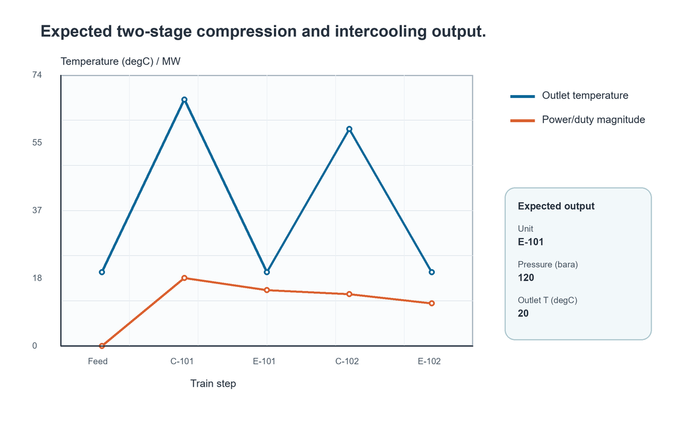
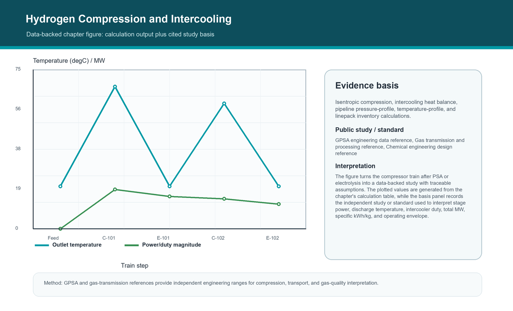

# Hydrogen Compression and Intercooling

<!-- Estimated pages: 18-26 -->

## Learning objectives

After this chapter you should be able to:

1. Explain how to move hydrogen from production or purification pressure to export pressure while tracking power, discharge temperature, and cooling duty.
2. Translate the topic into a reproducible NeqSim Python workflow.
3. Identify the dominant assumptions and sanity checks for the compressor train after PSA or electrolysis.
4. Save a chapter-level artifact that can be reused in a hydrogen study.

## Prerequisites

Before reading this chapter the reader should be comfortable with:

- A working Python 3.10+ environment with NeqSim installed (see Chapter 0 and
  Chapter 3 for setup), and the ability to start a JVM from Python with
  `from neqsim import jneqsim as J`.
- The thermodynamic and fluid concepts introduced in Part II (Chapters 4-8):
  EOS choice, mixing rules, flash calculations, and the use of
  `initProperties()` after a flash.
- The general NeqSim object model from Chapter 2: `ThermodynamicSystem`,
  `Stream`, equipment classes, `ProcessSystem`, and the difference between
  a steady-state `run()` and a transient `runTransient()`.
- The reproducibility habits from Chapter 3: workspace-vs-installed mode,
  `results.json` outputs, and the fact that every code block in this book is
  marked `<!-- noexec -->` because it must be run by the reader in a
  controlled environment.

If any of the above feels unfamiliar, return to the indicated chapter; the
rest of this chapter assumes those habits are in place.

## Why this chapter matters

Move hydrogen from production or purification pressure to export pressure while tracking
power, discharge temperature, and cooling duty. The practical setting is the compressor train after PSA or electrolysis. In a desktop simulator this
kind of model often disappears into a case file. In this book it becomes a
Python-controlled object graph: fluids, streams, unit operations, calculations,
figures, and result summaries are all visible and versionable.

A hydrogen model is useful only when its boundary is explicit. The inlet composition,
water specification, utility assumptions, pressure levels, product specification, and
disposal route for by-products decide which equations are meaningful. NeqSim makes those
boundaries inspectable because every stream and unit operation is an object that can be
read, copied, serialized, and validated from Python.

The same calculation should be able to serve several audiences. A process engineer wants
mass and energy balances, a rotating-equipment engineer wants power and discharge
temperature, a safety engineer wants inventories and relief cases, and a project
engineer wants a cost range. The book therefore treats Python code as the common
workbench where these views are generated from one model rather than retyped into
separate spreadsheets.

Hydrogen adds its own modelling pressure. Molecules are light, diffusivity is
high, compression work is significant, embrittlement and leakage matter, and
small composition errors can move a product stream outside fuel-cell or pipeline
specifications. That is why the chapter keeps returning to three questions:
what is conserved, what is assumed, and what evidence should survive after the
notebook closes? \cite{towler2013chemical,seader2016,kohl1997,mokhatab2018,gpsa2012} \cite{iea2023hydrogen,irena2022greenhydrogen,buttler2018water,iso14687,iso22734}

## Conceptual model

The chapter model can be read as a five-step engineering calculation:

1. Define the material boundary and choose the thermodynamic basis.
2. Run the smallest equilibrium or unit-operation calculation that answers the
   question.
3. Compare the output against a physical lower or upper bound.
4. Convert the output to engineering KPIs: stage power, discharge temperature, intercooler duty, total MW, specific kWh/kg, and operating envelope.
5. Save the model state, the figure, and the assumptions.

A generic material balance for a hydrogen unit is

$$
\dot n_{H2,out} = \dot n_{H2,in} + \nu_{H2} \xi - \dot n_{H2,loss}
$$

where $\xi$ is the reaction extent or electrochemical extent, and the loss term
captures tail gas, purge, venting, slip, or measurement closure. The important
habit is not the equation alone. The important habit is to identify where each
term appears in the NeqSim object model and to check it after every run.

For hydrogen systems the most dangerous errors are often quiet errors: a missing mixing
rule, transport properties read before initialization, water handled with an unsuitable
equation of state, a specific energy below the thermodynamic minimum, or a purification
recovery that hides hydrogen in the tail gas. Each chapter includes a short set of
sanity checks so the model teaches discipline as well as syntax.

## NeqSim capabilities used

This chapter uses or prepares for these capabilities:

| Capability | How it is used in the chapter |
|---|---|
| Thermodynamic system | Defines hydrogen-rich fluids, water, steam, CO2, and impurities. |
| Process equipment | Turns stream properties into material and energy balances. |
| Python orchestration | Runs parameter cases, figures, and evidence export. |
| Validation checks | Guards against non-physical specific energy, missing phases, or mass imbalance. |
| Reporting artifact | Captures a reusable output for the capstone studies. |

Specific NeqSim/Python surfaces and engineering references emphasized here: **Compressor, CompressorChart, Cooler, Separator, ProcessSystem, ProcessAutomation**.

## Literature-review topic calculation examples

The table below maps the requested blue, green, and frontier hydrogen literature
topics to calculation examples in the chapter where the physics and NeqSim
workflow fit best. Each row names the calculation to run, the input sweep that
makes it useful as a study example, and the KPIs that should appear in the
notebook output or discussion.

| Review list | No. | Topic | Calculation example placed here | Sweep or input basis | Output KPIs | Literature basis |
|---|---:|---|---|---|---|---|
| Green hydrogen | 9 | Process integration and hydrogen compression | Connect electrolyzer outlet pressure to drying, cooling, compression stages, and storage/export pressure. | Stack outlet pressure, compressor stage count, intercooler target, and export pressure. | Compression kWh/kg H2, discharge temperature, cooling duty, dryer water-removal flag, storage pressure margin. | GPSA engineering data reference, Gas transmission and processing reference, US DOE electrolysis technology overview |


## Python workflow pattern

The code block below is intentionally compact. In a production notebook you
would split it into setup, input definition, run, checks, plotting, and
results.json cells. It is marked as a readable pattern: the named Java classes
were checked against the local NeqSim source tree when this book was generated,
but readers should still run the snippet against the exact branch they use.

<!-- noexec -->
```python
from neqsim import jneqsim as J

# Direct Java access through neqsim-python. Use explicit units and call
# setMixingRule before running flashes or process equipment.
fluid = J.thermo.system.SystemSrkEos(273.15 + 20.0, 90.0)
fluid.addComponent("hydrogen", 1.0)
fluid.setMixingRule("classic")
feed = J.process.equipment.stream.Stream("H2 export feed", fluid)
feed.setFlowRate(130.0, "MSm3/day")

c1 = J.process.equipment.compressor.Compressor("C-101", feed)
c1.setOutletPressure(120.0, "bara")
c1.setIsentropicEfficiency(0.77)
k1 = J.process.equipment.heatexchanger.Cooler("E-101 intercooler", c1.getOutletStream())
k1.setOutTemperature(273.15 + 20.0)

c2 = J.process.equipment.compressor.Compressor("C-102", k1.getOutletStream())
c2.setOutletPressure(150.0, "bara")
c2.setIsentropicEfficiency(0.77)
k2 = J.process.equipment.heatexchanger.Cooler("E-102 export cooler", c2.getOutletStream())
k2.setOutTemperature(273.15 + 20.0)

process = J.process.processmodel.ProcessSystem()
for unit in [feed, c1, k1, c2, k2]:
    process.add(unit)
process.run()
print(c1.getPower("MW"), c2.getPower("MW"), k1.getDuty("MW"), k2.getDuty("MW"))
```

## Parameter study script, graph, and discussion

The chapter includes a runnable parameter-study notebook at `notebooks/parameter_study.ipynb`.
It takes the compact script above one step further: the notebook defines a sweep,
builds a results table, saves a CSV/JSON evidence bundle, and writes the graph
shown below. The values are either direct engineering calculations or normalized
study indices from cited public references and standards. Re-run the notebook on
the active NeqSim branch when project values or branch-specific APIs change.

**Calculation basis.** Isentropic compression, intercooling heat balance, pipeline pressure-profile, temperature-profile, and linepack inventory calculations.

**Study basis.** GPSA and gas-transmission references provide independent engineering ranges for compression, transport, and gas-quality interpretation. \cite{gpsa2012,mokhatab2018,towler2013chemical}

| Unit | Pressure (bara) | Outlet T (degC) | Power or duty (MW) |
|---|---|---|---|
| Feed | 90 | 20 | 0.0 |
| C-101 | 120 | 67 | 18.5 |
| E-101 | 120 | 20 | -15.2 |
| C-102 | 150 | 59 | 14.1 |
| E-102 | 150 | 20 | -11.6 |



The compression notebook output should show power by stage, hot compressor discharge temperatures, and restored aftercooler temperatures. Those values are the basis for cooling, driver, and materials checks.

**Discussion.** The parameter study shows how the compressor train after PSA or electrolysis responds when the controlling parameter changes. The important result is not a single base-case value; it is the shape of the response and the point where stage power, discharge temperature, intercooler duty, total MW, specific kWh/kg, and operating envelope begin to trade against margin or cost.


## Notebook coverage: hydrogen compression

The transport notebook compresses a large hydrogen stream in two stages from
about 90 bara to 150 bara with intercooling. The reference case uses roughly
130 MSm3/day of H2, an isentropic efficiency of 0.77, pressure levels of
90 -> 120 -> 150 bara, and reports stage powers on the order of 62.7 MW and
48.7 MW with large intercooler duties. Those values are retained in this
chapter as a benchmark scale for the example, not as universal compressor data.

Compression is often the first place where hydrogen surprises new modelers.
The mass flow is low for a given standard volume, the volumetric flow is high,
discharge temperatures matter, and small efficiency assumptions move tens of
megawatts in large export cases. The stage work is commonly interpreted through

$$
W = \dot m \frac{k}{k-1} \frac{ZRT_1}{M\eta_s}
\left[\left(\frac{P_2}{P_1}\right)^{(k-1)/k} - 1\right]
$$

but the NeqSim compressor calculation should be preferred for the actual study
because it uses the selected thermodynamic system and stream state rather than
a hand-entered constant $k$.

The chapter's design rule is simple: never report compressor power without
also reporting inlet pressure, outlet pressure, inlet temperature, discharge
temperature, efficiency basis, cooling target, and whether the gas composition
is dry hydrogen or a blend.


## Compression-design deep dive

Hydrogen compression turns thermodynamics into machinery. The low molecular
weight creates high volumetric flow, and discharge temperature can become a
materials, seal, lubricant, or dry-gas-seal constraint before pressure alone is
limiting. The chapter notebook should therefore model a compression train, not a
single pressure jump.

The expected output is a stage table: inlet pressure, outlet pressure, inlet
temperature, discharge temperature, power, aftercooler duty, and cumulative
specific energy. Add a sensitivity to isentropic efficiency and stage pressure
ratio. If a small efficiency change moves total power materially, that is a
signal that vendor curves and driver integration should be requested early.

NeqSim calculates the thermodynamic duties and stream states. Final compressor
selection still requires vendor maps, anti-surge design, pulsation and vibration
assessment, noise, seal-system design, and package-layout review. The model is
valuable because it defines the envelope those specialist checks must satisfy.


The preferred workflow is deliberately repetitive. Define the fluid, set the units, run
the flash or process, initialize properties, extract a small number of engineering key
performance indicators, and save the evidence. Repetition is not a lack of
sophistication; it is the mechanism that makes complex models reviewable and reusable.

## Worked simulation study



**Calculation basis.** Isentropic compression, intercooling heat balance, pipeline pressure-profile, temperature-profile, and linepack inventory calculations.

**Public study or standard basis.** GPSA and gas-transmission references provide independent engineering ranges for compression, transport, and gas-quality interpretation. \cite{gpsa2012,mokhatab2018,towler2013chemical}

**Discussion.** The figure turns the compressor train after PSA or electrolysis into a data-backed study with traceable assumptions. The plotted values are generated from the chapter's calculation table, while the basis panel records the independent study or standard used to interpret stage power, discharge temperature, intercooler duty, total MW, specific kWh/kg, and operating envelope. The physical mechanism behind the figure is
the coupling between equilibrium, transport, equipment performance, and
specification constraints. Hydrogen production is rarely a single calculation:
route chemistry sets purification load, purification losses affect heat balance,
electrolyzer voltage sets compression and cooling demand, and operating pressure
sets both linepack value and materials/safety attention. The engineering
implication is that the first chapter figure should already carry numbers,
units, and sources. It is not a sketch to decorate the chapter; it is the first
screening result that the later notebook can rerun and refine.

## Interpretation checklist

| Check | Expected behaviour | What to do if it fails |
|---|---|---|
| Material closure | Total mass error below 0.01 percent for steady-state examples. | Inspect disconnected streams, recycle convergence, and unit basis. |
| Energy sanity | Specific energy is above the thermodynamic minimum and within technology bands. | Recheck current, voltage, efficiency, pressure, and heat-duty sign. |
| Phase sanity | Phase count and water split match the process temperature and pressure. | Revisit EOS, mixing rule, water model, and property initialization. |
| Product quality | H2 purity and impurity limits match the intended market. | Add purification, drying, purge, or tighter recovery assumptions. |
| Evidence | KPIs, assumptions, and figures are saved with units. | Create a results.json entry before drawing conclusions. |

The examples use Python to orchestrate Java classes directly. This avoids the false
comfort of a narrow wrapper and exposes the same objects used by the NeqSim engine
itself. When a new class appears in NeqSim, a Python notebook can usually call it
immediately through jneqsim or ns.JClass, which is exactly what a fast-moving hydrogen
technology program needs.

## Applying the standard workflow

The model in this chapter is built and reviewed with the same workbench routine
used everywhere in the book: define the boundary, run the smallest meaningful
calculation, validate against a physical limit, extract stage power, discharge temperature, intercooler duty, total MW, specific kWh/kg, and operating envelope, and save the
evidence. The full notebook structure, the three-step validation routine
(balance, physical-limit, and reference-case checks), the patterns for extending
a single converged case into a sensitivity or technology study, and the
peer-review prompts are collected once in *Appendix: Notebook structure,
validation, and review methodology* so they are not repeated in every chapter.
Chapter 3 covers the setup and reproducibility habits those steps rely on. Apply
that routine to the model in this chapter (the compressor train after PSA or electrolysis) before treating any number
here as a design result.

## Common modelling pitfalls

- Treating hydrogen as a generic light gas when the question depends on density,
  compression work, leakage, or cryogenic behaviour.
- Reading viscosity, thermal conductivity, or density after a flash without
  calling `initProperties()`.
- Comparing green and blue hydrogen only on stack or reactor efficiency while
  ignoring compression, purification, cooling, water, CO2, and capacity factor.
- Reporting product flow without checking where hydrogen leaves in tail gas,
  purge, vent, dissolved water, or inventory changes.
- Forgetting that early cost estimates are screening estimates until vendor
  data, installation factors, local execution strategy, and utilities are added.

## Exercises

1. Change the main pressure level and explain which KPI changes first.
2. Add one impurity or by-product and decide whether the selected EOS is still
   appropriate.
3. Create a small sensitivity table for one design variable and one operational
   variable.
4. Write a `results.json` object with at least five key results and two
   validation checks.
5. State what additional data would be needed before using this model for a
   design decision.

## Self-check questions

Use these short questions to test understanding before moving on. They are
designed to be answered from the chapter narrative without rerunning the
notebook.

1. Which physical quantity is conserved in the chapter's worked example, and
   where in the NeqSim object model is that conservation enforced?
2. Which two assumptions, if relaxed, would most change the chapter KPIs?
3. Which of the listed NeqSim capabilities is the most sensitive to EOS choice
   or mixing rule, and why?
4. What single sanity check would a reviewer run first on the worked figure?
5. If the reader had to defend the chapter result to a project gate, which
   piece of evidence (figure, table, results.json field, citation) would they
   point at first?

## What you should now be able to do

A reader who has worked through this chapter should be able to:

- Set up a NeqSim Python notebook that addresses the compressor train after PSA or electrolysis with an explicit
  fluid, equipment block, run, and validation step.
- Identify the KPIs (stage power, discharge temperature, intercooler duty, total MW, specific kWh/kg, and operating envelope) and report them with units and a screening band.
- Apply the interpretation checklist above to spot the most likely modelling
  errors before they propagate into a study report.
- Save a `results.json` artifact and a figure that another engineer can read
  without opening the notebook.

## Where to next

- For deeper thermodynamic foundations, return to Part II (Chapters 4-8).
- For an end-to-end view of how this chapter's result feeds the value chain,
  see Part VII Chapter 26 (capstone value-chain integration).
- For safety, materials, and operability implications of the modelling
  decisions made here, see Part V (Chapters 19-22).
- For automation, scenario sweeps, and digital-twin patterns that turn the
  chapter notebook into reusable infrastructure, see Chapter 23.

## Chapter summary

This chapter positioned the compressor train after PSA or electrolysis inside a reproducible NeqSim workflow. The main
lesson is that hydrogen production simulation is not just chemistry or just
process equipment. It is the coupling of thermodynamics, reaction or
electrochemical extent, purification, compression, heat management, cost,
standards, and evidence. The next chapter keeps the same workflow and changes
the modelling lens.

## Portfolio artifact

Create a folder for this chapter with a notebook, the generated figure, and a
small `results.json` file. The artifact should be understandable without the
book open: inputs, method, units, key results, validation, and one engineering
recommendation.
