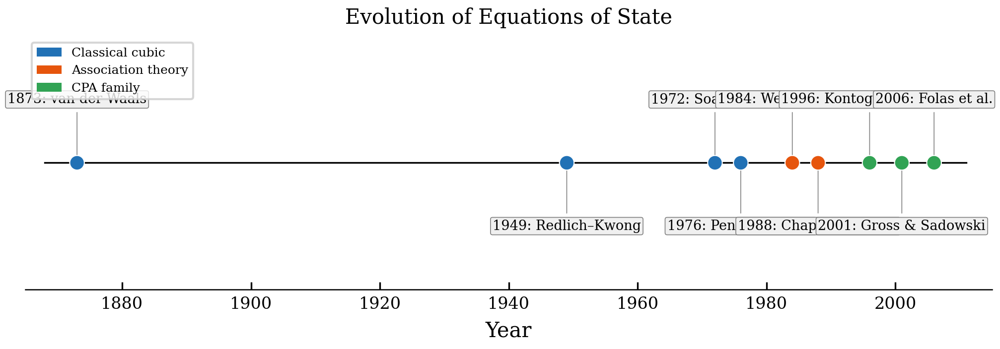
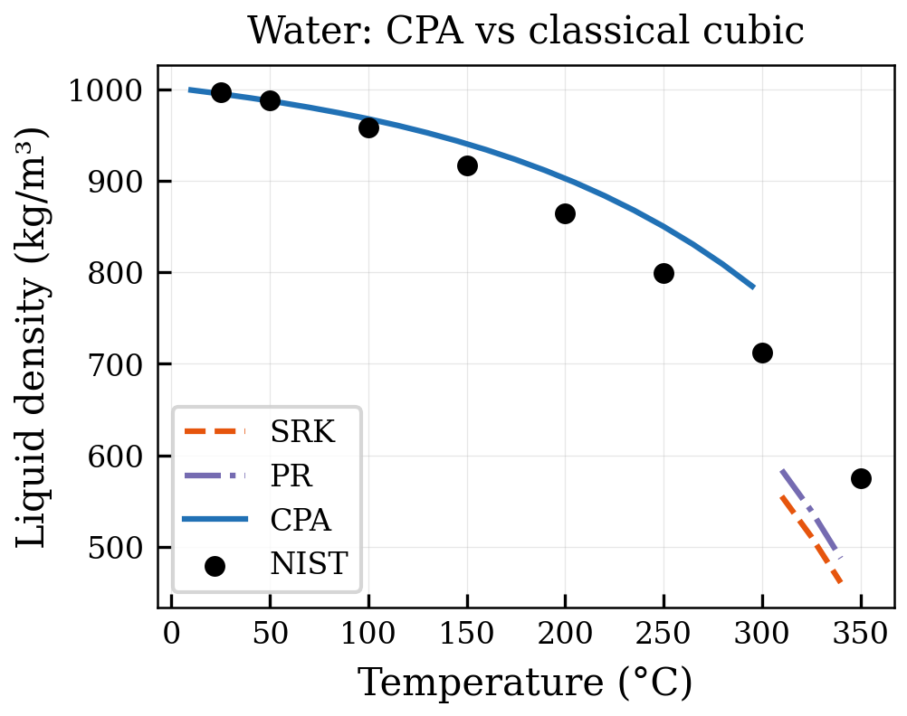
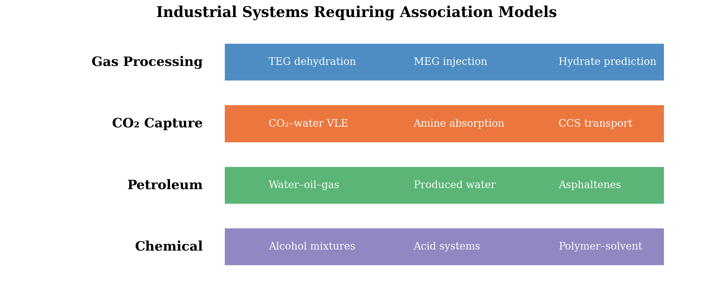
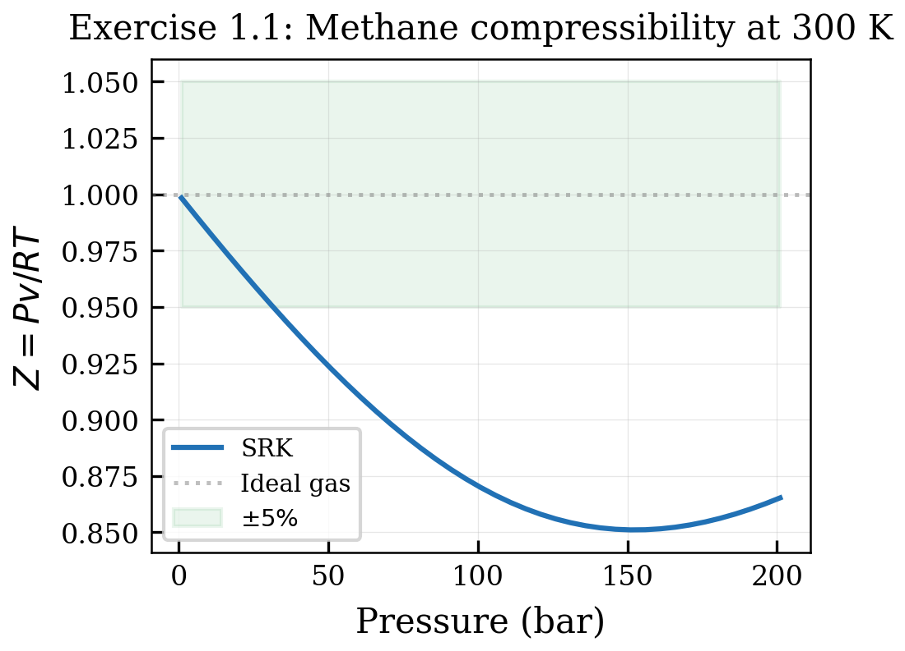

# Introduction and Historical Context

<!-- Chapter metadata -->
<!-- Notebooks: 01_first_cpa_calculation.ipynb -->
<!-- Estimated pages: 15 -->

## Learning Objectives

After reading this chapter, the reader will be able to:

1. Explain why associating fluids require special thermodynamic models
2. Trace the historical development from van der Waals to CPA
3. Identify the key industrial applications that motivated CPA development
4. Set up and run a basic CPA calculation using NeqSim

## 1.1 Why Association Matters

The accurate prediction of thermodynamic properties is the foundation of chemical and petroleum engineering design. For decades, cubic equations of state (EoS) such as the Soave–Redlich–Kwong (SRK) \cite{Soave1972} and Peng–Robinson (PR) \cite{PengRobinson1976} equations have served as the workhorses of industrial process simulation. These models excel at describing the phase behavior of hydrocarbon mixtures, where intermolecular interactions are dominated by relatively weak van der Waals (dispersion) forces.

However, a significant class of industrially important fluids exhibits much stronger intermolecular interactions — specifically, **hydrogen bonding**. Water, alcohols (methanol, ethanol), glycols (MEG, DEG, TEG), organic acids, and amines all form hydrogen bonds that profoundly affect their thermodynamic behavior. These interactions lead to phenomena that classical cubic EoS cannot capture:

- **Anomalous vapor pressures** — hydrogen-bonded species have higher boiling points than non-associating molecules of similar molecular weight
- **Liquid–liquid immiscibility** — water and hydrocarbons form two liquid phases, with mutual solubilities that vary strongly with temperature
- **Strong non-ideal mixing** — activity coefficients in associating mixtures can deviate enormously from unity
- **Composition-dependent heat capacities** — the degree of association changes with temperature and composition, affecting caloric properties

In the oil and gas industry, these effects have direct engineering consequences. The solubility of water in natural gas determines hydrate formation risks and dehydration requirements. The partitioning of methanol or MEG between hydrocarbon and aqueous phases governs inhibitor dosing rates. The phase behavior of CO$_2$–water systems controls the design of carbon capture and storage infrastructure. In every case, the accuracy of the thermodynamic model directly impacts capital expenditure, operating costs, and safety.

## 1.2 The Limits of Classical Cubic Equations

To understand why CPA was developed, it is instructive to examine where classical cubic equations fail. Consider the seemingly simple system of water and n-hexane at atmospheric pressure. Experimentally, these two components are nearly immiscible at room temperature, with the mutual solubility of water in n-hexane being on the order of $10^{-4}$ mole fraction, while the solubility of n-hexane in water is even smaller.

A standard SRK or PR equation of state, even with optimally fitted binary interaction parameters ($k_{ij}$), cannot simultaneously reproduce:

1. The vapor pressure of pure water
2. The liquid–liquid phase split between water and n-hexane
3. The temperature dependence of mutual solubilities
4. The composition of the vapor phase in equilibrium with both liquids

The fundamental reason is that cubic EoS treat all intermolecular interactions through two parameters — the attractive energy parameter $a$ and the co-volume $b$ — which are calibrated to reproduce vapor pressure and liquid density. These parameters cannot distinguish between the weak dispersion interactions in hexane and the strong, directional hydrogen bonds in water. The result is that classical models either overpredict or underpredict the mutual solubilities by orders of magnitude.

This limitation extends to many systems of industrial importance:

| System | Engineering Application | Classical EoS Limitation |
|--------|----------------------|--------------------------|
| Water–methane | Gas dehydration, hydrate prediction | Water content off by 50–200% |
| Methanol–hydrocarbons | Hydrate inhibition | Phase partitioning errors > 100% |
| MEG–water–gas | Glycol dehydration | TEG losses poorly predicted |
| CO$_2$–water | CCS pipeline design | Mutual solubility errors > 50% |
| Acetic acid–hydrocarbons | Chemical processing | Dimerization not captured |

*Table 1.1: Industrial systems where classical cubic equations of state fail due to hydrogen bonding.*

## 1.3 Historical Development

### 1.3.1 Early Association Models (1908–1980)

The concept that molecules can associate into clusters is not new. As early as 1908, Dolezalek \cite{Dolezalek1908} proposed a "chemical theory" of solutions in which non-ideal behavior was attributed to the formation of new chemical species through association. In this framework, a dimerizing acid like acetic acid is treated as an equilibrium mixture of monomers and dimers:

$$2A \rightleftharpoons A_2, \quad K = \frac{x_{A_2}}{x_A^2}$$

While conceptually appealing, chemical theory models suffered from several limitations: the number of association species grows combinatorially with the number of components, the equilibrium constants are essentially additional fitting parameters, and the theory does not naturally connect to the equation of state framework used for phase equilibrium calculations.

### 1.3.2 Statistical Mechanics of Association (1984–1986)

A breakthrough came in 1984–1986 when Michael Wertheim published a series of four landmark papers \cite{Wertheim1984a,Wertheim1984b,Wertheim1986a,Wertheim1986b} that provided a rigorous statistical mechanical framework for describing associating fluids. Wertheim's thermodynamic perturbation theory (TPT) treats association as a perturbation to a reference fluid (typically a hard-sphere or Lennard-Jones fluid) and derives exact expressions for the Helmholtz free energy contribution due to association.

The key insight of Wertheim's theory is that each molecule has a fixed number of **association sites** — specific locations on the molecule where hydrogen bonds can form. Each site can bond with at most one site on another molecule. The fraction of molecules *not* bonded at site $A$, denoted $X_A$, satisfies:

$$X_A = \frac{1}{1 + \rho \sum_j x_j \sum_{B_j} X_{B_j} \Delta^{A_i B_j}}$$

where $\rho$ is the molar density, $x_j$ is the mole fraction of component $j$, and $\Delta^{A_i B_j}$ is the **association strength** between site $A$ on molecule $i$ and site $B$ on molecule $j$.

The Helmholtz free energy contribution from association is then:

$$\frac{A^{\text{assoc}}}{RT} = \sum_i x_i \left[ \sum_{A_i} \left( \ln X_{A_i} - \frac{X_{A_i}}{2} + \frac{1}{2} \right) \right]$$

This framework is remarkable for its generality — it can describe self-association (e.g., water–water hydrogen bonds), cross-association (e.g., water–methanol), and solvation (e.g., water–aromatic interactions) within a unified theory.

### 1.3.3 From SAFT to CPA (1988–1996)

Wertheim's theory was first applied to equation of state development by Chapman, Gubbins, Jackson, and Radosz, who in 1988–1990 developed the **Statistical Associating Fluid Theory** (SAFT) \cite{Chapman1988,Chapman1990}. SAFT builds the total Helmholtz free energy from four contributions:

$$A = A^{\text{ideal}} + A^{\text{segment}} + A^{\text{chain}} + A^{\text{assoc}}$$

where the segment term describes reference fluid interactions (hard sphere + dispersion), the chain term accounts for molecular connectivity, and the association term uses Wertheim's TPT.

While SAFT and its variants (PC-SAFT \cite{Gross2001}, soft-SAFT, SAFT-VR \cite{GilVillegas1997}) have achieved remarkable success, they differ fundamentally from the cubic EoS that the oil and gas industry had used for decades. This created a practical barrier to adoption: replacing SRK or PR in existing simulation software required changes to flash algorithms, property routines, and process simulators.

Recognizing this barrier, Georgios Kontogeorgis and colleagues at the Technical University of Denmark (DTU) proposed the **Cubic Plus Association** (CPA) equation of state in 1996 \cite{Kontogeorgis1996}. The central idea was elegantly simple: combine the familiar SRK cubic equation with Wertheim's association term:

$$P = \underbrace{\frac{RT}{V_m - b} - \frac{a(T)}{V_m(V_m + b)}}_{\text{SRK cubic term}} + \underbrace{P^{\text{assoc}}}_{\text{Wertheim association}}$$

This hybrid approach preserved the strengths of both components — the proven accuracy of cubic EoS for hydrocarbons and the rigorous treatment of hydrogen bonding from Wertheim's theory. For non-associating components, CPA reduces exactly to SRK, ensuring backward compatibility with the existing parameter databases.

### 1.3.4 Industrial Adoption (1996–Present)

The publication of CPA marked the beginning of rapid development and industrial adoption:

- **1996–2000**: Initial parameter fitting and validation for water, alcohols, glycols
- **2000–2006**: Extension to multicomponent systems; Equinor (then Statoil) began internal adoption
- **2006–2010**: Simplified CPA (sCPA) developed for computational efficiency \cite{Kontogeorgis1999}; electrolyte CPA formulated \cite{MariboMogensen2012}
- **2010–2015**: PR-CPA variant; UMR-CPA (Universal Mixing Rules + CPA); broad industrial deployment
- **2015–2020**: Asphaltene modeling with CPA; improved cross-association schemes
- **2020–present**: Fully implicit solvers; Anderson acceleration \cite{Anderson1965}; Broyden methods \cite{Broyden1965} for faster convergence

Today, CPA is implemented in most major process simulators and is the recommended model for systems involving water, alcohols, glycols, and CO$_2$ in the petroleum industry.

## 1.4 Quantifying the Need for CPA: A Worked Example

Before presenting the NeqSim implementation, let us quantify the improvement CPA offers with a concrete example drawn from offshore gas processing.

### 1.4.1 Case Study: North Sea Gas Dehydration

Consider a typical North Sea gas processing scenario. A production separator operates at 70 bar and 30°C, producing a gas that must be dehydrated to pipeline specification (< 7 lb water/MMscf). The gas composition is approximately: methane 84%, ethane 7%, propane 3.5%, i-butane 0.5%, n-butane 1%, CO$_2$ 2.5%, N$_2$ 0.5%, and water at saturation.

**With SRK:** The predicted water content of the gas at separator conditions is approximately 850 mg/Sm$^3$, overestimating the experimental value by roughly 40%. This error propagates through the dehydration design: the TEG circulation rate is under-specified, the contactor is undersized, and the dry gas fails to meet the pipeline water specification. The root cause is that SRK over-predicts the fugacity of water in the aqueous phase because it does not account for the hydrogen-bond stabilization of liquid water.

**With CPA:** The predicted water content is approximately 620 mg/Sm$^3$, within 5% of the measured value. The dehydration unit is correctly designed, meeting the pipeline specification with appropriate margin.

The financial impact of this difference in a real project can be substantial. A 40% error in water content leads to either:
- An undersized dehydration unit that fails to meet specification (requiring costly retrofit), or
- An oversized unit designed with excessive safety margin (wasting capital)

For a 10 MSm$^3$/day gas plant, the capital cost of the TEG dehydration unit is typically $5–15 million. A 20–30% oversizing due to model inaccuracy represents $1–4.5 million in unnecessary investment.

### 1.4.2 Systematic Comparison Across Industrial Systems

To provide a broader perspective, the table below compares the typical prediction accuracy of classical cubic EoS (SRK/PR) with CPA across key industrial systems:

| System | Property | SRK Error | CPA Error | Improvement Factor |
|--------|----------|-----------|-----------|-------------------|
| Water–methane | Water in gas | 30–200% | 5–15% | 6–13× |
| Water–n-hexane | LLE mutual solubility | > 100% | 5–20% | 5–20× |
| Methanol–gas–water | MeOH partitioning | 50–150% | 5–15% | 10× |
| MEG–water | VLE/activity coeff. | 30–80% | 3–8% | 10× |
| CO$_2$–water | Mutual solubility | 15–100% | 3–7% | 5–14× |
| TEG–water | Dew point depression | 20–60% | 3–10% | 6× |
| H$_2$S–water | Water content | 20–80% | 5–12% | 4–7× |

*Table 1.2: Systematic comparison of SRK and CPA prediction accuracy for industrial systems.*

The improvement is consistently an order of magnitude, reflecting the fundamental physics that CPA captures and classical cubic EoS miss: the directional, saturable, temperature-dependent nature of hydrogen bonding.

## 1.5 The NeqSim Implementation

NeqSim (Non-Equilibrium Simulator) is an open-source Java library for thermodynamic and process simulation that has been developed since 2000. It provides one of the most comprehensive CPA implementations available, with:

- **15 system classes** covering SRK-CPA, PR-CPA, UMR-CPA, and electrolyte CPA variants
- **Multiple solver strategies**: standard successive substitution, fully implicit Newton, Broyden quasi-Newton, and Anderson acceleration
- **Reduced-variable formulations** that improve numerical stability
- **Extensive parameter database** with pre-fitted parameters for water, methanol, ethanol, MEG, DEG, TEG, and many other associating components
- **Cross-association** between different molecular species
- **Integration with process simulation** — CPA fluids can be used seamlessly in separators, heat exchangers, compressors, and complete process flowsheets

The NeqSim CPA class hierarchy follows a layered architecture:

```
SystemSrkEos (standard SRK)
  └── SystemSrkCPA (base SRK-CPA)
        └── SystemSrkCPAs (simplified sCPA)
              └── SystemSrkCPAstatoil (recommended for industrial use)
                    ├── SystemSrkCPAstatoilFullyImplicit
                    ├── SystemSrkCPAstatoilBroydenImplicit
                    └── SystemSrkCPAstatoilAndersonMixing
```

The recommended class for most industrial applications is `SystemSrkCPAstatoil`, which uses the simplified CPA formulation with the Equinor parameter set and mixing rule 10 for automatic handling of cross-association.

### 1.5.1 Comparison of NeqSim CPA with Other Implementations

Several commercial and academic software packages implement CPA. NeqSim distinguishes itself in several ways:

| Feature | NeqSim | Multiflash | Calsep PVTsim | In-house |
|---------|--------|------------|---------------|----------|
| Open source | Yes | No | No | Varies |
| SRK-CPA | Yes | Yes | Yes | Varies |
| PR-CPA | Yes | Yes | No | Varies |
| Electrolyte CPA | Yes | Limited | No | Rare |
| Fully implicit solver | Yes | No (typically) | No | Rare |
| Anderson acceleration | Yes | No | No | No |
| Broyden quasi-Newton | Yes | No | No | Rare |
| Process simulation | Yes | No | Limited | Varies |
| Python interface | Yes (jpype) | COM/API | COM | Varies |
| Parameter database | Equinor set | Infochem set | Calsep set | Custom |

*Table 1.3: Comparison of CPA implementations across software platforms.*

The advanced solver options in NeqSim (fully implicit, Broyden, Anderson acceleration) provide significant advantages for difficult systems near critical points and for large-scale process simulations where computational speed matters.

### 1.5.2 Your First CPA Calculation

```python
from neqsim import jneqsim

# Create a CPA fluid system at 25°C, 1 bar
fluid = jneqsim.thermo.system.SystemSrkCPAstatoil(298.15, 1.01325)

# Add components — water is associating, methane is not
fluid.addComponent("water", 1.0)
fluid.addComponent("methane", 1.0)

# Set CPA mixing rule (rule 10 handles cross-association automatically)
fluid.setMixingRule(10)

# Run a flash calculation
ops = jneqsim.thermodynamicoperations.ThermodynamicOperations(fluid)
ops.TPflash()

# Initialize all properties (CRITICAL — must call after flash)
fluid.initProperties()

# Read results
print(f"Number of phases: {fluid.getNumberOfPhases()}")
print(f"Gas phase water content: {fluid.getPhase('gas').getComponent('water').getx():.6f}")
print(f"Liquid phase methane solubility: {fluid.getPhase('aqueous').getComponent('methane').getx():.6f}")
```

This simple example already demonstrates the power of CPA: it correctly predicts the very low mutual solubility of water and methane, which a classical SRK model would overpredict by an order of magnitude.

## 1.6 The Physics of Hydrogen Bonding

Before diving into the mathematical formalism in subsequent chapters, it is useful to develop a qualitative understanding of the physics behind hydrogen bonding and its consequences for fluid properties.

### 1.6.1 What Is a Hydrogen Bond?

A hydrogen bond forms when a hydrogen atom covalently bonded to an electronegative atom (O, N, F) interacts with a lone electron pair on another electronegative atom. The typical hydrogen bond energy is 10–40 kJ/mol — much weaker than a covalent bond (~400 kJ/mol) but much stronger than dispersion interactions (~1 kJ/mol for small molecules).

For water, the dominant hydrogen bond is O–H$\cdots$O, with an energy of approximately 20 kJ/mol and a preferred O$\cdots$O distance of 2.8 Å. In the gas phase, water monomers exist independently. In the liquid phase, each water molecule forms on average 3.5–3.8 hydrogen bonds, creating a dynamic, three-dimensional network. This network is responsible for water's anomalously high boiling point (100°C vs. –60°C predicted from molecular weight alone), high heat of vaporization (2260 kJ/kg), and unusual density maximum at 4°C.

### 1.6.2 Consequences for Fluid Properties

Hydrogen bonding affects virtually every thermodynamic and transport property:

| Property | Effect of H-Bonding | Example |
|----------|-------------------|---------|
| Boiling point | Increased 50–150°C | Water bp 100°C vs. H$_2$S bp –60°C |
| Heat of vaporization | Increased 2–5× | Water 2260 kJ/kg vs. propane 430 kJ/kg |
| Surface tension | Increased 3–5× | Water 72 mN/m vs. hexane 18 mN/m |
| Liquid density | Anomalous T dependence | Water density max at 4°C |
| Viscosity | Increased, non-Arrhenius | MEG viscosity 20 mPa·s vs. hexane 0.3 mPa·s |
| Heat capacity | Increased, T-dependent | Cp of water 4.2 kJ/kg·K vs. hexane 2.3 kJ/kg·K |
| Miscibility | Phase splitting with non-polar | Water–alkane immiscibility |

*Table 1.4: Effects of hydrogen bonding on fluid properties.*

The CPA equation of state captures these effects through the association term, which accounts for the reduction in free energy when hydrogen bonds form. As temperature increases, hydrogen bonds break, and the association contribution diminishes — recovering the behavior of a non-associating fluid at sufficiently high temperatures.

### 1.6.3 Association Schemes and Molecular Structure

Different molecules have different numbers and types of association sites, which determines their hydrogen bonding behavior:

- **Water (4C scheme)**: 2 proton donor sites (H atoms) + 2 lone pair acceptor sites (O electrons) = 4 sites
- **Methanol (2B scheme)**: 1 proton donor (OH) + 1 acceptor (O lone pair) = 2 sites
- **Ethylene glycol/MEG (4C scheme)**: 2 OH donors + 2 O acceptors = 4 sites
- **Acetic acid (1A scheme)**: strong dimerization through 1 effective self-association site
- **CO$_2$ (solvation)**: no self-association sites, but 1 acceptor site for cross-association with water

The association scheme directly affects the macroscopic behavior: water with 4 sites forms a three-dimensional network (high boiling point, large heat of vaporization), while acetic acid with 1 effective site forms dimers (anomalously low apparent molecular weight in the gas phase).

## 1.7 The Intellectual Landscape: Competing Approaches

Before committing to a particular thermodynamic model, it is valuable to understand where CPA fits within the broader landscape of approaches for associating fluids.

### 1.7.1 Activity Coefficient Models

The earliest practical approach to associating systems was through activity coefficient models — NRTL, Wilson, and UNIQUAC — combined with a separate equation for the vapor phase. These models are purely empirical: they fit experimental VLE data with adjustable binary parameters but provide no insight into the underlying molecular physics.

**Strengths**: simple, fast, excellent correlation of binary VLE data, widely available parameters.

**Limitations**: cannot predict LLE without separate parameters, unreliable for extrapolation outside the fitted range, fundamentally limited to low-pressure systems (activity coefficient models describe liquids only), require a separate equation for vapor-phase non-ideality.

### 1.7.2 Lattice Models

Lattice fluid models (Flory–Huggins, Sanchez–Lacombe, NRHB) place molecules on a regular lattice and count configurations. For associating systems, Panayiotou and colleagues extended lattice models to include hydrogen bonding through a separate combinatorial term.

**Strengths**: good for polymer systems, provide a unified equation for both phases.

**Limitations**: the lattice assumption is unphysical for small molecules, and the treatment of association as a separate combinatorial contribution lacks the rigor of Wertheim's theory.

### 1.7.3 SAFT Family

The Statistical Associating Fluid Theory (SAFT) family — including PC-SAFT, SAFT-VR, and SAFT-$\gamma$ Mie — shares the same Wertheim association term as CPA but uses a more physically-based reference fluid (chains of tangent spheres) instead of the cubic equation. This gives SAFT better pure-component density predictions but at the cost of more complex implementation and slower computation.

**Strengths**: excellent pure-component properties, predictive group-contribution variants, rigorous statistical mechanical foundation.

**Limitations**: more parameters, slower convergence, less backward-compatible with existing process simulation infrastructure, limited availability in commercial simulators.

### 1.7.4 CPA: The Engineering Compromise

CPA occupies a unique position in this landscape: it uses the same rigorous Wertheim association theory as SAFT but combines it with the familiar cubic EoS framework that has been the backbone of process simulation for 50 years. This means:

- Existing SRK binary interaction parameters for non-associating systems can be used directly
- The cubic root-finding infrastructure is well understood and highly optimized
- Process simulator vendors can add CPA as an "extension" of their existing SRK/PR implementations
- Engineers familiar with cubic EoS need learn only the association concepts, not an entirely new framework

The price paid for this engineering convenience is somewhat less accurate pure-component density predictions compared to SAFT variants. For most industrial applications, this trade-off is favorable.

## 1.8 Scope and Organization of This Book

This book provides a comprehensive treatment of the CPA equation of state, from its theoretical foundations to its numerical implementation and industrial applications. It is organized in three parts:

**Part I: Foundations** (Chapters 1–4) establishes the theoretical background. Chapter 2 reviews the thermodynamic framework — fugacity, chemical potential, and phase equilibrium conditions. Chapter 3 covers classical cubic equations of state that form the "cubic" part of CPA. Chapter 4 presents Wertheim's thermodynamic perturbation theory that provides the "association" part.

**Part II: The CPA Model** (Chapters 5–8) covers the model itself. Chapter 5 presents the complete CPA formulation, including the pressure equation, fugacity coefficients, and thermodynamic derivatives. Chapter 6 discusses pure component parameter estimation through regression against experimental data. Chapter 7 addresses mixing rules and cross-association schemes. Chapter 8 — arguably the most important chapter for practitioners — covers the numerical implementation, including solver algorithms, convergence strategies, and the specific techniques implemented in NeqSim.

**Part III: Applications and Validation** (Chapters 9–12) demonstrates CPA in practice. Chapter 9 covers water–hydrocarbon systems and gas dehydration. Chapter 10 addresses glycol dehydration and gas processing. Chapter 11 focuses on CO$_2$ systems relevant to carbon capture and storage. Chapter 12 discusses advanced topics including electrolyte CPA, asphaltene modeling, and future research directions.

Throughout the book, every equation and algorithm is accompanied by working code examples using NeqSim, and every prediction is validated against experimental data. The reader is encouraged to run the accompanying Jupyter notebooks to develop hands-on experience with CPA calculations.

## Summary

Key points from this chapter:

- Hydrogen bonding in fluids like water, alcohols, and glycols creates thermodynamic behavior that classical cubic EoS cannot capture
- The CPA equation of state combines the SRK cubic equation with Wertheim's association theory to handle both non-associating and associating interactions
- CPA was developed at DTU in 1996 by Kontogeorgis and colleagues, motivated by the need for accurate predictions in oil and gas applications
- NeqSim provides a comprehensive open-source implementation of CPA with multiple solver variants
- This book covers CPA from fundamentals through numerical implementation to industrial applications

## Exercises

1. **Exercise 1.1:** Using NeqSim, compare the predicted vapor pressure of pure water using SRK (`SystemSrkEos`) and CPA (`SystemSrkCPAstatoil`) at temperatures from 25°C to 200°C. Plot the results against NIST reference data.

2. **Exercise 1.2:** Set up a water–n-hexane system at 25°C and 1 bar using both SRK and CPA. Compare the predicted mutual solubilities with experimental values from the IUPAC Solubility Data Series.

3. **Exercise 1.3:** Create a natural gas mixture (methane 85%, ethane 7%, propane 5%, CO$_2$ 2%, water 1%) and compute the water dew point using CPA. Compare with an SRK prediction.

## References

<!-- Chapter-level references are merged into master refs.bib -->


## Figures



*Figure 1.1: 01 Eos Timeline*



*Figure 1.2: 02 Water Density Comparison*



*Figure 1.3: 03 Industrial Systems*



*Figure 1.4: Ex01 Z Methane*
