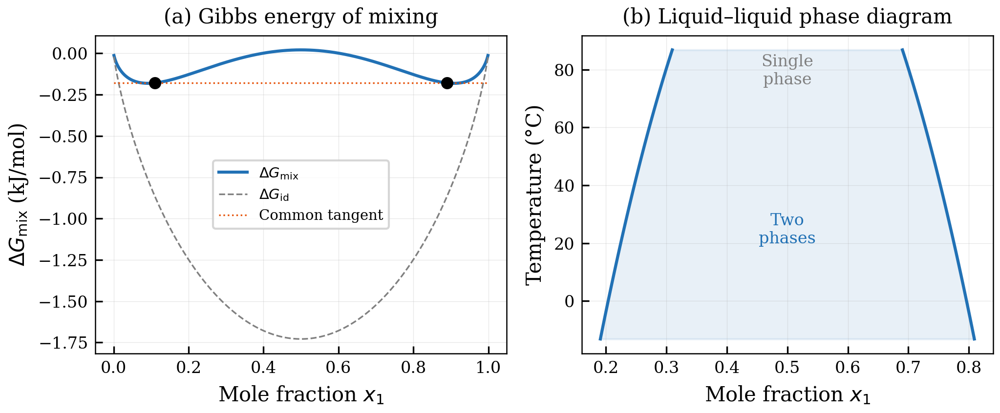
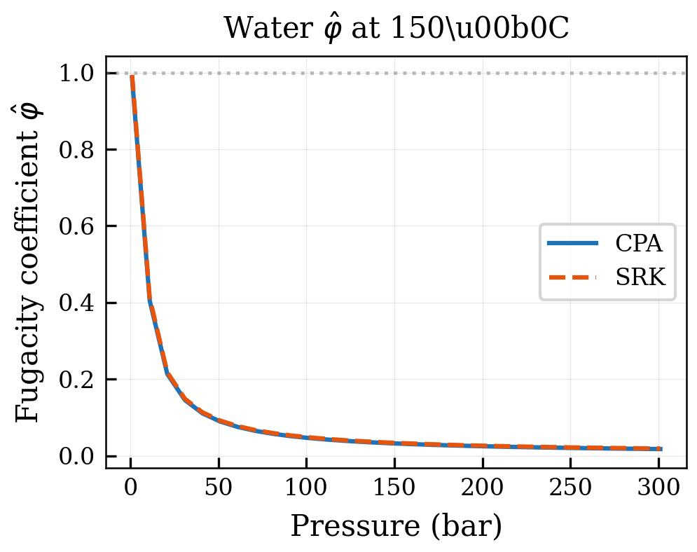
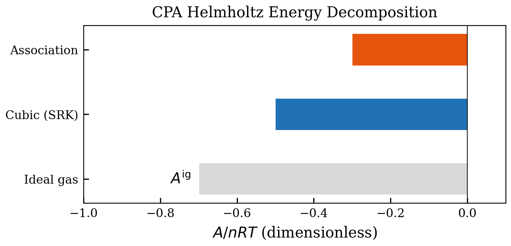
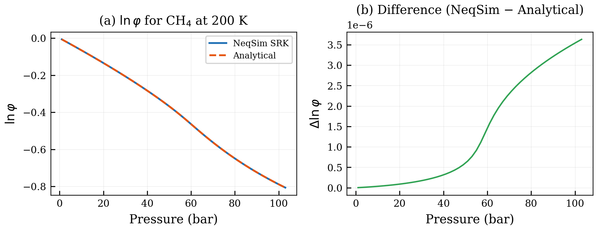
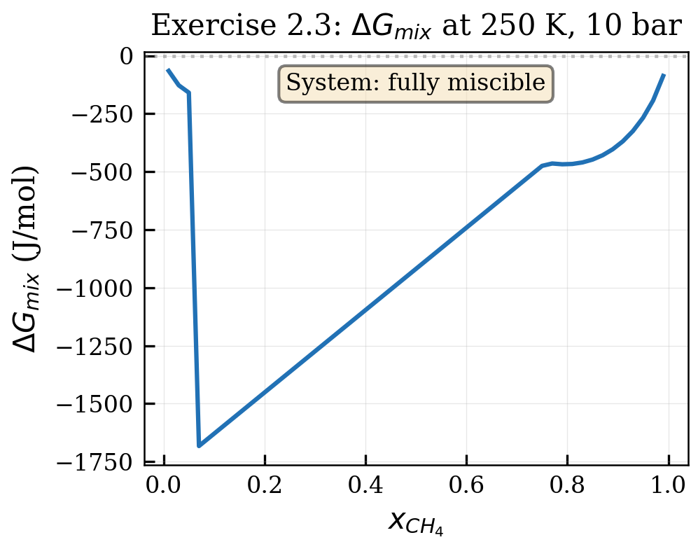

# Thermodynamic Foundations

<!-- Chapter metadata -->
<!-- Notebooks: 01_fugacity_calculation.ipynb, 02_phase_equilibrium.ipynb -->
<!-- Estimated pages: 18 -->

## Learning Objectives

After reading this chapter, the reader will be able to:

1. Derive the conditions for thermodynamic equilibrium from the Gibbs energy
2. Relate fugacity and fugacity coefficients to equations of state
3. Formulate the phase equilibrium problem for vapor–liquid and liquid–liquid systems
4. Compute fugacity coefficients from pressure-explicit equations of state using NeqSim

## 2.1 Fundamental Thermodynamic Relations

Before presenting the CPA equation of state, we must establish the thermodynamic framework within which it operates. This chapter reviews the essential concepts of chemical potential, fugacity, and phase equilibrium that underpin all equation of state calculations \cite{Prausnitz1999,SmithVanNess2005,Tester1997}.

### 2.1.1 The Gibbs Energy and Chemical Potential

For a multicomponent system at constant temperature $T$ and pressure $P$, the Gibbs energy is the fundamental potential:

$$G = G(T, P, n_1, n_2, \ldots, n_c)$$

where $n_i$ is the number of moles of component $i$ and $c$ is the number of components. The **chemical potential** of component $i$ is defined as the partial molar Gibbs energy:

$$\mu_i = \left( \frac{\partial G}{\partial n_i} \right)_{T,P,n_{j \neq i}}$$

The total Gibbs energy can be written as:

$$G = \sum_{i=1}^{c} n_i \mu_i$$

and the Gibbs–Duhem equation constrains the chemical potentials:

$$\sum_{i=1}^{c} n_i \, d\mu_i = -S \, dT + V \, dP$$

At constant temperature and pressure, this simplifies to:

$$\sum_{i=1}^{c} n_i \, d\mu_i = 0$$

which is a crucial consistency check for any thermodynamic model.

### 2.1.2 Fugacity and the Fugacity Coefficient

While the chemical potential is the thermodynamically rigorous quantity, it has the inconvenience of approaching $-\infty$ as the concentration of a component approaches zero. \cite{Lewis1901} introduced the **fugacity** $f_i$ as an alternative measure that behaves like a corrected partial pressure:

$$\mu_i = \mu_i^0 + RT \ln \frac{f_i}{f_i^0}$$

The fugacity has units of pressure and is defined such that it equals the partial pressure for an ideal gas:

$$\lim_{P \to 0} \frac{f_i}{y_i P} = 1$$

The **fugacity coefficient** $\varphi_i$ is defined as the ratio of fugacity to the product of mole fraction and pressure \cite{Poling2001}:

$$\varphi_i = \frac{f_i}{x_i P}$$

For an ideal gas, $\varphi_i = 1$. Deviations from unity reflect intermolecular interactions. The fugacity coefficient is related to the equation of state through:

$$\ln \varphi_i = \frac{1}{RT} \int_V^{\infty} \left[ \left( \frac{\partial P}{\partial n_i} \right)_{T,V,n_{j \neq i}} - \frac{RT}{V} \right] dV - \ln Z$$

where $Z = PV/(nRT)$ is the compressibility factor. This integral is the fundamental connection between an equation of state and phase equilibrium calculations — every equation of state must provide $(\partial P/\partial n_i)_{T,V}$ to be useful for phase equilibrium.

## 2.2 Phase Equilibrium Conditions

### 2.2.1 The Equilibrium Criterion

A closed system at constant $T$ and $P$ reaches equilibrium when the total Gibbs energy is minimized. For a system with $\pi$ phases, this leads to the conditions:

$$T^{(1)} = T^{(2)} = \cdots = T^{(\pi)} \quad \text{(thermal equilibrium)}$$

$$P^{(1)} = P^{(2)} = \cdots = P^{(\pi)} \quad \text{(mechanical equilibrium)}$$

$$\mu_i^{(1)} = \mu_i^{(2)} = \cdots = \mu_i^{(\pi)} \quad \text{(chemical equilibrium, } i = 1, \ldots, c\text{)}$$

In terms of fugacities, the chemical equilibrium condition becomes:

$$f_i^{(1)} = f_i^{(2)} = \cdots = f_i^{(\pi)} \quad \text{for all } i$$

or equivalently in terms of fugacity coefficients:

$$x_i^{(1)} \varphi_i^{(1)} = x_i^{(2)} \varphi_i^{(2)} = \cdots \quad \text{for all } i$$

### 2.2.2 Vapor–Liquid Equilibrium (VLE)

For a two-phase vapor–liquid system, the equilibrium condition gives:

$$y_i \varphi_i^V = x_i \varphi_i^L \quad \text{for } i = 1, \ldots, c$$

The **K-factor** or equilibrium ratio is:

$$K_i = \frac{y_i}{x_i} = \frac{\varphi_i^L}{\varphi_i^V}$$

These K-factors are the central quantities in flash calculations, which determine the amounts and compositions of coexisting phases at given conditions.

### 2.2.3 Liquid–Liquid Equilibrium (LLE)

For liquid–liquid systems — of particular importance for CPA applications involving water and hydrocarbons — the equilibrium condition is:

$$x_i^{L1} \varphi_i^{L1} = x_i^{L2} \varphi_i^{L2} \quad \text{for } i = 1, \ldots, c$$

LLE calculations are often more numerically challenging than VLE because the two liquid phases can have very different compositions (e.g., water-rich vs. hydrocarbon-rich) and the objective function has multiple local minima.

### 2.2.4 Three-Phase Equilibrium (VLLE)

Many systems relevant to CPA applications exhibit three-phase vapor–liquid–liquid equilibrium (VLLE). For example, a natural gas–water system at moderate pressures can have a vapor phase, a hydrocarbon-rich liquid phase, and a water-rich liquid phase coexisting simultaneously.

The equilibrium conditions are:

$$f_i^V = f_i^{L1} = f_i^{L2} \quad \text{for all } i$$

NeqSim handles multi-phase equilibrium through the Michelsen stability analysis and successive flash calculations:

```python
from neqsim import jneqsim

# Three-phase system: methane + n-hexane + water
fluid = jneqsim.thermo.system.SystemSrkCPAstatoil(298.15, 50.0)
fluid.addComponent("methane", 0.6)
fluid.addComponent("n-hexane", 0.3)
fluid.addComponent("water", 0.1)
fluid.setMixingRule(10)

# Enable multi-phase check
fluid.setMultiPhaseCheck(True)

ops = jneqsim.thermodynamicoperations.ThermodynamicOperations(fluid)
ops.TPflash()
fluid.initProperties()

print(f"Number of phases: {fluid.getNumberOfPhases()}")
for i in range(fluid.getNumberOfPhases()):
    phase = fluid.getPhase(i)
    print(f"Phase {i}: {phase.getType()}, density = {phase.getDensity('kg/m3'):.1f} kg/m3")
```

## 2.3 The Flash Problem

### 2.3.1 Isothermal Flash (TP Flash)

The most common phase equilibrium calculation is the isothermal (TP) flash: given the overall composition $z_i$, temperature $T$, and pressure $P$, determine the number of phases, their amounts, and their compositions.

For a two-phase system, the flash problem combines the equilibrium conditions with material balances:

$$z_i = \beta y_i + (1 - \beta) x_i$$

where $\beta$ is the vapor fraction. The **Rachford–Rice equation** \cite{RachfordRice1952} eliminates the individual phase compositions:

$$\sum_{i=1}^{c} \frac{z_i (K_i - 1)}{1 + \beta(K_i - 1)} = 0$$

This single equation in $\beta$ is solved iteratively, with the K-factors updated at each step using the equation of state. The \cite{Michelsen1982a} algorithm provides a robust and efficient solution procedure.

### 2.3.2 Stability Analysis

Before performing a flash calculation, it is essential to determine whether the system is stable as a single phase or whether it will split into multiple phases. Michelsen's \cite{Michelsen1982a,Michelsen1982b} **tangent plane distance** (TPD) criterion provides a rigorous test:

$$\text{TPD}(\mathbf{w}) = \sum_{i=1}^{c} w_i \left[ \ln w_i + \ln \varphi_i(\mathbf{w}) - \ln z_i - \ln \varphi_i(\mathbf{z}) \right]$$

If $\text{TPD}(\mathbf{w}) < 0$ for any trial composition $\mathbf{w}$, the single-phase solution is unstable and the system will split.

For CPA systems, the stability analysis must account for the dependence of the association term on composition — the site fractions $X_A$ change with composition and affect the fugacity coefficients. This coupling makes CPA stability analysis more computationally expensive than for classical cubic EoS.

### 2.3.3 Other Flash Specifications

While TP flash is the most common, other specifications are used in process simulation:

| Flash Type | Given | Find |
|-----------|-------|------|
| TP flash | $T$, $P$, $\mathbf{z}$ | $\beta$, $\mathbf{x}$, $\mathbf{y}$ |
| PH flash | $P$, $H$, $\mathbf{z}$ | $T$, $\beta$, $\mathbf{x}$, $\mathbf{y}$ |
| PS flash | $P$, $S$, $\mathbf{z}$ | $T$, $\beta$, $\mathbf{x}$, $\mathbf{y}$ |
| TV flash | $T$, $V$, $\mathbf{z}$ | $P$, $\beta$, $\mathbf{x}$, $\mathbf{y}$ |
| Bubble point | $T$ (or $P$), $\mathbf{x}$ | $P$ (or $T$), $\mathbf{y}$ |
| Dew point | $T$ (or $P$), $\mathbf{y}$ | $P$ (or $T$), $\mathbf{x}$ |

*Table 2.1: Common flash calculation specifications.*

NeqSim supports all of these specifications with CPA:

```python
from neqsim import jneqsim

fluid = jneqsim.thermo.system.SystemSrkCPAstatoil(298.15, 50.0)
fluid.addComponent("methane", 0.9)
fluid.addComponent("water", 0.1)
fluid.setMixingRule(10)

ops = jneqsim.thermodynamicoperations.ThermodynamicOperations(fluid)

# Bubble point calculation
ops.bubblePointPressureFlash(False)
print(f"Bubble point pressure: {fluid.getPressure('bara'):.2f} bara")

# Dew point calculation
ops.dewPointTemperatureFlash()
print(f"Dew point temperature: {fluid.getTemperature('C'):.2f} C")
```

## 2.4 Excess Properties and the Activity Coefficient Connection

Understanding excess properties is essential for interpreting CPA results because the association term generates large, physically meaningful excess properties that classical cubic EoS cannot reproduce \cite{Sandler2006}.

### 2.4.1 Excess Properties Defined

The excess Gibbs energy $G^E$ measures the departure of a mixture from ideal solution behavior:

$$G^E = G_{\text{mix}} - G^{\text{ideal mix}} = RT \sum_i x_i \ln \gamma_i$$

where $\gamma_i$ is the activity coefficient of component $i$. The activity coefficient connects the EoS fugacity coefficient to ideal solution behavior:

$$\gamma_i = \frac{\varphi_i^{\text{mix}}}{\varphi_i^{\text{pure}}}$$

at the same $T$ and $P$.

Other excess properties follow from the Gibbs energy:

$$H^E = -T^2 \frac{\partial(G^E/T)}{\partial T} \bigg|_P, \quad S^E = -\frac{\partial G^E}{\partial T}\bigg|_P, \quad V^E = \frac{\partial G^E}{\partial P}\bigg|_T$$

### 2.4.2 Why Excess Properties Matter for CPA

For systems with hydrogen bonding, the excess properties are dramatically different from those of non-associating mixtures:

| System | $G^E$ (J/mol) | $H^E$ (J/mol) | $V^E$ (cm$^3$/mol) | Type |
|--------|---------------|----------------|---------------------|------|
| Hexane–heptane | $+5$ to $+20$ | $+5$ to $+50$ | $+0.01$ | Nearly ideal |
| Ethanol–hexane | $+500$ to $+1500$ | $+200$ to $+800$ | $+0.2$ to $+1.0$ | Positive deviation |
| Water–methanol | $-300$ to $-900$ | $-600$ to $-1000$ | $-0.5$ to $-1.0$ | Negative deviation |
| Water–hexane | $> +5000$ | Large positive | N/A (immiscible) | Phase splitting |

*Table 2.2: Typical excess property magnitudes for different system types (at 25°C, equimolar composition).*

CPA reproduces these large differences through the association term: in water–methanol, unlike cross-association is stronger than self-association, giving negative $G^E$ and $H^E$. In water–hexane, the disruption of water's hydrogen bond network by non-associating hexane gives very large positive $G^E$, driving phase splitting.

### 2.4.3 Infinite Dilution Activity Coefficients

The infinite dilution activity coefficient $\gamma_i^\infty$ is a particularly sensitive test of any thermodynamic model because it probes the interaction of a single solute molecule with pure solvent:

$$\gamma_i^\infty = \lim_{x_i \to 0} \gamma_i$$

For water in hydrocarbons, $\gamma_{\text{water}}^\infty$ values range from 200 (in pentane) to over 10,000 (in hexadecane). These enormous values reflect the energetic cost of placing a hydrogen-bonding molecule into a non-polar environment. CPA captures this through the loss of association energy when water is transferred from the pure state to infinite dilution in the hydrocarbon.

Conversely, $\gamma_{\text{hexane}}^\infty$ in water is approximately 500–1000, reflecting the disruption of water's hydrogen bond network required to accommodate a non-polar solute — the so-called **hydrophobic effect**.

## 2.5 Thermodynamic Derivatives and Caloric Properties

### 2.5.1 Residual Properties

The residual Helmholtz energy $A^{\text{res}}$ contains all the information needed to compute thermodynamic properties. For a pressure-explicit EoS $P(T, V, \mathbf{n})$, the residual Helmholtz energy is:

$$A^{\text{res}}(T, V, \mathbf{n}) = -\int_{\infty}^{V} \left[ P - \frac{nRT}{V'} \right] dV'$$

All thermodynamic properties can be derived from $A^{\text{res}}$ and its derivatives:

$$P = -\left(\frac{\partial A}{\partial V}\right)_{T,\mathbf{n}}$$

$$S^{\text{res}} = -\left(\frac{\partial A^{\text{res}}}{\partial T}\right)_{V,\mathbf{n}}$$

$$\mu_i^{\text{res}} = \left(\frac{\partial A^{\text{res}}}{\partial n_i}\right)_{T,V,n_{j \neq i}}$$

### 2.5.2 Enthalpy, Entropy, and Heat Capacity

The residual enthalpy and entropy are essential for process simulation (heat exchanger design, compressor work, etc.):

$$H^{\text{res}} = A^{\text{res}} + TS^{\text{res}} + PV - nRT$$

$$C_P^{\text{res}} = C_V^{\text{res}} + T \frac{(\partial P / \partial T)_V^2}{(\partial P / \partial V)_T} + nR$$

For CPA, these derivatives include contributions from both the cubic and association terms, which must be computed consistently. The association contribution to enthalpy is particularly important because the degree of hydrogen bonding changes with temperature — breaking hydrogen bonds absorbs energy, contributing to the anomalously high heat capacity of water.

### 2.5.3 Speed of Sound and Compressibility

The speed of sound is important for flow measurement and pipeline design:

$$w = \sqrt{\frac{C_P}{C_V} \cdot \frac{V^2}{M} \cdot \left(-\frac{\partial P}{\partial V}\right)_T}$$

where $M$ is the molar mass. CPA provides improved predictions of the speed of sound in associating fluids because it correctly captures the density and compressibility effects of hydrogen bonding.

### 2.5.4 The Joule–Thomson Coefficient

The Joule–Thomson (JT) coefficient describes the temperature change during an isenthalpic expansion (e.g., through a valve or orifice):

$$\mu_{JT} = \left(\frac{\partial T}{\partial P}\right)_H = \frac{V(T\alpha_P - 1)}{C_P}$$

where $\alpha_P = (1/V)(\partial V/\partial T)_P$ is the isobaric thermal expansion coefficient. The JT coefficient is crucial for:

- **Valve sizing and JT cooling**: predicting the temperature drop across choke valves on offshore platforms
- **Pipeline design**: estimating temperature changes along pipelines due to pressure drop
- **Cryogenic processing**: designing turboexpanders and cold separators

For associating fluids, the JT coefficient includes contributions from the temperature dependence of hydrogen bonding. As temperature decreases through a valve, association increases (more hydrogen bonds form), which releases energy and partially offsets the cooling. CPA captures this effect through the association contribution to the enthalpy.

### 2.5.5 Isothermal Compressibility and Thermal Expansion

Two additional derivative properties are widely used in engineering:

The **isothermal compressibility** measures how volume responds to pressure at constant temperature:

$$\kappa_T = -\frac{1}{V}\left(\frac{\partial V}{\partial P}\right)_T = \frac{1}{V}\left(-\frac{\partial P}{\partial V}\right)_T^{-1}$$

The **isobaric thermal expansion coefficient** measures volume response to temperature:

$$\alpha_P = \frac{1}{V}\left(\frac{\partial V}{\partial T}\right)_P = -\frac{1}{V}\frac{(\partial P/\partial T)_V}{(\partial P/\partial V)_T}$$

Both quantities require first derivatives of the EoS and are straightforward to compute once the pressure equation and its derivatives are available. For water, the thermal expansion coefficient has an anomalous behavior — it is negative below 4°C (water contracts upon heating) — which CPA captures through the temperature dependence of association.

### 2.5.6 Summary of Derivative Relations

The following table summarizes all key thermodynamic derivative properties and the EoS derivatives needed to compute them:

| Property | Symbol | EoS Derivatives Required |
|----------|--------|--------------------------|
| Compressibility factor | $Z$ | $P(T,V,\mathbf{n})$ |
| Fugacity coefficient | $\ln\varphi_i$ | $(\partial P/\partial n_i)_{T,V}$ |
| Residual enthalpy | $H^{\text{res}}$ | $P$, $(\partial P/\partial T)_V$ |
| Residual entropy | $S^{\text{res}}$ | $(\partial P/\partial T)_V$ |
| Residual $C_V$ | $C_V^{\text{res}}$ | $(\partial^2 P/\partial T^2)_V$ |
| Residual $C_P$ | $C_P^{\text{res}}$ | $C_V^{\text{res}}$, $(\partial P/\partial T)_V$, $(\partial P/\partial V)_T$ |
| Speed of sound | $w$ | $C_P/C_V$, $(\partial P/\partial V)_T$ |
| JT coefficient | $\mu_{JT}$ | $H^{\text{res}}$, $C_P$ |
| Isothermal compressibility | $\kappa_T$ | $(\partial P/\partial V)_T$ |
| Thermal expansion | $\alpha_P$ | $(\partial P/\partial T)_V$, $(\partial P/\partial V)_T$ |

*Table 2.2: Thermodynamic derivative properties and required EoS derivatives.*

For CPA, every derivative listed above includes both the cubic (SRK) contribution and the association contribution. The association contribution requires derivatives of the site fractions $X_A$ with respect to temperature, volume, and composition, as detailed in Chapter 5.

## 2.6 The Gibbs Phase Rule and Degrees of Freedom

Before discussing flash calculations and property initialization, it is important to establish the number of independent variables that specify the state of a system \cite{Gibbs1876}.

### 2.6.1 Statement of the Phase Rule

The Gibbs phase rule states:

$$F = C - \pi + 2$$

where $F$ is the number of degrees of freedom (intensive variables that can be independently varied), $C$ is the number of components, and $\pi$ is the number of phases.

For a single-component, single-phase system: $F = 1 - 1 + 2 = 2$ (two variables, e.g., $T$ and $P$, specify the state completely). At the vapor–liquid equilibrium of a pure substance: $F = 1 - 2 + 2 = 1$ (specifying $T$ determines $P^{\text{sat}}$, or vice versa).

### 2.6.2 Implications for Flash Calculations

For a $C$-component, two-phase system: $F = C - 2 + 2 = C$. In a TP flash, we specify $T$, $P$, and $C$ feed compositions, which is $C + 2$ specifications (but the compositions sum to 1, so $C + 1$ independent). Since we have $F = C$ degrees of freedom plus the phase rule, the system is fully determined.

For CPA, the number of components $C$ includes all molecular species but not the individual association complexes — Wertheim's theory eliminates the need to track these explicitly. This is a major advantage over chemical theory approaches, where each complex is treated as a separate species.

## 2.7 Property Initialization in NeqSim

A critical practical point when using NeqSim for property calculations: after any flash calculation, you must call `fluid.initProperties()` before reading physical and transport properties. This initializes both thermodynamic properties (from the EoS) and physical properties (viscosity \cite{Lohrenz1964}, thermal conductivity, surface tension):

```python
from neqsim import jneqsim

fluid = jneqsim.thermo.system.SystemSrkCPAstatoil(323.15, 50.0)
fluid.addComponent("water", 0.3)
fluid.addComponent("methane", 0.7)
fluid.setMixingRule(10)

ops = jneqsim.thermodynamicoperations.ThermodynamicOperations(fluid)
ops.TPflash()

# CRITICAL: Must call initProperties() after flash
fluid.initProperties()

# Now we can read all properties
print(f"Density: {fluid.getDensity('kg/m3'):.2f} kg/m3")
print(f"Enthalpy: {fluid.getEnthalpy('J/mol'):.1f} J/mol")
print(f"Entropy: {fluid.getEntropy('J/molK'):.3f} J/(mol·K)")
print(f"Cp: {fluid.getCp('J/molK'):.2f} J/(mol·K)")
print(f"Speed of sound: {fluid.getSoundSpeed():.1f} m/s")
```

## 2.8 Worked Example: The Rachford–Rice Flash Algorithm

The TP flash calculation is the most fundamental algorithm in phase equilibrium. It determines how a feed of known composition splits into vapor and liquid phases at given temperature and pressure. This section presents the algorithm in detail because it is the foundation upon which all CPA calculations are built.

### 2.8.1 Problem Statement

Given: temperature $T$, pressure $P$, and feed composition $z_i$ ($i = 1, \ldots, C$).

Find: vapor fraction $\beta$, vapor composition $y_i$, and liquid composition $x_i$.

### 2.8.2 The Rachford–Rice Equation

At VLE, the K-values (equilibrium ratios) are defined as:

$$K_i = \frac{y_i}{x_i} = \frac{\varphi_i^L}{\varphi_i^V}$$

where $\varphi_i^L$ and $\varphi_i^V$ are the fugacity coefficients in the liquid and vapor phases, computed from the EoS (CPA).

From the material balance $z_i = \beta y_i + (1-\beta)x_i$ and the definition of $K_i$:

$$x_i = \frac{z_i}{1 + \beta(K_i - 1)}, \quad y_i = \frac{K_i z_i}{1 + \beta(K_i - 1)}$$

The constraint $\sum_i y_i - \sum_i x_i = 0$ gives the **Rachford–Rice equation**:

$$g(\beta) = \sum_{i=1}^{C} \frac{z_i(K_i - 1)}{1 + \beta(K_i - 1)} = 0$$

This equation is monotonically decreasing in $\beta$ (for $\beta$ in the physical range), so it has a unique root that can be found efficiently by Newton's method:

$$\beta^{(n+1)} = \beta^{(n)} - \frac{g(\beta^{(n)})}{g'(\beta^{(n)})}$$

where:

$$g'(\beta) = -\sum_{i=1}^{C} \frac{z_i(K_i - 1)^2}{[1 + \beta(K_i - 1)]^2}$$

### 2.8.3 The Outer Loop: K-Value Update

The K-values depend on the phase compositions (through the fugacity coefficients), which depend on $\beta$. The flash algorithm therefore requires an iterative procedure:

1. **Initialize** K-values using the Wilson correlation: $K_i = \frac{P_{c,i}}{P} \exp\left[5.373(1 + \omega_i)\left(1 - \frac{T_{c,i}}{T}\right)\right]$
2. **Solve** the Rachford–Rice equation for $\beta$
3. **Compute** $x_i$ and $y_i$ from the K-values and $\beta$
4. **Evaluate** fugacity coefficients $\varphi_i^L(\mathbf{x})$ and $\varphi_i^V(\mathbf{y})$ from CPA
5. **Update** K-values: $K_i^{\text{new}} = K_i^{\text{old}} \cdot \frac{\varphi_i^L}{\varphi_i^V}$ (successive substitution)
6. **Check convergence**: $\sum_i |K_i^{\text{new}} - K_i^{\text{old}}|^2 < \varepsilon$
7. **Repeat** from step 2 if not converged

For CPA, step 4 includes solving the site balance equations (Chapter 4) at each outer iteration, adding an inner loop. Chapter 8 discusses efficient solver strategies that avoid this nested iteration.

### 2.8.4 Convergence Behavior

Near the phase boundary (bubble or dew point), the flash can converge slowly because the K-values change dramatically. Far from the phase boundary (two well-separated phases), convergence is typically rapid (5–10 outer iterations). For CPA, the association term can either help or hinder convergence:

- **Help**: the association term provides a strong driving force for phase splitting in water–hydrocarbon systems, making the flash more robust
- **Hinder**: near critical points of associating systems, the association term creates steep gradients in the fugacity surface

## 2.9 Gibbs Phase Rule and Degrees of Freedom

### 2.9.1 The Phase Rule

Gibbs' phase rule states that the number of independent intensive variables (degrees of freedom) is:

$$F = C - \pi + 2$$

where $C$ is the number of components and $\pi$ is the number of phases. For a binary water–methane system ($C = 2$):

- **Single phase** ($\pi = 1$): $F = 3$ — temperature, pressure, and composition are independent
- **Two phases** ($\pi = 2$): $F = 2$ — specifying T and P determines all compositions
- **Three phases** ($\pi = 3$): $F = 1$ — only one variable is independent (a three-phase line in T–P space)

### 2.9.2 Implications for CPA Flash Calculations

The phase rule determines the structure of the flash problem:

For a **two-phase flash** (TP specification, $\pi = 2$), we specify $T$, $P$, and the $C - 1$ independent feed compositions, totaling $C + 1$ specifications. The unknowns are the $C - 1$ independent compositions in each phase plus the vapor fraction $\beta$, totaling $2(C-1) + 1 = 2C - 1$. The $C$ equilibrium equations ($\mu_i^L = \mu_i^V$) plus $C$ normalization constraints ($\sum y_i = 1$, $\sum x_i = 1$) provide $2C$ equations, matching the unknowns.

For a **three-phase flash** (relevant for water–oil–gas systems), the system has $3(C-1) + 2$ unknowns (compositions in three phases plus two phase fractions) and $3C$ equations ($C$ equilibrium equations per phase pair times 2, plus 3 normalization constraints). The three-phase flash is significantly more challenging numerically and is one of CPA's strong points — it naturally handles the aqueous phase that forms in water-containing hydrocarbon systems.

### 2.9.3 Counting Degrees of Freedom with Association

An important subtlety: association does not change the number of macroscopic degrees of freedom. Although we introduce new variables (site fractions $X_{A_i}$), these are determined by the site balance equations at every state point. They are internal variables, not additional degrees of freedom.

However, association can change the number of phases that form. A system that is single-phase without association (e.g., water + toluene modeled with SRK) may be two-phase when association is included (CPA correctly predicts liquid-liquid immiscibility).

## Summary

Key points from this chapter:

- Phase equilibrium is governed by equality of fugacities (or chemical potentials) across all phases \cite{Prausnitz1999,Poling2001}
- Fugacity coefficients are computed from the equation of state via an integral over volume
- The flash problem determines the number, amounts, and compositions of coexisting phases
- Stability analysis (Michelsen's TPD criterion) must precede flash calculations
- For CPA, the association term couples into all thermodynamic derivatives
- Always call `fluid.initProperties()` after a flash calculation in NeqSim before reading properties

## Exercises

1. **Exercise 2.1:** Derive the expression for the fugacity coefficient of component $i$ in a mixture described by the van der Waals equation of state.

2. **Exercise 2.2:** Using NeqSim, compute the compressibility factor $Z$ for pure water vapor at 200°C and pressures from 1 to 100 bar using CPA. Compare with ideal gas ($Z = 1$) and SRK predictions.

3. **Exercise 2.3:** Set up a methane–water system and compute K-factors at 50°C for pressures from 10 to 200 bar. Plot $K_{\text{water}}$ vs. pressure and explain the trend physically.

## References

<!-- Chapter-level references are merged into master refs.bib -->


## Figures



*Figure 2.1: 01 Gibbs Mixing Phase Diagram*



*Figure 2.2: 02 Fugacity Coefficient*



*Figure 2.3: 03 Helmholtz Decomposition*



*Figure 2.4: Ex01 Fugacity*


## Figures



*Figure 2.1: Ex03 Gibbs Mixing*
