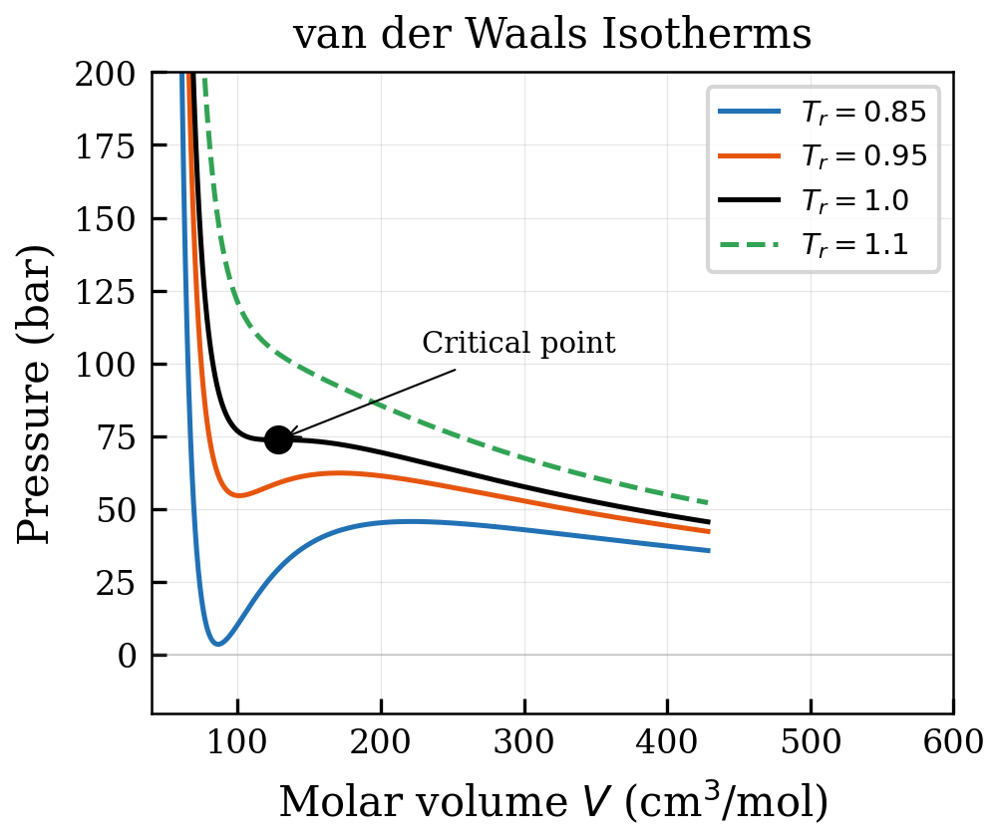
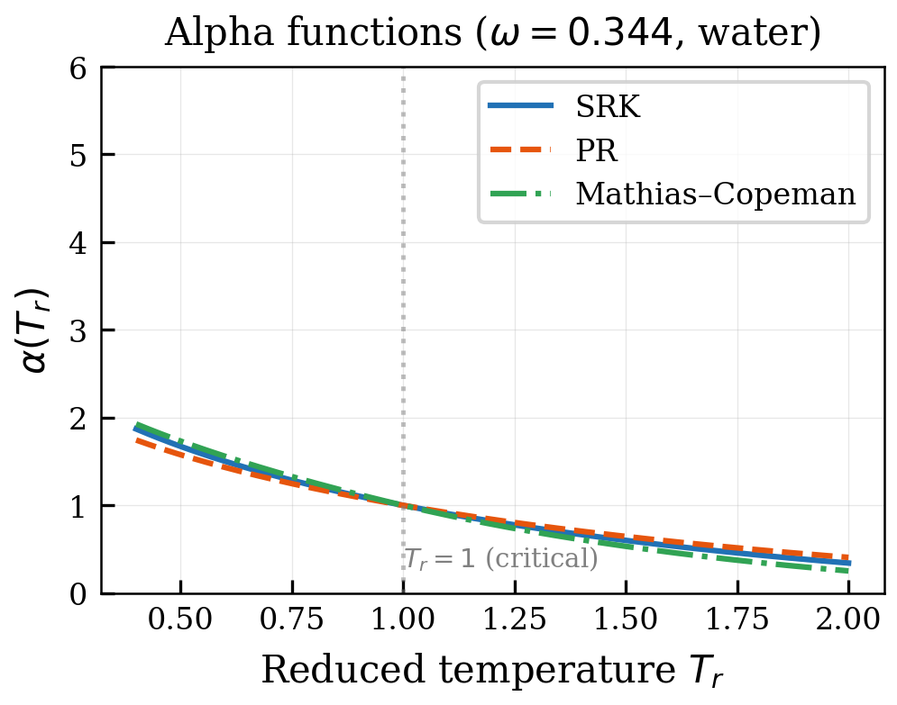
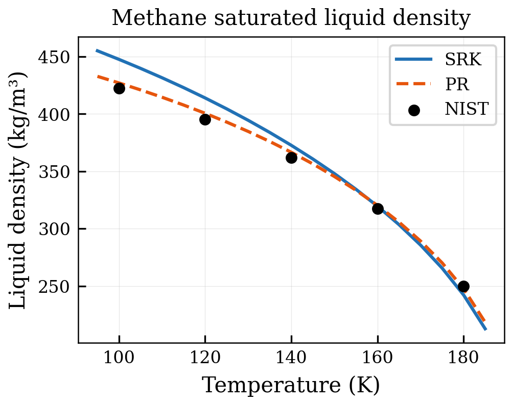
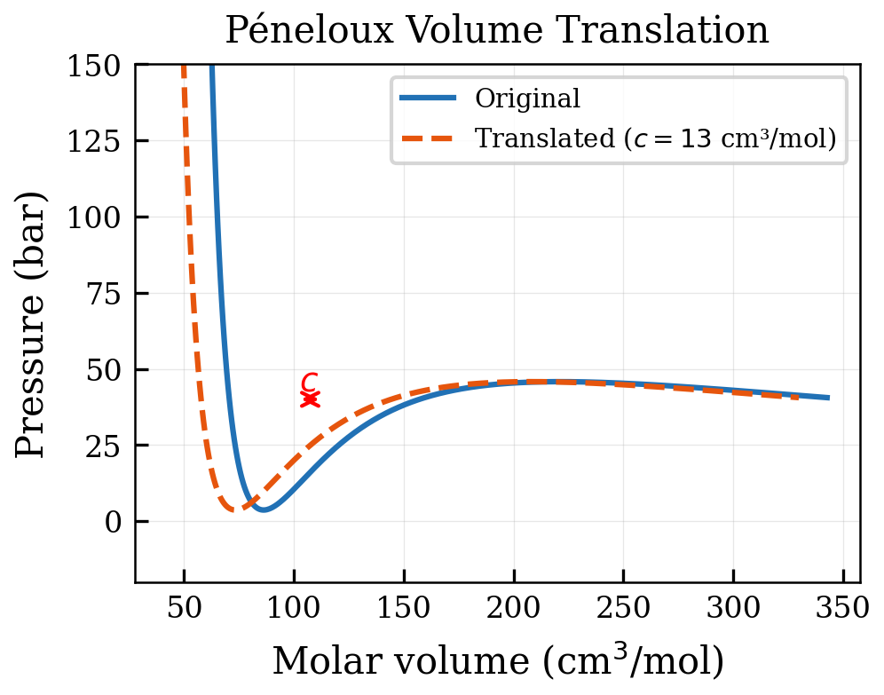

# Classical Cubic Equations of State

<!-- Chapter metadata -->
<!-- Notebooks: 01_cubic_eos_comparison.ipynb, 02_volume_translation.ipynb -->
<!-- Estimated pages: 18 -->

## Learning Objectives

After reading this chapter, the reader will be able to:

1. Derive the van der Waals equation and identify its physical basis
2. Present the SRK and PR equations and explain the role of the alpha function
3. Apply volume translation to improve liquid density predictions
4. Compute fugacity coefficients from cubic equations of state
5. Explain why cubic EoS fail for associating fluids

## 3.1 The van der Waals Equation

### 3.1.1 Physical Basis

In 1873, Johannes Diderik van der Waals proposed the first equation of state that could describe both the gas and liquid phases:

$$P = \frac{RT}{V_m - b} - \frac{a}{V_m^2}$$

where $V_m$ is the molar volume, $a$ is the attractive parameter accounting for intermolecular attraction, and $b$ is the co-volume representing the finite size of molecules.

The physical interpretation is straightforward:

- The term $RT/(V_m - b)$ is a repulsive contribution — the available volume is reduced by the finite molecular size $b$
- The term $-a/V_m^2$ is an attractive contribution — molecules attract each other, reducing the pressure below the ideal gas value

Despite its simplicity, the van der Waals equation captures the essential physics of fluid behavior: it predicts a critical point, vapor–liquid coexistence, and the transition from gas-like to liquid-like behavior.

### 3.1.2 Critical Point Conditions

At the critical point, the first and second derivatives of pressure with respect to volume vanish simultaneously:

$$\left(\frac{\partial P}{\partial V_m}\right)_{T_c} = 0 \quad \text{and} \quad \left(\frac{\partial^2 P}{\partial V_m^2}\right)_{T_c} = 0$$

Applying these conditions to the van der Waals equation yields:

$$a = \frac{27 R^2 T_c^2}{64 P_c}, \quad b = \frac{RT_c}{8P_c}, \quad Z_c = \frac{P_c V_{m,c}}{RT_c} = \frac{3}{8} = 0.375$$

The predicted critical compressibility factor of 0.375 is significantly higher than experimental values for most substances (typically 0.23–0.29), indicating that the van der Waals equation overpredicts the critical volume.

### 3.1.3 The Cubic Nature

The van der Waals equation can be rewritten as a cubic polynomial in $V_m$:

$$V_m^3 - \left(b + \frac{RT}{P}\right) V_m^2 + \frac{a}{P} V_m - \frac{ab}{P} = 0$$

This cubic nature is fundamental — it allows the equation to have up to three real roots, corresponding to the vapor, unstable, and liquid volumes. The cubic form also enables analytical solutions and efficient root-finding algorithms.

## 3.2 The Soave–Redlich–Kwong (SRK) Equation

### 3.2.1 Development

In 1949, Redlich and Kwong modified the van der Waals attraction term to include a temperature dependence:

$$P = \frac{RT}{V_m - b} - \frac{a}{T^{1/2} V_m(V_m + b)}$$

While this improved predictions at high temperatures, it still could not accurately reproduce vapor pressures. In 1972, Soave made the crucial innovation of replacing the fixed $T^{-1/2}$ dependence with a component-specific alpha function:

$$P = \frac{RT}{V_m - b} - \frac{a \cdot \alpha(T)}{V_m(V_m + b)}$$

where:

$$\alpha(T) = \left[1 + m\left(1 - \sqrt{T_r}\right)\right]^2$$

and $m$ is correlated with the acentric factor $\omega$:

$$m = 0.48508 + 1.55171\omega - 0.15613\omega^2$$

The parameters are:

$$a = 0.42748 \frac{R^2 T_c^2}{P_c}, \quad b = 0.08664 \frac{RT_c}{P_c}$$

The SRK equation accurately reproduces vapor pressures for a wide range of non-polar and slightly polar substances, making it the standard model in the oil and gas industry for decades. It is also the cubic foundation of the CPA equation of state.

### 3.2.2 Fugacity Coefficient

The fugacity coefficient for component $i$ in a mixture described by the SRK equation is:

$$\ln \varphi_i = \frac{b_i}{b_m}(Z - 1) - \ln(Z - B) - \frac{A}{B}\left(\frac{2\sum_j x_j a_{ij}}{a_m} - \frac{b_i}{b_m}\right) \ln\left(1 + \frac{B}{Z}\right)$$

where:

$$A = \frac{a_m P}{R^2 T^2}, \quad B = \frac{b_m P}{RT}, \quad Z = \frac{PV_m}{RT}$$

and the mixture parameters use van der Waals one-fluid mixing rules:

$$a_m = \sum_i \sum_j x_i x_j a_{ij}, \quad b_m = \sum_i x_i b_i$$

$$a_{ij} = \sqrt{a_i a_j}(1 - k_{ij})$$

The binary interaction parameter $k_{ij}$ is the single adjustable parameter available for tuning VLE predictions.

## 3.3 The Peng–Robinson (PR) Equation

### 3.3.1 Formulation

In 1976, Peng and Robinson proposed a modification that improved liquid density predictions:

$$P = \frac{RT}{V_m - b} - \frac{a \cdot \alpha(T)}{V_m(V_m + b) + b(V_m - b)}$$

$$P = \frac{RT}{V_m - b} - \frac{a \cdot \alpha(T)}{V_m^2 + 2bV_m - b^2}$$

The parameters are:

$$a = 0.45724 \frac{R^2 T_c^2}{P_c}, \quad b = 0.07780 \frac{RT_c}{P_c}$$

$$m = 0.37464 + 1.54226\omega - 0.26992\omega^2$$

The predicted critical compressibility factor is $Z_c = 0.3074$, closer to experimental values than both van der Waals (0.375) and SRK (0.333).

### 3.3.2 SRK vs. PR: When Does It Matter?

The choice between SRK and PR is sometimes debated, but in practice the differences are relatively small for vapor–liquid equilibrium. The main differences are:

| Property | SRK | PR |
|----------|-----|-----|
| $Z_c$ | 0.333 | 0.307 |
| Liquid density | Overpredicts ~5–15% | Overpredicts ~2–8% |
| Vapor pressure | Excellent | Excellent |
| VLE K-factors | Excellent | Excellent |
| Heavy hydrocarbon density | Poor without correction | Better, still needs correction |

*Table 3.1: Comparison of SRK and PR equations.*

For CPA, the SRK form is used as the cubic foundation because CPA was originally developed with SRK. A PR-based variant (PR-CPA) exists but is less commonly used in the oil and gas industry.

### 3.3.3 Fugacity from a Cubic EoS

The fugacity coefficient of component $i$ in a mixture is derived from the residual chemical potential:

$$\ln \varphi_i = \frac{1}{RT}\int_V^\infty \left[\left(\frac{\partial P}{\partial n_i}\right)_{T,V,n_{j\neq i}} - \frac{RT}{V}\right] dV - \ln Z$$

For SRK, this yields:

$$\ln \varphi_i = \frac{b_i}{b}(Z-1) - \ln(Z-B) - \frac{A}{B}\left(\frac{2\sum_j x_j a_{ij}}{a} - \frac{b_i}{b}\right)\ln\left(1 + \frac{B}{Z}\right)$$

where $A = aP/(R^2T^2)$, $B = bP/(RT)$, and $Z$ is the compressibility factor. This expression provides the thermodynamic backbone that CPA builds upon — the association contribution adds additional terms to $\ln \varphi_i$ involving the site fractions $X_A$ (Chapter 5).

### 3.3.4 Cubic Root Selection and Phase Stability

The cubic equation in $Z$ can yield one or three real roots. When three real roots exist:

- The **largest root** corresponds to the vapor (or gas-like) phase
- The **smallest positive root** corresponds to the liquid phase
- The **middle root** is thermodynamically unstable (negative compressibility)

The correct root is selected by comparing Gibbs energies. For a single-phase calculation, the root with the lower molar Gibbs energy $G = H - TS$ (or equivalently, the lower fugacity) is the stable phase.

For CPA, root selection is more complex because the association term modifies the pressure–volume relationship. The association contribution always reduces the pressure at a given volume (association is attractive), which can shift the liquid root to smaller volumes and change which root is the global minimum.

### 3.3.5 Comparison of SRK and PR for Liquid Density

A persistent criticism of SRK is that it overpredicts liquid molar volumes by 5–15% for most compounds. PR was designed to improve this:

| Compound | $V_L^{\text{exp}}$ (cm$^3$/mol) | $V_L^{\text{SRK}}$ | Error (%) | $V_L^{\text{PR}}$ | Error (%) |
|----------|-------------------------------|--------------------|-----------|--------------------|-----------|
| Methane (111 K) | 37.9 | 42.8 | +12.9 | 39.5 | +4.2 |
| n-Hexane (298 K) | 131.6 | 149.1 | +13.3 | 137.0 | +4.1 |
| Water (298 K) | 18.07 | 18.9 | +4.6 | 17.2 | $-4.8$ |
| Methanol (298 K) | 40.7 | 44.2 | +8.6 | 41.0 | +0.7 |

*Table 3.2: Liquid molar volume predictions of SRK and PR.*

Note that PR tends to **under-predict** volumes for small molecules like water, while SRK consistently **over-predicts**. For CPA, the association term provides an additional volume correction that improves liquid densities for hydrogen-bonding fluids beyond what either cubic EoS achieves alone.

## 3.4 Volume Translation

### 3.4.1 The Péneloux Correction

Péneloux et al. (1982) proposed a simple volume translation that shifts the molar volume without affecting VLE calculations:

$$V^{\text{corrected}} = V^{\text{EoS}} - \sum_i x_i c_i$$

where $c_i$ is a component-specific volume shift parameter, typically fitted to match the experimental saturated liquid density at a reference temperature. The key property of this correction is that it does not change fugacity coefficients — the VLE results are identical with and without the correction.

For the SRK-based CPA in NeqSim, the Péneloux correction significantly improves liquid density predictions. Without volume translation, SRK-CPA may overpredict liquid volumes by 3–10%; with the correction, errors are typically reduced to 1–3%.

### 3.4.2 Temperature-Dependent Volume Translation

The Péneloux correction with a constant $c_i$ is accurate near the reference temperature but degrades at other temperatures. Several temperature-dependent correlations have been proposed:

$$c_i(T) = c_i^0 + c_i^1(T - T_{\text{ref}})$$

or more sophisticated functions involving the reduced temperature $T_r$. NeqSim supports both constant and temperature-dependent volume translation for CPA.

## 3.5 Alpha Functions and Temperature Dependence

### 3.5.1 The Soave Alpha Function

The original Soave alpha function:

$$\alpha(T_r) = \left[1 + m(1 - \sqrt{T_r})\right]^2$$

where $T_r = T/T_c$ is the reduced temperature, works well for $T_r < 1$ but can exhibit unphysical behavior at high supercritical temperatures (negative values of $\alpha$ for components with high $\omega$).

### 3.5.2 The Mathias–Copeman Alpha Function

For improved accuracy, particularly for polar and associating components, the Mathias–Copeman (1983) alpha function provides additional flexibility:

$$\alpha(T_r) = \left[1 + c_1(1 - \sqrt{T_r}) + c_2(1 - \sqrt{T_r})^2 + c_3(1 - \sqrt{T_r})^3\right]^2 \quad \text{for } T_r \leq 1$$

$$\alpha(T_r) = \left[1 + c_1(1 - \sqrt{T_r})\right]^2 \quad \text{for } T_r > 1$$

The three parameters $c_1$, $c_2$, $c_3$ are fitted to experimental vapor pressure data. For non-polar molecules, setting $c_2 = c_3 = 0$ recovers the standard Soave form.

In the context of CPA, the alpha function is particularly important for the energy parameter of the cubic term. For associating components, the effective temperature dependence of $a(T)$ captures both the changing dispersion interactions and, to some extent, compensates for simplified treatment of the reference term.

### 3.5.3 The Twu Alpha Function

Twu et al. (1991) proposed an alpha function that is guaranteed to be positive and monotonically decreasing:

$$\alpha(T_r) = T_r^{N(M-1)} \exp\left[L(1 - T_r^{NM})\right]$$

This form has better thermodynamic consistency at high temperatures and is used in some CPA implementations.

### 3.5.4 Thermodynamic Consistency of Alpha Functions

An important consideration for any alpha function is thermodynamic consistency. A physically consistent alpha function must satisfy:

1. $\alpha(T_r) > 0$ for all $T_r$ (positive energy parameter)
2. $\frac{d\alpha}{dT_r} < 0$ for $T_r > 0$ (attraction decreases with temperature)
3. $\frac{d^2\alpha}{dT_r^2} > 0$ for $T_r > 0$ (convex function — ensures correct $C_P$ behavior)

The Soave alpha function satisfies conditions 1 and 2 for $T_r < [1 + 1/m]^2$ but violates condition 2 for very high temperatures. The Twu function satisfies all three conditions by construction. For CPA applications, where most calculations involve $T_r < 1$ for the associating components, the Soave function is generally adequate.

## 3.6 Mixing Rules for Cubic EoS

### 3.6.1 Classical van der Waals Mixing Rules

The standard (one-fluid) mixing rules for cubic EoS are:

$$a_m = \sum_i \sum_j x_i x_j \sqrt{a_i a_j} (1 - k_{ij})$$

$$b_m = \sum_i x_i b_i$$

The binary interaction parameter $k_{ij}$ adjusts the geometric mean combining rule for the attractive parameter. For hydrocarbon–hydrocarbon pairs, $k_{ij}$ is typically small (0–0.05). For CO$_2$–hydrocarbon pairs, larger values (0.10–0.15) are needed. For water–hydrocarbon pairs, very large values would be needed, and even then the predictions are poor — this is precisely where CPA adds value.

### 3.6.2 Limitations for Asymmetric Mixtures

The van der Waals mixing rules assume that the interaction between unlike molecules can be described by a simple geometric mean. This works well for mixtures of similar molecules but fails for highly asymmetric mixtures such as:

- Hydrogen-bonding systems (water + hydrocarbon)
- Size-asymmetric systems (methane + heavy hydrocarbons)
- Mixtures with strong specific interactions (CO$_2$ + water)

More sophisticated mixing rules (Wong–Sandler, MHV2, LCVM) have been developed to address these limitations, but they add complexity and additional parameters. CPA takes a different approach: keep the simple van der Waals mixing rules for the cubic part, but add the association term to explicitly account for hydrogen bonding.

## 3.7 Limitations of Cubic EoS for Associating Systems

To motivate the need for CPA, let us quantify the failure of classical cubic EoS for associating systems.

### 3.7.1 Water Vapor Pressure

Pure water is a severe test for any EoS. The vapor pressure curve spans from 0.006 bar at 0°C to 220.6 bar at the critical point (374°C). While SRK can reproduce the vapor pressure reasonably well with the standard alpha function, the liquid density is overpredicted by 15–20%. This is because the SRK parameters are forced to simultaneously capture the strong hydrogen-bonding interactions (through $a$) and the molecular size (through $b$), but two parameters are insufficient to describe both dispersion and association.

### 3.7.2 Water Content of Natural Gas

The water content of natural gas is a critical parameter for pipeline design and hydrate prevention. Experimental data show that the water content of methane at 50°C and 100 bar is approximately 0.0015 mole fraction. SRK with an optimized $k_{ij}$ predicts 0.003–0.005, overestimating by a factor of 2–3.

The reason is clear: SRK does not know that water molecules in the liquid phase are hydrogen-bonded, which dramatically reduces their chemical potential (and hence fugacity) relative to what a non-associating model would predict. The water molecules are "held" in the liquid phase by hydrogen bonds, reducing their tendency to escape into the gas phase.

### 3.7.3 Mutual Solubilities

The water–n-alkane mutual solubilities exhibit characteristic behavior:

- The solubility of water in alkanes decreases with alkane chain length
- The solubility of alkanes in water decreases much more steeply with chain length
- Both solubilities have a minimum as a function of temperature

Classical cubic EoS with a single $k_{ij}$ cannot reproduce these trends because $k_{ij}$ is essentially a constant correction that cannot capture the temperature-dependent effects of association. CPA resolves this by explicitly accounting for the hydrogen-bond network in the aqueous phase.

## 3.8 The Pressure–Volume Isotherm and Phase Stability

### 3.8.1 Subcritical Isotherms and the van der Waals Loop

At temperatures below the critical temperature, a cubic EoS produces a characteristic S-shaped (van der Waals loop) isotherm in the $P$–$V_m$ diagram. Between the liquid and vapor volumes, the pressure first decreases (physically reasonable), then increases (mechanically unstable region where $(\partial P/\partial V_m)_T > 0$), before decreasing again.

The mechanical stability condition requires:

$$\left(\frac{\partial P}{\partial V_m}\right)_T < 0$$

The region where this condition is violated ($V_m^{\text{spinodal,L}} < V_m < V_m^{\text{spinodal,V}}$) is the **spinodal region**, bounded by the locus of inflection points. Inside the spinodal, the system is unconditionally unstable — any infinitesimal perturbation causes spontaneous phase separation. The region between the spinodal and the saturation curve (binodal) is **metastable** — the system is mechanically stable but thermodynamically unstable.

### 3.8.2 The Maxwell Equal-Area Construction

The equilibrium vapor pressure $P^{\text{sat}}$ at a given temperature is determined by the Maxwell equal-area rule: the horizontal line at $P = P^{\text{sat}}$ divides the van der Waals loop into two regions of equal area.

Mathematically, this is equivalent to requiring that the fugacities of the two coexisting phases are equal:

$$f^L(T, P^{\text{sat}}) = f^V(T, P^{\text{sat}})$$

which is the same as:

$$\int_{V_m^L}^{V_m^V} \left(P - P^{\text{sat}}\right) dV_m = 0$$

This integral represents the net work in a reversible isothermal expansion from liquid to vapor volume. The two "lobes" of the van der Waals loop above and below $P^{\text{sat}}$ must cancel exactly.

The Maxwell construction provides physical insight into how cubic EoS predict phase equilibrium: the saturation pressure is not an input but emerges naturally from the shape of the isotherm. Any change to the EoS parameters ($a$, $b$, $\alpha$) shifts the isotherm shape and hence the predicted saturation pressure.

### 3.8.3 Critical Point from the EoS

At the critical point, the van der Waals loop collapses to an inflection point where:

$$\left(\frac{\partial P}{\partial V_m}\right)_{T_c} = 0, \quad \left(\frac{\partial^2 P}{\partial V_m^2}\right)_{T_c} = 0, \quad \left(\frac{\partial^3 P}{\partial V_m^3}\right)_{T_c} < 0$$

These conditions yield the critical properties in terms of the EoS parameters. For SRK:

$$T_c = \frac{a}{b R} \cdot \frac{1}{2.4694}, \quad P_c = \frac{a}{b^2} \cdot 0.04278, \quad Z_c = 1/3$$

The fact that SRK predicts $Z_c = 1/3$ for all substances (compared to experimental values of 0.23–0.29) is a fundamental limitation. CPA modifies the critical behavior by adding the association contribution to the pressure, which changes the critical point location and improves the predicted $Z_c$ for associating fluids (though the improvement is modest).

### 3.8.4 The Acentric Factor and Its Role

Pitzer's acentric factor $\omega$ quantifies the departure of a molecule from simple (spherical, non-polar) fluid behavior:

$$\omega = -\log_{10}\left(\frac{P^{\text{sat}}}{P_c}\right)_{T_r=0.7} - 1$$

For noble gases and methane, $\omega \approx 0$. For normal alkanes, $\omega$ increases roughly linearly with chain length: ethane (0.099), propane (0.152), n-butane (0.200), n-octane (0.399). For polar and associating molecules, $\omega$ includes both the non-sphericity and the polar/association contributions: water (0.345), methanol (0.564), acetic acid (0.467).

The fact that $\omega$ lumps together shape, polarity, and association effects is precisely why the Soave alpha function cannot fully capture the behavior of associating molecules — it treats water ($\omega = 0.345$) similarly to a moderately non-spherical hydrocarbon like isobutane ($\omega = 0.181$), despite the fundamentally different physics.

## 3.9 Worked Example: Computing Properties from SRK

To solidify the concepts, let us work through a complete example of computing thermodynamic properties for pure methane using the SRK equation.

### 3.9.1 Critical Properties and Parameters

For methane: $T_c = 190.56$ K, $P_c = 45.99$ bar, $\omega = 0.0115$.

The SRK parameters at $T = 200$ K are:

$$\alpha(T) = [1 + m(1 - \sqrt{T_r})]^2$$

where $m = 0.480 + 1.574\omega - 0.176\omega^2 = 0.480 + 1.574(0.0115) - 0.176(0.0115)^2 = 0.4981$.

At $T_r = T/T_c = 200/190.56 = 1.0495$:

$$\alpha = [1 + 0.4981(1 - \sqrt{1.0495})]^2 = [1 + 0.4981(-0.0243)]^2 = 0.9760$$

$$a(T) = \frac{0.42748 R^2 T_c^2}{P_c} \alpha = \frac{0.42748 \times (83.14)^2 \times (190.56)^2}{45.99 \times 10^5} \times 0.9760$$

$$b = \frac{0.08664 R T_c}{P_c} = \frac{0.08664 \times 83.14 \times 190.56}{45.99 \times 10^5}$$

### 3.9.2 Solving the Cubic Equation

At $T = 200$ K and $P = 50$ bar, the SRK equation in terms of $Z = PV/(nRT)$:

$$Z^3 - Z^2 + (A - B - B^2)Z - AB = 0$$

where $A = aP/(R^2T^2)$ and $B = bP/(RT)$. This cubic equation has either one or three real roots. For a vapor-liquid system at these conditions, there are three real roots: the largest ($Z^V$) corresponds to the vapor, the smallest ($Z^L$) to the liquid.

### 3.9.3 Computing Fugacity

The fugacity coefficient from SRK is:

$$\ln \varphi = (Z-1) - \ln(Z-B) - \frac{A}{B}\ln\left(1 + \frac{B}{Z}\right)$$

For a mixture, the component fugacity coefficient is:

$$\ln \varphi_i = \frac{b_i}{b}(Z-1) - \ln(Z-B) + \frac{A}{B}\left(\frac{b_i}{b} - \frac{2\sum_j x_j a_{ij}}{a}\right)\ln\left(1 + \frac{B}{Z}\right)$$

This expression is the starting point for the CPA fugacity coefficient derived in Chapter 5, which adds the association contribution.

### 3.9.4 NeqSim Verification

```python
from neqsim import jneqsim

# Pure methane at 200 K, 50 bar
fluid = jneqsim.thermo.system.SystemSrkEos(200.0, 50.0)
fluid.addComponent("methane", 1.0)
fluid.setMixingRule("classic")

ops = jneqsim.thermodynamicoperations.ThermodynamicOperations(fluid)
ops.TPflash()
fluid.initProperties()

Z = fluid.getPhase(0).getZ()
rho = fluid.getDensity("kg/m3")
fug = fluid.getPhase(0).getComponent("methane").getFugacityCoefficient()

print(f"Z = {Z:.4f}")
print(f"Density = {rho:.2f} kg/m3")
print(f"Fugacity coefficient = {fug:.4f}")
```

## Summary

Key points from this chapter:

- Cubic EoS (van der Waals, SRK, PR) describe PVT behavior using two parameters derived from critical properties
- The Soave alpha function enables accurate vapor pressure reproduction
- Volume translation corrects liquid density without affecting VLE
- Classical mixing rules with $k_{ij}$ work well for non-polar systems
- Cubic EoS fundamentally fail for associating systems because they cannot distinguish dispersion from hydrogen-bonding interactions
- CPA addresses this by adding Wertheim's association term to SRK

## Exercises

1. **Exercise 3.1:** Using NeqSim, compute the PVT surface for pure methane using SRK at temperatures from $-160°C$ to $100°C$ and pressures from 1 to 200 bar. Plot isotherms on a $P$-$V_m$ diagram and identify the two-phase region.

2. **Exercise 3.2:** Compare the predicted liquid density of n-heptane from SRK, PR, and SRK with Péneloux volume translation at 25°C and pressures from 1 to 500 bar. Plot against NIST data.

3. **Exercise 3.3:** For the system CO$_2$–water at 25°C, compute VLE using SRK with $k_{ij} = 0$, $0.1$, and $0.2$. Compare the predicted CO$_2$ solubility in water with experimental data. Can any single $k_{ij}$ value give satisfactory results?

## References

<!-- Chapter-level references are merged into master refs.bib -->


## Figures



*Figure 3.1: 01 Vdw Isotherms*



*Figure 3.2: 02 Alpha Functions*



*Figure 3.3: 03 Srk Pr Methane Density*



*Figure 3.4: 04 Volume Translation*
