# Association Theory: Wertheim's Thermodynamic Perturbation Theory

<!-- Chapter metadata -->
<!-- Notebooks: 01_site_fractions.ipynb, 02_association_strength.ipynb -->
<!-- Estimated pages: 20 -->

## Learning Objectives

After reading this chapter, the reader will be able to:

1. Explain the physical basis of Wertheim's thermodynamic perturbation theory (TPT)
2. Define association sites, bonding states, and the site fraction $X_A$
3. Derive the Helmholtz energy contribution from association
4. Compute the association strength $\Delta^{AB}$ and understand its components
5. Apply common association schemes (2B, 3B, 4C) to real molecules

## 4.1 The Physics of Hydrogen Bonding

### 4.1.1 What Is a Hydrogen Bond?

A hydrogen bond forms when a hydrogen atom covalently bonded to an electronegative atom (the **donor**) interacts with a lone pair of electrons on another electronegative atom (the **acceptor**). The interaction is primarily electrostatic but has a significant covalent component at short distances.

The key characteristics of hydrogen bonds that distinguish them from dispersion forces:

- **Strength**: Hydrogen bonds have energies of 10–40 kJ/mol, compared to 0.5–5 kJ/mol for typical dispersion interactions
- **Directionality**: Hydrogen bonds are roughly linear, with an optimal donor–H–acceptor angle near 180°
- **Saturability**: Each hydrogen atom can participate in at most one hydrogen bond (to first approximation)
- **Short range**: Hydrogen bonds operate over distances of 1.5–3.5 Å

These characteristics mean that hydrogen bonding cannot be adequately described by the mean-field, isotropic attraction captured by the $a$ parameter in cubic equations of state.

### 4.1.2 Association vs. Solvation

Two distinct types of strong specific interactions are relevant for thermodynamic modeling:

**Self-association** occurs between molecules of the same species. Water molecules form hydrogen bonds with other water molecules, creating a three-dimensional network. Alcohols self-associate through OH–OH hydrogen bonds, forming linear chains in the liquid state.

**Cross-association** (or solvation) occurs between different molecular species. For example, the oxygen atom in a ketone can accept a hydrogen bond from water, even though the ketone cannot donate hydrogen bonds. Similarly, the $\pi$-electrons in aromatic compounds can act as weak hydrogen bond acceptors.

Both phenomena are captured within Wertheim's framework by appropriate assignment of association sites.

## 4.2 Wertheim's Thermodynamic Perturbation Theory

### 4.2.1 The Fundamental Papers

Between 1984 and 1986, Michael Wertheim published a series of four papers that laid the foundation for modern association models. The theory is developed in the context of classical statistical mechanics for fluids with anisotropic interactions.

The key innovation was to decompose the intermolecular potential into two parts:

$$u(1,2) = u_{\text{ref}}(r_{12}) + u_{\text{assoc}}(1,2)$$

where $u_{\text{ref}}$ is a spherically symmetric reference potential (e.g., hard sphere or Lennard-Jones) that depends only on the center–center distance $r_{12}$, and $u_{\text{assoc}}$ is the orientation-dependent association interaction that depends on the full configuration (position and orientation) of both molecules.

### 4.2.2 The Site Model

Wertheim modeled the anisotropic attraction by placing discrete **association sites** on each molecule. Each site represents a specific location where a hydrogen bond can form. A site $A$ on molecule $i$ can bond with site $B$ on molecule $j$ if and only if the two sites are within a characteristic distance and in a favorable mutual orientation.

The site–site interaction potential has the form:

$$u_{\text{assoc}}^{AB}(1,2) = \begin{cases} -\varepsilon^{AB} & \text{if } r_{AB} < r_c^{AB} \\ 0 & \text{otherwise} \end{cases}$$

where $\varepsilon^{AB}$ is the association energy (well depth) and $r_c^{AB}$ is the critical bonding distance.

The critical assumption of the theory is that **each site can bond with at most one other site**. This steric incompatibility condition (one-bond-per-site) is what makes Wertheim's theory tractable — it eliminates the combinatorial explosion of possible bonding configurations that plagued earlier chemical theories.

### 4.2.3 Graph Theory and Cluster Expansion

Wertheim developed his theory using a graphical expansion of the partition function, analogous to the Mayer cluster expansion for simple fluids. The key step is to classify molecular clusters according to the bonding topology:

- **Monomers**: molecules with no bonds
- **Dimers**: pairs of molecules connected by one bond
- **Trimers**: three molecules in a chain
- **Branched structures**: molecules with bonds to multiple partners (at different sites)

The one-bond-per-site condition ensures that the cluster expansion can be resummed exactly to first order in the perturbation (first-order thermodynamic perturbation theory, or TPT1). This remarkable result means that the free energy depends only on the **monomer fraction** — the fraction of molecules not bonded at each site — rather than on the detailed distribution of cluster sizes.

## 4.3 The Site Balance Equation

### 4.3.1 Derivation

The central result of Wertheim's TPT1 is an implicit equation for $X_{A_i}$, the fraction of molecules of type $i$ that are **not bonded** at site $A$:

$$X_{A_i} = \frac{1}{1 + \rho \sum_{j} x_j \sum_{B_j} X_{B_j} \Delta^{A_i B_j}}$$

Let us examine each term:

- $\rho$ is the total molar density of the mixture
- $x_j$ is the mole fraction of component $j$
- The outer sum runs over all components $j$
- The inner sum runs over all association sites $B_j$ on component $j$
- $X_{B_j}$ is the fraction of molecules $j$ not bonded at site $B$
- $\Delta^{A_i B_j}$ is the **association strength** between site $A$ on molecule $i$ and site $B$ on molecule $j$

This equation has a simple physical interpretation: the probability that site $A$ on molecule $i$ is free (not bonded) equals 1 divided by 1 plus the total concentration of available bonding partners weighted by the association strength. If there are many potential bonding partners with strong interactions ($\rho x_j X_{B_j} \Delta^{AB}$ is large), then $X_{A_i}$ is small — most sites are bonded.

### 4.3.2 The Association Strength

The association strength $\Delta^{A_i B_j}$ quantifies the tendency for site $A$ on molecule $i$ to bond with site $B$ on molecule $j$. In the CPA framework, it is given by:

$$\Delta^{A_i B_j} = g(\rho) \left[\exp\left(\frac{\varepsilon^{A_i B_j}}{RT}\right) - 1\right] b_{ij} \beta^{A_i B_j}$$

where:

- $g(\rho)$ is the **radial distribution function** (RDF) at contact distance, evaluated for the reference fluid
- $\varepsilon^{A_i B_j}$ is the **association energy** — the depth of the potential well for the site–site interaction
- $\beta^{A_i B_j}$ is the **association volume** — a dimensionless parameter related to the spatial extent of the bonding interaction
- $b_{ij}$ is the co-volume, linking the association to the molecular size

The exponential factor $[\exp(\varepsilon^{AB}/RT) - 1]$ captures the Boltzmann weighting of the association energy. At low temperatures, this factor is large, meaning strong association. At high temperatures, it approaches $\varepsilon^{AB}/RT$ (weak association limit). The $-1$ ensures that $\Delta \to 0$ as $\varepsilon^{AB} \to 0$ (no association for non-interacting sites).

### 4.3.3 The Radial Distribution Function

The radial distribution function $g(\rho)$ describes the probability of finding the center of molecule $j$ at contact distance from molecule $i$, relative to a uniform distribution. For the simplified CPA, a simple expression is used:

$$g(\rho) = \frac{1}{1 - 1.9 \eta}$$

where $\eta = b\rho/4$ is the packing fraction. This expression, derived from the Carnahan–Starling equation, provides a good approximation for hard-sphere fluids and captures the key physics: as density increases, the probability of molecular contact increases (because molecules are forced closer together), which enhances the rate of association.

## 4.4 Association Schemes

### 4.4.1 Notation

Association schemes specify the number and type of sites on each molecule. The standard notation, introduced by Huang and Radosz (1990), uses numbers and letters:

- **1A**: One association site (e.g., HCl)
- **2A**: Two identical sites (e.g., dimerizing acid)
- **2B**: Two non-identical sites — one electron donor, one electron acceptor (e.g., simple alcohol model)
- **3B**: Three sites — two identical donors and one acceptor, or vice versa (e.g., alcohol with two lone pairs and one OH)
- **4C**: Four sites — two donors and two acceptors (e.g., water)

### 4.4.2 Common Molecules and Their Schemes

| Molecule | Recommended Scheme | Sites | Description |
|----------|-------------------|-------|-------------|
| Water | 4C | 2 $e^-$ donors, 2 $e^-$ acceptors | Two lone pairs + two OH |
| Methanol | 2B or 3B | 1 donor, 1 (or 2) acceptor | OH group |
| Ethanol | 2B or 3B | 1 donor, 1 (or 2) acceptor | OH group |
| MEG | 4C | 2 donors, 2 acceptors | Two OH groups |
| DEG | 4C | 2 donors, 2 acceptors | Two OH groups |
| TEG | 4C | 2 donors, 2 acceptors | Two OH groups |
| Acetic acid | 1A | 1 site (dimerization) | Carboxylic acid |
| Formic acid | 1A | 1 site (dimerization) | Carboxylic acid |
| Amines (primary) | 3B | 2 donors, 1 acceptor | NH$_2$ group |
| CO$_2$ | Solvation only | 0 self-association sites | Lewis acid (electron acceptor) |

*Table 4.1: Recommended association schemes for common molecules in CPA.*

The choice of association scheme significantly affects the number of pure-component parameters. For a 2B molecule, there are two association parameters ($\varepsilon$ and $\beta$); for a 4C molecule with symmetric sites, the same two parameters apply but the equations are different due to the different number of sites.

### 4.4.3 Water: The 4C Scheme

Water is the most important associating molecule in process engineering. In the 4C scheme, each water molecule has four association sites:

- Sites $e_1$ and $e_2$ represent the two lone electron pairs (electron donors / hydrogen bond acceptors)
- Sites $H_1$ and $H_2$ represent the two hydrogen atoms (proton donors)

An $H$ site on one water molecule bonds with an $e$ site on another. The allowed bond pairs are $\{H_1 \leftrightarrow e_1, H_1 \leftrightarrow e_2, H_2 \leftrightarrow e_1, H_2 \leftrightarrow e_2\}$, while $H \leftrightarrow H$ and $e \leftrightarrow e$ bonds are forbidden.

With symmetric sites ($X_{H_1} = X_{H_2} \equiv X_H$ and $X_{e_1} = X_{e_2} \equiv X_e$), the site balance equations reduce to:

$$X_H = \frac{1}{1 + 2\rho X_e \Delta^{He}}$$

$$X_e = \frac{1}{1 + 2\rho X_H \Delta^{He}}$$

where $\Delta^{He}$ uses the single pair of association parameters $\varepsilon^{He}$ and $\beta^{He}$. These two coupled equations can be solved analytically by substituting one into the other.

### 4.4.4 Analytical Solutions for Simple Schemes

For the 2B scheme (one site of each type), the site balance equations give:

$$X_A = X_B = \frac{-1 + \sqrt{1 + 4\rho\Delta}}{2\rho\Delta}$$

For the 4C scheme with symmetric sites, the analytical solution is:

$$X_H = X_e = \frac{-1 + \sqrt{1 + 8\rho\Delta}}{4\rho\Delta}$$

These closed-form expressions are valuable for both understanding and computation — they eliminate the need for iterative solution of the site balance equations in pure-component calculations.

### 4.4.5 Limits of the Site Fraction

The behavior of $X_A$ in the two extreme limits is instructive:

**Low density limit** ($\rho \to 0$): $X_A \to 1$. All sites are free because there are no neighboring molecules to bond with. This is the ideal gas limit where association vanishes.

**High density limit** ($\rho \to \infty$): $X_A \to 0$. All sites are bonded because every molecule is surrounded by potential bonding partners. In practice, $X_A$ never reaches exactly zero — even in liquid water at ambient conditions, approximately 10–15% of hydrogen bond sites are free at any instant.

**The crossover density** where $X_A = 0.5$ provides a useful measure of the onset of significant association:

$$\rho^* = \frac{1}{\Delta^{AB}}$$

At densities below $\rho^*$, most sites are free; at densities above $\rho^*$, most sites are bonded. For water at 298 K, $\rho^* \approx 5$ mol/L, well below the actual liquid density of 55.5 mol/L. This confirms that liquid water is strongly associated, with $X_H \approx 0.1$–$0.2$.

### 4.4.6 Temperature Dependence of Association

The fraction of free sites depends on temperature through the association strength $\Delta^{AB}$:

$$\Delta^{AB} \propto \exp\left(\frac{\varepsilon^{AB}}{RT}\right) - 1$$

As temperature increases:
- The exponential factor decreases (less Boltzmann weight for the bonded state)
- $\Delta^{AB}$ decreases
- $X_A$ increases (fewer bonded sites)

This temperature dependence is responsible for many characteristic properties of associating fluids:
- The large heat capacity of liquid water (breaking hydrogen bonds absorbs energy)
- The negative thermal expansion coefficient of water below 4°C
- The unusually high boiling point of water compared to H$_2$S
- The decreasing viscosity of glycols and alcohols with temperature

## 4.5 The Helmholtz Energy of Association

### 4.5.1 The General Expression

Wertheim's TPT1 gives the Helmholtz energy contribution from association as:

$$\frac{A^{\text{assoc}}}{nRT} = \sum_{i=1}^{c} x_i \sum_{A_i} \left(\ln X_{A_i} - \frac{X_{A_i}}{2} + \frac{1}{2}\right)$$

where the outer sum is over all components and the inner sum is over all association sites on component $i$. The terms have the following interpretation:

- $\ln X_{A_i}$: entropic contribution — there are fewer configurations when molecules are bonded
- $-X_{A_i}/2 + 1/2$: ensures proper normalization and removes double-counting of bonded pairs

### 4.5.2 Properties of the Association Energy

Several important properties follow from this expression:

1. **$A^{\text{assoc}} \leq 0$ always**: Association always lowers the free energy (it is a stabilizing interaction). Since $0 \leq X_A \leq 1$, we have $\ln X_A \leq 0$ and $-X_A/2 + 1/2 \geq 0$, with the logarithmic term dominating.

2. **$A^{\text{assoc}} = 0$ when $X_A = 1$ for all sites**: If no association occurs (all sites free), the association contribution vanishes.

3. **$A^{\text{assoc}}$ becomes more negative with increasing association**: As $X_A \to 0$ (complete association), $A^{\text{assoc}} \to -\infty$ in the logarithmic limit.

4. **Temperature dependence**: As temperature increases, $\Delta$ decreases, $X_A$ increases, and $A^{\text{assoc}}$ becomes less negative. This is consistent with hydrogen bonds being broken by thermal energy.

### 4.5.3 Pressure Contribution from Association

The association contribution to pressure is obtained by differentiation:

$$P^{\text{assoc}} = -\left(\frac{\partial A^{\text{assoc}}}{\partial V}\right)_{T,\mathbf{n}} = -\frac{nRT}{2} \sum_i x_i \sum_{A_i} \frac{1}{X_{A_i}} \frac{\partial X_{A_i}}{\partial V}$$

The derivative $\partial X_{A_i}/\partial V$ requires implicit differentiation of the site balance equations and is non-trivial — this is one of the computational challenges of CPA relative to pure cubic EoS.

## 4.6 Fugacity Coefficient from Association

### 4.6.1 The Chemical Potential Contribution

The association contribution to the chemical potential of component $i$ is:

$$\frac{\mu_i^{\text{assoc}}}{RT} = \sum_{A_i} \ln X_{A_i} + \rho \sum_k x_k \sum_{A_k} \frac{1}{X_{A_k}} \frac{\partial X_{A_k}}{\partial n_i}$$

The first term is the direct contribution from the sites on molecule $i$. The second term accounts for the fact that adding molecule $i$ to the mixture changes the association equilibrium of all other species.

### 4.6.2 Simplification Using the Site Balance

A remarkable simplification occurs when the site balance equation is used. Differentiating the Helmholtz energy while using the stationarity condition (that the site balance equations are satisfied), one obtains:

$$\frac{\mu_i^{\text{assoc}}}{RT} = \sum_{A_i} \ln X_{A_i} - \frac{1}{2} \rho \sum_k x_k \sum_{A_k} \left(\frac{1}{X_{A_k}} - 1\right) \frac{\partial \Delta^{A_k}}{\partial n_i}$$

In NeqSim, this is implemented using analytical derivatives of the association strength with respect to composition.

## 4.7 Solution of the Site Balance Equations

### 4.7.1 Successive Substitution

The simplest approach to solving the coupled site balance equations is successive substitution:

1. Initialize $X_{A_i}^{(0)} = 1$ for all sites (no association)
2. Update: $X_{A_i}^{(k+1)} = \frac{1}{1 + \rho \sum_j x_j \sum_{B_j} X_{B_j}^{(k)} \Delta^{A_i B_j}}$
3. Repeat until convergence: $\max |X_{A_i}^{(k+1)} - X_{A_i}^{(k)}| < \varepsilon_{\text{tol}}$

This method is simple and usually converges in 3–10 iterations for typical conditions. However, it can be slow near critical points or at conditions of very strong association.

### 4.7.2 Newton's Method

For faster convergence, Newton's method can be applied to the residual form of the site balance equations:

$$R_{A_i} = X_{A_i} - \frac{1}{1 + \rho \sum_j x_j \sum_{B_j} X_{B_j} \Delta^{A_i B_j}} = 0$$

The Jacobian matrix is:

$$J_{A_i, B_j} = \frac{\partial R_{A_i}}{\partial X_{B_j}} = \delta_{A_i B_j} + \frac{\rho x_j \Delta^{A_i B_j}}{\left(1 + \rho \sum_k x_k \sum_{C_k} X_{C_k} \Delta^{A_i C_k}\right)^2}$$

Newton's method typically converges in 2–4 iterations but requires forming and solving the linear system at each step.

### 4.7.3 Fully Implicit Approach

In the fully implicit approach used in NeqSim's advanced solvers, the site balance equations are solved simultaneously with the flash equations, rather than as an inner loop. This eliminates the nested iteration structure and can significantly improve overall convergence. Chapter 8 discusses this in detail.

## 4.8 Temperature and Density Dependence of Association

### 4.8.1 Effect of Temperature

As temperature increases:

1. The Boltzmann factor $\exp(\varepsilon/RT)$ decreases, reducing $\Delta$
2. The site fractions $X_A$ increase (fewer bonds)
3. The association free energy $A^{\text{assoc}}$ becomes less negative

This temperature dependence captures the well-known behavior that hydrogen bonds weaken and break at high temperatures. The predicted degree of association ($1 - X_A$) for water at 1 bar decreases from about 0.85 at 25°C to about 0.6 at 100°C and approaches zero near the critical temperature.

### 4.8.2 Effect of Density

As density increases:

1. The contact probability $g(\rho)$ increases, enhancing $\Delta$
2. The product $\rho \Delta$ increases, leading to more association
3. The competing effect of steric crowding limits the maximum bonding

The density dependence through $\rho g(\rho)$ is crucial for predicting the correct pressure dependence of association. Under high pressures, the liquid becomes denser, molecules are forced closer together, and the degree of association increases.

```python
from neqsim import jneqsim
import json

# Examine how association changes with temperature
for T_C in [25, 50, 100, 150, 200, 250, 300, 350]:
    fluid = jneqsim.thermo.system.SystemSrkCPAstatoil(273.15 + T_C, 10.0)
    fluid.addComponent("water", 1.0)
    fluid.setMixingRule(10)
    ops = jneqsim.thermodynamicoperations.ThermodynamicOperations(fluid)
    ops.TPflash()
    fluid.initProperties()

    # The density reflects the degree of association
    density = fluid.getDensity("kg/m3")
    print(f"T = {T_C:4d} C, rho = {density:.1f} kg/m3")
```

## 4.9 Worked Example: Computing Site Fractions for Water

To illustrate the application of the theory, let us work through the computation of site fractions for pure water at 25°C and 1 bar.

### 4.9.1 Water Association Parameters

Water is modeled with the 4C scheme: two electron-donor sites (denoted $e_1$, $e_2$) and two proton-acceptor sites (denoted $H_1$, $H_2$). By symmetry:

$$X_{e_1} = X_{e_2} = X_e, \quad X_{H_1} = X_{H_2} = X_H$$

The association strength is non-zero only for unlike site types:

$$\Delta^{eH} = g(\rho) \left[\exp\left(\frac{\varepsilon^{eH}}{RT}\right) - 1\right] b_{11} \kappa^{eH} \neq 0$$

$$\Delta^{ee} = \Delta^{HH} = 0$$

With the NeqSim/Equinor parameter set for water: $\varepsilon^{eH}/R = 2003.2$ K and $\kappa^{eH} = 0.0692$.

### 4.9.2 Self-Consistent Solution

The site fraction equations for the 4C scheme reduce to:

$$X_e = \frac{1}{1 + 2\rho X_H \Delta^{eH}}$$

$$X_H = \frac{1}{1 + 2\rho X_e \Delta^{eH}}$$

By symmetry, $X_e = X_H = X$, giving:

$$X = \frac{1}{1 + 2\rho X \Delta^{eH}}$$

This is a quadratic: $2\rho\Delta^{eH}X^2 + X - 1 = 0$, with solution:

$$X = \frac{-1 + \sqrt{1 + 8\rho\Delta^{eH}}}{4\rho\Delta^{eH}}$$

At 25°C and 1 bar, liquid water has a molar density $\rho \approx 55.3$ mol/L. The radial distribution function $g \approx 1.3$ at this density. Evaluating:

$$\frac{\varepsilon^{eH}}{RT} = \frac{2003.2}{298.15} = 6.72$$

$$\exp\left(\frac{\varepsilon^{eH}}{RT}\right) - 1 = e^{6.72} - 1 \approx 830$$

The resulting $X \approx 0.15$, meaning 85% of the sites are bonded — consistent with neutron diffraction measurements showing 3.5–3.8 hydrogen bonds per water molecule out of a maximum of 4.

### 4.9.3 Physical Interpretation

The degree of association $\alpha = 1 - X$ quantifies how many hydrogen bonds have formed:

- $\alpha = 0$ (all $X = 1$): no hydrogen bonds, ideal gas limit
- $\alpha = 1$ (all $X = 0$): every site bonded, crystalline ice limit

For liquid water at ambient conditions, $\alpha \approx 0.85$ — the hydrogen bond network is extensive but far from complete. This incomplete bonding is what makes water a liquid rather than a solid at room temperature.

The average number of hydrogen bonds per molecule is:

$$\langle n_{\text{HB}} \rangle = \frac{1}{2} \times (\text{number of sites}) \times \alpha = \frac{1}{2} \times 4 \times 0.85 = 1.7 \text{ bonds donated per molecule}$$

or equivalently 3.4 bonds per molecule counting both donated and accepted bonds, in good agreement with experimental values.

## 4.10 Association Schemes for Common Molecules

To aid in practical application, this section catalogs the association schemes used for the most important industrial molecules.

### 4.10.1 Comprehensive Scheme Catalog

| Molecule | Scheme | Sites | Donor | Acceptor | Typical $\varepsilon/R$ (K) | Notes |
|----------|--------|-------|-------|----------|---------------------------|-------|
| Water | 4C | 4 | 2 (H) | 2 (O) | 1800–2400 | Tetrahedral network |
| Methanol | 2B | 2 | 1 (H) | 1 (O) | 2200–2800 | Linear chains |
| Ethanol | 2B | 2 | 1 (H) | 1 (O) | 2350–2700 | Similar to MeOH |
| MEG | 4C | 4 | 2 (H) | 2 (O) | 2150–2500 | Two OH groups |
| DEG | 4C | 4 | 2 (H) | 2 (O) | 2200–2600 | Two OH + ether O |
| TEG | 4C | 4 | 2 (H) | 2 (O) | 2300–2700 | Two OH + 2 ether O |
| Acetic acid | 1A | 1 | — | — | 3500–4500 | Strong dimerization |
| CO$_2$ | Solv. | 1* | 0 | 1 (O) | — | *Solvation only |
| H$_2$S | 2B/3B | 2–3 | 1 (H) | 1–2 (S) | 400–800 | Weak self-assoc. |
| Ammonia | 3B | 3 | 1 (H) | 2 (N) | 1200–1800 | Pyramidal structure |

*Table 4.1: Association schemes for common industrial molecules.*

### 4.10.2 Selecting the Right Scheme

The choice of association scheme affects both the accuracy and the number of adjustable parameters:

- **More sites** → more flexible model, but more parameters to fit
- **Fewer sites** → more constrained, but potentially poor far from the regression data

Guidelines:
1. Use the scheme that reflects the molecular geometry (e.g., 4C for water with 4 bonding sites)
2. If multiple schemes give similar fits to pure-component data, prefer the one with better cross-association predictions
3. For the 1A scheme (acids), the single parameter $\varepsilon^{AA}$ must be large enough to reproduce the strong dimerization constant

## 4.11 From Clusters to Thermodynamics: The Physical Picture

### 4.11.1 The Cluster Expansion Perspective

Wertheim's TPT can be understood through the lens of cluster expansions from statistical mechanics. In a non-associating fluid, the partition function sums over all configurations of interacting molecules. When association is introduced, the configurations can be classified by the bonding pattern — the "graph" of hydrogen bonds in the system.

Wertheim's key insight was to resum this cluster expansion so that the dominant contribution comes from tree-like bonding structures (chains, stars, branched chains) rather than ring structures. This resummation is exact in the limit of single-bond-per-site (the steric incompatibility condition), and the resulting free energy expression involves only the monomer fraction $X_A$ at each site.

The physical picture is:

- At low density (gas phase): most molecules are monomers, with occasional dimers and trimers
- At moderate density: chains and small clusters form, with the average cluster size growing
- At high density (liquid phase): an extended network of hydrogen bonds pervades the system, but with many broken bonds due to thermal fluctuations

### 4.11.2 Steric Effects and Bond Saturation

The one-bond-per-site restriction is the central approximation of TPT-1. It captures the saturation of hydrogen bonding: once all sites on a molecule are bonded, no further association can occur regardless of how many potential partners surround it.

This saturation explains several physical phenomena:

- **Water at high pressure**: the hydrogen bond network does not continue to strengthen indefinitely with increasing density. At extreme pressures (> 10 GPa), water's structure changes qualitatively.
- **Alcohol chain length**: the average chain length in liquid alcohols is 4–8 molecules for methanol and ethanol, not infinite chains, because thermal energy breaks bonds even when all neighbors are potential partners.
- **Dilute aqueous solutions**: a small amount of solute (e.g., methane in water) can disrupt many hydrogen bonds because the water molecules adjacent to the solute must reorganize their bonding network.

### 4.11.3 Temperature Dependence of Association

The fraction of bonded sites $\alpha = 1 - X$ depends strongly on temperature through the Boltzmann factor in $\Delta^{AB}$. The temperature at which $\alpha$ drops to 0.5 provides a characteristic "association temperature":

$$T^* = \frac{\varepsilon^{AB}}{R \ln(1 + 1/(\rho b \beta))}$$

For water, $T^* \approx 550$ K at liquid densities, which is close to the critical temperature (647 K). This is not a coincidence: the breakdown of the hydrogen bond network is a major factor driving the approach to the critical point in associating fluids.

For weaker associating species (e.g., H$_2$S with $\varepsilon/R \approx 500$ K), $T^*$ is much lower, and association effects on bulk properties are less dramatic — consistent with H$_2$S being a gas at ambient conditions despite having two bonding sites.

## Summary

Key points from this chapter:

- Wertheim's TPT provides a rigorous statistical mechanical framework for associating fluids
- Molecules are modeled with discrete association sites, each forming at most one bond
- The site balance equation $X_A = 1/(1 + \rho \sum_j x_j \sum_{B_j} X_{B_j} \Delta^{AB})$ is the central equation
- The association strength $\Delta^{AB}$ depends on energy ($\varepsilon$), volume ($\beta$), density ($g(\rho)$), and temperature
- Association schemes (2B, 3B, 4C, etc.) specify the number and type of sites per molecule
- The Helmholtz energy from association is $A^{\text{assoc}}/nRT = \sum_i x_i \sum_{A_i} (\ln X_{A_i} - X_{A_i}/2 + 1/2)$
- Simple schemes have analytical solutions; complex mixtures require iterative solution
- Site symmetry reduction exploits the equivalence of sites within an association scheme, reducing system dimensionality by up to 75% with no loss of accuracy

## 4.12 Exploiting Site Symmetry: Exact Dimensionality Reduction

### 4.12.1 The Type-Averaging Theorem

A key structural feature of most association schemes is that several individual sites on a molecule are **equivalent by symmetry**. In the 4C scheme for water, for example, the two electron-donor sites are indistinguishable (both lone pairs on oxygen), and the two proton-donor sites are likewise indistinguishable (both O–H bonds). This means $X_{e_1} = X_{e_2}$ and $X_{H_1} = X_{H_2}$ at equilibrium.

Solbraa (2026) proved formally that this equivalence is not merely an approximation but an **exact consequence** of Wertheim's theory. When sites $k$ and $l$ on component $i$ belong to the same type $\alpha$ (i.e., they interact identically with all other sites), then:

$$X_{i,k} = X_{i,l} \equiv \tilde{X}_{i,\alpha} \quad \text{for all } k, l \in \text{type } \alpha$$

This allows replacing the site balance equations in terms of individual site fractions $\{X_{A_i}\}$ (dimension $n_s = \sum_i s_i$) with type-averaged fractions $\{\tilde{X}_{i,\alpha}\}$ (dimension $p = \sum_i p_i$), where $p_i$ is the number of unique site types on component $i$.

### 4.12.2 Dimensionality Reduction for Common Systems

The reduction depends on the molecular symmetry:

| Molecule | Scheme | Sites ($s_i$) | Types ($p_i$) | Multiplicities | Reduction |
|----------|--------|:---:|:---:|:---|:---:|
| Water | 4C | 4 | 2 | $m_e = 2, m_H = 2$ | 50% |
| Methanol | 2B | 2 | 2 | $m_e = 1, m_H = 1$ | 0% |
| Methanol | 3B | 3 | 2 | $m_e = 2, m_H = 1$ | 33% |
| MEG | 4C | 4 | 2 | $m_e = 2, m_H = 2$ | 50% |
| DEG | 4C | 4 | 2 | $m_e = 2, m_H = 2$ | 50% |
| TEG | 4C | 4 | 2 | $m_e = 2, m_H = 2$ | 50% |
| Acetic acid | 1A | 1 | 1 | $m = 1$ | 0% |
| CO$_2$ (solvation) | — | 1 | 1 | $m_e = 1$ | 0% |

*Table 4.2: Dimensionality reduction from site symmetry for common molecules (Solbraa 2026).*

The 2B scheme gains nothing from reduction because both sites are already of different types (one electron donor, one proton donor). The largest benefit comes from the 4C scheme, which is also the most common in industrial applications (water, glycols).

### 4.12.3 Impact on Mixture Calculations

For mixtures, the total dimensions of the site balance system are:

| System | $n_s$ | $p$ | Full dimension | Reduced dimension | Jacobian speedup |
|--------|:---:|:---:|:---:|:---:|:---:|
| Pure water (4C) | 4 | 2 | 5 | 3 | 4.6× |
| Water + methanol (4C+2B) | 6 | 4 | 7 | 5 | 2.7× |
| Water + MEG (4C+4C) | 8 | 4 | 9 | 5 | 5.8× |
| Water + MEG + TEG (4C+4C+4C) | 12 | 6 | 13 | 7 | 6.4× |
| NG + H$_2$O + MEG | 8 | 4 | 9 | 5 | 5.8× |
| NG + H$_2$O + TEG | 8 | 4 | 9 | 5 | 5.8× |

*Table 4.3: Site balance system dimensions and Jacobian speedup factors for common mixtures (Solbraa 2026). The Jacobian speedup is $((n_s+1)/(p+1))^3$.*

The water–MEG–TEG ternary system — common in gas processing — sees the most dramatic reduction: from 12 individual site fractions to just 6 type-averaged fractions, yielding a 6.4× speedup in the Jacobian factorization.

### 4.12.4 The Reduced Site Balance Equation

In the type-averaged framework, the site balance equation becomes:

$$\tilde{X}_{i,\alpha} = \frac{1}{1 + \rho \sum_j x_j \sum_{\beta \in j} m_{j,\beta} \, \tilde{X}_{j,\beta} \, \tilde{\Delta}_{\alpha\beta}^{ij}}$$

where $m_{j,\beta}$ is the multiplicity of site type $\beta$ on component $j$, and $\tilde{\Delta}_{\alpha\beta}^{ij}$ is the association strength between type-representative sites. This equation has the same structure as the original site balance, but operates in the reduced-dimensional space.

The Helmholtz energy contribution becomes:

$$\frac{A^{\text{assoc}}}{nRT} = \sum_i x_i \sum_{\alpha \in i} m_{i,\alpha} \left(\ln \tilde{X}_{i,\alpha} - \frac{\tilde{X}_{i,\alpha}}{2} + \frac{1}{2}\right)$$

where each type contributes according to its multiplicity $m_{i,\alpha}$. This is exactly equivalent to summing over all individual sites — the reduction is **lossless**.

### 4.12.5 Cross-Association Matrix Structure

The type-averaged association strength matrix for a water (4C) + MEG (4C) system has the block structure:

| | $e_w$ ($m=2$) | $H_w$ ($m=2$) | $e_m$ ($m=2$) | $H_m$ ($m=2$) |
|---|:---:|:---:|:---:|:---:|
| $e_w$ ($m=2$) | 0 | $\tilde{\Delta}_{eH}^{ww}$ | 0 | $\tilde{\Delta}_{eH}^{wm}$ |
| $H_w$ ($m=2$) | $\tilde{\Delta}_{eH}^{ww}$ | 0 | $\tilde{\Delta}_{eH}^{mw}$ | 0 |
| $e_m$ ($m=2$) | 0 | $\tilde{\Delta}_{eH}^{mw}$ | 0 | $\tilde{\Delta}_{eH}^{mm}$ |
| $H_m$ ($m=2$) | $\tilde{\Delta}_{eH}^{wm}$ | 0 | $\tilde{\Delta}_{eH}^{mm}$ | 0 |

*Table 4.4: Type-averaged association strength matrix for water + MEG. The zero entries reflect the electron-donor/proton-donor site type restriction: donor–donor interactions are forbidden.*

The sparsity of this matrix — half the entries are zero — further reduces the computational cost of evaluating the site balance and its derivatives.

## Exercises

1. **Exercise 4.1:** For a pure 2B fluid with $\varepsilon/R = 2500$ K and $\beta = 0.02$, compute $X_A$ at $T = 300$ K for densities from 0 to 30 mol/L. Plot $X_A$ vs. density and interpret the result.

2. **Exercise 4.2:** Derive the analytical solution for $X_A$ in the 4C scheme. Show that for a pure component with symmetric sites, the four coupled equations reduce to a single quadratic.

3. **Exercise 4.3:** A mixture contains 70 mol% water (4C) and 30 mol% methanol (2B) at 25°C and 1 bar. Write out the complete set of site balance equations, identifying all allowed cross-association pairs.

4. **Exercise 4.4:** Calculate and plot the association contribution to the Helmholtz energy for pure water (4C scheme) as a function of temperature from 0°C to 374°C at a fixed density of 55.5 mol/L. Relate the result to the heat of vaporization.

5. **Exercise 4.5:** For a water (4C) + TEG (4C) system, write out the full site balance equations in both the individual-site basis ($n_s = 8$) and the type-averaged basis ($p = 4$). Verify that they yield identical solutions for $\tilde{X}_{i,\alpha}$.

6. **Exercise 4.6:** A water (4C) + methanol (3B) + MEG (4C) mixture has $n_s = 11$ individual sites. Determine the number of unique site types $p$ and the multiplicities $m_{i,\alpha}$ for each component. What is the dimensionality reduction factor?

## References

<!-- Chapter-level references are merged into master refs.bib -->


## Figures

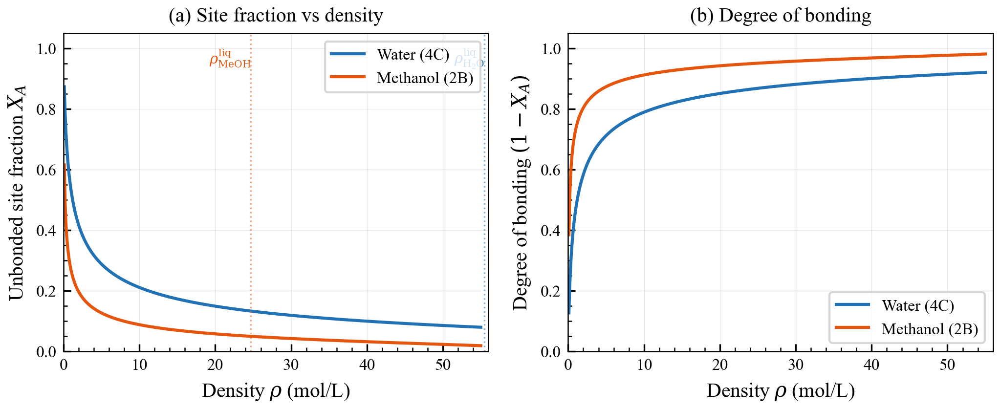

*Figure 4.1: 01 Site Fraction Vs Density*

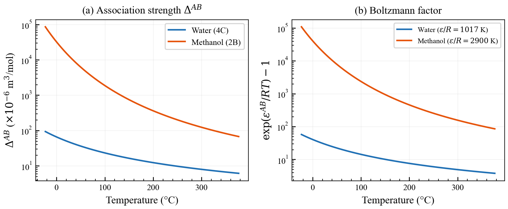

*Figure 4.2: 02 Delta Vs Temperature*

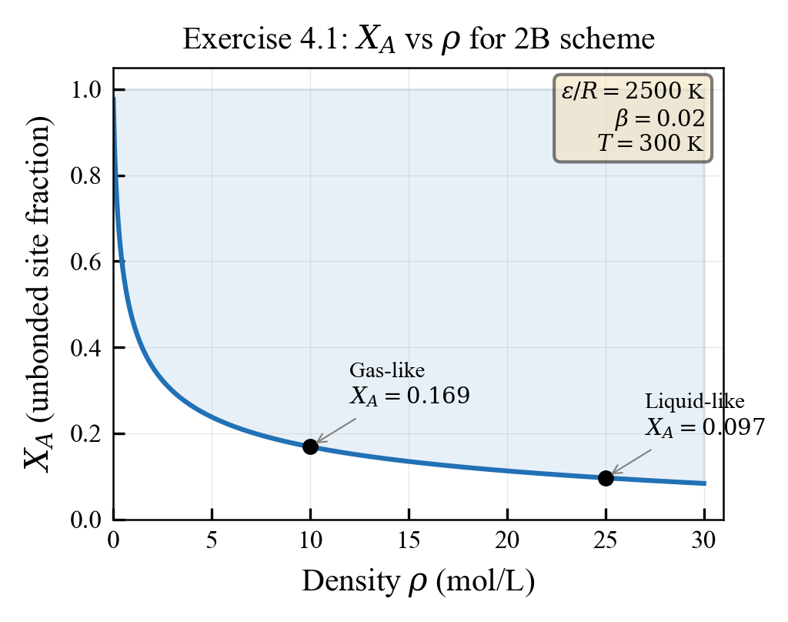

*Figure 4.3: Ex01 Xa Vs Rho*

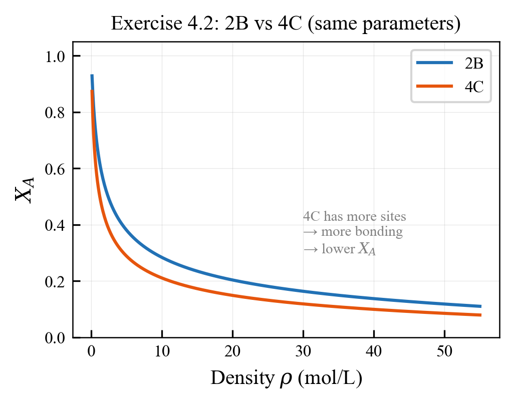

*Figure 4.4: Ex02 2B Vs 4C*

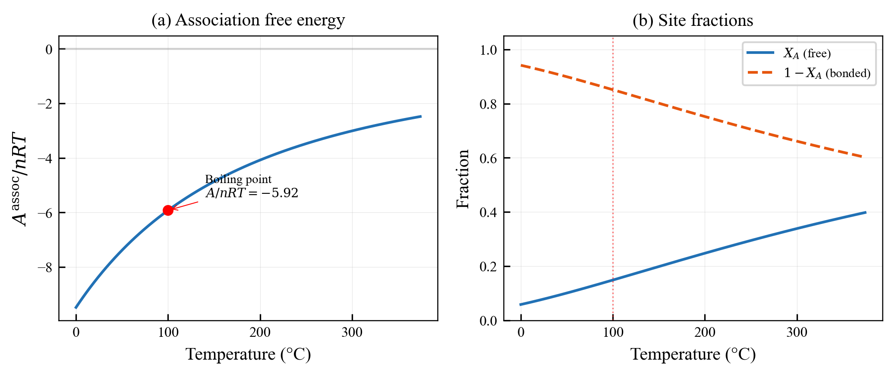

*Figure 4.5: Ex04 Helmholtz And Bonding*


## Figures

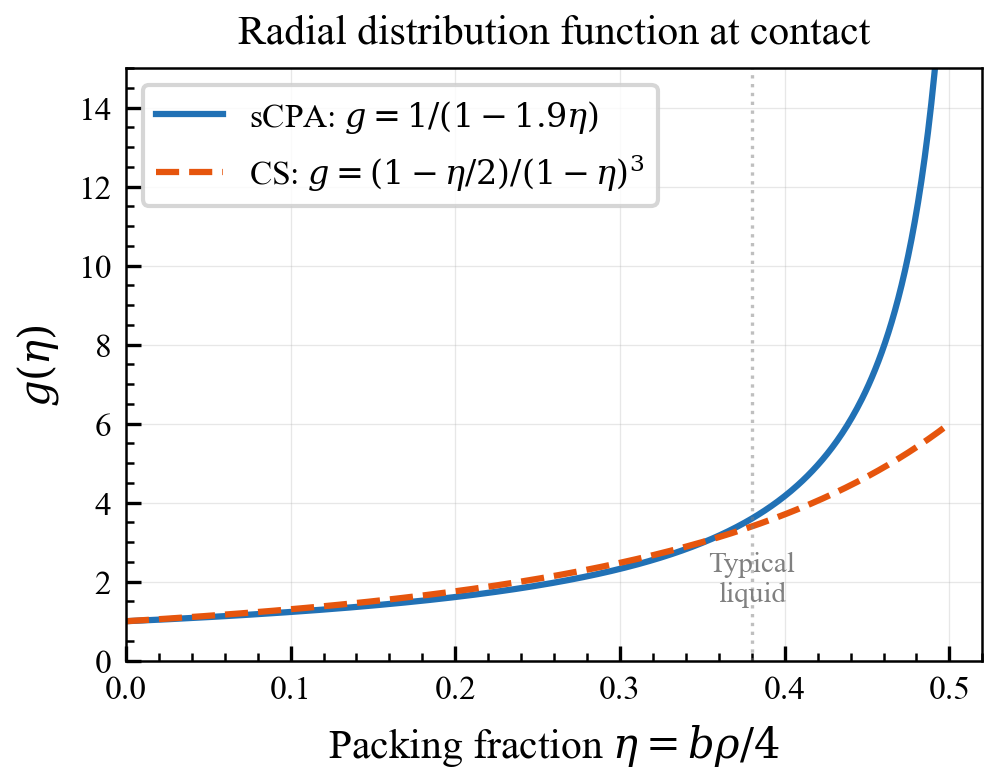

*Figure 4.1: 04 Rdf Vs Packing*

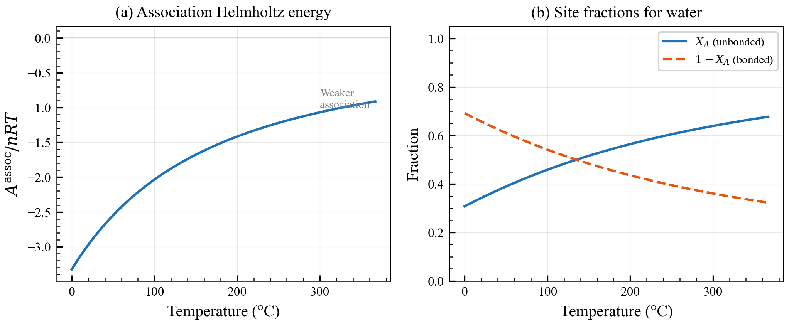

*Figure 4.2: 05 Helmholtz Assoc Vs T*

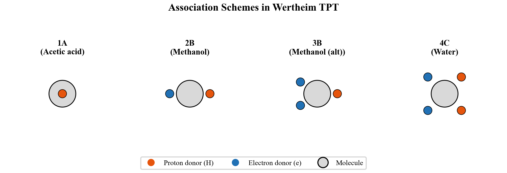

*Figure 4.3: 06 Association Schemes*

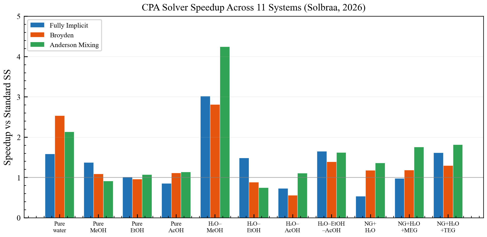

*Figure 4.4: 07 Solver Speedup Paperlab*

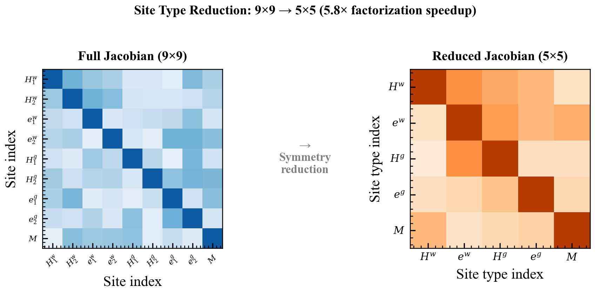

*Figure 4.5: 08 Site Reduction Jacobian*


## Figures

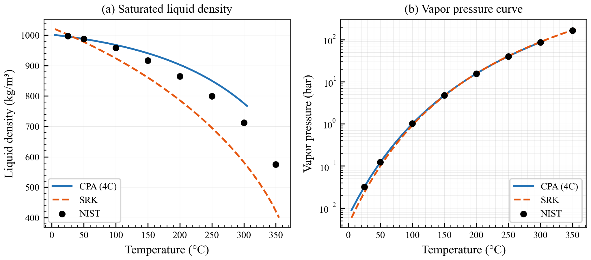

*Figure 4.1: 03 Cpa Vs Srk Water*
