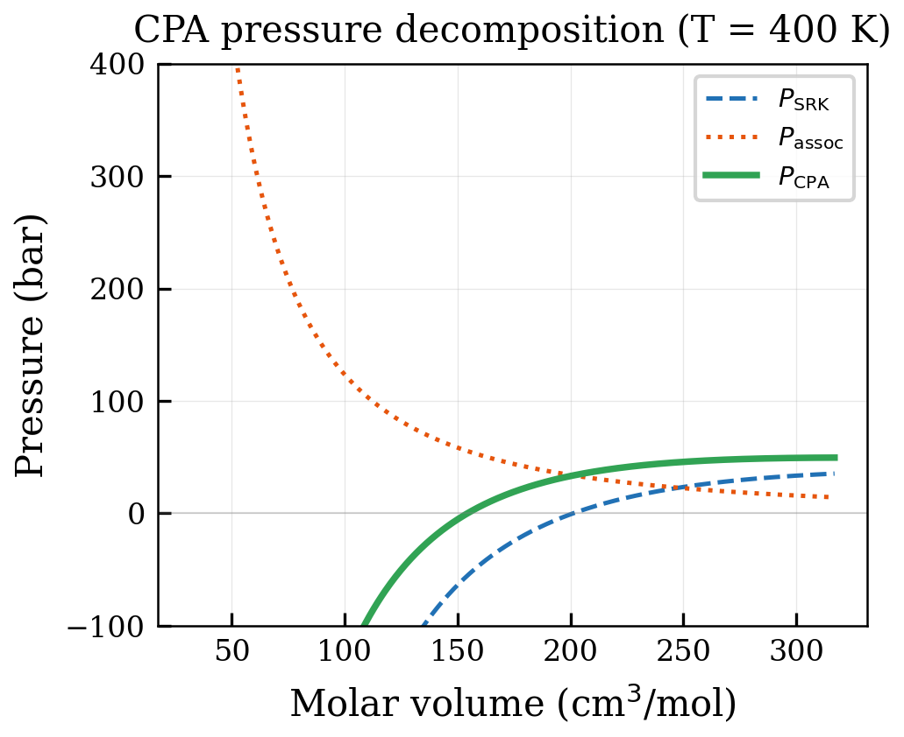
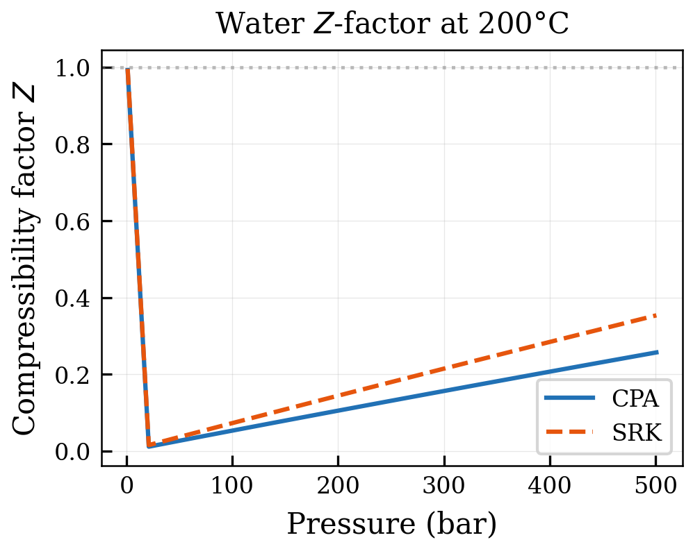
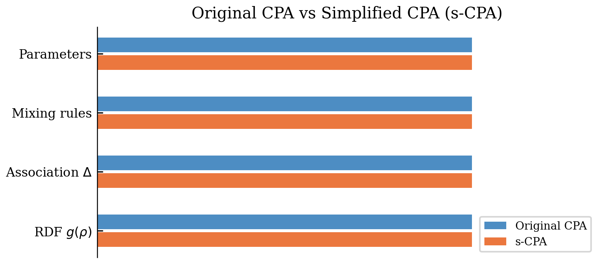
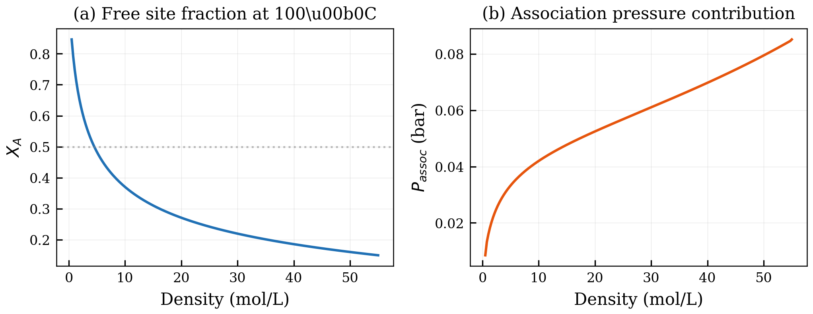
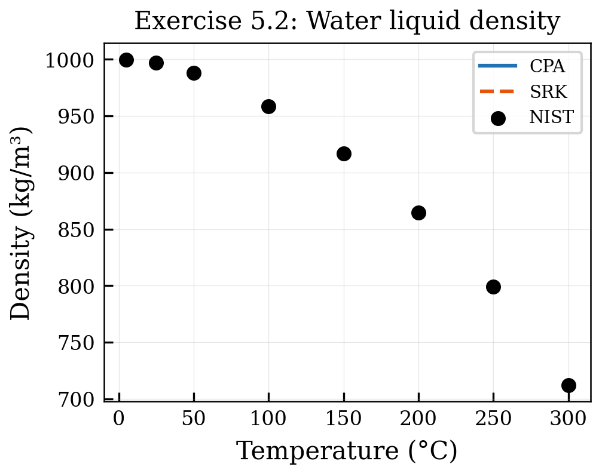
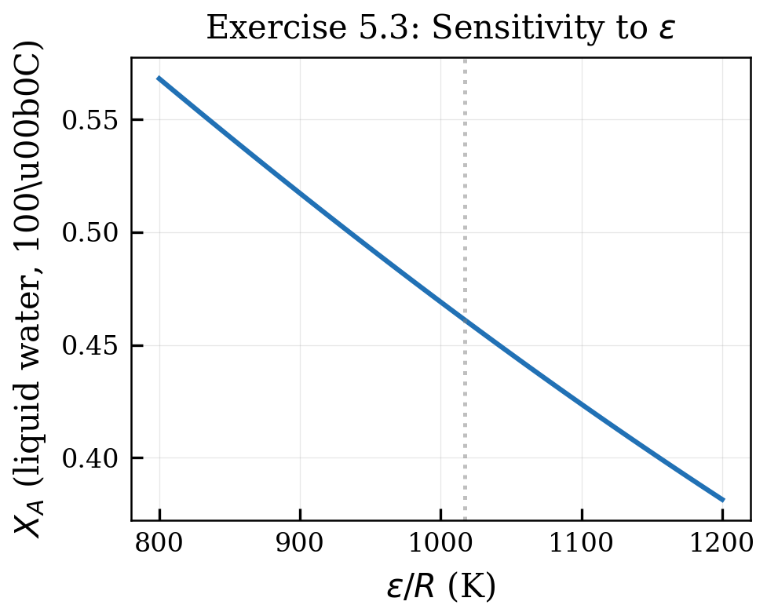

# The CPA Equation of State: Complete Formulation

<!-- Chapter metadata -->
<!-- Notebooks: 01_cpa_components.ipynb, 02_fugacity_calculation.ipynb -->
<!-- Estimated pages: 22 -->

## Learning Objectives

After reading this chapter, the reader will be able to:

1. Write the complete CPA pressure equation combining SRK and association terms
2. Derive fugacity coefficients for CPA including all cross-derivatives
3. Compute thermodynamic derivatives (enthalpy, entropy, heat capacity) from CPA
4. Distinguish between standard CPA and simplified CPA (sCPA)
5. Explain the five pure-component parameters of CPA

## 5.1 The CPA Pressure Equation

### 5.1.1 Combining Cubic and Association Terms

The CPA equation of state writes the pressure as the sum of a classical cubic term and an association term:

$$P = P^{\text{cubic}} + P^{\text{assoc}}$$

Using the SRK equation as the cubic foundation:

$$P = \frac{RT}{V_m - b} - \frac{a(T)}{V_m(V_m + b)} - \frac{1}{2} \frac{RT}{V_m} \left(1 + \rho \frac{\partial \ln g}{\partial \rho}\right) \sum_i x_i \sum_{A_i} (1 - X_{A_i})$$

The first two terms are the standard SRK equation. The third term is the association contribution, where $g(\rho)$ is the radial distribution function at contact and $X_{A_i}$ are the site fractions satisfying the site balance equations from Chapter 4.

### 5.1.2 The Simplified CPA (sCPA)

The original CPA formulation used a hard-sphere reference for the radial distribution function, leading to a complex density dependence in the association term. Kontogeorgis et al. (1999) proposed a simplification where the RDF and its derivative are approximated as:

$$g(\rho) = \frac{1}{1 - 1.9\eta}, \quad \eta = \frac{b}{4V_m}$$

$$1 + \rho \frac{\partial \ln g}{\partial \rho} = \frac{1}{1 - 1.9\eta} + \frac{0.475\eta}{(1 - 1.9\eta)^2}$$

However, in many implementations including NeqSim's `SystemSrkCPAstatoil`, a further simplification is employed where the volume-dependent prefactor in the association pressure term is simplified. The resulting **simplified CPA** (sCPA) equation is:

$$P = \frac{RT}{V_m - b} - \frac{a(T)}{V_m(V_m + b)} - \frac{RT}{2V_m} \sum_i x_i \sum_{A_i} (1 - X_{A_i})$$

This form is computationally more efficient and produces results of comparable accuracy to the original CPA. The association strength in sCPA is:

$$\Delta^{A_i B_j} = g(\rho) \left[\exp\left(\frac{\varepsilon^{A_i B_j}}{RT}\right) - 1\right] b_{ij} \beta^{A_i B_j}$$

with $g(\rho) = 1/(1 - 1.9\eta)$ and $b_{ij} = (b_i + b_j)/2$.

### 5.1.3 Helmholtz Energy Formulation

It is often more convenient to work with the Helmholtz energy rather than the pressure equation. The total residual Helmholtz energy for CPA is:

$$A^{\text{res}} = A^{\text{SRK}} + A^{\text{assoc}}$$

where:

$$A^{\text{SRK}} = -nRT \ln\left(\frac{V - nb}{V}\right) - \frac{a}{b} \ln\left(\frac{V + nb}{V}\right)$$

$$A^{\text{assoc}} = nRT \sum_i x_i \sum_{A_i} \left(\ln X_{A_i} - \frac{X_{A_i}}{2} + \frac{1}{2}\right)$$

All thermodynamic properties can be derived from this Helmholtz energy by differentiation.

## 5.2 The Five Pure-Component Parameters

For an associating component in CPA, five parameters must be determined:

### 5.2.1 Physical Parameters from the Cubic Term

Three parameters come from the SRK part:

1. **$a_0$** (or equivalently $\Omega_a T_c^2/P_c$): the attractive energy parameter at the reference temperature. This primarily controls the vapor pressure.

2. **$b$**: the co-volume parameter. This primarily controls the liquid density.

3. **$c_1$** (the first coefficient of the alpha function): controls the temperature dependence of $a(T)$ through:

$$a(T) = a_0 \left[1 + c_1\left(1 - \sqrt{T_r}\right)\right]^2$$

Note that for CPA, the Soave correlation $m = f(\omega)$ is **not** used. Instead, $c_1$ is fitted directly to experimental data along with the other parameters.

### 5.2.2 Association Parameters

Two parameters describe the hydrogen bonding:

4. **$\varepsilon^{AB}$**: the association energy (in J/mol or K). This determines the temperature at which hydrogen bonds begin to break. Typical values range from 1000 to 3000 K (in $\varepsilon/k_B$).

5. **$\beta^{AB}$**: the association volume (dimensionless). This determines the probability that two molecules at contact distance will be in the correct orientation for bonding. Typical values range from 0.001 to 0.1.

### 5.2.3 Non-Associating Components

For non-associating components (alkanes, N$_2$, CO$_2$, etc.), the association parameters are zero and CPA reduces to SRK. The three cubic parameters are determined from:

$$a_0 = 0.42748 \frac{R^2 T_c^2}{P_c}, \quad b = 0.08664 \frac{RT_c}{P_c}, \quad c_1 = 0.48508 + 1.55171\omega - 0.15613\omega^2$$

Thus, non-associating components retain their SRK parameters unchanged — this backward compatibility was a key design goal of CPA.

## 5.3 Fugacity Coefficients

### 5.3.1 The Complete Expression

The fugacity coefficient of component $i$ in a CPA mixture has contributions from both the cubic and association terms:

$$\ln \varphi_i = \ln \varphi_i^{\text{SRK}} + \ln \varphi_i^{\text{assoc}}$$

The SRK contribution is the standard expression from Chapter 3:

$$\ln \varphi_i^{\text{SRK}} = \frac{b_i}{b_m}(Z - 1) - \ln(Z - B) - \frac{A}{B}\left(\frac{2\sum_j x_j a_{ij}}{a_m} - \frac{b_i}{b_m}\right) \ln\left(1 + \frac{B}{Z}\right)$$

The association contribution is:

$$\ln \varphi_i^{\text{assoc}} = \sum_{A_i} \left(\ln X_{A_i}\right) + \sum_k x_k \sum_{A_k} \frac{1}{X_{A_k}} \frac{\partial X_{A_k}}{\partial n_i} \bigg|_{T,V}$$

The second term arises because adding molecule $i$ to the mixture changes the site fractions of all species.

### 5.3.2 The Cross-Derivative Challenge

Computing $\partial X_{A_k}/\partial n_i$ requires implicit differentiation of the site balance equations. Differentiating:

$$X_{A_i} = \frac{1}{1 + \rho \sum_j x_j \sum_{B_j} X_{B_j} \Delta^{A_i B_j}}$$

with respect to $n_i$ at constant $T$ and $V$ yields a system of linear equations:

$$\sum_k \sum_{B_k} M_{A_i, B_k} \frac{\partial X_{B_k}}{\partial n_j} = R_{A_i, j}$$

where the matrix $M$ and right-hand side $R$ involve the current values of $X$, $\Delta$, and their derivatives with respect to composition and volume.

In NeqSim, this linear system is solved analytically for simple association schemes and numerically for complex mixtures. The efficient computation of these derivatives is crucial for the performance of the flash algorithm and is one of the main contributions of the NeqSim implementation.

### 5.3.3 Verification by Numerical Differentiation

When implementing CPA, it is essential to verify the analytical fugacity coefficients against numerical differentiation:

$$\ln \varphi_i^{\text{numerical}} = \frac{1}{RT} \frac{\partial A^{\text{res}}}{\partial n_i} \bigg|_{T,V}^{\text{numerical}} \approx \frac{A^{\text{res}}(n_i + \delta) - A^{\text{res}}(n_i - \delta)}{2\delta \cdot RT}$$

This is a critical development practice used in NeqSim's test suite.

## 5.4 Thermodynamic Derivatives

### 5.4.1 Temperature Derivatives

The temperature derivative of the Helmholtz energy is needed for entropy and enthalpy:

$$\left(\frac{\partial A^{\text{assoc}}}{\partial T}\right)_{V,\mathbf{n}} = nR \sum_i x_i \sum_{A_i} \left(\ln X_{A_i} - \frac{X_{A_i}}{2} + \frac{1}{2}\right) + nRT \sum_i x_i \sum_{A_i} \frac{1}{X_{A_i}} \frac{\partial X_{A_i}}{\partial T}$$

The derivative $\partial X_{A_i}/\partial T$ is computed by differentiating the site balance equation with respect to temperature, which introduces the temperature derivative of $\Delta^{AB}$:

$$\frac{\partial \Delta^{AB}}{\partial T} = \frac{\partial g}{\partial T} \left[\exp\left(\frac{\varepsilon}{RT}\right) - 1\right] b\beta + g \cdot \left(-\frac{\varepsilon}{RT^2}\right) \exp\left(\frac{\varepsilon}{RT}\right) \cdot b\beta$$

### 5.4.2 Volume Derivatives

The volume derivative gives the association contribution to pressure:

$$P^{\text{assoc}} = -\left(\frac{\partial A^{\text{assoc}}}{\partial V}\right)_{T,\mathbf{n}} = -\frac{nRT}{V_m} \sum_i x_i \sum_{A_i} \frac{1}{X_{A_i}} \frac{\partial X_{A_i}}{\partial V} \cdot V_m$$

The volume derivative of $X_A$ involves:

$$\frac{\partial \Delta^{AB}}{\partial V} = \frac{\partial g}{\partial V} \left[\exp\left(\frac{\varepsilon}{RT}\right) - 1\right] b\beta$$

where $\partial g/\partial V$ depends on the choice of radial distribution function.

### 5.4.3 Second Derivatives

Second derivatives are needed for heat capacities, speed of sound, and other caloric properties:

$$\left(\frac{\partial^2 A^{\text{assoc}}}{\partial T^2}\right)_{V,\mathbf{n}}, \quad \left(\frac{\partial^2 A^{\text{assoc}}}{\partial V^2}\right)_{T,\mathbf{n}}, \quad \left(\frac{\partial^2 A^{\text{assoc}}}{\partial T \partial V}\right)_{\mathbf{n}}$$

These expressions are lengthy but follow directly from differentiating the site balance equations twice. The key challenge is maintaining analytical consistency — numerical errors in second derivatives propagate into property calculations and can cause convergence problems in flash algorithms.

## 5.5 Enthalpy and Heat Capacity Contributions

### 5.5.1 Residual Enthalpy from Association

The association contribution to the residual enthalpy is:

$$H^{\text{assoc}} = A^{\text{assoc}} + TS^{\text{assoc}} + PV - nRT$$

This simplifies to:

$$H^{\text{assoc}} = -T^2 \frac{\partial}{\partial T}\left(\frac{A^{\text{assoc}}}{T}\right)_{V,\mathbf{n}} + V P^{\text{assoc}} - nRT$$

The association enthalpy is negative (exothermic) because forming hydrogen bonds releases energy. Its magnitude depends on the degree of association: at low temperatures where most sites are bonded, $H^{\text{assoc}}$ is most negative.

### 5.5.2 Heat Capacity

The heat capacity contribution from association is significant for water and alcohols. The association contribution to $C_V$ is:

$$C_V^{\text{assoc}} = -T \left(\frac{\partial^2 A^{\text{assoc}}}{\partial T^2}\right)_{V,\mathbf{n}}$$

This captures the physical effect that breaking hydrogen bonds as temperature increases absorbs energy, contributing to the anomalously high heat capacity of water. CPA predictions of $C_P$ for water are significantly better than SRK because the association term accounts for the energy stored in the hydrogen-bond network.

## 5.6 The PR-CPA Variant

While the standard CPA uses SRK as the cubic term, a Peng–Robinson variant has also been developed:

$$P = \frac{RT}{V_m - b} - \frac{a(T)}{V_m^2 + 2bV_m - b^2} + P^{\text{assoc}}$$

PR-CPA generally provides better liquid density predictions due to the improved critical compressibility factor of the PR equation. However, SRK-CPA has a larger parameter database and is more widely used in the oil and gas industry.

NeqSim implements both variants:

```python
from neqsim import jneqsim

# SRK-CPA (standard, recommended)
fluid_srk = jneqsim.thermo.system.SystemSrkCPAstatoil(298.15, 1.0)
fluid_srk.addComponent("water", 1.0)
fluid_srk.setMixingRule(10)

# PR-CPA variant
fluid_pr = jneqsim.thermo.system.SystemPrCPA(298.15, 1.0)
fluid_pr.addComponent("water", 1.0)
fluid_pr.setMixingRule(10)

# Compare
for fluid, name in [(fluid_srk, "SRK-CPA"), (fluid_pr, "PR-CPA")]:
    ops = jneqsim.thermodynamicoperations.ThermodynamicOperations(fluid)
    ops.TPflash()
    fluid.initProperties()
    rho = fluid.getDensity("kg/m3")
    print(f"{name}: density = {rho:.1f} kg/m3")
```

## 5.7 Derivative Properties from CPA

### 5.7.1 Pressure Derivatives

For engineering calculations, the first and second derivatives of pressure with respect to temperature, volume, and composition are needed. Each derivative has contributions from both the cubic and association terms.

The pressure derivative with respect to temperature at constant volume:

$$\left(\frac{\partial P}{\partial T}\right)_V = \left(\frac{\partial P^{\text{SRK}}}{\partial T}\right)_V + \left(\frac{\partial P^{\text{assoc}}}{\partial T}\right)_V$$

The cubic contribution is:

$$\left(\frac{\partial P^{\text{SRK}}}{\partial T}\right)_V = \frac{nR}{V - nb} - \frac{\frac{da}{dT}}{V(V + nb)}$$

The association contribution requires the chain rule through the site fractions:

$$\left(\frac{\partial P^{\text{assoc}}}{\partial T}\right)_V = -nRT \sum_i x_i \sum_{A_i} \frac{1}{X_{A_i}} \frac{\partial X_{A_i}}{\partial T} \cdot \frac{1}{V}$$

Computing $\partial X_{A_i}/\partial T$ requires differentiating the implicit site balance equations with respect to temperature, yielding a linear system of equations in the site fraction derivatives.

### 5.7.2 Fugacity Coefficient with Association

The fugacity coefficient of component $i$ in CPA is:

$$\ln \varphi_i = \ln \varphi_i^{\text{SRK}} + \ln \varphi_i^{\text{assoc}}$$

The association contribution to the fugacity coefficient is:

$$\ln \varphi_i^{\text{assoc}} = \sum_{A_i} \left(\ln X_{A_i} - \frac{X_{A_i}}{2} + \frac{1}{2}\right) + \sum_j x_j \sum_{A_j} \frac{1}{X_{A_j}} \frac{\partial X_{A_j}}{\partial n_i}$$

The last term accounts for the fact that changing the amount of component $i$ affects the site fractions of all other components through the site balance equations. This coupling term is often the most computationally expensive part of the fugacity calculation.

### 5.7.3 Residual Enthalpy and Entropy

The residual enthalpy from CPA includes:

$$H^{\text{res,assoc}} = -nRT^2 \sum_i x_i \sum_{A_i} \frac{1}{X_{A_i}} \left(\frac{\partial X_{A_i}}{\partial T}\right)_{P,\mathbf{n}}$$

This term is always negative (association releases energy when bonds form) and is responsible for the large heat of vaporization of water and alcohols.

The residual entropy from association:

$$S^{\text{res,assoc}} = -nR \sum_i x_i \sum_{A_i} \left(\ln X_{A_i} - \frac{X_{A_i}}{2} + \frac{1}{2}\right) - \frac{H^{\text{res,assoc}}}{T}$$

The first term is always positive (association reduces the number of microscopic configurations), while the enthalpy term is always negative. The net entropy of association is typically negative — association creates order.

### 5.7.4 Heat Capacity from CPA

The association contribution to the isobaric heat capacity $C_P$ is significant for strongly associating fluids:

$$C_P^{\text{assoc}} = \left(\frac{\partial H^{\text{assoc}}}{\partial T}\right)_P$$

For liquid water, the association contribution accounts for approximately 40% of the total $C_P$, reflecting the energy required to break hydrogen bonds as temperature increases. CPA reproduces this effect quantitatively, while classical cubic EoS underpredict $C_P$ by 15–25%.

## 5.8 Implementation in NeqSim

### 5.8.1 Class Hierarchy

The CPA implementation in NeqSim follows a layered architecture with System, Phase, and Component levels:

**System level** (`neqsim.thermo.system`):
- `SystemSrkCPA` — base CPA with standard solver
- `SystemSrkCPAs` — simplified CPA
- `SystemSrkCPAstatoil` — recommended: sCPA with Equinor parameters
- `SystemSrkCPAstatoilFullyImplicit` — fully implicit Newton solver
- `SystemSrkCPAstatoilBroydenImplicit` — Broyden quasi-Newton
- `SystemSrkCPAstatoilAndersonMixing` — Anderson acceleration

**Phase level** (`neqsim.thermo.phase`):
- `PhaseSrkCPA` — SRK-CPA phase calculations
- `PhaseSrkCPAs` — simplified CPA phase

**Component level** (`neqsim.thermo.component`):
- `ComponentSrkCPA` — fugacity coefficient, association parameters

### 5.7.2 Parameter Database

NeqSim stores CPA parameters in its component database. For each associating component, the database contains:

- Cubic parameters: $T_c$, $P_c$, $\omega$, and the CPA-specific $a_0$, $b$, $c_1$
- Association parameters: $\varepsilon/R$ (in K), $\beta$ (dimensionless)
- Association scheme: specified as site counts

When a CPA system is created, NeqSim automatically loads the appropriate parameters:

```python
from neqsim import jneqsim

fluid = jneqsim.thermo.system.SystemSrkCPAstatoil(298.15, 1.0)
fluid.addComponent("water", 1.0)
fluid.addComponent("methanol", 0.5)
fluid.addComponent("methane", 2.0)
fluid.setMixingRule(10)  # CPA mixing rule with cross-association

# water and methanol get CPA parameters automatically
# methane gets standard SRK parameters
```

### 5.7.3 Mixing Rule 10

The mixing rule index 10 in NeqSim activates the CPA mixing rules with automatic handling of cross-association. This rule:

1. Uses van der Waals one-fluid rules for the cubic parameters ($a_m$, $b_m$)
2. Applies the CR-1 combining rule for cross-association parameters
3. Handles solvation between associating and non-self-associating species
4. Manages the site bookkeeping for complex multicomponent mixtures

## 5.9 Worked Example: Step-by-Step CPA Pressure Calculation

This section walks through the computation of pressure from CPA for a pure associating fluid at a given temperature and molar volume, showing how the cubic and association contributions combine.

### 5.9.1 Problem Setup

Compute the CPA pressure for pure water at $T = 373.15$ K and $V_m = 18.8 \times 10^{-6}$ m$^3$/mol (approximately liquid water at 100°C).

### 5.9.2 Step 1: Evaluate the SRK Cubic Contribution

The SRK parameters for CPA-water (Equinor set): $a_0 = 0.12277$ Pa·m$^6$/mol$^2$, $b = 1.4515 \times 10^{-5}$ m$^3$/mol, $c_1 = 0.6736$.

The temperature-dependent $a(T)$:

$$\alpha(T) = [1 + c_1(1 - \sqrt{T_r})]^2$$

where $T_r = T/T_c = 373.15/647.3 = 0.5765$:

$$\alpha = [1 + 0.6736(1 - \sqrt{0.5765})]^2 = [1 + 0.6736 \times 0.2407]^2 = 1.3560$$

$$a(T) = a_0 \times \alpha = 0.12277 \times 1.3560 = 0.16648 \text{ Pa·m}^6/\text{mol}^2$$

The SRK pressure contribution:

$$P^{\text{SRK}} = \frac{RT}{V_m - b} - \frac{a(T)}{V_m(V_m + b)}$$

$$= \frac{8.314 \times 373.15}{18.8 \times 10^{-6} - 1.4515 \times 10^{-5}} - \frac{0.16648}{18.8 \times 10^{-6}(18.8 \times 10^{-6} + 1.4515 \times 10^{-5})}$$

### 5.9.3 Step 2: Solve the Site Balance

For water (4C scheme), $X_e = X_H = X$:

$$X = \frac{-1 + \sqrt{1 + 8\rho\Delta}}{4\rho\Delta}$$

where $\rho = 1/V_m$ and $\Delta$ is computed from the association parameters.

### 5.9.4 Step 3: Compute the Association Pressure

The association contribution to pressure is:

$$P^{\text{assoc}} = -\frac{RT}{V_m}\left(1 + V_m \frac{\partial \ln g}{\partial V_m}\right)\sum_{A}\left(\frac{1}{X_A} - \frac{1}{2}\right) \frac{\partial X_A}{\partial (1/V_m)}$$

In practice, this derivative is computed numerically in NeqSim via the chain rule, as detailed in Chapter 8.

### 5.9.5 Step 4: Total CPA Pressure

$$P^{\text{CPA}} = P^{\text{SRK}} + P^{\text{assoc}}$$

The association term is always **positive** for the pressure (it increases the total pressure relative to SRK alone) because the association reduces the Helmholtz energy, and $P = -(\partial A/\partial V)_T$.

## 5.10 The Simplified CPA (sCPA)

In the original CPA formulation, the radial distribution function $g(V_m)$ is taken from the Carnahan–Starling hard-sphere expression:

$$g^{\text{CS}}(\eta) = \frac{1 - \eta/2}{(1-\eta)^3}, \quad \eta = \frac{b}{4V_m}$$

In the **simplified CPA** (sCPA), the radial distribution function is replaced by the simpler expression:

$$g^{\text{sCPA}}(\eta) = \frac{1}{1 - 1.9\eta}$$

where $\eta = b/(4V_m)$. This simplification:

1. **Reduces computational cost**: $g^{\text{sCPA}}$ and its derivatives are simpler to evaluate
2. **Improves numerical stability**: the sCPA expression has a single singularity at $\eta = 1/1.9 = 0.526$ vs. a triple singularity at $\eta = 1$ for Carnahan–Starling
3. **Gives equivalent accuracy**: when parameters are refitted to the simplified model, the quality of predictions is essentially unchanged

The NeqSim `SystemSrkCPAstatoil` class uses the sCPA formulation, which is recommended for all industrial applications. The full Carnahan–Starling version is available in `SystemSrkCPA` for research purposes.

### 5.10.1 Impact on Derivatives

The choice of $g$ affects all derivative properties because the pressure includes a term proportional to $\partial g/\partial V$:

For Carnahan–Starling:

$$\frac{\partial \ln g^{\text{CS}}}{\partial \eta} = \frac{5 - 2\eta}{2(1-\eta)(2-\eta)}$$

For sCPA:

$$\frac{\partial \ln g^{\text{sCPA}}}{\partial \eta} = \frac{1.9}{1 - 1.9\eta}$$

The simpler derivative in sCPA propagates through the entire calculation chain (fugacity, enthalpy, heat capacity), reducing both coding complexity and computational cost.

## 5.11 Complete Derivative Chain: From Helmholtz Energy to Engineering Properties

To compute any thermodynamic property from CPA, one follows a systematic derivative chain starting from the residual Helmholtz energy:

$$A^{\text{res}} = A^{\text{SRK}} + A^{\text{assoc}}$$

### 5.11.1 Association Contribution to Helmholtz Energy

The association Helmholtz energy is:

$$\frac{A^{\text{assoc}}}{nRT} = \sum_i x_i \sum_{A_i} \left[\ln X_{A_i} - \frac{X_{A_i}}{2} + \frac{1}{2}\right]$$

This compact expression contains all the thermodynamic information about the hydrogen-bond network. The factor $[\ln X_{A_i} - X_{A_i}/2 + 1/2]$ is always non-positive (since $0 \leq X_{A_i} \leq 1$), confirming that association always reduces the Helmholtz energy — hydrogen bonds stabilize the system.

### 5.11.2 Derivatives with Respect to Volume

The association contribution to pressure requires:

$$P^{\text{assoc}} = -\left(\frac{\partial A^{\text{assoc}}}{\partial V}\right)_{T,\mathbf{n}}$$

Using the chain rule:

$$P^{\text{assoc}} = -\frac{nRT}{2V}\rho \frac{\partial \ln g}{\partial \rho}\sum_i x_i \sum_{A_i}(1 - X_{A_i})$$

where $\rho = n/V$ is the molar density and $g$ is the radial distribution function. The quantity $(1 - X_{A_i})$ is the fraction of sites of type $A$ on molecule $i$ that are bonded.

### 5.11.3 Derivatives with Respect to Temperature

The enthalpy contribution requires:

$$H^{\text{assoc}} = A^{\text{assoc}} + TS^{\text{assoc}} + P^{\text{assoc}}V - nRT$$

where:

$$S^{\text{assoc}} = -\left(\frac{\partial A^{\text{assoc}}}{\partial T}\right)_{V,\mathbf{n}}$$

The temperature derivative involves:

$$\left(\frac{\partial A^{\text{assoc}}}{\partial T}\right)_V = \frac{A^{\text{assoc}}}{T} + nRT\sum_i x_i \sum_{A_i}\frac{1}{X_{A_i}}\frac{\partial X_{A_i}}{\partial T}$$

The term $\partial X_{A_i}/\partial T$ captures the fact that hydrogen bonds break as temperature increases. Computing this derivative requires solving a linear system obtained by differentiating the site balance equations with respect to temperature.

### 5.11.4 The Linear System for Site Fraction Derivatives

Differentiating the site balance equation with respect to any variable $\xi$ (which can be $T$, $V$, or $n_j$):

$$\frac{\partial X_{A_i}}{\partial \xi} = -X_{A_i}^2 \sum_j \rho_j \sum_{B_j} \left[\frac{\partial \Delta^{A_iB_j}}{\partial \xi} X_{B_j} + \Delta^{A_iB_j}\frac{\partial X_{B_j}}{\partial \xi}\right]$$

This is a linear system in the unknowns $\partial X_{B_j}/\partial \xi$. For a system with $N_s$ total association sites, this is an $N_s \times N_s$ linear system. For water (4 sites) in a binary with methane (0 sites), it is a $4 \times 4$ system. For water + methanol (4 + 2 sites), it is $6 \times 6$.

The matrix of this linear system is:

$$\mathbf{M}_{(A_i)(B_j)} = \delta_{(A_i)(B_j)} + X_{A_i}^2 \rho_j \Delta^{A_iB_j}$$

and the right-hand side depends on $\partial \Delta/\partial \xi$.

### 5.11.5 Temperature Derivative of the Association Strength

$$\frac{\partial \Delta^{A_iB_j}}{\partial T} = \Delta^{A_iB_j}\left[\frac{\varepsilon^{A_iB_j}}{RT^2} + \frac{1}{g}\frac{\partial g}{\partial T} + \frac{1}{b_{ij}}\frac{\partial b_{ij}}{\partial T}\right]$$

The dominant term is $\varepsilon/(RT^2)$, which is always positive — meaning the association strength increases as temperature decreases. This is physically correct: cooling promotes hydrogen bond formation.

### 5.11.6 Heat Capacity Contribution

The association contribution to $C_V$ requires the second temperature derivative:

$$C_V^{\text{assoc}} = -T\left(\frac{\partial^2 A^{\text{assoc}}}{\partial T^2}\right)_V$$

This involves second derivatives of the site fractions, requiring differentiation of the linear system a second time. The resulting contribution is always positive — association increases the heat capacity because breaking hydrogen bonds requires energy.

For water, the association contribution to $C_P$ accounts for approximately 30% of the total heat capacity at 25°C — explaining why CPA gives significantly better heat capacity predictions than SRK.

## 5.12 Comparison: CPA vs. SRK for Pure Water

To demonstrate the improvement CPA provides, let us compare predictions for pure water:

```python
from neqsim import jneqsim

T_K = 373.15  # 100 C, boiling point of water at 1 atm

for ModelClass, name in [
    (jneqsim.thermo.system.SystemSrkEos, "SRK"),
    (jneqsim.thermo.system.SystemSrkCPAstatoil, "CPA"),
]:
    fluid = ModelClass(T_K, 1.01325)
    fluid.addComponent("water", 1.0)
    if "CPA" in name:
        fluid.setMixingRule(10)
    else:
        fluid.setMixingRule("classic")

    ops = jneqsim.thermodynamicoperations.ThermodynamicOperations(fluid)
    ops.TPflash()
    fluid.initProperties()

    rho_liq = fluid.getPhase("aqueous").getDensity("kg/m3")
    print(f"{name}: liquid density at 100 C = {rho_liq:.1f} kg/m3")
    # Experimental: 958.4 kg/m3
```

## 5.13 The Fugacity Coefficient: Composition Dependence

### 5.13.1 General Expression

The fugacity coefficient of component $i$ in a CPA mixture is:

$$\ln \varphi_i = \ln \varphi_i^{\text{SRK}} + \ln \varphi_i^{\text{assoc}}$$

The SRK contribution is the standard expression from cubic EoS theory. The association contribution is obtained from:

$$\ln \varphi_i^{\text{assoc}} = \frac{1}{RT}\left(\frac{\partial n A^{\text{assoc}}}{\partial n_i}\right)_{T,V,n_{j \neq i}}$$

### 5.13.2 The Composition Derivative

Evaluating $\partial(n A^{\text{assoc}})/\partial n_i$ requires careful application of the chain rule because $A^{\text{assoc}}$ depends on $n_i$ both explicitly (through the sum over components) and implicitly (through $X_{A_j}$, which depends on all compositions).

Using the identity that $\partial A^{\text{assoc}}/\partial X_{A_j} = 0$ at the site-balance solution (this is a key simplification from Wertheim's theory), the result simplifies to:

$$\ln \varphi_i^{\text{assoc}} = \sum_{A_i}\left(\ln X_{A_i} - \frac{X_{A_i}}{2} + \frac{1}{2}\right) - \frac{1}{2}\sum_j n_j \sum_{A_j}\frac{1}{X_{A_j}}\frac{\partial X_{A_j}}{\partial n_i}$$

The first sum runs only over the sites on molecule $i$ — the direct contribution from molecule $i$'s own bonding state. The second sum runs over all sites on all molecules — the indirect contribution from how adding molecule $i$ changes the bonding state of every other molecule.

### 5.13.3 Physical Interpretation

For a non-associating component (e.g., methane) in a mixture with water:

- The first sum is zero (methane has no association sites)
- The second sum is nonzero because adding methane dilutes the system, reducing the density and thereby changing water's site fractions

This means methane has a nonzero association contribution to its fugacity coefficient even though it has no association sites. The effect arises because methane molecules occupy space that could otherwise be occupied by water molecules — reducing the average number of hydrogen bonds in the system and indirectly affecting the chemical potential.

For water in the same mixture:

- The first sum reflects water's own bonding state (partially bonded, $X_A < 1$)
- The second sum reflects how adding one more water molecule perturbs the bonding network

The net effect is that water's fugacity is reduced by association (hydrogen bonds stabilize water in the liquid phase), leading to lower vapor pressure and lower solubility in the gas phase compared to SRK predictions.

## Summary

Key points from this chapter:

- CPA combines the SRK cubic EoS with Wertheim's association term: $P = P^{\text{SRK}} + P^{\text{assoc}}$
- Five pure-component parameters: $a_0$, $b$, $c_1$ (cubic) and $\varepsilon$, $\beta$ (association)
- Non-associating components retain their SRK parameters, ensuring backward compatibility
- Fugacity coefficients include cross-derivatives from the site balance equations
- Thermodynamic derivatives capture the energy content of the hydrogen-bond network
- NeqSim provides multiple solver variants (standard, fully implicit, Broyden, Anderson)
- `SystemSrkCPAstatoil` with mixing rule 10 is the recommended choice for industrial use

## Exercises

1. **Exercise 5.1:** Starting from the CPA Helmholtz energy, derive the expression for the association contribution to pressure. Verify that it reduces to zero when all $X_A = 1$.

2. **Exercise 5.2:** For pure water (4C scheme), compute and plot the five CPA parameters' sensitivity: vary each parameter by $\pm 10$% from its database value and calculate the vapor pressure at 100°C. Which parameter has the strongest influence?

3. **Exercise 5.3:** Using NeqSim, compare the predicted heat capacity ($C_P$) of pure water from 0°C to 200°C using SRK and CPA. Compare with NIST reference data. Explain the improvement in terms of the association contribution.

4. **Exercise 5.4:** Compute the fugacity coefficient of water in a methane–water mixture at 100°C and 100 bar using CPA. Decompose it into the SRK and association contributions.

## References

<!-- Chapter-level references are merged into master refs.bib -->


## Figures



*Figure 5.1: 01 Cpa Pressure Decomposition*



*Figure 5.2: 02 Compressibility Cpa Vs Srk*



*Figure 5.3: 03 Original Vs Scpa*



*Figure 5.4: Ex01 Pressure Decomp*



*Figure 5.5: Ex02 Water Density*



*Figure 5.6: Ex03 Eps Sensitivity*
