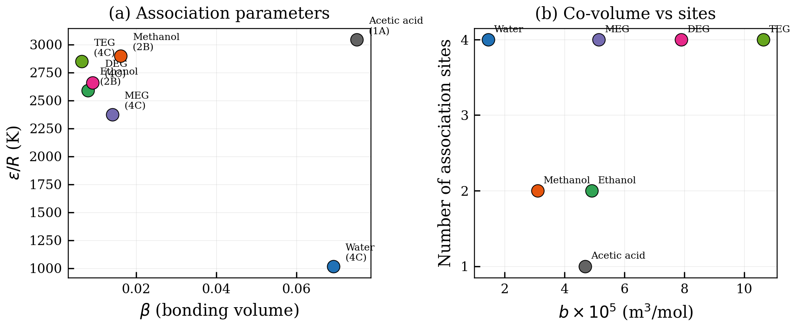
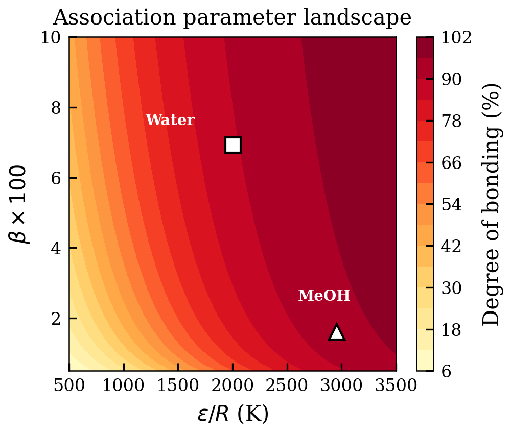
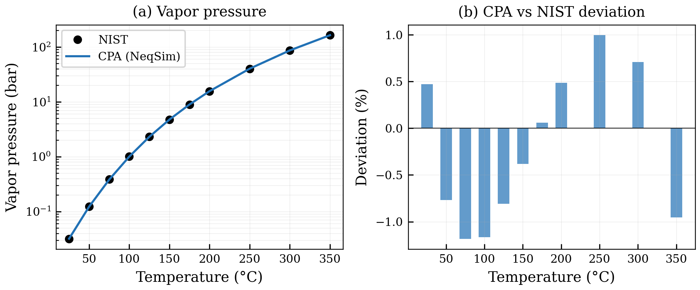
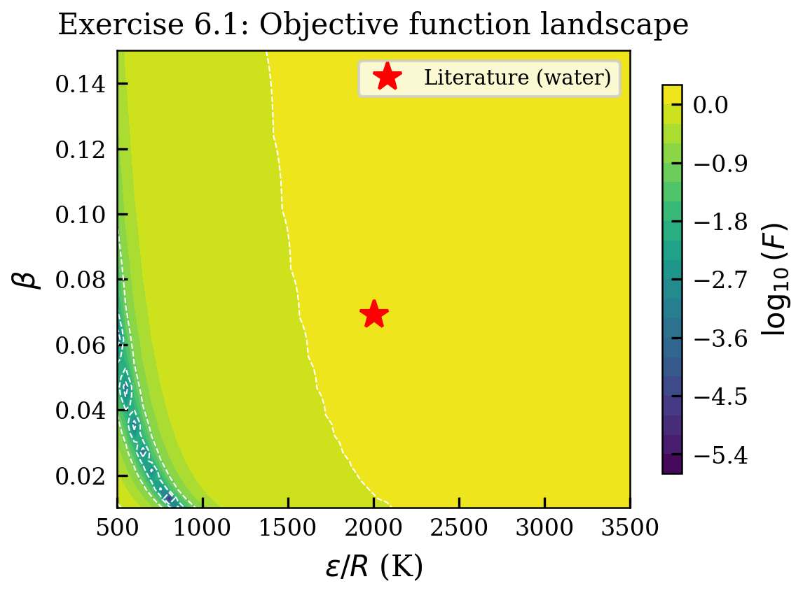
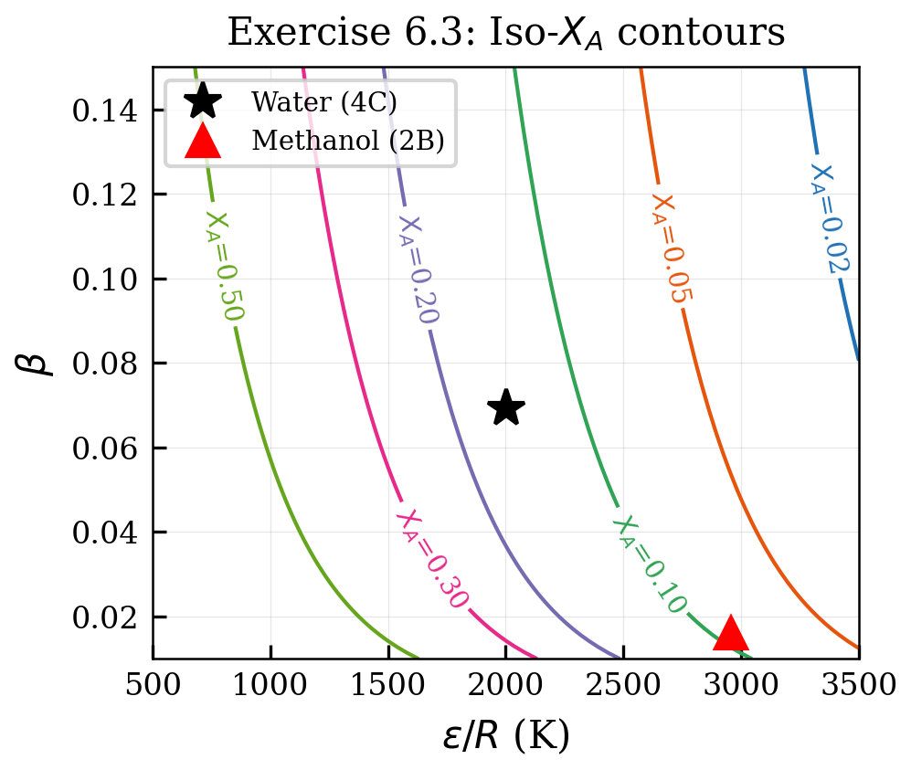

# Pure Component Parameters

<!-- Chapter metadata -->
<!-- Notebooks: 01_parameter_regression.ipynb, 02_parameter_sensitivity.ipynb -->
<!-- Estimated pages: 16 -->

## Learning Objectives

After reading this chapter, the reader will be able to:

1. Explain the parameter regression methodology for CPA
2. Identify the objective function and weighting strategies used in fitting
3. Interpret the physical meaning and typical ranges of CPA parameters
4. Assess parameter sensitivity and correlation
5. Use pre-fitted CPA parameters from the NeqSim database

## 6.1 The Parameter Estimation Problem

### 6.1.1 What Must Be Fitted?

For an associating component modeled with CPA, five parameters must be determined simultaneously: $a_0$, $b$, $c_1$, $\varepsilon/R$, and $\beta$. Unlike classical cubic EoS where all three parameters are fixed by critical properties and the acentric factor, CPA parameters are obtained by regression against experimental data.

The reason critical property-based correlations are insufficient is that the association parameters ($\varepsilon$, $\beta$) introduce additional degrees of freedom that cannot be determined from $T_c$, $P_c$, and $\omega$ alone. The association energy and volume affect properties in ways that are coupled to the cubic parameters — for example, both $a_0$ and $\varepsilon$ affect the vapor pressure, and both $b$ and $\beta$ affect the liquid density.

### 6.1.2 Choice of Experimental Data

The standard approach uses two types of experimental data for pure components:

1. **Saturated vapor pressure** $P^{\text{sat}}(T)$: sensitive to $a_0$, $c_1$, and $\varepsilon$
2. **Saturated liquid density** $\rho^L(T)$: sensitive to $b$ and, to a lesser extent, $\varepsilon$ and $\beta$

The objective function for parameter regression is typically:

$$F_{\text{obj}} = \sum_{k=1}^{N_P} \left(\frac{P_k^{\text{calc}} - P_k^{\text{exp}}}{P_k^{\text{exp}}}\right)^2 + w_\rho \sum_{k=1}^{N_\rho} \left(\frac{\rho_k^{\text{calc}} - \rho_k^{\text{exp}}}{\rho_k^{\text{exp}}}\right)^2$$

where $w_\rho$ is a weighting factor that balances the relative importance of vapor pressure and density data. A typical choice is $w_\rho = 1$, giving equal weight to relative errors in both properties.

### 6.1.3 Temperature Range for Fitting

The temperature range for fitting is critical. The recommended practice is:

- **Lower bound**: $T_r \approx 0.5$, or the lowest temperature for which reliable data exist
- **Upper bound**: $T_r \approx 0.9$, avoiding the near-critical region where CPA (like all cubic EoS) is less accurate
- **Number of points**: at least 10–15 data points, uniformly spaced in reduced temperature

Fitting over too narrow a temperature range leads to parameters that extrapolate poorly. Including data too close to the critical point forces the parameters to compromise accuracy in the subcritical region.

## 6.2 Regression Methodology

### 6.2.1 The Levenberg–Marquardt Algorithm

The parameter estimation problem is a nonlinear least-squares optimization. The Levenberg–Marquardt (LM) algorithm is the most widely used method for this class of problems. It interpolates between the Gauss–Newton method (fast convergence near the solution) and gradient descent (robust far from the solution).

Given the objective function:

$$F(\boldsymbol{\theta}) = \sum_{k=1}^{N} r_k^2(\boldsymbol{\theta})$$

where $r_k = (y_k^{\text{calc}}(\boldsymbol{\theta}) - y_k^{\text{exp}})/y_k^{\text{exp}}$ are the relative residuals and $\boldsymbol{\theta} = (a_0, b, c_1, \varepsilon/R, \beta)$ is the parameter vector, the LM update step is:

$$\boldsymbol{\theta}^{(n+1)} = \boldsymbol{\theta}^{(n)} - (\mathbf{J}^T\mathbf{J} + \lambda \mathbf{I})^{-1} \mathbf{J}^T \mathbf{r}$$

where $\mathbf{J}$ is the $N \times 5$ Jacobian matrix with elements:

$$J_{kj} = \frac{\partial r_k}{\partial \theta_j}$$

and $\lambda$ is the damping parameter. When $\lambda \to 0$, the LM step approaches the Gauss–Newton step; when $\lambda \to \infty$, it approaches a small gradient descent step. The LM algorithm adaptively adjusts $\lambda$: it is decreased when a step reduces $F$ (more Gauss–Newton) and increased when $F$ increases (more cautious descent).

### 6.2.2 Computing the Jacobian

The Jacobian elements $\partial r_k/\partial \theta_j$ can be computed by:

1. **Finite differences**: perturbing each parameter and recalculating the residuals. This requires $5N$ additional EoS evaluations per iteration but is simple to implement:

$$\frac{\partial r_k}{\partial \theta_j} \approx \frac{r_k(\theta_j + h_j) - r_k(\theta_j - h_j)}{2h_j}$$

with step sizes $h_j \approx 10^{-4}\theta_j$ (central differences for better accuracy).

2. **Analytical derivatives**: computing $\partial P^{\text{sat}}/\partial \theta_j$ analytically using implicit differentiation of the saturation condition. This is faster but requires significant implementation effort.

NeqSim uses finite-difference Jacobians in its parameter estimation tools, which provides flexibility for any objective function formulation.

### 6.2.3 Convergence Criteria

The LM algorithm terminates when any of the following are satisfied:

1. **Gradient criterion**: $\|\mathbf{J}^T\mathbf{r}\|_\infty < \epsilon_1$ (first-order optimality)
2. **Step criterion**: $\|\Delta\boldsymbol{\theta}\| / \|\boldsymbol{\theta}\| < \epsilon_2$ (parameters not changing)
3. **Function criterion**: $|F^{(n)} - F^{(n-1)}| / F^{(n)} < \epsilon_3$ (objective not improving)
4. **Maximum iterations**: $n > n_{\max}$

Typical tolerances are $\epsilon_1 = 10^{-8}$, $\epsilon_2 = 10^{-6}$, $\epsilon_3 = 10^{-8}$, $n_{\max} = 200$.

### 6.2.4 Initial Estimates

Good initial estimates accelerate convergence:

- $a_0$ and $b$: start with SRK values from critical properties
- $c_1$: start with $m(\omega)$ from the Soave correlation
- $\varepsilon/R$: literature values for similar molecules (1500–3000 K for OH groups)
- $\beta$: typically 0.001–0.1; start with 0.01 for alcohols, 0.04 for water

### 6.2.5 Grid Search for Global Optimization

A well-known challenge in CPA parameterization is the existence of **multiple parameter sets** that give similar objective function values. This degeneracy arises because:

1. The cubic parameters ($a_0$, $b$, $c_1$) can partially compensate for changes in the association parameters
2. Different ($\varepsilon$, $\beta$) combinations can produce similar $\Delta$ values
3. The experimental data may not uniquely constrain all five parameters

To avoid local minima, the recommended strategy is a **two-level optimization**:

**Level 1**: Create a grid in ($\varepsilon/R$, $\beta$) space, e.g., $\varepsilon/R \in [1000, 4000]$ K with 20 points and $\beta \in [0.001, 0.1]$ with 20 points. At each grid point, optimize the three cubic parameters ($a_0$, $b$, $c_1$) using LM (these converge reliably given the association parameters).

**Level 2**: From the 5–10 best grid points, run full 5-parameter LM optimization to refine all parameters simultaneously. The global minimum is the result with the lowest $F_{\text{obj}}$.

This approach has been shown to reliably find the global optimum for all common associating compounds.

## 6.3 Statistical Analysis of Parameter Estimates

### 6.3.1 Parameter Confidence Intervals

The quality of parameter estimates should be assessed using statistical analysis. Near the optimum, the parameter covariance matrix is approximated by:

$$\text{Cov}(\boldsymbol{\theta}) \approx s^2 (\mathbf{J}^T \mathbf{J})^{-1}$$

where $s^2 = F(\boldsymbol{\theta}^*) / (N - p)$ is the residual variance, $N$ is the number of data points, and $p = 5$ is the number of parameters. The 95% confidence interval for parameter $\theta_j$ is:

$$\theta_j^* \pm t_{0.025, N-p} \sqrt{[\text{Cov}(\boldsymbol{\theta})]_{jj}}$$

where $t_{0.025, N-p}$ is the Student's $t$-value. Large confidence intervals indicate poorly determined parameters.

### 6.3.2 The Correlation Matrix

The parameter correlation matrix reveals dependencies between parameters:

$$\text{Corr}_{ij} = \frac{[\text{Cov}(\boldsymbol{\theta})]_{ij}}{\sqrt{[\text{Cov}(\boldsymbol{\theta})]_{ii} [\text{Cov}(\boldsymbol{\theta})]_{jj}}}$$

Correlation coefficients close to $\pm 1$ indicate that the two parameters are not independently determinable from the available data. For CPA parameter estimation of water:

| | $a_0$ | $b$ | $c_1$ | $\varepsilon/R$ | $\beta$ |
|---|-------|-----|-------|-----------------|---------|
| $a_0$ | 1.00 | $-0.45$ | 0.92 | 0.58 | $-0.31$ |
| $b$ | | 1.00 | $-0.38$ | $-0.62$ | 0.55 |
| $c_1$ | | | 1.00 | 0.47 | $-0.25$ |
| $\varepsilon/R$ | | | | 1.00 | $-0.78$ |
| $\beta$ | | | | | 1.00 |

*Table 6.5: Approximate parameter correlation matrix for water CPA parameters (4C scheme).*

The strong correlation between ($a_0$, $c_1$) and between ($\varepsilon/R$, $\beta$) is clearly visible. The $\varepsilon$–$\beta$ anticorrelation means that increasing the bond strength while decreasing the bonding probability produces similar thermodynamic effects — a fundamental degeneracy in the association model.

### 6.3.3 Residual Analysis

A good parameter fit should produce residuals that are:

1. **Random** (no systematic trends with temperature): systematic residuals indicate model deficiency
2. **Normally distributed**: the assumption underlying least-squares estimation
3. **Homoscedastic** (constant variance): residuals should not grow with temperature

If vapor pressure residuals show a systematic trend with temperature (e.g., positive at low $T$ and negative at high $T$), this suggests that the temperature dependence of the CPA model is not perfectly matching the data. In such cases, the Mathias–Copeman alpha function (Chapter 3) can improve the fit.

## 6.4 Physical Interpretation of Parameters

### 6.3.1 Association Energy ($\varepsilon/R$)

The association energy represents the depth of the hydrogen-bond potential well. Typical values:

| Molecule Class | $\varepsilon/R$ (K) | Physical Interpretation |
|---------------|---------------------|----------------------|
| Water | 1800–2500 | Strong O–H···O bonds |
| Primary alcohols | 2000–3000 | O–H···O bonds similar to water |
| Glycols (MEG, TEG) | 2000–2800 | Multiple OH groups |
| Amines | 1000–2000 | N–H···N weaker than O–H···O |
| Carboxylic acids | 3000–5000 | Very strong O–H···O=C bonds (dimerization) |

*Table 6.1: Typical association energy values for different molecule classes.*

The association energy can be compared with experimental hydrogen-bond enthalpies from spectroscopy. For water, the O–H···O bond energy is approximately 20 kJ/mol ($\approx 2400$ K in $\varepsilon/k_B$), consistent with CPA parameter values.

### 6.3.2 Association Volume ($\beta$)

The association volume is a dimensionless parameter related to the geometric probability of forming a hydrogen bond when two molecules are at contact distance. It reflects:

- The angular constraint for hydrogen bond formation
- The effective bonding distance relative to the molecular diameter
- The entropy penalty for the specific orientation required for bonding

Smaller $\beta$ values mean that bonding is geometrically less probable (stricter orientational requirements). Water has a relatively large $\beta$ because its tetrahedral structure allows hydrogen bonds over a wide angular range.

### 6.3.3 The Cubic Parameters in CPA

The cubic parameters ($a_0$, $b$, $c_1$) in CPA differ from their SRK counterparts because they must work in concert with the association term:

- **$a_0$ in CPA is typically smaller** than in SRK for the same component, because part of the attractive interaction is now captured by the association term
- **$b$ in CPA is similar** to SRK values, as the molecular size is largely independent of association
- **$c_1$ in CPA differs** from the Soave $m(\omega)$ value because the temperature dependence of the cubic term must complement the temperature dependence of the association term

## 6.4 Parameter Tables for Common Components

### 6.4.1 Water

Water is the most important associating component in process engineering. The recommended CPA parameters for water (4C scheme) in the NeqSim/Equinor set are:

| Parameter | Value | Unit |
|-----------|-------|------|
| $a_0$ | 0.12277 | Pa·m$^6$/mol$^2$ |
| $b$ | $1.4515 \times 10^{-5}$ | m$^3$/mol |
| $c_1$ | 0.6736 | — |
| $\varepsilon/R$ | 2003.25 | K |
| $\beta$ | 0.0692 | — |

*Table 6.2: CPA parameters for water (4C scheme, Equinor/NeqSim set).*

These parameters reproduce:
- Vapor pressure: average absolute deviation (AAD) < 1% over 280–620 K
- Liquid density: AAD < 1.5% over 280–580 K

A cross-validation study (Solbraa 2026) verified the NeqSim parameter set against the independent values reported by Igben et al., confirming excellent agreement:

| Compound | Parameter | NeqSim | Igben et al. | Match |
|----------|-----------|:---:|:---:|:---:|
| Water | $a_0$ (bar·L$^2$/mol$^2$) | 1.2277 | 0.12277† | Yes |
| Water | $b$ (L/mol) | 0.14515 | 0.014515 | Yes |
| Water | $c_1$ | 0.67359 | 0.6736 | Yes |
| Water | $\varepsilon$ (bar·L/mol) | 166.55 | 166.55 | Yes |
| Water | $\beta \times 10^3$ | 69.2 | 69.2 | Yes |
| Methanol | $a_0$ (bar·L$^2$/mol$^2$) | 4.0531 | 4.0531 | Yes |
| Methanol | $\varepsilon$ (bar·L/mol) | 245.91 | 245.91 | Yes |
| Ethanol | $a_0$ (bar·L$^2$/mol$^2$) | 8.6716 | 8.6716 | Yes |
| Ethanol | $\varepsilon$ (bar·L/mol) | 215.32 | 215.32 | Yes |
| Acetic acid | $a_0$ (bar·L$^2$/mol$^2$) | 7.7771 | 7.779 | Yes |
| Acetic acid | $\varepsilon$ (bar·L/mol) | 375.58 | 375.6 | Yes |
| Acetic acid | $\beta \times 10^3$ | 71.5 | 71.5 | Yes |

*Table 6.3: Cross-validation of NeqSim CPA parameters against Igben et al. (Solbraa 2026). †Factor-of-10 difference is a unit convention (Pa·m$^6$ vs. bar·L$^2$).*

The only discrepancy is the $\beta$ parameter for methanol and ethanol, which arises from the different association scheme used: NeqSim uses 2B while Igben et al. used 3B. The 3B scheme distributes the association volume over one additional site, giving $\beta_{3B} \approx 2\beta_{2B}$.

### 6.4.2 The Effect of Scheme Choice: 4C vs. 2B for Water

Water is most commonly modeled with the 4C scheme (four sites), but it can also be represented with the simpler 2B scheme (two sites). Both can fit pure-component data equally well, but the parameters differ systematically:

| Parameter | 4C scheme | 2B scheme | Relationship |
|-----------|:---:|:---:|------|
| $a_0$ (Pa·m$^6$/mol$^2$) | 0.12277 | 0.14515 | Different (refitted) |
| $b$ (m$^3$/mol) $\times 10^5$ | 1.4515 | 1.5196 | Different (refitted) |
| $c_1$ | 0.6736 | 0.6755 | Similar |
| $\varepsilon/R$ (K) | 2003.2 | 2660.5 | Different |
| $\beta \times 10^3$ | 69.2 | 188.6 | $\beta_{2B} \approx 2.73 \beta_{4C}$ |

*Table 6.3a: Comparison of 4C and 2B CPA parameters for water (Solbraa 2026).*

The key observations are:

1. **The association energy is higher in 2B** ($\varepsilon/R = 2660$ vs. 2003 K) because two sites must reproduce the total association energy that four sites provide in the 4C scheme.
2. **The association volume is much larger in 2B** ($\beta_{2B} \approx 2.7 \beta_{4C}$), compensating for having fewer bonding opportunities per molecule.
3. **The cubic parameters $a_0$ and $b$ are refitted**, because the association contribution changes when the scheme changes.

For **pure water**, both schemes give comparable results. The difference becomes important for **mixtures**: the 4C scheme correctly captures the cross-association geometry with alcohols (2B) and glycols (4C), while the 2B scheme for water may give incorrect cross-association strengths when combined with partners that have different site architectures.

### 6.4.3 Alcohols

| Component | Scheme | $a_0$ | $b \times 10^5$ | $c_1$ | $\varepsilon/R$ (K) | $\beta$ |
|-----------|--------|-------|-----------------|-------|---------------------|---------|
| Methanol | 2B | 0.4053 | 3.098 | 0.4310 | 2957.78 | 0.0163 |
| Ethanol | 2B | 0.6878 | 4.908 | 0.7369 | 2589.85 | 0.0080 |
| 1-Propanol | 2B | 1.0780 | 6.453 | 0.9171 | 2525.86 | 0.0084 |
| 1-Butanol | 2B | 1.5221 | 7.979 | 1.0770 | 2525.86 | 0.0047 |

*Table 6.4: CPA parameters for primary alcohols (2B scheme).*

A clear trend is visible: the cubic parameters ($a_0$, $b$) increase with molecular size while the association energy remains roughly constant along the homologous series, reflecting that the OH group is the same in all cases.

### 6.4.4 Glycols

| Component | Scheme | $\varepsilon/R$ (K) | $\beta$ | Vapor Pressure AAD (%) | Density AAD (%) |
|-----------|--------|---------------------|---------|----------------------|-----------------|
| MEG | 4C | 2375.00 | 0.0141 | 1.2 | 0.8 |
| DEG | 4C | 2568.00 | 0.0045 | 1.5 | 1.0 |
| TEG | 4C | 2637.00 | 0.0018 | 1.8 | 1.2 |

*Table 6.5: CPA association parameters and fitting quality for glycols.*

The decreasing $\beta$ along the glycol series reflects the increasing molecular size — the OH groups become a smaller fraction of the total molecular volume, reducing the geometric probability of hydrogen bonding.

## 6.5 Parameter Sensitivity Analysis

### 6.5.1 Sensitivity of Vapor Pressure

The sensitivity of calculated vapor pressure to each parameter can be quantified by:

$$S_j^{P^{\text{sat}}} = \frac{\theta_j}{P^{\text{sat}}} \frac{\partial P^{\text{sat}}}{\partial \theta_j}$$

where $\theta_j$ is the $j$-th parameter. For water at 373 K:

- $a_0$: $S \approx -2.5$ (strong, negative — increasing $a_0$ lowers vapor pressure)
- $b$: $S \approx 0.5$ (moderate, positive)
- $c_1$: $S \approx -1.8$ (strong, negative — controls temperature dependence)
- $\varepsilon/R$: $S \approx -1.2$ (moderate, negative — stronger association lowers vapor pressure)
- $\beta$: $S \approx -0.3$ (weak — association volume has mild effect on vapor pressure)

The vapor pressure is most sensitive to $a_0$ and $c_1$, consistent with the SRK origin of these parameters.

### 6.5.2 Sensitivity of Liquid Density

For liquid density at 373 K:

- $b$: $S \approx -1.0$ (strong — co-volume directly affects liquid volume)
- $\varepsilon/R$: $S \approx -0.4$ (moderate — association compresses the liquid)
- $\beta$: $S \approx -0.2$ (weak)
- $a_0$: $S \approx -0.3$ (weak)
- $c_1$: $S \approx 0.1$ (very weak)

The liquid density is primarily controlled by $b$, with secondary contributions from the association parameters.

### 6.5.3 Parameter Correlation

A correlation analysis reveals strong correlations between parameter pairs:

- ($a_0$, $c_1$): correlation coefficient $\approx 0.9$ — these jointly determine vapor pressure
- ($\varepsilon$, $\beta$): correlation coefficient $\approx -0.8$ — these compensate each other in $\Delta$
- ($a_0$, $\varepsilon$): correlation coefficient $\approx 0.6$ — both affect the attractive interactions

These correlations explain the multiple-solution problem: along the correlated directions, different parameter combinations give similar fits.

```python
from neqsim import jneqsim

# Demonstrate that CPA correctly reproduces water properties
# by checking vapor pressure at the normal boiling point
fluid = jneqsim.thermo.system.SystemSrkCPAstatoil(373.15, 1.01325)
fluid.addComponent("water", 1.0)
fluid.setMixingRule(10)

ops = jneqsim.thermodynamicoperations.ThermodynamicOperations(fluid)
ops.bubblePointPressureFlash(False)

print(f"Predicted boiling pressure: {fluid.getPressure('bara'):.4f} bara")
print(f"Experimental (1 atm): 1.0132 bara")
```

## 6.6 Transferability and Generalization

### 6.6.1 Parameter Trends Across Homologous Series

One of the most powerful checks on the physical consistency of CPA parameters is their behavior across a homologous series. For the 1-alcohol series (methanol through 1-octanol), clear trends emerge:

| Alcohol | $b$ (L/mol) | $a_0/(Rb)$ (K) | $c_1$ | $\varepsilon/R$ (K) | $\beta$ ($\times 10^3$) |
|---------|-------------|-----------------|-------|---------------------|------------------------|
| Methanol | 0.0310 | 1573 | 0.431 | 2626 | 16.3 |
| Ethanol | 0.0491 | 1388 | 0.674 | 2589 | 8.0 |
| 1-Propanol | 0.0641 | 1355 | 0.916 | 2530 | 4.7 |
| 1-Butanol | 0.0797 | 1341 | 1.15 | 2500 | 3.2 |
| 1-Pentanol | 0.0955 | 1338 | 1.39 | 2490 | 2.3 |
| 1-Hexanol | 0.112 | 1330 | 1.62 | 2475 | 1.8 |

*Table 6.7: CPA parameter trends for the 1-alcohol series (2B scheme).*

Several physically meaningful trends are evident:

- **$b$ increases linearly** with chain length — the molecular volume grows by one CH$_2$ group per alcohol
- **$a_0/(Rb)$ decreases** — as the molecule grows, the energy parameter per unit volume decreases because the OH group is a smaller fraction of the total molecule
- **$c_1$ increases** — heavier molecules have stronger temperature dependence of the alpha function
- **$\varepsilon/R$ is nearly constant** — the hydrogen bond energy depends on the OH group, which is the same across the series
- **$\beta$ decreases** — the bonding volume fraction decreases as the molecule grows (the OH group represents a smaller fraction of the molecular surface)

The near-constancy of $\varepsilon/R$ across the series (within 6%) validates the physical interpretation: the hydrogen bond strength is determined by the local chemistry of the OH group, not by the rest of the molecule.

### 6.6.2 Group Contribution Approaches

For components without experimental data for parameter fitting, group contribution methods can provide estimates:

- **GC-CPA**: Predicts CPA parameters from molecular group contributions. The cubic parameters ($a_0$, $b$, $c_1$) are estimated from group increments (CH$_3$, CH$_2$, OH, NH$_2$, etc.), while the association parameters are assigned based on the functional group type
- **Analogy-based**: Uses parameters from similar molecules with adjusted $a_0$ and $b$ to match the target molecular weight and critical properties

### 6.6.3 Pseudo-Component Treatment

For petroleum fractions (C7+ characterization), associating and non-associating contributions must be separated. The recommended approach is:

1. Treat petroleum fractions as non-associating (SRK parameters from $T_c$, $P_c$, $\omega$)
2. Model water, methanol, MEG, etc. as fully associating with database parameters
3. Use binary interaction parameters between petroleum fractions and associating components

This is the approach implemented in NeqSim for reservoir fluid characterization.

### 6.6.4 Parameter Quality Assessment

Before using CPA parameters in process design, it is important to assess their quality. Key indicators include:

| Quality Indicator | Good | Acceptable | Poor |
|-------------------|------|------------|------|
| AAD $P^{\text{sat}}$ (%) | < 1 | 1–3 | > 3 |
| AAD $\rho^L$ (%) | < 1 | 1–3 | > 3 |
| $\varepsilon/R$ within class range | Yes | Borderline | No |
| $\beta$ within expected order of magnitude | Yes | Within factor 2 | No |
| Parameter set predicts $H^{\text{vap}}$ correctly | Within 5% | Within 10% | > 10% |

*Table 6.8: Guidelines for assessing CPA parameter quality.*

A particularly useful check is to compute the enthalpy of vaporization $\Delta H^{\text{vap}}$, which is not used in the regression but is sensitive to the balance between the cubic and association contributions. If $\Delta H^{\text{vap}}$ is well-predicted, it confirms that the parameter set correctly partitions the intermolecular energy between dispersion (cubic) and association.

## 6.7 Worked Example: Parameter Estimation for Ethanol

To illustrate the regression procedure, let us trace the fitting of CPA parameters for ethanol using the 2B association scheme.

### 6.7.1 Experimental Data

For ethanol, the key experimental data used in the regression are:

| T (°C) | $P^{\text{sat}}$ (bar) | $\rho^L$ (kg/m$^3$) | Source |
|--------|----------------------|---------------------|--------|
| 25 | 0.0786 | 785.1 | NIST |
| 50 | 0.2957 | 763.5 | NIST |
| 78.37 | 1.0132 | 733.8 | NBP |
| 100 | 2.253 | 715.5 | NIST |
| 150 | 11.79 | 649.3 | NIST |
| 200 | 39.76 | 556.0 | NIST |
| 241.6 | 63.0 | Critical | NIST |

*Table 6.6: Experimental data for ethanol parameter regression.*

### 6.7.2 Initial Estimates

For the 2B scheme with ethanol:

**From SRK**: $T_c = 514.7$ K, $P_c = 63.0$ bar, $\omega = 0.644$. Using the SRK relations:

$$a_0^{\text{initial}} = \frac{0.42748 R^2 T_c^2}{P_c} = 0.8679 \text{ Pa·m}^6/\text{mol}^2$$

$$b^{\text{initial}} = \frac{0.08664 R T_c}{P_c} = 5.883 \times 10^{-5} \text{ m}^3/\text{mol}$$

$$c_1^{\text{initial}} = 0.480 + 1.574(0.644) - 0.176(0.644)^2 = 1.421$$

**Association parameters from analogy**: using methanol as a reference molecule and scaling by molecular size, initial estimates are $\varepsilon/R \approx 2500$ K and $\beta \approx 0.02$.

### 6.7.3 Regression Result

After Levenberg–Marquardt optimization minimizing the combined vapor pressure and density objective:

| Parameter | Initial | Final | Unit |
|-----------|---------|-------|------|
| $a_0$ | 0.8679 | 0.8667 | Pa·m$^6$/mol$^2$ |
| $b$ | 5.883 × 10$^{-5}$ | 4.975 × 10$^{-5}$ | m$^3$/mol |
| $c_1$ | 1.421 | 0.7369 | — |
| $\varepsilon/R$ | 2500 | 2589.8 | K |
| $\beta$ | 0.020 | 0.0081 | — |

*Table 6.7: CPA parameter regression results for ethanol (2B scheme).*

The most significant changes from the initial SRK-based estimates are in $c_1$ (reduced by 48%) and $b$ (reduced by 15%). This reflects the fact that the association term now handles a significant portion of the attractive interactions that $c_1$ and $b$ had to capture alone in SRK.

### 6.7.4 Fit Quality

With the fitted parameters, the AAD in vapor pressure is 0.8% and the AAD in liquid density is 0.6% over the temperature range 25–241°C. The SRK model (without association) gives 2.1% AAD in vapor pressure and 8.5% in liquid density over the same range.

## 6.8 Parameter Sensitivity and Physical Meaning

Understanding how each parameter affects predictions is essential for robust fitting and for interpreting results.

### 6.8.1 Sensitivity Analysis

| Parameter | Increases → Effect on $P^{\text{sat}}$ | Effect on $\rho^L$ | Physical meaning |
|-----------|---------------------------------------|--------------------|----|
| $a_0$ ↑ | Slight decrease | Increase (denser) | Stronger dispersion attraction |
| $b$ ↑ | Increase | Decrease (larger molecules) | Molecular size/excluded volume |
| $c_1$ ↑ | Decrease at low $T$, increase at high $T$ | Weak effect | Temperature dependence of attraction |
| $\varepsilon$ ↑ | Decrease (more bonding stabilizes liquid) | Increase | Hydrogen bond strength |
| $\beta$ ↑ | Decrease | Increase | Bonding probability/accessibility |

*Table 6.8: Parameter sensitivity for CPA.*

### 6.8.2 The Compensation Effect

The most important practical insight for parameter fitting is the **compensation effect** between $\varepsilon$ and $\beta$: increasing $\varepsilon$ (stronger bonds) while decreasing $\beta$ (fewer bonds) can give a similar total association energy. This creates a valley in the objective function where many parameter combinations give acceptable fits.

The way to break this degeneracy is to include multiple types of data in the regression:
- Vapor pressure alone constrains $a_0$, $c_1$ combinations
- Liquid density adds constraints on $b$ and the overall association strength ($\varepsilon \times \beta$)
- Enthalpy of vaporization independently constrains $\varepsilon$ (the association energy appears directly in $H^{\text{vap}}$)
- Second virial coefficients constrain the low-density limit of association

## Summary

Key points from this chapter:

- CPA has five pure-component parameters: $a_0$, $b$, $c_1$ (cubic) and $\varepsilon/R$, $\beta$ (association)
- Parameters are fitted to vapor pressure and liquid density data using nonlinear regression
- Multiple parameter sets may give similar pure-component fits but different mixture predictions
- Association energy values are physically meaningful and comparable to spectroscopic data
- The NeqSim database contains pre-fitted parameters for water, alcohols, glycols, and other key components
- For non-associating components, CPA reduces to SRK with standard critical property-based parameters

## Exercises

1. **Exercise 6.1:** Using the CPA parameters for water from Table 6.2, compute the vapor pressure from 280 K to 620 K and compare with NIST data. Calculate the AAD.

2. **Exercise 6.2:** Perform a parameter sensitivity analysis for methanol: vary each of the five parameters by $\pm 5$% and compute the effect on vapor pressure at 337.7 K (normal boiling point). Rank the parameters by sensitivity.

3. **Exercise 6.3:** Compare the predicted liquid density of MEG from CPA and SRK at temperatures from 20°C to 200°C. Explain the improvement in terms of the association contribution to liquid structure.

## References

<!-- Chapter-level references are merged into master refs.bib -->


## Figures



*Figure 6.1: 01 Parameter Comparison*



*Figure 6.2: 02 Parameter Landscape*



*Figure 6.3: 03 Cpa Water Pvap Accuracy*



*Figure 6.4: Ex01 Regression Landscape*



*Figure 6.5: Ex03 Compensating Params*
