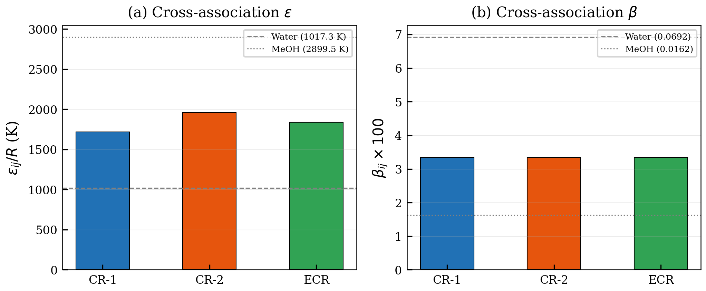
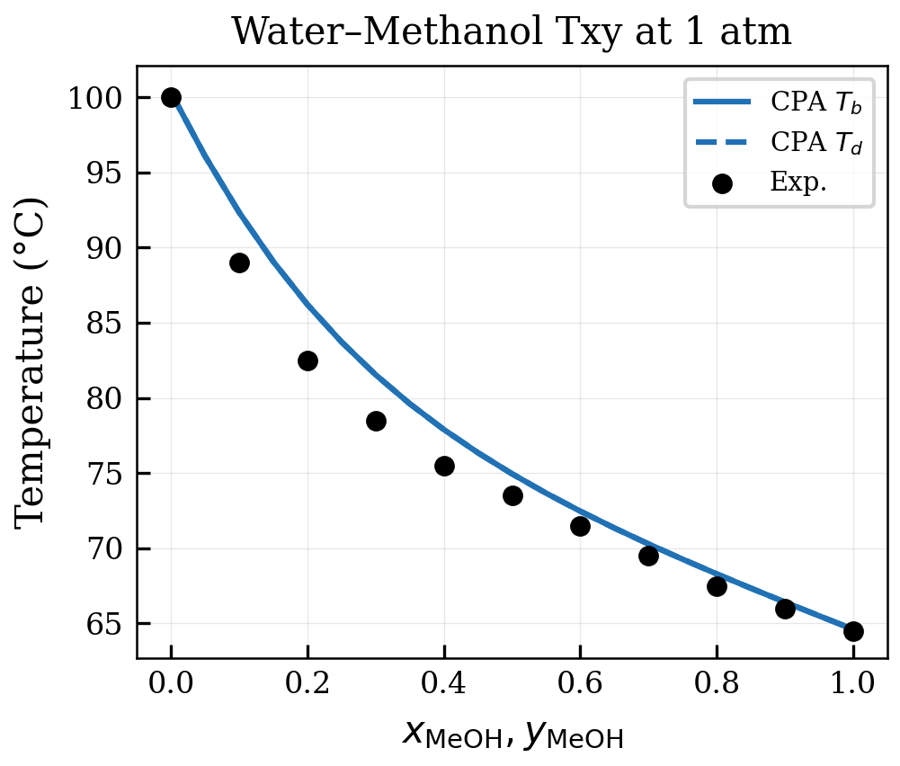
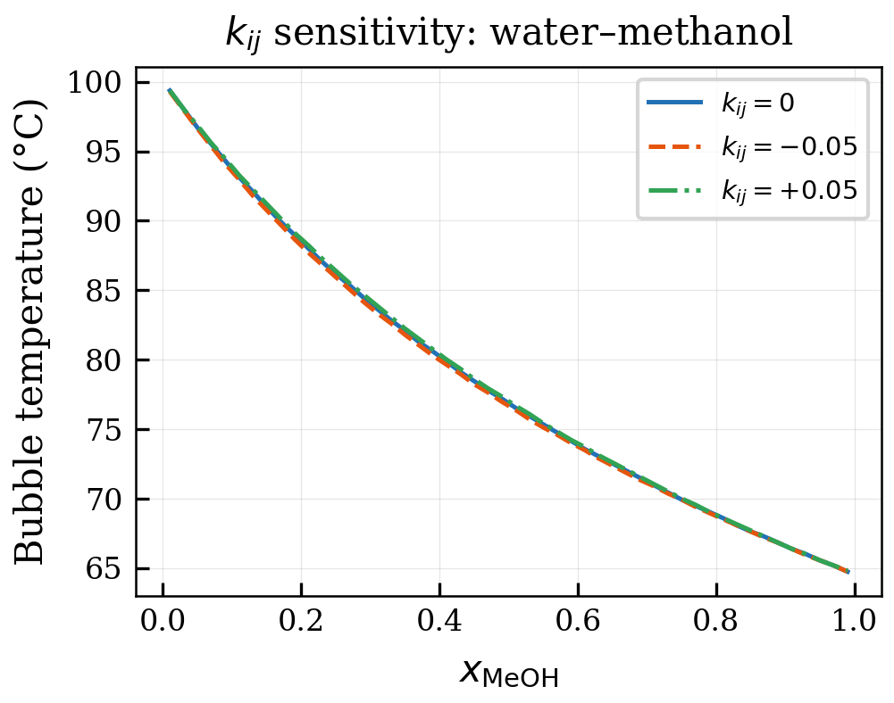

# Mixing Rules and Cross-Association

<!-- Chapter metadata -->
<!-- Notebooks: 01_cross_association.ipynb, 02_solvation.ipynb -->
<!-- Estimated pages: 18 -->

## Learning Objectives

After reading this chapter, the reader will be able to:

1. Apply van der Waals mixing rules with binary interaction parameters ($k_{ij}$)
2. Implement the CR-1 and ECR combining rules for cross-association
3. Handle solvation between self-associating and non-self-associating molecules
4. Explain the Elliott combining rule and its advantages
5. Configure cross-association in NeqSim using mixing rule 10

## 7.1 Mixing Rules for the Cubic Term

### 7.1.1 Van der Waals One-Fluid Rules

The cubic part of CPA uses the standard van der Waals one-fluid mixing rules:

$$a_m = \sum_i \sum_j x_i x_j a_{ij}$$

$$b_m = \sum_i x_i b_i$$

with the combining rule:

$$a_{ij} = \sqrt{a_i a_j} (1 - k_{ij})$$

The binary interaction parameter $k_{ij}$ is the primary adjustable parameter for tuning VLE predictions. For CPA, $k_{ij}$ accounts for deviations in the **non-associating** interactions between unlike molecules — the associating interactions are handled separately by the cross-association parameters.

### 7.1.2 Binary Interaction Parameters for CPA

A key advantage of CPA over classical cubic EoS is that smaller $k_{ij}$ values are needed because the association term captures a significant portion of the non-ideal behavior. For example:

| System | $k_{ij}$ in SRK | $k_{ij}$ in CPA | Improvement |
|--------|-----------------|-----------------|-------------|
| Water–methane | $-0.02$ to $0.5$ (T-dependent) | $0.01$ to $0.05$ | CPA uses small, nearly constant $k_{ij}$ |
| Water–ethane | Similar issues | $0.01$ to $0.03$ | Much more robust |
| Methanol–methane | $0.2$ to $0.4$ | $0.01$ to $0.05$ | Association handles the non-ideality |
| MEG–water | Requires $g^E$ mixing rule | $-0.02$ to $0.02$ | Simple mixing rule sufficient |

*Table 7.1: Binary interaction parameters in SRK vs. CPA for selected systems.*

The fact that CPA requires smaller and less temperature-dependent $k_{ij}$ values is a significant practical advantage — it means the model extrapolates better to conditions outside the range of available experimental data.

### 7.1.3 Co-Volume Mixing

The arithmetic mean is used for the mixture co-volume:

$$b_m = \sum_i x_i b_i$$

For the cross co-volume used in the association strength, two options exist:

$$b_{ij} = \frac{b_i + b_j}{2} \quad \text{(arithmetic mean, standard)}$$

$$b_{ij} = \sqrt{b_i b_j} \quad \text{(geometric mean, alternative)}$$

NeqSim uses the arithmetic mean, which is more common in CPA implementations.

## 7.2 Cross-Association: The Fundamental Challenge

### 7.2.1 Self-Association vs. Cross-Association

When a mixture contains two or more associating species (e.g., water and methanol), hydrogen bonds can form between like molecules (self-association) and between unlike molecules (cross-association):

- Water–water: $\Delta^{H_w O_w}$ (self-association of water)
- Methanol–methanol: $\Delta^{H_m O_m}$ (self-association of methanol)
- Water–methanol: $\Delta^{H_w O_m}$ and $\Delta^{H_m O_w}$ (cross-association)

The cross-association parameters $\varepsilon^{H_w O_m}$ and $\beta^{H_w O_m}$ are generally not available from pure-component data alone — they describe interactions between different species. This creates the need for **combining rules** that estimate cross-association parameters from the pure-component values.

### 7.2.2 The Site Balance in Mixtures

For a binary mixture of water (4C) and methanol (2B), the site balance equations become:

For water proton sites:

$$X_{H_w} = \frac{1}{1 + \rho\left[x_w \cdot 2 X_{O_w} \Delta^{H_w O_w} + x_m \cdot X_{O_m} \Delta^{H_w O_m}\right]}$$

For water electron-pair sites:

$$X_{O_w} = \frac{1}{1 + \rho\left[x_w \cdot 2 X_{H_w} \Delta^{H_w O_w} + x_m \cdot X_{H_m} \Delta^{H_m O_w}\right]}$$

For methanol proton site:

$$X_{H_m} = \frac{1}{1 + \rho\left[x_w \cdot 2 X_{O_w} \Delta^{H_m O_w} + x_m \cdot X_{O_m} \Delta^{H_m O_m}\right]}$$

For methanol electron-pair site:

$$X_{O_m} = \frac{1}{1 + \rho\left[x_w \cdot 2 X_{H_w} \Delta^{H_w O_m} + x_m \cdot X_{H_m} \Delta^{H_m O_m}\right]}$$

This is a system of four coupled nonlinear equations that must be solved simultaneously.

## 7.3 Combining Rules for Cross-Association Parameters

### 7.3.1 The CR-1 Rule

The most widely used combining rule in CPA is **CR-1** (Combining Rule 1):

$$\varepsilon^{A_i B_j} = \frac{\varepsilon^{A_i} + \varepsilon^{B_j}}{2}$$

$$\beta^{A_i B_j} = \sqrt{\beta^{A_i} \cdot \beta^{B_j}}$$

CR-1 uses the arithmetic mean for the energy and the geometric mean for the volume. The rationale is:

- The association energy is an intensive quantity (energy per bond), so the arithmetic mean is natural
- The association volume is related to a probability (geometric factor), for which the geometric mean is appropriate

### 7.3.2 The CR-2 Rule

An alternative is **CR-2**, which uses the geometric mean for both:

$$\varepsilon^{A_i B_j} = \sqrt{\varepsilon^{A_i} \cdot \varepsilon^{B_j}}$$

$$\beta^{A_i B_j} = \sqrt{\beta^{A_i} \cdot \beta^{B_j}}$$

CR-2 generally gives similar results to CR-1 for molecules with similar association energies but can differ significantly when the energies are very different.

### 7.3.3 The Elliott Combining Rule (ECR)

Elliott et al. (1990) proposed a combining rule directly for the association strength:

$$\Delta^{A_i B_j} = \sqrt{\Delta^{A_i A_i} \cdot \Delta^{B_j B_j}}$$

The ECR has the advantage of being simpler (one equation instead of two) and directly relates the cross-association strength to the self-association strengths. It is used in some SAFT implementations but is less common in CPA.

### 7.3.4 Comparison of Combining Rules

For the water–methanol system at 25°C:

| Rule | $\varepsilon^{\text{cross}}/R$ (K) | $\beta^{\text{cross}}$ | Water in methanol (mol%) |
|------|-------------------------------------|------------------------|--------------------------|
| CR-1 | 2480 | 0.034 | Fully miscible (correct) |
| CR-2 | 2440 | 0.034 | Fully miscible (correct) |
| ECR | — | — | Fully miscible (correct) |

*Table 7.2: Cross-association parameters and LLE predictions for water–methanol.*

For water–methanol, all combining rules give good results because both molecules have similar association energies. The differences become more pronounced for asymmetric cases.

## 7.4 Solvation: Cross-Association with Non-Self-Associating Species

### 7.4.1 The Solvation Concept

Some molecules do not self-associate but can form hydrogen bonds with associating molecules. Examples:

- **CO$_2$**: the carbon atom can accept electron density from water's lone pairs (Lewis acid–base interaction)
- **Aromatic hydrocarbons** (benzene, toluene): $\pi$-electrons can accept hydrogen bonds from water
- **Ketones and ethers**: lone pairs on oxygen can accept hydrogen bonds, but no proton donor for self-association
- **H$_2$S**: can both donate (SH group) and accept (S lone pairs) hydrogen bonds from water

In CPA, solvation is modeled by assigning **acceptor sites only** to the non-self-associating species. The solvating molecule has $\varepsilon^{\text{self}} = 0$ and $\beta^{\text{self}} = 0$ but non-zero cross-association parameters with the self-associating species.

### 7.4.2 The Physical Basis of Solvation

The solvation interaction between CO$_2$ and water illustrates the physics. The carbon atom in CO$_2$ has a partial positive charge ($\delta^+$) flanked by two electronegative oxygen atoms ($\delta^-$). Water's lone electron pairs on oxygen can donate electron density to the CO$_2$ carbon, forming a Lewis acid–base complex:

$$\text{H}_2\text{O:} \cdots \delta^+\text{C}(\delta^-\text{O})_2$$

This interaction has a typical energy of 10–15 kJ/mol (compared to 20 kJ/mol for water–water hydrogen bonds) and is responsible for:

- The higher-than-expected solubility of CO$_2$ in water compared to N$_2$ or CH$_4$
- The lower water dew point of CO$_2$-containing gas (CO$_2$ "pulls" water into the gas phase)
- The formation of carbonic acid as the first step in the CO$_2$ hydration reaction

### 7.4.3 Implementation of Solvation in CPA

For CO$_2$ solvation with water, the approach is:

1. CO$_2$ is treated as a non-self-associating species (standard SRK parameters)
2. One electron-acceptor site is assigned to CO$_2$
3. Cross-association parameters between CO$_2$'s acceptor site and water's proton sites are:
   - $\varepsilon^{\text{cross}}$: typically set equal to a fraction (e.g., half) of water's self-association energy
   - $\beta^{\text{cross}}$: fitted to binary VLE/LLE data

This approach significantly improves the prediction of CO$_2$ solubility in water and the water content of CO$_2$-rich phases.

### 7.4.4 Modified CR-1 for Solvation

When one component does not self-associate ($\varepsilon_j = 0$, $\beta_j = 0$), the CR-1 rule gives:

$$\varepsilon^{\text{cross}} = \frac{\varepsilon_i + 0}{2} = \frac{\varepsilon_i}{2}$$

$$\beta^{\text{cross}} = \sqrt{\beta_i \cdot 0} = 0$$

The geometric mean for $\beta$ gives zero, which eliminates cross-association entirely — clearly wrong for solvating systems. Therefore, the **modified CR-1** rule is used:

$$\varepsilon^{\text{cross}} = \frac{\varepsilon_i}{2} \quad \text{(or fitted)}$$

$$\beta^{\text{cross}} = \beta_{\text{fitted}} \quad \text{(fitted to binary data)}$$

In NeqSim, the solvation parameters are stored in the binary parameter database and are loaded automatically when mixing rule 10 is used.

### 7.4.5 Solvation Parameter Table

The following table summarizes the solvation parameters available in NeqSim for common systems:

| Solvating Pair | $\varepsilon^{\text{cross}}/R$ (K) | $\beta^{\text{cross}}$ | Effect on System |
|----------------|--------------------------------------|----------------------|------------------|
| Water–CO$_2$ | ~1000 | 0.03–0.05 | Increases CO$_2$ solubility in water by 30–50% |
| Water–H$_2$S | ~1100 | 0.02–0.04 | Increases H$_2$S solubility in water |
| Water–benzene | ~800 | 0.01–0.03 | Models $\pi$–hydrogen bond, predicts LLE |
| Water–toluene | ~750 | 0.01–0.02 | Similar to benzene, slightly weaker |
| Methanol–CO$_2$ | ~900 | 0.02–0.04 | Important for CO$_2$ drying systems |

*Table 7.3: Solvation parameters for common pairs in NeqSim CPA.*

## 7.5 Temperature-Dependent Binary Interaction Parameters

### 7.5.1 The Need for $k_{ij}(T)$

For some systems, a constant $k_{ij}$ cannot reproduce VLE data over a wide temperature range. This is particularly true for:

- Water–hydrocarbon systems over temperature ranges exceeding 100°C
- CO$_2$–hydrocarbon systems at temperatures far from the fitting range
- Sour gas systems with H$_2$S at extreme conditions

A linear temperature dependence is often sufficient:

$$k_{ij}(T) = k_{ij}^0 + k_{ij}^1(T - T_{\text{ref}})$$

where $T_{\text{ref}}$ is typically 298.15 K. The parameter $k_{ij}^1$ is fitted to binary VLE data at multiple temperatures.

### 7.5.2 When Temperature Dependence Is Not Needed

For CPA with properly parameterized association, the need for temperature-dependent $k_{ij}$ is reduced compared to classical cubic EoS. This is because the association term already provides a strong, physically-based temperature dependence. In many cases where SRK requires $k_{ij}(T)$, CPA with a constant $k_{ij}$ provides equal or better predictions.

## 7.6 The NeqSim Mixing Rule Implementation

### 7.6.1 Mixing Rule 10

NeqSim's mixing rule 10 is the standard CPA mixing rule that handles:

1. **Self-association**: parameters loaded from the pure-component database
2. **Cross-association**: CR-1 rule applied automatically between all self-associating species
3. **Solvation**: modified CR-1 with pre-fitted $\beta^{\text{cross}}$ from the binary database

```python
from neqsim import jneqsim

# Multi-component system with self-association and solvation
fluid = jneqsim.thermo.system.SystemSrkCPAstatoil(298.15, 50.0)
fluid.addComponent("water", 0.1)       # Self-associating (4C)
fluid.addComponent("methanol", 0.05)   # Self-associating (2B)
fluid.addComponent("CO2", 0.2)         # Solvating with water
fluid.addComponent("methane", 0.65)    # Non-associating

# Mixing rule 10 handles all cross-association automatically
fluid.setMixingRule(10)

ops = jneqsim.thermodynamicoperations.ThermodynamicOperations(fluid)
ops.TPflash()
fluid.initProperties()

print(f"Number of phases: {fluid.getNumberOfPhases()}")
for i in range(fluid.getNumberOfPhases()):
    phase = fluid.getPhase(i)
    print(f"Phase {i} ({phase.getType()}): {phase.getDensity('kg/m3'):.1f} kg/m3")
```

### 7.5.2 The CPAMixingRuleHandler

In NeqSim's internal architecture, the `CPAMixingRuleHandler` class manages:

- Site bookkeeping: tracking which sites belong to which component
- Cross-association matrix: computing $\Delta^{A_i B_j}$ for all site pairs
- Combining rules: applying CR-1 (or modified CR-1 for solvation) to generate cross parameters
- Derivative computation: providing $\partial \Delta / \partial n_i$, $\partial \Delta / \partial V$, $\partial \Delta / \partial T$ for all pairs

Two mixing rule types are available:
- `CPA_RADOCH`: the standard CPA mixing rule
- `PCSAFTA_RADOCH`: a variant compatible with PC-SAFT-style association

## 7.6 Binary Interaction Parameter Fitting

### 7.6.1 Fitting $k_{ij}$ for CPA

The cubic binary interaction parameter $k_{ij}$ in CPA is fitted to binary mixture data:

- **VLE data**: bubble point pressures, dew point temperatures, K-factors
- **LLE data**: mutual solubilities, consolute temperatures
- **VLLE data**: three-phase equilibrium compositions

The objective function typically minimizes:

$$F = \sum_k \left(\frac{P_k^{\text{calc}} - P_k^{\text{exp}}}{P_k^{\text{exp}}}\right)^2 + w \sum_k \left(\frac{y_{i,k}^{\text{calc}} - y_{i,k}^{\text{exp}}}{y_{i,k}^{\text{exp}}}\right)^2$$

### 7.6.2 When to Fit Cross-Association Parameters

For systems where the combining rules give poor results, the cross-association parameters ($\varepsilon^{\text{cross}}$ and $\beta^{\text{cross}}$) can be fitted directly:

1. **Solvating systems** (CO$_2$–water, benzene–water): always fit $\beta^{\text{cross}}$
2. **Highly asymmetric association** (strong acid + weak base): may need fitted $\varepsilon^{\text{cross}}$
3. **Standard cross-association** (water–methanol, water–MEG): CR-1 usually sufficient

### 7.6.3 Database of Binary Parameters

NeqSim maintains a database of fitted $k_{ij}$ and cross-association parameters for common pairs. Key systems include:

| System | $k_{ij}$ | Solvation? | Source |
|--------|----------|-----------|--------|
| Water–methane | 0.0144 | No | Fitted to VLE |
| Water–ethane | 0.0533 | No | Fitted to VLE |
| Water–CO$_2$ | 0.0737 | Yes | Fitted to VLE + LLE |
| Water–methanol | $-0.0637$ | No (cross-assoc.) | Fitted to VLE |
| Water–MEG | $-0.0158$ | No (cross-assoc.) | Fitted to VLE + LLE |
| Water–TEG | $-0.0125$ | No (cross-assoc.) | Fitted to VLE |
| Methanol–methane | 0.0270 | No | Fitted to VLE |

*Table 7.3: Selected binary parameters in the NeqSim CPA database.*

## 7.7 Multicomponent Mixtures

### 7.7.1 Prediction of Multicomponent Behavior

A major strength of CPA is the prediction of multicomponent behavior from binary parameters alone. For a system with $c$ components, CPA requires only:

- Five pure-component parameters per associating species
- Three parameters per non-associating species ($T_c$, $P_c$, $\omega$)
- One $k_{ij}$ per binary pair
- Cross-association parameters from combining rules (usually no additional fitting)

This is particularly valuable for systems like natural gas + water + methanol, where ternary and higher-order data may be scarce.

### 7.7.2 Competitive Association

In multicomponent mixtures, different species compete for hydrogen bonding sites. For example, in a water–methanol–methane system:

- Water molecules can hydrogen-bond with water or methanol
- Methanol molecules can hydrogen-bond with methanol or water
- Adding methanol to water reduces water–water hydrogen bonding (dilution effect)
- The site balance equations automatically capture this competition

This competitive association is one of the key physical effects that CPA models correctly and that classical EoS miss entirely.

```python
from neqsim import jneqsim

# Competitive association example: water-methanol-methane
fluid = jneqsim.thermo.system.SystemSrkCPAstatoil(298.15, 50.0)
fluid.addComponent("water", 0.3)
fluid.addComponent("methanol", 0.2)
fluid.addComponent("methane", 0.5)
fluid.setMixingRule(10)
fluid.setMultiPhaseCheck(True)

ops = jneqsim.thermodynamicoperations.ThermodynamicOperations(fluid)
ops.TPflash()
fluid.initProperties()

# Check methanol partitioning between phases
for i in range(fluid.getNumberOfPhases()):
    phase = fluid.getPhase(i)
    x_meoh = phase.getComponent("methanol").getx()
    print(f"Phase {i} ({phase.getType()}): x_MeOH = {x_meoh:.4f}")
```

## 7.8 Worked Example: Cross-Association in Water–Methanol

To illustrate the combining rules in practice, let us trace the computation of cross-association parameters for the water–methanol system.

### 7.8.1 Pure Component Parameters

Water (4C scheme): $\varepsilon^{\text{water}}/R = 2003.2$ K, $\beta^{\text{water}} = 0.0692$, $b^{\text{water}} = 1.4515 \times 10^{-5}$ m$^3$/mol.

Methanol (2B scheme): $\varepsilon^{\text{MeOH}}/R = 2625.7$ K, $\beta^{\text{MeOH}} = 0.0163$, $b^{\text{MeOH}} = 3.0978 \times 10^{-5}$ m$^3$/mol.

### 7.8.2 Applying the CR-1 Combining Rule

The CR-1 rule gives:

$$\varepsilon^{\text{cross}}/R = \frac{\varepsilon^{\text{water}}/R + \varepsilon^{\text{MeOH}}/R}{2} = \frac{2003.2 + 2625.7}{2} = 2314.5 \text{ K}$$

$$\beta^{\text{cross}} = \sqrt{\beta^{\text{water}} \times \beta^{\text{MeOH}}} \times \left(\frac{\sqrt{b^{\text{water}} \times b^{\text{MeOH}}}}{(b^{\text{water}} + b^{\text{MeOH}})/2}\right)^3$$

$$= \sqrt{0.0692 \times 0.0163} \times \left(\frac{\sqrt{1.4515 \times 3.0978} \times 10^{-5}}{(1.4515 + 3.0978)/2 \times 10^{-5}}\right)^3$$

The geometric mean of $\beta$ values is $\sqrt{0.0692 \times 0.0163} = 0.0336$. The size correction factor (the ratio in parentheses) accounts for the asymmetry in molecular size between water and methanol.

### 7.8.3 Physical Interpretation

The cross-association energy (2314.5 K) is intermediate between water–water (2003.2 K) and methanol–methanol (2625.7 K). This reflects the fact that a water–methanol hydrogen bond is expected to have intermediate strength.

The cross-association volume parameter $\beta^{\text{cross}} = 0.0336$ is the geometric mean corrected for molecular size. The size correction ensures that the effective bonding volume accounts for the different molecular sizes.

### 7.8.4 Impact on Phase Behavior

The water–methanol system is completely miscible, with strong negative deviations from Raoult's law. CPA with the CR-1 combining rule captures:

1. The negative excess Gibbs energy (stronger unlike than like interactions)
2. The azeotrope at $x_{\text{MeOH}} \approx 0.89$ and 64.5°C
3. The heat of mixing (exothermic, with a minimum near $x_{\text{MeOH}} \approx 0.35$)

## 7.9 Summary of Mixing Rule Selection

For practical use, the following decision tree helps select the appropriate mixing rule:

1. **Is the system purely non-associating?** → Use standard van der Waals one-fluid rules with $k_{ij}$
2. **Does the system contain two self-associating species?** → Use CR-1 combining rule (automatic in NeqSim mixing rule 10)
3. **Does the system involve a solvating species (CO$_2$, H$_2$S)?** → Use modified CR-1 with fitted $\beta^{\text{cross}}$
4. **Do the CR-1 results not match experimental data?** → Fit $\beta^{\text{cross}}$ to binary data
5. **Is the system highly polar or electrolytic?** → Consider electrolyte CPA (Chapter 12)

In NeqSim, mixing rule 10 (`fluid.setMixingRule(10)`) automatically handles cases 1–3 using the pre-fitted parameter database.

## 7.10 Advanced Mixing Rules: Huron–Vidal and Beyond

While CPA with van der Waals mixing rules handles most oil and gas applications, it is instructive to compare with more sophisticated approaches.

### 7.10.1 The Huron–Vidal Mixing Rule

Huron and Vidal (1979) proposed a mixing rule that connects the equation of state to activity coefficient models at infinite pressure:

$$\frac{a_m}{b_m} = \sum_i x_i \frac{a_i}{b_i} + \frac{G^{E,\infty}}{C}$$

where $G^{E,\infty}$ is the excess Gibbs energy at infinite pressure (from an activity coefficient model like NRTL or UNIQUAC) and $C$ is a constant that depends on the EoS ($C = \ln 2$ for SRK).

This approach provides much more flexibility for describing highly non-ideal mixtures — but at the cost of requiring binary NRTL/UNIQUAC parameters instead of a single $k_{ij}$.

### 7.10.2 The MHV2 and Wong–Sandler Mixing Rules

Michelsen (1990) derived the Modified Huron–Vidal second-order (MHV2) mixing rule that connects the EoS to $G^E$ models at zero pressure rather than infinite pressure:

$$q(a_m, b_m) = \sum_i x_i q(a_i, b_i) + \frac{G^E}{C_1}$$

The Wong–Sandler (1992) mixing rule takes a different approach, enforcing the correct second virial coefficient composition dependence while recovering a $G^E$ model at low pressures. Both methods provide excellent results for polar/non-ideal systems.

### 7.10.3 Why CPA Does Not Need Advanced Mixing Rules

The key insight is that CPA achieves the flexibility of advanced mixing rules through the association term rather than through the mixing rule itself. Consider the water–hydrocarbon system:

| Approach | Parameters per binary | Flexibility source | VLE quality |
|----------|----------------------|-------------------|-------------|
| SRK + van der Waals | 1 ($k_{ij}$) | None | Poor |
| SRK + Huron–Vidal/NRTL | 2 ($\alpha_{12}$, $\alpha_{21}$) | $G^E$ model | Good |
| CPA + van der Waals | 1 ($k_{ij}$) | Association term | Good |
| CPA + fitted $\beta^{\text{cross}}$ | 2 ($k_{ij}$, $\beta^{\text{cross}}$) | Association + tuning | Excellent |

*Table 7.4: Comparison of mixing rule approaches for water–hydrocarbon systems.*

CPA with simple van der Waals mixing rules achieves comparable or better accuracy than SRK with advanced mixing rules, while maintaining a more physically grounded framework and better extrapolation capability.

### 7.10.4 When Advanced Mixing Rules Might Still Be Needed

There are situations where even CPA with standard mixing rules may benefit from advanced approaches:

1. **Amine–water–CO$_2$ systems** with chemical reactions — the reactive absorption makes the non-ideality extremely complex
2. **Ionic liquid mixtures** where both Coulombic and association interactions are present
3. **Polymer solutions** where the large size difference between polymer and solvent chains creates additional non-ideality

For these systems, combining CPA's association term with advanced mixing rules (CPA + HV, CPA + NRTL) can provide additional accuracy, though at the cost of significantly more parameters.

## 7.11 Sensitivity Analysis: How Much Does $k_{ij}$ Matter?

### 7.11.1 The Role of $k_{ij}$ in CPA vs. Classical EoS

In classical cubic EoS, $k_{ij}$ is the only adjustable parameter for each binary pair, so it must carry the entire burden of correcting for non-ideal molecular interactions. In CPA, the association term already accounts for the dominant hydrogen-bonding interaction, and $k_{ij}$ only needs to fine-tune the cubic (dispersion) contribution.

This fundamental difference means:

| System | SRK $k_{ij}$ sensitivity | CPA $k_{ij}$ sensitivity |
|--------|--------------------------|--------------------------|
| Water–methane | $\pm 0.01$ changes solubility by 30–50% | $\pm 0.01$ changes solubility by 5–10% |
| Water–ethanol | Cannot fit with any $k_{ij}$ | $k_{ij} = 0$ gives good VLE |
| CO$_2$–water | $\pm 0.01$ changes solubility by 20% | $\pm 0.01$ changes solubility by 10% |
| Methane–ethane | Similar sensitivity (~5% per 0.01) | Same (no association) |

*Table 7.5: Sensitivity of predictions to $k_{ij}$ perturbation.*

### 7.11.2 Practical Implications

The reduced sensitivity of CPA to $k_{ij}$ has important practical consequences:

1. **Predictive capability**: CPA with $k_{ij} = 0$ is already usable for many associating systems, whereas SRK with $k_{ij} = 0$ can be qualitatively wrong
2. **Extrapolation safety**: small errors in $k_{ij}$ have smaller consequences in CPA, making extrapolation to conditions outside the fitting range safer
3. **Parameter availability**: for systems without experimental data for fitting $k_{ij}$, CPA can still give reasonable results using only the pure-component parameters and combining rules

### 7.11.3 Temperature Dependence of $k_{ij}$

For most CPA applications, $k_{ij}$ is treated as temperature-independent. When temperature dependence is needed (over wide ranges, e.g., 0–200°C), a linear correlation is typical:

$$k_{ij}(T) = k_{ij,0} + k_{ij,1}(T - T_{\text{ref}})$$

For the water–methane system, $k_{ij,1} \approx 10^{-4}$ K$^{-1}$ — a very weak temperature dependence, confirming that the association term captures the main temperature effects.

## Summary

Key points from this chapter:

- CPA uses van der Waals one-fluid mixing rules for the cubic term, requiring only $k_{ij}$
- Cross-association parameters are estimated using combining rules (CR-1 is standard)
- Solvation requires modified combining rules with fitted cross-association volume
- NeqSim mixing rule 10 automatically handles self-association, cross-association, and solvation
- CPA requires smaller and more temperature-independent $k_{ij}$ than classical cubic EoS
- Multicomponent predictions from binary parameters alone are generally accurate

## Exercises

1. **Exercise 7.1:** For the water–methanol system, compute VLE at 1 bar using CPA with CR-1 combining rules. Compare the predicted $T$-$x$-$y$ diagram with experimental data from the DECHEMA database.

2. **Exercise 7.2:** Investigate the effect of CO$_2$ solvation on the predicted CO$_2$ solubility in water at 25°C. Compare CPA predictions with and without solvation against experimental data from 10 to 200 bar.

3. **Exercise 7.3:** For a natural gas (methane 85%, ethane 7%, propane 5%, CO$_2$ 2%, N$_2$ 1%) in contact with water, compute the water dew point from 50 to 200 bar at 25°C. How does adding 5 wt% methanol change the result?

## References

<!-- Chapter-level references are merged into master refs.bib -->


## Figures



*Figure 7.1: 01 Combining Rules*



*Figure 7.2: 02 Water Methanol Vle*



*Figure 7.3: 03 Kij Sensitivity*
