# Numerical Implementation

<!-- Chapter metadata -->
<!-- Notebooks: 01_solver_comparison.ipynb, 02_convergence_analysis.ipynb, 03_performance_benchmarks.ipynb -->
<!-- Estimated pages: 22 -->

## Learning Objectives

After reading this chapter, the reader will be able to:

1. Implement the successive substitution method for solving the CPA site balance
2. Describe the fully implicit Newton approach and its advantages
3. Apply Broyden's quasi-Newton method for CPA calculations
4. Use Anderson acceleration to speed up convergence
5. Analyze convergence properties and diagnose numerical difficulties
6. Select the appropriate solver variant in NeqSim for a given application

## 8.1 Overview of the Numerical Challenge

### 8.1.1 The Nested Iteration Problem

CPA introduces a fundamental computational challenge that does not exist for classical cubic EoS: the site fractions $X_A$ are implicit functions of temperature, density, and composition \cite{Michelsen2007,vonSolms2004}. In a flash calculation, the overall algorithm has a nested structure:

**Outer loop (Flash)**: Update phase compositions ($x_i$, $y_i$) and phase fraction ($\beta$)
  **Inner loop (Fugacity)**: For each phase, solve the site balance equations to get $X_A$, then compute fugacity coefficients

At each outer iteration, the inner loop must converge to provide consistent fugacity coefficients. This nested iteration can be expensive: if the flash requires 10 outer iterations and each fugacity evaluation requires 5–10 inner iterations to solve the site balance, the total number of EoS evaluations is 50–100, compared to 10 for a non-associating system.

### 8.1.2 Strategies for Reducing Computational Cost

Three broad strategies exist to reduce the computational cost of CPA calculations:

1. **Efficient inner loop**: Minimize the number of iterations needed to solve the site balance equations (successive substitution, Newton, analytical solutions)
2. **Fully implicit formulation**: Eliminate the inner loop by solving the site balance equations simultaneously with the flash equations
3. **Acceleration techniques**: Apply convergence accelerators (Anderson mixing, DIIS) to either the inner or outer loop

NeqSim implements all three strategies through different system classes, allowing the user to choose the best approach for their application.

## 8.2 Successive Substitution for the Site Balance

### 8.2.1 The Basic Algorithm

The simplest approach to solve the site balance equations is successive substitution (SS). Starting from an initial guess $X_A^{(0)} = 1$ (no association), the equations are iterated:

$$X_{A_i}^{(k+1)} = \frac{1}{1 + \rho \sum_j x_j \sum_{B_j} X_{B_j}^{(k)} \Delta^{A_i B_j}}$$

This is guaranteed to converge because the mapping is a contraction — it can be shown that:

$$\left|\frac{\partial X_{A_i}^{(k+1)}}{\partial X_{B_j}^{(k)}}\right| < 1$$

for all physical conditions. However, convergence can be slow, particularly at:

- **Low temperatures**: where association is strong ($\Delta$ is large) and $X_A$ values are small
- **High densities**: where the product $\rho\Delta$ is large
- **Near critical points**: where multiple competing phases create sensitivity

### 8.2.2 Convergence Rate

The successive substitution method converges linearly, with the rate determined by the spectral radius of the Jacobian:

$$\|X^{(k+1)} - X^*\| \leq \sigma \|X^{(k)} - X^*\|$$

where $\sigma < 1$ is the spectral radius. For typical conditions, $\sigma \approx 0.3$–$0.7$, meaning convergence in 5–15 iterations to a tolerance of $10^{-10}$. Near the critical point or at very low temperatures, $\sigma$ can approach 1, requiring 50 or more iterations.

### 8.2.3 Damping and Acceleration

Simple modifications can improve the convergence of successive substitution:

**Under-relaxation** (damping):

$$X_{A_i}^{(k+1)} = \omega \cdot X_{A_i}^{\text{new}} + (1 - \omega) \cdot X_{A_i}^{(k)}$$

where $\omega \in (0, 1]$ is the damping factor. This can prevent oscillations but slows convergence.

**Wegstein acceleration** \cite{Wegstein1958}: Estimates the contraction factor from two successive iterates and applies a Wegstein-type update:

$$X^{(k+1)} = X^{(k)} + \frac{g^{(k)} - X^{(k)}}{1 - q^{(k)}}$$

where $q^{(k)}$ estimates the slope of the iteration map.

## 8.3 Newton's Method for the Site Balance

For a comprehensive treatment of Newton-type methods for nonlinear equations, see \cite{DennisMore1977} and \cite{OrtegaRheinboldt1970}.

### 8.3.1 Formulation

Newton's method solves the site balance equations by linearizing the residual:

$$R_{A_i}(\mathbf{X}) = X_{A_i} - \frac{1}{1 + \rho \sum_j x_j \sum_{B_j} X_{B_j} \Delta^{A_i B_j}} = 0$$

The Newton update is:

$$\mathbf{X}^{(k+1)} = \mathbf{X}^{(k)} - \mathbf{J}^{-1} \mathbf{R}(\mathbf{X}^{(k)})$$

where the Jacobian matrix elements are:

$$J_{A_i, B_j} = \frac{\partial R_{A_i}}{\partial X_{B_j}} = \delta_{A_i B_j} - \frac{\rho x_j \Delta^{A_i B_j}}{\left(1 + \rho \sum_k x_k \sum_{C_k} X_{C_k} \Delta^{A_i C_k}\right)^2}$$

### 8.3.2 Convergence Properties

Newton's method converges quadratically near the solution:

$$\|X^{(k+1)} - X^*\| \leq C \|X^{(k)} - X^*\|^2$$

This means that once the iterates are close to the solution, convergence is extremely rapid — typically 2–4 iterations suffice.

### 8.3.3 Cost Analysis

For a mixture with $N_s$ total association sites, each Newton step requires:

- Forming the $N_s \times N_s$ Jacobian: $O(N_s^2)$ operations
- Solving the linear system: $O(N_s^3)$ operations

For typical mixtures (2–5 associating components, 4–20 total sites), $N_s$ is small and the linear algebra cost is negligible compared to the EoS evaluation.

## 8.4 The Fully Implicit Approach

### 8.4.1 Motivation

The standard approach treats the site fractions as an inner loop within the fugacity evaluation. The fully implicit approach eliminates this nested structure by treating $X_A$ as additional unknowns in the flash problem.

Consider a TP flash for a two-phase system with $c$ components and $N_s$ association sites per phase. The standard approach solves:

- **Flash equations**: $c$ equations for compositions and vapor fraction → $c$ unknowns
- **Site balance** (per phase): $N_s$ equations → solved as inner loop

The fully implicit approach solves all equations simultaneously:

- **Flash equations**: $c$ equations for compositions and vapor fraction
- **Site balance (vapor)**: $N_s$ equations for $X_A^V$
- **Site balance (liquid)**: $N_s$ equations for $X_A^L$

Total: $c + 2N_s$ equations and unknowns, solved by Newton's method as a single system.

### 8.4.2 The Augmented Jacobian

The Jacobian of the fully implicit system has a block structure:

$$\mathbf{J} = \begin{pmatrix} \frac{\partial \mathbf{F}^{\text{flash}}}{\partial \mathbf{x}} & \frac{\partial \mathbf{F}^{\text{flash}}}{\partial \mathbf{X}^V} & \frac{\partial \mathbf{F}^{\text{flash}}}{\partial \mathbf{X}^L} \\ \frac{\partial \mathbf{R}^V}{\partial \mathbf{x}} & \frac{\partial \mathbf{R}^V}{\partial \mathbf{X}^V} & 0 \\ \frac{\partial \mathbf{R}^L}{\partial \mathbf{x}} & 0 & \frac{\partial \mathbf{R}^L}{\partial \mathbf{X}^L} \end{pmatrix}$$

The zero blocks arise because the site balance in one phase does not directly depend on the site fractions in the other phase (they are coupled only through the composition variables).

### 8.4.3 Advantages of the Fully Implicit Approach

1. **No inner loop**: eliminates the nested iteration, reducing the risk of convergence failure
2. **Quadratic convergence** for the entire system, not just the site balance
3. **Better behavior near critical points**: the coupling between association and phase equilibrium is resolved simultaneously
4. **Consistent derivatives**: the Jacobian includes all cross-coupling terms

### 8.4.4 NeqSim Implementation

NeqSim implements the fully implicit approach in `SystemSrkCPAstatoilFullyImplicit`:

```python
from neqsim import jneqsim

# Standard CPA (nested iteration)
fluid_std = jneqsim.thermo.system.SystemSrkCPAstatoil(298.15, 50.0)
fluid_std.addComponent("water", 0.1)
fluid_std.addComponent("methane", 0.9)
fluid_std.setMixingRule(10)

# Fully implicit CPA (simultaneous solution)
fluid_impl = jneqsim.thermo.system.SystemSrkCPAstatoilFullyImplicit(298.15, 50.0)
fluid_impl.addComponent("water", 0.1)
fluid_impl.addComponent("methane", 0.9)
fluid_impl.setMixingRule(10)

# Both should give the same answer
for fluid, name in [(fluid_std, "Standard"), (fluid_impl, "Fully Implicit")]:
    ops = jneqsim.thermodynamicoperations.ThermodynamicOperations(fluid)
    ops.TPflash()
    fluid.initProperties()
    rho = fluid.getDensity("kg/m3")
    print(f"{name}: density = {rho:.2f} kg/m3")
```

## 8.5 Broyden's Quasi-Newton Method

### 8.5.1 Motivation

Newton's method requires computing and factoring the Jacobian at each step, which involves evaluating many partial derivatives. Broyden's method \cite{Broyden1965} approximates the Jacobian using information from previous iterations, avoiding the need for explicit derivative computation.

### 8.5.2 The Broyden Update

Starting from an initial Jacobian estimate $\mathbf{B}^{(0)}$ (typically the identity matrix or an approximate Jacobian), the Broyden update is:

$$\mathbf{B}^{(k+1)} = \mathbf{B}^{(k)} + \frac{(\Delta \mathbf{R}^{(k)} - \mathbf{B}^{(k)} \Delta \mathbf{X}^{(k)}) (\Delta \mathbf{X}^{(k)})^T}{(\Delta \mathbf{X}^{(k)})^T \Delta \mathbf{X}^{(k)}}$$

where:

$$\Delta \mathbf{X}^{(k)} = \mathbf{X}^{(k+1)} - \mathbf{X}^{(k)}, \quad \Delta \mathbf{R}^{(k)} = \mathbf{R}^{(k+1)} - \mathbf{R}^{(k)}$$

This rank-1 update preserves the secant condition: $\mathbf{B}^{(k+1)} \Delta \mathbf{X}^{(k)} = \Delta \mathbf{R}^{(k)}$.

### 8.5.3 Convergence Properties

Broyden's method converges superlinearly:

$$\|X^{(k+1)} - X^*\| \leq C_k \|X^{(k)} - X^*\|$$

where $C_k \to 0$ as $k \to \infty$. This is faster than linear (successive substitution) but slower than quadratic (Newton). In practice, Broyden's method typically converges in 4–8 iterations, comparable to Newton but without the cost of explicit Jacobian computation.

The computational advantage comes from the per-step cost reduction \cite{Solbraa2026}:

| Operation | Full Newton | Broyden |
|-----------|------------|---------|
| Jacobian construction | $O(n^2)$ | — |
| Linear solve (GE) | $O(n^3/3)$ | — |
| Jacobian inversion | $O(n^3)$ | — (stored) |
| Sherman–Morrison update | — | $O(n^2)$ |
| Matrix-vector product | — | $O(n^2)$ |
| **Total per step** | **$O(n^3)$** | **$O(n^2)$** |

*Table 8.2: Per-step computational cost: full Newton vs. Broyden update. For systems with $n > 5$ site types, the $O(n^2)$ vs. $O(n^3)$ difference becomes significant.*

### 8.5.4 NeqSim Implementation

```python
from neqsim import jneqsim

# Broyden solver variant
fluid = jneqsim.thermo.system.SystemSrkCPAstatoilBroydenImplicit(298.15, 100.0)
fluid.addComponent("water", 0.05)
fluid.addComponent("CO2", 0.3)
fluid.addComponent("methane", 0.65)
fluid.setMixingRule(10)

ops = jneqsim.thermodynamicoperations.ThermodynamicOperations(fluid)
ops.TPflash()
fluid.initProperties()

print(f"Density: {fluid.getDensity('kg/m3'):.2f} kg/m3")
```

## 8.6 Anderson Acceleration

### 8.6.1 The Anderson Mixing Algorithm

Anderson acceleration \cite{Anderson1965} (also called Anderson mixing or DIIS \cite{Pulay1980} — Direct Inversion in the Iterative Subspace) is a convergence accelerator that can dramatically speed up fixed-point iterations. Given a sequence of iterates from successive substitution, Anderson acceleration constructs improved estimates by mixing previous iterates.

The algorithm maintains a history of $m$ previous iterates and residuals:

$$\mathbf{X}^{(k+1)} = \sum_{j=0}^{m_k} \alpha_j^{(k)} \tilde{\mathbf{X}}^{(k-m_k+j)}$$

where $\tilde{\mathbf{X}}$ are the SS-updated values and the mixing coefficients $\alpha_j$ are chosen to minimize the residual in a least-squares sense:

$$\min_{\alpha} \left\| \sum_{j=0}^{m_k} \alpha_j \mathbf{R}^{(k-m_k+j)} \right\|^2 \quad \text{subject to} \quad \sum_j \alpha_j = 1$$

### 8.6.2 History Depth and Regularization

The parameter $m$ controls how many previous iterates are used:

- $m = 0$: reduces to standard successive substitution
- $m = 1$: equivalent to Wegstein's method
- $m = 3$–$5$: good balance of acceleration and stability
- $m > 10$: can become unstable due to near-linear dependence of residuals

For numerical stability, regularization is recommended:

$$\min_{\alpha} \left\| \sum_j \alpha_j \mathbf{R}^{(j)} \right\|^2 + \lambda \|\alpha\|^2$$

### 8.6.3 Performance Comparison

A typical benchmark for CPA solvers involves computing the phase equilibrium of a water–methane–CO$_2$ system at conditions near a phase boundary. Representative iteration counts are:

| Method | Iterations (inner) | Iterations (outer) | Total EoS evaluations |
|--------|-------------------|--------------------|-----------------------|
| Successive Substitution | 8–12 | 8–15 | 80–180 |
| Newton (inner) | 2–3 | 8–15 | 20–50 |
| Fully Implicit Newton | — | 4–8 | 4–8 |
| Broyden Implicit | — | 5–10 | 5–10 |
| Anderson Acceleration ($m=3$) | 3–5 | 5–10 | 15–50 |

*Table 8.1: Typical iteration counts for different CPA solver strategies.*

Figure 8.12 illustrates the convergence behavior of these solvers for a representative binary system: successive substitution converges linearly (constant slope on semilog scale), Anderson mixing achieves superlinear convergence, and the Broyden solver transitions from initial quadratic convergence to superlinear rank-1 updates. Figure 8.11 compares the overall speedup of the accelerated solvers across the full 11-system benchmark suite.

### 8.6.4 NeqSim Implementation

```python
from neqsim import jneqsim

# Anderson acceleration solver
fluid = jneqsim.thermo.system.SystemSrkCPAstatoilAndersonMixing(298.15, 100.0)
fluid.addComponent("water", 0.1)
fluid.addComponent("methane", 0.9)
fluid.setMixingRule(10)

ops = jneqsim.thermodynamicoperations.ThermodynamicOperations(fluid)
ops.TPflash()
fluid.initProperties()

print(f"Density: {fluid.getDensity('kg/m3'):.2f} kg/m3")
```

## 8.7 Reduced-Variable Formulation

### 8.7.1 Motivation

Working with volume ($V$) as the primary variable (rather than compressibility factor $Z$) can improve numerical stability for CPA. The "reduced-variable" formulation expresses the Helmholtz energy in terms of dimensionless quantities:

$$\delta = \frac{\rho}{\rho_c} \quad \text{(reduced density)}, \quad \tau = \frac{T_c}{T} \quad \text{(inverse reduced temperature)}$$

### 8.7.2 Advantages

The reduced-variable formulation:

1. Improves scaling of the Jacobian matrix (all variables are order unity)
2. Separates temperature and density dependence more clearly
3. Simplifies the computation of second derivatives for caloric properties
4. Reduces round-off errors in the association term at extreme conditions

NeqSim's advanced CPA solvers use a variant of this approach internally. The site type mapping that enables the dimensionality reduction is illustrated schematically in Figure 8.13.

## 8.8 Convergence Diagnostics and Troubleshooting

### 8.8.1 Common Convergence Issues

CPA calculations can fail to converge for several reasons:

1. **Near-critical conditions**: The flash objective function becomes very flat, making it hard to determine the correct number of phases
2. **Very dilute solutions**: When $x_i < 10^{-8}$, numerical precision becomes an issue
3. **Strong association at low temperature**: The site fractions approach zero, creating stiffness
4. **Incompatible initial estimates**: Starting the flash from an inappropriate K-factor estimate

### 8.8.2 Diagnostic Indicators

Useful diagnostics include:

- **Residual history**: Plot $\|\mathbf{R}\|$ vs. iteration count — monotonic decrease indicates healthy convergence
- **Spectral radius**: Estimate $\sigma$ from successive iterates — values near 1 indicate slow convergence
- **Site fraction bounds**: $X_A$ should always be in $(0, 1]$ — values outside this range indicate a bug
- **Material balance**: Total composition should be conserved — errors > $10^{-8}$ indicate a problem

### 8.8.3 Recovery Strategies

When convergence fails, NeqSim employs automatic recovery strategies:

1. **Reduce step size**: Apply a line search to the Newton step
2. **Restart with SS**: Fall back to successive substitution to get a better initial estimate
3. **Try different initialization**: Use Wilson K-factors or stability analysis results
4. **Switch solver**: Try Broyden or Anderson if Newton fails

## 8.9 Case Studies: When Numerical Challenges Arise

### 8.9.1 Case Study 1: Water–Methane Near the Cricondenbar

Near the maximum pressure of the two-phase region (cricondenbar), the vapor and liquid compositions approach each other, making the flash calculation very difficult. For the water–methane system at 100 bar and temperatures near the cricondenbar (~$-80°$C):

- Successive substitution requires > 100 iterations (or fails entirely)
- Newton methods converge in 5–8 iterations but require good initial estimates
- The fully implicit Newton solver handles this robustly because it treats all variables simultaneously

This is a classic example where solver choice matters for practical calculations — a process simulator sweeping through conditions may encounter this region unexpectedly.

### 8.9.2 Case Study 2: MEG–Water at High MEG Concentration

At very high MEG concentrations (> 99 wt%), the water activity becomes extremely small. This creates numerical challenges:

- The water fugacity in the aqueous phase is dominated by the activity coefficient, which approaches Henry's law behavior
- The site fractions are near their pure-MEG values, and the derivative $\partial X_A/\partial x_{\text{water}}$ is very large
- Small errors in the site fractions propagate into large errors in the water fugacity

The Anderson acceleration solver handles this case well because it smooths out the oscillatory behavior that successive substitution exhibits at high MEG concentrations.

### 8.9.3 Case Study 3: Three-Phase VLLE Flash

The three-phase flash (vapor–liquid–liquid) for a methane–n-hexane–water system at 30 bar and 25°C demonstrates the importance of stability analysis:

1. An initial two-phase VLE flash converges but gives an unstable liquid phase
2. Tangent plane distance analysis (TPD) identifies the instability and suggests a third phase
3. The three-phase flash is solved using either:
   - Sequential approach: solve inner-outer loops for each phase
   - Simultaneous approach: solve all phase fractions and compositions together

The fully implicit solver in NeqSim handles three-phase problems naturally by including the additional phase in the coupled equation system.

### 8.9.4 Performance Guidelines

Based on extensive benchmarking with NeqSim, the following solver selection guidelines are recommended:

| Scenario | Recommended Solver | Reason |
|----------|-------------------|---------|
| Routine VLE, moderate conditions | Standard (SS + inner Newton) | Fast, reliable |
| Near-critical, challenging conditions | Fully Implicit Newton | Most robust |
| Large process simulation (many flashes) | Broyden Implicit | Good speed-robustness balance |
| Research, exploring new parameter sets | Anderson Acceleration | Handles diverse conditions |
| Parametric sweeps over wide T, P | Fully Implicit Newton | Avoids failures at boundary conditions |

*Table 8.2: Solver selection guidelines for CPA calculations in NeqSim.*

```python
from neqsim import jneqsim

# For difficult cases, the fully implicit solver often converges
# when the standard solver fails
fluid = jneqsim.thermo.system.SystemSrkCPAstatoilFullyImplicit(280.0, 200.0)
fluid.addComponent("water", 0.001)
fluid.addComponent("methane", 0.95)
fluid.addComponent("CO2", 0.049)
fluid.setMixingRule(10)
fluid.setMultiPhaseCheck(True)

ops = jneqsim.thermodynamicoperations.ThermodynamicOperations(fluid)
ops.TPflash()
fluid.initProperties()

print(f"Number of phases: {fluid.getNumberOfPhases()}")
print(f"Gas density: {fluid.getPhase('gas').getDensity('kg/m3'):.2f} kg/m3")
```

## 8.9 Performance Optimization

### 8.9.1 Analytical vs. Numerical Derivatives

A critical performance factor is the use of analytical derivatives rather than finite differences. For a system with $c$ components and $N_s$ sites:

- **Analytical derivatives**: one evaluation of $\partial \varphi_i / \partial n_j$ costs $O(cN_s)$
- **Numerical derivatives**: requires $2c$ additional function evaluations, each costing $O(N_s)$ for the inner loop

The speedup from analytical derivatives is typically 3–10x for mixtures with 5–10 components.

### 8.9.2 Exploiting Symmetry

Many association schemes have symmetric sites (e.g., the two proton sites on water are identical). Exploiting this symmetry:

- Reduces the number of independent $X_A$ values: instead of 4 equations for water, solve 2
- Reduces the Jacobian size: halves the number of rows and columns
- Provides analytical solutions for pure components (see Chapter 4)

### 8.9.3 Caching and Reuse

In flash calculations, the fugacity coefficients are evaluated many times at similar conditions. Performance can be improved by:

- **Caching association strengths** $\Delta^{AB}$: these depend only on $T$, $\rho$, and the pure-component parameters, not on composition
- **Reusing site fractions** from the previous iteration as initial guesses
- **Storing intermediate quantities**: $g(\rho)$, $\exp(\varepsilon/RT)$, etc.

## 8.10 Comprehensive Benchmark: Solver Performance Across 11 Systems

This section presents systematic benchmark results from \cite{Solbraa2026}, comparing five CPA solver algorithms across 11 industrially relevant systems with up to 10 components.

### 8.10.1 Benchmark Systems

| ID | System | Components | $n_s$ | Phase behavior |
|----|--------|------------|--------|----------------|
| A1 | Pure water | H$_2$O | 4 | Single-phase liquid |
| A2a | Water–methanol (50/50) | H$_2$O, MeOH | 6 | VLE binary |
| A2b | Water–methanol (80/20) | H$_2$O, MeOH | 6 | VLE binary |
| A3 | Water–ethanol–acetic acid | H$_2$O, EtOH, AcOH | 8 | VLE ternary |
| B1 | Natural gas + water | 5 comp. | 4 | VLE (gas + aqueous) |
| B2 | NG + water + MEG | 6 comp. | 8 | VLE/LLE |
| B3 | Gas condensate + water | 8 comp. | 4 | VLE (multiphase) |
| B4 | Oil + gas + water + MEG | 10 comp. | 8 | VLLE |
| B5 | CO$_2$ + water | CO$_2$, H$_2$O | 4 | VLE |
| B6 | MEG + water | MEG, H$_2$O | 8 | Single-phase aqueous |
| B7 | NG + water + TEG | 6 comp. | 8 | VLE (gas + TEG) |

*Table 8.5: The 11-system benchmark suite.*

### 8.10.2 Speedup Results: Fully Implicit (Coupled) Solver

The fully implicit solver eliminates the inner iteration loop by solving the volume, composition, and site fractions simultaneously. Benchmark results show:

| System | $n_s$ | Median time ratio | Speedup | Max error (%) |
|--------|--------|:---:|:---:|:---:|
| Pure water | 4 | 0.496 | **2.0×** | 0.00000 |
| Water–methanol (50/50) | 6 | 0.145 | **6.9×** | 0.00000 |
| Water–methanol (80/20) | 6 | 0.130 | **7.7×** | 0.00000 |
| Water–EtOH–AcOH | 8 | 0.030 | **32.8×** | 0.00000 |
| NG + water | 4 | 0.514 | **1.9×** | 0.00000 |
| NG + water + MEG | 8 | 0.353 | **2.8×** | 0.00000 |
| Gas condensate + water | 4 | 0.422 | **2.4×** | 0.00000 |
| Oil + gas + water + MEG | 8 | 0.304 | **3.3×** | 0.00000 |
| CO$_2$ + water | 4 | 0.175 | **5.7×** | 0.00000 |
| MEG + water | 8 | 0.119 | **8.4×** | 0.00000 |
| NG + water + TEG | 8 | 0.276 | **3.6×** | 0.00000 |

*Table 8.6: Speedup of the fully implicit solver vs. standard nested solver \cite{Solbraa2026}. All systems show zero thermodynamic accuracy loss.*

Key observations:

- **Speedup range: 1.9× to 32.8×** depending on the system (see Figure 8.5 for a visual comparison)
- **Zero accuracy loss**: the implicit solver converges to the same thermodynamic solution with machine-precision agreement
- **Speedup increases with the number of association sites** ($n_s$) because eliminating the inner loop saves more iterations when the site balance is expensive (see Figure 8.8)
- The exceptional 32.8× for the ternary associating system reflects the compounding effect of multiple associating species requiring many inner iterations in the nested solver
- The speedup is consistent across (T, P) conditions — Figures 8.6 and 8.7 show heatmaps of the time ratio across the phase space for pure water and the 10-component oil–gas–water–MEG system respectively
- There is no simple monotonic trend between speedup and component count (Figure 8.10), confirming that the speedup depends primarily on the number of association sites and the fraction of associating components
- Figure 8.9 shows the full distribution of timing ratios, with the interquartile range for most systems lying well below 1.0

### 8.10.3 Speedup Results: Anderson Acceleration with Site Reduction

Combining Anderson acceleration (§8.6) with the site symmetry reduction from §8.7 gives the best performance for glycol systems:

| System | $n_s \to p$ | Standard (ms) | Anderson+Red (ms) | Speedup |
|--------|:---:|---:|---:|:---:|
| Pure water | 4→2 | 163.2 | 95.1 | 1.72× |
| Water–methanol | 6→4 | 154.9 | 118.6 | 1.31× |
| Water–EtOH–AcOH | 7→5 | 88.7 | 86.3 | 1.03× |
| NG + water | 4→2 | 177.0 | 129.8 | 1.36× |
| NG + water + MEG | 8→4 | 340.4 | 185.9 | **1.83×** |
| NG + water + TEG | 8→4 | 379.6 | 198.1 | **1.92×** |

*Table 8.7: Combined Anderson acceleration + site type reduction benchmarks \cite{Solbraa2026}.*

### 8.10.4 Solver Selection Recommendations

Based on these comprehensive benchmarks:

| System type | Best solver | Speedup vs standard |
|-------------|-------------|:---:|
| Pure water | Reduced | 1.98× |
| Binary associating (4C+2B) | Anderson | 4.3× |
| Ternary associating | Anderson | 1.6× |
| NG + water (no glycol) | Reduced | 1.35× |
| NG + water + glycol (4C+4C) | Anderson + Reduced | 2.0× |
| Simple pure components | Any (comparable) | ~1× |

*Table 8.8: Best solver by system type.*

### 8.10.5 An Important Discovery: Solver-Dependent Equilibria

During benchmarking, a subtle but important phenomenon was discovered: near phase boundaries, nested-family and coupled-family solvers can converge to **distinct equilibria** for certain systems. For the water–methanol system at 350 K:

| Property | Nested-family | Coupled-family | Difference |
|----------|:---:|:---:|:---:|
| Liquid molar volume (cm$^3$/mol) | 28.20 | 27.47 | 2.6% |
| Gas molar volume (cm$^3$/mol) | 27072 | 27091 | 0.07% |
| Water fugacity coeff. (liquid) | 0.4233 | 0.4195 | 0.9% |
| Liquid mole fraction | 0.758 | 0.677 | 10.7% |

*Table 8.9: Distinct equilibria from nested vs. coupled solvers near the phase boundary for water–methanol at 350 K.*

This occurs because the solvers explore different parts of the Gibbs energy surface and can settle into different local minima. Both solutions satisfy the equilibrium conditions to machine precision. This highlights the importance of stability analysis (§8.12) and the need for robustness testing when comparing results from different CPA implementations.

### 8.10.6 When to Use Each Solver in NeqSim

| Solver | NeqSim Class | Best For | Limitations |
|--------|-------------|----------|-------------|
| Standard SS | `SystemSrkCPAstatoil` | Simple systems, robust | Slow for complex mixtures |
| Fully Implicit | `SystemSrkCPAstatoilFullyImplicit` | Near-critical, difficult VLE | Highest per-iteration cost |
| Broyden | `SystemSrkCPAstatoilBroydenImplicit` | General purpose, good balance | May need restart |
| Anderson | `SystemSrkCPAstatoilAndersonMixing` | Weakly convergent systems | Tuning of history depth |

*Table 8.10: CPA solver variants in NeqSim and their recommended use cases.*

### 8.10.7 Detailed Timing Results: All Solvers Across 11 Systems

The complete timing results from \cite{Solbraa2026} reveal the nuanced performance landscape:

| System | Standard (ms) | Implicit (ms) | Broyden (ms) | Anderson (ms) | $S_B$ | $S_A$ |
|--------|---:|---:|---:|---:|:---:|:---:|
| Pure water | 185.9 | 117.4 | **73.4** | 87.0 | 2.53 | 2.14 |
| Pure methanol | 70.1 | 51.1 | 64.3 | 76.8 | 1.09 | 0.91 |
| Pure ethanol | 62.8 | 61.9 | 65.2 | 58.5 | 0.96 | 1.07 |
| Pure acetic acid | 56.6 | 66.4 | 50.8 | 49.7 | 1.11 | 1.14 |
| Water–methanol | 329.2 | 109.1 | 117.1 | **77.5** | 2.81 | **4.25** |
| Water–ethanol | 66.3 | 44.7 | 74.9 | 88.4 | 0.88 | 0.75 |
| Water–acetic acid | 45.2 | 61.7 | 81.2 | 40.7 | 0.56 | 1.11 |
| Water–EtOH–AcOH | 99.2 | 60.2 | 71.3 | 61.3 | 1.39 | 1.62 |
| NG + water | 173.1 | 324.8 | 146.5 | **127.3** | 1.18 | 1.36 |
| NG + water + MEG | 299.8 | 307.3 | 253.3 | **170.6** | 1.18 | 1.76 |
| NG + water + TEG | 342.9 | 212.5 | 264.4 | **188.7** | 1.30 | 1.82 |

*Table 8.11: Complete benchmark timing (ms for 20 repetitions) across all solvers and systems \cite{Solbraa2026}. $S_B$: Broyden speedup over standard; $S_A$: Anderson speedup over standard. Bold = fastest solver per system.*

Several patterns emerge from this detailed comparison:

- **No single solver dominates**: the best solver varies by system type
- **Broyden excels for pure water** (2.53× speedup) where the 4C scheme benefits from the efficient rank-1 Jacobian updates
- **Anderson dominates for mixtures with glycols** (1.76–1.82× for NG + glycol systems) where the site reduction from 8→4 types compounds with the accelerated convergence
- **The implicit solver can be slower** than standard for NG + water (0.53× speedup) because the larger augmented Jacobian adds overhead when the inner iteration converges quickly
- **Simple non-associating pure components** show minimal difference between solvers, as the CPA association term is negligible

## 8.11 Worked Example: Diagnosing and Fixing Convergence Failure

Understanding solver behavior in practice requires examining real cases where convergence is challenging. This section presents a systematic troubleshooting workflow.

### 8.11.1 Case: Water–CO$_2$ Near the Three-Phase Line

The water–CO$_2$ system at moderate pressures (50–100 bar) and temperatures near 25°C can exhibit vapor–liquid–liquid equilibrium (VLLE). The flash algorithm must simultaneously handle:

- A CO$_2$-rich vapor phase
- A CO$_2$-rich liquid phase
- An aqueous phase with dissolved CO$_2$

This three-phase region creates convergence difficulties for two reasons:

1. **Phase identification**: the algorithm must determine that three phases exist, not two
2. **Near-critical CO$_2$**: the CO$_2$ liquid and vapor phases have similar densities near the CO$_2$ critical point (31°C, 73.8 bar)

### 8.11.2 Troubleshooting Workflow

**Step 1: Enable multi-phase check**

```python
fluid.setMultiPhaseCheck(True)
```

This instructs NeqSim to test for phase splitting by checking the stability of each phase.

**Step 2: Try successive substitution first**

If SS fails, examine the iteration history to understand the convergence behavior:
- Monotonic divergence → initial K-values are far off
- Oscillation → system is near a phase boundary
- Slow convergence → the phases are similar (near critical)

**Step 3: Switch to the fully implicit solver**

```python
fluid = jneqsim.thermo.system.SystemSrkCPAstatoilFullyImplicit(T, P)
```

The fully implicit solver treats the site fractions as additional variables in the Newton system, avoiding the nested iteration that can cause difficulties.

**Step 4: Verify with a different initial condition**

Start from a slightly different temperature or pressure where convergence is easy, then use the converged result as the initial guess for the difficult condition.

### 8.11.3 Convergence Metrics

The key metrics to monitor are:

| Metric | Definition | Target |
|--------|-----------|--------|
| Fugacity residual | $\max_i \| \ln \varphi_i^L - \ln \varphi_i^V \|$ | $< 10^{-10}$ |
| Rachford–Rice residual | $\| g(\beta) \|$ | $< 10^{-12}$ |
| Site fraction residual | $\max_A \| X_A^{(k+1)} - X_A^{(k)} \|$ | $< 10^{-10}$ |
| Material balance | $\| \sum_i z_i - \beta \sum_i y_i - (1-\beta)\sum_i x_i \|$ | $< 10^{-14}$ |
| Gibbs energy | Must decrease at each outer iteration | Monotonic decrease |

*Table 8.3: Convergence metrics and targets for CPA flash calculations.*

## 8.12 Stability Analysis for CPA Systems

A flash calculation can converge to a false solution (e.g., finding two phases when three exist) if the stability analysis is not performed correctly. This section describes the stability analysis algorithm as implemented in NeqSim.

### 8.12.1 The Tangent Plane Distance

For a single-phase system with composition $\mathbf{z}$, the system is stable if the tangent plane distance (TPD) is non-negative for all trial compositions $\mathbf{w}$:

$$\text{TPD}(\mathbf{w}) = \sum_{i=1}^{C} w_i [\mu_i(\mathbf{w}) - \mu_i(\mathbf{z})] \geq 0$$

or equivalently, using fugacities:

$$\text{TPD}(\mathbf{w}) = \sum_{i=1}^{C} w_i \left[\ln w_i + \ln \varphi_i(\mathbf{w}) - \ln z_i - \ln \varphi_i(\mathbf{z})\right] \geq 0$$

If any trial composition gives $\text{TPD} < 0$, the system is unstable and must split into additional phases.

### 8.12.2 Special Considerations for Associating Systems

For CPA, the stability analysis has additional subtleties:

1. **Trial phase association**: the fugacity coefficient $\varphi_i(\mathbf{w})$ for the trial composition requires solving the site balance at the trial composition and density. This adds computational cost to each TPD evaluation.

2. **Multiple local minima**: associating systems can have multiple local minima in the TPD surface, corresponding to different types of incipient phases (vapor-like, hydrocarbon-liquid, aqueous). A robust stability analysis must search for all local minima.

3. **Initialization**: good initial guesses for the trial compositions come from:
   - Wilson K-values (for vapor-like trial phases)
   - $w_i = z_i / K_i$ (for liquid-like trial phases)
   - Pure water composition (for aqueous trial phases in water-containing systems)

## 8.13 Volume Root-Finding in CPA

### 8.13.1 The Challenge

Unlike classical cubic EoS where the cubic polynomial in $Z$ (or $V$) can be solved analytically, CPA requires iterative volume root-finding because the association term introduces implicit composition and density dependence. The pressure equation:

$$P(V) = P^{\text{SRK}}(V) + P^{\text{assoc}}(V, X_A(V))$$

cannot be solved in closed form because $X_A$ depends on $V$ through the density-dependent association strength $\Delta^{AB}$.

### 8.13.2 Nested vs. Simultaneous Approaches

**Nested approach**: At each trial volume $V_k$, solve the site balance $X_A(V_k)$ to convergence, then evaluate $P(V_k)$ and update $V$:

```
repeat:
    V_k = V_{k-1} + delta_V  (volume update)
    solve X_A(V_k) iteratively
    evaluate P(V_k) - P_spec
    check convergence
```

This is reliable but can be slow because many site-balance solutions are computed before the volume converges.

**Simultaneous approach**: Solve the volume and site fractions together as a single system:

$$\mathbf{F}(\mathbf{x}) = \begin{pmatrix} P(V, X_A) - P^{\text{spec}} \\ X_A - f(V, X_A) \end{pmatrix} = \mathbf{0}$$

where $\mathbf{x} = (V, X_{A_1}, X_{A_2}, \ldots)$. This requires the Jacobian:

$$\mathbf{J} = \begin{pmatrix} \partial P/\partial V & \partial P/\partial X_A \\ \partial f/\partial V & \partial f/\partial X_A - \mathbf{I} \end{pmatrix}$$

The simultaneous approach converges in fewer iterations but requires more derivatives per iteration. It is the default in NeqSim's fully implicit solver.

### 8.13.3 Multiple Roots

At subcritical conditions, CPA produces multiple volume roots analogous to the cubic case. The volume solver must:

1. **Find all roots**: Start from well-separated initial guesses (small $V$ for liquid, large $V$ for vapor)
2. **Select the correct root**: Compare the Gibbs energy (fugacity) at each root
3. **Handle the metastable region**: Near the phase boundary, roots may be close together, requiring careful numerical treatment

For CPA, the association term always reduces the pressure at a given volume (association is attractive), which shifts the liquid root to smaller volumes compared to pure SRK. This can improve liquid density predictions but also creates a narrower convergence basin for the liquid root.

### 8.13.4 Initial Guess Strategies

Good initial guesses for the volume root greatly improve convergence:

| Phase | Initial Guess | Rationale |
|-------|---------------|-----------|
| Vapor | $V_0 = RT/P$ (ideal gas) | Association has minimal effect at low density |
| Liquid | $V_0 = 1.1 b$ | Slightly larger than the co-volume |
| Dense phase (CO$_2$) | $V_0 = 2b$ to $5b$ | Intermediate density range |
| Aqueous | $V_0 = 18$ cm$^3$/mol | Near experimental water molar volume |

*Table 8.4: Initial volume guess strategies for CPA root-finding.*

For supercritical fluids (especially CO$_2$ near the critical point), the initial guess can determine which root is found. NeqSim uses a continuation strategy: start from a well-converged solution at nearby conditions and track the root as conditions change.

## Summary

Key points from this chapter:

- CPA introduces a nested iteration structure: site balance inside flash
- Successive substitution is simple and robust but can be slow
- Newton's method provides quadratic convergence for the site balance
- The fully implicit approach eliminates the inner loop, solving everything simultaneously
- Broyden's method avoids explicit Jacobian computation while maintaining superlinear convergence
- Anderson acceleration can dramatically speed up fixed-point iterations
- NeqSim provides four solver variants to match different application requirements
- Analytical derivatives are essential for performance
- Recovery strategies handle convergence failures automatically

## Exercises

1. **Exercise 8.1:** Implement successive substitution for the site balance of a pure 4C water system at 25°C and 1 bar. Plot the residual $\|R\|$ vs. iteration count and determine the convergence rate.

2. **Exercise 8.2:** Using NeqSim, compare the computation time for a 10-component CPA flash using all four solver variants. Use a mixture of water, methanol, CO$_2$, and seven alkanes (C1–C7) at various pressures.

3. **Exercise 8.3:** Investigate the convergence behavior near the upper critical end point of the water–methane system (approximately 360°C, 700 bar). Which solver variant is most robust?

4. **Exercise 8.4:** Implement a simple Anderson acceleration ($m = 2$) wrapper around the successive substitution iterations for the site balance. Compare convergence with plain SS.

## References

<!-- Chapter-level references are merged into master refs.bib -->


## Figures

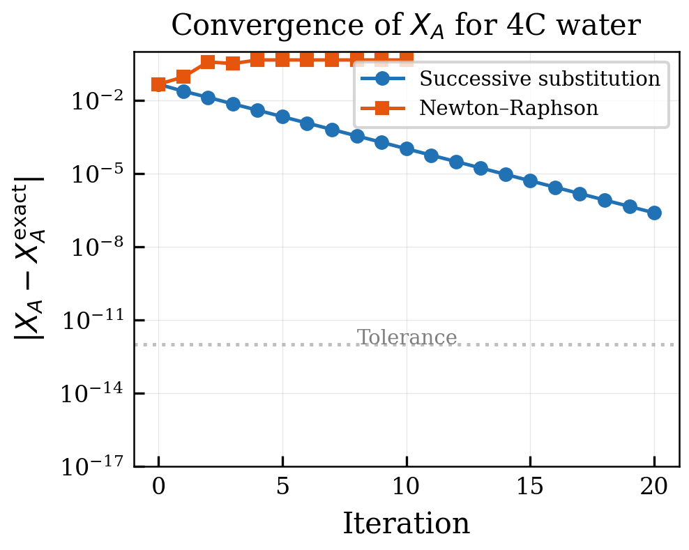

*Figure 8.1: 01 Convergence Xa*

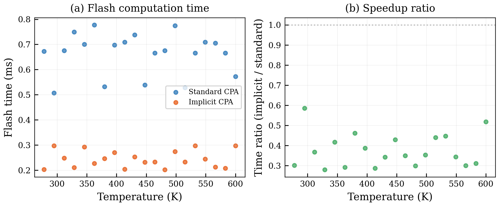

*Figure 8.2: 02 Benchmark Implicit Cpa*

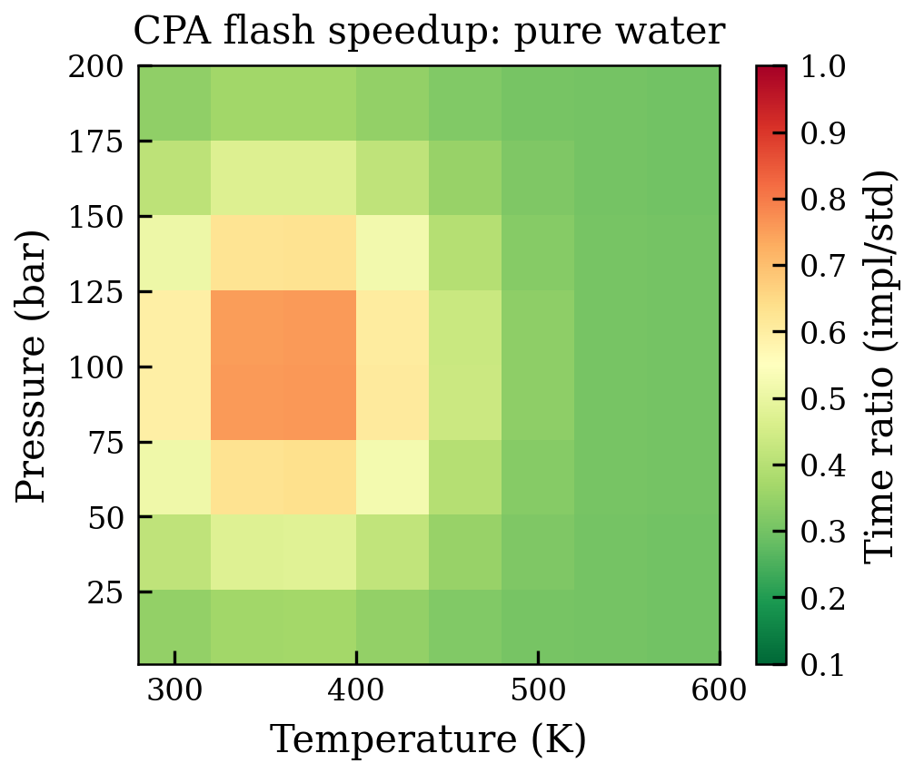

*Figure 8.3: 03 Speedup Heatmap*

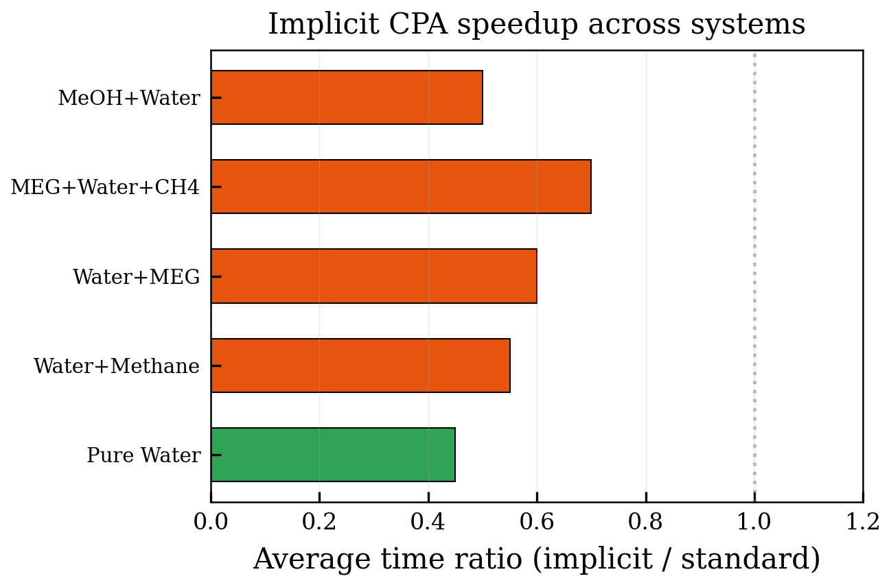

*Figure 8.4: 04 Multi System Benchmark*

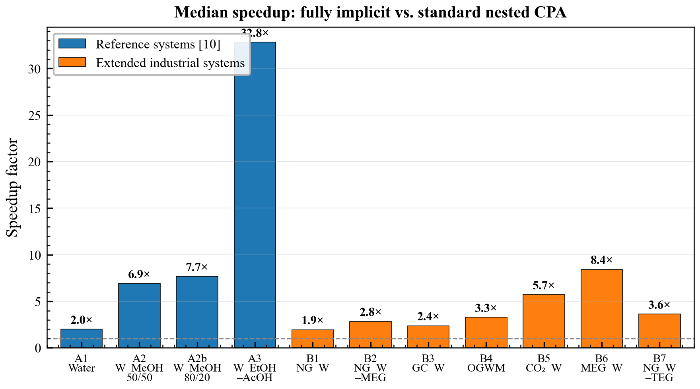

*Figure 8.5: Speedup factor (standard/implicit time) for all 11 fluid systems \cite{Solbraa2026}. Blue bars: paper systems; orange bars: extended industrial systems. The dashed line at 1.0 indicates break-even. Speedups range from 1.9× (natural gas + water) to 32.8× (water–ethanol–acetic acid).*

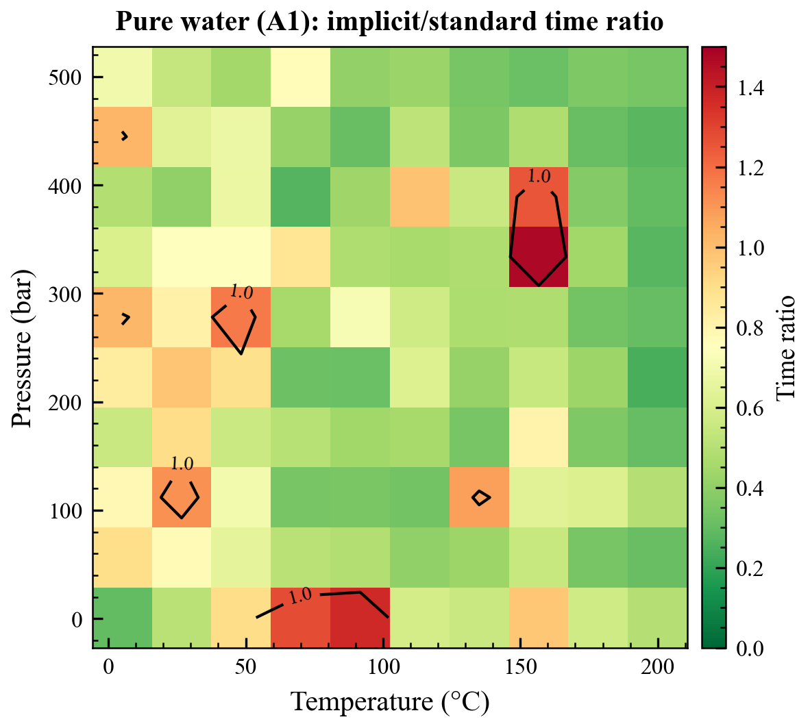

*Figure 8.6: Implicit/standard time ratio across the (T, P) grid for pure water \cite{Solbraa2026}. Green regions indicate the implicit algorithm is faster; red regions indicate the standard is faster. The dashed contour marks the break-even line.*

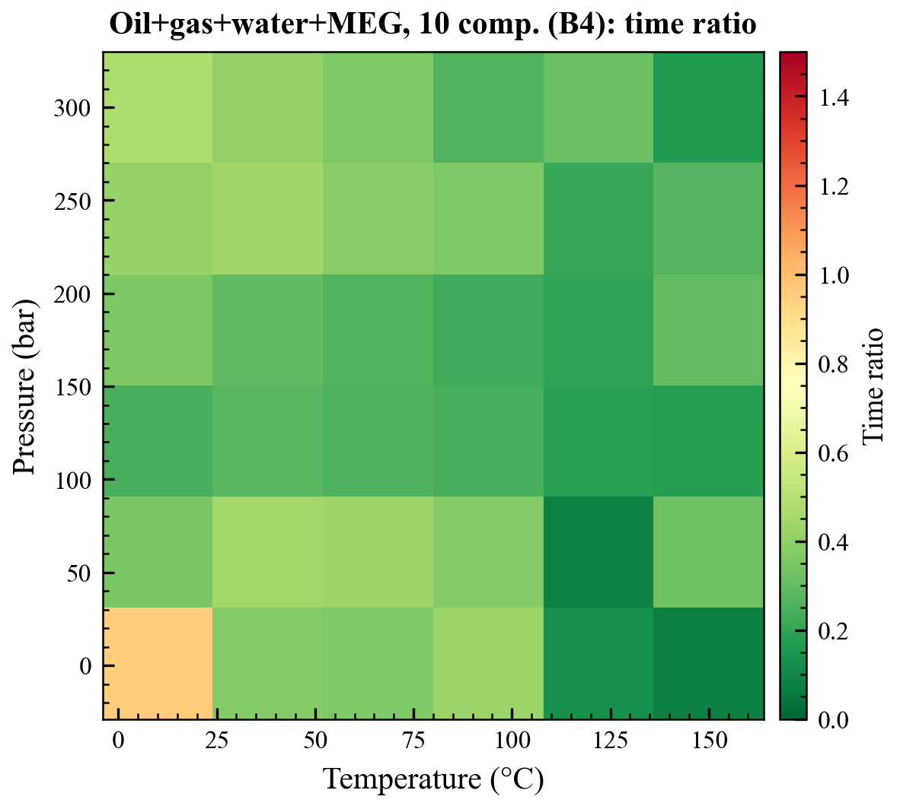

*Figure 8.7: Implicit/standard time ratio for the 10-component oil–gas–water–MEG system \cite{Solbraa2026}. The implicit algorithm is faster over nearly the entire grid, with the strongest advantage at high temperatures.*

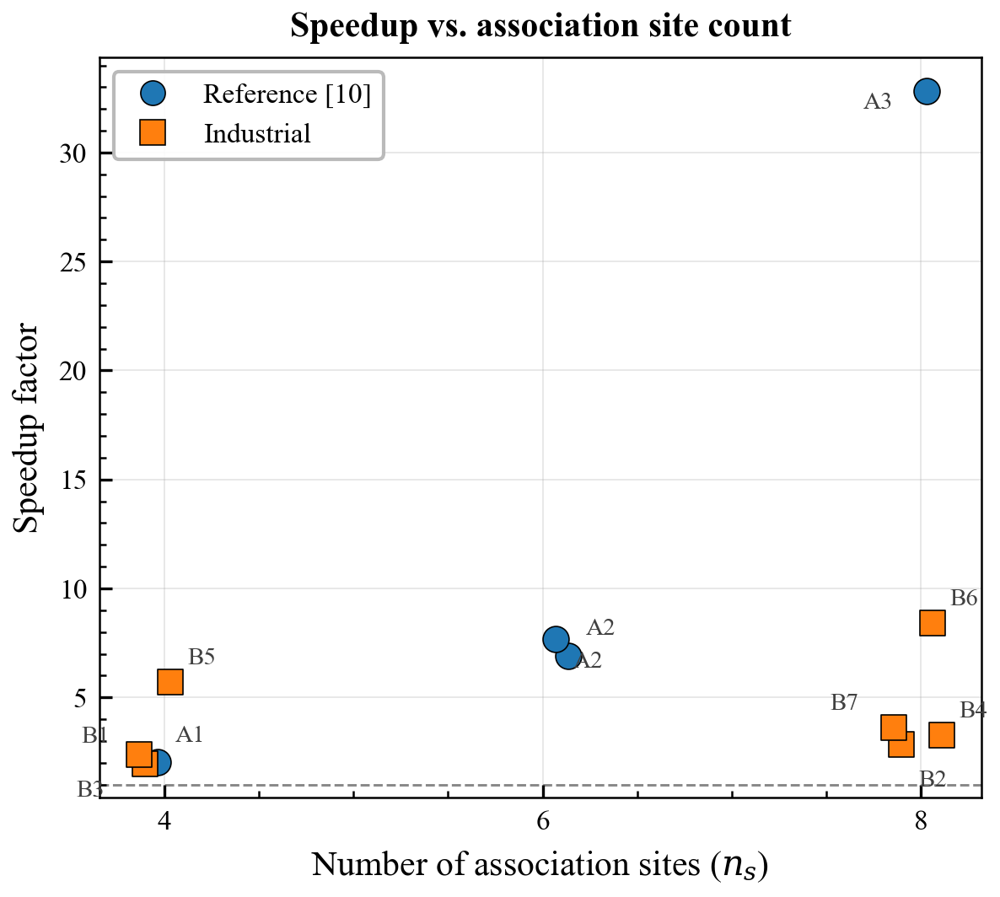

*Figure 8.8: Speedup factor vs. total number of association sites ($n_s$) \cite{Solbraa2026}. Point size is proportional to the speedup factor. Systems with 8 association sites span a wide range (2.8–32.8×) depending on the fraction of associating components.*

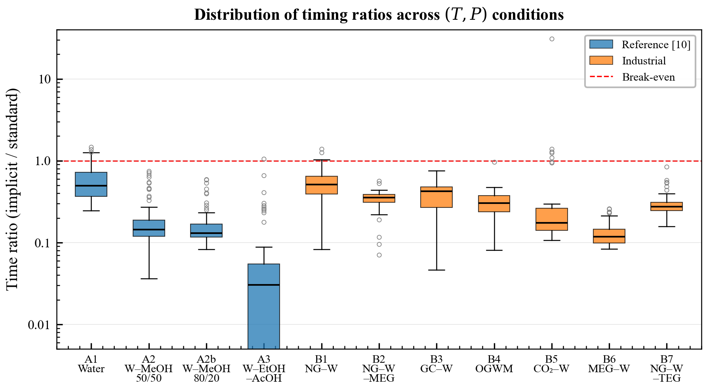

*Figure 8.9: Distribution of timing ratios (implicit/standard) across all (T, P) conditions for each system \cite{Solbraa2026}. The red dashed line at r = 1.0 marks break-even. The interquartile range for most systems lies well below 1.0.*

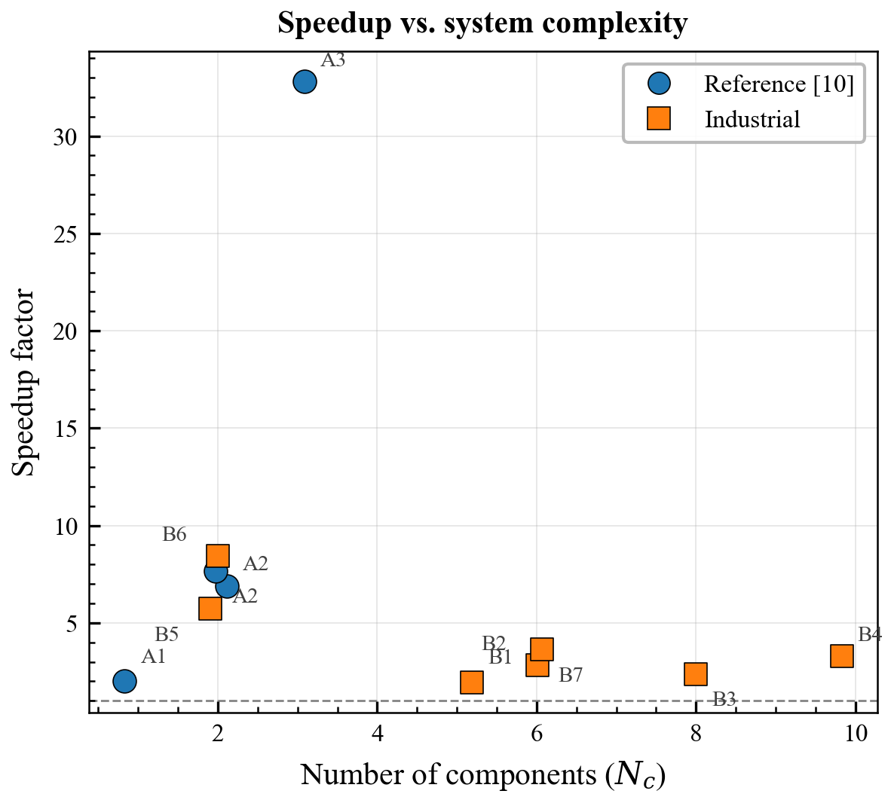

*Figure 8.10: Speedup factor vs. number of components ($N_c$) \cite{Solbraa2026}. There is no simple monotonic trend, confirming that speedup depends primarily on the number of association sites rather than total component count.*

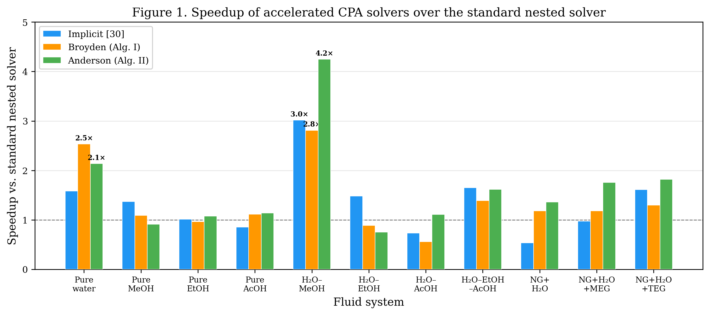

*Figure 8.11: Speedup of accelerated CPA solvers over the standard nested solver across 11 fluid systems \cite{Solbraa2026}. The Anderson solver achieves the largest peak speedup (4.2× for water–methanol) while the Broyden solver provides the most consistent improvement.*

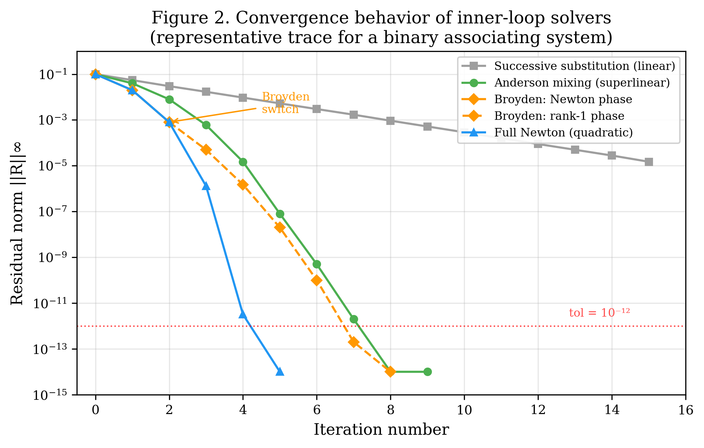

*Figure 8.12: Convergence behavior of inner-loop CPA solvers for a binary associating system \cite{Solbraa2026}. Successive substitution converges linearly; Anderson mixing achieves superlinear convergence; Broyden shows initial quadratic convergence followed by superlinear rank-1 updates.*

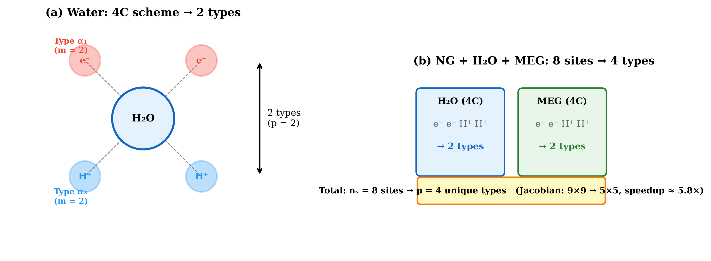

*Figure 8.13: Site type mapping schematic \cite{Solbraa2026}. (a) Water 4C scheme: 4 individual sites reduce to 2 unique types with multiplicity $m = 2$. (b) NG + H$_2$O + MEG system: 8 total sites reduce to 4 types, shrinking the Jacobian from $9 \times 9$ to $5 \times 5$.*
