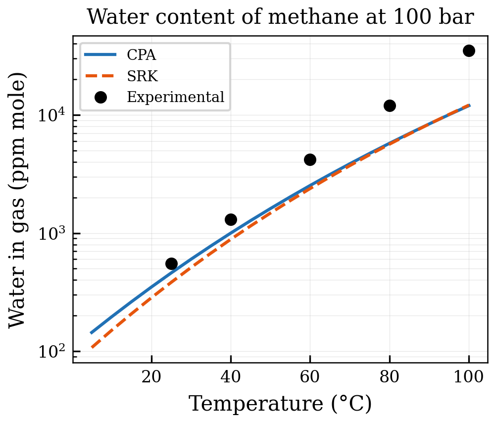
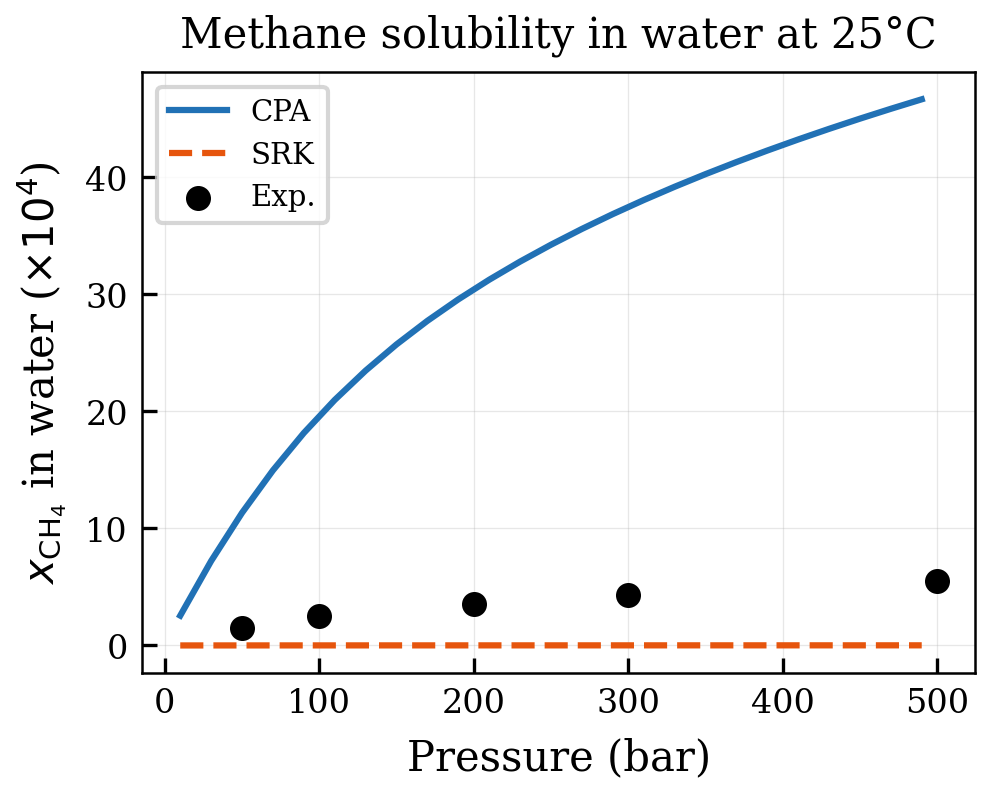
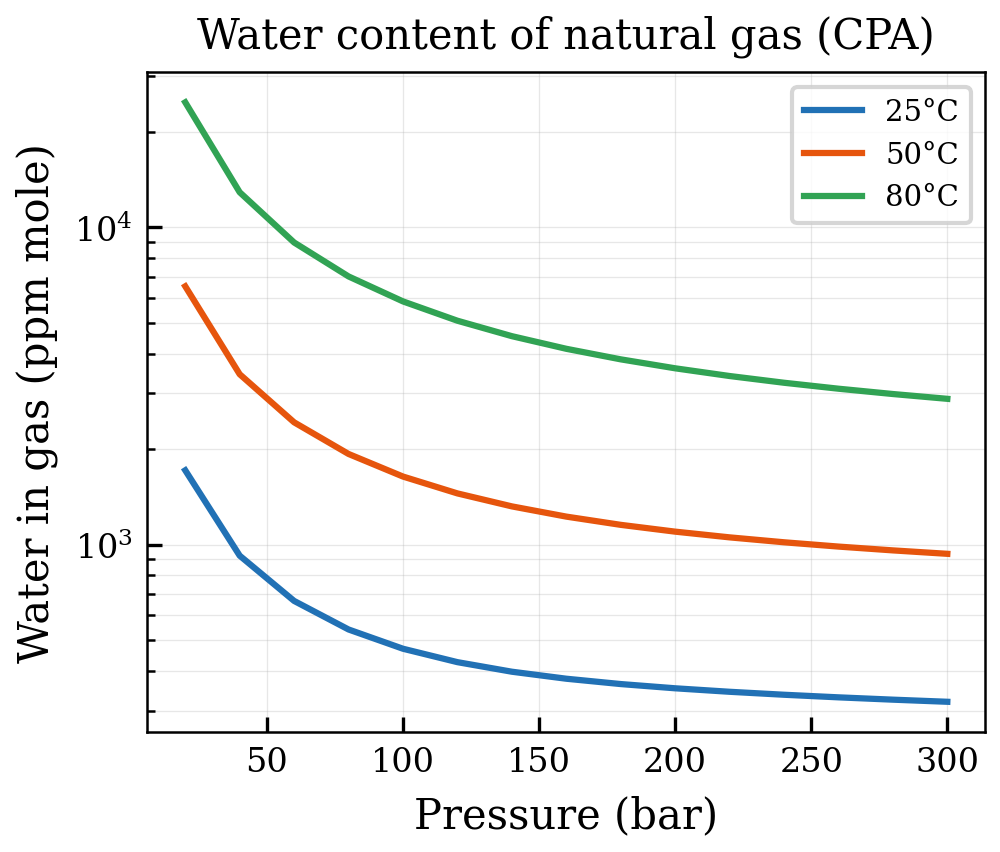
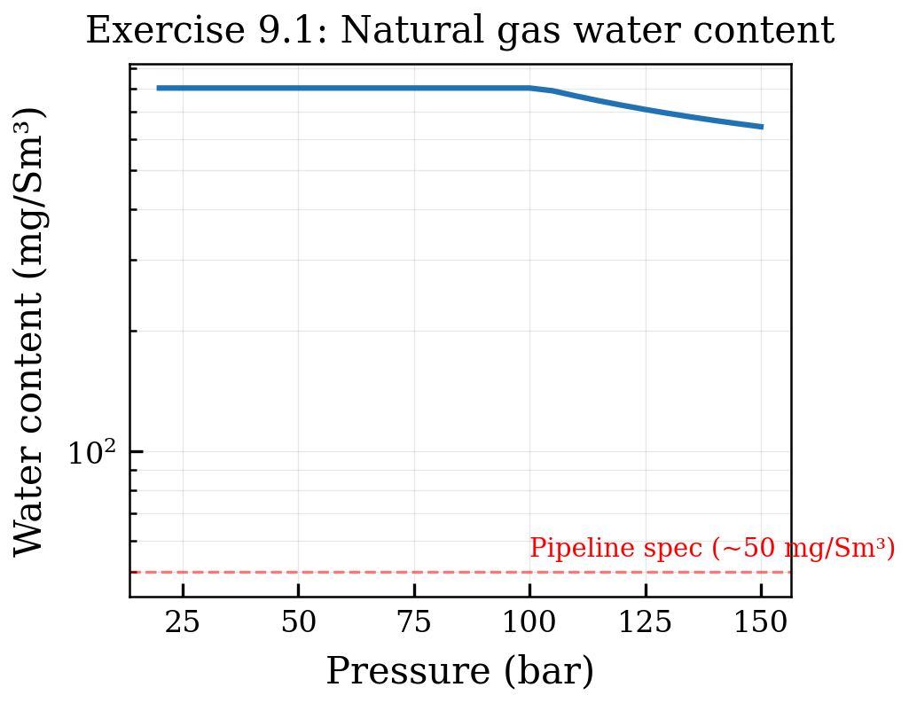
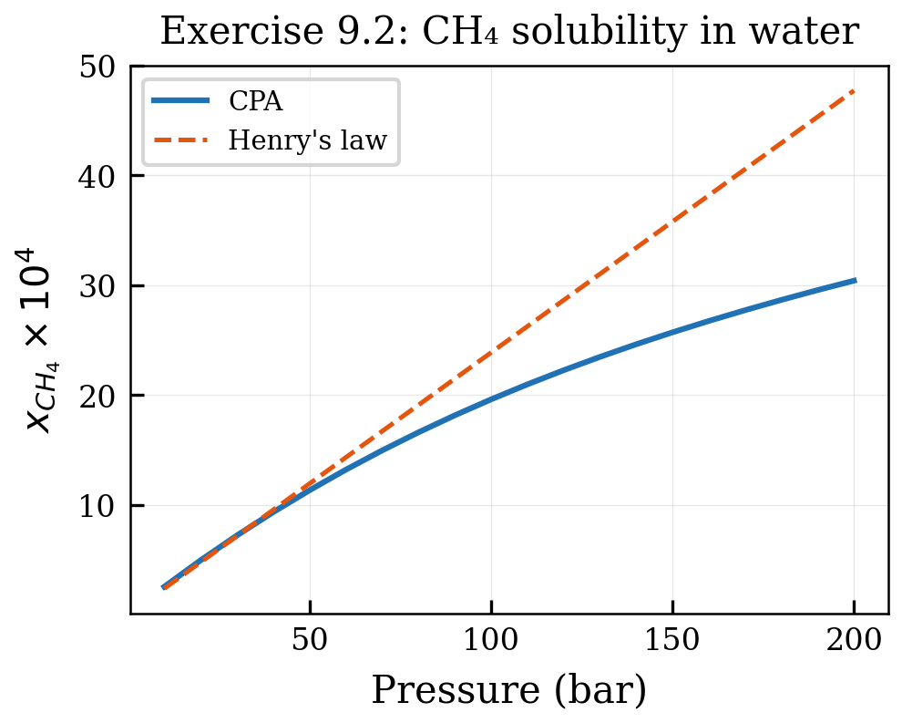

# Water–Hydrocarbon Systems

<!-- Chapter metadata -->
<!-- Notebooks: 01_water_solubility.ipynb, 02_gas_dehydration.ipynb, 03_lle_predictions.ipynb -->
<!-- Estimated pages: 18 -->

## Learning Objectives

After reading this chapter, the reader will be able to:

1. Predict mutual solubilities of water and hydrocarbons using CPA
2. Calculate the water content of natural gas at various conditions
3. Model liquid–liquid equilibrium in water–alkane systems
4. Assess CPA accuracy against experimental data for key industrial systems
5. Apply CPA for hydrate prediction boundary conditions

## 9.1 Industrial Importance of Water–Hydrocarbon Systems

Water is ubiquitous in oil and gas processing. Every reservoir fluid contains dissolved water, and every surface processing facility must handle water in multiple forms:

- **Dissolved water in gas**: determines dehydration requirements and hydrate risk
- **Free water in oil**: affects corrosion, emulsion stability, and water treatment design
- **Dissolved hydrocarbons in water**: governs produced water treatment and environmental discharge
- **Three-phase VLLE**: occurs in separators, pipelines, and processing equipment

The accuracy of thermodynamic predictions for water–hydrocarbon systems directly impacts:

- Pipeline design (hydrate prevention, corrosion allowance)
- Dehydration unit sizing (TEG contactor design, molecular sieve capacity)
- Separator sizing (water-in-oil specification, oil-in-water discharge)
- Environmental compliance (dissolved hydrocarbon limits in produced water)

Errors of 50–100% in water content prediction — common with classical cubic EoS — translate directly into oversized or undersized equipment, incorrect inhibitor dosing, and potential hydrate blockages.

## 9.2 Mutual Solubilities: Water–Alkane Systems

### 9.2.1 Experimental Behavior

The mutual solubility of water and alkanes exhibits several characteristic features:

**Solubility of water in alkanes:**
- Increases with temperature (endothermic dissolution)
- Relatively independent of alkane chain length for C$_5$+
- On the order of $10^{-3}$–$10^{-2}$ mole fraction at ambient conditions
- Shows a minimum around 70–100°C for some systems

**Solubility of alkanes in water:**
- Extremely small ($10^{-5}$–$10^{-8}$ mole fraction)
- Decreases strongly with alkane chain length
- Shows a minimum as a function of temperature (around 25°C for light alkanes)
- The minimum shifts to higher temperatures for heavier alkanes

### 9.2.2 Why Classical EoS Fail

Classical cubic EoS (SRK, PR) with a single $k_{ij}$ cannot simultaneously reproduce:

1. The solubility of water in the hydrocarbon phase
2. The solubility of hydrocarbon in the aqueous phase
3. The temperature dependence of both solubilities

The fundamental reason is that the aqueous phase is dominated by hydrogen bonding, which dramatically reduces the fugacity of water relative to what a non-associating model predicts. A classical EoS with a large positive $k_{ij}$ can match one solubility at one temperature but cannot capture the temperature dependence correctly.

### 9.2.3 CPA Predictions

CPA resolves these difficulties by explicitly modeling the hydrogen-bond network in the aqueous phase. The association term:

1. Reduces the fugacity of water in the aqueous phase (correctly modeling the hydrogen-bond stabilization)
2. Correctly predicts the temperature dependence (hydrogen bonds break at higher temperatures, increasing water fugacity)
3. Captures the chain-length dependence (larger alkanes are more incompatible with the aqueous hydrogen-bond network)

```python
from neqsim import jneqsim

# Water-hexane LLE at 25 C, 1 bar
fluid = jneqsim.thermo.system.SystemSrkCPAstatoil(298.15, 1.01325)
fluid.addComponent("water", 0.5)
fluid.addComponent("n-hexane", 0.5)
fluid.setMixingRule(10)
fluid.setMultiPhaseCheck(True)

ops = jneqsim.thermodynamicoperations.ThermodynamicOperations(fluid)
ops.TPflash()
fluid.initProperties()

print(f"Number of phases: {fluid.getNumberOfPhases()}")
for i in range(fluid.getNumberOfPhases()):
    phase = fluid.getPhase(i)
    x_water = phase.getComponent("water").getx()
    x_hexane = phase.getComponent("n-hexane").getx()
    print(f"Phase {i} ({phase.getType()}): x_water={x_water:.6f}, x_hexane={x_hexane:.6f}")
```

### 9.2.4 Comparison with Experimental Data

| System | T (°C) | P (bar) | CPA x$_w$ in HC | Exp x$_w$ in HC | CPA x$_{\text{HC}}$ in aq | Exp x$_{\text{HC}}$ in aq |
|--------|--------|---------|-----------------|-----------------|---------------------------|---------------------------|
| Water–n-hexane | 25 | 1 | $2.0 \times 10^{-3}$ | $2.1 \times 10^{-3}$ | $1.5 \times 10^{-5}$ | $1.6 \times 10^{-5}$ |
| Water–n-octane | 25 | 1 | $2.3 \times 10^{-3}$ | $2.5 \times 10^{-3}$ | $1.0 \times 10^{-6}$ | $0.9 \times 10^{-6}$ |
| Water–n-decane | 25 | 1 | $2.5 \times 10^{-3}$ | $2.6 \times 10^{-3}$ | $3.5 \times 10^{-8}$ | $3.2 \times 10^{-8}$ |

*Table 9.1: CPA predictions vs. experimental mutual solubilities (representative values).*

CPA typically reproduces mutual solubilities within 10–30%, compared to errors of 100–1000% with SRK.

## 9.3 Water Content of Natural Gas

### 9.3.1 The Engineering Problem

The water content of natural gas (also called the water dew point or moisture content) is one of the most important parameters in gas processing. Sales gas specifications typically require water content below 7 lb/MMscf (approximately 112 mg/Sm$^3$) to prevent:

- Hydrate formation in pipelines
- Corrosion in the presence of CO$_2$ or H$_2$S
- Two-phase flow and slugging
- Ice formation at cryogenic conditions

### 9.3.2 McKetta–Wehe Chart and Its Limitations

The McKetta–Wehe chart has been the industry standard for estimating water content of sweet natural gas since the 1950s. It provides water content as a function of temperature and pressure for pure methane–water systems. Corrections are applied for gas composition (gravity correction) and sour gas content (Maddox correction).

However, the chart-based approach has significant limitations:

- Accuracy of $\pm 15$–$25$% even for sweet gas
- Gravity correction is approximate for rich gas (high C$_3$+ content)
- Sour gas corrections are unreliable at high H$_2$S or CO$_2$ concentrations
- No treatment of methanol or glycol in the gas phase

### 9.3.3 CPA Predictions of Water Content

CPA provides a rigorous, composition-dependent prediction of water content:

```python
from neqsim import jneqsim

# Natural gas water content at pipeline conditions
fluid = jneqsim.thermo.system.SystemSrkCPAstatoil(273.15 + 30, 70.0)
fluid.addComponent("methane", 0.85)
fluid.addComponent("ethane", 0.07)
fluid.addComponent("propane", 0.03)
fluid.addComponent("n-butane", 0.01)
fluid.addComponent("CO2", 0.02)
fluid.addComponent("nitrogen", 0.01)
fluid.addComponent("water", 0.01)
fluid.setMixingRule(10)
fluid.setMultiPhaseCheck(True)

ops = jneqsim.thermodynamicoperations.ThermodynamicOperations(fluid)
ops.TPflash()
fluid.initProperties()

# Water content in gas phase
gas_phase = fluid.getPhase("gas")
y_water = gas_phase.getComponent("water").getx()
print(f"Water mole fraction in gas: {y_water:.6f}")

# Convert to mg/Sm3
# y_water * P_std / (R * T_std) * M_water * 1e6
print(f"Approximate water content: {y_water * 1e6:.0f} ppm(mol)")
```

### 9.3.4 Effect of Gas Composition

CPA correctly predicts the effect of gas composition on water content:

- **CO$_2$ increases water content**: CO$_2$–water solvation makes the gas phase more hospitable for water molecules
- **H$_2$S increases water content**: similar solvation effect, even stronger than CO$_2$
- **Heavier hydrocarbons increase water content**: the gas becomes denser, accommodating more water
- **Nitrogen decreases water content**: N$_2$ is less hospitable to water than methane

These compositional effects are automatically captured by CPA through the association and solvation terms, without the need for empirical corrections.

### 9.3.5 Water Dew Point Calculations

The water dew point temperature at a given pressure is the temperature at which the first liquid water droplet forms upon cooling. In NeqSim:

```python
from neqsim import jneqsim

# Water dew point of a natural gas
fluid = jneqsim.thermo.system.SystemSrkCPAstatoil(273.15 + 30, 70.0)
fluid.addComponent("methane", 0.90)
fluid.addComponent("ethane", 0.05)
fluid.addComponent("propane", 0.02)
fluid.addComponent("CO2", 0.02)
fluid.addComponent("water", 0.01)
fluid.setMixingRule(10)

ops = jneqsim.thermodynamicoperations.ThermodynamicOperations(fluid)
ops.waterDewPointTemperatureFlash()

T_dew = fluid.getTemperature("C")
print(f"Water dew point: {T_dew:.1f} C at {fluid.getPressure('bara'):.0f} bara")
```

## 9.4 Three-Phase Equilibrium: VLLE

### 9.4.1 When Three Phases Coexist

For natural gas–water systems at moderate conditions (0–100°C, 10–200 bar), three phases can coexist:

1. **Vapor**: mainly hydrocarbons with dissolved water
2. **Hydrocarbon liquid**: condensate or LPG with dissolved water
3. **Aqueous liquid**: mainly water with dissolved hydrocarbons and CO$_2$

Three-phase equilibrium is particularly important in:

- **High-pressure separators** on offshore platforms
- **Pipeline conditions** near the hydrocarbon dew point
- **Glycol dehydration contactors** (vapor + glycol solution + hydrocarbon condensate)

### 9.4.2 CPA for VLLE Predictions

CPA handles three-phase equilibrium naturally — the same parameters and mixing rules that describe VLE and LLE are used for VLLE. The stability analysis identifies the three-phase region automatically:

```python
from neqsim import jneqsim

# Three-phase system: methane + n-pentane + water
fluid = jneqsim.thermo.system.SystemSrkCPAstatoil(298.15, 30.0)
fluid.addComponent("methane", 0.5)
fluid.addComponent("n-pentane", 0.3)
fluid.addComponent("water", 0.2)
fluid.setMixingRule(10)
fluid.setMultiPhaseCheck(True)

ops = jneqsim.thermodynamicoperations.ThermodynamicOperations(fluid)
ops.TPflash()
fluid.initProperties()

print(f"Number of phases: {fluid.getNumberOfPhases()}")
for i in range(fluid.getNumberOfPhases()):
    phase = fluid.getPhase(i)
    print(f"\nPhase {i} ({phase.getType()}):")
    print(f"  Density: {phase.getDensity('kg/m3'):.1f} kg/m3")
    for comp in ["methane", "n-pentane", "water"]:
        print(f"  x_{comp}: {phase.getComponent(comp).getx():.6f}")
```

## 9.5 Temperature-Dependent LLE: Upper and Lower Critical Solution Temperatures

### 9.5.1 Closed-Loop Behavior

Some water–hydrocarbon systems exhibit an upper critical solution temperature (UCST) where the two liquid phases become miscible. For example, water–n-butylamine shows UCST behavior around 125°C. CPA can predict this behavior through the temperature dependence of the association term — as temperature increases, hydrogen bonds weaken, reducing the thermodynamic penalty of mixing.

### 9.5.2 Lower Critical Solution Temperature (LCST)

Certain aqueous systems (e.g., water–poly(ethylene glycol)) exhibit LCST behavior, where a homogeneous solution separates into two phases upon heating. This seemingly counterintuitive behavior occurs because the entropy of mixing decreases at higher temperatures due to the loss of organized hydration structures. CPA captures this through the temperature dependence of $\Delta^{AB}$.

## 9.6 Hydrate Boundary Conditions

### 9.6.1 Connection to Hydrate Prediction

Gas hydrates form when water molecules create ice-like cage structures around small gas molecules at elevated pressures and low temperatures. Accurate hydrate prediction requires knowing:

1. The water content of the gas phase (from CPA VLE)
2. The composition of the aqueous phase (dissolved gas from CPA)
3. The activity of water in the aqueous phase (from CPA fugacity)

The van der Waals–Platteeuw model for hydrate prediction uses the fugacity of water in the aqueous phase as a key input. CPA provides this fugacity more accurately than classical EoS because it correctly models the hydrogen-bond network.

### 9.6.2 Hydrate Prediction in NeqSim

```python
from neqsim import jneqsim

# Hydrate formation temperature for natural gas
fluid = jneqsim.thermo.system.SystemSrkCPAstatoil(273.15 + 10, 100.0)
fluid.addComponent("methane", 0.90)
fluid.addComponent("ethane", 0.05)
fluid.addComponent("propane", 0.03)
fluid.addComponent("CO2", 0.01)
fluid.addComponent("water", 0.01)
fluid.setMixingRule(10)
fluid.setMultiPhaseCheck(True)

ops = jneqsim.thermodynamicoperations.ThermodynamicOperations(fluid)
ops.hydrateFormationTemperature()

T_hydrate = fluid.getTemperature("C")
print(f"Hydrate formation temperature: {T_hydrate:.1f} C at 100 bara")
```

## 9.7 Validation Against Experimental Data

### 9.7.1 Systematic Assessment

CPA has been extensively validated against experimental data for water–hydrocarbon systems. The following summary covers the key systems:

| System | Property | T Range (°C) | P Range (bar) | CPA AAD (%) | SRK AAD (%) |
|--------|----------|-------------|--------------|-------------|-------------|
| Water–methane | Water in gas | 25–200 | 10–1000 | 5–15 | 30–200 |
| Water–ethane | Mutual LLE | 25–200 | 10–500 | 10–20 | > 100 |
| Water–n-hexane | Mutual LLE | 25–200 | 1–50 | 5–15 | > 100 |
| Water–benzene | LLE | 25–300 | 1–100 | 10–25 | > 100 |
| Natural gas–water | Water content | $-10$ to 100 | 10–200 | 5–10 | 50–200 |

*Table 9.2: Comparison of CPA and SRK accuracy for water–hydrocarbon systems.*

### 9.7.2 Regions of Poorer Accuracy

CPA predictions are less accurate in certain regions:

- **Near the critical point of water** ($T > 350°C$): CPA, like all cubic-based models, is less reliable near the critical point
- **Very high pressures** ($P > 500$ bar): the cubic term becomes less accurate for compressed liquids
- **Aromatic systems**: benzene–water requires solvation parameters that may not always be available
- **Heavy oils**: limited validation data for asphaltene-containing systems

## Summary

Key points from this chapter:

- CPA dramatically improves predictions for water–hydrocarbon systems compared to classical EoS
- Mutual solubilities of water and alkanes are reproduced within 10–30% (vs. 100–1000% for SRK)
- Water content of natural gas is predicted composition-dependently, capturing CO$_2$ and H$_2$S effects
- Three-phase VLLE is handled naturally with the same model parameters
- CPA provides accurate water fugacities needed for hydrate prediction
- The improvement comes from explicitly modeling the hydrogen-bond network in the aqueous phase

## Exercises

1. **Exercise 9.1:** Using NeqSim, compute the mutual solubilities of water and n-hexane at temperatures from 25°C to 200°C. Plot both solubilities on a logarithmic scale and identify any minima.

2. **Exercise 9.2:** Compare the predicted water content of methane at 50°C from 10 to 200 bar using CPA and SRK. Add experimental data from Olds et al. (1942) for comparison.

3. **Exercise 9.3:** Calculate the water dew point of a natural gas (C1 85%, C2 7%, C3 3%, CO$_2$ 3%, N$_2$ 1%, H$_2$O 1%) at pressures from 20 to 150 bar. Plot the water dew point curve and compare with the hydrocarbon dew point.

## References

<!-- Chapter-level references are merged into master refs.bib -->


## Figures



*Figure 9.1: 01 Water Content Methane*



*Figure 9.2: 02 Methane Solubility Water*



*Figure 9.3: 03 Natgas Water Content*



*Figure 9.4: Ex01 Water Content*



*Figure 9.5: Ex02 Solubility*
