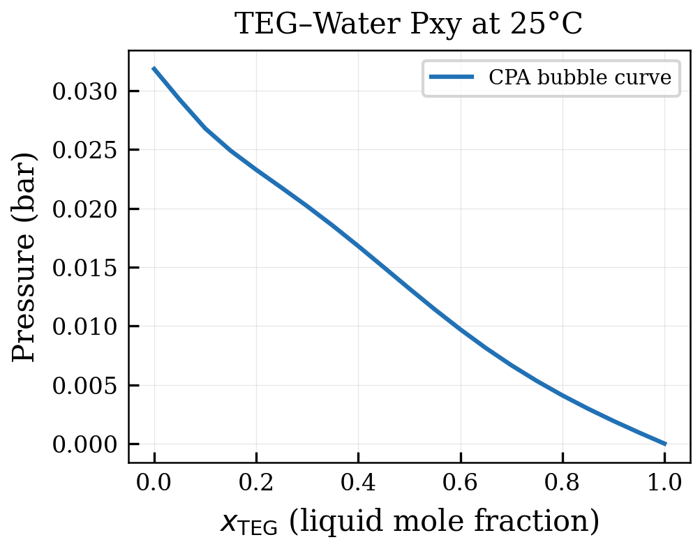
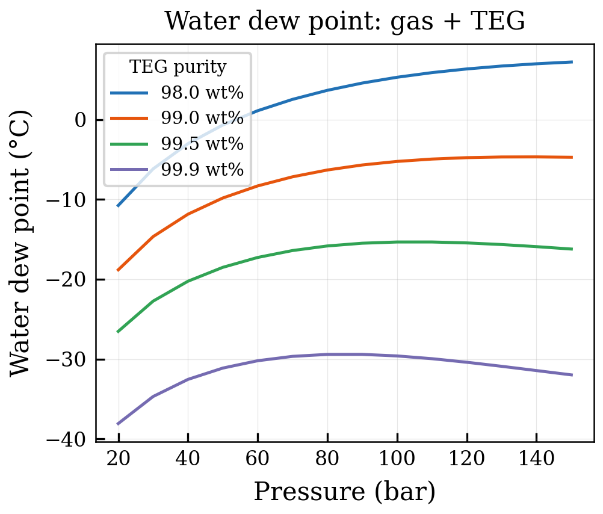
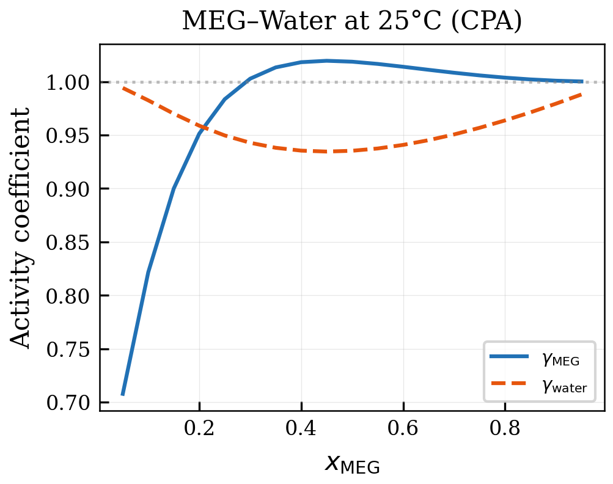
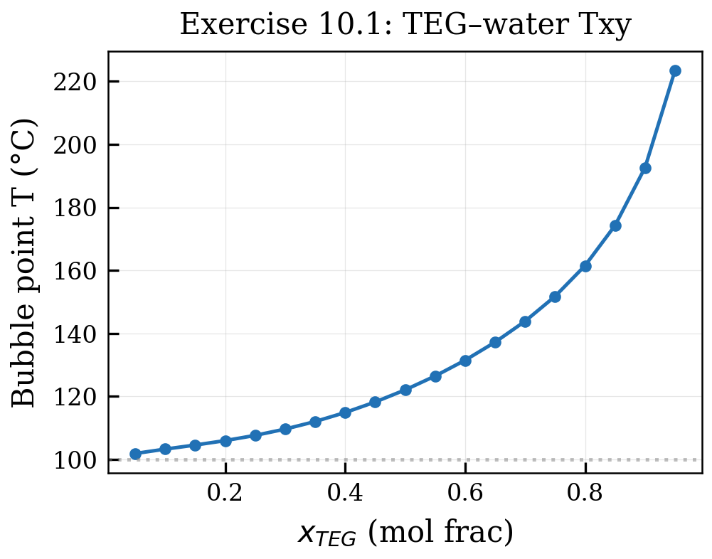
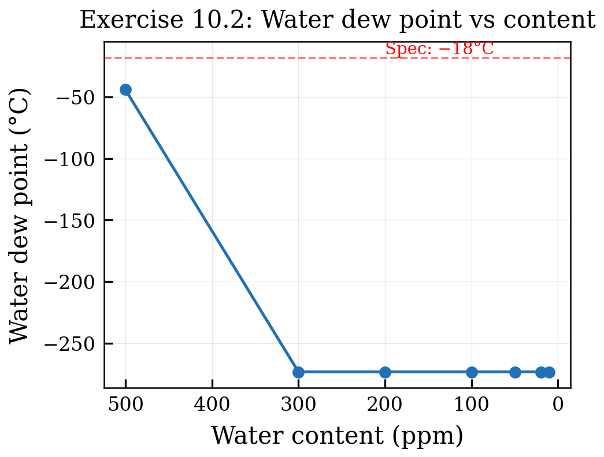
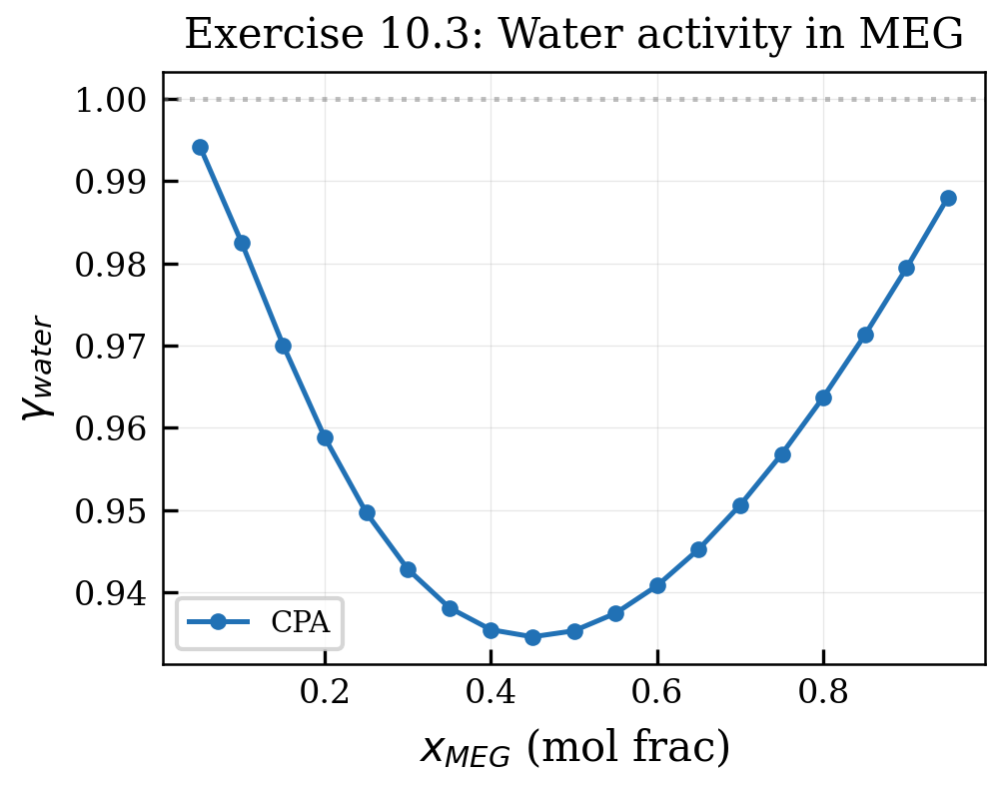

# Gas Processing and Chemical Injection

<!-- Chapter metadata -->
<!-- Notebooks: 01_teg_dehydration.ipynb, 02_methanol_injection.ipynb, 03_glycol_losses.ipynb -->
<!-- Estimated pages: 20 -->

## Learning Objectives

After reading this chapter, the reader will be able to:

1. Model TEG dehydration processes using CPA in NeqSim
2. Calculate methanol partitioning in multiphase gas systems
3. Predict glycol losses in dehydration and hydrate inhibition
4. Design MEG injection systems with CPA-based predictions
5. Apply CPA for polar chemical injection in oil and gas processing

## 10.1 Introduction to Gas Processing with CPA

Gas processing operations frequently involve polar chemicals \cite{Campbell2014,GPSA2012,Kidnay2011}: glycols for dehydration, methanol and MEG for hydrate inhibition, amines for acid gas removal. These chemicals form hydrogen bonds with water and with each other, making CPA the natural thermodynamic model for these applications.

Classical cubic EoS with conventional mixing rules cannot accurately predict:

- The vapor pressure depression of water by glycol addition
- The partitioning of methanol between gas, condensate, and aqueous phases
- Glycol losses to the gas and condensate phases
- The effect of dissolved salts on inhibitor performance

CPA handles all these aspects through its explicit treatment of hydrogen bonding, making it the preferred model for gas processing design.

## 10.2 TEG Dehydration

### 10.2.1 Process Description

Triethylene glycol (TEG) dehydration is the most common method for removing water from natural gas. The process consists of:

1. **Absorption column**: wet gas contacts lean TEG in a countercurrent contactor
2. **Rich TEG flash drum**: dissolved gas is removed from the rich TEG
3. **Rich TEG heat exchangers**: heat recovery before regeneration
4. **Regeneration column**: water is stripped from the TEG at near-atmospheric pressure
5. **Stripping gas injection** (optional): improves TEG purity beyond thermal regeneration limits

Typical specifications:
- Water content in dry gas: < 7 lb/MMscf (pipeline) or < 1 ppmv (cryogenic processing)
- TEG circulation rate: 2–5 gallons TEG per lb of water removed
- Regeneration temperature: 185–204°C (depending on TEG purity target)
- TEG purity: 98.5–99.99 wt% (depending on application)

### 10.2.2 Why CPA Is Important for TEG Design

The key thermodynamic properties that determine TEG dehydration performance are:

1. **Water–TEG activity coefficients**: determines the equilibrium water content achievable
2. **TEG vapor pressure**: determines TEG losses to the gas phase
3. **Hydrocarbon solubility in TEG**: determines BTEX and C$_6$+ pickup
4. **Water dew point of dry gas**: the design target

CPA accurately models the water–TEG system because it captures the hydrogen bonding between water's OH groups and TEG's three ether oxygens and two hydroxyl groups. The association scheme for TEG in CPA is typically 4C (two proton donor sites and two proton acceptor sites).

### 10.2.3 TEG Dehydration Simulation with NeqSim

```python
from neqsim import jneqsim

# Create feed gas with water
feed_gas = jneqsim.thermo.system.SystemSrkCPAstatoil(303.15, 70.0)
feed_gas.addComponent("methane", 0.85)
feed_gas.addComponent("ethane", 0.07)
feed_gas.addComponent("propane", 0.03)
feed_gas.addComponent("n-butane", 0.01)
feed_gas.addComponent("CO2", 0.02)
feed_gas.addComponent("water", 0.015)
feed_gas.addComponent("TEG", 0.0)
feed_gas.setMixingRule(10)
feed_gas.setMultiPhaseCheck(True)

# Set up the stream
Stream = jneqsim.process.equipment.stream.Stream
feed_stream = Stream("Wet Gas", feed_gas)
feed_stream.setFlowRate(10.0, "MSm3/day")
feed_stream.setTemperature(30.0, "C")
feed_stream.setPressure(70.0, "bara")

# Create lean TEG stream
teg_fluid = jneqsim.thermo.system.SystemSrkCPAstatoil(303.15, 70.0)
teg_fluid.addComponent("methane", 0.0)
teg_fluid.addComponent("ethane", 0.0)
teg_fluid.addComponent("propane", 0.0)
teg_fluid.addComponent("n-butane", 0.0)
teg_fluid.addComponent("CO2", 0.0)
teg_fluid.addComponent("water", 0.01)
teg_fluid.addComponent("TEG", 0.99)
teg_fluid.setMixingRule(10)

teg_stream = Stream("Lean TEG", teg_fluid)
teg_stream.setFlowRate(5000.0, "kg/hr")
teg_stream.setTemperature(30.0, "C")
teg_stream.setPressure(70.0, "bara")

print("TEG dehydration streams configured with CPA")
```

### 10.2.4 Prediction of Dry Gas Water Content

The achievable water content of the dry gas depends on:

- **TEG purity**: higher purity achieves lower water dew points
- **Temperature**: lower contactor temperature improves dehydration
- **Number of stages**: more theoretical stages improve separation
- **TEG circulation rate**: higher rates approach but never exceed the equilibrium limit

CPA predicts the equilibrium water content above TEG solutions accurately:

| TEG Purity (wt%) | Temp (°C) | CPA Water Content (mg/Sm$^3$) | Exp. (mg/Sm$^3$) | SRK (mg/Sm$^3$) |
|-------------------|-----------|-------------------------------|-------------------|------------------|
| 98.5 | 30 | 95 | 90 | 150 |
| 99.0 | 30 | 55 | 52 | 95 |
| 99.5 | 30 | 28 | 26 | 52 |
| 99.9 | 30 | 6 | 5.5 | 15 |
| 99.95 | 30 | 3 | 2.8 | 8 |

*Table 10.1: Water content of gas in equilibrium with TEG solutions (representative values).*

## 10.3 Methanol Injection for Hydrate Inhibition

### 10.3.1 The Methanol Partitioning Problem

Methanol is widely used as a thermodynamic hydrate inhibitor in subsea gas production \cite{Folas2007}. The dosing rate must account for methanol that partitions into three phases:

1. **Aqueous phase**: where methanol acts as a hydrate inhibitor
2. **Gas phase**: methanol losses that do not contribute to inhibition
3. **Condensate phase**: additional losses, particularly for rich gas systems

Accurate prediction of methanol partitioning is critical: under-dosing leads to hydrate blockage, while over-dosing wastes expensive chemical and creates downstream problems (methanol in sales gas, in produced water).

### 10.3.2 CPA for Methanol Partitioning

Methanol (3B association scheme: one OH donor, one OH acceptor, one electron pair) is a strong self-associating compound that also cross-associates with water. CPA with the binary parameters for methanol–water, methanol–methane, and methanol–hydrocarbons provides accurate three-phase partitioning:

```python
from neqsim import jneqsim

# Methanol partitioning in a gas-condensate-water system
fluid = jneqsim.thermo.system.SystemSrkCPAstatoil(278.15, 100.0)
fluid.addComponent("methane", 0.70)
fluid.addComponent("ethane", 0.08)
fluid.addComponent("propane", 0.05)
fluid.addComponent("n-butane", 0.03)
fluid.addComponent("n-pentane", 0.02)
fluid.addComponent("n-hexane", 0.01)
fluid.addComponent("water", 0.05)
fluid.addComponent("methanol", 0.06)
fluid.setMixingRule(10)
fluid.setMultiPhaseCheck(True)

ops = jneqsim.thermodynamicoperations.ThermodynamicOperations(fluid)
ops.TPflash()
fluid.initProperties()

print(f"Number of phases: {fluid.getNumberOfPhases()}")
for i in range(fluid.getNumberOfPhases()):
    phase = fluid.getPhase(i)
    x_meoh = phase.getComponent("methanol").getx()
    print(f"Phase {i} ({phase.getType()}): x_MeOH = {x_meoh:.6f}")
```

### 10.3.3 Effect of Pressure and Temperature on Methanol Partitioning

CPA predictions show:

- **Gas-phase methanol losses increase** with decreasing pressure (lower gas density) and increasing temperature
- **Condensate-phase methanol losses** are relatively insensitive to pressure but increase with the amount of C$_5$+ present
- **At typical pipeline conditions** (80–150 bar, 4–20°C): 1–5% of injected methanol is lost to the gas, 2–8% to condensate

### 10.3.4 Hydrate Inhibition Effectiveness

The Hammerschmidt equation \cite{Hammerschmidt1934} provides a simple estimate of the hydrate temperature depression:

$$\Delta T = \frac{K_H \cdot w}{M(100 - w)}$$

where $w$ is the weight percent of inhibitor in the aqueous phase, $M$ is the molecular weight of the inhibitor (32.04 g/mol for methanol, 62.07 g/mol for MEG), and $K_H$ is an empirical constant (2335 for most inhibitors when $\Delta T$ is in °F, or 1297 for °C).

While the Hammerschmidt equation is useful for quick estimates, it has significant limitations:

1. It assumes ideal solution behavior (activity coefficients = 1)
2. It does not account for the effect of dissolved gases on inhibitor effectiveness
3. It underestimates the depression at high inhibitor concentrations (> 30 wt%)
4. It does not account for the pressure dependence of hydrate equilibrium

CPA provides a more rigorous prediction through the activity of water in the inhibitor solution. The hydrate temperature depression is related to the water activity by:

$$\Delta T \approx -\frac{RT_0^2}{\Delta H_{\text{hyd}}} \ln(a_w)$$

where $T_0$ is the hydrate equilibrium temperature for pure water, $\Delta H_{\text{hyd}}$ is the enthalpy of hydrate dissociation (~54 kJ/mol for structure I, ~57 kJ/mol for structure II) \cite{Sloan2008,vanderWaalsPlatteuw1959}, and $a_w = x_w \gamma_w$ is the activity of water computed by CPA. The advantage of this approach is that $\gamma_w$ is predicted from the CPA model, accounting for non-ideal mixing, dissolved gases, and the specific inhibitor–water hydrogen bond interactions.

For high methanol concentrations (> 40 wt%), the Margules-type activity coefficient can exceed 1.5, leading to Hammerschmidt underestimating the depression by 3–5°C — a significant safety margin that would result in over-dosing if ignored.

## 10.4 MEG (Mono-Ethylene Glycol) Injection

### 10.4.1 Advantages Over Methanol

MEG (mono-ethylene glycol, also called ethylene glycol or EG) has several advantages over methanol for long-distance subsea gas transport:

- **Lower volatility**: much lower losses to the gas phase
- **Regenerable**: can be recovered and recycled at the receiving terminal
- **Less toxic**: lower environmental impact from accidental release
- **Non-flammable**: safer handling and storage

The main disadvantage is higher viscosity and lower hydrate suppression per unit weight, requiring higher injection rates.

### 10.4.2 CPA for MEG Systems

MEG (4C association scheme) forms strong hydrogen bonds with water. CPA accurately predicts \cite{Westman2016}:

- **MEG–water VLE**: vapor pressure depression of water by MEG
- **MEG losses to gas**: very small (typically < 0.1% of injected MEG), but important for MEG makeup calculation
- **MEG–hydrocarbon interactions**: negligible solubility, but relevant at extreme conditions

```python
from neqsim import jneqsim

# MEG-water-natural gas system
fluid = jneqsim.thermo.system.SystemSrkCPAstatoil(278.15, 150.0)
fluid.addComponent("methane", 0.80)
fluid.addComponent("ethane", 0.06)
fluid.addComponent("propane", 0.03)
fluid.addComponent("CO2", 0.02)
fluid.addComponent("water", 0.06)
fluid.addComponent("MEG", 0.03)
fluid.setMixingRule(10)
fluid.setMultiPhaseCheck(True)

ops = jneqsim.thermodynamicoperations.ThermodynamicOperations(fluid)
ops.TPflash()
fluid.initProperties()

print(f"Number of phases: {fluid.getNumberOfPhases()}")
for i in range(fluid.getNumberOfPhases()):
    phase = fluid.getPhase(i)
    x_meg = phase.getComponent("MEG").getx()
    x_water = phase.getComponent("water").getx()
    print(f"Phase {i} ({phase.getType()}): x_MEG={x_meg:.6f}, x_water={x_water:.6f}")
```

### 10.4.3 Rich vs. Lean MEG Properties

The viscosity and density of MEG–water solutions vary strongly with concentration and temperature. These physical properties are important for:

- Pump sizing in the MEG injection system
- Heat exchanger design in the MEG regeneration unit
- Pipeline hydraulics (increased frictional pressure drop)

CPA, combined with the physical property correlations in NeqSim, provides these properties as a function of composition and conditions.

## 10.5 Glycol Losses and Emissions

### 10.5.1 Sources of Glycol Loss

Glycol losses in gas processing occur through several mechanisms:

1. **Vaporization losses**: glycol carried in the gas phase (dominant at high temperatures)
2. **Entrainment losses**: liquid glycol droplets carried by the gas stream
3. **Solubility losses**: glycol dissolved in the hydrocarbon condensate phase
4. **Degradation losses**: thermal or oxidative degradation at regeneration temperatures

CPA predicts the first three mechanisms through phase equilibrium calculations. The degradation losses are kinetic and must be estimated separately.

### 10.5.2 TEG Vaporization Losses

TEG vaporization losses increase exponentially with temperature:

| T (°C) | P (bar) | CPA TEG in Gas (mg/Sm$^3$) | Exp. (mg/Sm$^3$) |
|---------|---------|---------------------------|-------------------|
| 20 | 70 | 0.5 | 0.4 |
| 30 | 70 | 2.0 | 1.8 |
| 40 | 70 | 7.5 | 6.8 |
| 50 | 70 | 24 | 21 |

*Table 10.2: TEG vaporization losses to natural gas (representative values).*

These losses, while small on a per-volume basis, can amount to significant TEG consumption and downstream contamination over a year of operation.

### 10.5.3 BTEX Absorption by TEG

TEG absorbs aromatic hydrocarbons (benzene, toluene, ethylbenzene, xylenes — BTEX) from the gas, which are then emitted during regeneration. This is a significant environmental concern:

- BTEX emissions from glycol regeneration are regulated in many jurisdictions
- The amount of BTEX absorbed depends on gas composition, temperature, and TEG rate
- CPA can model BTEX–TEG interactions through solvation parameters

```python
from neqsim import jneqsim

# BTEX absorption example
fluid = jneqsim.thermo.system.SystemSrkCPAstatoil(303.15, 70.0)
fluid.addComponent("methane", 0.85)
fluid.addComponent("benzene", 0.001)
fluid.addComponent("water", 0.01)
fluid.addComponent("TEG", 0.139)
fluid.setMixingRule(10)
fluid.setMultiPhaseCheck(True)

ops = jneqsim.thermodynamicoperations.ThermodynamicOperations(fluid)
ops.TPflash()
fluid.initProperties()

print(f"Number of phases: {fluid.getNumberOfPhases()}")
```

## 10.6 Thermodynamics of Gas–Liquid Absorption

### 10.6.1 Equilibrium Stages and the Absorption Factor

The performance of a gas–liquid contactor (TEG absorber, amine column) depends on the number of equilibrium stages $N$ and the absorption factor $A$:

$$A = \frac{L}{K \cdot V}$$

where $L$ is the liquid molar flow rate, $V$ is the vapor molar flow rate, and $K = y/x$ is the equilibrium ratio (K-value) for the component being absorbed. The Kremser–Brown–Souders equation relates the overall recovery to $A$ and $N$:

$$\frac{y_{\text{in}} - y_{\text{out}}}{y_{\text{in}} - y^*_{\text{out}}} = \frac{A^{N+1} - A}{A^{N+1} - 1}$$

where $y^*_{\text{out}} = K \cdot x_{\text{in}}$ is the vapor composition in equilibrium with the lean solvent.

For TEG dehydration, the K-value for water depends strongly on temperature, pressure, and TEG concentration — all of which CPA predicts accurately. An error of 20% in the K-value (typical of SRK) translates to:
- 1–2 additional theoretical stages, or
- 20–30% higher TEG circulation rate to compensate

### 10.6.2 Heat of Absorption

When water is absorbed into TEG, the enthalpy change has two components:

$$\Delta H_{\text{abs}} = \Delta H_{\text{cond}} + \Delta H_{\text{mix}}$$

The condensation enthalpy ($\Delta H_{\text{cond}} \approx 2400$ kJ/kg at 30°C) is the dominant term. The enthalpy of mixing ($\Delta H_{\text{mix}}$) is exothermic for water–TEG and contributes 5–10% of the total heat release. CPA computes $\Delta H_{\text{mix}}$ through the temperature derivative of the activity coefficient:

$$\Delta \bar{H}_i^{\text{mix}} = -RT^2 \frac{\partial \ln \gamma_i}{\partial T}\bigg|_{P,x}$$

The association contribution to $\gamma_i$ provides the correct sign and magnitude of this mixing enthalpy, which affects the temperature profile in the contactor.

## 10.7 Acid Gas Removal with Amines

### 10.7.1 Overview

Amine-based acid gas removal (sweetening) uses aqueous solutions of amines (MEA, DEA, MDEA, and blends) to absorb CO$_2$ and H$_2$S from natural gas. The process involves both physical dissolution and chemical reaction (carbamate/bicarbonate formation).

While the chemical reactions are not directly modeled by the CPA EoS, the phase equilibrium aspects benefit from CPA:

- **Water–amine–acid gas VLE**: CPA provides accurate vapor-liquid equilibrium
- **Hydrocarbon solubility in amine solutions**: important for estimating hydrocarbon losses
- **Amine volatility**: contributes to amine emissions and losses

### 10.7.2 CPA Parameters for Amines

Common amines used in gas sweetening have been characterized for CPA:

| Amine | Association Scheme | Hydrogen Bond Sites |
|-------|-------------------|---------------------|
| MEA (monoethanolamine) | 4C | 2 OH-donors + 1 NH-donor + 1 acceptor |
| DEA (diethanolamine) | 3B | 2 OH-donors + 1 acceptor |
| MDEA (methyldiethanolamine) | 2B | 2 OH-donors |
| Piperazine | 2B | 2 NH-donors |

*Table 10.3: CPA association schemes for common amines.*

The cross-association between amines and water is modeled using the CR-1 combining rule, providing good predictions of amine–water VLE and activity coefficients.

## 10.8 Process Simulation Examples

### 10.8.1 Comparing CPA with SRK for Dehydration Design

A practical comparison demonstrates the impact of model selection:

```python
from neqsim import jneqsim

# Same conditions, two models
conditions = [(273.15 + 30, 70.0), (273.15 + 50, 100.0), (273.15 + 10, 50.0)]

for T, P in conditions:
    # CPA model
    fluid_cpa = jneqsim.thermo.system.SystemSrkCPAstatoil(T, P)
    fluid_cpa.addComponent("methane", 0.90)
    fluid_cpa.addComponent("ethane", 0.05)
    fluid_cpa.addComponent("CO2", 0.03)
    fluid_cpa.addComponent("water", 0.02)
    fluid_cpa.setMixingRule(10)
    fluid_cpa.setMultiPhaseCheck(True)

    ops_cpa = jneqsim.thermodynamicoperations.ThermodynamicOperations(fluid_cpa)
    ops_cpa.TPflash()
    fluid_cpa.initProperties()

    # SRK model for comparison
    fluid_srk = jneqsim.thermo.system.SystemSrkEos(T, P)
    fluid_srk.addComponent("methane", 0.90)
    fluid_srk.addComponent("ethane", 0.05)
    fluid_srk.addComponent("CO2", 0.03)
    fluid_srk.addComponent("water", 0.02)
    fluid_srk.setMixingRule("classic")
    fluid_srk.setMultiPhaseCheck(True)

    ops_srk = jneqsim.thermodynamicoperations.ThermodynamicOperations(fluid_srk)
    ops_srk.TPflash()
    fluid_srk.initProperties()

    T_C = T - 273.15
    print(f"\nT={T_C:.0f} C, P={P:.0f} bar:")
    if fluid_cpa.hasPhaseType("gas"):
        y_w_cpa = fluid_cpa.getPhase("gas").getComponent("water").getx()
        y_w_srk = fluid_srk.getPhase("gas").getComponent("water").getx()
        print(f"  CPA water in gas: {y_w_cpa:.6f}")
        print(f"  SRK water in gas: {y_w_srk:.6f}")
        print(f"  Ratio SRK/CPA:   {y_w_srk/y_w_cpa:.2f}")
```

### 10.8.2 Design Implications

The differences between CPA and SRK predictions translate directly into equipment sizing:

- **Contactor height**: SRK may under-predict required height by 20–40% due to overestimating water removal per stage
- **TEG circulation rate**: SRK may recommend a lower rate, leading to off-spec dry gas
- **Regeneration energy**: linked to TEG rate and regeneration temperature, both affected by model accuracy

For critical dehydration applications (cryogenic gas processing, LNG production), the 5–15% accuracy of CPA vs. the 30–200% error of SRK can mean the difference between a successful design and a plant that cannot meet specifications.

## 10.9 Worked Example: Complete TEG Dehydration Unit Design

This section presents a complete worked example of designing a TEG dehydration unit using CPA, demonstrating how the thermodynamic model feeds directly into equipment sizing.

### 10.9.1 Design Basis

| Parameter | Value | Unit |
|-----------|-------|------|
| Gas flow rate | 10 | MSm$^3$/day |
| Inlet temperature | 30 | °C |
| Inlet pressure | 70 | bar |
| Inlet gas composition | 88% CH$_4$, 5% C$_2$H$_6$, 3% C$_3$H$_8$, 2% CO$_2$, 1% N$_2$, 1% H$_2$O equiv. | mole % |
| Required dew point depression | 40 | °C (outlet dew point < $-10$°C) |
| TEG purity (lean) | 99.5 | wt% |
| Number of equilibrium stages | 3 | — |

*Table 10.2: Design basis for the TEG dehydration worked example.*

### 10.9.2 Step 1: Determine Water Content

Using CPA, the water content of the inlet gas at 70 bar and 30°C is approximately 700 mg/Sm$^3$. The required outlet specification (dew point $-10$°C at 70 bar) corresponds to approximately 40 mg/Sm$^3$.

The required water removal:

$$\Delta w = 700 - 40 = 660 \text{ mg/Sm}^3$$

### 10.9.3 Step 2: Determine TEG Circulation Rate

The TEG circulation rate depends on the number of equilibrium stages and the required absorption efficiency. For 3 stages and 99.5 wt% lean TEG:

From the equilibrium diagram (computed with CPA), the minimum TEG rate is approximately 15 L TEG per kg water absorbed. A typical design factor of 2–3× gives:

$$\dot{m}_{\text{TEG}} = (2.5) \times 15 \times \frac{660 \times 10^{-6} \times 10 \times 10^6}{24 \times 3600} \approx 2.9 \text{ L/s}$$

### 10.9.4 Step 3: Contactor Sizing

The contactor diameter is determined by the gas velocity at flooding:

$$D = \sqrt{\frac{4Q_g}{\pi \times 0.7 \times v_{\text{flood}}}}$$

where $v_{\text{flood}}$ is estimated from the Souders–Brown correlation and the 70% flooding factor is typical for structured packing.

### 10.9.5 Key Thermodynamic Quantities from CPA

The CPA model provides several quantities that are critical for the design but cannot be obtained from classical cubic EoS:

| Quantity | CPA Value | SRK Value | Impact on Design |
|----------|-----------|-----------|-----------------|
| Water activity coefficient in TEG ($\gamma_w$) | 0.45 at 30°C | Not available | Determines equilibrium water content above TEG |
| TEG volatility at 204°C | 0.08 mbar | Overestimated 3× | Determines TEG losses in regenerator |
| Heat of absorption of water in TEG | $-45$ kJ/mol | Not accurate | Determines contactor temperature rise |
| Water content in gas | 700 mg/Sm$^3$ | 950 mg/Sm$^3$ | Input to design calculation |

*Table 10.3: Key thermodynamic quantities for TEG design.*

## 10.10 Glycol Losses and Environmental Considerations

### 10.10.1 TEG Losses to the Gas Phase

TEG losses are a significant operational cost and environmental concern \cite{Folas2006,Oliveira2007}. The vapor pressure of TEG at the contactor top determines the TEG content of the dry gas. CPA accurately predicts the activity coefficient of TEG in the water–TEG mixture \cite{vonSolms2003}, which controls the TEG partial pressure.

At typical contactor conditions (30°C, 70 bar), CPA predicts TEG losses of approximately 5–15 mg/MSm$^3$. For a 10 MSm$^3$/day plant, this corresponds to 50–150 g/day or roughly 20–55 kg/year of TEG lost to the gas phase.

### 10.10.2 BTEX Absorption in TEG

An important side effect of TEG dehydration is the absorption of aromatic hydrocarbons (BTEX: benzene, toluene, ethylbenzene, xylenes) from the gas into the TEG. These absorbed aromatics are then released in the TEG regenerator, potentially causing environmental issues.

CPA with solvation parameters for aromatic compounds can predict BTEX absorption levels:

| Compound | Typical absorption (mg/L TEG) | Environmental limit |
|----------|------------------------------|-------------------|
| Benzene | 50–200 | Stringent (carcinogen) |
| Toluene | 100–400 | Moderate |
| Ethylbenzene | 20–80 | Moderate |
| Xylenes | 50–150 | Moderate |

*Table 10.4: Typical BTEX absorption levels in TEG dehydration.*

The ability to predict BTEX absorption with CPA is critical for designing the TEG regenerator's off-gas treatment system, which may include a condenser, incinerator, or activated carbon bed.

## 10.11 MEG Regeneration and Reclamation

### 10.11.1 The MEG Loop

Monoethylene glycol (MEG) is the preferred hydrate inhibitor for subsea pipelines. A typical MEG loop consists of:

1. **Injection** at the wellhead: lean MEG (85–90 wt%) is injected at the wellhead or subsea manifold
2. **Protection** through the pipeline: the MEG–water mixture depresses the hydrate formation temperature below the minimum pipeline temperature
3. **Separation** at the platform: rich MEG (50–60 wt% after mixing with produced water) is separated from gas and condensate
4. **Regeneration**: water is boiled off in a distillation column to recover lean MEG at 85–90 wt%
5. **Reclamation** (if needed): dissolved salts (NaCl, CaCl$_2$) are removed by vacuum distillation

CPA plays a critical role at every step, providing the thermodynamic properties needed for:

- **Hydrate equilibrium**: water activity in the MEG solution determines the hydrate depression \cite{Parrish1986}
- **Flash separation**: accurate phase splits between gas, condensate, and MEG/water
- **Regeneration column**: VLE of the MEG–water system at various pressures
- **Salt partitioning**: electrolyte CPA for brine-containing systems

### 10.11.2 CPA for MEG–Water Thermodynamics

The MEG–water system exhibits strong negative deviations from Raoult's law due to hydrogen bonding between MEG (two OH groups, 4C scheme) and water (4C scheme). CPA captures this through:

$$\gamma_{\text{water}}^{\text{MEG solution}} < 1 \quad \text{(reduced water volatility)}$$

At 85 wt% MEG, the water activity is approximately 0.35 — meaning the effective water concentration is much less than its mole fraction would suggest. This reduced water activity is what suppresses hydrate formation.

```python
from neqsim import jneqsim

# MEG-water activity coefficients across composition range
for wt_meg in [0, 20, 40, 60, 80, 90, 95]:
    # Convert weight fraction to mole fraction
    x_meg = (wt_meg / 62.07) / (wt_meg / 62.07 + (100 - wt_meg) / 18.015)
    x_water = 1.0 - x_meg

    fluid = jneqsim.thermo.system.SystemSrkCPAstatoil(273.15 + 25.0, 1.01325)
    fluid.addComponent("MEG", x_meg if x_meg > 0.001 else 0.001)
    fluid.addComponent("water", x_water if x_water > 0.001 else 0.001)
    fluid.setMixingRule(10)

    ops = jneqsim.thermodynamicoperations.ThermodynamicOperations(fluid)
    ops.TPflash()
    fluid.initProperties()

    print(f"MEG {wt_meg} wt%: water activity coeff = "
          f"{fluid.getPhase(0).getActivityCoefficient(1):.3f}")
```

### 10.11.3 Hydrate Depression Prediction

The hydrate temperature depression $\Delta T_H$ is related to the water activity through a simplified Clausius–Clapeyron equation:

$$\Delta T_H \approx -\frac{R T_0^2}{\Delta H_H} \ln a_w$$

where $T_0$ is the uninhibited hydrate temperature, $\Delta H_H \approx 54$ kJ/mol is the hydrate heat of dissociation, and $a_w$ is the water activity in the inhibited solution. CPA provides $a_w$ through the fugacity coefficient of water in the MEG solution:

$$a_w = x_w \gamma_w = \frac{f_w^{\text{solution}}}{f_w^{\text{pure}}}$$

At 50 wt% MEG, $a_w \approx 0.70$, giving $\Delta T_H \approx 14$°C. At 80 wt% MEG, $a_w \approx 0.35$, giving $\Delta T_H \approx 32$°C. These values match field experience within 1–2°C.

## Summary

Key points from this chapter:

- CPA is essential for accurate modeling of gas processing operations involving polar chemicals
- TEG dehydration predictions improve from 30–200% error (SRK) to 5–15% (CPA)
- Methanol partitioning between gas, condensate, and aqueous phases is accurately predicted by CPA
- MEG injection design benefits from CPA's correct treatment of glycol–water hydrogen bonding
- Glycol losses to gas and condensate are correctly predicted, enabling accurate chemical consumption estimates
- BTEX absorption by TEG is modeled through solvation parameters
- CPA parameters are available for all common gas processing chemicals (TEG, MEG, DEG, methanol, ethanol, amines)

## 10.12 Solver Performance in Industrial TEG Dehydration

Applying the solver advances from Chapter 8 to a realistic TEG process illustrates the practical impact of algorithmic improvements. \cite{Solbraa2026} benchmarked five CPA solver variants on a complete TEG dehydration simulation.

### 10.12.1 Benchmark Specification

The benchmark system models a full TEG dehydration contactor with the following feed gas:

| Component | Mole % | Association |
|-----------|--------|-------------|
| Nitrogen | 0.245 | — |
| CO$_2$ | 3.400 | Solvation |
| Methane | 85.700 | — |
| Ethane | 5.981 | — |
| Propane | 0.274 | — |
| i-Butane | 0.037 | — |
| n-Butane | 0.077 | — |
| i-Pentane | 0.014 | — |
| n-Pentane | 0.017 | — |
| n-Hexane | 0.006 | — |
| Water | saturated | 4C (4 sites) |
| TEG | lean stream | 4C (4 sites) |

*Table 10.3: Feed gas composition for the TEG dehydration benchmark.*

Operating at 70 bar, the process has $n_s = 8$ total association sites and $p = 4$ unique site types after symmetry reduction.

### 10.12.2 Solver Comparison Results

All five solvers converge to **identical thermodynamic results**, confirming that solver choice does not affect the physics:

| Property | Value |
|----------|-------|
| Water dew point (at 70 bara) | −41.19 °C |
| Dry gas density | 31.6501 kg/m$^3$ |
| Rich TEG water mole fraction | 0.007894 |
| Dry gas flow rate | 9.999045 MSm$^3$/day |

*Table 10.4: Common converged results for all five solvers.*

The performance differences, however, are significant:

| Solver | Algorithm | Time (ms) | Speedup |
|--------|-----------|---:|:---:|
| Standard nested | SS | 1793 | 1.00× |
| Fully implicit | Coupled | 2169 | 0.83× |
| Broyden-reduced | Coupled | 1669 | 1.07× |
| **Anderson-reduced** | **Nested** | **1126** | **1.59×** |
| Implicit-reduced | Coupled | 1441 | 1.24× |

*Table 10.5: Solver performance for the full TEG dehydration simulation \cite{Solbraa2026}.*

The Anderson-reduced solver delivers 1.59× speedup over the standard solver, translating directly to faster process optimization runs. For a typical design study requiring 500+ flash evaluations across temperature and pressure sweeps, this reduces total computation time from 15 minutes to under 10 minutes.

Notably, the fully implicit solver is **slower** than standard SS for this particular system. This illustrates that the optimal solver depends on the problem structure: the fully implicit solver excels when inner iterations are expensive (as shown by the 32.8× speedup for water–ethanol–acetic acid in Table 8.6), but for systems where the nested iteration converges quickly, the larger Jacobian of the coupled approach adds overhead.

### 10.12.3 Practical Guidance for TEG Process Design

```python
from neqsim import jneqsim

# For routine TEG design: use standard solver (most robust)
fluid = jneqsim.thermo.system.SystemSrkCPAstatoil(273.15 + 30.0, 70.0)

# For large-scale optimization: use Anderson-reduced (1.6× faster)
fluid_fast = jneqsim.thermo.system.SystemSrkCPAstatoilAndersonMixing(273.15 + 30.0, 70.0)
```

## 10.13 Asphaltene Precipitation Screening in Gas Processing

While asphaltene management is primarily a production concern, gas processing facilities that handle rich gas condensates or operate near the bubble point must also consider asphaltene risk. CPA provides a thermodynamically rigorous approach to onset pressure prediction, complementing simpler screening methods.

### 10.13.1 Available Screening Methods

Six methods of varying complexity can be applied, ranging from empirical correlations to full CPA equation-of-state calculations:

| Method | Accuracy (±1 level) | Relative Cost |
|--------|:---:|:---:|
| SARA CII | 100% (7/7) | 1× |
| Refractive Index | 57% (4/7) | ~1× |
| De Boer | 43% (3/7) | ~30× |
| Pedersen Cubic | 14% (1/7) | ~90× |
| Flory-Huggins | 57% (4/7) | ~140× |
| CPA EOS | 71% (5/7) | ~425× |

*Table 10.6: Method accuracy for risk classification of 7 field cases \cite{Solbraa2026}.*

The SARA Colloidal Instability Index (CII) outperforms all other methods for risk classification. However, CPA provides **quantitative onset pressures** that simpler methods cannot:

| Field Case | $P_{onset,meas}$ (bar) | $P_{onset,CPA}$ (bar) | Error (bar) | Relative Error |
|------------|---:|---:|---:|:---:|
| Hirschberg North Sea | 360 | 284 | 76 | 21.0% |
| De Boer Oil A | 580 | 501 | 79 | 13.7% |
| Jamaluddin Middle East | 310 | 198 | 112 | 36.2% |
| Hammami Live Oil | 347 | 239 | 108 | 31.1% |
| Hassi-Messaoud (Algeria) | 430 | 387 | 43 | 9.9% |

*Table 10.7: CPA onset pressure predictions for 5 field cases \cite{Solbraa2026}. Two cases (Burke Prinos, Akbarzadeh Heavy Oil) were not detected by CPA.*

CPA onset pressure predictions have an average absolute deviation of approximately 59 bar (18.7%), which is adequate for screening purposes. The model tends to underpredict onset pressures, making it a non-conservative estimate—screening with SARA CII is recommended as a first pass.

### 10.13.2 Recommended Screening Workflow

For gas processing applications, a tiered approach is recommended:

1. **Tier 1 (seconds)**: SARA CII and refractive index screening—fast, high accuracy for risk classification
2. **Tier 2 (minutes)**: De Boer correlation—identifies severe cases from reservoir conditions alone
3. **Tier 3 (hours)**: CPA EOS modeling—provides onset pressure, temperature sensitivity, and compositional effects

## Exercises

1. **Exercise 10.1:** Design a TEG dehydration unit using NeqSim with CPA. The wet gas (10 MSm$^3$/d, 70 bar, 30°C, water-saturated) must be dried to < 50 mg/Sm$^3$. Determine the required TEG purity, circulation rate, and number of contactor stages.

2. **Exercise 10.2:** Calculate methanol partitioning for a rich gas (methane 75%, ethane 8%, propane 5%, C$_4$ 3%, C$_5$+ 2%, CO$_2$ 2%, N$_2$ 1%, water 4%) at 80 bar and 5°C. How much of the injected methanol is effective for hydrate inhibition?

3. **Exercise 10.3:** Compare the predicted hydrate temperature depression for 30 wt% MEG and 20 wt% methanol aqueous solutions at pressures from 50 to 200 bar for a natural gas. Which inhibitor is more effective on a weight basis?

4. **Exercise 10.4:** Estimate TEG losses to the gas phase for a dehydration unit operating at temperatures from 20°C to 50°C at 70 bar. At what contactor temperature should BTEX emission controls be considered?

5. **Exercise 10.5:** For the TEG dehydration system in Table 10.3, compare the computation time of the standard CPA solver with the Anderson-reduced solver for a 20-point temperature sweep from 10°C to 50°C.

6. **Exercise 10.6:** Apply the asphaltene screening workflow (§10.13.2) to a gas condensate with API gravity 42°, SARA fractions (55/25/15/5), and reservoir conditions of 130°C and 450 bar. Is asphaltene precipitation a concern?

## References

<!-- Chapter-level references are merged into master refs.bib -->


## Figures



*Figure 10.1: 01 Teg Water Vle*



*Figure 10.2: 02 Dew Point Teg*



*Figure 10.3: 03 Meg Water Gamma*



*Figure 10.4: Ex01 Teg Water Bp*



*Figure 10.5: Ex02 Water Dewpoint*



*Figure 10.6: Ex03 Meg Activity*
