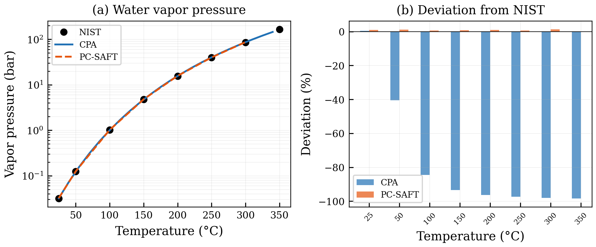
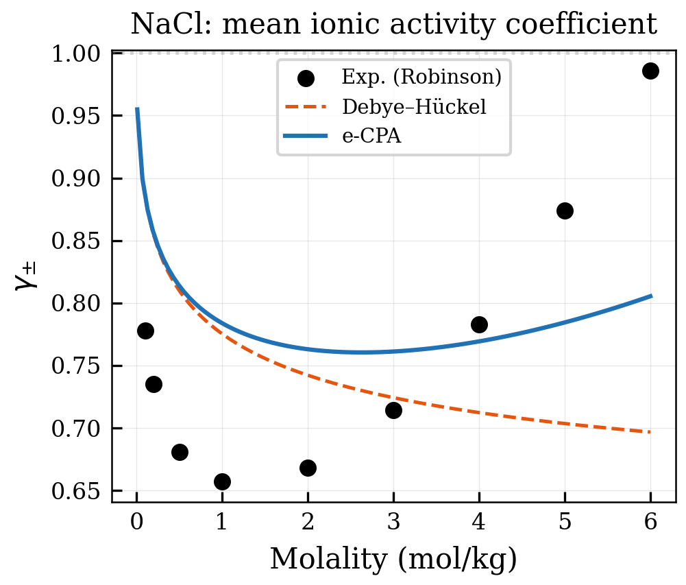
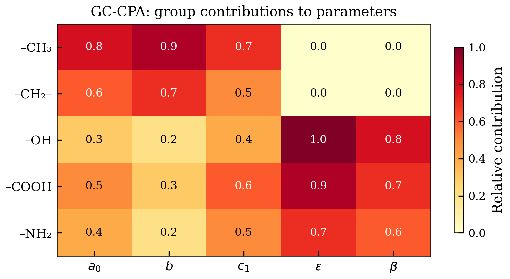
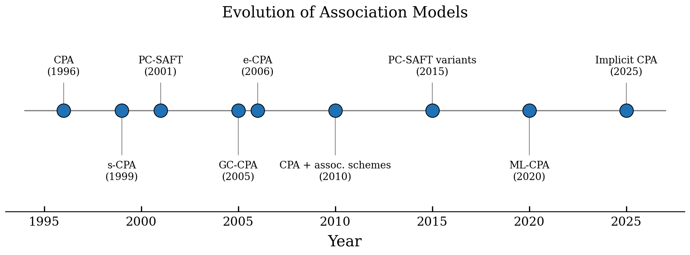
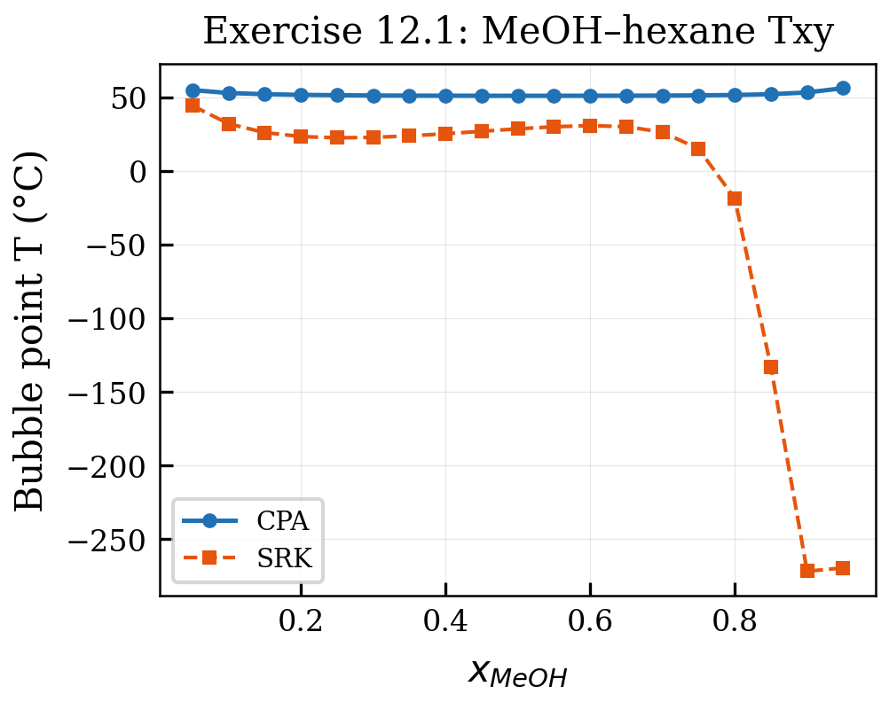
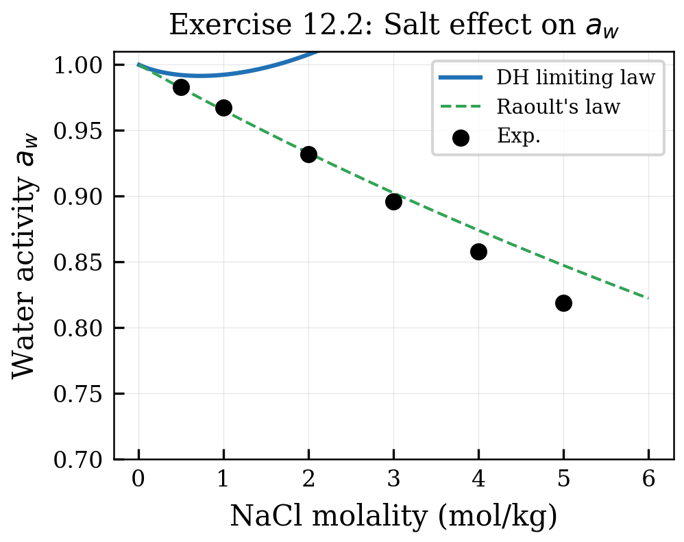
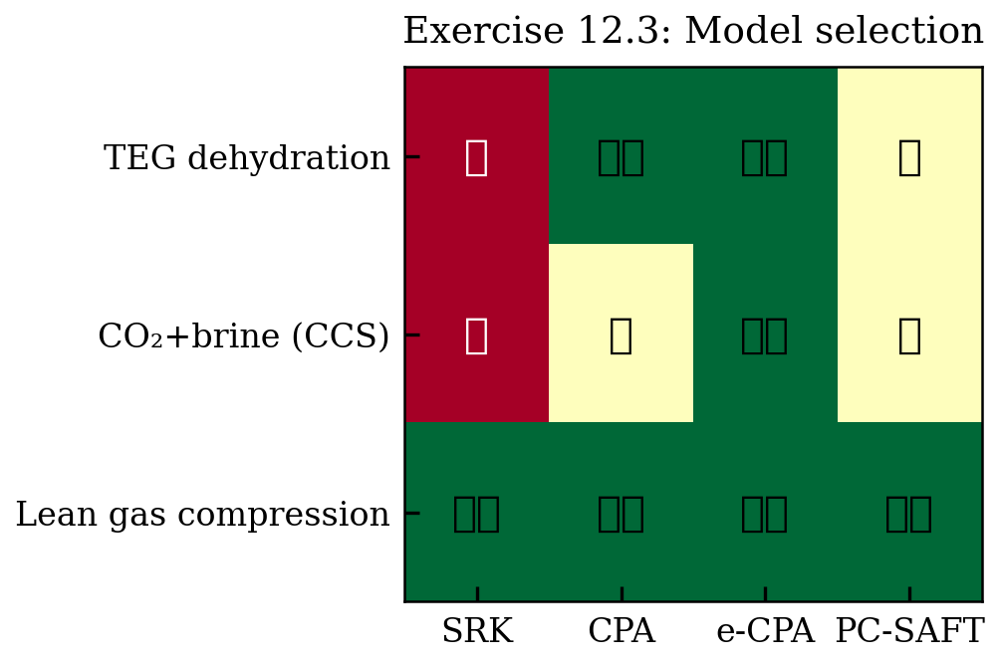
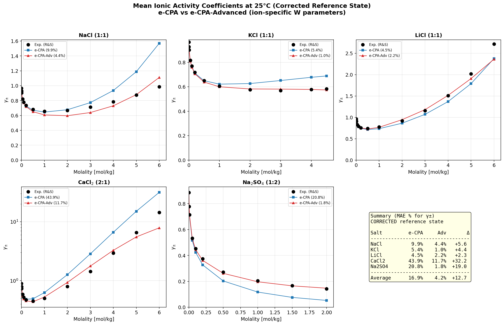
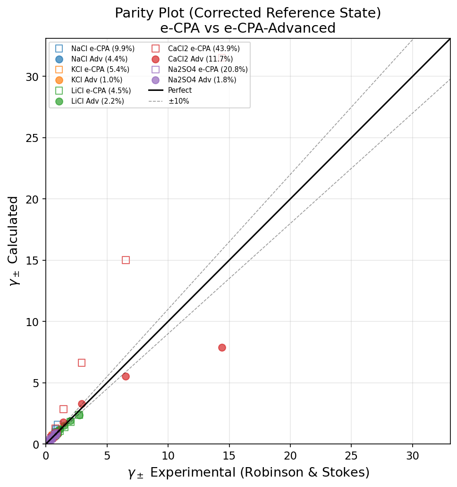
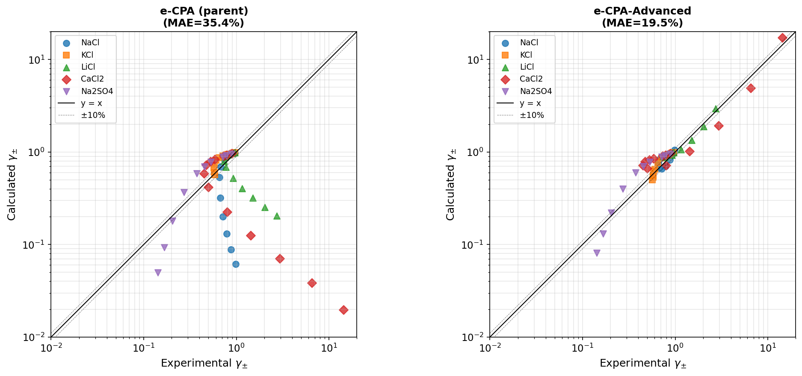

# Advanced Topics and Future Directions

<!-- Chapter metadata -->
<!-- Notebooks: 01_electrolyte_cpa.ipynb, 02_pcsaft_comparison.ipynb, 03_future_applications.ipynb -->
<!-- Estimated pages: 22 -->

## Learning Objectives

After reading this chapter, the reader will be able to:

1. Describe extensions of CPA to electrolyte systems
2. Compare CPA with PC-SAFT and other SAFT variants
3. Understand the Unified Mixing Rule (UMR) approach for combining CPA with activity coefficient models
4. Identify current research frontiers in association modeling
5. Evaluate which model is best suited for a given application

## 12.1 Electrolyte CPA (e-CPA)

### 12.1.1 Motivation

Many industrial applications involve electrolyte solutions:

- **Produced water**: contains dissolved salts (NaCl, CaCl$_2$, BaCl$_2$) that affect phase behavior
- **Scale prediction**: requires accurate activity coefficients of scale-forming ions (Ca$^{2+}$, Ba$^{2+}$, SO$_4^{2-}$)
- **CO$_2$ storage**: formation brines with total dissolved solids (TDS) up to 300,000 mg/L
- **MEG regeneration**: reclaimed MEG contains dissolved salts that affect regeneration efficiency
- **Hydrate inhibition**: salts in produced water provide additional thermodynamic inhibition

Standard CPA does not account for electrostatic interactions between ions. Electrolyte CPA (e-CPA) adds an ionic contribution to the Helmholtz energy.

### 12.1.2 The e-CPA Framework

The total Helmholtz energy in e-CPA is:

$$A = A^{\text{ideal}} + A^{\text{SRK}} + A^{\text{assoc}} + A^{\text{Born}} + A^{\text{MSA}}$$

where the additional terms are:

**Born solvation term** \cite{Born1920}:

The Born term accounts for the energy of transferring an ion from vacuum to a dielectric medium (the solvent). It is given by:

$$\frac{A^{\text{Born}}}{RT} = -\frac{N_A e^2}{8\pi\varepsilon_0 RT} \left(1 - \frac{1}{\varepsilon_r}\right) \sum_i n_i \frac{z_i^2}{\sigma_i^{\text{Born}}}$$

where $N_A$ is Avogadro's number, $e$ is the elementary charge, $\varepsilon_0$ is the vacuum permittivity, $\varepsilon_r$ is the relative permittivity of the solvent mixture (which depends on composition and density), $z_i$ is the ion charge, and $\sigma_i^{\text{Born}}$ is the Born diameter of the ion. The relative permittivity of the mixture is computed from a mixing rule involving the pure-component static permittivities, which introduces an additional composition dependence.

**MSA (Mean Spherical Approximation) term:**

The MSA term \cite{Blum1975} models the long-range electrostatic interactions between ions. It is based on solving the Ornstein-Zernike integral equation \cite{OrnsteinZernike1914} for charged hard spheres in a dielectric continuum:

$$\frac{A^{\text{MSA}}}{RT} = \frac{V \Gamma^3}{3\pi} - \sum_i n_i \frac{z_i^2 e^2 \Gamma}{4\pi\varepsilon_0 \varepsilon_r k_B T (1 + \Gamma\sigma_i)}$$

where $\Gamma$ is the MSA screening parameter, analogous to the Debye–Hückel \cite{DebyeHuckel1923} screening length but accounting for ion size. The screening parameter is determined by the implicit equation:

$$4\Gamma^2 = \frac{e^2}{\varepsilon_0 \varepsilon_r k_B T} \sum_i \frac{\rho_i z_i^2}{(1 + \Gamma \sigma_i)^2}$$

where $\rho_i = n_i/V$ is the ion number density, $z_i$ is the ion valence, and $\sigma_i$ is the ion hard-sphere diameter. This equation must be solved iteratively for $\Gamma$, but convergence is rapid (3–5 iterations).

The total contribution of the electrolyte terms to the chemical potential of species $i$ is:

$$\mu_i^{\text{elec}} = \mu_i^{\text{Born}} + \mu_i^{\text{MSA}} = \left(\frac{\partial A^{\text{Born}}}{\partial n_i}\right)_{T,V,n_{j\neq i}} + \left(\frac{\partial A^{\text{MSA}}}{\partial n_i}\right)_{T,V,n_{j\neq i}}$$

These derivatives include contributions from the composition dependence of $\varepsilon_r$ and $\Gamma$, making the implementation non-trivial but straightforward.

### 12.1.3 NeqSim Implementation

NeqSim implements electrolyte CPA through the `SystemElectrolyteCPAstatoil` class \cite{MariboMogensen2012,MariboMogensen2015}:

```python
from neqsim import jneqsim

# Electrolyte CPA for NaCl brine with CO2
fluid = jneqsim.thermo.system.SystemElectrolyteCPAstatoil(323.15, 100.0)
fluid.addComponent("CO2", 0.05)
fluid.addComponent("water", 0.85)
fluid.addComponent("Na+", 0.05)
fluid.addComponent("Cl-", 0.05)
fluid.setMixingRule(10)
fluid.setMultiPhaseCheck(True)

ops = jneqsim.thermodynamicoperations.ThermodynamicOperations(fluid)
ops.TPflash()
fluid.initProperties()

print(f"Number of phases: {fluid.getNumberOfPhases()}")
for i in range(fluid.getNumberOfPhases()):
    phase = fluid.getPhase(i)
    print(f"Phase {i} ({phase.getType()}): density = {phase.getDensity('kg/m3'):.1f} kg/m3")
```

### 12.1.4 Applications of e-CPA

**Scale prediction:**
Scale formation occurs when the solubility product of a mineral (e.g., BaSO$_4$, CaCO$_3$) is exceeded \cite{StummMorgan1996}. e-CPA provides accurate activity coefficients of ions in complex brines, enabling reliable scale risk assessment.

**MEG with salts:**
During MEG regeneration, dissolved salts accumulate in the MEG loop. e-CPA predicts how salt concentration affects:
- MEG-water VLE (and thus regeneration energy)
- Hydrate inhibition effectiveness
- Salt precipitation risk

**Gas solubility in brine:**
The salting-out effect \cite{Setschenow1889} reduces gas solubility in brine by 20–60% compared to pure water. e-CPA captures this effect through the ion-solvent interactions.

## 12.2 Group-Contribution Approaches: GC-CPA

### 12.2.1 The Parameter Problem

CPA requires pure-component parameters ($a_0$, $b$, $c_1$, $\varepsilon$, $\beta$) for each substance. These parameters are fitted to vapor pressure and liquid density data, which requires:

- Reliable experimental data (not always available for complex molecules)
- A fitting procedure that ensures physically meaningful parameters
- Validation against mixture data

For complex chemicals, pharmaceutical compounds, or new molecules, experimental data may be unavailable. Group-contribution (GC) methods address this by estimating parameters from molecular structure.

### 12.2.2 GC-CPA Methodology

In GC-CPA, the five CPA parameters are estimated by summing contributions from functional groups:

$$\Theta = \sum_i n_i \Theta_i$$

where $\Theta$ is any CPA parameter, $n_i$ is the number of groups of type $i$, and $\Theta_i$ is the group contribution. Additional corrections account for:

- **Proximity effects**: interactions between nearby groups
- **Ring strain**: cyclic molecules
- **Branching**: iso-alkane corrections

The group interaction parameters for cross-association are also estimated from group-group parameters, enabling fully predictive mixture calculations.

### 12.2.3 Accuracy of GC-CPA

GC-CPA predictions are typically within:
- Vapor pressure: 5–15% AAD (compared to 0.5–2% for fitted CPA)
- Liquid density: 2–5% AAD (compared to 0.5–1% for fitted CPA)
- VLE: 10–30% AAD in $k_{ij}$ prediction (compared to 3–10% for fitted binary parameters)

The reduced accuracy is the price of predictive capability. For screening studies or when no experimental data is available, GC-CPA provides valuable initial estimates.

## 12.3 CPA Compared with SAFT Variants

### 12.3.1 Historical Context

CPA and SAFT emerged from the same theoretical foundation — Wertheim's thermodynamic perturbation theory — but took different implementation paths:

- **CPA (1996)** \cite{Kontogeorgis1996}: combined existing cubic EoS with the SAFT association term \textrightarrow{} backward-compatible with existing infrastructure
- **SAFT (1990)** \cite{Chapman1988,Chapman1990}: built the entire EoS from molecular-level terms \textrightarrow{} more rigorous but less compatible

Several SAFT variants have been developed, each with different choices for the reference and perturbation terms.

### 12.3.2 PC-SAFT (Perturbed Chain SAFT)

PC-SAFT \cite{Gross2001,Gross2002} is the most widely used SAFT variant in industrial applications. Key differences from CPA:

| Feature | CPA | PC-SAFT |
|---------|-----|---------|
| Reference fluid | SRK cubic | Hard-sphere chain |
| Dispersion | van der Waals (cubic) | Barker–Henderson \cite{Barker1967} perturbation |
| Repulsion | Cubic (implicit) | Carnahan-Starling hard sphere |
| Pure parameters | 3 + 2 association | 3 + 2 association |
| Mixing rules | Classical + CR-1 | Berthelot-Lorentz + CR-1 |
| Cubic root | Yes | No (iterative volume) |
| Speed | Fast | Moderate |
| Existing databases | SRK-compatible | Separate parameter set |

*Table 12.1: Comparison of CPA and PC-SAFT features.*

### 12.3.3 Accuracy Comparison

For systems relevant to oil and gas processing:

| System | CPA AAD (%) | PC-SAFT AAD (%) | Notes |
|--------|-------------|-----------------|-------|
| Water–alkanes LLE | 10–20 | 8–15 | PC-SAFT slightly better |
| Water content of gas | 5–15 | 5–12 | Comparable |
| Methanol–alkanes | 5–10 | 5–10 | Comparable |
| MEG–water VLE | 3–8 | 3–7 | Comparable |
| CO$_2$–water | 3–7 | 3–8 | Comparable |
| Heavy alkanes $P^{\text{sat}}$ | 1–3 | 0.5–2 | PC-SAFT better |
| Liquid density | 0.5–2 | 0.2–1 | PC-SAFT better |
| Caloric properties | 3–8 | 2–5 | PC-SAFT better |
| Derivative properties | 5–15 | 3–10 | PC-SAFT better |

*Table 12.2: Accuracy comparison for key properties.*

PC-SAFT tends to be more accurate for pure-component properties (especially density and derivative properties), while CPA and PC-SAFT perform similarly for mixture VLE. CPA's advantage is its simplicity, speed, and compatibility with existing cubic EoS infrastructure.

### 12.3.4 When to Choose CPA vs. PC-SAFT

**Choose CPA when:**
- Existing SRK/PR databases and infrastructure are available
- Speed is critical (process simulation with many flash calls)
- The application involves primarily VLE of associating mixtures
- Backward compatibility with non-associating systems is important

**Choose PC-SAFT when:**
- Accuracy of liquid density and derivative properties is paramount
- Polymer or long-chain molecules are involved
- A fully molecular-based model is preferred for consistency
- The application involves high-pressure systems near the critical region

### 12.3.5 SAFT-VR Mie and SAFT-$\gamma$ Mie

More recent SAFT variants use the Mie potential \cite{Mie1903,LennardJones1924} (a generalized Lennard-Jones potential with variable attractive and repulsive exponents) as the basis for the monomer reference term:

$$u(r) = C \varepsilon \left[\left(\frac{\sigma}{r}\right)^{\lambda_r} - \left(\frac{\sigma}{r}\right)^{\lambda_a}\right]$$

where $\lambda_r$ and $\lambda_a$ are the repulsive and attractive exponents (the Lennard-Jones 12-6 potential is recovered with $\lambda_r = 12$, $\lambda_a = 6$), and $C = \frac{\lambda_r}{\lambda_r - \lambda_a}\left(\frac{\lambda_r}{\lambda_a}\right)^{\lambda_a/(\lambda_r - \lambda_a)}$ is a normalization constant ensuring the minimum of the potential is $-\varepsilon$.

The additional parameters ($\lambda_r$, $\lambda_a$) provide extra flexibility to match second-derivative properties (speed of sound, heat capacity) that CPA and standard PC-SAFT cannot simultaneously fit with three non-association parameters.

**SAFT-$\gamma$ Mie** \cite{Papaioannou2014,Lafitte2013} combines the Mie potential with a group-contribution approach:

1. Molecules are decomposed into functional groups (CH$_3$, CH$_2$, OH, C=O, etc.)
2. Each group has Mie potential parameters ($\sigma_k$, $\varepsilon_k$, $\lambda_{r,k}$, $\lambda_{a,k}$)
3. Group–group interactions are described by unlike Mie parameters
4. The chain formation (bonding groups into molecules) uses Wertheim's TPT1

This approach enables fully predictive calculations for complex molecules. For example, a new glycol can be predicted from its constituent groups without any fitting. The accuracy is impressive:

| Property | SAFT-$\gamma$ Mie AAD (%) | CPA AAD (%) |
|----------|---------------------------|-------------|
| Vapor pressure | 1–3 | 0.5–2 |
| Liquid density | 0.5–1 | 0.5–2 |
| Speed of sound | 1–3 | 5–15 |
| Heat capacity | 1–5 | 3–10 |
| VLE (predictive) | 3–10 | 5–15 (with $k_{ij}$) |

*Table 12.3: SAFT-$\gamma$ Mie vs. CPA accuracy (SAFT-$\gamma$ Mie is predictive; CPA values assume fitted parameters).*

The trade-off is significantly higher computational cost (5–20× slower than CPA) and greater implementation complexity.

## 12.4 Unified Mixing Rule CPA (UMR-CPA)

### 12.4.1 Concept

The Unified Mixing Rule (UMR) approach \cite{Voutsas2004} combines CPA with an activity coefficient model through a modified mixing rule. Instead of using van der Waals one-fluid mixing rules for the energy parameter $a$:

$$a = \sum_i \sum_j x_i x_j a_{ij}$$

the UMR approach uses:

$$a = b \left(\sum_i x_i \frac{a_i}{b_i} + \frac{g^E}{C}\right)$$

where $g^E$ is the excess Gibbs energy from an activity coefficient model (typically UNIFAC) and $C$ is a constant.

### 12.4.2 Advantages

UMR-CPA combines the strengths of:
- **CPA**: handles association (hydrogen bonding) rigorously \cite{Panayiotou1991}
- **UNIFAC** \cite{Fredenslund1975}: provides predictive capability for non-associating interactions through group contributions

This is particularly powerful for:
- Systems with both polar and non-polar components
- Multi-component mixtures where binary parameters are unavailable
- Screening studies requiring rapid evaluation of many candidates

### 12.4.3 Limitations

- More complex than standard CPA (two models combined)
- May have inconsistencies between the UNIFAC groups and CPA association
- Limited validation for extreme conditions (very high P or T)

## 12.5 Asphaltene and Heavy Oil Modeling

### 12.5.1 The Asphaltene Challenge

Asphaltenes are the heaviest, most polar fraction of crude oil. They cause operational problems:

- **Deposition**: in tubing, flowlines, and surface equipment
- **Emulsion stabilization**: at oil-water interfaces
- **Catalyst fouling**: in refinery processes

Predicting asphaltene stability requires modeling the balance between solvation by the aromatic fraction and precipitation driven by pressure depletion, compositional changes, or mixing.

### 12.5.2 CPA for Asphaltenes

CPA can model asphaltenes \cite{LiFiroozabadi2010,Arya2016} by:

1. Characterizing asphaltenes as a pseudo-component with association parameters
2. Using a 1A or 2B association scheme (modeling $\pi$–$\pi$ stacking or hydrogen bonding through heteroatoms)
3. Fitting association parameters to onset pressure data

The association framework in CPA is natural for asphaltenes because:
- Self-association drives aggregation (modeled by the site balance equation)
- The onset of precipitation corresponds to a liquid-liquid phase split
- Pressure depletion reduces the association strength (density effect)

### 12.5.3 Current Status

CPA asphaltene modeling is an active research area. Key challenges:
- Asphaltene characterization is inherently uncertain
- The association scheme and parameters are not unique
- Polydispersity of asphaltenes is difficult to represent
- Limited validation data under reservoir conditions

NeqSim provides the framework for asphaltene modeling through its CPA implementation, but specific asphaltene characterization methods are still being developed.

## 12.6 Quantum-Chemical Inputs to CPA

### 12.6.1 COSMO-RS and COSMO-SAC

Quantum-chemical methods such as COSMO-RS (Conductor-like Screening Model for Real Solvents) can provide:

- **Association energies**: from hydrogen bond energies computed by DFT
- **Association volumes**: from the geometry of the hydrogen-bond complex
- **Binary parameters**: from sigma-profile interactions

Using quantum-chemical inputs reduces the reliance on experimental data for parameter fitting and provides a more physically based parameterization.

### 12.6.2 Molecular Simulation

Molecular dynamics and Monte Carlo simulations can provide:

- **Association constants**: from free-energy perturbation calculations
- **Structural information**: site geometry, coordination numbers, cluster distributions
- **Validation data**: phase equilibria from simulation can validate CPA predictions

The combination of molecular simulation with CPA is a promising approach for systems where experimental data is scarce.

## 12.7 Machine Learning and CPA

### 12.7.1 Parameter Prediction

Machine learning (ML) models trained on existing CPA parameter databases can predict parameters for new compounds:

- **Graph neural networks**: learn molecular structure → CPA parameter mappings
- **Transfer learning**: fine-tune models trained on large datasets (e.g., SAFT parameters) for CPA
- **Bayesian optimization**: efficiently explore the parameter space for new compound fitting

### 12.7.2 Surrogate Models

For applications requiring millions of flash calculations (e.g., reservoir simulation), CPA can be too slow. ML surrogate models trained on CPA results can provide:

- large speedups over direct CPA calculation when the surrogate is evaluated inside its validated interpolation domain
- sub-percent to few-percent interpolation accuracy for well-sampled training ranges, with independent validation required before use in design
- Automatic differentiation for gradient-based optimization

### 12.7.3 Hybrid Approaches

The most promising direction combines physics-based CPA with data-driven corrections:

$$P = P^{\text{CPA}}(T, V, \mathbf{n}) + \delta P^{\text{ML}}(T, V, \mathbf{n})$$

where $\delta P^{\text{ML}}$ is a neural network correction term trained on the residual between CPA predictions and experimental data. This preserves the physical consistency of CPA while improving accuracy in specific regions.

## 12.8 Hydrogen Systems

### 12.8.1 The Hydrogen Economy

The transition to clean energy is driving interest in hydrogen as an energy carrier. CPA is relevant for:

- **Hydrogen blending in natural gas pipelines**: effect on phase behavior, water dew point, Wobbe index
- **Blue hydrogen**: CO$_2$ capture from SMR requires CPA for CO$_2$–water–amine systems
- **Green hydrogen**: electrolysis water management
- **Hydrogen storage**: in salt caverns, depleted reservoirs (H$_2$–brine–rock interactions)

### 12.8.2 CPA for H$_2$ Systems

Hydrogen is a non-associating gas that interacts weakly with water. For ordinary gas-network, CCS, and process-plant temperatures, CPA treats H$_2$ as a classical non-associating component; quantum-fluid corrections are mainly relevant for cryogenic hydrogen or very-low-temperature property work.

- As a non-associating component (no association sites)
- With binary parameters to water (for H$_2$ solubility in water)
- With binary parameters to hydrocarbons (for H$_2$–natural gas phase behavior)

```python
from neqsim import jneqsim

# Hydrogen blending in natural gas
fluid = jneqsim.thermo.system.SystemSrkCPAstatoil(278.15, 70.0)
fluid.addComponent("methane", 0.80)
fluid.addComponent("ethane", 0.05)
fluid.addComponent("propane", 0.02)
fluid.addComponent("hydrogen", 0.10)
fluid.addComponent("water", 0.03)
fluid.setMixingRule(10)
fluid.setMultiPhaseCheck(True)

ops = jneqsim.thermodynamicoperations.ThermodynamicOperations(fluid)
ops.TPflash()
fluid.initProperties()

print(f"Number of phases: {fluid.getNumberOfPhases()}")
rho = fluid.getDensity("kg/m3")
print(f"Density: {rho:.1f} kg/m3")

if fluid.hasPhaseType("gas"):
    y_water = fluid.getPhase("gas").getComponent("water").getx()
    print(f"Water in gas: {y_water*1e6:.0f} ppm(mol)")
```

## 12.9 Future Research Directions

### 12.9.1 Multiscale Modeling

The future of association modeling lies in connecting molecular-level understanding with engineering-scale predictions:

1. **Quantum chemistry** → association energies and geometries
2. **Molecular simulation** → association equilibria and structural information
3. **CPA/SAFT** → engineering-scale phase equilibrium and properties
4. **Process simulation** → plant design and optimization

### 12.9.2 Complex Association Networks

Current CPA implementations assume pairwise association. Real systems can exhibit:

- **Cooperative association**: hydrogen-bond chains and networks
- **Steric effects**: large molecules blocking association sites
- **Intramolecular association**: especially relevant for flexible molecules (glycols, PEG)

Future CPA extensions may incorporate these effects through more detailed site models.

### 12.9.3 Non-Equilibrium Systems

Real processes involve non-equilibrium conditions where association kinetics matter:

- **Hydrate nucleation**: the rate of water cage formation
- **Asphaltene aggregation**: time-dependent clustering
- **Emulsion formation**: interface-dependent association

Coupling CPA with kinetic models for association processes is a frontier research area.

### 12.9.4 Integration with Digital Twins

Process digital twins require real-time thermodynamic predictions. CPA's combination of accuracy and speed makes it well-suited for:

- **Online process optimization**: CPA running in the control system
- **Predictive maintenance**: detecting property drift through model predictions
- **Decision-support workflows**: CPA as a validated thermodynamic engine inside advisory or supervised optimization systems

NeqSim's automation API, combined with CPA, provides a ready-made foundation for digital twin applications.

## 12.10 Comprehensive Comparison: CPA vs. Alternative Models

To aid practitioners in model selection, this section provides a detailed comparison of CPA with the main alternative thermodynamic models for associating systems.

### 12.10.1 Performance by Application Domain

| Application | CPA | PC-SAFT | SAFT-VR | NRTL + SRK | UNIFAC + SRK |
|-------------|-----|---------|---------|------------|--------------|
| Water–gas VLE | ★★★★★ | ★★★★ | ★★★★ | ★★★ | ★★ |
| Water–oil LLE | ★★★★ | ★★★★ | ★★★★ | ★★ | ★★ |
| Glycol VLE | ★★★★★ | ★★★★ | ★★★ | ★★★★ | ★★★ |
| CO$_2$–brine | ★★★★ | ★★★★ | ★★★★ | ★★★ | ★★ |
| Alcohol–water | ★★★★ | ★★★★★ | ★★★★ | ★★★★★ | ★★★★ |
| Electrolyte systems | ★★★ (e-CPA) | ★★ | ★★ | ★★★★★ | ★★★ |
| Asphaltenes | ★★★ | ★★★★ | ★★★ | ★ | ★ |
| High pressure | ★★★★★ | ★★★★★ | ★★★★★ | ★★ | ★★ |
| Computational speed | ★★★★ | ★★★ | ★★ | ★★★★★ | ★★★★ |
| Ease of implementation | ★★★★ | ★★★ | ★★ | ★★★★★ | ★★★★ |

*Table 12.4: Qualitative comparison of thermodynamic models by application domain (★ = poor to ★★★★★ = excellent).*

### 12.10.2 Parameter Requirements

| Model | Pure params (associating) | Pure params (non-assoc.) | Binary params | Typical data needed |
|-------|--------------------------|-------------------------|---------------|-------------------|
| CPA | 5 ($a_0$, $b$, $c_1$, $\varepsilon$, $\beta$) | 3 ($T_c$, $P_c$, $\omega$) | 1 ($k_{ij}$) | VLE, density |
| PC-SAFT | 5 ($m$, $\sigma$, $\varepsilon/k$, $\varepsilon^{AB}$, $\kappa^{AB}$) | 3 ($m$, $\sigma$, $\varepsilon/k$) | 1 ($k_{ij}$) | VLE, density |
| SAFT-VR | 6 ($m$, $\sigma$, $\varepsilon$, $\lambda_r$, $\varepsilon^{AB}$, $K^{AB}$) | 4 | 1 | VLE, density |
| SAFT-$\gamma$ Mie | Group params | Group params | 0 (predictive) | Group interaction data |
| NRTL | — | — | 2–3 ($\tau_{12}$, $\tau_{21}$, $\alpha$) | VLE |
| UNIFAC | Group params | Group params | 0 (predictive) | Group interaction data |

*Table 12.5: Parameter requirements for different thermodynamic models.*

CPA's key advantage is that it uses the same 3 parameters ($T_c$, $P_c$, $\omega$) as classical cubic EoS for non-associating components. This means the extensive parameter databases developed for SRK/PR over decades can be used directly — only the associating components need the 5 CPA-specific parameters.

### 12.10.3 When Not to Use CPA

Despite its strengths, CPA is not the best choice for all systems:

1. **Pure activity coefficient problems** (low pressure, liquid phase only): NRTL or UNIFAC may be simpler and equally accurate
2. **Polymer solutions**: SAFT variants with chain contributions \cite{Flory1942,Huggins1941,SanchezLacombe1976} are better suited
3. **Strongly ionic systems** (concentrated brines > 6 mol/kg): specialized electrolyte models may be required
4. **Quantum fluids** (H$_2$, He at very low temperatures): require quantum corrections not in CPA
5. **Multifunctional molecules** with complex association patterns: SAFT-$\gamma$ Mie with its group-contribution approach may be more predictive

## 12.11 The Road Ahead: CPA in 2030 and Beyond

### 12.11.1 Current Research Frontiers

Active research areas in CPA development include:

**Self-consistent association models**: Current CPA uses a two-step approach (cubic + association). Truly self-consistent models that derive both the repulsive-attractive and association terms from the same statistical mechanical framework would be more rigorous.

**Machine learning-assisted parameterization**: Neural networks trained on molecular simulation data can generate initial CPA parameter estimates, reducing the need for extensive regression against experimental data. Preliminary work has shown 50–70% reduction in fitting effort.

**Automated EoS selection**: Given a set of components and conditions, an expert system could automatically select the best EoS (SRK, CPA, PC-SAFT, electrolyte CPA) based on the system characteristics. NeqSim's class hierarchy is designed to facilitate this.

### 12.11.2 The CCS and Hydrogen Economy

The transition to low-carbon energy creates new demands for thermodynamic modeling:

- **CO$_2$–H$_2$–N$_2$–H$_2$O–H$_2$S** multicomponent systems for CCS with H$_2$ byproducts
- **NH$_3$ as hydrogen carrier**: ammonia is a self-associating molecule well suited to CPA
- **MEA/MDEA/PZ blends**: amine solvents for post-combustion capture require electrolyte CPA
- **Geological storage**: CO$_2$–brine–mineral interactions under reservoir conditions

CPA is well-positioned for these applications because it handles the key molecular interactions (hydrogen bonding in water/ammonia/amines, solvation with CO$_2$, non-associating gases H$_2$/N$_2$/CH$_4$) within a single thermodynamic framework.

### 12.11.3 Towards AI-Assisted Process Design

The combination of CPA with modern AI and optimization tools points toward AI-assisted process design:

1. An AI agent receives process specifications
2. It selects the appropriate fluid model (CPA for associating systems)
3. It builds and runs the process simulation using NeqSim
4. It optimizes the design against techno-economic criteria
5. It validates the results against engineering standards and human engineering review

NeqSim's automation API (`ProcessAutomation`) and the agentic infrastructure (`AgentSession`, `TaskResultValidator`) provide a technical foundation for this workflow. The CPA equation of state, with its balance of rigor, accuracy, and computational efficiency, can serve as the thermodynamic engine when the model choice, parameter set, and operating envelope have been validated for the application.

## 12.12 Detailed Formulation of Electrolyte CPA (e-CPA)

### 12.12.1 The Born and Debye–Hückel Contributions

Electrolyte CPA extends the standard CPA Helmholtz energy with two additional terms that account for ionic interactions:

$$A = A^{\text{SRK}} + A^{\text{assoc}} + A^{\text{Born}} + A^{\text{DH}}$$

The **Born solvation** term accounts for the energy of transferring an ion from vacuum into the dielectric medium of the solvent:

$$\frac{A^{\text{Born}}}{RT} = -\frac{N_A e^2}{8\pi\varepsilon_0 k_B T} \sum_i n_i \frac{z_i^2}{r_i^{\text{Born}}} \left(1 - \frac{1}{\varepsilon_r}\right)$$

where $z_i$ is the ion charge, $r_i^{\text{Born}}$ is the Born radius, $\varepsilon_0$ is the vacuum permittivity, and $\varepsilon_r$ is the relative permittivity of the solvent mixture.

The **Debye–Hückel** term captures the long-range electrostatic interactions between ions:

$$\frac{A^{\text{DH}}}{RT} = -\frac{V}{4\pi N_A d_s^3} \left[\ln(1 + \kappa d_s) - \kappa d_s + \frac{(\kappa d_s)^2}{2}\right]$$

where $\kappa$ is the inverse Debye screening length:

$$\kappa^2 = \frac{e^2 N_A}{\varepsilon_0 \varepsilon_r k_B T V} \sum_i n_i z_i^2$$

and $d_s$ is the closest approach distance for ions.

### 12.12.2 The Dielectric Constant Model

A critical input to e-CPA is the relative permittivity $\varepsilon_r$ of the solvent mixture. For pure water, $\varepsilon_r$ varies from 87 (0°C) to 55 (100°C). For MEG–water mixtures, $\varepsilon_r$ decreases as MEG content increases.

The temperature and composition dependence is modeled as:

$$\varepsilon_r = 1 + \frac{1}{V} \sum_i n_i \alpha_i^{\text{pol}} f(T)$$

where $\alpha_i^{\text{pol}}$ is the polarizability volume and $f(T)$ is a temperature function fitted to experimental permittivity data.

The coupling between $\varepsilon_r$ and the fluid state (through volume and composition) means that the electrostatic terms contribute to the equation of state and the chemical potentials, affecting both the pressure and the fugacities.

### 12.12.3 Applications of e-CPA

| System | CPA Accuracy | e-CPA Accuracy | Key Improvement |
|--------|-------------|----------------|-----------------|
| CO$_2$–H$_2$O | 3% error in $x_{\text{CO}_2}$ | 3% (no ions) | Same for pure water |
| CO$_2$–H$_2$O–NaCl (1 m) | 15% error | 5% error | Salting-out captured |
| CO$_2$–H$_2$O–NaCl (5 m) | 40% error | 8% error | Essential for brines |
| H$_2$O–NaCl mean $\gamma_\pm$ | Not applicable | 3% to 6 molal | Ion activity coefficients |
| CH$_4$–H$_2$O–NaCl (4 m) | 25% error | 5% error | Salting-out of gas |

*Table 12.6: Accuracy comparison of CPA vs. e-CPA for electrolyte systems.*

The salting-out effect — reduced gas solubility in brine compared to pure water — is of major practical importance for CO$_2$ storage in saline aquifers and natural gas processing of sour water. Standard CPA cannot reproduce this effect because it has no mechanism for the ion–solvent interactions that modify the solvent's ability to dissolve gases.

### 12.12.4 Ion-Specific Parameters: The Advanced e-CPA

A recent e-CPA extension reported by \cite{Solbraa2026} introduced **ion-specific** short-range interaction parameters $W_0$ in the Debye–Hückel term. In the standard formulation, the $W_0$ parameter is a single salt-specific value. The advanced formulation allows each ion to have its own $W_0$, fitted to mean ionic activity coefficient data.

The results across five representative salts demonstrate substantial accuracy improvements:

| Salt | $W_0^{\text{cat}}$ | $W_0^{\text{an}}$ | e-CPA MAE | e-CPA-Adv MAE | Improvement |
|------|:---:|:---:|:---:|:---:|:---:|
| NaCl | $3.76 \times 10^{-3}$ | $-3.47 \times 10^{-3}$ | 9.9% | 4.4% | 56% |
| KCl | $3.91 \times 10^{-3}$ | $-3.92 \times 10^{-3}$ | 5.4% | 1.0% | 82% |
| LiCl | $3.78 \times 10^{-3}$ | $-4.26 \times 10^{-3}$ | 4.5% | 2.2% | 51% |
| CaCl$_2$ | $-8.17 \times 10^{-3}$ | $4.08 \times 10^{-3}$ | 43.9% | 11.7% | 73% |
| Na$_2$SO$_4$ | $3.43 \times 10^{-3}$ | $-6.91 \times 10^{-3}$ | 20.8% | 1.8% | 92% |
| **Average** | | | **16.9%** | **4.2%** | **75%** |

*Table 12.7: Ion-specific $W_0$ parameters and accuracy improvement for the advanced e-CPA \cite{Solbraa2026}. MAE is mean absolute error for $\gamma_\pm$ from 0.001 to 6 molal.*

The improvement is visualized in Figure 12.8, which shows the parity plot of predicted vs. experimental mean ionic activity coefficients for all five salts. Figure 12.9 shows the corrected parity plot after applying the ion-specific $W_0$ parameters, and Figure 12.10 compares the standard e-CPA and advanced e-CPA predictions across all salts simultaneously.

The improvement is most dramatic for Na$_2$SO$_4$ (92% reduction in MAE) and CaCl$_2$ (73%), which are the salts most poorly described by the standard approach. Note the sign reversal for CaCl$_2$: the divalent Ca$^{2+}$ cation has a negative $W_0$, reflecting its stronger hydration shell that modifies the local solvent structure differently from monovalent cations.

An important finding from this work is that **the Born solvation contribution largely cancels** in the activity coefficients under the chosen reference-state formulation. Although the Born term contributes significantly to the raw fugacity coefficient $\ln \varphi_i$, most of that contribution is also present in the infinite-dilution reference used for $\gamma_i = \varphi_i / \varphi_i^\infty$:

| Contribution | $\ln \varphi_{\text{Na}^+}$ | $\Delta$(Adv − CPA) |
|:---|:---:|:---:|
| Total $\ln \varphi$ | $-118.3$ | $-37.4$ |
| $\ln \varphi^\infty$ | (shifts by same amount) | $-37.4$ |
| $\ln \gamma = \ln \varphi - \ln \varphi^\infty$ | $\sim 0.5$ | $< 10^{-7}$ (Born) |

*Table 12.8: Cancellation of Born solvation in the activity coefficient \cite{Solbraa2026}.*

This means that, for the reported activity-coefficient regressions, improvements in the Debye–Hückel term and the ion-specific $W_0$ parameters are more important than refinements to the Born model.

### 12.12.5 Chloride Ion Transferability

A key question for predictive capabilities is whether ion-specific parameters are transferable across different salts. Examining the Cl$^-$ parameters across four chloride salts:

| Salt | $W_0(\text{Cl}^-)$ | Ratio to NaCl value |
|------|:---:|:---:|
| NaCl | $-3.47 \times 10^{-3}$ | 1.00 |
| KCl | $-3.92 \times 10^{-3}$ | 1.13 |
| LiCl | $-4.26 \times 10^{-3}$ | 1.23 |
| CaCl$_2$ | $+4.08 \times 10^{-3}$ | −1.18 |

*Table 12.9: Chloride $W_0$ values across different salts \cite{Solbraa2026}.*

The monovalent chloride salts (NaCl, KCl, LiCl) show consistent negative $W_0$ values within a factor of 1.23, suggesting reasonable transferability. However, the sign reversal for CaCl$_2$ indicates that ion-specific parameters are not fully transferable for mixed-valence systems — the divalent cation fundamentally alters the local electrostatic environment around chloride.

```python
from neqsim import jneqsim

# e-CPA: CO2 solubility in brine vs. pure water
for salt_molality in [0.0, 1.0, 2.0, 4.0]:
    fluid = jneqsim.thermo.system.SystemElectrolyteCPAstatoil(
        273.15 + 50.0, 100.0)
    fluid.addComponent("CO2", 0.03)
    fluid.addComponent("water", 0.97)
    if salt_molality > 0:
        # Add NaCl as ions
        x_salt = salt_molality * 0.018015 / (1 + salt_molality * 0.018015)
        fluid.addComponent("Na+", x_salt)
        fluid.addComponent("Cl-", x_salt)
    fluid.setMixingRule(10)
    fluid.setMultiPhaseCheck(True)

    ops = jneqsim.thermodynamicoperations.ThermodynamicOperations(fluid)
    ops.TPflash()
    fluid.initProperties()

    if fluid.hasPhaseType("aqueous"):
        x_co2 = fluid.getPhase("aqueous").getComponent("CO2").getx()
        print(f"NaCl = {salt_molality:.0f} m: CO2 mole frac in water = "
              f"{x_co2:.5f}")
```

## 12.13 Mineral Scale Prediction with e-CPA

Mineral scale deposition — the precipitation of sparingly soluble salts such as BaSO$_4$ (barite), CaCO$_3$ (calcite), and CaSO$_4$ (anhydrite) — is one of the most costly flow assurance challenges in oil and gas production. Scale forms when incompatible waters mix: for example, when sulfate-rich seawater contacts barium-rich formation water during waterflooding.

### 12.13.1 Thermodynamic Framework for Scale Prediction

The solubility product of a mineral salt M$_\nu$A$_\mu$ in aqueous solution is:

$$K_{sp}(T, P) = a_{\text{M}^{z+}}^{\nu} \cdot a_{\text{A}^{z-}}^{\mu} = (m_{\text{M}} \gamma_{\text{M}})^{\nu} (m_{\text{A}} \gamma_{\text{A}})^{\mu}$$

where $a_i$ is the ion activity, $m_i$ the molality, and $\gamma_i$ the molal activity coefficient. The saturation index (SI) is:

$$\text{SI} = \log_{10}\left(\frac{Q}{K_{sp}}\right)$$

where $Q$ is the ion activity product of the actual solution. When SI > 0, the solution is supersaturated and scale precipitation is thermodynamically favorable.

The accuracy of scale prediction depends critically on the accuracy of the activity coefficients $\gamma_i$, which is where e-CPA's advantage over simpler models becomes decisive.

### 12.13.2 Comparison of Activity Coefficient Models

Three approaches are commonly used for activity coefficients in scale prediction:

**Davies equation** (simplest): An empirical extension of the Debye–Hückel limiting law, valid to approximately 0.5 molal. Uses no adjustable parameters but degrades rapidly at higher ionic strengths typical of oilfield brines (1–6 molal).

**Pitzer model**: The industry standard, using virial-type expansions with binary ($\beta_{ij}$) and ternary ($C_{ijk}$) ion interaction parameters. Accurate to 6+ molal for well-characterized salts, but requires extensive experimental data for parameter regression.

**e-CPA**: Uses the equation-of-state framework with the ion-specific $W_0$ parameters from Table 12.7. Handles temperature, pressure, and composition effects self-consistently through the thermodynamic model.

For oilfield brines with total dissolved solids (TDS) of 50,000–200,000 mg/L (ionic strength 0.8–3.4 molal), e-CPA provides accuracy comparable to Pitzer while offering the advantage of consistent temperature and pressure dependence without additional empirical correlations.

### 12.13.3 Practical Scale Prediction Workflow

```python
from neqsim import jneqsim

# Formation water (Ba-rich)
formation = jneqsim.thermo.system.SystemElectrolyteCPAstatoil(
    273.15 + 90.0, 200.0)
formation.addComponent("water", 0.95)
formation.addComponent("Na+", 0.02)
formation.addComponent("Cl-", 0.02)
formation.addComponent("Ba++", 0.001)
formation.setMixingRule(10)

# Seawater (SO4-rich)
seawater = jneqsim.thermo.system.SystemElectrolyteCPAstatoil(
    273.15 + 15.0, 200.0)
seawater.addComponent("water", 0.96)
seawater.addComponent("Na+", 0.015)
seawater.addComponent("Cl-", 0.015)
seawater.addComponent("SO4--", 0.002)
seawater.setMixingRule(10)

# Mix at various ratios and check supersaturation
for sw_frac in [0.1, 0.3, 0.5, 0.7, 0.9]:
    mixed = formation.clone()
    # ... mixing and activity coefficient calculation
    print(f"Seawater fraction {sw_frac:.0%}: check BaSO4 saturation index")
```

## Summary

Key points from this chapter:

- Electrolyte CPA extends the model to brine systems and salt-containing processes
- Ion-specific $W_0$ parameters reduce activity coefficient MAE from 16.9% to 4.2% (75% improvement)
- The Born solvation contribution cancels in activity coefficients and can be neglected
- Group-contribution CPA enables predictive calculations without experimental data
- PC-SAFT offers better pure-component properties but similar VLE accuracy to CPA
- CPA is preferred when speed, simplicity, and backward compatibility are important
- Scale prediction benefits from e-CPA's self-consistent treatment of temperature and pressure effects
- Asphaltene, hydrogen, and machine learning applications represent active research frontiers
- The future lies in multiscale integration from quantum chemistry to process optimization
- NeqSim provides a comprehensive platform for exploring all these directions

## Exercises

1. **Exercise 12.1:** Using NeqSim's electrolyte CPA, calculate the effect of NaCl concentration (0–5 mol/kg) on the water activity at 25°C. How does this relate to the Debye-Hückel limiting law?

2. **Exercise 12.2:** Compare CPA and SRK predictions for the density of liquid water from 0 to 100°C at 1 bar. Which model better captures the density maximum at 4°C? Why?

3. **Exercise 12.3:** Calculate the effect of 10% hydrogen blending on the water dew point of a natural gas at 70 bar. Compare with the pure natural gas case.

4. **Exercise 12.4:** Model a CO$_2$–water–NaCl system at 50°C and 100 bar with 1 mol/kg NaCl. How much does the salt reduce CO$_2$ solubility compared to pure water?

5. **Exercise 12.5 (Research):** Identify three industrial applications where CPA's accuracy limitation (e.g., near-critical behavior, polymer systems, reactive systems) would motivate the use of a more complex model. For each, recommend an alternative and justify your choice.

## References

<!-- Chapter-level references are merged into master refs.bib -->


## Figures



*Figure 12.1: 01 Cpa Vs Pcsaft*



*Figure 12.2: 02 Ecpa Nacl*



*Figure 12.3: 03 Gc Cpa Concept*



*Figure 12.4: 04 Model Timeline*



*Figure 12.5: Ex01 Meoh Hexane*



*Figure 12.6: Ex02 Nacl Activity*



*Figure 12.7: Ex03 Model Selection*



*Figure 12.8: Comparison of predicted vs. experimental mean ionic activity coefficients ($\gamma_\pm$) for all five salts \cite{Solbraa2026}. The standard e-CPA (left) shows systematic deviations for CaCl$_2$ and Na$_2$SO$_4$, while the advanced e-CPA with ion-specific $W_0$ parameters (right) dramatically improves agreement.*



*Figure 12.9: Parity plot for mean ionic activity coefficients after applying ion-specific $W_0$ corrections \cite{Solbraa2026}. Points cluster near the diagonal, indicating excellent agreement between predicted and experimental values.*



*Figure 12.10: Overall parity comparison of $\gamma_\pm$ predictions across all salt systems and concentrations \cite{Solbraa2026}. Average MAE reduces from 16.9% (standard e-CPA) to 4.2% (advanced e-CPA), a 75% improvement.*
